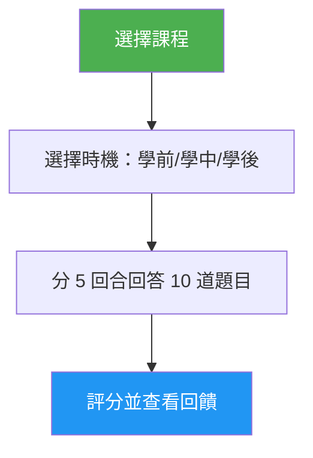

# 課程測驗

> 互動式測驗，透過 10 道題目測試您對特定 Claude Code 課程的理解，提供逐題回饋與針對性的複習指引。

## 特色

- 每課 10 道題目，混合概念理解與實際應用
- 涵蓋全部 10 堂課（01-Slash Commands 至 10-CLI）
- 三種時機模式：預先測試、學習進度檢查、或精熟驗證
- 逐題回饋，附正確答案與解說
- 針對性複習建議，指向課程的特定章節
- 所有課程共 100 題題庫，收錄於 `references/question-bank.md`

## 何時使用

| 這樣說... | Skill 會... |
|---|---|
| "quiz me on hooks" | 執行第 06 課 Hooks 的 10 題測驗 |
| "lesson quiz 03" | 測試您對第 03 課 Skills 的知識 |
| "do I understand MCP" | 評估您對第 05 課 MCP 的理解 |
| "practice quiz" | 讓您選擇一堂課，然後進行測驗 |

## 運作方式



## 使用方式

```
/lesson-quiz [lesson-name-or-number]
```

範例：
```
/lesson-quiz hooks
/lesson-quiz 03
/lesson-quiz advanced-features
/lesson-quiz           # (提示選擇課程)
```

## 輸出內容

### 成績報告
- 滿分 10 分的總成績與等級（精熟 / 熟練 / 發展中 / 起步）
- 按題目類別（概念 vs. 實作）的分項統計

### 逐題回饋
針對每道答錯的題目：
- 您的回答 vs. 正確答案
- 正確答案的解說
- 應複習的課程章節

### 時機導向指引
- **學前測試**：建立基準，在學習時重點關注的領域
- **學中測試**：找出您已掌握的部分與需要再複習的內容
- **學後測試**：確認精熟或找出尚存的知識缺口

## 資源

| 路徑 | 說明 |
|---|---|
| `references/question-bank.md` | 100 道預設題目（每課 10 題），附答案、解說與複習指引 |

