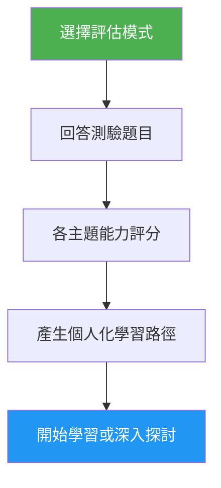

# 自我評估與學習路徑顧問

> 全面的 Claude Code 能力評估，評估 10 個功能領域、找出技能缺口，並產生個人化的學習路徑來提升技能。

## 特色

- 兩種評估模式：快速（8 題，2 分鐘）與深入（5 回合，5 分鐘）
- 評估 10 個功能領域：Slash Commands、Memory、Skills、Hooks、MCP、Subagents、Checkpoints、Advanced Features、Plugins、CLI
- 各主題評分與精熟等級（未學 / 基礎 / 熟練）
- 具依賴關係感知的缺口分析與優先排序
- 個人化學習路徑，附具體練習與成功標準
- 後續行動：開始學習、深入探討、實作專案、或重新評估

## 何時使用

| 這樣說... | Skill 會... |
|---|---|
| "assess my level" | 執行評估測驗並判斷您的程度 |
| "where should I start" | 評估您的經驗並建議起始點 |
| "check my skills" | 產生涵蓋全部 10 個領域的詳細技能檔案 |
| "what should I learn next" | 找出缺口並建立優先排序的學習路徑 |

## 運作方式



## 評估模式

### 快速評估（約 2 分鐘）
- 2 回合共 8 個是/否經驗問題
- 判斷總體程度：初學者 / 中級 / 進階
- 列出具體缺口與教學連結
- 適合：初次使用者、快速檢視

### 深入評估（約 5 分鐘）
- 5 回合問題涵蓋 10 個功能領域（每回合 2 個主題）
- 各主題評分（每題 0-2 分，滿分 20 分）
- 精熟度一覽表，含優勢領域、優先缺口與複習項目
- 具依賴關係感知的學習路徑，含階段與時間估算
- 結合缺口主題的建議實作專案
- 適合：想要提升能力的資深使用者、定期技能檢視

## 使用方式

```
/self-assessment
```

## 輸出內容

### 技能檔案表
顯示各主題分數、精熟等級與狀態（學習 / 複習 / 已精通）。

### 個人化學習路徑
- 依據依賴順序組織成階段
- 每個主題包含：教學連結、重點領域、關鍵練習、成功標準
- 時間估算已依已精通的主題調整
- 結合多個缺口領域的實作專案

### 後續行動
結果呈現後，您可以選擇：
- 開始第一個缺口教學並搭配引導練習
- 深入探討特定的缺口領域
- 設定一個涵蓋您缺口的實作專案
- 以不同的評估模式重新測驗

