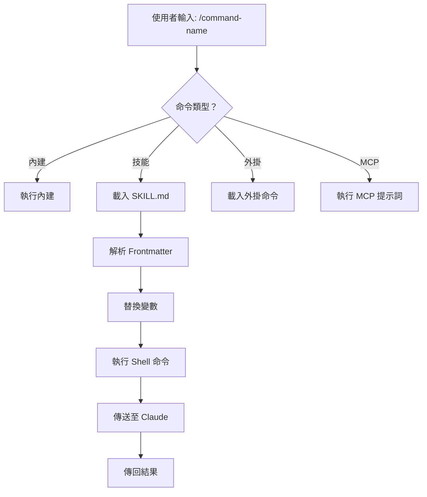
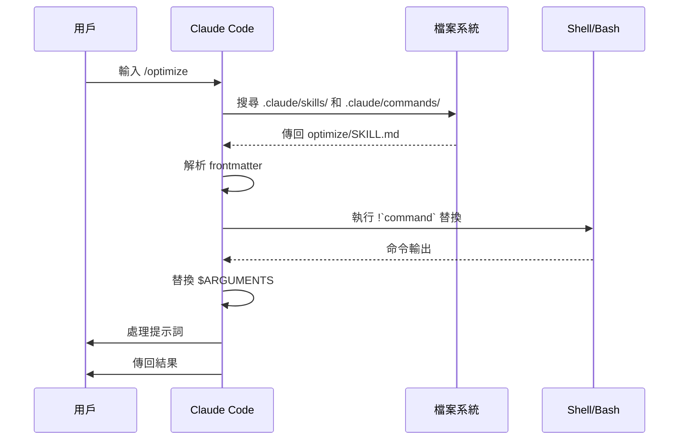

# 斜線命令

## 概述

斜線命令是在互動式會話期間控制 Claude 行為的捷徑。它們有幾種類型：

- **內建命令**: 由 Claude Code 提供 (`/help`, `/clear`, `/model`)
- **技能**: 作為 `SKILL.md` 檔案創建的用戶定義命令 (`/optimize`, `/pr`)
- **外掛命令**: 從已安裝的外掛程式取得的命令 (`/frontend-design:frontend-design`)
- **MCP 提示詞**: 從 MCP 伺服器取得的命令 (`/mcp__github__list_prs`)

> **注意**: 自定義斜線命令已合併到技能中。`.claude/commands/` 中的檔案仍然有效，但技能 (`.claude/skills/`) 現在是推薦的方法。兩者都創建 `/command-name` 捷徑。請參閱 [技能指南](../03-skills/) 以取得完整參考。

## 內建命令參考

內建命令是常見動作的捷徑。有 **60+ 內建命令** 和 **5 個內建技能** 可用。在 Claude Code 中輸入 `/` 以查看完整清單，或輸入 `/` 後接任何字母以進行篩選。

| 命令 | 目的 |
|---------|---------|
| `/add-dir <path>` | 增加工作目錄 |
| `/agents` | 管理代理設定 |
| `/branch [name]` | 將對話分支到新的會話 (別名: `/fork`)。注意: `/fork` 在 v2.1.77 中重新命名為 `/branch` |
| `/btw <question>` | 提出側問，但不加入歷史記錄 |
| `/chrome` | 設定 Chrome 瀏覽器整合 |
| `/clear` | 清除對話 (別名: `/reset`, `/new`) |
| `/color [color\|default]` | 設定提示詞列的顏色 |
| `/compact [instructions]` | 壓縮對話，可選地加入焦點指示 |
| `/config` | 開啟設定 (別名: `/settings`) |
| `/context` | 以彩色網格視覺化上下文使用情況 |
| `/copy [N]` | 將助理的回應複製到剪貼簿；`w` 寫入檔案 |
| `/cost` | 顯示 token 使用統計資料 |
| `/desktop` | 在桌面應用程式中繼續 (別名: `/app`) |
| `/diff` | 未提交變更的互動式 diff 檢視器 |
| `/doctor` | 診斷安裝健康狀況 |
| `/effort [low\|medium\|high\|max\|auto]` | 設定努力程度。`max` 需要 Opus 4.6 |
| `/exit` | 退出 REPL (別名: `/quit`) |
| `/export [filename]` | 將目前對話匯出到檔案或剪貼簿 |
| `/extra-usage` | 設定額外使用量以用於速率限制 |
| `/fast [on\|off]` | 啟用快速模式 |
| `/feedback` | 提交回饋 (別名: `/bug`) |
| `/help` | 顯示說明 |
| `/hooks` | 檢視鉤子設定 |
| `/ide` | 管理 IDE 整合 |
| `/init` | 初始化 `CLAUDE.md`。設定 `CLAUDE_CODE_NEW_INIT=1` 以進行互動式流程 |
| `/insights` | 產生會話分析報告 |
| `/install-github-app` | 設定 GitHub Actions 應用程式 |
| `/install-slack-app` | 安裝 Slack 應用程式 |
| `/keybindings` | 開啟鍵綁定設定 |
| `/login` | 轉換 Anthropic 帳戶 |
| `/logout` | 從 Anthropic 帳戶登出 |

| `/mcp` | 管理 MCP 伺服器和 OAuth |
| `/memory` | 編輯 `CLAUDE.md`，切換自動記憶 |
| `/mobile` | 行動應用程式 QR 碼 (別名：`/ios`、`/android`) |
| `/model [model]` | 使用左右箭頭選擇模型以進行努力 |
| `/passes` | 分享 Claude Code 的免費試用周 |
| `/permissions` | 檢視/更新權限 (別名：`/allowed-tools`) |
| `/plan [description]` | 進入計畫模式 |
| `/plugin` | 管理外掛 |
| `/powerup` | 通過具有動畫演示的互動課程來發現功能 |
| `/privacy-settings` | 隱私設定 (僅限 Pro/Max) |
| `/release-notes` | 檢視變更日誌 |
| `/reload-plugins` | 重新載入活躍的外掛 |
| `/remote-control` | 從 claude.ai 遠端控制 (別名：`/rc`) |
| `/remote-env` | 設定預設遠端環境 |
| `/rename [name]` | 重新命名會話 |
| `/resume [session]` | 繼續對話 (別名：`/continue`) |
| `/review` | **已過時** — 請安裝 `code-review` 外掛 |
| `/rewind` | 回溯對話和/或程式碼 (別名：`/checkpoint`) |
| `/sandbox` | 切換沙箱模式 |
| `/schedule [description]` | 建立/管理 Cloud 排程任務 |
| `/security-review` | 分析分支以尋找安全性漏洞 |
| `/skills` | 列出可用的技能 |
| `/stats` | 可視化每日使用量、會話、連線數 |
| `/stickers` | 訂購 Claude Code 貼紙 |
| `/status` | 顯示版本、模型、帳戶 |
| `/statusline` | 設定狀態列 |
| `/tasks` | 列出/管理背景任務 |
| `/team-onboarding` | 從專案的 Claude Code 設定中產生團隊成員加速上手指南 (新功能於 v2.1.101 中) |
| `/terminal-setup` | 設定終端機按鍵綁定 |
| `/theme` | 變更顏色主題 |
| `/ultraplan <prompt>` | 在 ultraplan 會話中草擬計畫，在瀏覽器中檢視 |
| `/upgrade` | 開啟升級頁面以升級到更高的計畫等級 |
| `/usage` | 顯示計畫使用量限制和速率限制狀態 |
| `/voice` | 切換推送到講話語音錄音 |

### 內建技能

這些技能與 Claude Code 捆綁在一起，並像斜線命令一樣被調用：

| 技能 | 目的 |
|-------|---------|
| `/batch <instruction>` | 使用工作樹來協調大規模平行變更 |
| `/claude-api` | 載入專案語言的 Claude API 參考 |
| `/debug [description]` | 啟用除錯記錄 |
| `/loop [interval] <prompt>` | 以間隔重複執行提示詞 |
| `/simplify [focus]` | 檢視變更檔案以進行程式碼品質 |

### 已過時的命令

| 命令 | 狀態 |
|---------|--------|
| `/review` | 已過時 — 取代為 `code-review` 外掛 |
| `/output-style` | 自 v2.1.73 起已過時 |
| `/fork` | 重新命名為 `/branch` (別名仍然有效，v2.1.77) |
| `/pr-comments` | 在 v2.1.91 中移除 — 直接詢問 Claude 以查看 PR 評論 |
| `/vim` | 在 v2.1.92 中移除 — 使用 /config → 編輯器模式 |

### 近期變更

- `/fork` 重新命名為 `/branch`，`/fork` 保持為別名 (v2.1.77)
- `/output-style` 已過時 (v2.1.73)
- `/review` 已過時，取而代之的是 `code-review` 外掛
- 增加了 `/effort` 命令，`max` 等級需要 Opus 4.6

- `/voice` 斜線命令新增，用於推送到麥克風語音錄入
- `/schedule` 斜線命令新增，用於建立/管理排程任務
- `/color` 斜線命令新增，用於提示詞列的自訂
- 在 v2.1.91 中移除了 `/pr-comments` — 直接詢問 Claude 即可查看 PR 評論
- 在 v2.1.92 中移除了 `/vim` — 請使用 `/config → Editor mode` 替代
- `/ultraplan` 新增，用於瀏覽器基礎的計畫審查和執行
- `/powerup` 新增，用於互動式功能課程
- `/sandbox` 新增，用於切換沙箱模式
- `/model` 選擇器現在顯示易於閱讀的標籤（例如，「Sonnet 4.6」），而不是原始模型 ID
- `/resume` 支援 `/continue` 替代別名
- MCP 提示詞現在可以作為 `/mcp__<server>__<prompt>` 斜線命令使用（請參閱 [MCP 提示詞作為命令](#mcp-prompts-as-commands)）
- `/team-onboarding` 新增，用於自動產生團隊成員上手指南（v2.1.101）

### `/team-onboarding` — 團隊成員上手指南

> **新增於 v2.1.101**

使用 `/team-onboarding` 從您專案的本地 Claude Code 使用情況產生團隊成員上手指南。此命令會檢查您的 `CLAUDE.md`、已安裝的技能、子代理、鉤子和最近的工作流程，然後產生一份有助於新開發人員快速上手的文件。

這是一個內建命令 — 無需安裝任何東西。

**使用方法：**

```bash
claude /team-onboarding
```

產生的指南摘要：

- 從 [`CLAUDE.md`](../02-memory/README.md) 專案目的和主要慣例
- 可用的 [技能](../03-skills/README.md) 以及它們自動觸發的時間
- 配置的 [子代理](../04-subagents/README.md) 及其職責
- 在常見事件上執行的 [鉤子](../06-hooks/README.md)
- 新手應該了解的常見工作流程

**可用性：** 於 Claude Code v2.1.101 (2026 年 4 月 11 日) 發布。

## 自訂命令 (現在為技能)

自訂斜線命令已 **合併到技能**。這兩種方法都可建立您可以使用 `/command-name` 呼叫的命令：

| 方法 | 位置 | 狀態 |
|----------|----------|--------|
| **技能 (建議)** | `.claude/skills/<name>/SKILL.md` | 目前標準 |
| **舊版命令** | `.claude/commands/<name>.md` | 仍然有效 |

如果技能和命令使用相同的名稱，**技能將優先使用**。例如，當 `.claude/commands/review.md` 和 `.claude/skills/review/SKILL.md` 都存在時，將使用技能版本。

### 遷移路徑

您現有的 `.claude/commands/` 檔案將繼續運作，無需修改。要遷移到技能：

**之前 (命令):**
```
.claude/commands/optimize.md
```

**之後 (技能):**
```
.claude/skills/optimize/SKILL.md
```

### 為什麼使用技能？

技能相較於舊版命令，提供額外的功能：

- **目錄結構**: 封裝腳本、範本和參考檔案
- **自動觸發**: Claude 可以自動觸發技能，當情況相關時
- **觸發控制**: 選擇使用者、Claude 或兩者都可以觸發
- **子代理執行**: 使用 `context: fork` 在隔離的上下文中執行技能
- **逐步揭露**: 僅在需要時載入額外的檔案

### 將自訂命令作為技能建立

建立一個包含 `SKILL.md` 檔案的目錄：

```bash
mkdir -p .claude/skills/my-command
```

**檔案:** `.claude/skills/my-command/SKILL.md`

```yaml
---
name: my-command
description: What this command does and when to use it
---

# My Command

Claude 遵循此命令被呼叫時的指示。

1. 第一步
2. 第二步
3. 第三步
```

### Frontmatter 參考

| 欄位 | 目的 | 預設值 |
|-------|---------|---------|
| `name` | 命令名稱 (成為 `/name`) | 目錄名稱 |
| `description` | 簡短描述 (幫助 Claude 知道何時使用) | 第一段 |
| `argument-hint` | 自動完成所需的參數 | 無 |
| `allowed-tools` | 命令可以使用哪些工具，無需許可 | 繼承 |
| `model` | 要使用的特定模型 | 繼承 |
| `disable-model-invocation` | 如果 `true`，只有使用者可以觸發 (不能是 Claude) | `false` |
| `user-invocable` | 如果 `false`，從 `/` 功能表隱藏 | `true` |
| `context` | 設定為 `fork` 以在隔離的子代理中執行 | 無 |
| `agent` | 使用 `context: fork` 時的代理類型 | `general-purpose` |
| `hooks` | 技能範圍的鉤子 (PreToolUse, PostToolUse, Stop) | 無 |

### 參數

命令可以接收參數：

**所有參數都使用 `$ARGUMENTS`：**

```yaml
---
name: fix-issue
description: Fix a GitHub issue by number
---

Fix issue #$ARGUMENTS 遵循我們的編碼標準
```

用法：`/fix-issue 123` → `$ARGUMENTS` 變成 "123"

**使用 `$0`, `$1` 等個別參數：**

```yaml
---
name: review-pr
description: Review a PR with priority
---

Review PR #$0 with priority $1
```

用法：`/review-pr 456 high` → `$0`="456", `$1`="high"

### 具有 Shell 命令的動態上下文

使用 `!`command`` 執行 bash 命令，在提示詞之前：

## 提交

**描述：** 使用上下文建立 git 提交

**允許使用的工具：** Bash(git *)

## 上下文

- 目前 git 狀態：! `git status`
- 目前 git 差異：! `git diff HEAD`
- 目前分支：! `git branch --show-current`
- 最近提交：! `git log --oneline -5`

## 你的任務

根據上述變更，建立單一 git 提交。

### 檔案參考

使用 `@` 包含檔案內容：

```markdown
檢閱 @src/utils/helpers.js 中的實作
比較 @src/old-version.js 與 @src/new-version.js
```

## 外掛命令

外掛程式可以提供自訂命令：

```
/plugin-name:command-name
```

或僅僅 `/command-name` 當沒有命名衝突時。

**範例：**
```bash
/frontend-design:frontend-design
/commit-commands:commit
```

## MCP 提示詞作為命令

MCP 伺服器可以將提示詞暴露為斜線命令：

```
/mcp__<server-name>__<prompt-name> [arguments]
```

**範例：**
```bash
/mcp__github__list_prs
/mcp__github__pr_review 456
/mcp__jira__create_issue "Bug title" high
```

### MCP 權限語法

控制 MCP 伺服器存取權限：

- `mcp__github` - 存取整個 GitHub MCP 伺服器
- `mcp__github__*` - 所有工具的萬用字元存取
- `mcp__github__get_issue` - 特定工具的存取

## 命令架構



## 指令週期



## 此資料夾中可用的指令

這些範例指令可以安裝為技能或傳統指令。

### 1. `/optimize` - 程式碼優化

分析程式碼以找出效能問題、記憶體洩漏和優化機會。

**用法：**
```
/optimize
[貼上你的程式碼]
```

### 2. `/pr` - 提取請求準備

引導您完成提取請求準備清單，包括 linting、測試和提交格式設定。

**用法：**
```
/pr
```

**截圖：**


### 3. `/generate-api-docs` - API 文件產生器

從原始程式碼產生全面的 API 文件。

**用法：**
```
/generate-api-docs
```

### 4. `/commit` - 具有上下文的 Git 提交

使用來自您儲存庫的動態上下文建立 Git 提交。

**用法：**
```
/commit [可選訊息]
```

### 5. `/push-all` - 暫存、提交和推送

暫存所有變更、建立提交並進行安全檢查後推送到遠端。

**用法：**
```
/push-all
```

**安全檢查：**
- 密碼：`.env*`, `*.key`, `*.pem`, `credentials.json`
- API 金鑰：偵測真實金鑰與佔位符
- 大型檔案：`>10MB` 而沒有 Git LFS
- 構建工件：`node_modules/`, `dist/`, `__pycache__/`

### 6. `/doc-refactor` - 文件重構

重構專案文件以提高清晰度和可訪問性。

**用法：**
```
/doc-refactor
```

### 7. `/setup-ci-cd` - CI/CD 流水線設定

實作預提交鉤子和 GitHub Actions 以進行品質保證。

**用法：**
```
/setup-ci-cd
```

### 8. `/unit-test-expand` - 測試覆蓋率擴展

通過針對未測試的分支和邊緣案例來增加測試覆蓋率。

**用法：**
```
/unit-test-expand
```

## 安裝

### 作為技能 (推薦)

複製到你的技能目錄：

```bash
# 建立技能目錄
mkdir -p .claude/skills

# 針對每個命令檔案，建立一個技能目錄
for cmd in optimize pr commit; do
  mkdir -p .claude/skills/$cmd
  cp 01-slash-commands/$cmd.md .claude/skills/$cmd/SKILL.md
done
```

### 作為傳統命令

複製到你的命令目錄：

```bash
# 專案範圍 (團隊)
mkdir -p .claude/commands
cp 01-slash-commands/*.md .claude/commands/

# 個人使用
mkdir -p ~/.claude/commands
cp 01-slash-commands/*.md ~/.claude/commands/
```

## 建立自己的命令

### 技能範本 (推薦)

建立 `.claude/skills/my-command/SKILL.md`：

```yaml
---
name: my-command
description: 這個命令的作用。在 [觸發條件] 時使用。
argument-hint: [optional-args]
allowed-tools: Bash(npm *), Read, Grep
---

# 命令標題

## 上下文

- 目前分支: !`git branch --show-current`
- 相關檔案: @package.json

## 指示

1. 第一步
2. 第二步，帶有參數：$ARGUMENTS
3. 第三步

## 輸出格式

- 如何格式化回應
- 包含哪些內容
```

### 僅限使用者命令 (不自動觸發)

對於 Claude 不應自動觸發的具有副作用的命令：

```yaml
---
name: deploy
description: 部署到生產環境
disable-model-invocation: true
allowed-tools: Bash(npm *), Bash(git *)
---

將應用程式部署到生產環境：

1. 執行測試
2. 建立應用程式
3. 推送到部署目標
4. 驗證部署
```

## 最佳實踐

| 執行 | 避免 |
|------|---------|
| 使用清晰、以行動為導向的名稱 | 為一次性任務建立命令 |
| 包含觸發條件的 `description` | 在命令中建立複雜邏輯 |
| 保持命令專注於單一任務 | 硬編碼敏感資訊 |
| 對副作用使用 `disable-model-invocation` | 忽略 `description` 欄位 |
| 對動態上下文使用 `!` 前綴 | 假設 Claude 知道目前狀態 |
| 將相關檔案組織到技能目錄中 | 將所有內容放在一個檔案中 |

## 疑難排解

### 命令未找到

**解決方案：**
- 檢查檔案是否位於 `.claude/skills/<name>/SKILL.md` 或 `.claude/commands/<name>.md`
- 驗證前置詞中的 `name` 欄位是否與預期的命令名稱相符
- 重新啟動 Claude Code 會話
- 執行 `/help` 以查看可用的命令

### 命令未如預期執行

**解決方案：**
- 增加更具體的指示
- 在技能檔案中包含範例
- 檢查是否使用 bash 命令時的 `allowed-tools`
- 優先使用簡單的輸入進行測試

### 技能與命令衝突

如果兩個都存在且名稱相同，**技能將優先**。移除其中一個或重新命名它。

## 相關指南

- **[技能](../03-skills/)** - 技能 (自動觸發的機能) 的完整參考
- **[記憶](../02-memory/)** - 透過 CLAUDE.md 的持續上下文
- **[子代理](../04-subagents/)** - 委派的 AI 代理
- **[外掛](../07-plugins/)** - 封裝的命令集合
- **[鉤子](../06-hooks/)** - 事件驅動的自動化

## 額外資源

- [官方互動模式文件](https://code.claude.com/docs/en/interactive-mode) - 內建命令參考
- [官方技能文件](https://code.claude.com/docs/en/skills) - 完整的技能參考
- [CLI 參考](https://code.claude.com/docs/en/cli-reference) - 命令列選項

---
**上次更新**: 2026 年 4 月 11 日
**Claude Code 版本**: 2.1.101
**來源：**
- https://code.claude.com/docs/en/skills
- https://code.claude.com/docs/en/commands
**相容模型**: Claude Sonnet 4.6, Claude Opus 4.6, Claude Haiku 4.5

*屬於 [Claude How To](../) 指南系列的一部分*
