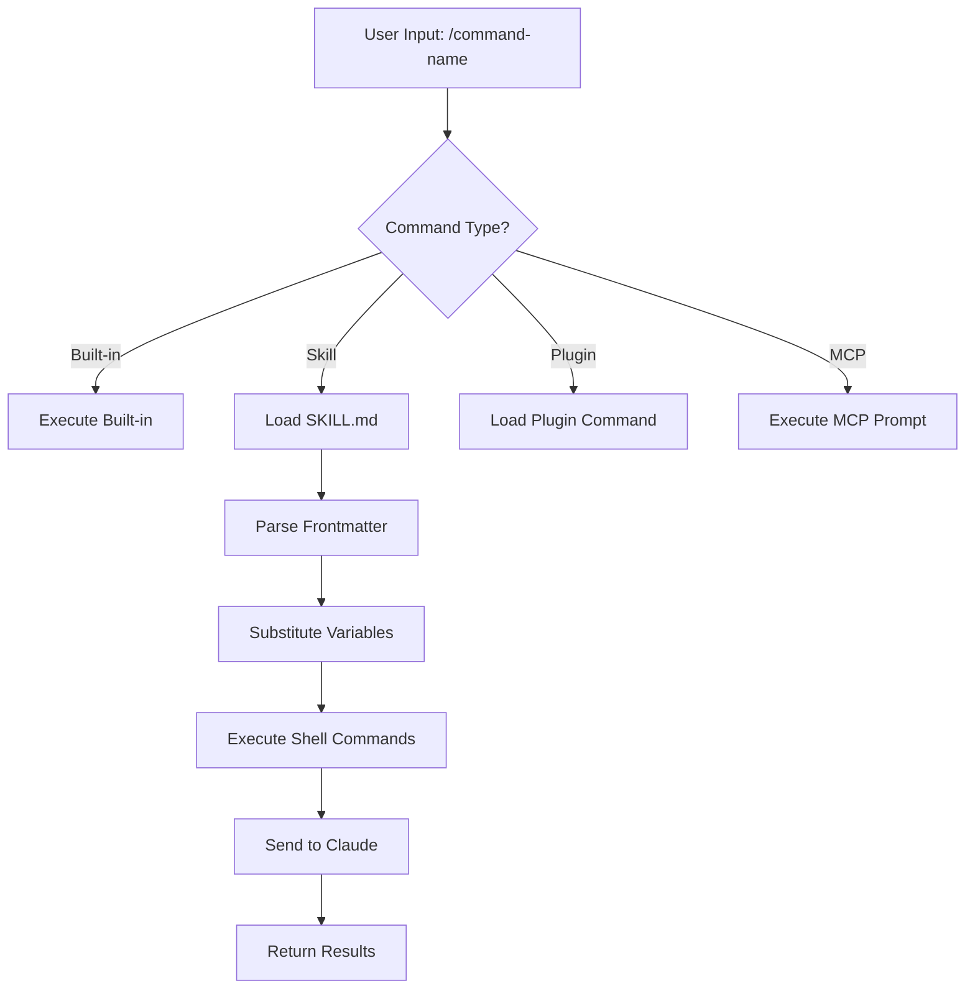
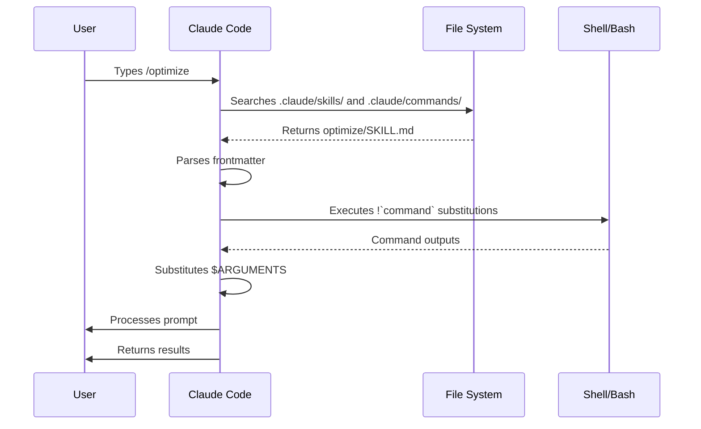

<picture>
  <source media="(prefers-color-scheme: dark)" srcset="../resources/logos/claude-howto-logo-dark.svg">
  
</picture>

# 📍 Slash Commands（斜線命令）

> **用戶觸發的快捷指令** | ⭐ 初級 | 30 分鐘
> 學習如何建立和使用自訂 slash commands 來快速執行重複任務。包含 optimize、pr、commit 等實用範本。

## 概述

Slash commands 是在互動式工作階段中控制 Claude 行為的快捷方式。它們分為幾種類型：

- **內建指令**：由 Claude Code 提供（`/help`、`/clear`、`/model`）
- **Skills**：使用者定義的指令，以 `SKILL.md` 檔案建立（`/optimize`、`/pr`）
- **插件指令**：來自已安裝插件的指令（`/frontend-design:frontend-design`）
- **MCP prompts**：來自 MCP 伺服器的指令（`/mcp__github__list_prs`）

> **注意**：自訂 slash commands 已合併至 skills。`.claude/commands/` 中的檔案仍可使用，但 skills（`.claude/skills/`）現為建議的做法。兩者都會建立 `/command-name` 快捷方式。請參閱 [Skills 指南](../03-skills/) 以取得完整參考。

## 內建指令參考

內建指令是常見操作的快捷方式。目前有 **55 個以上的內建指令**和 **5 個內建 skills** 可用。在 Claude Code 中輸入 `/` 即可查看完整清單，或輸入 `/` 後接任意字母來篩選。

| 指令 | 用途 |
|---------|---------|
| `/add-dir <path>` | 新增工作目錄 |
| `/agents` | 管理 agent 配置 |
| `/branch [name]` | 將對話分支到新工作階段（別名：`/fork`）。注意：`/fork` 在 v2.1.77 中改名為 `/branch` |
| `/btw <question>` | 不加入歷史紀錄的旁問 |
| `/chrome` | 配置 Chrome 瀏覽器整合 |
| `/clear` | 清除對話（別名：`/reset`、`/new`） |
| `/color [color\|default]` | 設定提示列顏色 |
| `/compact [instructions]` | 壓縮對話，可選擇性加入聚焦指示 |
| `/config` | 開啟設定（別名：`/settings`） |
| `/context` | 以彩色格狀圖視覺化上下文使用情況 |
| `/copy [N]` | 複製助手回覆到剪貼簿；`w` 寫入檔案 |
| `/cost` | 顯示 token 使用統計 |
| `/desktop` | 在桌面應用程式中繼續（別名：`/app`） |
| `/diff` | 未提交變更的互動式差異檢視器 |
| `/doctor` | 診斷安裝健康狀態 |
| `/effort [low\|medium\|high\|max\|auto]` | 設定努力程度。`max` 需要 Opus 4.6 |
| `/exit` | 退出 REPL（別名：`/quit`） |
| `/export [filename]` | 將目前對話匯出至檔案或剪貼簿 |
| `/extra-usage` | 配置速率限制的額外用量 |
| `/fast [on\|off]` | 切換快速模式 |
| `/feedback` | 提交回饋（別名：`/bug`） |
| `/help` | 顯示說明 |
| `/hooks` | 檢視 hook 配置 |
| `/ide` | 管理 IDE 整合 |
| `/init` | 初始化 `CLAUDE.md`。設定 `CLAUDE_CODE_NEW_INIT=true` 啟用互動式流程 |
| `/insights` | 產生工作階段分析報告 |
| `/install-github-app` | 設定 GitHub Actions 應用程式 |
| `/install-slack-app` | 安裝 Slack 應用程式 |
| `/keybindings` | 開啟按鍵綁定配置 |
| `/login` | 切換 Anthropic 帳號 |
| `/logout` | 登出 Anthropic 帳號 |
| `/mcp` | 管理 MCP 伺服器與 OAuth |
| `/memory` | 編輯 `CLAUDE.md`，切換自動記憶 |
| `/mobile` | 行動裝置應用程式 QR code（別名：`/ios`、`/android`） |
| `/model [model]` | 選擇模型，使用左右箭頭調整努力程度 |
| `/passes` | 分享 Claude Code 免費體驗週 |
| `/permissions` | 檢視/更新權限（別名：`/allowed-tools`） |
| `/plan [description]` | 進入計畫模式 |
| `/plugin` | 管理插件 |
| `/pr-comments [PR]` | 擷取 GitHub PR 評論 |
| `/privacy-settings` | 隱私設定（僅限 Pro/Max） |
| `/release-notes` | 檢視變更日誌 |
| `/reload-plugins` | 重新載入已啟用的插件 |
| `/remote-control` | 從 claude.ai 遠端控制（別名：`/rc`） |
| `/remote-env` | 配置預設遠端環境 |
| `/rename [name]` | 重新命名工作階段 |
| `/resume [session]` | 恢復對話（別名：`/continue`） |
| `/review` | **已棄用** — 請改為安裝 `code-review` 插件 |
| `/rewind` | 回溯對話及/或程式碼（別名：`/checkpoint`） |
| `/sandbox` | 切換沙箱模式 |
| `/schedule [description]` | 建立/管理排程任務 |
| `/security-review` | 分析分支的安全漏洞 |
| `/skills` | 列出可用的 skills |
| `/stats` | 視覺化每日使用量、工作階段、連續使用天數 |
| `/status` | 顯示版本、模型、帳號 |
| `/statusline` | 配置狀態列 |
| `/tasks` | 列出/管理背景任務 |
| `/terminal-setup` | 配置終端機按鍵綁定 |
| `/theme` | 變更色彩主題 |
| `/vim` | 切換 Vim/一般模式 |
| `/voice` | 切換按鍵說話語音輸入 |

### 內建 Skills

這些 skills 隨 Claude Code 一起提供，可像 slash commands 一樣呼叫：

| Skill | 用途 |
|-------|---------|
| `/batch <instruction>` | 使用 worktrees 協調大規模平行變更 |
| `/claude-api` | 載入專案語言的 Claude API 參考 |
| `/debug [description]` | 啟用除錯記錄 |
| `/loop [interval] <prompt>` | 按間隔重複執行提示 |
| `/simplify [focus]` | 審查已變更檔案的程式碼品質 |

### 已棄用的指令

| 指令 | 狀態 |
|---------|--------|
| `/review` | 已棄用 — 由 `code-review` 插件取代 |
| `/output-style` | 自 v2.1.73 起已棄用 |
| `/fork` | 改名為 `/branch`（別名仍可使用，v2.1.77） |

### 近期變更

- `/fork` 改名為 `/branch`，`/fork` 保留為別名（v2.1.77）
- `/output-style` 已棄用（v2.1.73）
- `/review` 已棄用，改用 `code-review` 插件
- 新增 `/effort` 指令，`max` 等級需要 Opus 4.6
- 新增 `/voice` 指令用於按鍵說話語音輸入
- 新增 `/schedule` 指令用於建立/管理排程任務
- 新增 `/color` 指令用於提示列自訂
- `/model` 選擇器現在顯示人類可讀的標籤（例如 "Sonnet 4.6"）而非原始模型 ID
- `/resume` 支援 `/continue` 別名
- MCP prompts 可作為 `/mcp__<server>__<prompt>` 指令使用（請參閱 [MCP Prompts 作為指令](#mcp-prompts-as-commands)）

## 自訂指令（現為 Skills）

自訂 slash commands 已**合併至 skills**。兩種方式都能建立可用 `/command-name` 呼叫的指令：

| 方式 | 位置 | 狀態 |
|----------|----------|--------|
| **Skills（建議）** | `.claude/skills/<name>/SKILL.md` | 目前標準 |
| **舊版指令** | `.claude/commands/<name>.md` | 仍可使用 |

如果 skill 和指令同名，**skill 優先**。例如，當 `.claude/commands/review.md` 和 `.claude/skills/review/SKILL.md` 同時存在時，會使用 skill 版本。

### 遷移路徑

您現有的 `.claude/commands/` 檔案無需變更即可繼續使用。若要遷移至 skills：

**之前（指令）：**
```
.claude/commands/optimize.md
```

**之後（Skill）：**
```
.claude/skills/optimize/SKILL.md
```

### 為什麼選擇 Skills？

Skills 提供舊版指令以外的額外功能：

- **目錄結構**：打包腳本、模板和參考檔案
- **自動呼叫**：Claude 可在相關時自動觸發 skills
- **呼叫控制**：選擇由使用者、Claude 或兩者都可呼叫
- **Subagent 執行**：使用 `context: fork` 在隔離的上下文中執行 skills
- **漸進式揭露**：僅在需要時載入額外檔案

### 建立自訂指令作為 Skill

建立包含 `SKILL.md` 檔案的目錄：

```bash
mkdir -p .claude/skills/my-command
```

**檔案：** `.claude/skills/my-command/SKILL.md`

```yaml
---
name: my-command
description: 此指令的用途及使用時機
---

# My Command

Claude 在此指令被呼叫時應遵循的指示。

1. 第一步
2. 第二步
3. 第三步
```

### Frontmatter 參考

| 欄位 | 用途 | 預設值 |
|-------|---------|---------|
| `name` | 指令名稱（成為 `/name`） | 目錄名稱 |
| `description` | 簡要描述（幫助 Claude 知道何時使用） | 第一段 |
| `argument-hint` | 自動完成預期的參數 | 無 |
| `allowed-tools` | 指令可無需許可使用的工具 | 繼承 |
| `model` | 使用的特定模型 | 繼承 |
| `disable-model-invocation` | 若為 `true`，僅使用者可呼叫（Claude 不行） | `false` |
| `user-invocable` | 若為 `false`，從 `/` 選單隱藏 | `true` |
| `context` | 設為 `fork` 以在隔離的 subagent 中執行 | 無 |
| `agent` | 使用 `context: fork` 時的 agent 類型 | `general-purpose` |
| `hooks` | Skill 範圍的 hooks（PreToolUse、PostToolUse、Stop） | 無 |

### 參數

指令可接收參數：

**使用 `$ARGUMENTS` 取得所有參數：**

```yaml
---
name: fix-issue
description: 依編號修復 GitHub issue
---

依照我們的程式碼標準修復 issue #$ARGUMENTS
```

用法：`/fix-issue 123` → `$ARGUMENTS` 變為 "123"

**使用 `$0`、`$1` 等取得個別參數：**

```yaml
---
name: review-pr
description: 依優先級審查 PR
---

以優先級 $1 審查 PR #$0
```

用法：`/review-pr 456 high` → `$0`="456"、`$1`="high"

### 使用 Shell 指令注入動態上下文

使用 `!`command`` 在提示之前執行 bash 指令：

```yaml
---
name: commit
description: 帶上下文建立 git commit
allowed-tools: Bash(git *)
---

## 上下文

- 目前 git 狀態：!`git status`
- 目前 git 差異：!`git diff HEAD`
- 目前分支：!`git branch --show-current`
- 最近的提交：!`git log --oneline -5`

## 你的任務

根據以上變更，建立一個 git commit。
```

### 檔案引用

使用 `@` 包含檔案內容：

```markdown
審查 @src/utils/helpers.js 中的實作
比較 @src/old-version.js 與 @src/new-version.js
```

## 插件指令

插件可提供自訂指令：

```
/plugin-name:command-name
```

或在沒有命名衝突時直接使用 `/command-name`。

**範例：**
```bash
/frontend-design:frontend-design
/commit-commands:commit
```

## MCP Prompts 作為指令

MCP 伺服器可將 prompts 公開為 slash commands：

```
/mcp__<server-name>__<prompt-name> [arguments]
```

**範例：**
```bash
/mcp__github__list_prs
/mcp__github__pr_review 456
/mcp__jira__create_issue "Bug title" high
```

### MCP 權限語法

在權限中控制 MCP 伺服器存取：

- `mcp__github` - 存取整個 GitHub MCP 伺服器
- `mcp__github__*` - 萬用字元存取所有工具
- `mcp__github__get_issue` - 特定工具存取

## 指令架構



## 指令生命週期



## 本資料夾中的可用指令

這些範例指令可作為 skills 或舊版指令安裝。

### 1. `/optimize` - 程式碼最佳化

分析程式碼的效能問題、記憶體洩漏和最佳化機會。

**用法：**
```
/optimize
[貼上你的程式碼]
```

### 2. `/pr` - Pull Request 準備

引導完成 PR 準備檢查清單，包含格式檢查、測試和提交格式化。

**用法：**
```
/pr
```

**螢幕截圖：**


### 3. `/generate-api-docs` - API 文件產生器

從原始碼產生完整的 API 文件。

**用法：**
```
/generate-api-docs
```

### 4. `/commit` - 帶上下文的 Git Commit

使用來自你的倉庫的動態上下文建立 git commit。

**用法：**
```
/commit [選填訊息]
```

### 5. `/push-all` - 暫存、提交並推送

暫存所有變更、建立 commit 並推送至遠端，包含安全檢查。

**用法：**
```
/push-all
```

**安全檢查：**
- 機密資料：`.env*`、`*.key`、`*.pem`、`credentials.json`
- API 金鑰：偵測真實金鑰與佔位符
- 大型檔案：`>10MB` 且未使用 Git LFS
- 建置產物：`node_modules/`、`dist/`、`__pycache__/`

### 6. `/doc-refactor` - 文件重構

重新組織專案文件以提升清晰度與可存取性。

**用法：**
```
/doc-refactor
```

### 7. `/setup-ci-cd` - CI/CD 管線設定

實作 pre-commit hooks 與 GitHub Actions 以進行品質保證。

**用法：**
```
/setup-ci-cd
```

### 8. `/unit-test-expand` - 測試覆蓋率擴展

透過針對未測試的分支和邊界案例來增加測試覆蓋率。

**用法：**
```
/unit-test-expand
```

## 安裝

### 作為 Skills（建議）

複製到你的 skills 目錄：

```bash
# 建立 skills 目錄
mkdir -p .claude/skills

# 為每個指令檔案建立 skill 目錄
for cmd in optimize pr commit; do
  mkdir -p .claude/skills/$cmd
  cp 01-slash-commands/$cmd.md .claude/skills/$cmd/SKILL.md
done
```

### 作為舊版指令

複製到你的 commands 目錄：

```bash
# 全專案使用（團隊）
mkdir -p .claude/commands
cp 01-slash-commands/*.md .claude/commands/

# 個人使用
mkdir -p ~/.claude/commands
cp 01-slash-commands/*.md ~/.claude/commands/
```

## 建立你自己的指令

### Skill 模板（建議）

建立 `.claude/skills/my-command/SKILL.md`：

```yaml
---
name: my-command
description: 此指令的用途。在 [觸發條件] 時使用。
argument-hint: [optional-args]
allowed-tools: Bash(npm *), Read, Grep
---

# 指令標題

## 上下文

- 目前分支：!`git branch --show-current`
- 相關檔案：@package.json

## 指示

1. 第一步
2. 帶參數的第二步：$ARGUMENTS
3. 第三步

## 輸出格式

- 如何格式化回覆
- 應包含什麼
```

### 僅限使用者的指令（不自動呼叫）

對於有副作用的指令，Claude 不應自動觸發：

```yaml
---
name: deploy
description: 部署至正式環境
disable-model-invocation: true
allowed-tools: Bash(npm *), Bash(git *)
---

將應用程式部署至正式環境：

1. 執行測試
2. 建置應用程式
3. 推送至部署目標
4. 驗證部署
```

## 最佳實務

| 應該做 | 不應該做 |
|------|---------|
| 使用清晰、行動導向的名稱 | 為一次性任務建立指令 |
| 在 `description` 中包含觸發條件 | 在指令中建構複雜邏輯 |
| 保持指令專注於單一任務 | 寫死敏感資訊 |
| 對有副作用的指令使用 `disable-model-invocation` | 跳過 description 欄位 |
| 使用 `!` 前綴取得動態上下文 | 假設 Claude 知道目前狀態 |
| 在 skill 目錄中組織相關檔案 | 把所有東西放在一個檔案中 |

## 疑難排解

### 找不到指令

**解決方案：**
- 檢查檔案是否在 `.claude/skills/<name>/SKILL.md` 或 `.claude/commands/<name>.md`
- 驗證 frontmatter 中的 `name` 欄位是否符合預期的指令名稱
- 重新啟動 Claude Code 工作階段
- 執行 `/help` 查看可用指令

### 指令未按預期執行

**解決方案：**
- 加入更具體的指示
- 在 skill 檔案中包含範例
- 如果使用 bash 指令，檢查 `allowed-tools`
- 先用簡單的輸入測試

### Skill 與指令衝突

如果兩者同名，**skill 優先**。移除其中一個或重新命名。

## 相關指南

- **[Skills](../03-skills/)** - Skills 的完整參考（自動呼叫的功能）
- **[Memory](../02-memory/)** - 使用 CLAUDE.md 的持久上下文
- **[Subagents](../04-subagents/)** - 委派的 AI agents
- **[Plugins](../07-plugins/)** - 打包的指令集合
- **[Hooks](../06-hooks/)** - 事件驅動的自動化

## 額外資源

- [官方互動模式文件](https://code.claude.com/docs/en/interactive-mode) - 內建指令參考
- [官方 Skills 文件](https://code.claude.com/docs/en/skills) - 完整的 skills 參考
- [CLI 參考](https://code.claude.com/docs/en/cli-reference) - 命令列選項

---

*[Claude How To](../) 指南系列的一部分*
