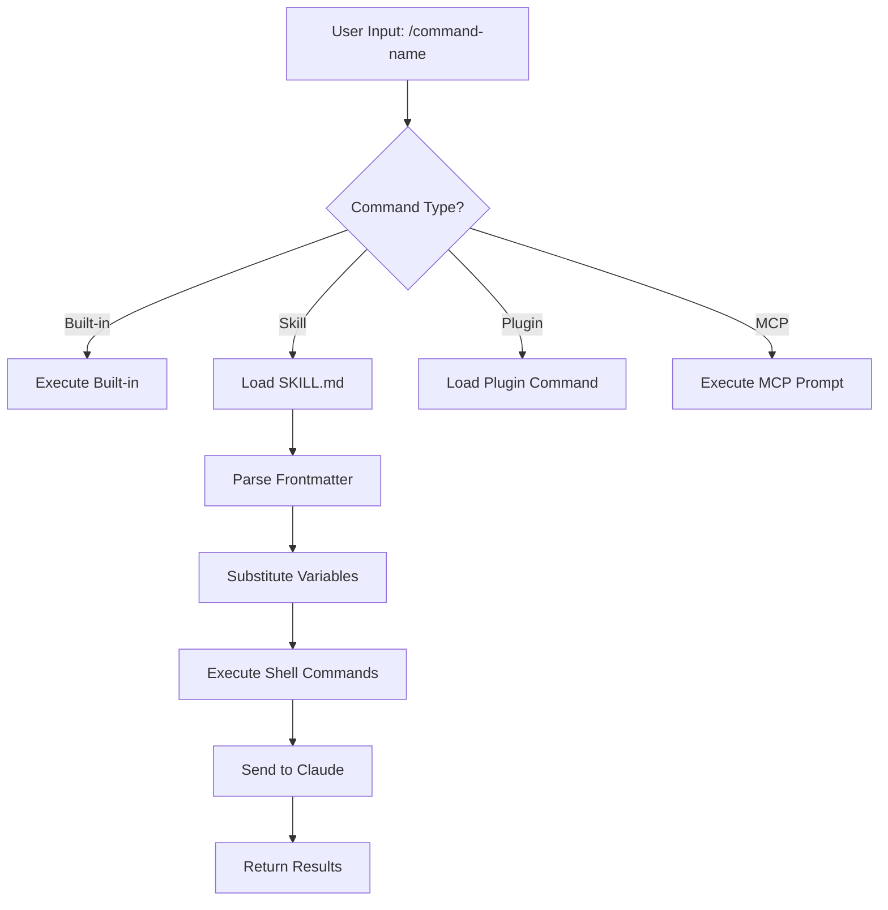
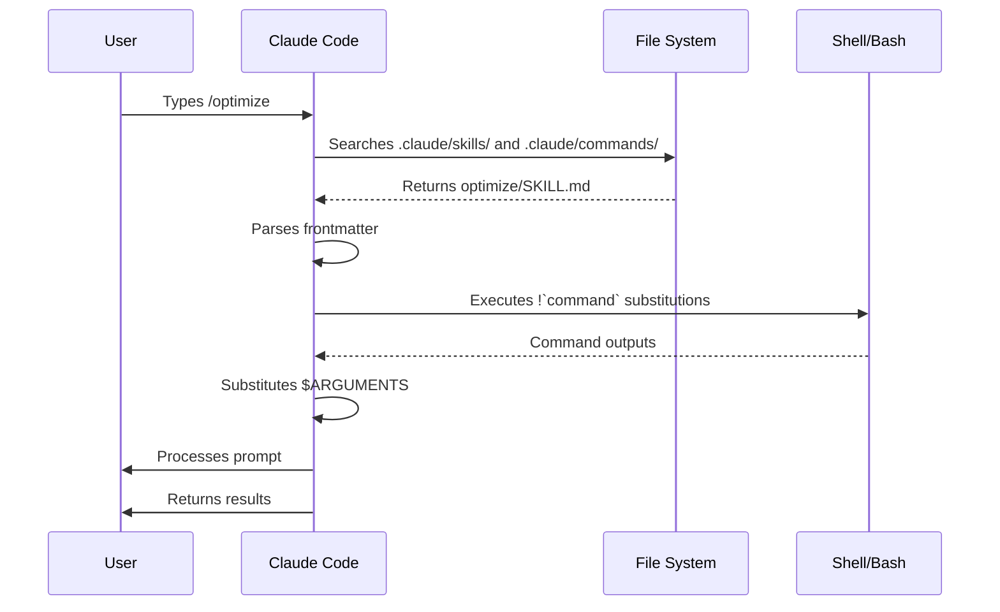

<picture>
  <source media="(prefers-color-scheme: dark)" srcset="../resources/logos/claude-howto-logo-dark.svg">
  
</picture>

# 斜線命令

## 概述

斜線命令是在互動式會話中控制 Claude 行為的捷徑。它們分為幾種類型：

- **內建命令**：由 Claude Code 提供（`/help`、`/clear`、`/model`）
- **技能**：使用者定義的命令，以 `SKILL.md` 檔案形式建立（`/optimize`、`/pr`）
- **外掛命令**：來自已安裝外掛的命令（`/frontend-design:frontend-design`）
- **MCP 提示詞**：來自 MCP 伺服器的命令（`/mcp__github__list_prs`）

> **注意**：自定義斜線命令已併入技能。位於 `.claude/commands/` 中的檔案仍可運作，但現在建議使用技能（`.claude/skills/`）。兩者都會建立 `/command-name` 捷徑。請參閱 [技能指南](../03-skills/) 以獲取完整參考。

## 內建命令參考

內建命令是常用操作的捷徑。目前提供 **60 多個內建命令** 和 **5 個內建技能**。在 Claude Code 中輸入 `/` 即可查看完整列表，或輸入 `/` 後接任何字母進行篩選。

| 命令 | 用途 |
|---------|---------|
| `/add-dir <path>` | 新增工作目錄 |
| `/agents` | 管理代理配置 |
| `/branch [name]` | 將對話分支到新的會話（別名：`/fork`）。注意：`/fork` 在 v2.1.77 中重新命名為 `/branch` |
| `/btw <question>` | 提出附帶問題而不加入歷史紀錄 |
| `/chrome` | 配置 Chrome 瀏覽器整合 |
| `/clear` | 清除對話（別名：`/reset`、`/new`） |
| `/color [color\|default]` | 設定提示詞列顏色 |
| `/compact [instructions]` | 壓縮對話，可選擇性加入專注指令 |
| `/config` | 開啟設定（別名：`/settings`） |
| `/context` | 以彩色網格形式視覺化上下文使用情況 |
| `/copy [N]` | 將助手回應複製到剪貼簿；`w` 會寫入檔案 |
| `/cost` | 顯示 token 使用統計數據 |
| `/desktop` | 在桌面應用程式中繼續（別名：`/app`） |
| `/diff` | 未提交變更的互動式 diff 查看器 |
| `/doctor` | 診斷安裝健康狀況 |
| `/effort [low\|medium\|high\|xhigh\|max\|auto]` | 透過互動式方向鍵滑桿設定努力程度。等級：`low` → `medium` → `high` → `xhigh` (v2.1.111 新增) → `max`。在 Opus 4.7 上預設為 `xhigh`；`max` 需要 Opus 4.7 |
| `/exit` | 退出 REPL（別名：`/quit`） |
| `/export [filename]` | 將當前對話匯出到檔案或剪貼簿 |
| `/extra-usage` | 配置額外使用量以應對速率限制 |
| `/fast [on\|off]` | 切換快速模式 |
| `/feedback` | 提交回饋（別名：`/bug`） |
| `/focus` | 切換專注檢視（v2.1.110 新增；取代 `Ctrl+O` 的專注切換功能） |
| `/help` | 顯示說明 |
| `/hooks` | 查看鉤子配置 |
| `/ide` | 管理 IDE 整合 |
| `/init` | 初始化 `CLAUDE.md`。設定 `CLAUDE_CODE_NEW_INIT=1` 可進行互動式流程 |
| `/insights` | 生成會話分析報告 |

| `/install-github-app` | 設定 GitHub Actions app |
| `/install-slack-app` | 安裝 Slack app |
| `/keybindings` | 開啟快捷鍵設定 |
| `/less-permission-prompts` | 分析最近的 Bash/MCP 工具呼叫，並將優先權清單新增至 `.claude/settings.json` 以減少權限提示 (新增於 v2.1.111) |
| `/login` | 切換 Anthropic 帳號 |
| `/logout` | 從您的 Anthakropic 帳號登出 |
| `/mcp` | 管理 MCP 伺服器與 OAuth |
| `/memory` | 編輯 `CLAUDE.md`，切換自動記憶功能 |
| `/mobile` | 行動應用程式 QR code (別名: `/ios`, `/android`) |
| `/model [model]` | 使用左右方向鍵選擇模型以調整投入程度 |
| `/passes` | 分享 Claude Code 免費週使用權 |
| `/permissions` | 查看/更新權限 (別名: `/allowed-tools`) |
| `/plan [description]` | 進入計畫模式 |
| `/plugin` | 管理外掛 |
| `/proactive` | `/loop` 的別名 (新增於 v2.1.105) |
| `/powerup` | 透過帶有動畫示範的互動式課程探索功能 |
| `/privacy-settings` | 隱私設定 (僅限 Pro/Max 使用者) |
| `/release-notes` | 查看變更日誌 |
| `/recap` | 返回會話時顯示會話回顧 / 摘要 (新增於 v2.1.108) |
| `/reload-plugins` | 重新載入啟用的外掛 |
| `/remote-control` | 從 claude.ai 進行遠端控制 (別名: `/rc`) |
| `/remote-env` | 設定預設遠端環境 |
| `/rename [name]` | 重新命名會話 |
| `/resume [session]` | 恢復對話 (別名: `/continue`) |
| `/review` | **已棄用** — 請改為安裝 `code-review` 外掛 |
| `/rewind` | 回溯對話與/或程式碼 (別名: `/checkpoint`) |
| `/sandbox` | 切換沙盒模式 |
| `/schedule [description]` | 建立/管理雲端排程任務 |
| `/security-review` | 分析分支是否存在安全性漏洞 |
| `/skills` | 列出可用技能 |
| `/stats` | 將每日使用量、會話、連續紀錄視覺化 |
| `/stickers` | 訂購 Claude Code 貼紙 |
| `/status` | 顯示版本、模型、帳號 |
| `/statusline` | 設定狀態列 |
| `/tasks` | 列出/管理背景任務 |
| `/team-onboarding` | 根據專案的 Claude Code 設定產生團隊成員上手指南 (新增於 v2.1.101) |
| `/terminal-setup` | 設定終端機快捷鍵 |
| `/theme` | 更改配色主題 |
| `/tui` | 切換無閃爍渲染的全螢幕 TUI (文字使用者介面) 模式 (新增於 v2.1.110) |
| `/ultraplan <prompt>` | 在 ultraplan 會話中草擬計畫，並在瀏覽器中審查 |
| `/ultrareview` | 透過多代理分析進行全面的雲端程式碼審查 (新增於 v2.1.111) |
| `/undo` | `/rewind` 的別名 (新增於 v2.1.108) |
| `/upgrade` | 開啟升級頁面以取得更高階方案 |
| `/usage` | 顯示方案使用限制與速率限制狀態 |
| `/voice` | 切換按住說話語音輸入功能 |

### Bundled Skills

這些技能隨 Claude Code 一起發佈，並可像斜線命令一樣被呼叫：

| 技能 | 用途 |
|-------|---------|
| `/batch <instruction>` | 使用 worktrees 編排大規模的並行變更 |
| `/claude-api` | 載入專案語言的 Claude API 參考文件 |

| `/debug [description]` | 啟用除錯日誌 |
| `/loop [interval] <prompt>` | 按間隔重複執行提示詞 |
| `/simplify [focus]` | 檢查變更檔案的程式碼品質 |

### 已棄用的命令

| 命令 | 狀態 |
|---------|--------|
| `/review` | 已棄用 — 已由 `code-review` 外掛取代 |
| `/output-style` | 自 v2.1.73 起已棄用 |
| `/fork` | 已重新命名為 `/branch` (別名仍可使用，v2.1.77) |
| `/pr-comments` | 已在 v2.1.91 中移除 — 請直接詢問 Claude 以查看 PR 評論 |
| `/vim` | 已在 v2.1.92 中移除 — 請使用 /config → Editor mode |

### 最近的變更

- `/fork` 重新命名為 `/branch`，並保留 `/fork` 作為別名 (v2.1.77)
- `/output-style` 已棄用 (v2.1.73)
- `/review` 已棄用，改由 `code-review` 外掛取代
- 新增 `/effort` 命令，其中 `max` 層級需要 Opus 4.7 (原僅限 Opus 4.6)
- 新增 `/voice` 命令，用於按住說話的語音聽寫
- 新增 `/schedule` 命令，用於建立/管理排程任務
- 新wall `/color` 命令，用於自定義提示詞列
- v2.1.91 移除 /pr-comments — 請直接詢問 Claude 以查看 PR 評論
- v2.1.92 移除 /vim — 改用 /config → Editor mode
- 新增 /ultraplan，用於基於瀏覽器的計畫審查與執行
- 新增 /powerup，用於互動式功能課程
- 新增 /sandbox，用於切換沙盒模式
- `/model` 選取器現在顯示易讀的標籤（例如「Sonnet 4.6」）而非原始模型 ID
- `/resume` 現在支援 `/continue` 別名
- MCP 提示詞現在可作為 `/mcp__<server>__<prompt>` 命令使用（參閱 [MCP Prompts as Commands](#mcp-prompts-as-commands)）
- 新增 `/team-onboarding`，用於自動生成團隊成員上手指南 (v2.1.101)
- 新增 `/tui` 命令，用於無閃爍的全螢幕 TUI 渲染 (v2.1.110)
- 新增 `/focus` 命令，用於切換專注檢視模式；`Ctrl+O` 現在僅切換詳細逐字稿 (v2.1.110)
- 新增 `/recap` 命令，用於手動觸發會話上下文摘要 (v2.1.108)
- `/undo` 已新增為 `/rewind` 的別名 (v2.1.108)
- `/proactive` 已新增為 `/loop` 的別名 (v2.1.105)
- `/effort` 獲得了互動式方向鍵滑桿，並在 `high` 與 `max` 之間新增了 `xhigh` 層級；Opus 4.7 計畫的預設努力程度提升至 `xhigh` (v2.1.111)
- 新增 `/ultrareview`，用於全面的雲端多代理程式碼審查 (v2.1.111)
- 新增 `/less-permission-prompts`，用於分析 Bash/MCP 工具呼叫，並透過 `.claude/settings.json` 中的允許清單來減少權限提示 (v2.1.111)
- 對於 Opus 4.7 的 Max 訂閱者，自動模式不再需要 `--enable-auto-mode` 旗標 (v2.1.112)

### `/team-onboarding` — 團隊成員上手指南

> **v2.1.101 新增功能**

使用 `/team-onboarding` 可以根據您專案中本地的 Claude Code 使用情況來生成團隊成員上手指南。該命令會檢查您的 `CLAUDE.md`、已安裝的技能、子代理、鉤子以及最近的工作流程，然後生成一份新手開發者指南，幫助他們快速上手。

這是內建命令 — 無需安裝。

**用法：**

```bash
claude /team-onboarding
```

生成的指南摘要包含：

- 來自 [`CLAUDE.md`](../02-memory/README.md) 的專案目的與關鍵慣例
- 可用的 [skills](../03-skills/README.md) 以及它們何時會被自動觸發
- 已配置的 [subagents](../04-subagents/README.md) 及其職責
- 在常見事件上執行的 [Hooks](../06-hooks/README.md)
- 新手應了解的常見工作流程

**可用性：** 已於 Claude Code v2.1.101 (2026 年 4 月 11 日) 發佈。

## 自定義命令 (現為 Skills)

自定義斜線命令已**整合至 skills 中**。這兩種方式都能建立您可以透過 `/command-name` 呼叫的命令：

| 方式 | 位置 | 狀態 |
|----------|----------|--------|
| **Skills (推薦)** | `.claude/skills/<name>/SKILL.md` | 目前標準 |
| **Legacy Commands** | `.claude/commands/<name>.md` | 仍可運作 |

如果一個 skill 與一個 command 同名，**skill 將具有優先權**。例如，當 `.claude/commands/review.md` 與 `.claude/skills/review/SKILL.md` 同時存在時，將使用 skill 版本。

### 遷移路徑

您現有的 `.claude/commands/` 檔案可以繼續運作而無需更改。若要遷移至 skills：

**之前 (Command):**
```
.claude/commands/optimize.md
```

**之後 (Skill):**
```
.claude/skills/optimize/SKILL.md
```

### 為什麼選擇 Skills？

與舊版命令相比，skills 提供更多額外功能：

- **目錄結構**：可以封裝腳本、範本與參考檔案
- **自動觸發**：當相關時，Claude 可以自動觸發 skills
- **呼叫控制**：可選擇由使用者、Claude 或兩者皆可呼叫
- **Subagent 執行**：透過 `context: fork` 在隔離的上下文中執行 skills
- **漸進式揭露**：僅在需要時才載入額外檔案

### 將自定義命令建立為 Skill

建立一個包含 `SKILL.md` 檔案的目錄：

```bash
mkdir -p .claude/skills/my-command
```

**檔案：** `.claude/skills/my-command/SKILL.md`

```yaml
---
name: my-command
description: What this command does and when to use it
---

# My Command

Instructions for Claude to follow when this command is invoked.

1. First step
2. Second step
3. Third step
```

### Frontmatter 參考

| 欄位 | 用途 | 預設值 |
|-------|---------|---------|
| `name` | 命令名稱 (將成為 `/name`) | 目錄名稱 |
| `description` | 簡短描述 (幫助 Claude 知道何時使用它) | 第一段文字 |
| `argument-hint` | 用於自動完成的預期參數 | 無 |
| `allowed-tools` | 該命令無需許可即可使用的工具 | 繼承 |
| `model` | 指定使用的模型 | 繼承 |
| `disable-model-invocation` | 若為 `true`，則只有使用者可以呼叫 (Claude 不行) | `false` |
| `user-invocable` | 若為 `false`，則從 `/` 選單中隱藏 | `true` |
| `context` | 設定為 `fork` 以在隔離的 subagent 中執行 | 無 |
| `agent` | 使用 `context: fork` 時的代理類型 | `general-purpose` |
| `hooks` | Skill 範圍內的鉤子 (PreToolUse, PostToolUse, Stop) | 無 |

### 參數

命令可以接收參數：

**所有帶有 `$ARGUMENTS` 的參數：**

```yaml
---
name: fix-issue
description: Fix a GitHub issue by number
```

---

根據我們的編碼標準修復問題 #$ARGUMENTS
```

用法：`/fix-issue 123` → `$ARGUMENTS` 變為 "123"

**使用 `$0`、`$1` 等個別參數：**

```yaml
---
name: review-pr
description: Review a PR with priority
---

Review PR #$0 with priority $1
```

用法：`/review-pr 456 high` → `$0`="456", `$1`="high"

### 使用 Shell 命令進行動態上下文處理

在提示詞執行前，使用 `!`command`` 執行 bash 命令：

```yaml
---
name: commit
description: Create a git commit with context
allowed-tools: Bash(git *)
---

## Context

- Current git status: !`git status`
- Current git diff: !`git diff HEAD`
- Current branch: !`git branch --show-current`
- Recent commits: !`git log --oneline -5`

## Your task

Based on the above changes, create a single git commit.
```

### 檔案引用

使用 `@` 包含檔案內容：

```markdown
Review the implementation in @src/utils/helpers.js
Compare @src/old-version.js with @src/new-version.js
```

## 外掛命令

外掛可以提供自定義命令：

```
/plugin-name:command-name
```

或者在沒有命名衝突時，直接使用 `/command-name`。

**範例：**
```bash
/frontend-design:frontend-design
/commit-commands:commit
```

## 將 MCP 提示詞作為命令

MCP 伺服器可以將提示詞公開為斜線命令：

```
/mcp__<server-name>__<prompt-name> [arguments]
```

**範例：**
```bash
/mcp__github__list_prs
/mcp__github__pr_review 456
/mcp__jira__create_issue "Bug title" high
```

### MCP 權限語法

在權限設定中控制 MCP 伺服器存取：

- `mcp__github` - 存取整個 GitHub MCP 伺服器
- `mcp__github__*` - 使用萬用字元存取所有工具
- `mcp__github__get_issue` - 存取特定工具

## 命令架構


```mermaid
graph TD
    A["User Input: /command-name"] --> B{"Command Type?"}
    B -->|Built-in| C["Execute Built-in"]
    B -->|Skill| D["Load SKILL.md"]
    B -->|Plugin| E["Load Plugin Command"]
    B -->|MCP| F["Execute MCP Prompt"]

    D --> G["Parse Frontmatter"]
    G --> H["Substitute Variables"]
    H --> I["Execute Shell Commands"]
    I --> J["Send to Claude"]
    J --> K["Return Results"]
```

## 命令生命週期


```mermaid
sequenceDiagram
    participant User
    participant Claude as Claude Code
    participant FS as File System
    participant CLI as Shell/Bash

    User->>Claude: Types /optimize
    Claude->>FS: Searches .claude/skills/ and .claude/commands/
    FS-->>Claude: Returns optimize/SKILL.md
    Claude->>Claude: Parses frontmatter
    Claude->>CLI: Executes !`command` substitutions
    CLI-->>Claude: Command outputs
    Claude->>Claude: Substitutes $ARGUMENTS
    Claude->>User: Processes prompt
    Claude->>User: Returns results
```

## 此資料夾中的可用命令

這些範例命令可以作為 skills 或舊版命令進行安裝。

### 1. `/optimize` - 程式碼優化

分析程式碼中的效能問題、記憶體洩漏以及優化機會。

**用法：**
```
/optimize
[Paste your code]
```

### 2. `/pr` - Pull Request 準備

引導完成 PR 準備檢查清單，包括 linting、測試與 commit 格式化。

**用法：**
```
/pr
```

**螢幕截圖：**


### 3. `/generate-api-docs` - API 文件產生器

從原始碼產生全面的 API 文件。

**用法：**
```
/generate-api-docs
```

### 4. `/commit` - 帶有上下文的 Git Commit

根據您儲存庫中的動態上下文建立一個 git commit。

**用法：**
```
/commit [optional message]
```

### 5. `/push-all` - 暫存、提交與推送

暫存所有變更、建立 commit 並進行安全檢查後推送到遠端。

**用法：**
```
/push-all
```

**安全檢查：**
- 敏感資訊：`.env*`, `*.key`, `*.pem`, `credentials.json`
- API Keys：偵測真實金鑰與佔位符
- 大型檔案：未透過 Git LFS 的 `>10MB` 檔案
- 建置產物：`node_modules/`, `dist/`, `__pycache__/`

### 6. `/doc-refactor` - 文件重構

重構專案文件以提高清晰度與易讀性。

**用法：**
```
/doc-refactor
```

### 7. `/setup-ci-cd` - CI/CD 流水線設定

實作 pre-commit 鉤子與 GitHub Actions 以進行品質保證。

**用法：**
```
/setup-ci-cd
```

### 8. `/unit-test-expand` - 測試覆蓋率擴充

透過針對未測試的分支與邊際情況來增加測試覆蓋率。

**用法：**
```
/unit-test-expand
```

## 安裝

### 作為技能 (推薦)

複製到您的 skills 目錄：

```bash
# 建立 skills 目錄
mkdir -p .claude/skills

# 為每個指令檔案建立一個 skill 目錄
for cmd in optimize pr commit; do
  mkdir -p .claude/skills/$cmd
  cp 01-slash-commands/$cmd.md .claude/skills/$cmd/SKILL.md
done
```

### 作為舊版指令

複製到您的 commands 目錄：

```bash
# 全專案範圍 (團隊使用)
mkdir -p .claude/commands
cp 01-slash-commands/*.md .claude/commands/

# 個人使用
mkdir -p ~/.claude/commands
cp 01-slash-commands/*.md ~/.claude/commands/
```

## 建立您自己的指令

### 技能範本 (推薦)

建立 `.claude/skills/my-command/SKILL.md`：

```yaml
---
name: my-command
description: 此指令的功能。當 [觸發條件] 時使用。
argument-hint: [可選參數]
allowed-tools: Bash(npm *), Read, Grep
---

# 指令標題

## 上下文

- 目前分支：!`git branch --show-current`
- 相關檔案：@package.json

## 指令說明

1. 第一步
2. 帶有參數的第二步：$ARGUMENTS
3. 第三步

## 輸出格式

- 如何格式化回應
- 應包含的內容
```

### 僅限使用者使用的指令 (無自動呼叫)

適用於具有副作用且 Claude 不應自動觸發的指令：

```yaml
---
name: deploy
description: 部署至正式環境
disable-model-invocation: true
allowed-tools: Bash(npm *), Bash(git *)
---

將應用程式部署至正式環境：

1. 執行測試
2. 建置應用程式
3. 推送到部署目標
4. 驗證部署
```

## 最佳實務

| 應該 (Do) | 不應該 (Don't) |
|------|---------|
| 使用清晰且導向行動的名稱 | 為一次性任務建立命令 |
| 包含帶有觸發條件的 `description` | 在命令中構建複雜邏輯 |
| 保持命令專注於單一任務 | 將敏感資訊寫死 (Hardcode) |
| 使用 `disable-model-invocation` 來處理副作用 | 跳過 description 欄位 |
| 使用 `!` 前綴處理動態 context | 假設 Claude 知道目前的狀態 |
| 將相關檔案組織在 skill 目錄中 | 將所有內容都放在單一檔案中 |

## 疑難排解

### 找不到命令 (Command Not Found)

**解決方案：**
- 檢查檔案是否位於 `.claude/skills/<name>/SKILL.md` 或 `.claude/commands/<name>.md`
- 確認 frontmatter 中的 `name` 欄位與預期的命令名稱一致
- 重啟 Claude Code 會話 (session)
- 執行 `/help` 查看可用命令

### 命令執行結果不如預期

**解決方案：**
- 加入更具體的指令
- 在 skill 檔案中包含範例
- 如果使用 bash 命令，請檢查 `allowed-tools`
- 先使用簡單的輸入進行測試

### Skill 與 Command 衝突

如果兩者名稱相同，**skill 將具有優先權**。請刪除其中一個或重新命名。

## 相關指南

- **[Skills](../03-skills/)** - 關於 skills（自動觸發的能力）的完整參考
- **[Memory](../02-memory/)** - 使用 CLAUDE.md 實現持久化 context
- **[Subagents](../04-subagents/)** - 委派的 AI 代理 (agents)
- **[Plugins](../07-plugins/)** - 綑綁的命令集合
- **[Hooks](../06-hooks/)** - 事件驅動的自動化

## 其他資源

- [Official Interactive Mode Documentation](https://code.claude.com/docs/en/interactive-mode) - 內建命令參考
- [Official Skills Documentation](https://code.claude.com/docs/en/skills) - 完整的 skills 參考
- [CLI Reference](https://code.claude.com/docs/en/cli-reference) - 命令列選項

---

**最後更新日期**：2026 年 4 月 16 日
**Claude Code 版本**：2.1.112
**來源**：
- https://docs.anthropic.com/en/docs/claude-code/slash-commands
- https://www.anthropic.com/news/claude-opus-4-7
- https://support.claude.com/en/articles/12138966-release-notes
**相容模型**：Claude Sonnet 4.6, Claude Opus 4.7, Claude Haiku 4.5

*本文件為 [Claude How To](../) 指南系列的一部分*
