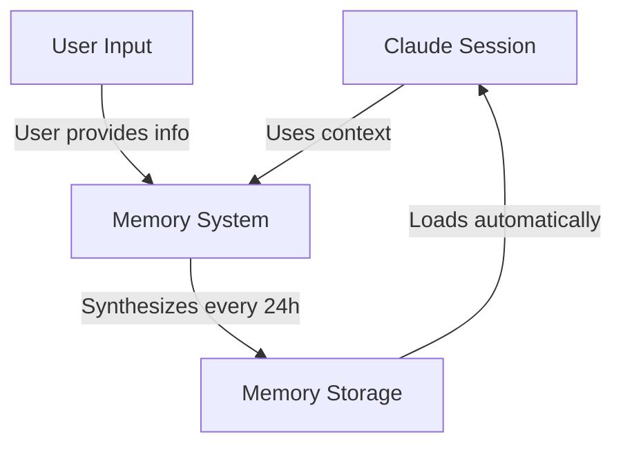
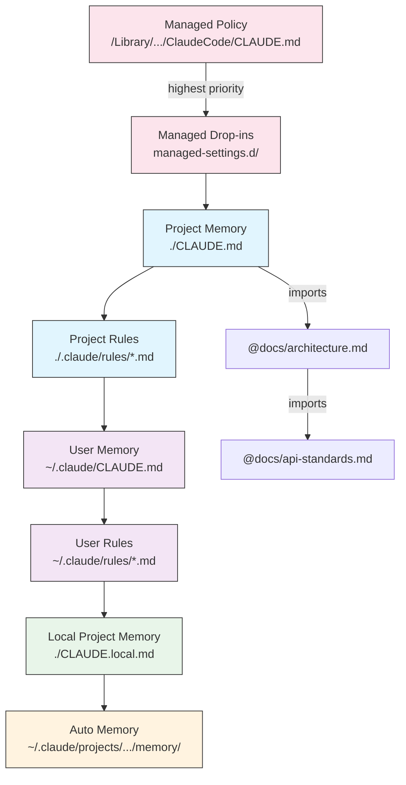
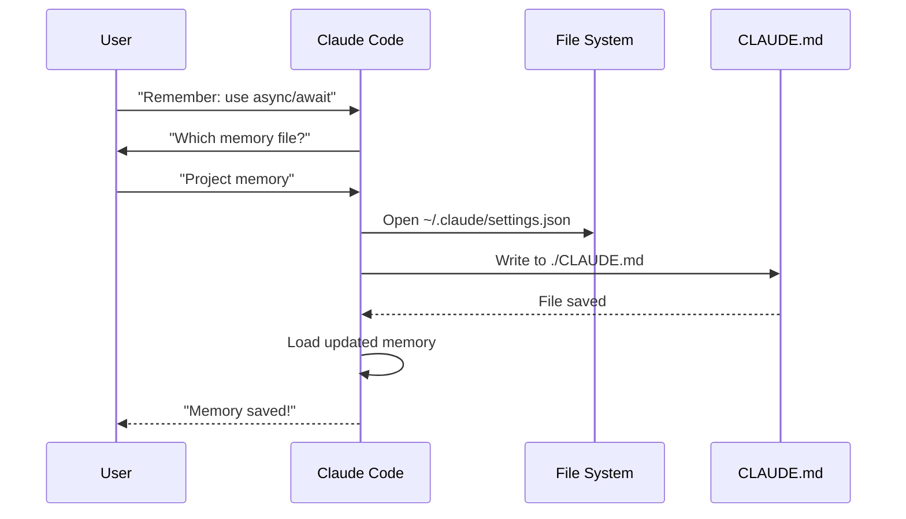

<picture>
  <source media="(prefers-color-scheme: dark)" srcset="../resources/logos/claude-howto-logo-dark.svg">
  
</picture>

# 記憶指南

記憶功能讓 Claude 能夠在不同的會話與對話之間保留上下文。它以兩種形式存在：claude.ai 中的自動合成，以及 Claude Code 中基於檔案系統的 CLAUDE.md。

## 概述

Claude Code 中的記憶提供了可跨多個會話與對話持續存在的持久上下文。與暫時性的上下文視窗不同，記憶檔案讓您可以：

- 在團隊中共享專案標準
- 儲存個人開發偏好
- 維持特定目錄的規則與配置
- 匯入外部文件
- 將記憶作為專案的一部分進行版本控制

記憶系統在多個層級上運作，從全域個人偏好到特定的子目錄，實現了對 Claude 記憶內容及其應用方式的細粒度控制。

## 記憶命令快速參考

| 命令 | 用途 | 用法 | 使用時機 |
|---------|---------|-------|-------------|
| `/init` | 初始化專案記憶 | `/init` | 開始新專案、首次設定 CLAUDE.md 時 |
| `/memory` | 在編輯器中編輯記憶檔案 | `/memory` | 大規模更新、重新組織、審查內容時 |
| `#` 前綴 | ~~快速單行新增記憶~~ **已廢棄** | — | 改用 `/memory` 或透過對話方式提出 |
| `@path/to/file` | 匯入外部內容 | `@README.md` 或 `@docs/api.md` | 在 CLAUDE.md 中引用現有文件時 |

## 快速入門：初始化記憶

### `/init` 命令

`/init` 命令是在 Claude Code 中設定專案記憶最快的方式。它會初始化一個包含基礎專案文件的 `CLAUDE.md` 檔案。

**用法：**

```bash
/init
```

**功能說明：**

- 在您的專案中建立一個新的 `CLAUDE.md` 檔案（通常位於 `./CLAUDE.md` 或 `./.claude/CLAUDE.md`）
- 建立專案慣例與指南
- 為跨會話的上下文持久化奠定基礎
- 提供用於記錄專案標準的範本結構

**增強型互動模式：** 設定 `CLAUDE_CODE_NEW_INIT=1` 可啟用多階段互動流程，引導您逐步完成專案設定：

```bash
CLAUDE_CODE_NEW_INIT=1 claude
/init
```

**何時使用 `/init`：**

- 使用 Claude Code 開啟新專案時
- 建立團隊程式碼標準與慣例時
- 建立關於程式碼庫結構的文件時
- 為協作開發設定記憶層級時

**範例工作流程：**

```markdown
# 在您的專案目錄中
/init

# Claude 會建立具有如下結構的 CLAUDE.md：
# Project Configuration
## Project Overview
- Name: Your Project
- Tech Stack: [Your technologies]
- Team Size: [Number of developers]

## Development Standards
- Code style preferences
- Testing requirements
- Git workflow conventions
```

### 快速更新記憶

> **注意**：用於行內記憶的 `#` 快捷鍵已停止使用。請使用 `/memory` 直接編輯記憶檔案，或透過對話要求 Claude 記住某些內容（例如：「記住我們總是使用 TypeScript strict mode」）。

建議將資訊加入記憶的方式如下：

**選項 1：使用 `/memory` 命令**

```bash
/memory
```

在您的系統編輯器中開啟記憶檔案以進行直接編輯。

**選項 2：透過對話要求**

```
Remember that we always use TypeScript strict mode in this project.
Please add to memory: prefer async/await over promise chains.
```

Claude 將根據您的要求更新適當的 `CLAUDE.md` 檔案。

**歷史參考**（已失效）：

先前使用 `#` 前綴快捷鍵可以在行內加入規則：

```markdown
# Always use TypeScript strict mode in this project  ← 已無法運作
```

如果您先前依賴此模式，請切換至 `/memory` 命令或使用對話式要求。

### `/memory` 命令

`/memory` 命令提供在 Claude Code 會話中直接存取並編輯 `CLAUDE.md` 記憶檔案的功能。它會在您的系統編輯器中開啟記憶檔案，以便進行全面的編輯。

**用法：**

```bash
/memory
```

**功能說明：**

- 在系統預設編輯器中開啟您的記憶檔案
- 允許您進行大量的增加、修改與重組
- 提供對層級結構中所有記憶檔案的直接存取
- 使您能夠管理跨會話的持久上下文

**何時使用 `/memory`：**

- 審查現有的記憶內容時
- 對專案標準進行大規模更新時
- 重組記憶結構時
- 加入詳細文件或指南時

- 隨著專案演進維護與更新記憶

**比較：`/memory` vs `/init`**

| 項目 | `/memory` | `/init` |
|--------|-----------|---------|
| **目的** | 編輯現有的記憶檔案 | 初始化新的 CLAUDE.md |
| **使用時機** | 更新/修改專案上下文 | 開始新專案 |
| **動作** | 開啟編輯器進行變更 | 生成初始範本 |
| **工作流程** | 持續性維護 | 一次性設定 |

**範例工作流程：**

```markdown
# Open memory for editing
/memory

# Claude presents options:
# 1. Managed Policy Memory
# 2. Project Memory (./CLAUDE.md)
# 3. User Memory (~/.claude/CLAUDE.md)
# 4. Local Project Memory

# Choose option 2 (Project Memory)
# Your default editor opens with ./CLAUDE.md content

# Make changes, save, and close editor
# Claude automatically reloads the updated memory
```

**使用記憶匯入 (Memory Imports)：**

CLAUDE.md 檔案支援 `@path/to/file` 語法來包含外部內容：

```markdown
# Project Documentation
See @README.md for project overview
See @package.json for available npm commands
See @docs/architecture.md for system design

# Import from home directory using absolute path
@~/.claude/my-project-instructions.md
```

**匯入功能特性：**

- 同時支援相對路徑與絕對路徑（例如：`@docs/api.md` 或 `@~/.claude/my-project-instructions.md`）
- 支援遞迴匯入，最大深度為 5 層
- 首次從外部位置進行匯入時，會觸發安全性審核對話框
- 匯入指令不會在 Markdown 的行內程式碼或程式碼區塊內被執行（因此在範例中記錄這些指令是安全的）
- 透過引用現有文件，有助於避免重複內容
- 自動將引用的內容包含在 Claude 的上下文中

## 記憶架構

Claude Code 中的記憶採用層級式系統，不同的範圍（scope）用於不同的目的：



## Claude Code 中的記憶層級

Claude Code 使用多層級的記憶系統。當 Claude Code 啟動時，記憶檔案會自動載入，且較高層級的檔案具有優先權。

**完整的記憶層級（依優先順序排列）：**

1. **Managed Policy** - 組織範圍的指令
   - macOS: `/Library/Application Support/ClaudeCode/CLAUDE.md`
   - Linux/WSL: `/etc/claude-code/CLAUDE.md`
   - Windows: `C:\Program Files\ClaudeCode\CLAUDE.md`

2. **Managed Drop-ins** - 按字母順序合併的政策檔案 (v2.1.83+)
   - 與 managed policy CLAUDE.md 同層的 `managed-settings.d/` 目錄
   - 檔案按字母順序進行合併，以便進行模組化政策管理

3. **Project Memory** - 團隊共享的上下文（受版本控制）
   - `./.claude/CLAUDE.md` 或 `./CLAUDE.md`（位於儲存庫根目錄）

4. **Project Rules** - 模組化、特定主題的專案指令
   - `./.claude/rules/*.md`

5. **User Memory** - 個人偏好（適用於所有專案）
   - `~/.claude/CLAUDE.md`

6. **User-Level Rules** - 個人規則（適用於所有專案）
   - `~/.claude/rules/*.md`

7. **Local Project Memory** - 個人專案特定偏好
   - `./CLAUDE.local.md`

> **注意**：`CLAUDE.local.md` 在 [官方文件](https://code.claude.com/docs/en/memory) 中得到完全支援與說明。它提供不會被提交至版本控制的個人專案特定偏好。請將 `CLAUDE.local.md` 加入您的 `.gitignore`。

8. **Auto Memory** - Claude 的自動筆記與學習內容
   - `~/.claude/projects/<project>/memory/`

**記憶探索行為：**

Claude 會按此順序搜尋記憶檔案，較早出現的位置具有優先權：



```
    style H fill:#e1f5fe,stroke:#333,color:#333
    style I fill:#e1f5fe,stroke:#333,color:#333
```

## 使用 `claudeMdExcludes` 排除 CLAUDE.md 檔案

在大型 monorepo 中，某些 CLAUDE.md 檔案可能與您目前的工作無關。`claudeMdExcludes` 設定讓您可以跳過特定的 CLAUDE.md 檔案，使其不會被載入至上下文：

```jsonc
// In ~/.claude/settings.json or .claude/settings.json
{
  "claclaMdExcludes": [
    "packages/legacy-app/CLAUDE.md",
    "vendors/**/CLAUDE.md"
  ]
}
```

模式將會與相對於專案根目錄的路徑進行比對。這對於以下情況特別有用：

- 包含許多子專案的 monorepo，其中只有部分專案與目前工作相關
- 包含廠商提供或第三方 CLAUDE.md 檔案的儲存庫
- 透過排除過時或無關的指令，減少 Claude 上下文視窗中的雜訊

## 設定檔層級結構

Claude Code 的設定（包括 `autoMemoryDirectory`、`claclaMdExcludes` 以及其他配置）是從五層層級結構中解析，較高層級的設定具有優先權：

| 層級 | 位置 | 範圍 |
|-------|----------|-------|
| 1 (最高) | 管理政策 (系統層級) | 整個組織的強制執行 |
| 2 | `managed-settings.d/` (v2.1.83+) | 模組化政策插入，按字母順序合併 |
| 3 | `~/.claude/settings.json` | 使用者偏好 |
| 4 | `.claude/settings.json` | 專案層級 (已提交至 git) |
| 5 (最低) | `.claude/settings.local.json` | 本地覆寫 (git-ignored) |

**平台特定配置 (v2.1.51+)：**

設定也可以透過以下方式進行配置：
- **macOS**: Property list (plist) 檔案
- **Windows**: Windows Registry

這些平台原生機制會與 JSON 設定檔一同讀取，並遵循相同的優先權規則。

## 模組化規則系統

使用 `.claude/rules/` 目錄結構來建立組織良好且特定於路徑的規則。規則可以在專案層級與使用者層級進行定義：

```
your-project/
├── .claude/
│   ├── CLAUDE.md
│   └── rules/
│       ├── code-style.md
│       ├── testing.md
│       ├── security.md
│       └── api/                  # 支援子目錄
│           ├── conventions.md
│           └── validation.md

~/.claude/
├── CLAUDE.md
└── rules/                        # 使用者層級規則（適用於所有專案）
    ├── personal-style.md
    └── preferred-patterns.md
```

規則會在 `rules/` 目錄及其所有子目錄中進行遞迴搜尋。位於 `~/.claude/rules/` 的使用者層級規則會在專案層級規則之前載入，這允許設定個人預設值，並由專案進行覆寫。

### 使用 YAML Frontmatter 的特定路徑規則

定義僅適用於特定檔案路徑的規則：

```markdown
---
paths: src/api/**/*.ts
---

# API 開發規則

- 所有 API 端點必須包含輸入驗證
- 使用 Zod 進行 schema 驗證
- 記錄所有參數與回應類型
- 為所有操作包含錯誤處理
```

**Glob 模式範例：**

- `**/*.ts` - 所有 TypeScript 檔案
- `src/**/*` - `src/` 下的所有檔案
- `src/**/*.{ts,tsx}` - 多種副檔名
- `{src,lib}/**/*.ts, tests/**/*.test.ts` - 多種模式

### 子目錄與符號連結 (Symlinks)

`.claude/rules/` 中的規則支援兩種組織特性：

- **子目錄**：規則會進行遞迴搜尋，因此您可以將它們組織到基於主題的資料夾中（例如：`rules/api/`、`rules/testing/`、`rules/security/`）。
- **符號連結 (Symlinks)**：支援透過符號連結在多個專案之間共享規則。例如，您可以從中央位置將共用的規則檔案符號連結到每個專案的 `.claude/rules/` 目錄中。

## 記憶位置表

| 位置 | 範圍 | 優先級 | 共用 | 存取方式 | 最適合用於 |
|----------|-------|----------|--------|--------|----------|
| `/Library/Application Support/ClaudeCode/CLAUDE.md` (macOS) | 管理政策 | 1 (最高) | 組織 | 系統 | 全公司政策 |
| `/etc/claude-code/CLAUDE.md` (Linux/WSL) | 管理政策 | 1 (最高) | 組織 | 系統 | 組織標準 |
| `C:\Program Files\ClaudeCode\CLAUDE.md` (Windows) | 管理政策 | 1 (最高) | 組織 | 系統 | 公司指南 |
| `managed-settings.d/*.md` (與政策並列) | 管理插入檔 | 1.5 | 組織 | 系統 | 模組化政策檔案 (v2.1.83+) |
| `./CLAUDE.md` 或 `./.claude/CLAUDE.md` | 專案記憶 | 2 | 團隊 | Git | 團隊標準、共用架構 |
| `./.claude/rules/*.md` | 專案規則 | 3 | 團隊 | Git | 特定路徑的模組化規則 |
| `~/.claude/CLAUDE.md` | 使用者記憶 | 4 | 個人 | 檔案系統 | 個人偏好 (所有專案) |
| `~/.claude/rules/*.md` | 使用者規則 | 5 | 個人 | 檔案系統 | 個人規則 (所有專案) |
| `./CLAUDE.local.md` | 專案本地 | 6 | 個人 | Git (已忽略) | 個人專案特定偏好 |
| `~/.claude/projects/<project>/memory/` | 自動記憶 | 7 (最低) | 個人 | 檔案系統 | Claude 的自動筆記與學習內容 |

## 記憶更新生命週期

以下是記憶更新在您的 Claude Code 會話中的流向：



## Auto Memory

Auto memory 是一個持久化的目錄，Claude 在處理您的專案時，會自動在此記錄學習心得、模式與洞察。與您手動撰寫並維護的 CLAUDE.md 檔案不同，auto memory 是由 Claude 在會話期間自動寫入的。

### Auto Memory 如何運作

- **位置**：`~/.claude/projects/<project>/memory/`
- **進入點**：`MEMORY.md` 作為 auto memory 目錄中的主要檔案
- **主題檔案**：針對特定主題的選用額外檔案（例如：`debugging.md`、`api-conventions.md`）
- **載入行為**：在會話開始時，會將 `MEMORY.md` 的前 200 行（或前 25KB，以先到者為準）載入至上下文。主題檔案則是根據需求載入，而非在啟動時載入。
- **讀取/寫入**：Claude 在會話期間會隨著發現模式與專案特定知識，進行記憶檔案的讀取與寫入。

### Auto Memory 架構


### Auto Memory 目錄結構

```
~/.claude/projects/<project>/memory/
├── MEMORY.md              # 進入點 (啟動時載入前 200 行 / 25KB)
├── debugging.md           # 主題檔案 (根據需求載入)
├── api-conventions.md     # 主題檔案 (根據需求載入)
└── testing-patterns.md    # 主題檔案 (根據需求載入)
```

### 版本需求

Auto memory 需要 **Claude Code v2.1.59 或更高版本**。如果您使用的是舊版本，請先進行升級：

```bash
npm install -g @anthropic-ai/claude-code@latest
```

### 自定義 Auto Memory 目錄

預設情況下，auto memory 儲存在 `~/.claude/projects/<project>/memory/`。您可以使用 `autoMemoryDirectory` 設定來更改此位置（自 **v2.1.74** 起可用）：

```jsonc
// 在 ~/.claude/settings.json 或 .claude/settings.local.json 中 (僅限使用者/本地設定)
{
  "autoMemoryDirectory": "/path/to/custom/memory/directory"
}
```

> **注意**：`autoMemoryDirectory` 只能在使用者層級 (`~/.claude/settings.json`) 或本地設定 (`.claude/settings.local.json`) 中設定，不能在專案或受管制的政策設定中設定。

這在以下情況非常有用：

- 將 auto memory 儲存在共享或同步的位置
- 將 auto memory 與預設的 Claude 配置目錄分開

- 使用位於預設層級之外的專案特定路徑

### Worktree 與 Repository 共用

同一個 git repository 中的所有 worktree 與子目錄共用單一的自動記憶目錄。這意味著在不同的 worktree 之間切換，或是在同一個 repo 的不同子目錄中工作時，都會讀取並寫入相同的記憶檔案。

### Subagent 記憶

Subagents（透過 Task 或平行執行等工具產生的代理）可以擁有各自的記憶上下文。在 subagent 定義中使用 `memory` frontmatter 欄位來指定要載入哪些記憶範圍：

```yaml
memory: user      # 僅載入使用者層級的記憶
memory: project   # 僅載લો專案層級的記憶
memory: local     # 僅載入本地記憶
```

這讓 subagents 能夠在專注的上下文下運作，而不是繼承完整的記憶層級。

> **注意**：Subagents 也可以維護各自的自動記憶。詳情請參閱 [official subagent memory documentation](https://code.claude.com/docs/en/sub-agents#enable-persistent-memory)。

### 控制自動記憶

可以透過 `CLAUDE_CODE_DISABLE_AUTO_MEMORY` 環境變數來控制自動記憶：

| 值 | 行為 |
|-------|----------|
| `0` | 強制開啟自動記憶 |
| `1` | 強制關閉自動記憶 |
| *(unset)* | 預設行為（啟用自動記憶） |

```bash
# 為一個會話禁用自動記憶
CLAUDE_CODE_DISABLE_AUTO_MEMORY=1 claude

# 明確強制開啟自動記憶
CLAUDE_CODE_DISABLE_AUTO_MEMORY=0 claude
```

## 使用 `--add-dir` 新增目錄

`--add-dir` 旗標允許 Claude Code 從目前工作目錄之外的額外目錄載入 CLAUDE.md 檔案。這對於單一程式碼庫（monorepos）或需要其他目錄上下文的多專案設定非常有用。

要啟用此功能，請設定環境變數：

```bash
CLAUDE_CODE_ADDITIONAL_DIRECTORIES_CLAUDE_MD=1
```

然後使用該旗標啟動 Claude Code：

```bash
claude --add-dir /path/to/other/project
```

Claude 將會從指定的額外目錄載入 CLAUDE.md，並與來自您目前工作目錄的記憶檔案一同處理。

## 實務範例

### 範例 1：專案記憶結構

**檔案：** `./CLAUDE.md`

```markdown
# Project Configuration

## Project Overview
- **Name**: E-commerce Platform
- **Tech Stack**: Node.js, PostgreSQL, React 18, Docker
- **Team Size**: 5 developers
- **Deadline**: Q4 2025

## Architecture
@docs/architecture.md
@docs/api-standards.md
@docs/database-schema.md

## Development Standards

### Code Style
- Use Prettier for formatting
- Use ESLint with airbnb config
- Maximum line length: 100 characters
- Use 2-space indentation

### Naming Conventions
- **Files**: kebab-case (user-controller.js)
- **Classes**: PascalCase (UserService)
- **Functions/Variables**: camelCase (getUserById)
- **Constants**: UPPER_SNAKE_CASE (API_BASE_URL)
- **Database Tables**: snake_case (user_accounts)

### Git Workflow
- Branch names: `feature/description` or `fix/description`
- Commit messages: Follow conventional commits
- PR required before merge
- All CI/CD checks must pass
- Minimum 1 approval required

### Testing Requirements
- Minimum 80% code coverage
- All critical paths must have tests
- Use Jest for unit tests
- Use Cypress for E2E tests
- Test filenames: `*.test.ts` or `*.spec.ts`

### API Standards
- RESTful endpoints only
- JSON request/response
- Use HTTP status codes correctly
- Version API endpoints: `/api/v1/`
- Document all endpoints with examples

### Database
- Use migrations for schema changes
- Never hardcode credentials
- Use connection pooling
- Enable query logging in development
- Regular backups required

### Deployment
- Docker-based deployment
- Kubernetes orchestration
- Blue-green deployment strategy
- Automatic rollback on failure
- Database migrations run before deploy
```

## 常用命令

| 命令 | 用途 |
|---------|---------|
| `npm run dev` | 啟動開發伺服器 |
| `npm test` | 執行測試套件 |
| `npm run lint` | 檢查程式碼風格 |
| `npm run build` | 建置生產版本 |
| `npm run migrate` | 執行資料庫遷移 |

## 團隊聯絡人
- Tech Lead: Sarah Chen (@sarah.chen)
- Product Manager: Mike Johnson (@mike.j)
- DevOps: Alex Kim (@alex.k)

## 已知問題與解決方案
- PostgreSQL 連線池在尖峰時段限制為 20
- 解決方案：實作查詢佇列
- Safari 14 與 async generators 的相容性問題
- 解決方案：使用 Babel transpiler

## 相關專案
- Analytics Dashboard: `/projects/analytics`
- Mobile App: `/projects/mobile`
- Admin Panel: `/projects/admin`

```

### Example 2: Directory-Specific Memory

**檔案：** `./src/api/CLAUDE.md`

````markdown
# API 模組標準

此檔案會覆蓋根目錄的 CLAUDE.md，適用於 /src/api/ 中的所有內容

## API 特定標準

### 請求驗證
- 使用 Zod 進行 schema 驗證
- 務必驗證輸入內容
- 若驗證失敗，回傳 400 錯誤
- 包含欄位層級的錯誤詳情

### 身分驗證
- 所有端點皆需要 JWT token
- Token 放置於 Authorization header
- Token 在 24 小時後過期
- 實作 refresh token 機制

### 回應格式

所有回應必須遵循此結構：

```json
{
  "success": true,
  "data": { /* actual data */ },
  "timestamp": "2025-11-06T10:30:00Z",
  "version": "1.0"
}
```

錯誤回應：
```json
{
  "success": false,
  "error": {
    "code": "VALIDATION_ERROR",
    "message": "User message",
    "details": { /* field errors */ }
  },
  "timestamp": "2025-11-06T10:30:00Z"
}
```

### 分頁
- 使用基於游標的分頁（而非 offset）
- 包含 `hasMore` 布林值
- 最大分頁大小限制為 100
- 預設分頁大小：20

### 速率限制 (Rate Limiting)
- 已驗證使用者每小時 1000 次請求
- 公開端點每小時 100 次請求
- 超過限制時回傳 429
- 包含 retry-after header

### 快取
- 使用 Redis 進行 session 快取
- 快取時長：預設 5 分鐘
- 在寫入操作時失效快取
- 為快取鍵加上資源類型的標籤
````

### Example 3: Personal Memory

**檔案：** `~/.claude/CLAUDE.md`

```markdown
# 我的開發偏好
```

## 關於我
- **經驗程度**：8 年全端開發經驗
- **偏好語言**：TypeScript, Python
- **溝通風格**：直接，並附帶範例
- **學習風格**：結合程式碼的視覺化圖表

## 程式碼偏好

### 錯誤處理
我偏好使用 try-catch 區塊進行明確的錯誤處理，並提供具備意義的錯誤訊息。
避免使用通用的錯誤訊息。務必記錄錯誤以利除錯。

### 註解
註解應說明「為什麼（WHY）」，而非「做了什麼（WHAT）」。程式碼應具備自我文件化特性。
註解應解釋業務邏輯或非顯而易見的決策。

### 測試
我偏好 TDD（測試驅動開發）。
先撰寫測試，再進行實作。
專注於行為，而非實作細節。

### 架構
我偏好模組化、鬆散耦合的設計。
使用相依性注入（dependency injection）以提升可測試性。
關注點分離（Controllers, Services, Repositories）。

## 除錯偏好
- 使用帶有前綴的 `console.log`：`[DEBUG]`
- 包含上下文：函式名稱、相關變數
- 在可用時使用堆疊追蹤（stack traces）
- 務必在記錄中包含時間戳記

## 溝通
- 使用圖表解釋複雜概念
- 在解釋理論之前，先展示具體範例
- 包含修改前後的程式碼片段
- 在最後總結重點

## 專案組織
我將專案組織如下：

   project/
   ├── src/
   │   ├── api/
   │   ├── services/
   │   ├── models/
   │   └── utils/
   ├── tests/
   ├── docs/
   └── docker/

## 工具
- **IDE**：VS Code 搭配 vim keybindings
- **Terminal**：Zsh 搭配 Oh-My-Zsh
- **Format**：Prettier (100 char line length)
- **Linter**：ESLint 搭配 airbnb config
- **Test Framework**：Jest 搭配 React Testing Library
```

_My Test_
Ask Claude to save a new rule


Claude has not save the rule because I did not have any `Claude.md` file anywhere. Then asked Claude to confirm the location.


### 範例 4：會話期間的記憶更新

你可以在進行中的 Claude Code 會話期間將新規則加入記憶。有兩種方法可以做到這一點：

#### 方法 1：直接請求

```markdown
User: Remember that I prefer using React hooks instead of class components
     for all new components.

Claude: I'm adding that to your memory. Which memory file should this go in?
        1. Project memory (./CLAUDE.md)
        2. Personal memory (~/.claude/CLAUDE.md)

User: Project memory

Claude: ✅ Memory saved!

Added to ./CLAUDE.md:
---

### 元件開發
- 使用搭配 React Hooks 的函式式元件
- 偏好使用 hooks 而非 class components
- 使用自定義 hooks 來處理可重複使用的邏輯
- 使用 useCallback 處理事件處理常式
- 使用 useMemo 處理耗時的運算
```

#### 方法 2：使用 "# new rule into memory" 模式

你也可以使用明確的模式 "# new rule into memory" 來觸發記憶更新：

```markdown
User: # new rule into memory
      Always validate user input with Zod schemas before processing.

Claude: I'm saving this rule to memory. Which memory file should I use?
        1. Project memory (./CLAUDE.md)
```

2. 個人記憶 (~/.claude/CLAUDE.md)

User: Project memory

Claude: ✅ 記憶已儲存！

已新增至 ./CLAUDE.md:
---

### Input Validation
- 在處理之前，務必使用 Zod schema 驗證使用者輸入
- 在每個 API handler 檔案的頂部定義 schema
- 若驗證錯誤，回傳 400 狀態碼
```

#### 新增記憶的技巧

- 規則應具體且具備可操作性
- 將相關規則歸類在同一個章節標題下
- 更新現有章節，而非重複內容
- 選擇適當的記憶範圍（專案 vs. 個人）

## 記憶功能比較

| 功能 | Claude Web/Desktop | Claude Code (CLAUDE.md) |
|---------|-------------------|------------------------|
| 自動綜合 | ✅ 每 24 小時 | ✅ 自動記憶 |
| 跨專案 | ✅ 共享 | ❌ 專案特定 |
| 團隊存取 | ✅ 共享專案 | ✅ Git 追蹤 |
| 可搜尋性 | ✅ 內建 | ✅ 透過 `/memory` |
| 可編輯性 | ✅ 在對話中 | ✅ 直接編輯檔案 |
| 匯入/匯出 | ✅ 是 | ✅ 複製/貼上 |
| 持久性 | ✅ 24 小時以上 | ✅ 無限期 |

### Claude Web/Desktop 中的記憶

#### 記憶綜合時間軸


**記憶摘要範例：**

```markdown
## Claude 對使用者的記憶

### 專業背景
- 擁有 8 年經驗的高級全端開發人員
- 專注於 TypeScript/Node.js 後端與 React 前端
- 活躍的開源貢獻者
- 對 AI 與機器學習感興趣

### 專案上下文
- 目前正在開發電商平台
- 技術棧：Node.js, PostgreSQL, React 18, Docker
- 與 5 名開發人員組成的團隊合作
- 使用 CI/CD 與藍綠部署

### 溝通偏好
- 偏好直接、簡潔的解釋
- 喜歡視覺化圖表與範例
- 欣賞程式碼片段
- 在註解中說明業務邏輯

### 目前目標
- 提升 API 效能
- 將測試覆蓋率提高至 90%
- 實作快取策略
- 撰寫架構文件
```

## 最佳實務

### 該做的事 - 應包含的內容

- **具體且詳細**：使用清晰、詳細的指令，而非模糊的指導
  - ✅ 正確： 「所有 JavaScript 檔案請使用 2 個空格的縮排」
  - ❌ 應避免： 「遵循最佳實務」

- **保持條理分明**：使用清晰的 Markdown 章節與標題來建構記憶檔案

- **使用適當的層級**：
  - **Managed policy**：全公司政策、安全標準、合規性要求
  - **Project memory**：團隊標準、架構、程式碼規範（提交至 git）
  - **User memory**：個人偏好、溝通風格、工具選擇
  - **Directory memory**：特定模組的規則與覆寫

- **利用 imports**：使用 `@path/to/file` 語法來引用現有的文件
  - 支援高達 5 層的遞迴嵌套
  - 避免在不同記憶檔案之間產生重複內容
  - 範例： `請參閱 @README.md 以了解專案概觀`

- **記錄常用指令**：將重複使用的指令記錄下來以節省時間

- **對專案記憶進行版本控制**：將專案層級的 CLAUd.md 檔案提交至 git，以造福團隊

- **定期審查**：隨著專案演進與需求變更，定期更新記憶

- **提供具體範例**：包含程式碼片段與特定情境

### 不該做的事 - 應避免的內容

- **不要儲存秘密**：絕不要包含 API keys、密碼、token 或憑證

- **不要包含敏感數據**：不包含 PII（個人識別資訊）、私人資訊或專有秘密

- **不要重複內容**：改用 imports (`@path`) 來引用現有的文件

- **不要含糊不清**：避免使用如「遵循最佳實務」或「撰寫良好的程式碼」等籠統的陳述

- **不要寫得太長**：保持單個記憶檔案的專注度，並控制在 500 行以內

- **不要過度組織**：策略性地使用層級；不要建立過多的子目錄覆寫

- **不要忘記更新**：過時的記憶可能會導致混淆與使用過時的實務

- **不要超過嵌套限制**：記憶 imports 最高支援 5 層嵌套

### 記憶管理技巧

**選擇正確的記憶層級：**

| 使用情境 | 記憶層級 | 理由 |
|----------|-------------|-----------|
| 公司安全政策 | Managed Policy | 適用於整個組織的所有專案 |
| 團隊程式碼風格指南 | Project | 透過 git 與團隊共享 |
| 您偏好的編輯器快捷鍵 | User | 個人偏好，不與他人共享 |
| API 模組標準 | Directory | 僅針對該特定模組 |

**快速更新工作流程：**

1. 單一規則：在對話中使用 `#` 前綴
2. 多項變更：使用 `/memory` 開啟編輯器
3. 初始設定：使用 `/init` 建立範本

**Import 最佳實務：**

```markdown
# 正確：引用現有文件
@README.md
@docs/architecture.md
@package.json

# 錯誤：複製其他地方已存在的內容
# 與其將 README 內容複製到 CLAUDE.md，不如直接引用它
```

## 安裝說明

### 設定專案記憶

#### 方法 1：使用 `/init` 命令（推薦）

設定專案記憶最快的方式：

1. **切換至您的專案目錄：**
   ```bash
   cd /path/to/your/project
   ```

2. **在 Claude Code 中執行 init 命令：**
   ```bash
   /init
   ```

3. **Claude 將會建立並填充 CLAUDE.md**，並包含範本結構。

4. **自訂產生的檔案**以符合您的專案需求。

5. **提交至 git：**
   ```bash
   git add CLAUDE.md
   git commit -m "Initialize project memory with /init"
   ```

#### 方法 2：手動建立

如果您偏好手動設定：

1. **在您的專案根目錄建立 CLAUDE.md：**
   ```bash
   cd /path/to/your/project
   touch CLAUDE.md
   ```

2. **加入專案標準：**
   ```bash
   cat > CLAUDE.md << 'EOF'
   # Project Configuration

   ## Project Overview
   - **Name**: Your Project Name
   - **Tech Stack**: List your technologies
   - **Team Size**: Number of developers

   ## Development Standards
   - Your coding standards
   - Naming conventions
   - Testing requirements
   EOF
   ```

3. **提交至 git：**
   ```bash
   git add CLAUDE.md
   git commit -m "Add project memory configuration"
   ```

#### 方法 3：使用 `#` 進行快速更新

一旦 CLAUDE.md 存在，您可以在對話過程中快速加入規則：

```markdown
# Use semantic versioning for all releases

# Always run tests before committing

# Prefer composition over inheritance
```

Claude 將會提示您選擇要更新哪一個記憶檔案。

### 設定個人記憶

1. **建立 ~/.claude 目錄：**
   ```bash
   mkdir -p ~/.claude
   ```

2. **建立個人 CLAUDE.md：**
   ```bash
   touch ~/.claude/CLAUDE.md
   ```

3. **加入您的偏好設定：**
   ```bash
   cat > ~/.claude/CLAUDE.md << 'EOF'
   # My Development Preferences

   ## About Me
   - Experience Level: [Your level]
   - Preferred Languages: [Your languages]
   - Communication Style: [Your style]

   ## Code Preferences
   - [Your preferences]
   EOF
   ```

### 設定特定目錄的記憶

1. **為特定目錄建立記憶：**
   ```bash
   mkdir -p /path/to/directory/.claude
   touch /path/to/directory/CLAUDE.md
   ```

2. **加入特定於該目錄的規則：**
   ```bash
   cat > /path/to/directory/CLAUDE.md << 'EOF'
   # [Directory Name] Standards

   This file overrides root CLAUDE.md for this directory.

   ## [Specific Standards]
   EOF
   ```

3. **提交至版本控制：**
   ```bash
   git add /path/to/directory/CLAUDE.md
   git commit -m "Add [directory] memory configuration"
   ```

### 驗證設定

1. **檢查記憶位置：**
   ```bash
   # Project root memory
   ls -la ./CLAUDE.md

   # Personal memory
   ls -la ~/.claude/CLAUDE.md
   ```

2. **Claude Code 在啟動會話時**會自動載入這些檔案。

3. **使用 Claude Code 進行測試**，在您的專案中啟動一個新會話。

## 官方文件

欲獲取最新資訊，請參閱官方 Claude Code 文件：

- **[Memory Documentation](https://code.claude.com/docs/en/memory)** - 完整的記憶系統參考指南
- **[Slash Commands Reference](https://code.claude.com/docs/en/interactive-mode)** - 所有內建的斜線命令，包含 `/init` 與 `/memory`
- **[CLI Reference](https://code.claude.com/docs/en/cli-reference)** - 命令列介面文件

### 官方文件中的關鍵技術細節

**Memory Loading：**

- 當 Claude Code 啟動時，所有 memory 檔案都會自動載入
- Claude 會從目前的作業目錄向上遍歷，以尋找 CLAUDE.md 檔案
- 當存取子樹目錄時，會自動發現並根據上下文載入該目錄下的檔案

**Import Syntax：**

- 使用 `@path/to/file` 來包含外部內容（例如 `@~/.claude/my-project-instructions.md`）
- 同時支援相對路徑與絕對路徑
- 支援遞迴匯入，最大深度為 5
- 首次進行外部匯入時會觸發核准對話框
- 不會在 Markdown 的行內程式碼或程式碼區塊內進行評估
- 自動將引用的內容包含在 Claude 的上下文（context）中

**Memory Hierarchy Precedence（記憶層級優先順序）：**

1. Managed Policy（最高優先順序）
2. Managed Drop-ins (`managed-settings.d/`, v2.1.83+)
3. Project Memory
4. Project Rules (`.claude/rules/`)
5. User Memory
6. User-Level Rules (`~/.claude/rules/`)
7. Local Project Memory
8. Auto Memory（最低優先順序）

## 相關概念連結

### 整合點
- [MCP Protocol](../05-mcp/) - 與記憶並行的即時數據存取
- [Slash Commands](../01-slash-commands/) - 特定於會話（session）的快捷方式
- [Skills](../03-skills/) - 結合記憶上下文的自動化工作流程

### 相關 Claude 功能
- [Claude Web Memory](https://claude.ai) - 自動化綜合處理
- [Official Memory Docs](https://code.claude.com/docs/en/memory) - Anthropic 官方文件

---
**最後更新日期**：2026 年 4 月 16 日
**Claude Code 版本**：2.1.110
**來源**：
- https://code.claude.com/docs/en/memory
**相容模型**：Claude Sonnet 4.6, Claude Opus 4.6, Claude Haiku 4.5
