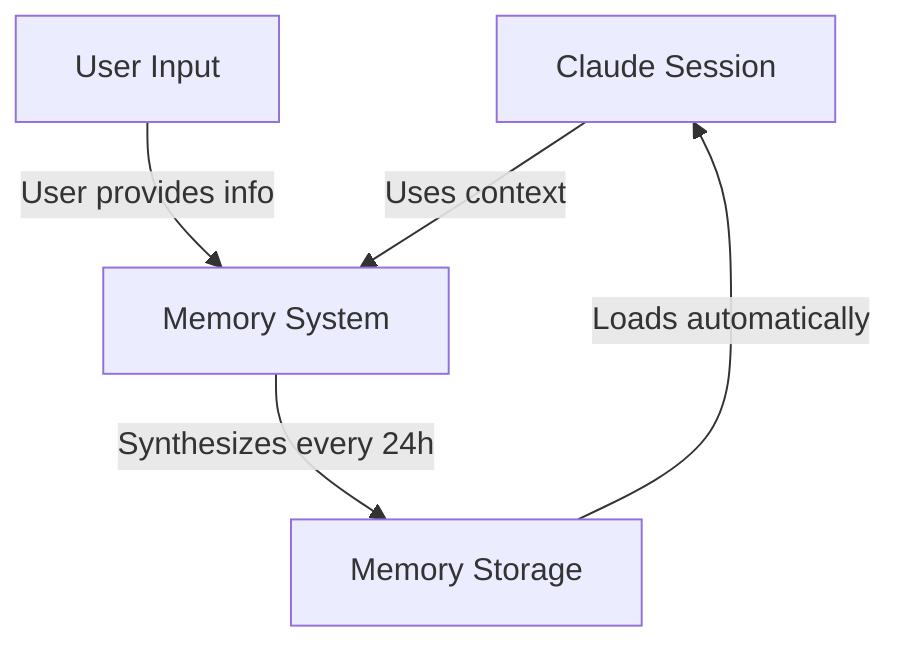
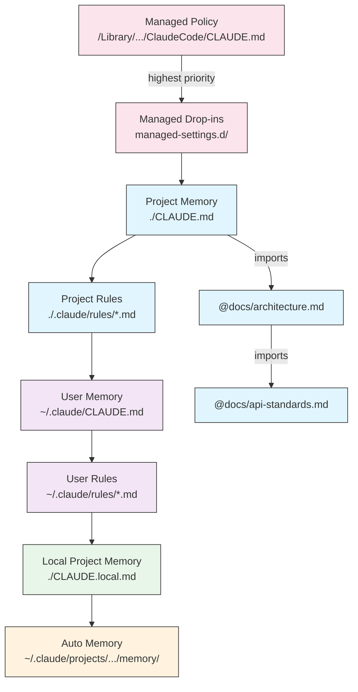
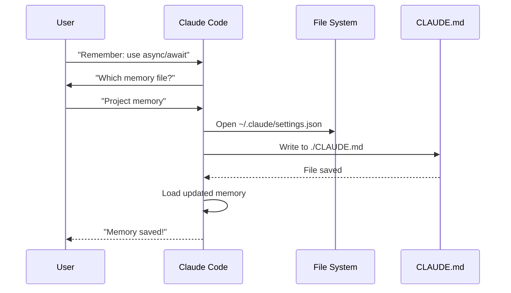
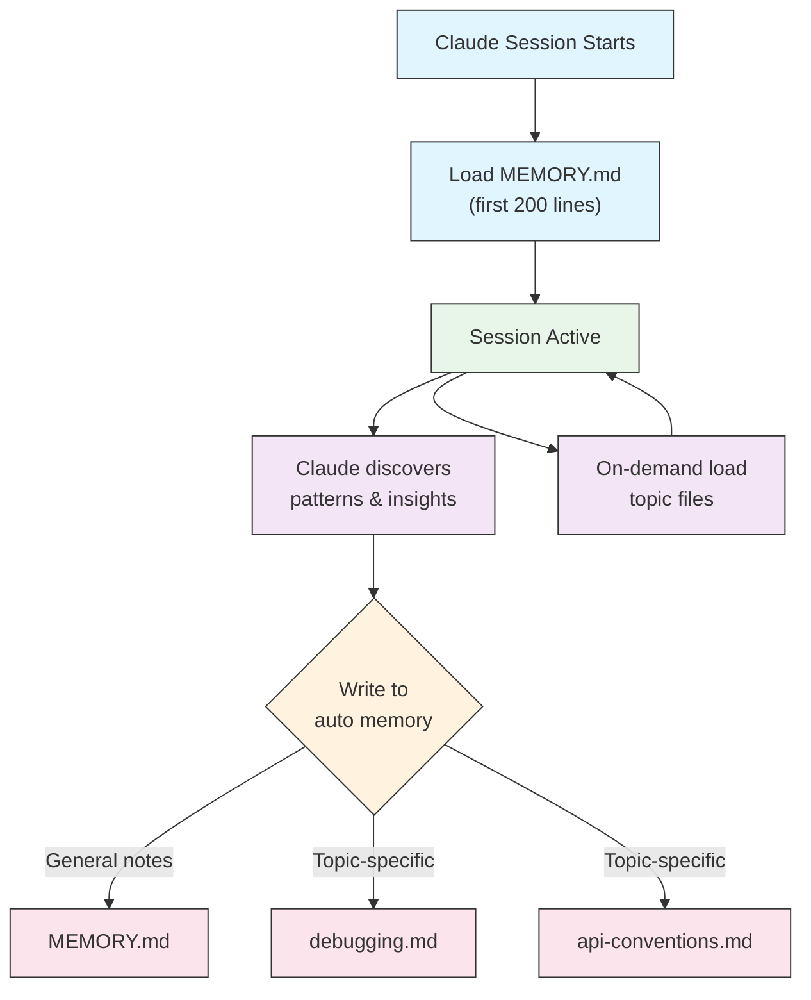

<picture>
  <source media="(prefers-color-scheme: dark)" srcset="../resources/logos/claude-howto-logo-dark.svg">
  
</picture>

# Memory 指南

🧠 Memory（記憶）
用途: 跨會話持久化上下文
難度: ⭐ 初級 | 時間: 45 分鐘

Memory 使 Claude 能夠在不同工作階段和對話中保留上下文。它以兩種形式存在：claude.ai 中的自動合成，以及 Claude Code 中基於檔案系統的 CLAUDE.md。

## 概述

Claude Code 中的 Memory 提供跨多個工作階段和對話的持久上下文。與臨時的上下文視窗不同，memory 檔案讓你能夠：

- 在團隊間共享專案標準
- 儲存個人開發偏好
- 維護目錄特定的規則與配置
- 匯入外部文件
- 將 memory 作為專案的一部分進行版本控制

Memory 系統在多個層級運作，從全域個人偏好到特定子目錄，允許對 Claude 記住什麼以及如何應用這些知識進行細緻的控制。

## Memory 指令快速參考

| 指令 | 用途 | 使用方式 | 使用時機 |
|---------|---------|-------|-------------|
| `/init` | 初始化專案 memory | `/init` | 開始新專案、首次設定 CLAUDE.md |
| `/memory` | 在編輯器中編輯 memory 檔案 | `/memory` | 大量更新、重新組織、審查內容 |
| `#` 前綴 | 快速新增單行 memory | `# Your rule here` | 對話中快速新增規則 |
| `# new rule into memory` | 明確的 memory 新增 | `# new rule into memory<br/>Your detailed rule` | 新增複雜的多行規則 |
| `# remember this` | 自然語言 memory | `# remember this<br/>Your instruction` | 對話式 memory 更新 |
| `@path/to/file` | 匯入外部內容 | `@README.md` 或 `@docs/api.md` | 在 CLAUDE.md 中引用現有文件 |

## 快速入門：初始化 Memory

### `/init` 指令

`/init` 指令是在 Claude Code 中設定專案 memory 的最快方式。它會以基礎專案文件初始化 CLAUDE.md 檔案。

**使用方式：**

```bash
/init
```

**功能：**

- 在你的專案中建立新的 CLAUDE.md 檔案（通常在 `./CLAUDE.md` 或 `./.claude/CLAUDE.md`）
- 建立專案慣例與指導方針
- 為跨工作階段的上下文持久性奠定基礎
- 提供用於記錄專案標準的模板結構

**增強的互動模式：** 設定 `CLAUDE_CODE_NEW_INIT=true` 可啟用多階段互動式流程，引導你逐步完成專案設定：

```bash
CLAUDE_CODE_NEW_INIT=true claude
/init
```

**何時使用 `/init`：**

- 以 Claude Code 開始新專案
- 建立團隊程式碼標準與慣例
- 建立關於程式碼庫結構的文件
- 為協作開發設定 memory 層級

**範例工作流程：**

```markdown
# 在你的專案目錄中
/init

# Claude 建立 CLAUDE.md，結構如下：
# Project Configuration
## Project Overview
- Name: Your Project
- Tech Stack: [Your technologies]
- Team Size: [Number of developers]

## Development Standards
- Code style preferences
- Testing requirements
- Git workflow conventions
```

### 使用 `#` 快速更新 Memory

你可以在任何對話中以 `#` 開頭的訊息快速將資訊新增至 memory：

**語法：**

```markdown
# 你的 memory 規則或指示
```

**範例：**

```markdown
# Always use TypeScript strict mode in this project

# Prefer async/await over promise chains

# Run npm test before every commit

# Use kebab-case for file names
```

**運作方式：**

1. 以 `#` 開頭輸入你的規則
2. Claude 識別為 memory 更新請求
3. Claude 詢問要更新哪個 memory 檔案（專案或個人）
4. 規則被新增至適當的 CLAUDE.md 檔案
5. 未來的工作階段會自動載入此上下文

**替代模式：**

```markdown
# new rule into memory
Always validate user input with Zod schemas

# remember this
Use semantic versioning for all releases

# add to memory
Database migrations must be reversible
```

### `/memory` 指令

`/memory` 指令提供在 Claude Code 工作階段中直接編輯 CLAUDE.md memory 檔案的存取。它會在你的系統編輯器中開啟 memory 檔案以進行完整編輯。

**使用方式：**

```bash
/memory
```

**功能：**

- 在系統預設編輯器中開啟你的 memory 檔案
- 允許進行大量新增、修改和重新組織
- 提供對層級中所有 memory 檔案的直接存取
- 使你能夠管理跨工作階段的持久上下文

**何時使用 `/memory`：**

- 審查現有的 memory 內容
- 對專案標準進行大量更新
- 重新組織 memory 結構
- 新增詳細的文件或指導方針
- 隨著專案演進維護和更新 memory

**比較：`/memory` 與 `/init`**

| 面向 | `/memory` | `/init` |
|--------|-----------|---------|
| **用途** | 編輯現有 memory 檔案 | 初始化新的 CLAUDE.md |
| **使用時機** | 更新/修改專案上下文 | 開始新專案 |
| **動作** | 開啟編輯器進行變更 | 產生起始模板 |
| **工作流程** | 持續維護 | 一次性設定 |

**範例工作流程：**

```markdown
# 開啟 memory 進行編輯
/memory

# Claude 呈現選項：
# 1. Managed Policy Memory
# 2. Project Memory (./CLAUDE.md)
# 3. User Memory (~/.claude/CLAUDE.md)
# 4. Local Project Memory

# 選擇選項 2（Project Memory）
# 你的預設編輯器開啟 ./CLAUDE.md 的內容

# 進行變更、儲存並關閉編輯器
# Claude 自動重新載入更新後的 memory
```

**使用 Memory 匯入：**

CLAUDE.md 檔案支援 `@path/to/file` 語法以包含外部內容：

```markdown
# Project Documentation
See @README.md for project overview
See @package.json for available npm commands
See @docs/architecture.md for system design

# Import from home directory using absolute path
@~/.claude/my-project-instructions.md
```

**匯入功能：**

- 支援相對路徑和絕對路徑（例如 `@docs/api.md` 或 `@~/.claude/my-project-instructions.md`）
- 支援遞迴匯入，最大深度為 5
- 首次從外部位置匯入會觸發核准對話框以確保安全
- 匯入指令不會在 markdown 程式碼區段或程式碼區塊內被解析（因此在範例中記錄它們是安全的）
- 透過引用現有文件幫助避免重複
- 自動將引用的內容包含在 Claude 的上下文中

## Memory 架構

Claude Code 中的 Memory 遵循分層系統，不同範圍有不同用途：



## Claude Code 中的 Memory 層級

Claude Code 使用多層級的分層 memory 系統。Memory 檔案在 Claude Code 啟動時自動載入，較高層級的檔案具有較高優先權。

**完整的 Memory 層級（依優先順序）：**

1. **Managed Policy** - 組織範圍的指示
   - macOS：`/Library/Application Support/ClaudeCode/CLAUDE.md`
   - Linux/WSL：`/etc/claude-code/CLAUDE.md`
   - Windows：`C:\Program Files\ClaudeCode\CLAUDE.md`

2. **Managed Drop-ins** - 按字母順序合併的政策檔案（v2.1.83+）
   - 與 managed policy CLAUDE.md 同級的 `managed-settings.d/` 目錄
   - 檔案按字母順序合併，用於模組化政策管理

3. **Project Memory** - 團隊共享的上下文（版本控制）
   - `./.claude/CLAUDE.md` 或 `./CLAUDE.md`（在倉庫根目錄）

4. **Project Rules** - 模組化、主題特定的專案指示
   - `./.claude/rules/*.md`

5. **User Memory** - 個人偏好（所有專案）
   - `~/.claude/CLAUDE.md`

6. **User-Level Rules** - 個人規則（所有專案）
   - `~/.claude/rules/*.md`

7. **Local Project Memory** - 個人專案特定偏好
   - `./CLAUDE.local.md`

> **注意**：截至 2026 年 3 月，`CLAUDE.local.md` 未在[官方文件](https://code.claude.com/docs/en/memory)中提及。它可能仍作為舊版功能運作。對於新專案，請考慮使用 `~/.claude/CLAUDE.md`（使用者層級）或 `.claude/rules/`（專案層級，路徑範圍）。

8. **Auto Memory** - Claude 的自動筆記和學習
   - `~/.claude/projects/<project>/memory/`

**Memory 探索行為：**

Claude 按以下順序搜尋 memory 檔案，較早的位置具有較高優先權：



## 使用 `claudeMdExcludes` 排除 CLAUDE.md 檔案

在大型 monorepo 中，某些 CLAUDE.md 檔案可能與你目前的工作無關。`claudeMdExcludes` 設定讓你可以跳過特定的 CLAUDE.md 檔案，使其不被載入到上下文中：

```jsonc
// In ~/.claude/settings.json or .claude/settings.json
{
  "claudeMdExcludes": [
    "packages/legacy-app/CLAUDE.md",
    "vendors/**/CLAUDE.md"
  ]
}
```

模式會與相對於專案根目錄的路徑進行匹配。這對以下情況特別有用：

- 具有許多子專案的 monorepo，其中只有部分相關
- 包含第三方 CLAUDE.md 檔案的倉庫
- 透過排除過時或不相關的指示來減少 Claude 上下文視窗中的雜訊

## 設定檔案層級

Claude Code 設定（包括 `autoMemoryDirectory`、`claudeMdExcludes` 和其他配置）從五層級層級中解析，較高層級具有較高優先權：

| 層級 | 位置 | 範圍 |
|-------|----------|-------|
| 1（最高） | Managed policy（系統層級） | 組織範圍的強制執行 |
| 2 | `managed-settings.d/`（v2.1.83+） | 模組化政策 drop-ins，按字母順序合併 |
| 3 | `~/.claude/settings.json` | 使用者偏好 |
| 4 | `.claude/settings.json` | 專案層級（提交至 git） |
| 5（最低） | `.claude/settings.local.json` | 本地覆寫（git 忽略） |

**平台特定配置（v2.1.51+）：**

設定也可透過以下方式配置：
- **macOS**：Property list (plist) 檔案
- **Windows**：Windows Registry

這些平台原生機制與 JSON 設定檔案一起讀取，遵循相同的優先順序規則。

## 模組化規則系統

使用 `.claude/rules/` 目錄結構建立有組織、路徑特定的規則。規則可在專案層級和使用者層級定義：

```
your-project/
├── .claude/
│   ├── CLAUDE.md
│   └── rules/
│       ├── code-style.md
│       ├── testing.md
│       ├── security.md
│       └── api/                  # 支援子目錄
│           ├── conventions.md
│           └── validation.md

~/.claude/
├── CLAUDE.md
└── rules/                        # 使用者層級規則（所有專案）
    ├── personal-style.md
    └── preferred-patterns.md
```

規則在 `rules/` 目錄中遞迴探索，包括任何子目錄。`~/.claude/rules/` 中的使用者層級規則在專案層級規則之前載入，允許專案可覆寫的個人預設值。

### 使用 YAML Frontmatter 的路徑特定規則

定義僅適用於特定檔案路徑的規則：

```markdown
---
paths: src/api/**/*.ts
---

# API 開發規則

- 所有 API 端點必須包含輸入驗證
- 使用 Zod 進行 schema 驗證
- 記錄所有參數和回應類型
- 所有操作包含錯誤處理
```

**Glob 模式範例：**

- `**/*.ts` - 所有 TypeScript 檔案
- `src/**/*` - src/ 下的所有檔案
- `src/**/*.{ts,tsx}` - 多個副檔名
- `{src,lib}/**/*.ts, tests/**/*.test.ts` - 多個模式

### 子目錄和符號連結

`.claude/rules/` 中的規則支援兩種組織功能：

- **子目錄**：規則會遞迴探索，因此你可以將它們組織到基於主題的資料夾中（例如 `rules/api/`、`rules/testing/`、`rules/security/`）
- **符號連結**：支援符號連結以在多個專案間共享規則。例如，你可以將共享規則檔案從中央位置符號連結到每個專案的 `.claude/rules/` 目錄

## Memory 位置表

| 位置 | 範圍 | 優先權 | 共享 | 存取 | 適合用途 |
|----------|-------|----------|--------|--------|----------|
| `/Library/Application Support/ClaudeCode/CLAUDE.md` (macOS) | Managed Policy | 1（最高） | 組織 | 系統 | 公司範圍的政策 |
| `/etc/claude-code/CLAUDE.md` (Linux/WSL) | Managed Policy | 1（最高） | 組織 | 系統 | 組織標準 |
| `C:\Program Files\ClaudeCode\CLAUDE.md` (Windows) | Managed Policy | 1（最高） | 組織 | 系統 | 企業指導方針 |
| `managed-settings.d/*.md`（與政策同級） | Managed Drop-ins | 1.5 | 組織 | 系統 | 模組化政策檔案（v2.1.83+） |
| `./CLAUDE.md` 或 `./.claude/CLAUDE.md` | Project Memory | 2 | 團隊 | Git | 團隊標準、共享架構 |
| `./.claude/rules/*.md` | Project Rules | 3 | 團隊 | Git | 路徑特定、模組化規則 |
| `~/.claude/CLAUDE.md` | User Memory | 4 | 個人 | 檔案系統 | 個人偏好（所有專案） |
| `~/.claude/rules/*.md` | User Rules | 5 | 個人 | 檔案系統 | 個人規則（所有專案） |
| `./CLAUDE.local.md` | Project Local | 6 | 個人 | Git（忽略） | 個人專案特定偏好 |
| `~/.claude/projects/<project>/memory/` | Auto Memory | 7（最低） | 個人 | 檔案系統 | Claude 的自動筆記和學習 |

## Memory 更新生命週期

以下是 memory 更新如何在 Claude Code 工作階段中流動：



## Auto Memory

Auto memory 是一個持久目錄，Claude 在工作中會自動記錄學習、模式和洞察。與你手動撰寫和維護的 CLAUDE.md 檔案不同，auto memory 是由 Claude 本身在工作階段中撰寫的。

### Auto Memory 的運作方式

- **位置**：`~/.claude/projects/<project>/memory/`
- **入口點**：`MEMORY.md` 作為 auto memory 目錄中的主要檔案
- **主題檔案**：特定主題的可選額外檔案（例如 `debugging.md`、`api-conventions.md`）
- **載入行為**：`MEMORY.md` 的前 200 行在工作階段開始時載入到系統提示中。主題檔案按需載入，不在啟動時載入。
- **讀寫**：Claude 在工作階段中發現模式和專案特定知識時讀取和寫入 memory 檔案

### Auto Memory 架構



### Auto Memory 目錄結構

```
~/.claude/projects/<project>/memory/
├── MEMORY.md              # 入口點（啟動時載入前 200 行）
├── debugging.md           # 主題檔案（按需載入）
├── api-conventions.md     # 主題檔案（按需載入）
└── testing-patterns.md    # 主題檔案（按需載入）
```

### 版本要求

Auto memory 需要 **Claude Code v2.1.59 或更新版本**。如果你使用較舊版本，請先升級：

```bash
npm install -g @anthropic-ai/claude-code@latest
```

### 自訂 Auto Memory 目錄

預設情況下，auto memory 儲存在 `~/.claude/projects/<project>/memory/`。你可以使用 `autoMemoryDirectory` 設定來變更此位置（自 **v2.1.74** 起可用）：

```jsonc
// In ~/.claude/settings.json or .claude/settings.local.json (user/local settings only)
{
  "autoMemoryDirectory": "/path/to/custom/memory/directory"
}
```

> **注意**：`autoMemoryDirectory` 只能在使用者層級（`~/.claude/settings.json`）或本地設定（`.claude/settings.local.json`）中設定，不能在專案或 managed policy 設定中。

這在以下情況很有用：

- 將 auto memory 儲存在共享或同步位置
- 將 auto memory 與預設 Claude 配置目錄分離
- 使用預設層級之外的專案特定路徑

### Worktree 和倉庫共享

同一 git 倉庫中的所有 worktree 和子目錄共享一個 auto memory 目錄。這意味著在 worktree 之間切換或在同一倉庫的不同子目錄中工作時，會讀寫相同的 memory 檔案。

### Subagent Memory

Subagents（透過 Task 工具或平行執行產生的）可以有自己的 memory 上下文。在 subagent 定義中使用 `memory` frontmatter 欄位來指定要載入的 memory 範圍：

```yaml
memory: user      # 僅載入使用者層級 memory
memory: project   # 僅載入專案層級 memory
memory: local     # 僅載入本地 memory
```

這允許 subagents 使用聚焦的上下文運作，而非繼承完整的 memory 層級。

### 控制 Auto Memory

Auto memory 可透過 `CLAUDE_CODE_DISABLE_AUTO_MEMORY` 環境變數控制：

| 值 | 行為 |
|-------|----------|
| `0` | 強制啟用 auto memory |
| `1` | 強制停用 auto memory |
| *（未設定）* | 預設行為（啟用 auto memory） |

```bash
# 為工作階段停用 auto memory
CLAUDE_CODE_DISABLE_AUTO_MEMORY=1 claude

# 明確強制啟用 auto memory
CLAUDE_CODE_DISABLE_AUTO_MEMORY=0 claude
```

## 使用 `--add-dir` 新增額外目錄

`--add-dir` 旗標允許 Claude Code 從目前工作目錄以外的額外目錄載入 CLAUDE.md 檔案。這對 monorepo 或多專案設定很有用，因為其他目錄的上下文可能相關。

要啟用此功能，設定環境變數：

```bash
CLAUDE_CODE_ADDITIONAL_DIRECTORIES_CLAUDE_MD=1
```

然後使用該旗標啟動 Claude Code：

```bash
claude --add-dir /path/to/other/project
```

Claude 會從指定的額外目錄載入 CLAUDE.md，同時載入目前工作目錄的 memory 檔案。

## 實際範例

### 範例 1：專案 Memory 結構

**檔案：** `./CLAUDE.md`

```markdown
# Project Configuration

## Project Overview
- **Name**: E-commerce Platform
- **Tech Stack**: Node.js, PostgreSQL, React 18, Docker
- **Team Size**: 5 developers
- **Deadline**: Q4 2025

## Architecture
@docs/architecture.md
@docs/api-standards.md
@docs/database-schema.md

## Development Standards

### Code Style
- Use Prettier for formatting
- Use ESLint with airbnb config
- Maximum line length: 100 characters
- Use 2-space indentation

### Naming Conventions
- **Files**: kebab-case (user-controller.js)
- **Classes**: PascalCase (UserService)
- **Functions/Variables**: camelCase (getUserById)
- **Constants**: UPPER_SNAKE_CASE (API_BASE_URL)
- **Database Tables**: snake_case (user_accounts)

### Git Workflow
- Branch names: `feature/description` or `fix/description`
- Commit messages: Follow conventional commits
- PR required before merge
- All CI/CD checks must pass
- Minimum 1 approval required

### Testing Requirements
- Minimum 80% code coverage
- All critical paths must have tests
- Use Jest for unit tests
- Use Cypress for E2E tests
- Test filenames: `*.test.ts` or `*.spec.ts`

### API Standards
- RESTful endpoints only
- JSON request/response
- Use HTTP status codes correctly
- Version API endpoints: `/api/v1/`
- Document all endpoints with examples

### Database
- Use migrations for schema changes
- Never hardcode credentials
- Use connection pooling
- Enable query logging in development
- Regular backups required

### Deployment
- Docker-based deployment
- Kubernetes orchestration
- Blue-green deployment strategy
- Automatic rollback on failure
- Database migrations run before deploy

## Common Commands

| Command | Purpose |
|---------|---------|
| `npm run dev` | Start development server |
| `npm test` | Run test suite |
| `npm run lint` | Check code style |
| `npm run build` | Build for production |
| `npm run migrate` | Run database migrations |

## Team Contacts
- Tech Lead: Sarah Chen (@sarah.chen)
- Product Manager: Mike Johnson (@mike.j)
- DevOps: Alex Kim (@alex.k)

## Known Issues & Workarounds
- PostgreSQL connection pooling limited to 20 during peak hours
- Workaround: Implement query queuing
- Safari 14 compatibility issues with async generators
- Workaround: Use Babel transpiler

## Related Projects
- Analytics Dashboard: `/projects/analytics`
- Mobile App: `/projects/mobile`
- Admin Panel: `/projects/admin`
```

### 範例 2：目錄特定 Memory

**檔案：** `./src/api/CLAUDE.md`

```markdown
# API Module Standards

This file overrides root CLAUDE.md for everything in /src/api/

## API-Specific Standards

### Request Validation
- Use Zod for schema validation
- Always validate input
- Return 400 with validation errors
- Include field-level error details

### Authentication
- All endpoints require JWT token
- Token in Authorization header
- Token expires after 24 hours
- Implement refresh token mechanism

### Response Format

All responses must follow this structure:

```json
{
  "success": true,
  "data": { /* actual data */ },
  "timestamp": "2025-11-06T10:30:00Z",
  "version": "1.0"
}
```

Error responses:
```json
{
  "success": false,
  "error": {
    "code": "VALIDATION_ERROR",
    "message": "User message",
    "details": { /* field errors */ }
  },
  "timestamp": "2025-11-06T10:30:00Z"
}
```

### Pagination
- Use cursor-based pagination (not offset)
- Include `hasMore` boolean
- Limit max page size to 100
- Default page size: 20

### Rate Limiting
- 1000 requests per hour for authenticated users
- 100 requests per hour for public endpoints
- Return 429 when exceeded
- Include retry-after header

### Caching
- Use Redis for session caching
- Cache duration: 5 minutes default
- Invalidate on write operations
- Tag cache keys with resource type
```

### 範例 3：個人 Memory

**檔案：** `~/.claude/CLAUDE.md`

```markdown
# My Development Preferences

## About Me
- **Experience Level**: 8 years full-stack development
- **Preferred Languages**: TypeScript, Python
- **Communication Style**: Direct, with examples
- **Learning Style**: Visual diagrams with code

## Code Preferences

### Error Handling
I prefer explicit error handling with try-catch blocks and meaningful error messages.
Avoid generic errors. Always log errors for debugging.

### Comments
Use comments for WHY, not WHAT. Code should be self-documenting.
Comments should explain business logic or non-obvious decisions.

### Testing
I prefer TDD (test-driven development).
Write tests first, then implementation.
Focus on behavior, not implementation details.

### Architecture
I prefer modular, loosely-coupled design.
Use dependency injection for testability.
Separate concerns (Controllers, Services, Repositories).

## Debugging Preferences
- Use console.log with prefix: `[DEBUG]`
- Include context: function name, relevant variables
- Use stack traces when available
- Always include timestamps in logs

## Communication
- Explain complex concepts with diagrams
- Show concrete examples before explaining theory
- Include before/after code snippets
- Summarize key points at the end

## Project Organization
I organize my projects as:

   project/
   ├── src/
   │   ├── api/
   │   ├── services/
   │   ├── models/
   │   └── utils/
   ├── tests/
   ├── docs/
   └── docker/

## Tooling
- **IDE**: VS Code with vim keybindings
- **Terminal**: Zsh with Oh-My-Zsh
- **Format**: Prettier (100 char line length)
- **Linter**: ESLint with airbnb config
- **Test Framework**: Jest with React Testing Library
```

_我的測試_
請 Claude 儲存一條新規則


Claude 沒有儲存規則，因為我在任何地方都沒有 `Claude.md` 檔案。然後請 Claude 確認位置。


### 範例 4：工作階段中的 Memory 更新

你可以在活躍的 Claude Code 工作階段中將新規則新增到 memory。有兩種方式：

#### 方法 1：直接請求

```markdown
User: Remember that I prefer using React hooks instead of class components
     for all new components.

Claude: I'm adding that to your memory. Which memory file should this go in?
        1. Project memory (./CLAUDE.md)
        2. Personal memory (~/.claude/CLAUDE.md)

User: Project memory

Claude: ✅ Memory saved!

Added to ./CLAUDE.md:
---

### Component Development
- Use functional components with React Hooks
- Prefer hooks over class components
- Custom hooks for reusable logic
- Use useCallback for event handlers
- Use useMemo for expensive computations
```

#### 方法 2：使用 "# new rule into memory" 模式

你也可以使用明確的 "# new rule into memory" 模式來觸發 memory 更新：

```markdown
User: # new rule into memory
      Always validate user input with Zod schemas before processing.

Claude: I'm saving this rule to memory. Which memory file should I use?
        1. Project memory (./CLAUDE.md)
        2. Personal memory (~/.claude/CLAUDE.md)

User: Project memory

Claude: ✅ Memory saved!

Added to ./CLAUDE.md:
---

### Input Validation
- Always validate user input with Zod schemas before processing
- Define schemas at the top of each API handler file
- Return 400 status with validation errors
```

#### 新增 Memory 的技巧

- 規則要具體且可操作
- 將相關規則分組在章節標題下
- 更新現有章節而非重複內容
- 選擇適當的 memory 範圍（專案 vs. 個人）

## Memory 功能比較

| 功能 | Claude Web/Desktop | Claude Code (CLAUDE.md) |
|---------|-------------------|------------------------|
| 自動合成 | ✅ 每 24 小時 | ❌ 手動 |
| 跨專案 | ✅ 共享 | ❌ 專案特定 |
| 團隊存取 | ✅ 共享專案 | ✅ Git 追蹤 |
| 可搜尋 | ✅ 內建 | ✅ 透過 `/memory` |
| 可編輯 | ✅ 在聊天中 | ✅ 直接編輯檔案 |
| 匯入/匯出 | ✅ 是 | ✅ 複製/貼上 |
| 持久性 | ✅ 24 小時以上 | ✅ 永久 |

### Claude Web/Desktop 中的 Memory

#### Memory 合成時間線


**Memory 摘要範例：**

```markdown
## Claude's Memory of User

### Professional Background
- Senior full-stack developer with 8 years experience
- Focus on TypeScript/Node.js backends and React frontends
- Active open source contributor
- Interested in AI and machine learning

### Project Context
- Currently building e-commerce platform
- Tech stack: Node.js, PostgreSQL, React 18, Docker
- Working with team of 5 developers
- Using CI/CD and blue-green deployments

### Communication Preferences
- Prefers direct, concise explanations
- Likes visual diagrams and examples
- Appreciates code snippets
- Explains business logic in comments

### Current Goals
- Improve API performance
- Increase test coverage to 90%
- Implement caching strategy
- Document architecture
```

## 最佳實務

### 應該做 - 應包含的內容

- **具體且詳細**：使用清晰、詳細的指示而非模糊的指導
  - ✅ 好："Use 2-space indentation for all JavaScript files"
  - ❌ 避免："Follow best practices"

- **保持有組織**：使用清晰的 markdown 章節和標題結構化 memory 檔案

- **使用適當的層級**：
  - **Managed policy**：公司範圍的政策、安全標準、合規要求
  - **Project memory**：團隊標準、架構、程式碼慣例（提交至 git）
  - **User memory**：個人偏好、溝通風格、工具選擇
  - **Directory memory**：模組特定的規則和覆寫

- **善用匯入**：使用 `@path/to/file` 語法引用現有文件
  - 支援最多 5 層遞迴巢狀
  - 避免跨 memory 檔案的重複
  - 範例：`See @README.md for project overview`

- **記錄常用指令**：包含你經常使用的指令以節省時間

- **版本控制專案 memory**：將專案層級的 CLAUDE.md 檔案提交至 git 以利團隊

- **定期審查**：隨著專案演進和需求變更，定期更新 memory

- **提供具體範例**：包含程式碼片段和特定場景

### 不應該做 - 應避免的內容

- **不要儲存機密資料**：絕不包含 API 金鑰、密碼、token 或憑證

- **不要包含敏感資料**：不要有 PII、私人資訊或專有機密

- **不要重複內容**：使用匯入（`@path`）引用現有文件

- **不要模糊不清**：避免通用陳述如 "follow best practices" 或 "write good code"

- **不要太長**：保持個別 memory 檔案聚焦且在 500 行以內

- **不要過度組織**：策略性地使用層級；不要建立過多的子目錄覆寫

- **不要忘記更新**：過時的 memory 會造成混淆和過時的做法

- **不要超過巢狀限制**：Memory 匯入支援最多 5 層巢狀

### Memory 管理技巧

**選擇正確的 memory 層級：**

| 使用案例 | Memory 層級 | 理由 |
|----------|-------------|-----------|
| 公司安全政策 | Managed Policy | 適用於組織範圍內的所有專案 |
| 團隊程式碼風格指南 | Project | 透過 git 與團隊共享 |
| 你偏好的編輯器快捷鍵 | User | 個人偏好，不共享 |
| API 模組標準 | Directory | 僅適用於該模組 |

**快速更新工作流程：**

1. 單一規則：在對話中使用 `#` 前綴
2. 多項變更：使用 `/memory` 開啟編輯器
3. 初始設定：使用 `/init` 建立模板

**匯入最佳實務：**

```markdown
# Good: Reference existing docs
@README.md
@docs/architecture.md
@package.json

# Avoid: Copying content that exists elsewhere
# Instead of copying README content into CLAUDE.md, just import it
```

## 安裝說明

### 設定專案 Memory

#### 方法 1：使用 `/init` 指令（建議）

設定專案 memory 的最快方式：

1. **導航至你的專案目錄：**
   ```bash
   cd /path/to/your/project
   ```

2. **在 Claude Code 中執行 init 指令：**
   ```bash
   /init
   ```

3. **Claude 會建立並填入 CLAUDE.md** 的模板結構

4. **自訂產生的檔案**以符合你的專案需求

5. **提交至 git：**
   ```bash
   git add CLAUDE.md
   git commit -m "Initialize project memory with /init"
   ```

#### 方法 2：手動建立

如果你偏好手動設定：

1. **在專案根目錄建立 CLAUDE.md：**
   ```bash
   cd /path/to/your/project
   touch CLAUDE.md
   ```

2. **新增專案標準：**
   ```bash
   cat > CLAUDE.md << 'EOF'
   # Project Configuration

   ## Project Overview
   - **Name**: Your Project Name
   - **Tech Stack**: List your technologies
   - **Team Size**: Number of developers

   ## Development Standards
   - Your coding standards
   - Naming conventions
   - Testing requirements
   EOF
   ```

3. **提交至 git：**
   ```bash
   git add CLAUDE.md
   git commit -m "Add project memory configuration"
   ```

#### 方法 3：使用 `#` 快速更新

CLAUDE.md 建立後，在對話中快速新增規則：

```markdown
# Use semantic versioning for all releases

# Always run tests before committing

# Prefer composition over inheritance
```

Claude 會提示你選擇要更新哪個 memory 檔案。

### 設定個人 Memory

1. **建立 ~/.claude 目錄：**
   ```bash
   mkdir -p ~/.claude
   ```

2. **建立個人 CLAUDE.md：**
   ```bash
   touch ~/.claude/CLAUDE.md
   ```

3. **新增你的偏好：**
   ```bash
   cat > ~/.claude/CLAUDE.md << 'EOF'
   # My Development Preferences

   ## About Me
   - Experience Level: [Your level]
   - Preferred Languages: [Your languages]
   - Communication Style: [Your style]

   ## Code Preferences
   - [Your preferences]
   EOF
   ```

### 設定目錄特定 Memory

1. **為特定目錄建立 memory：**
   ```bash
   mkdir -p /path/to/directory/.claude
   touch /path/to/directory/CLAUDE.md
   ```

2. **新增目錄特定規則：**
   ```bash
   cat > /path/to/directory/CLAUDE.md << 'EOF'
   # [Directory Name] Standards

   This file overrides root CLAUDE.md for this directory.

   ## [Specific Standards]
   EOF
   ```

3. **提交至版本控制：**
   ```bash
   git add /path/to/directory/CLAUDE.md
   git commit -m "Add [directory] memory configuration"
   ```

### 驗證設定

1. **檢查 memory 位置：**
   ```bash
   # 專案根目錄 memory
   ls -la ./CLAUDE.md

   # 個人 memory
   ls -la ~/.claude/CLAUDE.md
   ```

2. **Claude Code 會在啟動工作階段時自動載入**這些檔案

3. **在你的專案中啟動新工作階段來測試 Claude Code**

## 官方文件

如需最新資訊，請參閱官方 Claude Code 文件：

- **[Memory 文件](https://code.claude.com/docs/en/memory)** - 完整的 memory 系統參考
- **[Slash Commands 參考](https://code.claude.com/docs/en/interactive-mode)** - 所有內建指令，包括 `/init` 和 `/memory`
- **[CLI 參考](https://code.claude.com/docs/en/cli-reference)** - 命令列介面文件

### 官方文件中的關鍵技術細節

**Memory 載入：**

- 所有 memory 檔案在 Claude Code 啟動時自動載入
- Claude 從目前工作目錄向上遍歷以探索 CLAUDE.md 檔案
- 子樹檔案在存取那些目錄時會被上下文性地探索和載入

**匯入語法：**

- 使用 `@path/to/file` 包含外部內容（例如 `@~/.claude/my-project-instructions.md`）
- 支援相對和絕對路徑
- 支援遞迴匯入，最大深度為 5
- 首次外部匯入會觸發核准對話框
- 不會在 markdown 程式碼區段或程式碼區塊內解析
- 自動將引用的內容包含在 Claude 的上下文中

**Memory 層級優先順序：**

1. Managed Policy（最高優先權）
2. Managed Drop-ins（`managed-settings.d/`，v2.1.83+）
3. Project Memory
4. Project Rules（`.claude/rules/`）
5. User Memory
6. User-Level Rules（`~/.claude/rules/`）
7. Local Project Memory
8. Auto Memory（最低優先權）

## 相關概念連結

### 整合點
- [MCP Protocol](../05-mcp/) - 與 memory 並用的即時資料存取
- [Slash Commands](../01-slash-commands/) - 工作階段特定的快捷方式
- [Skills](../03-skills/) - 搭配 memory 上下文的自動化工作流程

### 相關的 Claude 功能
- [Claude Web Memory](https://claude.ai) - 自動合成
- [官方 Memory 文件](https://code.claude.com/docs/en/memory) - Anthropic 文件
