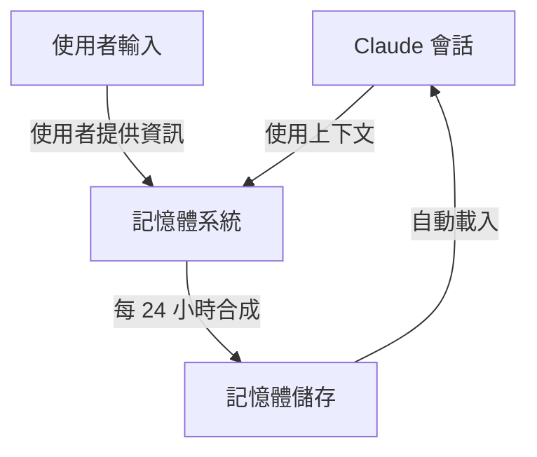
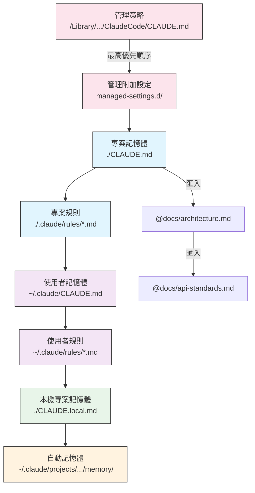
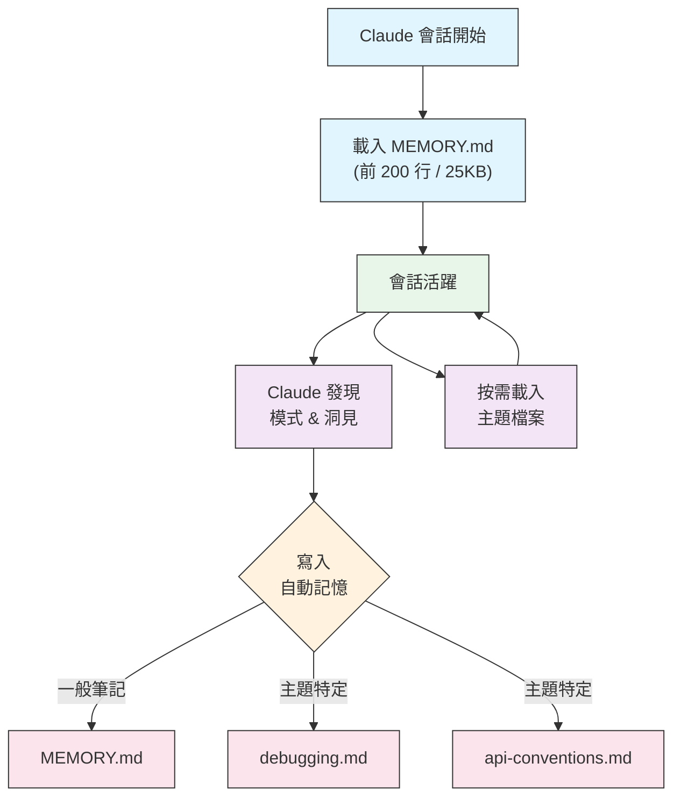

# 記憶指南

記憶功能讓 Claude 能夠跨會話和對話保留上下文。它有兩種形式：在 claude.ai 中的自動合成，以及在 Claude Code 中的檔案系統基礎的 CLAUDE.md。

## 總覽

在 Claude Code 中，記憶功能提供持續的上下文，跨多個會話和對話有效。與暫時的上下文視窗不同，記憶檔案讓您可以：

- 共享團隊專案標準
- 儲存個人開發偏好
- 維護特定目錄的規則和設定
- 匯入外部文件
- 將記憶作為專案的一部分進行版本控制

記憶系統在多個層級運作，從全球個人偏好到特定子目錄，讓您可以對 Claude 記住什麼以及如何應用這些知識進行細微控制。

## 記憶命令快速參考

| 命令 | 目的 | 用法 | 何時使用 |
|---------|---------|-------|-------------|
| `/init` | 初始化專案記憶 | `/init` | 啟動新專案，首次 CLAUDE.md 設定 |
| `/memory` | 在編輯器中編輯記憶檔案 | `/memory` | 大量更新、重新組織、檢閱內容 |
| `#` 前綴 | ~~快速單行記憶新增~~ **已停用** | — | 使用 `/memory` 或以對話方式詢問 |
| `@path/to/file` | 匯入外部內容 | `@README.md` 或 `@docs/api.md` | 在 CLAUDE.md 中參照現有文件 |

## 快速上手：初始化記憶

### `/init` 命令

`/init` 命令是在 Claude Code 中設定專案記憶體最快的方式。它會使用基礎專案文件初始化一個 CLAUDE.md 檔案。

**用法：**

```bash
/init
```

**它所做的事情：**

- 在您的專案中建立一個新的 CLAUDE.md 檔案（通常位於 `./CLAUDE.md` 或 `./.claude/CLAUDE.md`）
- 建立專案慣例和指南
- 設定跨會話的上下文持久性基礎
- 提供範本結構以記錄您的專案標準

**增強互動模式：** 設定 `CLAUDE_CODE_NEW_INIT=1` 以啟用多階段互動流程，逐步引導您完成專案設定：

```bash
CLAUDE_CODE_NEW_INIT=1 claude
/init
```

**何時使用 `/init`：**

- 啟動使用 Claude Code 的新專案
- 建立團隊編碼標準和慣例
- 建立關於您的程式碼庫結構的文件
- 設定協同開發的記憶體層級結構

**範例工作流程：**

```markdown
# 在您的專案目錄中
/init

# Claude 建立 CLAUDE.md 檔案，結構如下：
# 專案設定
## 專案概觀
- 姓名：您的專案
- 技術堆疊：[您的技術]
- 團隊規模：[開發人員數量]

## 開發標準
- 程式碼樣式偏好
- 測試需求
- Git 工作流程慣例
```

### 快速記憶體更新

> **注意**: 內嵌記憶體的 `#` 快捷方式已停用。使用 `/memory` 命令直接編輯記憶體檔案，或請 Claude 以對話方式記住某事（例如，「請記住我們總是使用 TypeScript 嚴格模式」）。

將資訊新增到記憶體的建議方法：

**選項 1：使用 `/memory` 命令**

```bash
/memory
```

在您的系統編輯器中開啟您的記憶體檔案以進行直接編輯。

**選項 2：以對話方式詢問**

```
請記住我們總是使用 TypeScript 嚴格模式在這個專案中。
請將以下內容新增到記憶體：偏好使用 async/await 而不是 promise 鏈。
```

Claude 將根據您的要求更新適當的 CLAUDE.md 檔案。

**歷史參考** (不再有效)：

先前 `#` 前綴快捷方式允許內嵌新增規則：

```markdown
# 總是使用 TypeScript 嚴格模式在這個專案中 ← 不再有效
```

如果您依賴此模式，請改用 `/memory` 命令或對話請求。

### `/memory` 命令

`/memory` 命令提供直接存取權，可在 Claude Code 會話中編輯您的 CLAUDE.md 記憶體檔案。它會在您的系統編輯器中開啟您的記憶體檔案以進行全面的編輯。

**用法：**

```bash
/memory
```

**它所做的事情：**

- 在您的系統的預設編輯器中開啟您的記憶體檔案
- 允許您進行廣泛的添加、修改和重新組織
- 提供對所有記憶體檔案層級結構的直接存取權
- 允許您管理跨會話的持久性上下文

**何時使用 `/memory`：**

- 檢視現有的記憶體內容
- 對專案標準進行廣泛的更新
- 重新組織記憶體結構
- 新增詳細的文件或指南

- 維護和更新記憶體，隨著專案演進

**比較：`/memory` vs `/init`**

| 方面 | `/memory` | `/init` |
|--------|-----------|---------|
| **目的** | 編輯現有的記憶體檔案 | 初始化新的 CLAUDE.md |
| **何時使用** | 更新/修改專案上下文 | 開始新的專案 |
| **動作** | 開啟編輯器進行變更 | 產生啟動範本 |
| **工作流程** | 持續維護 | 一次性設定 |

**範例工作流程：**

```markdown
# 開啟記憶體進行編輯
/memory

# Claude 呈現選項：
# 1. 託管策略記憶體
# 2. 專案記憶體 (./CLAUDE.md)
# 3. 使用者記憶體 (~/.claude/CLAUDE.md)
# 4. 本地專案記憶體

# 選擇選項 2 (專案記憶體)
# 您的預設編輯器會開啟，並顯示 ./CLAUDE.md 的內容

# 進行變更，儲存並關閉編輯器
# Claude 會自動重新載入更新後的記憶體
```

**使用記憶體匯入：**

CLAUDE.md 檔案支援 `@path/to/file` 語法來包含外部內容：

```markdown
# 專案文件
參閱 @README.md 以取得專案概觀
參閱 @package.json 以取得可用的 npm 命令
參閱 @docs/architecture.md 以取得系統設計

# 從主目錄匯入，使用絕對路徑
@~/.claude/my-project-instructions.md
```

**匯入功能：**

- 支援相對路徑和絕對路徑（例如：`@docs/api.md` 或 `@~/.claude/my-project-instructions.md`）
- 支援遞迴匯入，最大深度為 5
- 首次從外部位置匯入時，會觸發安全認可對話框
- 匯入指令不會在 Markdown 程式碼片段或程式碼區塊內評估（因此在範例中記錄它們是安全的）
- 透過參照現有文件來避免重複
- 自動將參照內容包含在 Claude 的上下文中

## 記憶體架構

記憶體在 Claude Code 中遵循一個層級系統，不同的範圍用於不同的目的：



## Claude Code 中的記憶體層級

Claude Code 使用多層級的層級記憶體系統。記憶體檔案在 Claude Code 啟動時自動載入，較高層級的檔案優先權較高。

**完整的記憶體層級 (按優先順序排列)：**

1. **管理策略** - 組織範圍內的指示
   - macOS: `/Library/Application Support/ClaudeCode/CLAUDE.md`
   - Linux/WSL: `/etc/claude-code/CLAUDE.md`
   - Windows: `C:\Program Files\ClaudeCode\CLAUDE.md`

2. **管理附加設定** - 字母順序合併的策略檔案 (v2.1.83+)
   - `managed-settings.d/` 目錄，位於管理策略 CLAUDE.md
   - 檔案以字母順序合併，以進行模組化的策略管理

3. **專案記憶體** - 團隊共享的上下文 (版本控制)
   - `./.claude/CLAUDE.md` 或 `./CLAUDE.md` (在儲存庫根目錄中)

4. **專案規則** - 模組化、特定主題的專案指示
   - `./.claude/rules/*.md`

5. **使用者記憶體** - 個人喜好 (所有專案)
   - `~/.claude/CLAUDE.md`

6. **使用者規則** - 個人規則 (所有專案)
   - `~/.claude/rules/*.md`

7. **本機專案記憶體** - 個人專案特定的喜好
   - `./CLAUDE.local.md`

> **注意**: `CLAUDE.local.md` 在 [官方文件](https://code.claude.com/docs/en/memory) 中完全支援和記錄。 它提供個人專案特定的喜好設定，這些設定不會提交到版本控制。 將 `CLAUDE.local.md` 新增到您的 `.gitignore`。

8. **自動記憶體** - Claude 的自動筆記和學習
   - `~/.claude/projects/<project>/memory/`

**記憶體探索行為：**

Claude 按照以下順序搜尋記憶體檔案，較早位置優先：



## 排除 CLAUDE.md 檔案，使用 `claudeMdExcludes`

在大型單一資料庫中，某些 CLAUDE.md 檔案可能與您目前的工作無關。`claudeMdExcludes` 設定讓您可以跳過特定的 CLAUDE.md 檔案，避免將其載入到上下文中：

```jsonc
// 在 ~/.claude/settings.json 或 .claude/settings.json
{
  "claudeMdExcludes": [
    "packages/legacy-app/CLAUDE.md",
    "vendors/**/CLAUDE.md"
  ]
}
```

模式會與專案根目錄下的路徑進行比對。這對於以下情況特別有用：

- 具有許多子專案的單一資料庫，其中只有部分相關
- 包含外包或第三方 CLAUDE.md 檔案的儲存庫
- 通過排除過時或無關的指示，減少 Claude 的上下文視窗中的雜訊

## 設定檔案層級結構

Claude Code 設定（包括 `autoMemoryDirectory`、`claudeMdExcludes` 和其他設定）從五層級聯式結構中解析，較高層級具有優先權：

| 級別 | 位置 | 範圍 |
|-------|----------|-------|
| 1 (最高) | 系統管理策略 (系統層級) | 組織範圍強制執行 |
| 2 | `managed-settings.d/` (v2.1.83+) | 模組化策略插入，按字母順序合併 |
| 3 | `~/.claude/settings.json` | 用戶喜好設定 |
| 4 | `.claude/settings.json` | 專案層級 (提交到 git) |
| 5 (最低) | `.claude/settings.local.json` | 本地覆寫 (git 忽略) |

**平台特定設定 (v2.1.51+):**

設定也可以透過以下方式進行設定：
- **macOS**: 屬性列表 (plist) 檔案
- **Windows**: Windows 登錄

這些平台原生機制與 JSON 設定檔案並行讀取，並遵循相同的優先順序規則。

## 模組化規則系統

使用 `.claude/rules/` 目錄結構建立有組織且特定路徑的規則。規則可以在專案層級和使用者層級都定義：

```
your-project/
├── .claude/
│   ├── CLAUDE.md
│   └── rules/
│       ├── code-style.md
│       ├── testing.md
│       ├── security.md
│       └── api/                  # 支援子目錄
│           ├── conventions.md
│           └── validation.md

~/.claude/
├── CLAUDE.md
└── rules/                        # 使用者層級規則 (所有專案)
    ├── personal-style.md
    └── preferred-patterns.md
```

規則會在 `rules/` 目錄中遞迴式地發現，包括任何子目錄。 `~/.claude/rules/` 中的使用者層級規則會在專案層級規則之前載入，允許個人預設值，專案可以覆寫這些預設值。

### 具有 YAML 前置詞的特定路徑規則

定義僅適用於特定檔案路徑的規則：

```markdown
---
paths: src/api/**/*.ts
---

# API 開發規則

- 所有 API 端點都必須包含輸入驗證
- 使用 Zod 進行模式驗證
- 記錄所有參數和回應類型
- 包含所有操作的錯誤處理
```

**Glob 模式範例：**

- `**/*.ts` - 所有 TypeScript 檔案
- `src/**/*` - 所有位於 src/ 的檔案
- `src/**/*.{ts,tsx}` - 多種擴充功能
- `{src,lib}/**/*.ts, tests/**/*.test.ts` - 多種模式

### 子目錄和符號連結

`.claude/rules/` 中的規則支援兩種組織功能：

- **子目錄**：規則會遞迴式地發現，因此您可以將它們組織成主題型資料夾（例如，`rules/api/`、`rules/testing/`、`rules/security/`）
- **符號連結**：符號連結可用於在多個專案之間共享規則。例如，您可以將共享規則檔案從中央位置符號連結到每個專案的 `.claude/rules/` 目錄中

## 記憶體位置表格

| 位置 | 範圍 | 優先順序 | 共享 | 存取 | 適用情境 |
|----------|-------|----------|--------|--------|----------|
| `/Library/Application Support/ClaudeCode/CLAUDE.md` (macOS) | 策略管理 | 1 (最高) | 組織 | 系統 | 公司層級策略 |
| `/etc/claude-code/CLAUDE.md` (Linux/WSL) | 策略管理 | 1 (最高) | 組織 | 系統 | 組織標準 |
| `C:\Program Files\ClaudeCode\CLAUDE.md` (Windows) | 策略管理 | 1 (最高) | 組織 | 系統 | 公司指南 |
| `managed-settings.d/*.md` (與策略並存) | 管理式增補 | 1.5 | 組織 | 系統 | 模組化策略檔案 (v2.1.83+) |
| `./CLAUDE.md` 或 `./.claude/CLAUDE.md` | 專案記憶體 | 2 | 團隊 | Git | 團隊標準，共享架構 |
| `./.claude/rules/*.md` | 專案規則 | 3 | 團隊 | Git | 專屬路徑，模組化規則 |
| `~/.claude/CLAUDE.md` | 登入式記憶體 | 4 | 個人 | 檔案系統 | 個人偏好設定 (所有專案) |
| `~/.claude/rules/*.md` | 登入式規則 | 5 | 個人 | 檔案系統 | 個人規則 (所有專案) |
| `./CLAUDE.local.md` | 專案本機 | 6 | 個人 | Git (忽略) | 個人專案特定偏好設定 |
| `~/.claude/projects/<project>/memory/` | 自動記憶體 | 7 (最低) | 個人 | 檔案系統 | Claude 的自動筆記和學習 |

## 記憶體更新生命週期

以下說明記憶體更新如何在您的 Claude Code 會話中流動：


## 自動記憶

自動記憶是一個持續的目錄，Claude 在與您的專案協作時，會自動記錄學習、模式和洞見。與您手動撰寫和維護的 CLAUDE.md 檔案不同，自動記憶是由 Claude 在會話期間自行撰寫。

### 自動記憶的運作方式

- **位置**: `~/.claude/projects/<project>/memory/`
- **入口點**: `MEMORY.md` 檔案是自動記憶目錄中的主要檔案
- **主題檔案**: 可選的額外檔案，用於特定主題（例如，`debugging.md`、`api-conventions.md`）
- **載入行為**: 在會話開始時，會將 `MEMORY.md` 的前 200 行（或前 25KB，以先到者為準）載入到上下文中。主題檔案會按需載入，而不是在啟動時載入。
- **讀取/寫入**: Claude 在會話期間讀取和寫入記憶檔案，因為它發現模式和專案特定的知識

### 自動記憶架構



### 自動記憶目錄結構

```
~/.claude/projects/<project>/memory/
├── MEMORY.md              # 入口點 (前 200 行 / 25KB 在啟動時載入)
├── debugging.md           # 主題檔案 (按需載入)
├── api-conventions.md     # 主題檔案 (按需載入)
└── testing-patterns.md    # 主題檔案 (按需載入)
```

### 版本需求

自動記憶需要 **Claude Code v2.1.59 或更新版本**。如果您使用的是較舊的版本，請先升級：

```bash
npm install -g @anthropic-ai/claude-code@latest
```

### 自訂自動記憶目錄

預設情況下，自動記憶儲存在 `~/.claude/projects/<project>/memory/`。您可以使用 `autoMemoryDirectory` 設定（自 **v2.1.74** 起可用）來變更此位置：

```jsonc
// 在 ~/.claude/settings.json 或 .claude/settings.local.json (僅限使用者/本機設定)
{
  "autoMemoryDirectory": "/path/to/custom/memory/directory"
}
```

> **注意**: `autoMemoryDirectory` 只能在使用者層級 (`~/.claude/settings.json`) 或本機設定 (`.claude/settings.local.json`) 中設定，而不能在專案或管理策略設定中設定。

這對於您想要：

- 將自動記憶儲存在共享或同步位置
- 將自動記憶與預設的 Claude 設定目錄分開時非常有用

- 使用專案特定的路徑，位於預設層級結構之外

### 工作樹和儲存庫共享

所有工作樹和同一個 git 儲存庫內部的子目錄共享單一的自動記憶目錄。這表示在不同工作樹之間切換或在同一個儲存庫的不同子目錄中工作，都會讀取和寫入相同的記憶檔案。

### 子代理記憶

子代理（透過工具如 Task 或平行執行產生）可以擁有自己的記憶上下文。 在子代理定義中使用 `memory` 前置詞欄位來指定要載入哪些記憶範圍：

```yaml
memory: user      # 僅載入使用者層級記憶
memory: project   # 僅載入專案層級記憶
memory: local     # 僅載入本機記憶
```

這允許子代理以專注的上下文運作，而不是繼承完整的記憶層級結構。

> **注意**: 子代理也可以維護自己的自動記憶。 參閱 [官方子代理記憶文件](https://code.claude.com/docs/en/sub-agents#enable-persistent-memory) 以獲得詳細資訊。

### 控制自動記憶

可以透過 `CLAUDE_CODE_DISABLE_AUTO_MEMORY` 環境變數來控制自動記憶：

| 值 | 行為 |
|-------|----------|
| `0` | 強制自動記憶 **開啟** |
| `1` | 強制自動記憶 **關閉** |
| *(未設定)* | 預設行為 (自動記憶啟用) |

```bash
# 關閉一個會話的自動記憶
CLAUDE_CODE_DISABLE_AUTO_MEMORY=1 claude

# 明確強制自動記憶開啟
CLAUDE_CODE_DISABLE_AUTO_MEMORY=0 claude
```

## 使用 `--add-dir` 的額外目錄

`--add-dir` 標誌允許 Claude Code 從當前工作目錄之外的額外目錄載入 CLAUDE.md 檔案。這對於單一儲存庫或多專案設定非常有用，因為它可以從其他目錄載入相關的上下文。

要啟用此功能，請設定環境變數：

```bash
CLAUDE_CODE_ADDITIONAL_DIRECTORIES_CLAUDE_MD=1
```

然後使用標誌啟動 Claude Code：

```bash
claude --add-dir /path/to/other/project
```

Claude 將會載入指定額外目錄中的 CLAUDE.md 檔案，以及您當前工作目錄中的記憶檔案。

## 實例範例

### 範例 1：專案記憶體結構

**檔案：** `./CLAUDE.md`

```markdown
# 專案配置

## 專案概觀
- **名稱**: 電商平台
- **技術堆疊**: Node.js, PostgreSQL, React 18, Docker
- **團隊規模**: 5 位開發人員
- **截止日期**: 2025 年第四季

## 架構
@docs/architecture.md
@docs/api-standards.md
@docs/database-schema.md

## 開發標準

### 程式碼樣式
- 使用 Prettier 格式化
- 使用 ESLint 搭配 airbnb 設定
- 最大行長度：100 個字元
- 使用 2 個空格縮排

### 命名慣例
- **檔案**: kebab-case (user-controller.js)
- **類別**: PascalCase (UserService)
- **函式/變數**: camelCase (getUserById)
- **常數**: UPPER_SNAKE_CASE (API_BASE_URL)
- **資料庫表格**: snake_case (user_accounts)

### Git 工作流程
- 分支名稱：`feature/description` 或 `fix/description`
- 提交訊息：遵循 conventional commits
- PR 必須在合併前
- 所有 CI/CD 檢查都必須通過
- 至少需要 1 項批准

### 測試需求
- 至少 80% 的程式碼覆蓋率
- 所有關鍵路徑都必須有測試
- 使用 Jest 進行單元測試
- 使用 Cypress 進行 E2E 測試
- 測試檔案名稱：`*.test.ts` 或 `*.spec.ts`

### API 標準
- 僅限 RESTful 終點
- JSON 請求/回應
- 正確使用 HTTP 狀態碼
- 版本 API 終點：`/api/v1/`
- 使用範例記錄所有終點

### 資料庫
- 對於 schema 變更，使用遷移
- 永遠不要硬編碼憑證
- 使用連線池
- 在開發環境中啟用查詢記錄
- 定期備份必要

### 部署
- 基於 Docker 的部署
- Kubernetes 協調
- 藍綠部署策略
- 失敗時自動回滾
- 在部署前執行資料庫遷移
```

## 常用命令

| 指令 | 目的 |
|---------|---------|
| `npm run dev` | 啟動開發伺服器 |
| `npm test` | 執行測試套件 |
| `npm run lint` | 檢查程式碼樣式 |
| `npm run build` | 為生產環境建置 |
| `npm run migrate` | 執行資料庫遷移 |

## 團隊聯絡人
- Tech Lead: Sarah Chen (@sarah.chen)
- Product Manager: Mike Johnson (@mike.j)
- DevOps: Alex Kim (@alex.k)

## 已知問題與解決方案
- PostgreSQL 連線池在尖峰時段限制為 20
- 解決方案：實作查詢佇列
- Safari 14 與非同步產生器相容性問題
- 解決方案：使用 Babel 轉換器

## 相關專案
- 分析儀表板：`/projects/analytics`
- 行動應用程式：`/projects/mobile`
- 系統管理面板：`/projects/admin`

### 範例 2：特定目錄的記憶

**檔案：** `./src/api/CLAUDE.md`

````markdown
# API 模組標準

此檔案會覆寫根目錄的 CLAUDE.md，適用於 /src/api/ 中的所有內容。

## API 專屬標準

### 請求驗證
- 使用 Zod 進行模式驗證
- 務必驗證輸入
- 傳回 400，並包含驗證錯誤
- 包含欄位等級的錯誤詳細資料

### 驗證
- 所有端點都需要 JWT token
- Token 在 Authorization 標頭中
- Token 過期後 24 小時
- 實作重新整理 token 機制

### 回應格式

所有回應都必須遵循此結構：

```json
{
  "success": true,
  "data": { /* 實際資料 */ },
  "timestamp": "2025-11-06T10:30:00Z",
  "version": "1.0"
}
```

錯誤回應：
```json
{
  "success": false,
  "error": {
    "code": "VALIDATION_ERROR",
    "message": "使用者訊息",
    "details": { /* 欄位錯誤 */ }
  },
  "timestamp": "2025-11-06T10:30:00Z"
}
```

### 分頁
- 使用游標式分頁（不要使用偏移量）
- 包含 `hasMore` 布林值
- 將最大頁面大小限制為 100
- 預設頁面大小：20

### 速率限制
- 經過身份驗證的使用者每小時 1000 請求
- 公共端點每小時 100 請求
- 超出限制時傳回 429
- 包含重試後標頭

### 快取
- 使用 Redis 進行會話快取
- 快取時長：預設 5 分鐘
- 在寫入操作時失效
- 使用資源類型標記快取金鑰
````

### 範例 3：個人記憶

**檔案：** `~/.claude/CLAUDE.md`

```markdown
# 我的開發偏好
```

## 關於我
- **經驗等級**: 8 年全棧開發經驗
- **偏好的語言**: TypeScript, Python
- **溝通風格**: 直接，並提供範例
- **學習方式**: 視覺化圖表與程式碼

## 程式碼偏好

### 錯誤處理
我偏好明確的錯誤處理，使用 try-catch 區塊和有意義的錯誤訊息。
避免使用通用的錯誤。 務必記錄錯誤以供除錯。

### 註解
使用註解說明 WHY，而不是 WHAT。 程式碼應該是自我文件化的。
註解應該解釋業務邏輯或非顯而見的決策。

### 測試
我偏好 TDD (測試驅動開發)。
先寫測試，再進行實作。
專注於行為，而不是實作細節。

### 架構
我偏好模組化、鬆散耦合的設計。
使用依賴注入以提高可測試性。
分離關注點 (Controllers, Services, Repositories)。

## 除錯偏好
- 使用 console.log 並加上前綴：`[DEBUG]`
- 包含上下文：函式名稱、相關變數
- 盡可能使用堆疊追蹤
- 務必在記錄中包含時間戳記

## 溝通
- 使用圖表說明複雜的概念
- 在說明理論之前，先展示具體的範例
- 包含前後的程式碼片段
- 在結尾總結重點

## 專案組織
我將專案組織如下：

   project/
   ├── src/
   │   ├── api/
   │   ├── services/
   │   ├── models/
   │   └── utils/
   ├── tests/
   ├── docs/
   └── docker/

## 工具
- **IDE**: VS Code with vim keybindings
- **Terminal**: Zsh with Oh-My-Zsh
- **格式化**: Prettier (100 char line length)
- **Lint**: ESLint with airbnb config
- **測試框架**: Jest with React Testing Library
```

_我的測試_
請 Claude 儲存新的規則


Claude 沒有儲存規則，因為我沒有任何 `Claude.md` 檔案。 然後我請 Claude 確認位置。


### 範例 4：會在會話期間更新記憶

您可以在活躍的 Claude Code 會話期間新增新的規則。 有兩種方法可以做到：

#### 方法 1：直接請求

```markdown
User: 記住我喜歡使用 React hooks 而不是 class components
     來建立所有新的 components。

Claude: 我正在將這添加到您的記憶中。 應該將此規則添加到哪個記憶檔案？
        1. 專案記憶 (./CLAUDE.md)
        2. 個人記憶 (~/.claude/CLAUDE.md)

User: 專案記憶

Claude: ✅ 記憶已儲存！

新增到 ./CLAUDE.md:
---

### Component Development
- 使用 functional components with React Hooks
- 偏好 hooks over class components
- Custom hooks for reusable logic
- Use useCallback for event handlers
- Use useMemo for expensive computations
```

#### 方法 2：使用 "# new rule into memory" 模式

您也可以使用明確的模式 "# new rule into memory" 來觸發記憶更新：

```markdown
User: # new rule into memory
      處理資料之前，請使用 Zod schemas 驗證使用者輸入。

Claude: 我正在將此規則儲存到記憶中。 應該使用哪個記憶檔案？
        1. 專案記憶 (./CLAUDE.md)
```

## 個人記憶 (~/.claude/CLAUDE.md)

User: 專案記憶

Claude: ✅ 記憶已儲存！

新增到 ./CLAUDE.md:
---

### 輸入驗證
- 在處理之前，務必使用 Zod 模式驗證使用者輸入
- 在每個 API 處理程式檔案的頂部定義模式
- 傳回 400 狀態碼，其中包含驗證錯誤
```

#### 增加記憶的技巧

- 在規則中具體且可操作
- 將相關規則放在區段標題下
- 替換現有區段，而不是複製內容
- 選擇適當的記憶範圍（專案 vs. 個人）

## 記憶功能比較

| 功能 | Claude Web/Desktop | Claude Code (CLAUDE.md) |
|---------|-------------------|------------------------|
| 自動合成 | ✅ 每 24 小時 | ✅ 自動記憶 |
| 跨專案 | ✅ 共享 | ❌ 專案特定 |
| 團隊存取 | ✅ 共享專案 | ✅ Git 追蹤 |
| 可搜尋 | ✅ 內建 | ✅ 透過 `/memory` |
| 可編輯 | ✅ 在對話中 | ✅ 直接檔案編輯 |
| 匯入/匯出 | ✅ 是 | ✅ 複製/貼上 |
| 持續性 | ✅ 24 小時+ | ✅ 無期限 |

### Claude Web/Desktop 中的記憶

#### 記憶合成時間軸


**記憶摘要範例：**

```markdown
## Claude 對使用者的記憶

### 專業背景
- 擁有 8 年經驗的資深全棧開發者
- 專注於 TypeScript/Node.js 後端和 React 前端
- 活躍的開源貢獻者
- 對 AI 和機器學習感興趣

### 專案背景
- 目前正在構建電商平台
- 技術棧：Node.js、PostgreSQL、React 18、Docker
- 與由 5 名開發者組成的團隊合作
- 使用 CI/CD 和藍綠部署

### 溝通偏好
- 喜歡直接、簡潔的解釋
- 喜歡視覺圖表和範例
- 感謝程式碼片段
- 在註解中解釋業務邏輯

### 目前目標
- 改善 API 效能
- 將測試覆蓋率提高到 90%
- 實作快取策略
- 記錄架構
```

## 最佳實務

### 應該做 - 應該包含的內容

- **具體且詳細**: 使用明確且詳細的指示，而不是模糊的指導
  - ✅ 良好範例：「所有 JavaScript 檔案都使用 2 個空格縮排」
  - ❌ 避免：「遵循最佳實務」

- **保持井然有序**: 使用明確的 Markdown 區段和標題結構化記憶體檔案

- **使用適當的層級結構**:
  - **管理策略**: 涵蓋公司範圍內的策略、安全標準、合規性要求
  - **專案記憶體**: 團隊標準、架構、編碼慣例（提交到 git）
  - **使用者記憶體**: 個人喜好、溝通風格、工具選擇
  - **目錄記憶體**: 模組特定的規則和覆寫

- **善用匯入**: 使用 `@path/to/file` 語法來參考現有的文件
  - 支援高達 5 層的遞迴巢狀結構
  - 避免在記憶體檔案中重複內容
  - 範例：`請參閱 @README.md 以取得專案概觀`

- **記錄頻繁使用的命令**: 包含您經常使用的命令，以節省時間

- **版本控制專案記憶體**: 將專案級別的 CLAUDE.md 檔案提交到 git，以供團隊受益

- **定期審查**: 隨著專案演進和需求變化，定期更新記憶體

- **提供具體的範例**: 包含程式碼片段和特定的情境

### 不應該做 - 應該避免的內容

- **不要儲存機密**: 永遠不要包含 API 金鑰、密碼、token 或憑證

- **不要包含敏感資料**: 沒有 PII、私人資訊或專有秘密

- **不要重複內容**: 使用匯入 (`@path`) 來參考現有的文件，而不是複製內容

- **不要含糊其詞**: 避免使用像「遵循最佳實務」或「編寫良好程式碼」等概括性陳述

- **不要太長**: 保持個別記憶體檔案專注，並限制在 500 行以內

- **不要過度組織**: 策略性地使用層級結構；不要建立過多的子目錄覆寫

- **不要忘記更新**: 過時的記憶體可能導致混淆和過時的實務

- **不要超出巢狀限制**: 記憶體匯入支援高達 5 層的巢狀結構

### 記憶體管理技巧

**選擇正確的記憶體層級**:

| 使用案例 | 記憶體層級 | 理由 |
|----------|-------------|-----------|
| 公司安全策略 | 管理策略 | 適用於組織內的所有專案 |
| 團隊程式碼樣式指南 | 專案 | 透過 git 與團隊共享 |
| 您偏好的編輯器捷徑 | 使用者 | 個人喜好，不共享 |
| API 模組標準 | 目錄 | 僅限於該模組 |

**快速更新工作流程**:

1. 對於單一規則：在對話中使用 `#` 前綴
2. 對於多個變更：使用 `/memory` 開啟編輯器
3. 對於初始設定：使用 `/init` 建立範本

**匯入最佳實務**:

```markdown
# 良好範例：參考現有文件
@README.md
@docs/architecture.md
@package.json

# 避免：複製其他地方已存在的內容
# 避免將 README 內容複製到 CLAUDE.md，只需匯入即可
```

## 安裝說明

### 設定專案記憶體

#### 方法 1：使用 `/init` 指令（推薦）

設定專案記憶體的最佳方式：

1. **切換到您的專案目錄：**
   ```bash
   cd /path/to/your/project
   ```

2. **在 Claude Code 中執行 init 指令：**
   ```bash
   /init
   ```

3. **Claude 將會建立並填寫 CLAUDE.md**，其中包含範本結構

4. **客製化產生的檔案**，以符合您的專案需求

5. **提交到 git：**
   ```bash
   git add CLAUDE.md
   git commit -m "Initialize project memory with /init"
   ```

#### 方法 2：手動建立

如果您喜歡手動設定：

1. **在您的專案根目錄中建立一個 CLAUDE.md：**
   ```bash
   cd /path/to/your/project
   touch CLAUDE.md
   ```

2. **新增專案標準：**
   ```bash
   cat > CLAUDE.md << 'EOF'
   # 專案設定

   ## 專案概觀
   - **名稱**: 您的專案名稱
   - **技術堆疊**: 列出您的技術
   - **團隊規模**: 開發人員數量

   ## 開發標準
   - 您的編碼標準
   - 命名慣例
   - 測試需求
   EOF
   ```

3. **提交到 git：**
   ```bash
   git add CLAUDE.md
   git commit -m "Add project memory configuration"
   ```

#### 方法 3：使用 `#` 快速更新

當 CLAUDE.md 存在時，在對話中快速新增規則：

```markdown
# 對所有發布使用語意版本控制

# 提交前務必執行測試

# 優先使用組合而非繼承
```

Claude 將會提示您選擇要更新的記憶體檔案。

### 設定個人記憶體

1. **建立 ~/.claude 目錄：**
   ```bash
   mkdir -p ~/.claude
   ```

2. **建立個人 CLAUDE.md：**
   ```bash
   touch ~/.claude/CLAUDE.md
   ```

3. **新增您的偏好設定：**
   ```bash
   cat > ~/.claude/CLAUDE.md << 'EOF'
   # 我的開發偏好設定

   ## 關於我
   - 經驗等級: [您的等級]
   - 偏好的語言: [您的語言]
   - 溝通風格: [您的風格]

   ## 程式碼偏好設定
   - [您的偏好設定]
   EOF
   ```

### 設定特定目錄的記憶體

1. **為特定目錄建立記憶體：**
   ```bash
   mkdir -p /path/to/directory/.claude
   touch /path/to/directory/CLAUDE.md
   ```

2. **新增特定目錄的規則：**
   ```bash
   cat > /path/to/directory/CLAUDE.md << 'EOF'
   # [目錄名稱] 標準

   此檔案會覆寫根目錄的 CLAUDE.md，用於此目錄。

   ## [特定標準]
   EOF
   ```

3. **提交到版本控制：**
   ```bash
   git add /path/to/directory/CLAUDE.md
   git commit -m "Add [directory] memory configuration"
   ```

### 驗證設定

1. **檢查記憶體位置：**
   ```bash
   # 專案根目錄記憶體
   ls -la ./CLAUDE.md

   # 個人記憶體
   ls -la ~/.claude/CLAUDE.md
   ```

2. **Claude Code 將會自動載入** 這些檔案，當開始一個會話時

3. **使用 Claude Code 進行測試**，透過在您的專案中開始一個新的會話

## 官方文件

若要取得最新資訊，請參閱官方 Claude Code 文件：

- **[記憶體文件](https://code.claude.com/docs/en/memory)** - 完整的記憶體系統參考
- **[斜線命令參考](https://code.claude.com/docs/en/interactive-mode)** - 所有內建命令，包括 `/init` 和 `/memory`
- **[CLI 參考](https://code.claude.com/docs/en/cli-reference)** - 命令列介面文件

### 官方文件中的主要技術細節

**記憶體載入：**

- 所有記憶體檔案在 Claude Code 啟動時都會自動載入
- Claude 從目前工作目錄向上遞迴以尋找 CLAUDE.md 檔案
- 子樹檔案會在存取這些目錄時情境性地被發現和載入

**匯入語法：**

- 使用 `@path/to/file` 來包含外部內容（例如：`@~/.claude/my-project-instructions.md`）
- 支援相對路徑和絕對路徑
- 支援遞迴匯入，最大深度為 5
- 第一次匯入外部檔案時會觸發核准對話框
- 不會在 Markdown 程式碼片段或程式碼區塊內評估
- 會自動將參考的內容包含在 Claude 的上下文中

**記憶體層級優先順序：**

1. 託管策略 (最高優先順序)
2. 託管 Drop-ins (`managed-settings.d/`, v2.1.83+)
3. 專案記憶體
4. 專案規則 (`.claude/rules/`)
5. 用戶記憶體
6. 用戶層級規則 (`~/.claude/rules/`)
7. 本地專案記憶體
8. 自動記憶體 (最低優先順序)

## 相關概念連結

### 整合點
- [MCP 協定](../05-mcp/) - 活動數據存取與記憶體
- [斜線命令](../01-slash-commands/) - 特定會話的快速鍵
- [技能](../03-skills/) - 具有記憶體上下文的自動化工作流程

### 相關的 Claude 功能
- [Claude Web 記憶體](https://claude.ai) - 自動合成
- [官方記憶體文件](https://code.claude.com/docs/en/memory) - Anthropic 文件

---
**上次更新**: 2026 年 4 月 11 日
**Claude Code 版本**: 2.1.101
**來源**:
- https://code.claude.com/docs/en/memory
**相容模型**: Claude Sonnet 4.6, Claude Opus 4.6, Claude Haiku 4.5
