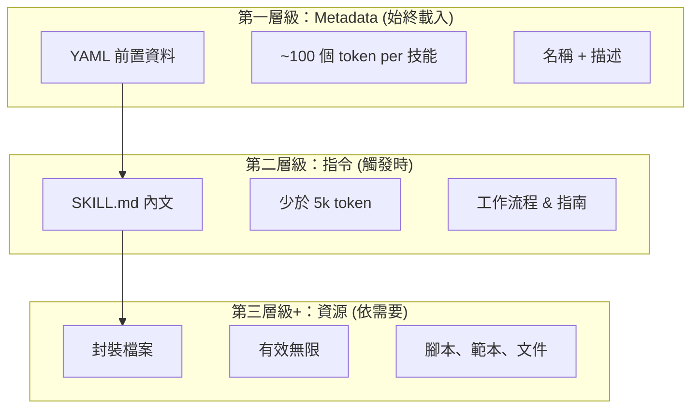
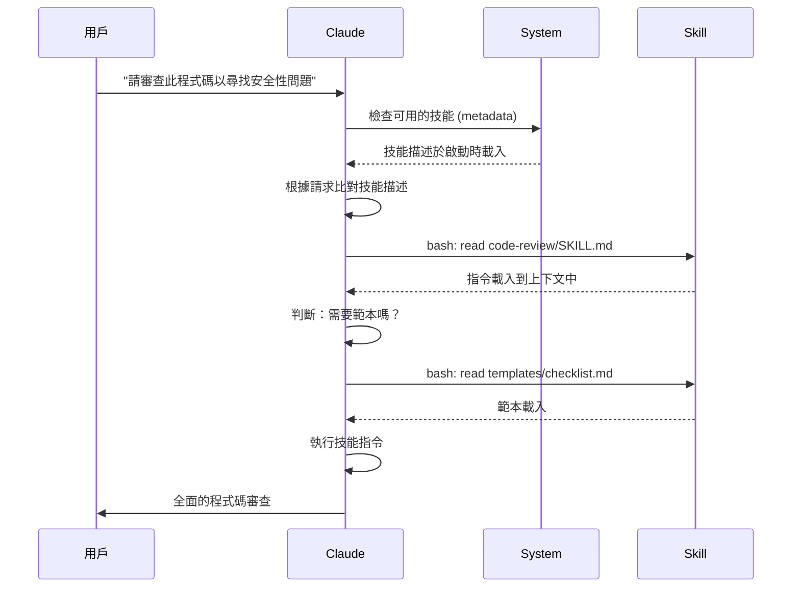

# Agent Skills 指南

Agent Skills 是一種可重複使用的、基於檔案系統的功能，可以擴展 Claude 的功能。它們將領域特定的專業知識、工作流程和最佳實踐封裝成 Claude 可以自動使用的可發現元件。

## 總覽

**Agent Skills** 是一種模組化的功能，可以將通用代理轉變為專家。與提示詞（用於一次性任務的對話級別指令）不同，Skills 可以按需載入，並且可以消除在多個對話中重複提供相同指導的需要。

### 關鍵優勢

- **專注 Claude**: 針對領域特定的任務定制功能
- **減少重複**: 創建一次，在對話中自動使用
- **組合功能**: 結合 Skills 以構建複雜的工作流程
- **擴展工作流程**: 在多個專案和團隊中重用技能
- **維護品質**: 將最佳實踐直接嵌入到您的工作流程中

Skills 遵循 [Agent Skills](https://agentskills.io) 開放標準，該標準適用於多種 AI 工具。Claude Code 擴展了該標準，增加了額外的功能，例如調用控制、子代理執行和動態上下文注入。

> **注意**: 自訂斜線命令已合併到技能中。`.claude/commands/` 檔案仍然有效，並且支援相同的 frontmatter 欄位。建議為新開發使用 Skills。當兩個檔案位於相同的路徑（例如 `.claude/commands/review.md` 和 `.claude/skills/review/SKILL.md`）時，技能優先。

## 技能運作方式：逐步揭露

技能利用 **逐步揭露** 架構—Claude 依需要分階段載入資訊，而不是一次性消耗所有上下文。這有助於有效管理上下文，同時保持無限的可擴展性。

### 三個載入層級



| 層級 | 載入時機 | Token 成本 | 內容 |
|-------|------------|------------|---------|
| **第一層級：Metadata** | 始終 (啟動時) | ~100 個 token per 技能 | YAML 前置資料中的 `名稱` 和 `描述` |
| **第二層級：指令** | 技能觸發時 | 少於 5k token | SKILL.md 內文，包含指令和指南 |
| **第三層級+：資源** | 依需要 | 有效無限 | 封裝檔案透過 bash 執行，不將內容載入上下文 |

這表示您可以安裝許多技能，而不會受到上下文懲罰—Claude 只有在實際觸發時才知道每個技能存在以及何時使用它。

## 技能載入流程



## 技能類型與位置

| 類型 | 位置 | 範圍 | 共享 | 適用於 |
|------|----------|-------|--------|----------|
| **企業版** | 託管設定 | 所有組織使用者 | 是 | 組織層級標準 |
| **個人版** | `~/.claude/skills/<skill-name>/SKILL.md` | 個人 | 否 | 個人工作流程 |
| **專案版** | `.claude/skills/<skill-name>/SKILL.md` | 團隊 | 是 (透過 git) | 團隊標準 |
| **外掛** | `<plugin>/skills/<skill-name>/SKILL.md` | 啟用位置 | 視情況而定 | 與外掛程式包一起 |

當技能在不同層級使用相同的名稱時，優先順序較高的位置會勝出：**企業版 > 個人版 > 專案版**。外掛技能使用 `plugin-name:skill-name` 命名空間，因此不會發生衝突。

### 自動探索

**巢狀目錄**: 當您使用子目錄中的檔案時，Claude Code 會自動從巢狀的 `.claude/skills/` 目錄中探索技能。例如，如果您正在編輯 `packages/frontend/` 中的檔案，Claude Code 也會在 `packages/frontend/.claude/skills/` 中尋找技能。這支援套件擁有自己技能的 monorepo 設定。

**`--add-dir` 目錄**: 透過 `--add-dir` 新增的目錄中的技能會自動載入，並具有即時變更偵測功能。對這些目錄中技能檔案所做的任何編輯都會立即生效，無需重新啟動 Claude Code。

**描述預算**: 技能描述 (Level 1 元數據) 的上限為 **上下文視窗的 1%** (預設值：**8,000 個字元**)。如果您安裝了許多技能，描述可能會被縮短。所有技能名稱都始終包含在內，但描述會被修剪以符合預算。請在描述中優先說明主要使用案例。使用 `SLASH_COMMAND_TOOL_CHAR_BUDGET` 環境變數來覆寫預算。

## 建立自訂技能

### 基本目錄結構

```
my-skill/
├── SKILL.md           # 主要說明 (必填)
├── template.md        # Claude 填寫的範本
├── examples/
│   └── sample.md      # 範例輸出，顯示預期的格式
└── scripts/
    └── validate.sh    # Claude 可以執行的腳本
```

### SKILL.md 格式

```yaml
---
name: your-skill-name
description: Brief description of what this Skill does and when to use it
---

# Your Skill Name

## Instructions
Provide clear, step-by-step guidance for Claude.

## Examples
Show concrete examples of using this Skill.
```

### 必填欄位

- **name**: 僅限小寫字母、數字和連字符號 (最多 64 個字元)。不能包含 "anthropic" 或 "claude"。
- **description**: 說明這個技能的功能以及何時使用它 (最多 1024 個字元)。這對於 Claude 知道何時啟動這個技能至關重要。

### 可選 Frontmatter 欄位

```yaml
---
name: my-skill
description: What this skill does and when to use it
argument-hint: "[filename] [format]"        # Hint for autocomplete
disable-model-invocation: true              # Only user can invoke
user-invocable: false                       # Hide from slash menu
allowed-tools: Read, Grep, Glob             # Restrict tool access
model: opus                                 # Specific model to use
effort: high                                # Effort level override (low, medium, high, max)
context: fork                               # Run in isolated subagent
agent: Explore                              # Which agent type (with context: fork)
shell: bash                                 # Shell for commands: bash (default) or powershell
hooks:                                      # Skill-scoped hooks
  PreToolUse:
    - matcher: "Bash"
      hooks:
        - type: command
          command: "./scripts/validate.sh"
paths: "src/api/**/*.ts"               # Glob patterns limiting when skill activates
---
```

| 欄位 | 說明 |
|-------|-------------|
| `name` | 僅限小寫字母、數字和連字符號 (最多 64 個字元)。不能包含 "anthropic" 或 "claude"。 |
| `description` | 說明這個技能的功能以及何時使用它 (最多 1024 個字元)。對於自動啟動比對至關重要。 |
| `argument-hint` | 在 `/` 自動完成選單中顯示的提示 (例如，`"[filename] [format]"`)。 |
| `disable-model-invocation` | `true` = 僅使用者才能透過 `/name` 呼叫。Claude 永遠不會自動呼叫它。 |
| `user-invocable` | `false` = 從 `/` 選單中隱藏。只有 Claude 才能自動呼叫它。 |
| `allowed-tools` | 技能可以使用而無需許可提示的工具的逗號分隔清單。 |
| `model` | 技能處於作用中時的模型覆寫 (例如，`opus`、`sonnet`)。 |
| `effort` | 技能處於作用中時的努力程度覆寫：`low`、`medium`、`high` 或 `max`。 |
| `context` | `fork` 將技能在具有其自己的上下文視窗的 fork 子代理上下文中執行。 |
| `agent` | 當 `context: fork` 時的子代理類型 (例如，`Explore`、`Plan`、`general-purpose`)。 |

| `shell` | Shell used for `!`command`` substitutions and scripts: `bash` (default) or `powershell`. |
| `hooks` | 鉤子 範圍限定於此技能的生命週期（與全域鉤子格式相同）。 |
| `paths` | Glob 模式，限制技能自動啟動的時間。逗號分隔的字串或 YAML 清單。與路徑特定的規則格式相同。 |

## Skill Content Types

技能可以包含兩種內容類型，每種都適合不同的用途：

### Reference Content

新增 Claude 應用於您目前工作的知識—慣例、模式、樣式指南、領域知識。與您的對話上下文內行運作。

```yaml
---
name: api-conventions
description: 此程式碼庫的 API 設計模式
---

當撰寫 API 端點時：
- 使用 RESTful 命名慣例
- 傳回一致的錯誤格式
- 包含請求驗證
```

### Task Content

用於特定動作的逐步指示。通常直接使用 `/skill-name` 呼叫。

```yaml
---
name: deploy
description: 將應用程式部署到生產環境
context: fork
disable-model-invocation: true
---

部署應用程式：
1. 執行測試套件
2. 建立應用程式
3. 推送到部署目標
```

## Controlling Skill Invocation

預設情況下，您和 Claude 可以呼叫任何技能。 兩個 frontmatter 欄位控制這三個呼叫模式：

| Frontmatter | 您可以呼叫 | Claude 可以呼叫 |
|---|---|---|
| (預設) | 是 | 是 |
| `disable-model-invocation: true` | 是 | 否 |
| `user-invocable: false` | 否 | 是 |

**使用 `disable-model-invocation: true`** 用於具有副作用的工作流程：`/commit`、`/deploy`、`/send-slack-message`。您不希望 Claude 決定部署，因為您的程式碼看起來準備好了。

**使用 `user-invocable: false`** 用於不作為命令的背景知識。一個 `legacy-system-context` 技能解釋了舊系統如何運作—對 Claude 有用，但對使用者來說並不是有意義的動作。

## 字串替換

技能支援動態值，這些值會在技能內容傳送到 Claude 之前解析：

| 變數 | 描述 |
|----------|-------------|
| `$ARGUMENTS` | 呼叫技能時傳遞的所有參數 |
| `$ARGUMENTS[N]` 或 `$N` | 根據索引 (0-based) 存取特定參數 |
| `${CLAUDE_SESSION_ID}` | 目前的會話 ID |
| `${CLAUDE_SKILL_DIR}` | 包含技能的 SKILL.md 檔案的目錄 |
| `` !`command` `` | 動態上下文注入 — 執行 shell 命令並內嵌輸出 |

**範例：**

```yaml
---
name: fix-issue
description: 修正 GitHub issue
---

根據我們的編碼標準修正 GitHub issue $ARGUMENTS。
1. 閱讀 issue 描述
2. 實作修正
3. 撰寫測試
4. 建立 commit
```

執行 `/fix-issue 123` 會將 `$ARGUMENTS` 替換為 `123`。

## 注入動態上下文

`!`command`` 語法會在技能內容傳送到 Claude 之前執行 shell 命令：

```yaml
---
name: pr-summary
description: 摘要 pull request 的變更
context: fork
agent: Explore
---

## Pull request 上下文
- PR diff: !`gh pr diff`
- PR comments: !`gh pr view --comments`
- 變更檔案: !`gh pr diff --name-only`

## 您的任務
摘要這個 pull request...
```

命令會立即執行；Claude 僅會看到最終輸出。 預設情況下，命令會在 `bash` 中執行。 若要使用 PowerShell，請在 frontmatter 中設定 `shell: powershell`。

## 在子代理中執行技能

新增 `context: fork` 以在隔離的子代理上下文中執行技能。 技能內容會成為一個專屬子代理的任務，擁有自己的上下文視窗，以保持主要對話的整潔。

`agent` 欄位指定要使用的代理類型：

| 代理類型 | 適用於 |
|---|---|
| `Explore` | 僅讀取研究、程式碼庫分析 |
| `Plan` | 建立實作計畫 |
| `general-purpose` | 需要所有工具的廣泛任務 |
| 自訂代理 | 在您的配置中定義的專用代理 |

**範例 frontmatter：**

```yaml
---
context: fork
agent: Explore
---
```

**完整的技能範例：**

```yaml
---
name: deep-research
description: 徹底研究主題
context: fork
agent: Explore
---

徹底研究 $ARGUMENTS：
1. 使用 Glob 和 Grep 尋找相關檔案
2. 閱讀和分析程式碼
3. 摘要說明並提供特定檔案參考
```

## 實例範例

### 範例 1：程式碼審查技能

**目錄結構：**

```
~/.claude/skills/code-review/
├── SKILL.md
├── templates/
│   ├── review-checklist.md
│   └── finding-template.md
└── scripts/
    ├── analyze-metrics.py
    └── compare-complexity.py
```

**檔案：** `~/.claude/skills/code-review/SKILL.md`

```yaml
---
name: code-review-specialist
description: Comprehensive code review with security, performance, and quality analysis. Use when users ask to review code, analyze code quality, evaluate pull requests, or mention code review, security analysis, or performance optimization.
---

# 程式碼審查技能

這個技能提供全面的程式碼審查能力，著重於：

1. **安全性分析**
   - 身份驗證/授權問題
   - 資料外洩風險
   - 注入漏洞
   - 加密弱點

2. **效能審查**
   - 演算法效率 (Big O 分析)
   - 記憶體優化
   - 資料庫查詢優化
   - 快取機會

3. **程式碼品質**
   - SOLID 原則
   - 設計模式
   - 命名慣例
   - 測試覆蓋率

4. **可維護性**
   - 程式碼可讀性
   - 函式大小 (應小於 50 行)
   - 環路複雜度
   - 類型安全性

## 審查範本

對於審查過的每一段程式碼，請提供：

### 摘要
- 總體品質評估 (1-5)
- 主要發現數量
- 建議優先處理的領域

### 關鍵問題 (如果有的話)
- **問題**: 清晰的描述
- **位置**: 檔案和行號
- **影響**: 為什麼這很重要
- **嚴重性**: 嚴重/高/中
- **修正**: 程式碼範例

有關詳細檢查清單，請參閱 [templates/review-checklist.md](templates/review-checklist.md)。
```

### 範例 2：程式碼資料庫視覺化技能

一個產生互動式 HTML 可視化圖表的技能：

**目錄結構：**

```
~/.claude/skills/codebase-visualizer/
├── SKILL.md
└── scripts/
    └── visualize.py
```

**檔案：** `~/.claude/skills/codebase-visualizer/SKILL.md`

````yaml
---
name: codebase-visualizer
description: Generate an interactive collapsible tree visualization of your codebase. Use when exploring a new repo, understanding project structure, or identifying large files.
allowed-tools: Bash(python *)
---

# 程式碼資料庫視覺化

產生互動式 HTML 樹狀圖，顯示專案的檔案結構。
````

## 使用方法

從您的專案根目錄執行視覺化腳本：

```bash
python ~/.claude/skills/codebase-visualizer/scripts/visualize.py .
```

這會建立 `codebase-map.html` 並在您的預設瀏覽器中開啟它。

## 視覺化內容

- **可摺疊目錄**: 點擊資料夾以展開/摺疊
- **檔案大小**: 顯示在每個檔案旁邊
- **顏色**: 不同的檔案類型使用不同的顏色
- **目錄總數**: 顯示每個資料夾的總大小

```

內建的 Python 腳本負責處理大量運算，而 Claude 負責協調。

### 範例 3：部署技能（僅限使用者呼叫）

```yaml
---
name: deploy
description: 部署應用程式到生產環境
disable-model-invocation: true
allowed-tools: Bash(npm *), Bash(git *)
---

將 $ARGUMENTS 部署到生產環境：

1. 執行測試套件：`npm test`
2. 建立應用程式：`npm run build`
3. 推送到部署目標
4. 驗證部署是否成功
5. 報告部署狀態
```

### 範例 4：品牌語氣技能（背景知識）

```yaml
---
name: brand-voice
description: 確保所有溝通都符合品牌語氣和語調指南。當建立行銷文案、客戶溝通或公開內容時使用。
user-invocable: false
---

## 語氣

- **友好但專業** - 相近但不隨意
- **清晰且簡潔** - 避免行話
- **自信** - 我們知道我們在做什麼
- **有同理心** - 了解使用者需求

## 寫作指南

- 以 "您" 為例來稱呼讀者
- 使用主動語態
- 將句子長度控制在 20 個字以內
- 以價值主張開頭

對於範本，請參閱 [templates/](templates/)。
```

### 範例 5：CLAUDE.md 產生器技能

```yaml
---
name: claude-md
description: 根據最佳實踐建立或更新 CLAUDE.md 檔案，以最佳化 AI 代理程式導入。當使用者提到 CLAUDE.md、專案文件或 AI 導入時使用。
---
```

## 核心原則

**LLM 缺乏狀態**: CLAUDE.md 是唯一在每個對話中自動包含的檔案。

### 黃金法則

1. **簡單勝於複雜**: 保持在 300 行以下（理想情況下少於 100 行）
2. **通用適用性**: 僅包含與 EVERY 會話都相關的資訊
3. **不要將 Claude 當成程式碼檢查工具**: 應使用確定性的工具
4. **切勿自動產生**: 應謹慎考慮後手動製作

## 必備區段

- **專案名稱**: 簡短的一行描述
- **技術堆疊**: 主要語言、框架、資料庫
- **開發命令**: 安裝、測試、建置命令
- **重要慣例**: 僅限非顯而易見且影響力大的慣例
- **已知問題 / 陷阱**: 讓開發者出錯的事情
```

### 範例 6：使用腳本重構技能

**目錄結構：**

```
refactor/
├── SKILL.md
├── references/
│   ├── code-smells.md
│   └── refactoring-catalog.md
├── templates/
│   └── refactoring-plan.md
└── scripts/
    ├── analyze-complexity.py
    └── detect-smells.py
```

**檔案：** `refactor/SKILL.md`

```yaml
---
name: code-refactor
description: Systematic code refactoring based on Martin Fowler's methodology. Use when users ask to refactor code, improve code structure, reduce technical debt, or eliminate code smells.
---

# Code Refactoring Skill

A phased approach emphasizing safe, incremental changes backed by tests.

## Workflow

Phase 1: Research & Analysis → Phase 2: Test Coverage Assessment →
Phase 3: Code Smell Identification → Phase 4: Refactoring Plan Creation →
Phase 5: Incremental Implementation → Phase 6: Review & Iteration
```

## 核心原則

1. **行為保留**: 外部行為必須保持不變
2. **小步驟**: 進行微小的、可測試的變更
3. **測試驅動**: 測試是安全網
4. **持續**: 重構是持續進行的，而不是一次性的事件

有關程式碼氣味目錄，請參閱 [references/code-smells.md](references/code-smells.md)。
有關重構技術，請參閱 [references/refactoring-catalog.md](references/refactoring-catalog.md)。

## 支援檔案

技能可以在其目錄中包含多個檔案，除了 `SKILL.md` 之外。這些支援檔案（範本、範例、腳本、參考文件）讓您可以保持主要技能檔案的焦點，同時為 Claude 提供它可以根據需要載入的額外資源。

```
my-skill/
├── SKILL.md              # 主要指示 (必要，保持在 500 行以內)
├── templates/            # Claude 用於填寫的範本
│   └── output-format.md
├── examples/             # 範例輸出，顯示預期的格式
│   └── sample-output.md
├── references/           # 領域知識和規格
│   └── api-spec.md
└── scripts/              # Claude 可以執行的腳本
    └── validate.sh
```

支援檔案的指南：

- 將 `SKILL.md` 保持在 **500 行以內**。將詳細的參考資料、大型範例和規格移至個別檔案。
- 從 `SKILL.md` 使用 **相對路徑** 參照額外檔案（例如，`[API 參考](references/api-spec.md)`）。
- 支援檔案是在第 3 級載入的（按需），因此它們不會消耗上下文，直到 Claude 實際讀取它們為止。

## 管理技能

### 檢視可用技能

直接詢問 Claude：
```
What Skills are available?
```

或檢查檔案系統：
```bash
# 列出個人技能
ls ~/.claude/skills/

# 列出專案技能
ls .claude/skills/
```

### 測試技能

兩種測試方法：

**讓 Claude 自動觸發它**，詢問符合描述的內容：
```
Can you help me review this code for security issues?
```

**或直接使用技能名稱觸發它**：
```
/code-review src/auth/login.ts
```

### 更新技能

直接編輯 `SKILL.md` 檔案。 變更會在下一次 Claude Code 啟動時生效。

```bash
# 個人技能
code ~/.claude/skills/my-skill/SKILL.md

# 專案技能
code .claude/skills/my-skill/SKILL.md
```

### 限制 Claude 的技能存取權

有三種方法可以控制 Claude 可以觸發哪些技能：

**在 `/permissions` 中停用所有技能**：
```
# 新增到拒絕規則：
Skill
```

**允許或拒絕特定技能**：
```
# 僅允許特定技能
Skill(commit)
Skill(review-pr *)

# 拒絕特定技能
Skill(deploy *)
```

**通過在其前matter 中新增 `disable-model-invocation: true` 來隱藏個別技能。**

## 最佳實踐

### 1. 使描述具體

- **不好 (模糊)**: "Helps with documents"
- **好 (具體)**: "Extract text and tables from PDF files, fill forms, merge documents. Use when working with PDF files or when the user mentions PDFs, forms, or document extraction."

### 2. 保持技能專注

- 一個技能 = 一個能力
- ✅ "PDF form filling"
- ❌ "Document processing" (太廣泛)

### 3. 包含觸發詞彙

在描述中新增與使用者請求相符的關鍵字：
```yaml
description: Analyze Excel spreadsheets, generate pivot tables, create charts. Use when working with Excel files, spreadsheets, or .xlsx files.
```

### 4. 保持 SKILL.md 在 500 行以內

將詳細的參考資料移至 Claude 根據需要載入的個別檔案。

### 5. 參考支援檔案

## 額外資源

- 若要查看完整的 API 資訊，請參閱 [reference.md](reference.md)
- 若要查看使用範例，請參閱 [examples.md](examples.md)

```

### 應該做的事情

- 使用清晰且具描述性的名稱
- 包含全面的指示
- 增加具體的範例
- 將相關的腳本和範本打包
- 使用真實情境進行測試
- 記錄相依性

### 不應該做的事情

- 不要為一次性任務創建技能
- 不要重複現有的功能
- 不要使技能過於寬泛
- 不要跳過描述欄位
- 不要從不可信來源安裝技能，而沒有先進行審核

## 疑難排解

### 快速參考

| 問題 | 解決方案 |
|-------|----------|
| Claude 沒有使用技能 | 使描述更具體，包含觸發詞彙 |
| 找不到技能檔案 | 驗證路徑：`~/.claude/skills/name/SKILL.md` |
| YAML 錯誤 | 檢查 `---` 標記、縮排，不要使用 Tab |
| 技能衝突 | 在描述中使用不同的觸發詞彙 |
| 腳本無法執行 | 檢查權限：`chmod +x scripts/*.py` |
| Claude 沒有看到所有技能 | 技能過多；檢查 `/context` 以查看警告 |

### 技能未觸發

如果 Claude 沒有在預期時使用您的技能：

1. 檢查描述是否包含使用者自然會說的關鍵字
2. 驗證當詢問「有哪些技能可以使用？」時，技能是否出現
3. 嘗試重新措辭您的請求以匹配描述
4. 使用 `/skill-name` 直接呼叫以進行測試

### 技能觸發過於頻繁

如果 Claude 在您不想時使用您的技能：

1. 使描述更具體
2. 增加 `disable-model-invocation: true` 以進行手動呼叫

### Claude 沒有看到所有技能

技能描述佔用 **上下文中 1%** (fallback: **8,000 字元**)。 每個條目無論預算多少都限制在 250 個字元。 執行 `/context` 以查看有關排除技能的警告。 使用 `SLASH_COMMAND_TOOL_CHAR_BUDGET` 環境變數來覆寫預算。

## 安全考量

**僅從可信任來源使用技能。** 技能透過指示和程式碼為 Claude 提供能力——惡意技能可能會指示 Claude 以有害的方式調用工具或執行程式碼。

**主要的安全性考量：**

- **徹底審核**: 檢閱技能目錄中的所有檔案
- **外部來源有風險**: 從外部 URL 抓取的技能可能會有被入侵的風險
- **工具濫用**: 惡意技能可能會以有害的方式調用工具
- **如同安裝軟體一樣處理**: 僅從可信任來源使用技能

## 技能與其他功能

| 功能 | 調用方式 | 適用情境 |
|---------|------------|----------|
| **技能** | 自動或 `/name` | 可重複使用的專業知識、工作流程 |
| **斜線命令** | 用戶主動 `/name` | 快速捷徑 (已整合到技能中) |
| **子代理** | 自動委派 | 隔離任務執行 |
| **記憶 (CLAUDE.md)** | 始終載入 | 持續專案上下文 |
| **MCP** | 實時 | 外部資料/服務存取 |
| **鉤子** | 事件驅動 | 自動化的副作用 |

## 內建技能

Claude Code 隨附多個內建技能，無需安裝即可隨時使用：

| 技能 | 描述 |
|-------|-------------|
| `/simplify` | 檢閱變更檔案以尋找可重複使用、品質和效率；啟動 3 個並行檢閱代理 |
| `/batch <instruction>` | 使用 git worktrees 在程式碼庫中協調大規模並行變更 |
| `/debug [description]` | 透過閱讀除錯日誌來處理目前會話 |
| `/loop [interval] <prompt>` | 以間隔重複執行提示詞 (例如 `/loop 5m check the deploy`) |
| `/claude-api` | 載入 Claude API/SDK 參考；在 `anthropic`/`@anthropic-ai/sdk` 匯入時自動啟用 |

這些技能是開箱即用的，無需安裝或配置。它們遵循與自訂技能相同的 SKILL.md 格式。

## 技能分享

### 專案技能 (團隊分享)

1. 在 `.claude/skills/` 中建立技能
2. 提交到 git
3. 團隊成員拉取變更 — 技能立即可用

### 個人技能

```bash
# 複製到個人目錄
cp -r my-skill ~/.claude/skills/

# 使腳本可執行
chmod +x ~/.claude/skills/my-skill/scripts/*.py
```

### 外掛發布

將技能包裝在外掛的 `skills/` 目錄中，以便更廣泛地發布。

## 更進一步：一個技能集合和一個技能管理工具

一旦您開始認真地建立技能，兩個事情就會變得至關重要：一個經過驗證的技能庫和一個管理它們的工具。

**[luongnv89/skills](https://github.com/luongnv89/skills)** — 我在幾乎所有專案中每天使用的技能集合。 亮點包括 `logo-designer` (即時產生專案標誌) 和 `ollama-optimizer` (針對您的硬體調整本地 LLM 效能)。 如果您想要即用型的技能，這是一個很好的起點。

**[luongnv89/asm](https://github.com/luongnv89/asm)** — Agent Skill Manager。 處理技能開發、重複檢測和測試。 `asm link` 命令可以讓您在任何專案中測試技能，而無需複製檔案 — 當您擁有超過少量技能時，這是一個必備功能。

## 額外資源

- [官方技能文件](https://code.claude.com/docs/en/skills)
- [Agent Skills 架構部落格](https://claude.com/blog/equipping-agents-for-the-real-world-with-agent-skills)
- [技能儲存庫](https://github.com/luongnv89/skills) - 準備好的技能集合
- [斜線命令指南](../01-slash-commands/) - 用戶發起的捷徑
- [子代理指南](../04-subagents/) - 委派的 AI 代理
- [記憶指南](../02-memory/) - 持續的上下文
- [MCP (模型上下文協議](../05-mcp/) - 即時外部資料
- [鉤子指南](../06-hooks/) - 事件驅動的自動化

---
**上次更新**: 2026 年 4 月 11 日
**Claude Code 版本**: 2.1.101
**來源**:
- https://code.claude.com/docs/en/skills
**相容模型**: Claude Sonnet 4.6, Claude Opus 4.6, Claude Haiku 4.5
