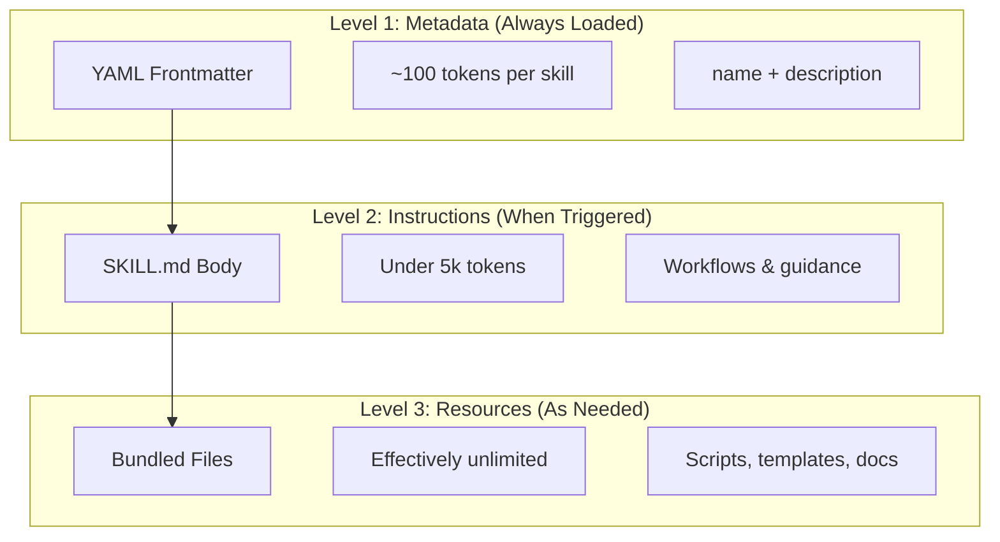
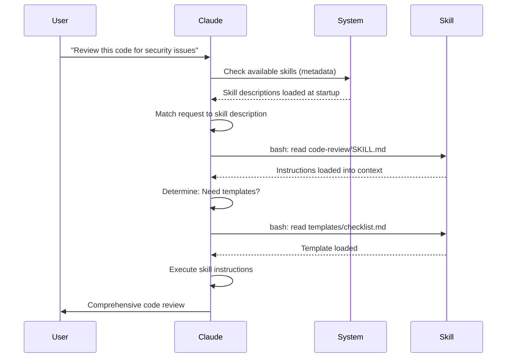

<picture>
  <source media="(prefers-color-scheme: dark)" srcset="../resources/logos/claude-howto-logo-dark.svg">
  
</picture>

# Agent Skills 指南

🔧 Skills（技能）
用途: 可復用的自動化工作流
難度: ⭐⭐ 中級 | 時間: 1 小時

Agent Skills 是可重用的、基於檔案系統的功能，用於擴展 Claude 的能力。它們將特定領域的專業知識、工作流程和最佳實踐打包成可發現的元件，Claude 會在相關時自動使用。

## 概覽

**Agent Skills** 是模組化的功能，能將通用型代理轉變為專家。與提示詞（對話級別的一次性任務指令）不同，Skills 按需載入，消除了在多次對話中重複提供相同指導的需要。

### 主要優勢

- **專業化 Claude**：為特定領域任務量身定制功能
- **減少重複**：建立一次，在多次對話中自動使用
- **組合功能**：結合 Skills 建構複雜工作流程
- **擴展工作流程**：在多個專案和團隊間重用 skills
- **維持品質**：將最佳實踐直接嵌入工作流程

Skills 遵循 [Agent Skills](https://agentskills.io) 開放標準，可在多個 AI 工具間使用。Claude Code 透過額外功能擴展了該標準，包括呼叫控制、subagent 執行和動態上下文注入。

> **注意**：自訂 slash commands 已合併到 skills 中。`.claude/commands/` 檔案仍然有效，並支援相同的 frontmatter 欄位。建議新開發使用 Skills。當兩者存在於相同路徑時（例如 `.claude/commands/review.md` 和 `.claude/skills/review/SKILL.md`），skill 優先。

## Skills 的運作方式：漸進式揭露

Skills 採用**漸進式揭露**架構——Claude 按需分階段載入資訊，而非預先消耗上下文。這實現了高效的上下文管理，同時維持無限的可擴展性。

### 三個載入層級



| 層級 | 何時載入 | Token 成本 | 內容 |
|-------|------------|------------|---------|
| **層級 1：中繼資料** | 始終（啟動時） | 每個 Skill 約 100 tokens | YAML frontmatter 中的 `name` 和 `description` |
| **層級 2：指令** | 當 Skill 被觸發時 | 5k tokens 以下 | SKILL.md 本體，包含指令和指導 |
| **層級 3+：資源** | 按需 | 實際上無限制 | 透過 bash 執行的綁定檔案，不載入內容到上下文中 |

這意味著你可以安裝許多 Skills 而不會產生上下文懲罰——Claude 在實際觸發前只知道每個 Skill 的存在和使用時機。

## Skill 載入流程



## Skill 類型與位置

| 類型 | 位置 | 範圍 | 共享 | 最適用於 |
|------|----------|-------|--------|----------|
| **企業級** | 受管設定 | 所有組織使用者 | 是 | 組織範圍的標準 |
| **個人** | `~/.claude/skills/<skill-name>/SKILL.md` | 個人 | 否 | 個人工作流程 |
| **專案** | `.claude/skills/<skill-name>/SKILL.md` | 團隊 | 是（透過 git） | 團隊標準 |
| **外掛** | `<plugin>/skills/<skill-name>/SKILL.md` | 啟用之處 | 視情況而定 | 與外掛綁定 |

當不同層級的 skills 共享相同名稱時，較高優先順序的位置勝出：**企業級 > 個人 > 專案**。外掛 skills 使用 `plugin-name:skill-name` 命名空間，因此不會衝突。

### 自動發現

**巢狀目錄**：當你在子目錄中處理檔案時，Claude Code 會自動從巢狀的 `.claude/skills/` 目錄中發現 skills。例如，如果你正在編輯 `packages/frontend/` 中的檔案，Claude Code 也會在 `packages/frontend/.claude/skills/` 中尋找 skills。這支援 monorepo 設定，其中各套件有自己的 skills。

**`--add-dir` 目錄**：透過 `--add-dir` 新增的目錄中的 Skills 會自動載入，並具有即時變更偵測。對這些目錄中 skill 檔案的任何編輯會立即生效，無需重新啟動 Claude Code。

**描述預算**：Skill 描述（層級 1 中繼資料）上限為**上下文視窗的 2%**（回退值：**16,000 個字元**）。如果你安裝了許多 skills，某些可能會被排除。執行 `/context` 檢查警告。使用 `SLASH_COMMAND_TOOL_CHAR_BUDGET` 環境變數覆蓋預算。

## 建立自訂 Skills

### 基本目錄結構

```
my-skill/
├── SKILL.md           # 主要指令（必需）
├── template.md        # 供 Claude 填寫的模板
├── examples/
│   └── sample.md      # 展示預期格式的範例輸出
└── scripts/
    └── validate.sh    # Claude 可執行的腳本
```

### SKILL.md 格式

```yaml
---
name: your-skill-name
description: Brief description of what this Skill does and when to use it
---

# Your Skill Name

## Instructions
Provide clear, step-by-step guidance for Claude.

## Examples
Show concrete examples of using this Skill.
```

### 必要欄位

- **name**：僅限小寫字母、數字、連字符（最多 64 個字元）。不能包含 "anthropic" 或 "claude"。
- **description**：Skill 做什麼以及何時使用它（最多 1024 個字元）。這對於 Claude 知道何時啟用 skill 至關重要。

### 可選 Frontmatter 欄位

```yaml
---
name: my-skill
description: What this skill does and when to use it
argument-hint: "[filename] [format]"        # Hint for autocomplete
disable-model-invocation: true              # Only user can invoke
user-invocable: false                       # Hide from slash menu
allowed-tools: Read, Grep, Glob             # Restrict tool access
model: opus                                 # Specific model to use
effort: high                                # Effort level override (low, medium, high, max)
context: fork                               # Run in isolated subagent
agent: Explore                              # Which agent type (with context: fork)
shell: bash                                 # Shell for commands: bash (default) or powershell
hooks:                                      # Skill-scoped hooks
  PreToolUse:
    - matcher: "Bash"
      hooks:
        - type: command
          command: "./scripts/validate.sh"
---
```

| 欄位 | 說明 |
|-------|-------------|
| `name` | 僅限小寫字母、數字、連字符（最多 64 個字元）。不能包含 "anthropic" 或 "claude"。 |
| `description` | Skill 做什麼以及何時使用它（最多 1024 個字元）。對自動呼叫匹配至關重要。 |
| `argument-hint` | 在 `/` 自動完成選單中顯示的提示（例如 `"[filename] [format]"`）。 |
| `disable-model-invocation` | `true` = 只有使用者可以透過 `/name` 呼叫。Claude 永遠不會自動呼叫。 |
| `user-invocable` | `false` = 從 `/` 選單中隱藏。只有 Claude 可以自動呼叫它。 |
| `allowed-tools` | 以逗號分隔的工具列表，skill 可以不需要權限提示就使用。 |
| `model` | skill 啟用時的模型覆蓋（例如 `opus`、`sonnet`）。 |
| `effort` | skill 啟用時的努力程度覆蓋：`low`、`medium`、`high` 或 `max`。 |
| `context` | `fork` 在分叉的 subagent 上下文中執行 skill，擁有自己的上下文視窗。 |
| `agent` | 當 `context: fork` 時的 subagent 類型（例如 `Explore`、`Plan`、`general-purpose`）。 |
| `shell` | 用於 `!`command`` 替換和腳本的 shell：`bash`（預設）或 `powershell`。 |
| `hooks` | 限定於此 skill 生命週期的 hooks（與全域 hooks 相同格式）。 |

## Skill 內容類型

Skills 可以包含兩種類型的內容，各適用於不同目的：

### 參考內容

新增 Claude 應用到你目前工作的知識——慣例、模式、風格指南、領域知識。在你的對話上下文中內聯執行。

```yaml
---
name: api-conventions
description: API design patterns for this codebase
---

When writing API endpoints:
- Use RESTful naming conventions
- Return consistent error formats
- Include request validation
```

### 任務內容

特定操作的逐步指令。通常透過 `/skill-name` 直接呼叫。

```yaml
---
name: deploy
description: Deploy the application to production
context: fork
disable-model-invocation: true
---

Deploy the application:
1. Run the test suite
2. Build the application
3. Push to the deployment target
```

## 控制 Skill 呼叫

預設情況下，你和 Claude 都可以呼叫任何 skill。兩個 frontmatter 欄位控制三種呼叫模式：

| Frontmatter | 你可以呼叫 | Claude 可以呼叫 |
|---|---|---|
| （預設） | 是 | 是 |
| `disable-model-invocation: true` | 是 | 否 |
| `user-invocable: false` | 否 | 是 |

**使用 `disable-model-invocation: true`** 用於有副作用的工作流程：`/commit`、`/deploy`、`/send-slack-message`。你不希望 Claude 因為你的程式碼看起來準備好了就決定部署。

**使用 `user-invocable: false`** 用於不可作為命令操作的背景知識。一個 `legacy-system-context` skill 解釋舊系統的運作方式——對 Claude 有用，但對使用者來說不是有意義的操作。

## 字串替換

Skills 支援在 skill 內容到達 Claude 之前解析的動態值：

| 變數 | 說明 |
|----------|-------------|
| `$ARGUMENTS` | 呼叫 skill 時傳遞的所有引數 |
| `$ARGUMENTS[N]` 或 `$N` | 按索引存取特定引數（從 0 開始） |
| `${CLAUDE_SESSION_ID}` | 目前的 session ID |
| `${CLAUDE_SKILL_DIR}` | 包含 skill 的 SKILL.md 檔案的目錄 |
| `` !`command` `` | 動態上下文注入——執行 shell 命令並內聯輸出 |

**範例：**

```yaml
---
name: fix-issue
description: Fix a GitHub issue
---

Fix GitHub issue $ARGUMENTS following our coding standards.
1. Read the issue description
2. Implement the fix
3. Write tests
4. Create a commit
```

執行 `/fix-issue 123` 會將 `$ARGUMENTS` 替換為 `123`。

## 注入動態上下文

`!`command`` 語法在 skill 內容發送給 Claude 之前執行 shell 命令：

```yaml
---
name: pr-summary
description: Summarize changes in a pull request
context: fork
agent: Explore
---

## Pull request context
- PR diff: !`gh pr diff`
- PR comments: !`gh pr view --comments`
- Changed files: !`gh pr diff --name-only`

## Your task
Summarize this pull request...
```

命令立即執行；Claude 只看到最終輸出。預設情況下，命令在 `bash` 中執行。在 frontmatter 中設定 `shell: powershell` 以改用 PowerShell。

## 在 Subagents 中執行 Skills

新增 `context: fork` 以在隔離的 subagent 上下文中執行 skill。Skill 內容成為專用 subagent 的任務，擁有自己的上下文視窗，保持主對話不受干擾。

`agent` 欄位指定要使用的代理類型：

| 代理類型 | 最適用於 |
|---|---|
| `Explore` | 唯讀研究、程式碼庫分析 |
| `Plan` | 建立實作計畫 |
| `general-purpose` | 需要所有工具的廣泛任務 |
| 自訂代理 | 在你的設定中定義的專業代理 |

**Frontmatter 範例：**

```yaml
---
context: fork
agent: Explore
---
```

**完整 skill 範例：**

```yaml
---
name: deep-research
description: Research a topic thoroughly
context: fork
agent: Explore
---

Research $ARGUMENTS thoroughly:
1. Find relevant files using Glob and Grep
2. Read and analyze the code
3. Summarize findings with specific file references
```

## 實際範例

### 範例 1：程式碼審查 Skill

**目錄結構：**

```
~/.claude/skills/code-review/
├── SKILL.md
├── templates/
│   ├── review-checklist.md
│   └── finding-template.md
└── scripts/
    ├── analyze-metrics.py
    └── compare-complexity.py
```

**檔案：** `~/.claude/skills/code-review/SKILL.md`

```yaml
---
name: code-review-specialist
description: Comprehensive code review with security, performance, and quality analysis. Use when users ask to review code, analyze code quality, evaluate pull requests, or mention code review, security analysis, or performance optimization.
---

# Code Review Skill

This skill provides comprehensive code review capabilities focusing on:

1. **Security Analysis**
   - Authentication/authorization issues
   - Data exposure risks
   - Injection vulnerabilities
   - Cryptographic weaknesses

2. **Performance Review**
   - Algorithm efficiency (Big O analysis)
   - Memory optimization
   - Database query optimization
   - Caching opportunities

3. **Code Quality**
   - SOLID principles
   - Design patterns
   - Naming conventions
   - Test coverage

4. **Maintainability**
   - Code readability
   - Function size (should be < 50 lines)
   - Cyclomatic complexity
   - Type safety

## Review Template

For each piece of code reviewed, provide:

### Summary
- Overall quality assessment (1-5)
- Key findings count
- Recommended priority areas

### Critical Issues (if any)
- **Issue**: Clear description
- **Location**: File and line number
- **Impact**: Why this matters
- **Severity**: Critical/High/Medium
- **Fix**: Code example

For detailed checklists, see [templates/review-checklist.md](templates/review-checklist.md).
```

### 範例 2：程式碼庫視覺化 Skill

一個生成互動式 HTML 視覺化的 skill：

**目錄結構：**

```
~/.claude/skills/codebase-visualizer/
├── SKILL.md
└── scripts/
    └── visualize.py
```

**檔案：** `~/.claude/skills/codebase-visualizer/SKILL.md`

```yaml
---
name: codebase-visualizer
description: Generate an interactive collapsible tree visualization of your codebase. Use when exploring a new repo, understanding project structure, or identifying large files.
allowed-tools: Bash(python *)
---

# Codebase Visualizer

Generate an interactive HTML tree view showing your project's file structure.

## Usage

Run the visualization script from your project root:

```bash
python ~/.claude/skills/codebase-visualizer/scripts/visualize.py .
```

This creates `codebase-map.html` and opens it in your default browser.

## What the visualization shows

- **Collapsible directories**: Click folders to expand/collapse
- **File sizes**: Displayed next to each file
- **Colors**: Different colors for different file types
- **Directory totals**: Shows aggregate size of each folder
```

綁定的 Python 腳本處理繁重的工作，而 Claude 負責協調。

### 範例 3：部署 Skill（僅使用者呼叫）

```yaml
---
name: deploy
description: Deploy the application to production
disable-model-invocation: true
allowed-tools: Bash(npm *), Bash(git *)
---

Deploy $ARGUMENTS to production:

1. Run the test suite: `npm test`
2. Build the application: `npm run build`
3. Push to the deployment target
4. Verify the deployment succeeded
5. Report deployment status
```

### 範例 4：品牌語調 Skill（背景知識）

```yaml
---
name: brand-voice
description: Ensure all communication matches brand voice and tone guidelines. Use when creating marketing copy, customer communications, or public-facing content.
user-invocable: false
---

## Tone of Voice
- **Friendly but professional** - approachable without being casual
- **Clear and concise** - avoid jargon
- **Confident** - we know what we're doing
- **Empathetic** - understand user needs

## Writing Guidelines
- Use "you" when addressing readers
- Use active voice
- Keep sentences under 20 words
- Start with value proposition

For templates, see [templates/](templates/).
```

### 範例 5：CLAUDE.md 產生器 Skill

```yaml
---
name: claude-md
description: Create or update CLAUDE.md files following best practices for optimal AI agent onboarding. Use when users mention CLAUDE.md, project documentation, or AI onboarding.
---

## Core Principles

**LLMs are stateless**: CLAUDE.md is the only file automatically included in every conversation.

### The Golden Rules

1. **Less is More**: Keep under 300 lines (ideally under 100)
2. **Universal Applicability**: Only include information relevant to EVERY session
3. **Don't Use Claude as a Linter**: Use deterministic tools instead
4. **Never Auto-Generate**: Craft it manually with careful consideration

## Essential Sections

- **Project Name**: Brief one-line description
- **Tech Stack**: Primary language, frameworks, database
- **Development Commands**: Install, test, build commands
- **Critical Conventions**: Only non-obvious, high-impact conventions
- **Known Issues / Gotchas**: Things that trip up developers
```

### 範例 6：重構 Skill（含腳本）

**目錄結構：**

```
refactor/
├── SKILL.md
├── references/
│   ├── code-smells.md
│   └── refactoring-catalog.md
├── templates/
│   └── refactoring-plan.md
└── scripts/
    ├── analyze-complexity.py
    └── detect-smells.py
```

**檔案：** `refactor/SKILL.md`

```yaml
---
name: code-refactor
description: Systematic code refactoring based on Martin Fowler's methodology. Use when users ask to refactor code, improve code structure, reduce technical debt, or eliminate code smells.
---

# Code Refactoring Skill

A phased approach emphasizing safe, incremental changes backed by tests.

## Workflow

Phase 1: Research & Analysis → Phase 2: Test Coverage Assessment →
Phase 3: Code Smell Identification → Phase 4: Refactoring Plan Creation →
Phase 5: Incremental Implementation → Phase 6: Review & Iteration

## Core Principles

1. **Behavior Preservation**: External behavior must remain unchanged
2. **Small Steps**: Make tiny, testable changes
3. **Test-Driven**: Tests are the safety net
4. **Continuous**: Refactoring is ongoing, not a one-time event

For code smell catalog, see [references/code-smells.md](references/code-smells.md).
For refactoring techniques, see [references/refactoring-catalog.md](references/refactoring-catalog.md).
```

## 支援檔案

Skills 可以在其目錄中包含 `SKILL.md` 以外的多個檔案。這些支援檔案（模板、範例、腳本、參考文件）讓你保持主要 skill 檔案的專注，同時為 Claude 提供可按需載入的額外資源。

```
my-skill/
├── SKILL.md              # 主要指令（必需，保持在 500 行以下）
├── templates/            # 供 Claude 填寫的模板
│   └── output-format.md
├── examples/             # 展示預期格式的範例輸出
│   └── sample-output.md
├── references/           # 領域知識和規格
│   └── api-spec.md
└── scripts/              # Claude 可執行的腳本
    └── validate.sh
```

支援檔案的指導方針：

- 保持 `SKILL.md` 在 **500 行**以下。將詳細的參考資料、大型範例和規格移至獨立檔案。
- 從 `SKILL.md` 中使用**相對路徑**引用額外檔案（例如 `[API reference](references/api-spec.md)`）。
- 支援檔案在層級 3（按需）載入，因此在 Claude 實際讀取它們之前不會消耗上下文。

## 管理 Skills

### 檢視可用 Skills

直接詢問 Claude：
```
What Skills are available?
```

或檢查檔案系統：
```bash
# List personal Skills
ls ~/.claude/skills/

# List project Skills
ls .claude/skills/
```

### 測試 Skill

兩種測試方式：

**讓 Claude 自動呼叫它**，詢問與描述匹配的內容：
```
Can you help me review this code for security issues?
```

**或直接呼叫它**，使用 skill 名稱：
```
/code-review src/auth/login.ts
```

### 更新 Skill

直接編輯 `SKILL.md` 檔案。變更在下次 Claude Code 啟動時生效。

```bash
# Personal Skill
code ~/.claude/skills/my-skill/SKILL.md

# Project Skill
code .claude/skills/my-skill/SKILL.md
```

### 限制 Claude 的 Skill 存取

三種控制 Claude 可呼叫哪些 skills 的方式：

**停用所有 skills**，在 `/permissions` 中：
```
# Add to deny rules:
Skill
```

**允許或拒絕特定 skills**：
```
# Allow only specific skills
Skill(commit)
Skill(review-pr *)

# Deny specific skills
Skill(deploy *)
```

**隱藏個別 skills**，在其 frontmatter 中新增 `disable-model-invocation: true`。

## 最佳實踐

### 1. 使描述具體

- **不好（模糊）**："Helps with documents"
- **好（具體）**："Extract text and tables from PDF files, fill forms, merge documents. Use when working with PDF files or when the user mentions PDFs, forms, or document extraction."

### 2. 保持 Skills 專注

- 一個 Skill = 一個功能
- 正確："PDF form filling"
- 錯誤："Document processing"（太廣泛）

### 3. 包含觸發詞

在描述中新增匹配使用者請求的關鍵字：
```yaml
description: Analyze Excel spreadsheets, generate pivot tables, create charts. Use when working with Excel files, spreadsheets, or .xlsx files.
```

### 4. 保持 SKILL.md 在 500 行以下

將詳細的參考資料移至 Claude 按需載入的獨立檔案。

### 5. 引用支援檔案

```markdown
## Additional resources

- For complete API details, see [reference.md](reference.md)
- For usage examples, see [examples.md](examples.md)
```

### 應該做的

- 使用清晰、描述性的名稱
- 包含全面的指令
- 新增具體的範例
- 打包相關的腳本和模板
- 使用真實場景測試
- 記錄相依性

### 不應該做的

- 不要為一次性任務建立 skills
- 不要複製已有的功能
- 不要讓 skills 太廣泛
- 不要跳過 description 欄位
- 不要安裝來自不受信任來源的 skills 而不進行審查

## 疑難排解

### 快速參考

| 問題 | 解決方案 |
|-------|----------|
| Claude 不使用 Skill | 使用觸發詞使描述更具體 |
| 找不到 Skill 檔案 | 驗證路徑：`~/.claude/skills/name/SKILL.md` |
| YAML 錯誤 | 檢查 `---` 標記、縮排、無 tabs |
| Skills 衝突 | 在描述中使用不同的觸發詞 |
| 腳本未執行 | 檢查權限：`chmod +x scripts/*.py` |
| Claude 看不到所有 skills | 太多 skills；使用 `/context` 檢查警告 |

### Skill 未觸發

如果 Claude 未在預期時使用你的 skill：

1. 檢查描述是否包含使用者自然會說的關鍵字
2. 驗證詢問「What skills are available?」時 skill 是否出現
3. 嘗試重新措辭你的請求以匹配描述
4. 直接使用 `/skill-name` 呼叫來測試

### Skill 觸發太頻繁

如果 Claude 在你不想要時使用你的 skill：

1. 使描述更具體
2. 新增 `disable-model-invocation: true` 以僅手動呼叫

### Claude 看不到所有 Skills

Skill 描述在**上下文視窗的 2%**（回退值：**16,000 個字元**）時載入。執行 `/context` 檢查有關被排除 skills 的警告。使用 `SLASH_COMMAND_TOOL_CHAR_BUDGET` 環境變數覆蓋預算。

## 安全考量

**僅使用來自受信任來源的 Skills。** Skills 透過指令和程式碼為 Claude 提供功能——惡意的 Skill 可以指示 Claude 以有害方式呼叫工具或執行程式碼。

**主要安全考量：**

- **徹底審查**：檢查 Skill 目錄中的所有檔案
- **外部來源有風險**：從外部 URL 取得的 Skills 可能被篡改
- **工具濫用**：惡意 Skills 可以有害方式呼叫工具
- **視為安裝軟體**：僅使用來自受信任來源的 Skills

## Skills 與其他功能的比較

| 功能 | 呼叫方式 | 最適用於 |
|---------|------------|----------|
| **Skills** | 自動或 `/name` | 可重用的專業知識、工作流程 |
| **Slash Commands** | 使用者發起 `/name` | 快速捷徑（已合併到 skills） |
| **Subagents** | 自動委派 | 隔離的任務執行 |
| **Memory（CLAUDE.md）** | 始終載入 | 持久的專案上下文 |
| **MCP** | 即時 | 外部資料/服務存取 |
| **Hooks** | 事件驅動 | 自動化副作用 |

## 內建 Skills

Claude Code 附帶了幾個始終可用的內建 skills，無需安裝：

| Skill | 說明 |
|-------|-------------|
| `/simplify` | 審查變更的檔案的重用性、品質和效率；產生 3 個平行審查代理 |
| `/batch <instruction>` | 使用 git worktrees 協調跨程式碼庫的大規模平行變更 |
| `/debug [description]` | 透過讀取除錯日誌來排解目前的 session |
| `/loop [interval] <prompt>` | 按間隔重複執行提示詞（例如 `/loop 5m check the deploy`） |
| `/claude-api` | 載入 Claude API/SDK 參考；在 `anthropic`/`@anthropic-ai/sdk` 匯入時自動啟用 |

這些 skills 開箱即用，無需安裝或設定。它們遵循與自訂 skills 相同的 SKILL.md 格式。

## 分享 Skills

### 專案 Skills（團隊分享）

1. 在 `.claude/skills/` 中建立 Skill
2. 提交到 git
3. 團隊成員拉取變更——Skills 立即可用

### 個人 Skills

```bash
# Copy to personal directory
cp -r my-skill ~/.claude/skills/

# Make scripts executable
chmod +x ~/.claude/skills/my-skill/scripts/*.py
```

### 外掛分發

將 skills 打包在外掛的 `skills/` 目錄中以進行更廣泛的分發。

## 額外資源

- [官方 Skills 文件](https://code.claude.com/docs/en/skills)
- [Agent Skills 架構部落格](https://claude.com/blog/equipping-agents-for-the-real-world-with-agent-skills)
- [Skills 儲存庫](https://github.com/luongnv89/skills) - 即用型 skills 集合
- [Slash Commands 指南](../01-slash-commands/) - 使用者發起的捷徑
- [Subagents 指南](../04-subagents/) - 委派的 AI 代理
- [Memory 指南](../02-memory/) - 持久的上下文
- [MCP（Model Context Protocol）](../05-mcp/) - 即時外部資料
- [Hooks 指南](../06-hooks/) - 事件驅動自動化
