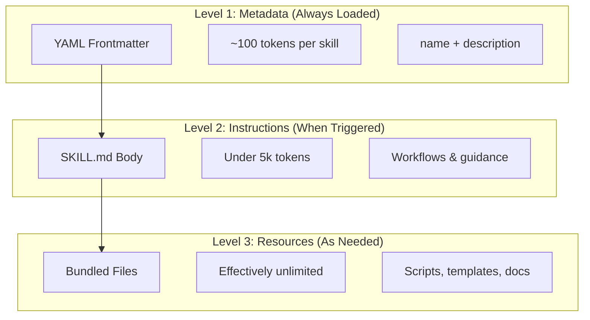
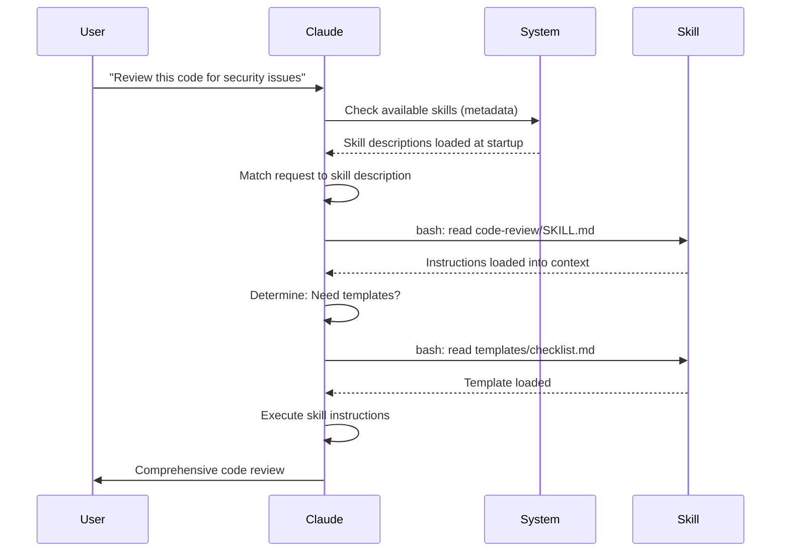

<picture>
  <source media="(prefers-color-scheme: dark)" srcset="../resources/logos/claude-howto-logo-dark.svg">
  
</picture>

# Agent Skills 指南

Agent Skills 是可重複使用的、基於檔案系統的技能，用於擴充 Claude 的功能。它們將特定領域的專業知識、工作流程與最佳實踐封裝成可被發現的組件，當相關時，Claude 會自動使用這些組件。

## 概述

**Agent Skills** 是模組化的能力，能將通用型的代理轉化為專家。與提示詞（用於單次任務的對話層級指令）不同，Skills 是按需載入，且無需在多次會話中重複提供相同的指導。

### 核心優勢

- **使 Claude 專業化**：為特定領域的任務量身打造能力
- **減少重複**：一次建立，即可在不同會話中自動使用
- **組合能力**：結合多個 Skills 以構建複雜的工作流程
- **擴展工作流程**：在多個專案與團隊之間重複使用 skills
- **維持品質**：將最佳實踐直接嵌入您的工作流程中

Skills 遵循 [Agent Skills](https://agentskills.io) 開放標準，該標準適用於多種 AI 工具。Claude Code 擴展了此標準，增加了如呼叫控制、子代理執行與動態上下文注入等額外功能。

> **注意**：自定義的斜線命令已併入 skills。`.claude/commands/` 檔案仍可運作並支援相同的 frontmatter 欄位。建議新開發時使用 Skills。當兩者存在於相同路徑時（例如 `.claude/commands/review.md` 與 `.claude/skills/review/SKILL.md` 並存），將以 skill 為優先。

## Skills 的運作方式：漸進式揭露

Skills 利用了**漸進式揭露**架構——Claude 會根據需求分階段載入資訊，而不是在開始時就消耗所有上下文。這能在維持無限擴展性的同時，實現高效的上下文管理。

### 三個載入層級



| 層級 | 載入時機 | Token 成本 | 內容 |
|-------|------------|------------|---------|
| **Level 1: Metadata** | 始終載入（啟動時） | 每個 Skill 約 100 tokens | 來自 YAML frontmatter 的 `name` 與 `description` |
| **Level 2: Instructions** | 當 Skill 被觸發時 | 低於 5k tokens | 包含指令與引導的 SKILL.md 本體 |
| **Level 3+: Resources** | 根據需求載入 | 實際上無限制 | 透過 bash 執行的 Bundled files，不會將內容載入上下文 |

這意味著您可以安裝許多 Skills 而不會造成上下文懲罰——在實際觸發之前，Claude 只知道每個 Skill 的存在以及何時使用它。

## Skill 載入流程



## 技能類型與位置

| 類型 | 位置 | 範圍 | 共用 | 最適合用於 |
|------|----------|-------|--------|----------|
| **Enterprise** | 管理設定 | 所有組織使用者 | 是 | 組織級標準 |
| **Personal** | `~/.claude/skills/<skill-name>/SKILL.md` | 個人 | 否 | 個人工作流程 |
| **Project** | `.claude/skills/<skill-name>/SKILL.md` | 團隊 | 是 (透過 git) | 團隊標準 |
| **Plugin** | `<plugin>/skills/<skill-name>/SKILL.md` | 已啟用的位置 | 視情況而定 | 與外掛綑綁使用 |

當不同層級的技能具有相同名稱時，優先權較高的位置將會勝出：**enterprise > personal > project**。Plugin 技能使用 `plugin-name:skill-name` 命名空間，因此不會產生衝突。

### 自動探索

**巢狀目錄**：當您在子目錄中處理檔案時，Claude Code 會自動從巢狀的 `.claude/skills/` 目錄中探索技能。例如，如果您正在編輯 `packages/frontend/` 中的檔案，Claude Code 也會在 `packages/frontend/.claude/skills/` 中尋找技能。這支援了各個 package 擁有各自技能的 monorepo 設定。

**`--add-dir` 目錄**：透過 `--add-dir` 新增的目錄中的技能會自動載入，並具備即時變更偵測功能。對這些目錄中技能檔案的任何編輯都會立即生效，無需重新啟動 Claude Code。

**描述預算**：技能描述（第一層 metadata）的上限為 **context window 的 1%**（備用方案：**8,000 個字元**）。如果您安裝了許多技能，描述可能會被縮短。所有的技能名稱都會被包含在內，但描述會被修剪以符合限制。請將關鍵的使用案例放在描述的最前面。您可以使用 `SLASH_COMMAND_TOOL_CHAR_BUDGET` 環境變數來覆蓋此預算。

## 建立自定義技能

### 基本目錄結構

```
my-skill/
├── SKILL.md           # 主要指令（必填）
├── template.md        # 供 Claude 填寫的範本
├── examples/
│   └── sample.md      # 顯示預期格式的範例輸出
└── scripts/
    └── validate.sh    # Claude 可以執行的腳本
```

### SKILL.md 格式

```yaml
---
name: your-skill-name
description: 簡要描述此技能的功能以及何時使用它
---

# 您的技能名稱

## 指令
為 Claude 提供清晰、逐步的引導。

## 範例
展示使用此技能的具體範例。
```

### 必要欄位

- **name**: 僅限小寫字母、數字、連字號（最多 64 個字元）。不能包含 "anthropic" 或 "claude"。
- **description**: 說明此技能的功能「以及」何時使用它（最多 1024 個字元）。這對於 Claude 判斷何時啟動技能至關重要。

### 選填 Frontmatter 欄位

```yaml
---
name: my-skill
description: 此技能的功能以及何時使用它
argument-hint: "[filename] [format]"        # 自動完成提示
disable-model-invocation: true              # 只有使用者可以呼叫
user-invocable: false                       # 從斜線選單中隱藏
allowed-tools: Read, Grep, Glob             # 限制工具存取權限
model: opus                                 # 指定使用的模型
effort: high                                # 覆寫努力程度 (low, medium, high, max)
context: fork                               # 在隔離的子代理中執行
agent: Explore                              # 指定代理類型 (搭配 context: fork 使用)
shell: bash                                 # 指令使用的 Shell：bash (預設) 或 powershell
hooks:                                      # 技能範圍內的鉤子
  PreToolUse:
    - matcher: "Bash"
      hooks:
        - type: command
          command: "./scripts/validate.sh"
paths: "src/api/**/*.ts"               # 限制技能啟動時機的 Glob 模式
---
```

| 欄位 | 描述 |
|-------|-------------|
| `name` | 僅限小寫字母、數字、連字號（最多 64 個字元）。不能包含 "anthropic" 或 "claude"。 |
| `description` | 說明此技能的功能「以及」何時使用它（最多 1024 個字元）。對於自動呼叫匹配至關重要。 |
| `argument-hint` | 在 `/` 自動完成選單中顯示的提示（例如 `"[filename] [format]"`）。 |
| `disable-model-invocation` | `true` = 只有使用者可以透過 `/name` 呼叫。Claude 絕不會自動呼叫。 |
| `user-invocable` | `false` = 從 `/` 選單中隱藏。只有 Claude 可以自動呼叫它。 |
| `allowed-tools` | 以逗號分隔的列表，列出該技能可以在無需權限提示的情況下使用的工具。 |
| `model` | 技能啟動期間的模型覆寫（例如 `opus`, `sonnet`）。 |
| `effort` | 技能啟動期間的努力程度覆寫：`low`、`medium`、`high` 或 `max`。 |
| `context` | `fork` 表示在具有獨立上下文視窗的分叉子代理環境中執行技能。 |
| `agent` | 當 `context: fork` 時指定的子代理類型（例如 `Explore`、`Plan`、`general-purpose`）。 |

| `shell` | 用於 `!`command`` 取代與腳本的 Shell：`bash` (預設) 或 `powershell`。 |
| `hooks` | 範圍限制在該技能生命週期內的鉤子 (格式與全域鉤子相同)。 |
| `paths` | 用於限制技能自動啟動時機的 Glob 模式。以逗號分隔的字串或 YAML 列表形式。格式與路徑特定規則相同。 |

## 技能內容類型

技能可以包含兩種類型的內容，每種都適用於不同的用途：

### Reference Content (參考內容)

增加 Claude 在您目前工作中會應用的知識——例如慣例、模式、風格指南、領域知識。會在您的對話上下文 (context) 中以行內方式執行。

```yaml
---
name: api-conventions
description: API design patterns for this codebase
---

When writing API endpoints:
- Use RESTful naming conventions
- Return consistent error formats
- Include request validation
```

### Task Content (任務內容)

針對特定動作的逐步指令。通常透過 `/skill-name` 直接調用。

```yaml
---
name: deploy
description: Deploy the application to production
context: fork
disable-model-invocation: true
---

Deploy the application:
1. Run the test suite
2. Build the application
3. Push to the deployment target
```

## 控制技能調用

預設情況下，您與 Claude 都可以調用任何技能。兩個 frontmatter 欄位控制了三種調用模式：

| Frontmatter | 您可以調用 | Claude 可以調用 |
|---|---|---|
| (預設) | 是 | 是 |
| `disable-model-invocation: true` | 是 | 否 |
| `user-invocable: false` | 否 | 是 |

**對於具有副作用的工作流程**（例如：`/commit`、`/deploy`、`/send-slack-message`），請使用 `disable-model-invocation: true`。您不希望 Claude 因為您的程式碼看起來準備好了就自行決定進行部署。

**對於無法作為指令執行的背景知識**，請使用 `user-invocable: false`。例如一個 `legacy-system-context` 技能是用來解釋舊系統如何運作——這對 Claude 很有用，但對使用者來說並非具備意義的操作。

## 字串替換

技能支援動態值，這些值會在技能內容傳送給 Claude 之前進行解析：

| 變數 | 描述 |
|----------|-------------|
| `$ARGUMENTS` | 呼叫技能時傳入的所有參數 |
| `$ARGUMENTS[N]` 或 `$N` | 透過索引（從 0 開始）存取特定參數 |
| `${CLAUDE_SESSION_ID}` | 目前的 session ID |
| `${CLAUDE_SKILL_DIR}` | 包含該技能 SKILL.md 檔案的目錄 |
| `` !`command` `` | 動態上下文注入 — 執行 shell 命令並將輸出嵌入內容中 |

**範例：**

```yaml
---
name: fix-issue
description: Fix a GitHub issue
---

Fix GitHub issue $ARGUMENTS following our coding standards.
1. Read the issue description
2. Implement the fix
3. Write tests
4. Create a commit
```

執行 `/fix-issue 123` 會將 `$ARGUMENTS` 替換為 `123`。

## 注入動態上下文

`!`command`` 語法會在技能內容傳送給 Claude 之前執行 shell 命令：

```yaml
---
name: pr-summary
description: Summarize changes in a pull request
context: fork
agent: Explore
---

## Pull request context
- PR diff: !`gh pr diff`
- PR comments: !`gh pr view --comments`
- Changed files: !`gh pr diff --name-only`

## Your task
Summarize this pull request...
```

命令會立即執行；Claude 只會看到最終的輸出結果。預設情況下，命令會在 `bash` 中執行。若要改用 PowerShell，請在 frontmatter 中設定 `shell: powershell`。

## 在子代理中執行技能

加入 `context: fork` 可在隔離的子代理（subagent）上下文中執行技能。技能內容將成為專用子代理的任務，該子代理擁有獨立的上下文視窗，能保持主對話的整潔。

`agent` 欄位指定要使用的代理類型：

| 代理類型 | 最適合用於 |
|---|---|
| `Explore` | 唯讀研究、程式碼庫分析 |
| `Plan` | 建立實作計畫 |
| `general-purpose` | 需要所有工具的廣泛任務 |
| 自定義代理 | 在您的配置中定義的專業代理 |

**範例 frontmatter：**

```yaml
---
context: fork
agent: Explore
---
```

**完整技能範例：**

```yaml
---
name: deep-research
description: Research a topic thoroughly
context: fork
agent: Explore
---

Research $ARGUMENTS thoroughly:
1. Find relevant files using Glob and Grep
2. Read and analyze the code
3. Summarize findings with specific file references
```

## 實際範例

### 範例 1：Code Review 技能

**目錄結構：**

```
~/.claude/skills/code-review/
├── SKILL.md
├── templates/
│   ├── review-checklist.md
│   └── finding-template.md
└── scripts/
    ├── analyze-metrics.py
    └── compare-complexity.py
```

**檔案：** `~/.claude/skills/code-review/SKILL.md`

```yaml
---
name: code-review-specialist
description: Comprehensive code review with security, performance, and quality analysis. Use when users ask to review code, analyze code quality, evaluate pull requests, or mention code review, security analysis, or performance optimization.
---

# Code Review 技能

此技能提供全面的程式碼審查能力，重點在於：

1. **安全性分析**
   - 身分驗證/授權問題
   - 資料外洩風險
   - 注入漏洞
   - 加密弱點

2. **效能審查**
   - 演算法效率 (Big O 分析)
   - 記憶體優化
   - 資料庫查詢優化
   - 快取機會

3. **程式碼品質**
   - SOLID 原則
   - 設計模式
   - 命名規範
   - 測試覆蓋率

4. **可維護性**
   - 程式碼可讀性
   - 函式大小 (應 < 50 行)
   - 圈複雜度 (Cyclomatic complexity)
   - 型別安全

## 審查範本

針對每一段審查過的程式碼，請提供：

### 摘要
- 整體品質評估 (1-5)
- 關鍵發現數量
- 建議優先處理區域

### 關鍵問題 (若有)
- **問題**：清晰的描述
- **位置**：檔案與行號
- **影響**：為什麼這很重要
- **嚴重程度**：緊急/高/中
- **修復**：程式碼範例

詳細的檢查清單，請參閱 [templates/review-checklist.md](templates/review-checklist.md)。
```

### 範例 2：Codebase Visualizer 技能

一個可以生成互動式 HTML 可視化圖表的技能：

**目錄結構：**

```
~/.claude/skills/codebase-visualizer/
├── SKILL.md
└── scripts/
    └── visualize.py
```

**檔案：** `~/.claude/skills/codebase-visualizer/SKILL.md`

````yaml
---
name: codebase-visualizer
description: Generate an interactive collapsible tree visualization of your codebase. Use when exploring a new repo, understanding project structure, or identifying large files.
allowed-tools: Bash(python *)
---

# Codebase Visualizer

生成一個互動式的 HTML 樹狀檢視圖，顯示您的專案檔案結構。
````

## 使用方法

從您的專案根目錄執行視覺化腳本：

```bash
python ~/.claude/skills/codebase-visualizer/scripts/visualize.py .
```

這會建立 `codebase-map.html` 並在您的預設瀏覽器中開啟。

## 視覺化內容說明

- **可摺疊目錄**：點擊資料夾即可展開/摺疊
- **檔案大小**：顯示在每個檔案旁邊
- **顏色**：不同的顏色代表不同的檔案類型
- **目錄總計**：顯示每個資料夾的累計大小

封裝的 Python 腳本負責處理繁重的運算工作，而 Claude 則負責協調流程。

### 範例 3：Deploy Skill (僅限使用者呼叫)

```yaml
---
name: deploy
description: Deploy the application to production
disable-model-invocation: true
allowed-tools: Bash(npm *), Bash(git *)
---

Deploy $ARGUMENTS to production:

1. Run the test suite: `npm test`
2. Build the application: `npm run build`
3. Push to the deployment target
4. Verify the deployment succeeded
5. Report deployment status
```

### 範例 4：Brand Voice Skill (背景知識)

```yaml
---
name: brand-voice
description: Ensure all communication matches brand voice and tone guidelines. Use when creating marketing copy, customer communications, or public-facing content.
user-invocable: false
---

## Tone of Voice
- **Friendly but professional** - 親切但不失專業 - 易於親近但不過於隨意
- **Clear and concise** - 清晰簡潔 - 避免使用術語
- **Confident** - 自信 - 我們清楚自己在做什麼
- **Empathetic** - 感同身受 - 理解使用者需求

## Writing Guidelines
- Use "you" when addressing readers
- Use active voice
- Keep sentences under 20 words
- Start with value proposition

For templates, see [templates/](templates/).
```

### 範例 5：CLAUDE.md Generator Skill

```yaml
---
name: claude-md
description: Create or update CLAUDE.md files following best practices for optimal AI agent onboarding. Use when users mention CLAUDE.md, project documentation, or AI onboarding.
---
```

## 核心原則

**LLMs 是無狀態的**：CLAUود.md 是唯一會自動包含在每個會話中的檔案。

### 黃金法則

1. **少即是多**：保持在 300 行以內（理想情況下在 100 行以內）
2. **通用適用性**：僅包含與「每個」會話都相關的資訊
3. **不要將 Claude 當作 Linter 使用**：請改用確定性的工具
4. **絕不自動生成**：透過審慎思考手動撰寫

## 必要章節

- **Project Name**：簡短的一行描述
- **Tech Stack**：主要語言、框架、資料庫
- **Development Commands**：安裝、測試、建置指令
- **Critical Conventions**：僅包含非顯而易見且具高影響力的慣例
- **Known Issues / Gotchas**：會讓開發者踩坑的事項

```

### 範例 6：使用腳本的重構技能

**目錄結構：**

```
refactor/
├── SKILL.md
├── references/
│   ├── code-smells.md
│   └── refactoring-catalog.md
├── templates/
│   └── refactoring-plan.md
└── scripts/
    ├── analyze-complexity.py
    └── detect-smells.py
```

**檔案：** `refactor/SKILL.md`

```yaml
---
name: code-refactor
description: Based on Martin Fowler's methodology, systematic code refactoring. Use when users ask to refactor code, improve code structure, reduce technical debt, or eliminate code smells.
---

# Code Refactoring Skill

A phased approach emphasizing safe, incremental changes backed by tests.

## Workflow

Phase 1: Research & Analysis → Phase 2: Test Coverage Assessment →
Phase 3: Code Smell Identification → Phase 4: Refactoring Plan Creation →
Phase 5: Incremental Implementation → Phase 6: Review & Iteration
```

## 核心原則

1. **行為保留**：外部行為必須保持不變
2. **小步進行**：進行微小且可測試的變更
3. **測試驅動**：測試是安全網
4. **持續性**：重構是持續進行的，而非一次性的事件

關於程式碼壞味道（code smell）目錄，請參閱 [references/code-smells.md](references/code-smells.md)。
關於重構技術，請參閱 [references/refactoring-catalog.md](references/refactoring-catalog.md)。

## 輔助檔案

技能（Skills）的目錄中除了 `SKILL.md` 之外，還可以包含多個檔案。這些輔助檔案（範本、範例、腳本、參考文件）能讓您保持主技能檔案的專注度，同時為 Claude 提供可根據需要載入的額外資源。

```
my-skill/
├── SKILL.md              # 主要指令（必填，請保持在 500 行以內）
├── templates/            # 供 Claude 填寫的範本
│   └── output-format.md
├── examples/             # 顯示預期格式的範例輸出
│   └── sample-output.md
├── references/           # 領域知識與規範
│   └── api-spec.md
└── scripts/              # Claude 可以執行的腳本
    └── validate.sh
```

輔助檔案指南：

- 將 `SKILL.md` 保持在 **500 行**以內。將詳細的參考資料、大型範例和規範移至獨立檔案中。
- 使用 **相對路徑** 從 `SKILL.md` 引用額外檔案（例如：`[API reference](references/api-spec.md)`）。
- 輔助檔案是在 Level 3（根據需要）載入的，因此在 Claude 實際讀取它們之前，不會消耗上下文（context）。

## 管理技能

### 查看可用技能

直接詢問 Claude：
```
What Skills are available?
```

或者檢查檔案系統：
```bash
# 列出個人技能
ls ~/.claude/skills/

# 列出專案技能
ls .claude/skills/
```

### 測試技能

有兩種測試方式：

**讓 Claude 自動調用**：透過詢問與描述相符的問題：
```
Can you help me review this code for security issues?
```

**或者直接調用**：使用技能名稱：
```
/code-review src/auth/login.ts
```

### 更新技能

直接編輯 `SKILL.md` 檔案。變更將在下次 Claude Code 啟動時生效。

```bash
# 個人技能
code ~/.claude/skills/my-skill/SKILL.md

# 專案技能
code .claude/skills/my-skill/SKILL.md
```

### 限制 Claude 的技能存取權限

有三種方式可以控制 Claude 可以調用的技能：

**在 `/permissions` 中停用所有技能**：
```
# 加入拒絕規則：
Skill
```

**允許或拒絕特定技能**：
```
# 僅允許特定技能
Skill(commit)
Skill(review-pr *)

# 拒絕特定技能
Skill(deploy *)
```

**隱藏個別技能**：在該技能的 frontmatter 中加入 `disable-model-invocation: true`。

## 最佳實踐

### 1. 使描述具體化

- **錯誤（模糊）**：「協助處理文件」
- **正確（具體）**：「從 PDF 檔案中提取文字與表格、填寫表單、合併文件。當處理 PDF 檔案或使用者提到 PDF、表單或文件提取時使用。」

### 2. 保持技能專注

- 一個技能 = 一種能力
- ✅ 「PDF 表單填寫」
- ❌ 「文件處理」（範圍太廣）

### 3. 包含觸發詞

在描述中加入與使用者請求相符的關鍵字：
```yaml
description: 分析 Excel 表格、產生樞紐分析表、建立圖表。當處理 Excel 檔案、試算表或 .xlsx 檔案時使用。
```

### 4. 保持 SKILL.md 低於 500 行

將詳細的參考資料移至獨立檔案，由 Claude 根據需要載入。

### 5. 引用輔助檔案

```markdown

## 其他資源

- 完整的 API 詳細資訊，請參閱 [reference.md](reference.md)
- 使用範例，請參閱 [examples.md](examples.md)

```

### 建議事項 (Do's)

- 使用清晰且具描述性的名稱
- 包含詳盡的指令
- 加入具體的範例
- 將相關的腳本與範本打包在一起
- 使用真實情境進行測試
- 記錄依賴項目

### 禁忌事項 (Don'ts)

- 不要為一次性任務建立 skills
- 不要重複現有的功能
- 不要將 skills 定義得過於寬泛
- 不要跳過 description 欄位
- 不要從未經審核的來源安裝 skills

## 除錯 (Troubleshooting)

### 快速參考

| 問題 | 解決方案 |
|-------|----------|
| Claude 沒有使用 Skill | 透過觸發詞讓 description 更具體 |
| 找不到 Skill 檔案 | 確認路徑：`~/.claude/skills/name/SKILL.md` |
| YAML 錯誤 | 檢查 `---` 標記、縮排，且不可使用 Tab |
| Skills 衝突 | 在 description 中使用獨特的觸發詞 |
| 腳本無法執行 | 檢查權限：`chmod +x scripts/*.py` |
| Claude 沒有看到所有 skills | skills 過多；請執行 `/context` 查看是否有排除警告 |

### Skill 未觸發

如果 Claude 在預期情況下沒有使用您的 skill：

1. 檢查 description 是否包含使用者會自然說出的關鍵字
2. 確認在詢問「有哪些可用的 skills？」時，該 skill 是否會出現
3. 嘗試重新措辭您的請求以符合 description
4. 直接使用 `/skill-name` 進行呼叫測試

### Skill 觸發過於頻繁

如果 Claude 在您不希望它使用時使用了您的 skill：

1. 使 description 更加具體
2. 加入 `disable-model-invocation: true` 以僅進行手動呼叫

### Claude 沒有看到所有 Skills

Skill 的 description 會佔用 **1% 的 context 視窗**（備用方案：**8,000 個字元**）。無論預算如何，每個項目上限為 250 個字元。執行 `/context` 以檢查是否有關於被排除 skills 的警告。您可以使用 `SLASH_COMMAND_TOOL_CHAR_BUDGET` 環境變數來覆蓋此預算。

## 安全考量

**僅使用來自信任來源的 Skills。** Skills 透過指令與程式碼為 Claude 提供能力——惡意的 Skill 可能會引導 Claude 以有害的方式呼叫工具或執行程式碼。

**關鍵安全考量：**

- **徹底審查**：檢查 Skill 目錄中的所有檔案
- **外部來源具有風險**：從外部 URL 獲取資料的 Skills 可能會遭到入侵
- **工具誤用**：惡意的 Skills 可能會以有害的方式呼叫工具
- **視同安裝軟體**：僅使用來自信任來源的 Skills

## Skills 與其他功能之比較

| 功能 | 呼叫方式 | 最適合用於 |
|---------|------------|----------|
| **Skills** | 自動或 `/name` | 可重複使用的專業知識、工作流程 |
| **斜線命令** | 使用者啟動的 `/name` | 快速捷徑（已併入 skills） |
| **Subagents** | 自動委派 | 隔離的任務執行 |
| **Memory (CLAUDE.md)** | 始終載入 | 持續性的專案上下文 |
| **MCP** | 即時 | 存取外部資料/服務 |
| **Hooks** | 事件驅動 | 自動化副作用 |

## 內建 Skills

Claude Code 內建了數個無需安裝即可隨時使用的 skills：

| Skill | 描述 |
|-------|-------------|
| `/simplify` | 審查變更後的檔案以進行重用、品質與效率檢查；會產生 3 個並行的審查代理 |
| `/batch <instruction>` | 使用 git worktrees 在整個程式碼庫中編排大規模的並行變更 |
| `/debug [description]` | 透過閱讀除錯日誌來排除當前會話的問題 |
| `/loop [interval] <prompt>` | 按間隔重複執行提示詞（例如：`/loop 5m check the deploy`） |
| `/claude-api` | 載入 Claude API/SDK 參考資料；在匯入 `anthropic`/`@anthropic-ai/sdk` 時自動啟動 |

這些 skills 為開箱即用，不需要安裝或配置。它們遵循與自定義 skills 相同的 SKILL.md 格式。

## 分享技能

### 專案技能（團隊共享）

1. 在 `.claude/skills/` 中建立技能
2. 提交至 git
3. 團隊成員執行 pull 取得變更 — 技能立即生效

### 個人技能

```bash
# 複製到個人目錄
cp -r my-skill ~/.claude/skills/

# 賦予腳本執行權限
chmod +x ~/.claude/skills/my-skill/scripts/*.py
```

### 外掛分發

將技能封裝在一個外掛的 `skills/` 目錄中，以便進行更廣泛的分發。

## 進階指南：技能集合與技能管理器

當你開始認真構建技能時，兩件事會變得至關重要：一個經過驗證的技能庫，以及一個用來管理它們的工具。

**[luongnv89/skills](https://github.com/luongnv89/skills)** — 我在幾乎所有專案中日常使用的技能集合。亮點包括 `logo-designer`（即時生成專案標誌）和 `ollama-optimizer`（針對你的硬體優化本地 LLM 效能）。如果你想要現成的技能，這是一個很好的起點。

**[luongnv89/asm](https://github.com/luongnv89/asm)** — 代理技能管理器（Agent Skill Manager）。處理技能開發、重複檢測與測試。`asm link` 指令讓你可以在任何專案中測試技能而無需來回複製檔案 — 當你擁有的技能超過幾個時，這將變得不可或缺。

## 其他資源

- [官方技能文件](https://code.claude.com/docs/en/skills)
- [代理技能架構部落格](https://claude.com/blog/equipping-agents-for-the-real-world-with-agent-skills)
- [技能儲存庫](https://github.com/luongnv89/skills) - 現成可用技能的集合
- [斜線命令指南](../01-slash-commands/) - 使用者啟動的捷徑
- [子代理指南](../04-subagents/) - 委派的 AI 代理
- [記憶指南](../02-memory/) - 持久化上下文
- [MCP (Model Context Protocol)](../05-mcp/) - 即時外部數據
- [鉤子指南](../06-hooks/) - 事件驅動自動化

---
**最後更新日期**: 2026 年 4 月 16 日
**Claude Code 版本**: 2.1.110
**來源**:
- https://code.claude.com/docs/en/skills
**相容模型**: Claude Sonnet 4.6, Claude Opus 4.6, Claude Haiku 4.5
