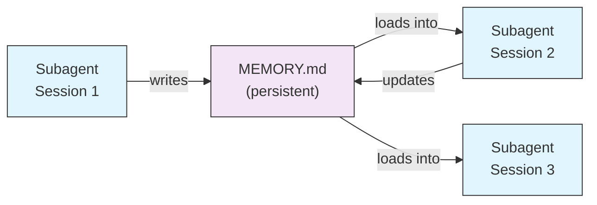
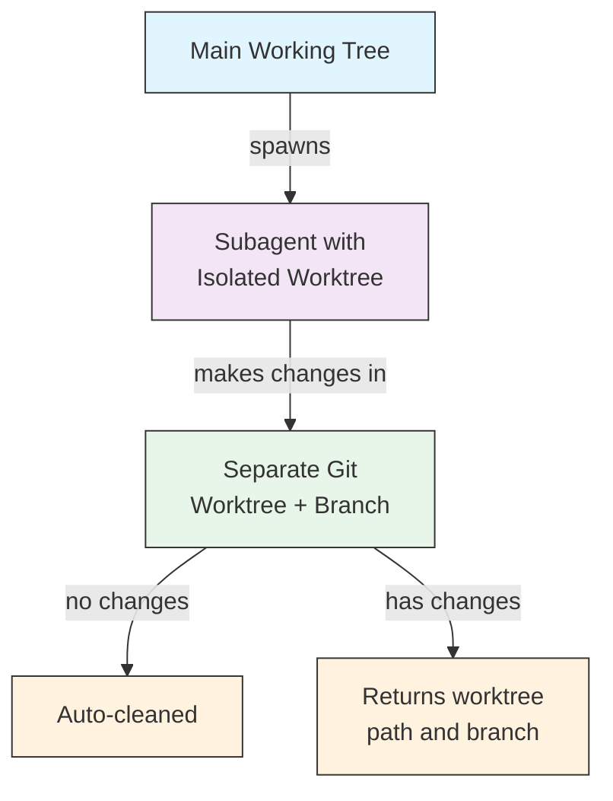
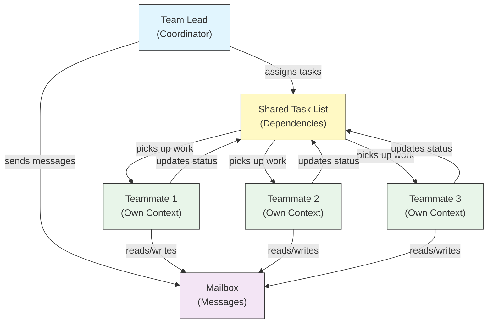
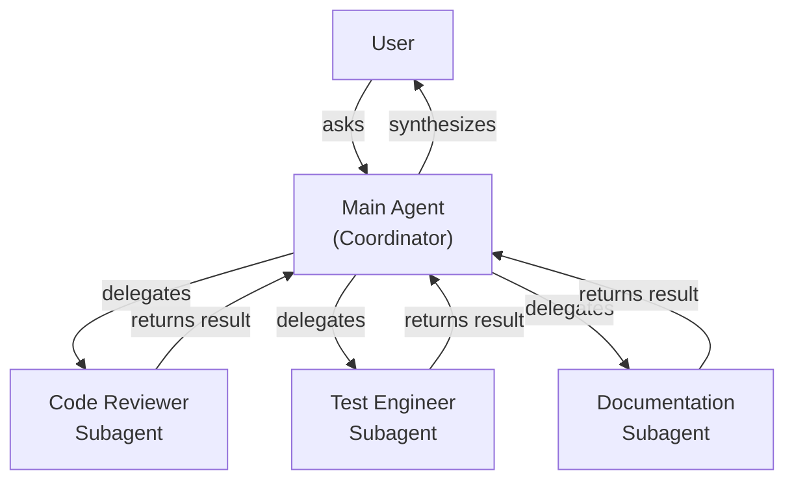
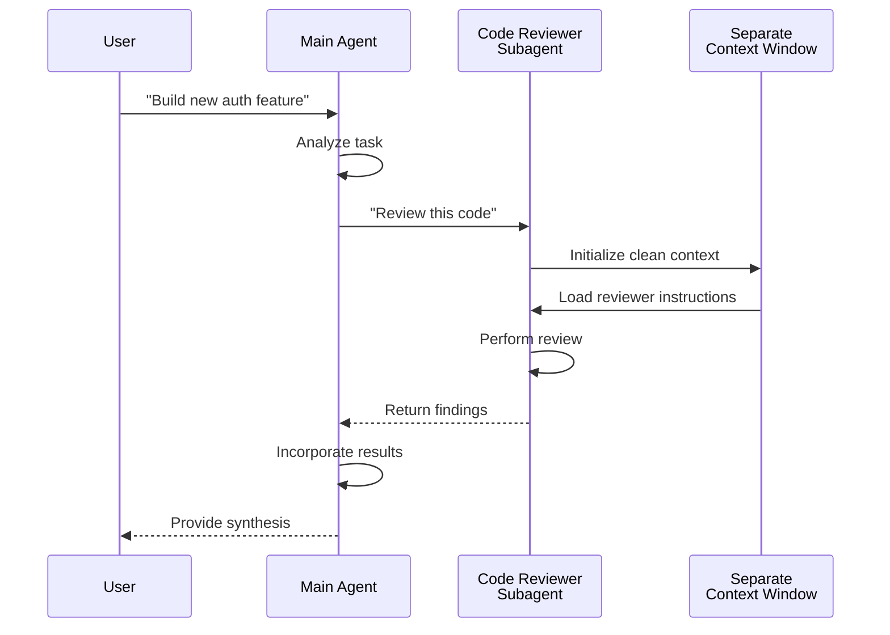
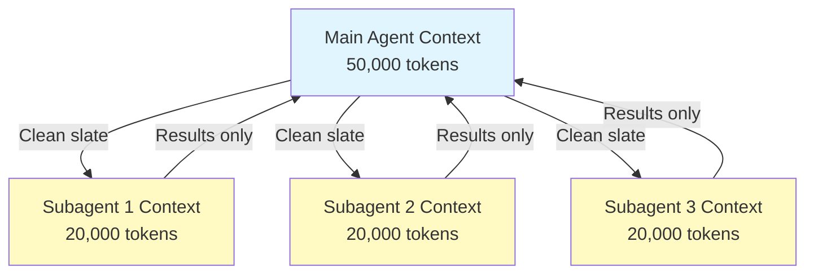
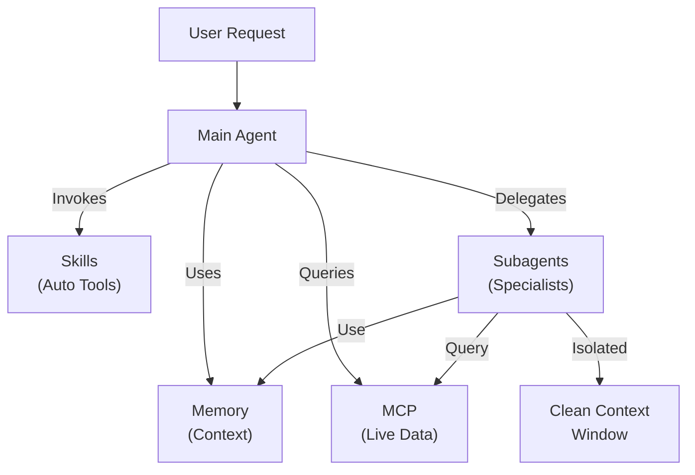

<picture>
  <source media="(prefers-color-scheme: dark)" srcset="../resources/logos/claude-howto-logo-dark.svg">
  
</picture>

# Subagents - 完整參考指南

Subagents 是 Claude Code 可以委派任務的專業化 AI 助手。每個 subagent 都有特定的用途，使用與主對話分離的獨立上下文視窗，並且可以配置特定的工具與自定義的系統提示詞。

## 目錄

1. [概述](#overview)
2. [核心優勢](#key-benefits)
3. [檔案位置](#file-locations)
4. [配置](#configuration)
5. [內建 Subagents](#built-in-subagents)
6. [管理 Subagents](#managing-subagents)
7. [使用 Subagents](#using-subagents)
8. [可續行的代理](#resumable-agents)
9. [鏈結 Subagents](#chaining-subagents)
10. [Subagents 的持久化記憶](#persistent-memory-for-subagents)
11. [背景 Subagents](#background-subagents)
12. [Worktree 隔離](#worktree-isolation)
13. [限制可生成的 Subagents](#restrict-spawnable-subagents)
14. [`claude agents` CLI 命令](#claude-agents-cli-command)
15. [代理團隊 (實驗性功能)](#agent-teams-experimental)
16. [外掛 Subagent 安全性](#plugin-subagent-security)
17. [架構](#architecture)
18. [上下文管理](#context-management)
19. [何時使用 Subagents](#when-to-use-subagents)
20. [最佳實踐](#best-practices)
21. [此資料夾中的範例 Subagents](#example-subagents-in-this-folder)
22. [安裝說明](#installation-instructions)
23. [相關概念](#related-concepts)

---

## 概觀

Subagents 透過以下方式在 Claude Code 中實現委派任務執行：

- 建立具有獨立上下文視窗的**隔離式 AI 助手**
- 提供**客製化的系統提示詞**以獲得專業知識
- 強制執行**工具存取控制**以限制能力範圍
- 防止複雜任務導致的**上下文污染**
- 實現多個專業任務的**並行執行**

每個 subagent 都以乾淨的狀態獨立運作，僅接收執行任務所需的特定上下文，然後將結果回傳給主代理進行整合。

**快速入門**：使用 `/agents` 斜線命令以互動方式建立、查看、編輯及管理您的 subagents。

---

## 核心優勢

| 優勢 | 描述 |
|---------|-------------|
| **上下文保留** | 在獨立的上下文中運作，防止污染主對話 |
| **專業知識** | 針對特定領域進行微調，具有更高的成功率 |
| **可重用性** | 可跨不同專案使用並與團隊共享 |
| **靈活的權限** | 為不同類型的 subagent 提供不同的工具存取層級 |
| **可擴展性** | 多個代理可同時處理不同面向的任務 |

---

## 檔案位置

Subagent 檔案可以儲存在具有不同範圍的多個位置：

| 優先順序 | 類型 | 位置 | 範圍 |
|----------|------|----------|-------|
| 1 (最高) | **CLI 定義** | 透過 `--agents` 旗標 (JSON) | 僅限當前會話 |
| 2 | **專案 subagents** | `.claude/agents/` | 目前專案 |
| 3 | **使用者 subagents** | `~/.claude/agents/` | 所有專案 |
| 4 (最低) | **外掛代理** | 外掛的 `agents/` 目錄 | 透過外掛使用 |

當存在重複名稱時，優先順序較高的來源將會生效。

---

## Configuration

### File Format

Subagents 定義於 YAML frontmatter 中，後接 markdown 格式的系統提示詞：

```yaml
---
name: your-sub-agent-name
description: Description of when this subagent should be invoked
tools: tool1, tool2, tool3  # Optional - inherits all tools if omitted
disallowedTools: tool4  # Optional - explicitly disallowed tools
model: sonnet  # Optional - sonnet, opus, haiku, or inherit
permissionMode: default  # Optional - permission mode
maxTurns: 20  # Optional - limit agentic turns
skills: skill1, skill2  # Optional - skills to preload into context
mcpServers: server1  # Optional - MCP servers to make available
memory: user  # Optional - persistent memory scope (user, project, local)
background: false  # Optional - run as background task
effort: high  # Optional - reasoning effort (low, medium, high, max)
isolation: worktree  # Optional - git worktree isolation
initialPrompt: "Start by analyzing the codebase"  # Optional - auto-submitted first turn
hooks:  # Optional - component-scoped hooks
  PreToolUse:
    - matcher: "Bash"
      hooks:
        - type: command
          command: "./scripts/security-check.sh"
---

Your subagent's system prompt goes here. This can be multiple paragraphs
and should clearly define the subagent's role, capabilities, and approach
to solving problems.
```

您的 subagent 系統提示詞位於此處。這可以包含多個段落，且應清楚定義 subagent 的角色、能力以及解決問題的方法。

### Configuration Fields

| 欄位 | 必要 | 說明 |
|-------|----------|-------------|
| `name` | 是 | 唯一識別碼（小寫字母與連字號） |
| `description` | 是 | 用自然語言描述用途。包含 "use PROACTIVELY" 以鼓勵自動調用 |
| `tools` | 否 | 以逗號分隔的特定工具列表。省略則繼承所有工具。支援 `Agent(agent_name)` 語法以限制可產生的 subagents |
| `disallowedTools` | 否 | 以逗號分隔的 subagent 禁止使用的工具列表 |
| `model` | 否 | 使用的模型：`sonnet`、`opus`、`haiku`、完整模型 ID 或 `inherit`。預設為已設定的 subagent 模型 |
| `permissionMode` | 否 | `default`、`acceptEdits`、`dontAsk`、`bypassPermissions`、`plan` |
| `maxTurns` | 否 | subagent 可進行的最大代理回合數 |
| `skills` | 否 | 以逗號分隔的預載技能列表。啟動時會將完整的技能內容注入 subagent 的上下文 |
| `mcpServers` | 否 | 提供給 subagent 使用的 MCP servers |
| `hooks` | 否 | 組件範圍的鉤子 (PreToolUse, PostToolUse, Stop) |
| `memory` | 否 | 持久化記憶目錄範圍：`user`、`project` 或 `local` |
| `background` | 否 | 設定為 `true` 以始終將此 subagent 作為背景任務執行 |
| `effort` | 否 | 推理努力程度：`low`、`medium`、`high` 或 `max` |
| `isolation` | 否 | 設定為 `worktree` 以為 subagent 提供獨立的 git worktree |
| `initialPrompt` | 否 | 當 subagent 作為主要代理執行時，自動提交的第一個回合 |

### Tool Configuration Options

**選項 1：繼承所有工具（省略該欄位）**
```yaml
---
name: full-access-agent
description: Agent with all available tools
```

---
```

**選項 2：指定個別工具**
```yaml
---
name: limited-agent
description: 僅具備特定工具的代理
tools: Read, Grep, Glob, Bash
---
```

**選項 3：條件式工具存取**
```yaml
---
name: conditional-agent
description: 具有過濾工具存取權限的代理
tools: Read, Bash(npm:*), Bash(test:*)
---
```

### 基於 CLI 的配置

使用 `--agents` 旗標搭配 JSON 格式，為單一會話定義子代理：

```bash
claude --agents '{
  "code-reviewer": {
    "description": "專家級程式碼審查員。在程式碼變更後主動使用。",
    "prompt": "你是一位資深程式碼審查員。專注於程式碼品質、安全性與最佳實踐。",
    "tools": ["Read", "Grep", "Glob", "Bash"],
    "model": "sonnet"
  }
}'
```

**`--agents` 旗標的 JSON 格式：**

```json
{
  "agent-name": {
    "description": "必填：何時呼叫此代理",
    "prompt": "必填：代理的系統提示詞",
    "tools": ["選填", "工具", "陣列"],
    "model": "選填：sonnet|opus|haiku"
  }
}
```

**代理定義的優先順序：**

代理定義按以下優先順序載入（先匹配者勝）：
1. **CLI 定義** - `--agents` 旗標（僅限當前會話，JSON 格式）
2. **專案層級** - `.claude/agents/`（當前專案）
3. **使用者層級** - `~/.claude/agents/`（所有專案）
4. **外掛層級** - 外掛的 `agents/` 目錄

這使得 CLI 定義可以在單一會話中覆蓋所有其他來源。

---

## 內建子代理

Claude Code 包含數個隨時可用的內建子代理：

| 代理 | 模型 | 用途 |
|-------|-------|---------|
| **general-purpose** | 繼承 | 複雜的多步驟任務 |
| **Plan** | 繼承 | 規劃模式下的研究 |
| **Explore** | Haiku | 唯讀程式碼庫探索（快速/中等/極其徹底） |
| **Bash** | 繼承 | 在獨立上下文中的終端機指令 |
| **statusline-setup** | Sonnet | 配置狀態列 |
| **Claude Code Guide** | Haiku | 回答 Claude Code 功能相關問題 |

### General-Purpose 子代理

| 屬性 | 值 |
|----------|-------|
| **模型** | 繼承自父層 |
| **工具** | 所有工具 |
| **用途** | 複雜的研究任務、多步驟操作、程式碼修改 |

**使用時機**：需要同時進行探索與修改，且涉及複雜推理的任務。

### Plan 子代理

| 屬性 | 值 |
|----------|-------|
| **模型** | 繼承自父層 |
| **工具** | Read, Glob, Grep, Bash |
| **用途** | 在規劃模式中自動用於研究程式碼庫 |

**使用時機**：當 Claude 在提出計畫前需要理解程式碼庫時。

### Explore 子代理

| 屬性 | 值 |
|----------|-------|
| **模型** | Haiku (快速、低延遲) |
| **模式** | 嚴格唯讀 |
| **工具** | Glob, Grep, Read, Bash (僅限唯讀指令) |
| **用途** | 快速的程式碼庫搜尋與分析 |

**使用時機**：在不進行任何變更的情況下搜尋或理解程式碼。

**徹底程度層級** - 指定探索的深度：

- **"quick"** - 快速搜尋且僅進行極少量的探索，適合尋找特定模式
- **"medium"** - 中度探索，在速度與徹底性之間取得平衡，為預設方式
- **"very thorough"** - 跨多個位置與命名慣例進行全面的分析，可能需要較長時間

### Bash Subagent

| 屬性 | 值 |
|----------|-------|
| **Model** | 繼承自父代理 |
| **Tools** | Bash |
| **Purpose** | 在獨立的上下文視窗中執行終端機指令 |

**使用時機**：當執行需要隔離上下文的 shell 指令時。

### Statusline Setup Subagent

| 屬性 | 值 |
|----------|-------|
| **Model** | Sonnet |
| **Tools** | Read, Write, Bash |
| **Purpose** | 配置 Claude Code 狀態列顯示 |

**使用時機**：當設定或自定義狀態列時。

### Claude Code Guide Subagent

| 屬性 | 值 |
|----------|-------|
| **Model** | Haiku (快速、低延遲) |
| **Tools** | Read-only |
| **Purpose** | 回答關於 Claude Code 功能與用法的問題 |

**使用時機**：當使用者詢問關於 Claude Code 如何運作或如何使用特定功能時。

---

## 管理 Subagents

### 使用 `/agents` 斜線命令 (建議方式)

```bash
/agents
```

這會提供一個互動式選單，用於：
- 查看所有可用的 subagents（內建、使用者與專案）
- 透過引導式設定建立新的 subagents
- 編輯現有的自定義 subagents 與工具存取權限
- 刪除自定義 subagents
- 當存在重複時，查看哪些 subagents 是啟用的

### 直接進行檔案管理

```bash
# 建立一個專案 subagent
mkdir -p .claude/agents
cat > .claude/agents/test-runner.md << 'EOF'
---
name: test-runner
description: 主動用於執行測試並修復失敗
---

You are a test automation expert. When you see code changes, proactively
run the appropriate tests. If tests fail, analyze the failures and fix
them while preserving the original test intent.
EOF

# 建立一個使用者 subagent (適用於所有專案)
mkdir -p ~/.claude/agents
```

---

## 使用 Subagents

### 自動委派

Claude 會根據以下資訊主動委派任務：
- 您請求中的任務描述
- Subagent 設定中的 `description` 欄位
- 目前的上下文與可用工具

為了鼓勵主動使用，請在您的 `description` 欄位中加入「use PROACTIVELY」或「MUST BE USED」：

```yaml
---
name: code-reviewer
description: Expert code review specialist. Use PROACTIVELY after writing or modifying code.
---
```

### 明確調用

您可以明確要求使用特定的 subagent：

```
> Use the test-runner subagent to fix failing tests
> Have the code-reviewer subagent look at my recent changes
> Ask the debugger subagent to investigate this error
```

### @-Mention 調用

使用 `@` 前綴來確保特定的 subagent 被調用（這會繞過自動委派的啟發式演算法）：

```
> @"code-reviewer (agent)" review the auth module
```

### 全會話代理

使用特定的 agent 作為主要代理來執行整個會話：

```bash
# 透過 CLI 參數
claude --agent code-reviewer

# 透過 settings.json
{
  "agent": "code-reviewer"
}
```

### 列出可用代理

使用 `claude agents` 指令來列出所有來源中已設定的代理：

```bash
claude agents
```

---

## 可續接代理

Subagents 可以繼續之前的對話，並完整保留上下文：

```bash
# 初始調用
> Use the code-analyzer agent to start reviewing the authentication module
# 回傳 agentId: "abc123"

# 稍後續接該代理
> Resume agent abc123 and now analyze the authorization logic as well
```

**使用案例**：
- 跨多個會話的長期研究
- 不失上下文的迭代精煉
- 維持上下文的多步驟工作流程

---

## 串聯子代理

依序執行多個子代理：

```bash
> First use the code-analyzer subagent to find performance issues,
  then use the optimizer subagent to fix them
```

這可以實現複雜的工作流程，讓一個子代理的輸出作為另一個子代理的輸入。

---

## 子代理的持久化記憶

`memory` 欄位為子代理提供了一個在不同會話之間持續存在的持久化目錄。這讓子代理能夠隨著時間累積知識，儲存筆記、發現以及在不同會話之間持續存在的上下文。

### 記憶範圍 (Memory Scopes)

| 範圍 | 目錄 | 使用情境 |
|-------|-----------|----------|
| `user` | `~/.claude/agent-memory/<name>/` | 跨所有專案的個人筆記與偏好 |
| `project` | `.claude/agent-memory/<name>/` | 與團隊共享的專案特定知識 |
| `local` | `.claude/agent-memory-local/<name>/` | 未提交至版本控制系統的本地專案知識 |

### 運作原理

- 記憶目錄中 `MEMORY.md` 的前 200 行會自動載入到子代理的系統提示詞中
- `Read`、`Write` 與 `Edit` 工具會自動為子代理啟用，以便其管理記憶檔案
- 子代理可以根據需要在其記憶目錄中建立額外的檔案

### 配置範例

```yaml
---
name: researcher
memory: user
---

You are a research assistant. Use your memory directory to store findings,
track progress across sessions, and build up knowledge over time.

Check your MEMORY.md file at the start of each session to recall previous context.
```



---

## 背景子代理

子代理可以在背景執行，從而將主對話釋放給其他任務使用。

### 配置

在 frontmatter 中設定 `background: true`，即可讓子代理始終作為背景任務執行：

```yaml
---
name: long-runner
background: true
description: Performs long-running analysis tasks in the background
---
```

### 鍵盤快捷鍵

| 快捷鍵 | 動作 |
|----------|--------|
| `Ctrl+B` | 將目前正在執行的子代理任務轉為背景執行 |
| `Ctrl+F` | 刪除所有背景代理（按兩次以確認） |

### 停用背景任務

設定環境變數以完全停用背景任務支援：

```bash
export CLAUDE_CODE_DISABLE_BACKGROUND_TASKS=1
```

---

## Worktree 隔離

`isolation: worktree` 設定會為子代理提供專屬的 git worktree，使其能夠獨立進行變更，而不會影響主工作樹。

### 配置

```yaml
---
name: feature-builder
isolation: worktree
description: Implements features in an isolated git worktree
tools: Read, Write, Edit, Bash, Grep, Glob
---
```

### 運作原理



- 子代理在獨立分支的專屬 git worktree 中進行操作
- 如果子代理沒有進行任何變更，worktree 會自動清理
- 如果存在變更，則會將 worktree 路徑與分支名稱回傳給主代理進行審查或合併

---

## 限制可生成的子代理

您可以透過在 `tools` 欄位中使用 `Agent(agent_type)` 語法，來控制特定子代理被允許生成的子代理。這提供了一種為委派任務建立特定子代理白名單的方法。

> **注意**：在 v2.1.63 中，`Task` 工具已重新命名為 `Agent`。現有的 `Task(...)` 引用仍可作為別名使用。

### 範例

```yaml
---
name: coordinator
description: Coordinates work between specialized agents
tools: Agent(worker, researcher), Read, Bash
---

You are a coordinator agent. You can delegate work to the "worker" and
"researcher" subagents only. Use Read and Bash for your own exploration.
```

在此範例中，`coordinator` 子代理只能生成 `worker` 和 `researcher` 子代理。它無法生成任何其他子代理，即使它們是在其他地方定義的。

---

## `claude agents` CLI 命令

`claude agents` 命令會列出所有配置的代理，並按來源（內建、使用者層級、專案層級）進行分組：

```bash
claude agents
```

此命令：
- 顯示來自所有來源的所有可用代理
- 按來源位置對代理進行分組
- 當高優先級層級的代理覆蓋了低層級的代理時（例如：與使用者層級代理同名的專案層級代理），會顯示 **overrides**

---

## Agent Teams（實驗性功能）

Agent Teams 協調多個 Claude Code 實例共同處理複雜任務。與子代理（委派子任務並回傳結果）不同，團隊成員（teammates）會獨立工作，擁有各自的上下文視窗，並可以透過共享的信箱系統直接互相傳送訊息。

> **官方文件**：[code.claude.com/docs/en/agent-teams](https://code.claude.com/docs/en/agent-teams)

> **注意**：Agent Teams 是實驗性功能，預設為停用狀態。需要 Claude Code v2.1.32+。請在使用前啟用它。

### 子代理 vs Agent Teams

| 項目 | 子代理 | Agent Teams |
|--------|-----------|-------------|
| **委派模型** | 父代理委派子任務，並等待結果 | 團隊領導協調工作，團隊成員獨立執行 |
| **上下文** | 每個子任務擁有全新的上下文，結果會被提煉回傳 | 每位團隊成員維持其各自的持久性上下文視窗 |
| **協調方式** | 循序或並行，由父代理管理 | 共享任務列表，具備自動依賴管理功能 |
| **通訊** | 僅將結果回傳給父代理（無代理間訊息傳遞） | 團隊成員可以透過信箱直接互相傳送訊息 |
| **會話恢復** | 支援 | 處理中的團隊成員不支援 |
| **最佳適用場景** | 專注且定義明確的子任務 | 需要代理間通訊與並行執行的複雜工作 |

### 啟用 Agent Teams

設定環境變數或將其加入您的 `settings.json`：

```bash
export CLAUDE_CODE_EXPERIMENTAL_AGENT_TEAMS=1
```

或者在 `settings.json` 中：

```json
{
  "env": {
    "CLAUDE_CODE_EXPERIMENTAL_AGENT_TEAMS": "1"
  }
}
```

### 啟動團隊

啟用後，在您的提示詞中要求 Claude 與團隊成員一起工作：

```

User: Build the authentication module. Use a team — one teammate for the API endpoints,
      one for the database schema, and one for the test suite.
```

Claude 將會自動建立團隊、分配任務並協調工作。

### 顯示模式

控制隊友活動的顯示方式：

| 模式 | 旗標 | 說明 |
|------|------|-------------|
| **Auto** | `--teammate-mode auto` | 自動為您的終端機選擇最佳顯示模式 |
| **In-process** (預設) | `--teammate-mode in-process` | 在目前的終端機中以行內方式顯示隊友輸出 |
| **Split-panes** | `--teammate-mode tmux` | 在獨立的 tmux 或 iTerm2 窗格中開啟每個隊友 |

```bash
claude --teammate-mode tmux
```

您也可以在 `settings.json` 中設定顯示模式：

```json
{
  "teammateMode": "tmux"
}
```

> **注意**：Split-pane 模式需要 tmux 或 iTerm2。它不支援 VS Code terminal、Windows Terminal 或 Ghostty。

### 導覽

在 split-pane 模式下，使用 `Shift+Down` 可以在隊友之間進行切換。

### 團隊配置

團隊配置儲存在 `~/.claude/teams/{team-name}/config.json`。

### 架構



**關鍵組件**：

- **Team Lead**：主要的 Claude Code 會話，負責建立團隊、分配任務與協調
- **Shared Task List**：同步的任務列表，具有自動依賴追蹤功能
- **Mailbox**：代理間的訊息系統，供隊友溝通狀態與進行協調
- **Teammates**：獨立的 Claude Code 實例，每個實例都有各自的上下文視窗

### 任務分配與訊息傳遞

團隊領導者將工作拆解為任務並分配給隊友。共享任務列表負責處理：

- **自動依賴管理** — 任務會等待其依賴項完成
- **狀態追蹤** — 隊友在工作時會更新任務狀態
- **代理間訊息傳遞** — 隊友透過 mailbox 發送訊息進行協調（例如：「資料庫 schema 已就緒，你可以開始撰寫查詢語句了」）

### 計劃審核工作流程

對於複雜任務，團隊領導者會在隊友開始工作前建立執行計劃。使用者會審查並核准該計劃，確保團隊的處理方式符合預期，然後才進行任何程式碼變更。

### 團隊的 Hook 事件

Agent Teams 引入了兩個額外的 [hook 事件](../06-hooks/)：

| 事件 | 觸發條件 | 使用案例 |
|-------|-----------|----------|
| `TeammateIdle` | 當一名隊友完成目前任務且沒有待處理工作時 | 觸發通知、指派後續任務 |
| `TaskCompleted` | 當共享任務列表中的任務被標記為完成時 | 執行驗證、更新儀表板、串接相依工作 |

### 最佳實踐

- **團隊規模**：將團隊人數維持在 3-5 名隊友，以獲得最佳協調性
- **任務規模**：將工作拆解為每個任務耗時 5-15 分鐘的任務 — 足夠小以便並行處理，也足夠大以具備意義
- **避免檔案衝突**：將不同的檔案或目錄指派給不同的隊友，以防止合併衝突
- **從簡單開始**：在建立第一個團隊時使用 in-process 模式；熟悉後再切換到 split-panes 模式
- **清晰的任務描述**：提供具體且可執行的任務描述，以便隊友可以獨立工作

### 限制

- **實驗性功能**：功能行為可能會在未來的版本中發生變化
- **無法恢復會話**：in-process 模式下的隊友在會話結束後無法恢復
- **單一會話僅限一個團隊**：無法在單一會話中建立巢狀團隊或多個團隊
- **固定領導地位**：團隊領導角色無法轉移給其他隊友
- **Split-pane 限制**：需要 tmux/iTerm2；無法在 VS Code terminal、Windows Terminal 或 Ghostty 中使用
- **無跨會話團隊**：隊友僅存在於當前會話中

> **警告**：Agent Teams 是實驗性功能。請先使用非關鍵性工作進行測試，並監控隊友協調情況以觀察是否有非預期的行為。

---

## Plugin Subagent 安全性

為了安全性考量，由外掛提供的 subagents 具有受限的 frontmatter 功能。在 plugin subagent 定義中，**不允許**使用以下欄位：

- `hooks` - 不得定義生命週期鉤子
- `mcpServers` - 不得配置 MCP servers
- `permissionMode` - 不得覆寫權限設定

這可以防止外掛透過 subagent hooks 進行權限提升或執行任意指令。

---

## 架構

### 高階架構



### Subagent 生命週期



---

## 上下文管理



### 重點

- 每個子代理都會獲得一個**全新的上下文視窗**，且不包含主對話歷史
- 僅將**相關的上下文**傳遞給子代理以執行其特定任務
- 結果會被**精煉**後回傳給主代理
- 這能防止在長期專案中發生**上下文 token 耗盡**的問題

### 效能考量

- **上下文效率** - 代理會保留主上下文，從而實現更長的會話
- **延遲** - 子代理從乾淨的狀態開始，在收集初始上下文時可能會增加延遲

### 關鍵行為

- **禁止巢狀生成** - 子代理無法生成其他子代理
- **背景權限** - 背景子代理會自動拒絕任何未經預先核准的權限
- **背景化** - 按下 `Ctrl+B` 可將目前正在執行的任務轉為背景執行
- **逐字稿** - 子代理的逐字稿儲存在 `~/.claude/projects/{project}/{sessionId}/subagents/agent-{agentId}.jsonl`
- **自動壓縮** - 子代理上下文會在容量達到約 95% 時自動進行壓縮（可透過 `CLAUDE_AUTOCOMPACT_PCT_OVERRIDE` 環境變數進行覆蓋）

---

## 何時使用 Subagents

| 場景 | 使用 Subagent | 原因 |
|----------|--------------|-----|
| 包含多個步驟的複雜功能 | 是 | 分離關注點，防止上下文污染 |
| 快速程式碼審查 | 否 | 不必要的額外開銷 |
| 並行任務執行 | 是 | 每個 subagent 擁有各自的上下文 |
| 需要專業知識時 | 是 | 使用自定義系統提示詞 |
| 長時間運行的分析 | 是 | 防止主上下文耗盡 |
| 單一任務 | 否 | 不必要地增加延遲 |

---

## 最佳實踐

### 設計原則

**要：**
- 從 Claude 生成的代理開始 - 先使用 Claude 生成初始 subagent，然後進行迭代以進行自定義
- 設計專注的 subagents - 確保單一且明確的職責，而不是讓一個代理處理所有事情
- 編寫詳細的提示詞 - 包含具體的指令、範例與限制條件
- 限制工具存取權限 - 僅授予 subagent 目的所需的必要工具
- 版本控制 - 將專案的 subagents 提交至版本控制系統以進行團隊協作

**不要：**
- 建立角色重疊的 subagents
- 給予 subagents 不必要的工具存取權限
- 將 subagents 用於簡單、單步驟的任務
- 在單個 subagent 的提示詞中混合不同的關注點
- 忘記傳遞必要的上下文

### 系統提示詞最佳實踐

1. **明確定義角色**
   ```
   You are an expert code reviewer specializing in [specific areas]
   ```

2. **清晰定義優先順序**
   ```
   Review priorities (in order):
   1. Security Issues
   2. Performance Problems
   3. Code Quality
   ```

3. **指定輸出格式**
   ```
   For each issue provide: Severity, Category, Location, Description, Fix, Impact
   ```

4. **包含行動步驟**
   ```
   When invoked:
   1. Run git diff to see recent changes
   2. Focus on modified files
   3. Begin review immediately
   ```

### 工具存取策略

1. **從限制開始**：從僅包含必要的工具開始
2. **僅在需要時擴展**：根據需求增加工具
3. **盡可能使用唯讀權限**：對於分析型代理，使用 Read/Grep
4. **沙盒化執行**：將 Bash 指令限制在特定的模式內

---

## 此資料夾中的範例子代理

此資料夾包含可直接使用的範例子代理：

### 1. Code Reviewer (`code-reviewer.md`)

**目的**：全面的程式碼品質與可維護性分析

**工具**：Read, Grep, Glob, Bash

**專業領域**：
- 安全漏洞檢測
- 效能優化識別
- 程式碼可維護性評估
- 測試覆蓋率分析

**使用時機**：當你需要專注於品質與安全性的自動化程式碼審查時

---

### 2. Test Engineer (`test-engineer.md`)

**目的**：測試策略、覆蓋率分析與自動化測試

**工具**：Read, Write, Bash, Grep

**專業領域**：
- 單元測試建立
- 整合測試設計
- 邊界情況識別
- 覆蓋率分析 (>80% 目標)

**使用時機**：當你需要建立全面的測試套件或進行覆蓋率分析時

---

### 3. Documentation Writer (`documentation-writer.md`)

**目的**：技術文件、API 文件與使用者指南

**工具**：Read, Write, Grep

**專業領域**：
- API 端點文件
- 使用者指南建立
- 架構文件
- 程式碼註解改進

**使用時機**：當你需要建立或更新專案文件時

---

### 4. Secure Reviewer (`secure-reviewer.md`)

**目的**：具備最小權限的安全導向程式碼審查

**工具**：Read, Grep

**專業領域**：
- 安全漏洞檢測
- 身分驗證/授權問題
- 資料外洩風險
- 注入攻擊識別

**使用時機**：當你需要在不具備修改能力的情況下進行安全審核時

---

### 5. Implementation Agent (`implementation-agent.md`)

**目的**：用於功能開發的完整實作能力

**工具**：Read, Write, Edit, Bash, Grep, Glob

**專業領域**：
- 功能實作
- 程式碼生成
- 建置與測試執行
- 程式碼庫修改

**使用時機**：當你需要一個子代理來進行端到端的功能實作時

---

### 6. Debugger (`debugger.md`)

**目的**：針對錯誤、測試失敗與異常行為的除錯專家

**工具**：Read, Edit, Bash, Grep, Glob

**專業領域**：
- 根本原因分析
- 錯誤調查
- 測試失敗解決
- 最小化修復實作

**使用時機**：當你遇到 Bug、錯誤或異常行為時

---

### 7. Data Scientist (`data-scientist.md`)

**目的**：用於 SQL 查詢與數據洞察的數據分析專家

**工具**：Bash, Read, Write

**專業領域**：
- SQL 查詢優化
- BigQuery 操作
- 數據分析與視覺化
- 統計洞察

**使用時機**：當你需要數據分析、SQL 查詢或 BigQuery 操作時

---

## 安裝說明

### 方法 1：使用 /agents 命令（推薦）

```bash
/agents
```

接著：
1. 選擇 'Create New Agent'
2. 選擇專案層級或使用者層級
3. 詳細描述您的子代理
4. 選擇要授予存取權的工具（或留空以繼承所有權限）
5. 儲存並使用

### 方法 2：複製到專案

將代理檔案複製到您專案的 `.claude/agents/` 目錄中：

```bash
# 進入您的專案路徑
cd /path/to/your/project

# 如果目錄不存在，則建立 agents 目錄
mkdir -p .claude/agents

# 從此資料夾複製所有代理檔案
cp /path/to/04-subagents/*.md .claude/agents/

# 移除 README（在 .claude/agents 中不需要）
rm .claude/agents/README.md
```

### 方法 3：複製到使用者目錄

若要讓代理在您所有的專案中皆可用：

```bash
# 建立使用者 agents 目錄
mkdir -p ~/.claude/agents

# 複製代理
cp /path/to/04-subagents/code-reviewer.md ~/.claude/agents/
cp /path/to/04-subagents/debugger.md ~/.claude/agents/
# ... 根據需要複製其他檔案
```

### 驗證

安裝完成後，驗證代理是否已被識別：

```bash
/agents
```

您應該會看到已安裝的代理與內建代理一起列出。

---

## 檔案結構

```
project/
├── .claude/
│   └── agents/
│       ├── code-reviewer.md
│       ├── test-engineer.md
│       ├── documentation-writer.md
│       ├── secure-reviewer.md
│       ├── implementation-agent.md
│       ├── debugger.md
│       └── data-scientist.md
└── ...
```

---

## 相關概念

### 相關功能

- **[Slash Commands](../01-slash-commands/)** - 使用者快速呼叫的捷徑
- **[Memory](../02-memory/)** - 跨會話的持久化上下文
- **[Skills](../03-skills/)** - 可重複使用的自主能力
- **[MCP Protocol](../05-mcp/)** - 即時外部數據存取
- **[Hooks](../06-hooks/)** - 事件驅動的 shell 命令自動化
- **[Plugins](../07-plugins/)** - 綑綁的擴充套件包

### 與其他功能的比較

| 功能 | 使用者呼叫 | 自動呼叫 | 持久化 | 外部存取 | 隔離上下文 |
|---------|--------------|--------------|-----------|------------------|------------------|
| **Slash Commands** | 是 | 否 | 否 | 否 | 否 |
| **Subagents** | 是 | 是 | 否 | 否 | 是 |
| **Memory** | 自動 | 自動 | 是 | 否 | 否 |
| **MCP** | 自動 | 是 | 否 | 是 | 否 |
| **Skills** | 是 | 是 | 否 | 否 | 否 |

### 整合模式



---

## 其他資源

- [Official Subagents Documentation](https://code.claude.com/docs/en/sub-agents)
- [CLI Reference](https://code.claude.com/docs/en/cli-reference) - `--agents` 旗標與其他 CLI 選項
- [Plugins Guide](../07-plugins/) - 用於將 agents 與其他功能進行打包
- [Skills Guide](../03-skills/) - 用於自動觸發的能力
- [Memory Guide](../02-memory/) - 用於持久化上下文
- [Hooks Guide](../06-hooks/) - 用於事件驅動的自動化

---
**最後更新日期**：2026 年 4 月 16 日
**Claude Code 版本**：2.1.110
**來源**：
- https://code.claude.com/docs/en/sub-agents
- https://code.claude.com/docs/en/agent-teams
**相容模型**：Claude Sonnet 4.6, Claude Opus 4.6, Claude Haiku 4.5
