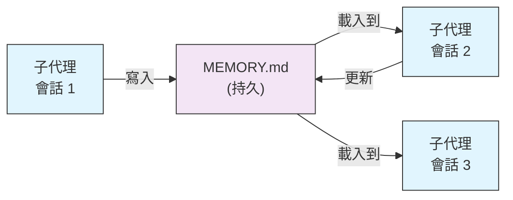
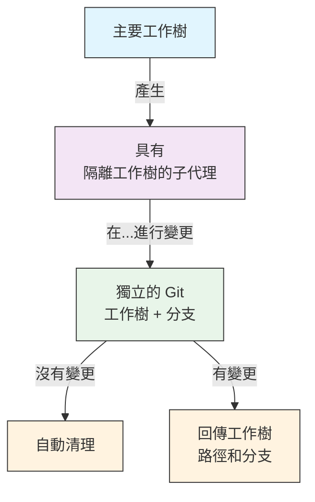
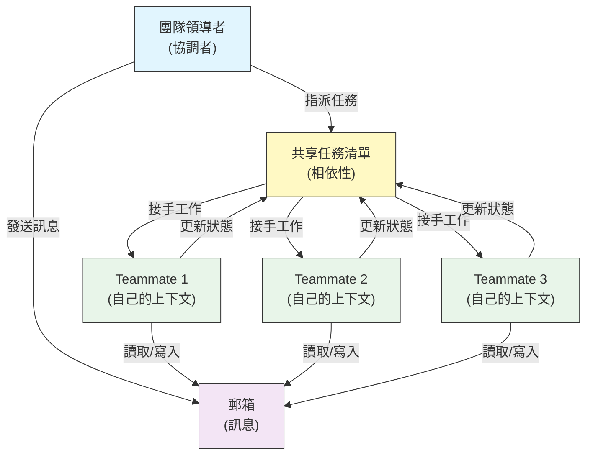
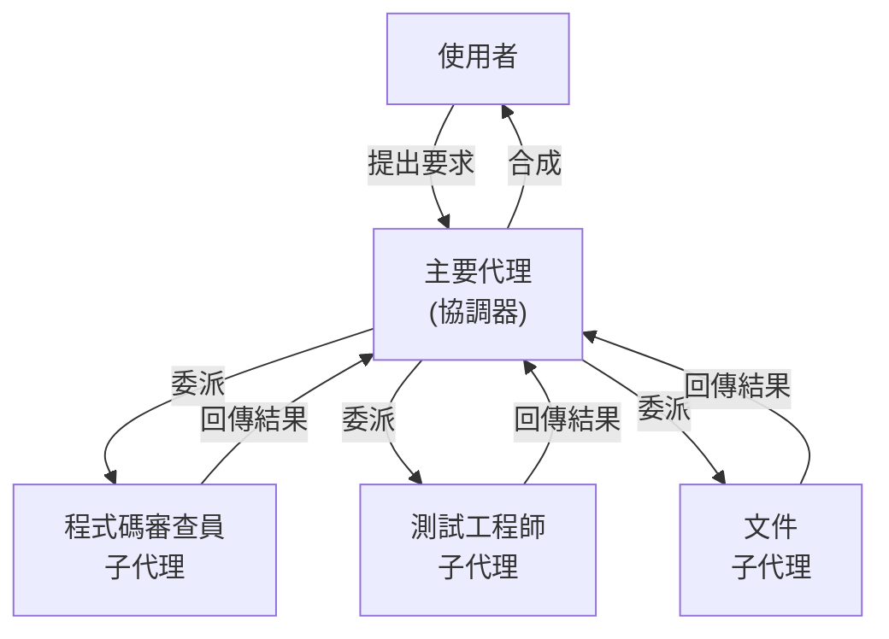
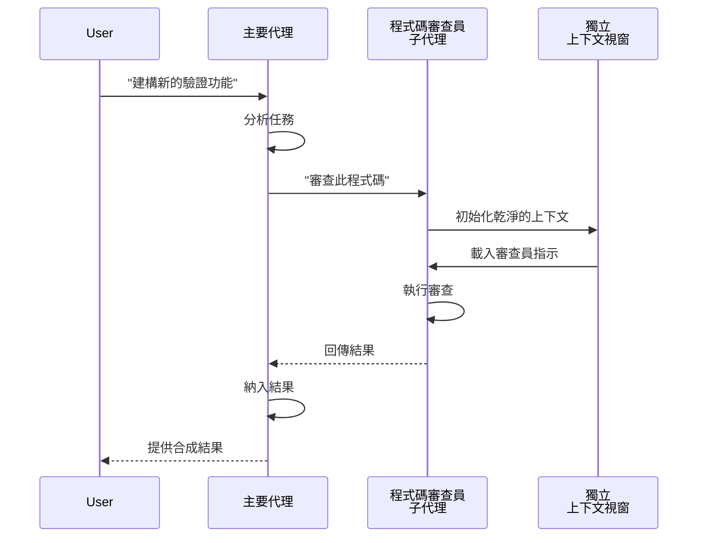
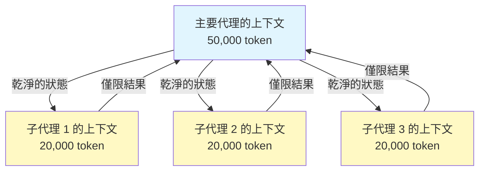
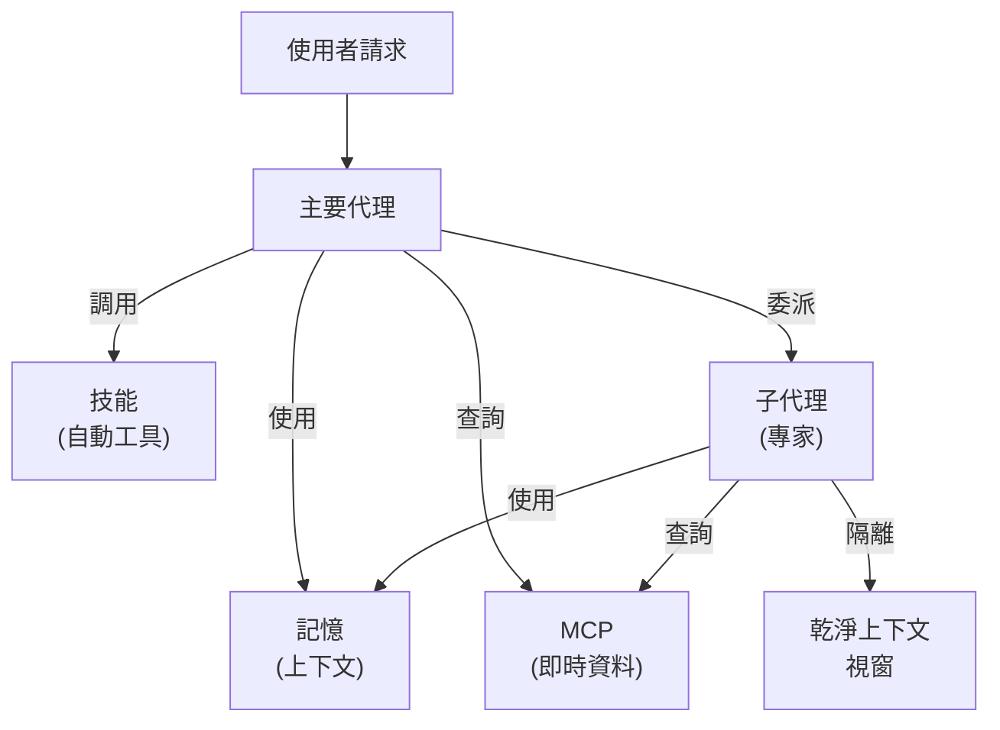

# 子代理 - 完整參考指南

子代理是 Claude Code 可以委派任務的專業 AI 助理。每個子代理都有特定的用途，使用其自己的上下文視窗，與主要對話分開，並且可以配置特定的工具和自訂系統提示詞。

## 目錄

1. [總覽](#總覽)
2. [主要優勢](#主要優勢)
3. [檔案位置](#檔案位置)
4. [配置](#配置)
5. [內建子代理](#內建子代理)
6. [管理子代理](#管理子代理)
7. [使用子代理](#使用子代理)
8. [可恢復代理](#可恢復代理)
9. [鏈接子代理](#鏈接子代理)
10. [子代理的持久記憶](#子代理的持久記憶)
11. [背景子代理](#背景子代理)
12. [工作樹隔離](#工作樹隔離)
13. [限制可生成子代理](#限制可生成子代理)
14. [`claude agents` CLI 命令](#claude-agents-cli-command)
15. [代理團隊 (實驗性)](#agent-teams-experimental)
16. [外掛子代理安全性](#plugin-subagent-security)
17. [架構](#architecture)
18. [上下文管理](#context-management)
19. [何時使用子代理](#when-to-use-subagents)
20. [最佳實務](#best-practices)
21. [此資料夾中的範例子代理](#example-subagents-in-this-folder)
22. [安裝說明](#installation-instructions)
23. [相關概念](#related-concepts)

---

## 總覽

子代理 (Subagents) 能夠在 Claude Code 中委派任務執行，透過：

- 建立 **獨立的 AI 助理**，擁有各自的上下文視窗
- 提供 **客製化的系統提示詞**，以專門的專業知識
- 強制 **工具存取控制**，以限制功能
- 避免 **上下文污染** 由複雜任務造成
- 支援 **平行執行** 數個專門任務

每個子代理獨立運作，擁有乾淨的狀態，僅接收執行其任務所需的特定上下文，然後將結果回傳給主要代理進行合成。

**快速入門**: 使用 `/agents` 斜線命令來建立、檢視、編輯和管理您的子代理。

---

## 關鍵優勢

| 優勢 | 描述 |
|---------|-------------|
| **上下文保留** | 在獨立上下文中運作，避免污染主要對話 |
| **專門的專業知識** | 針對特定領域進行微調，成功率更高 |
| **可重用性** | 可以在不同的專案中使用，並與團隊分享 |
| **靈活的權限** | 針對不同類型的子代理，設定不同的工具存取層級 |
| **可擴展性** | 複数の代理程式同時處理不同的方面 |

---

## 檔案位置

子代理檔案可以儲存在多個位置，具有不同的範圍：

| 優先順序 | 類型 | 位置 | 範圍 |
|----------|------|----------|-------|
| 1 (最高) | **CLI 定義** | 透過 `--agents` 標記 (JSON) | 會話僅限 |
| 2 | **專案子代理** | `.claude/agents/` | 目前專案 |
| 3 | **使用者子代理** | `~/.claude/agents/` | 所有專案 |
| 4 (最低) | **外掛子代理** | 外掛的 `agents/` 目錄 | 透過外掛 |

當存在重複的名稱時，優先順序較高的來源將優先採用。

## 配置

### 檔案格式

子代理定義在 YAML 前置資料（frontmatter）後，接著使用 Markdown 格式的系統提示詞：

```yaml
---
name: your-sub-agent-name
description: 描述這個子代理應該何時被觸發
tools: tool1, tool2, tool3  # 可選 - 遺漏時會繼承所有工具
disallowedTools: tool4  # 可選 - 明確禁止使用的工具
model: sonnet  # 可選 - sonnet、opus、haiku，或繼承
permissionMode: default  # 可選 - 權限模式
maxTurns: 20  # 可選 - 限制代理的輪數
skills: skill1, skill2  # 可選 - 預先載入到上下文中的技能
mcpServers: server1  # 可選 - 可用的 MCP 伺服器
memory: user  # 可選 - 持續記憶體的範圍 (user、project、local)
background: false  # 可選 - 作為背景任務執行
effort: high  # 可選 - 思考的努力程度 (low、medium、high、max)
isolation: worktree  # 可選 - git 工作樹隔離
initialPrompt: "Start by analyzing the codebase"  # 可選 - 自動提交的第一輪
hooks:  # 可選 - 元件範圍的鉤子
  PreToolUse:
    - matcher: "Bash"
      hooks:
        - type: command
          command: "./scripts/security-check.sh"
---

您的子代理的系統提示詞放在這裡。這可以包含多個段落，並且應該清楚地定義子代理的角色、能力以及解決問題的方法。
```

### 配置欄位

| 欄位 | 必填 | 描述 |
|-------|----------|-------------|
| `name` | 是 | 唯一的識別碼（小寫字母和連字符號） |
| `description` | 是 | 自然語言描述目的。包含 "use PROACTIVELY" 以鼓勵自動觸發 |
| `tools` | 否 | 用逗號分隔的特定工具列表。遺漏以繼承所有工具。支援 `Agent(agent_name)` 語法以限制可產生的子代理 |
| `disallowedTools` | 否 | 子代理不能使用的工具列表，用逗號分隔 |
| `model` | 否 | 要使用的模型：`sonnet`、`opus`、`haiku`、完整的模型 ID，或 `inherit`。預設為配置的子代理模型 |
| `permissionMode` | 否 | `default`、`acceptEdits`、`dontAsk`、`bypassPermissions`、`plan` |
| `maxTurns` | 否 | 子代理可以執行的最大輪數 |
| `skills` | 否 | 用逗號分隔的技能列表，用於預先載入。在啟動時將完整的技能內容注入到子代理的上下文中 |
| `mcpServers` | 否 | 可讓子代理使用的 MCP 伺服器 |
| `hooks` | 否 | 元件範圍的鉤子 (PreToolUse, PostToolUse, Stop) |
| `memory` | 否 | 持續記憶體的目錄範圍：`user`、`project` 或 `local` |
| `background` | 否 | 設定為 `true` 以總是將此子代理作為背景任務執行 |
| `effort` | 否 | 思考的努力程度：`low`、`medium`、`high` 或 `max` |
| `isolation` | 否 | 設定為 `worktree` 以給子代理自己的 git 工作樹 |
| `initialPrompt` | 否 | 當子代理作為主要代理運行時，自動提交的第一輪 |

### 工具配置選項

**選項 1：繼承所有工具（省略此欄位）**
```yaml
---
name: full-access-agent
description: Agent with all available tools

---
**選項 2：指定個別工具**
```yaml
---
name: limited-agent
description: 只有特定工具的代理
tools: Read, Grep, Glob, Bash
---
```

**選項 3：條件式工具存取**
```yaml
---
name: conditional-agent
description: 具有過濾工具存取的代理
tools: Read, Bash(npm:*), Bash(test:*)
---
```

### 基於 CLI 的配置

使用 `--agents` 標誌和 JSON 格式定義單一會話的子代理：

```bash
claude --agents '{
  "code-reviewer": {
    "description": "專家程式碼審查員。在程式碼變更後主動使用。",
    "prompt": "您是一位資深程式碼審查員。專注於程式碼品質、安全性及最佳實務。",
    "tools": ["Read", "Grep", "Glob", "Bash"],
    "model": "sonnet"
  }
}'
```

**`--agents` 標誌的 JSON 格式：**

```json
{
  "agent-name": {
    "description": "必要：何時呼叫此代理",
    "prompt": "必要：代理的系統提示詞",
    "tools": ["Optional", "array", "of", "tools"],
    "model": "optional: sonnet|opus|haiku"
  }
}
```

**代理定義的優先順序：**

代理定義以以下優先順序載入（第一匹配優先）：
1. **CLI 定義** - `--agents` 標誌（僅限會話，JSON）
2. **專案級別** - `.claude/agents/` (當前專案)
3. **使用者級別** - `~/.claude/agents/` (所有專案)
4. **外掛程式級別** - 外掛程式的 `agents/` 目錄

這允許 CLI 定義覆寫所有其他來源，僅限單一會話。

---

## 內建子代理

Claude Code 包含幾個內建子代理，這些代理總是可用的：

| 代理 | 模型 | 目的 |
|-------|-------|---------|
| **general-purpose** | 繼承 | 複雜、多步驟任務 |
| **Plan** | 繼承 | 計劃模式下的研究 |
| **Explore** | Haiku | 僅讀程式碼庫探索 (快速/中等/非常徹底) |
| **Bash** | 繼承 | 在獨立上下文中執行終端命令 |
| **statusline-setup** | Sonnet | 配置狀態列 |
| **Claude Code Guide** | Haiku | 回答 Claude Code 功能問題 |

### General-Purpose 子代理

| 屬性 | 值 |
|----------|-------|
| **Model** | 從父系繼承 |
| **Tools** | 所有工具 |
| **Purpose** | 複雜的研究任務、多步驟操作、程式碼修改 |

**使用時機**: 需要同時進行探索和修改，且需要複雜推理的任務。

### Plan 子代理

| 屬性 | 值 |
|----------|-------|
| **Model** | 從父系繼承 |
| **Tools** | Read, Glob, Grep, Bash |
| **Purpose** | 在計劃模式下自動用於研究程式碼庫 |

**使用時機**: 當 Claude 需要在呈現計劃之前理解程式碼庫時。

### Explore 子代理

| 屬性 | 值 |
|----------|-------|
| **Model** | Haiku (快速、低延遲) |
| **Mode** | 嚴格僅讀 |
| **Tools** | Glob, Grep, Read, Bash (僅限僅讀命令) |
| **Purpose** | 快速程式碼庫搜尋和分析 |

**使用時機**: 在搜尋/理解程式碼而無需進行變更時。

**徹底程度等級** - 指定探索的深度：

- **"quick"** - 快速搜尋，探索範圍最小，適合尋找特定模式
- **"medium"** -  moderate 探索，速度和徹底性取得平衡，預設方法
- **"very thorough"** - 跨多個位置和命名慣例進行全面分析，可能需要更長的時間

### Bash 子代理

| Property | Value |
|----------|-------|
| **Model** | 繼承自父代理 |
| **Tools** | Bash |
| **Purpose** | 在獨立的上下文視窗中執行終端命令 |

**使用時機**: 當執行從隔離的上下文受益的 shell 命令時。

### Statusline Setup 子代理

| Property | Value |
|----------|-------|
| **Model** | Sonnet |
| **Tools** | 讀取、寫入、Bash |
| **Purpose** | 設定 Claude Code 狀態列顯示 |

**使用時機**: 當設定或自訂狀態列時。

### Claude Code 指南子代理

| Property | Value |
|----------|-------|
| **Model** | Haiku (快速、低延遲) |
| **Tools** | 唯讀 |
| **Purpose** | 回答關於 Claude Code 功能和使用方式的問題 |

**使用時機**: 當使用者詢問關於 Claude Code 如何運作或如何使用特定功能時。

---

## 管理子代理

### 使用 `/agents` 斜線命令 (推薦)

```bash
/agents
```

這會提供一個互動式選單，用於：
- 檢視所有可用的子代理 (內建、使用者和專案)
- 建立新的子代理，並提供引導式設定
- 編輯現有的自訂子代理和工具存取權
- 刪除自訂子代理
- 檢視當存在重複時哪些子代理處於活動狀態

### 直接檔案管理

```bash
# 建立一個專案子代理
mkdir -p .claude/agents
cat > .claude/agents/test-runner.md << 'EOF'
---
name: test-runner
description: 使用主動方式來執行測試並修正失敗
---

您是一位測試自動化專家。當您看到程式碼變更時，主動
執行適當的測試。如果測試失敗，分析失敗原因並修正
它們，同時保留原始的測試意圖。
EOF

# 建立一個使用者子代理 (在所有專案中都可用)
mkdir -p ~/.claude/agents
```

## 使用子代理

### 自動委派

Claude 會根據以下資訊主動委派任務：

- 您的請求中的任務描述
- 子代理設定中的 `description` 欄位
- 目前的上下文和可用的工具

為了鼓勵主動使用，請在您的 `description` 欄位中包含 "use PROACTIVELY" 或 "MUST BE USED"：

```yaml
---
name: code-reviewer
description: 專家程式碼審查專員。在撰寫或修改程式碼後主動使用。
---
```

### 明確呼叫

您可以明確請求特定的子代理：

```
> 使用 test-runner 子代理來修正失敗的測試
> 讓 code-reviewer 子代理查看我最近的變更
> 請求 debugger 子代理來調查這個錯誤
```

### @-提及呼叫

使用 `@` 前綴來保證呼叫特定的子代理（會繞過自動委派的判斷規則）：

```
> @"code-reviewer (agent)" 審查 auth 模組
```

### 整個會話的代理

使用特定的代理作為主要代理來執行整個會話：

```bash
# 透過 CLI 標記
claude --agent code-reviewer

# 透過 settings.json
{
  "agent": "code-reviewer"
}
```

### 列出可用的代理

使用 `claude agents` 命令來列出所有來源的所有已設定代理：

```bash
claude agents
```

---

## 可恢復的代理

子代理可以繼續先前的對話，完整保留上下文：

```bash
# 初始呼叫
> 使用 code-analyzer 代理來開始審查驗證模組
# 返回 agentId: "abc123"

# 稍後恢復代理
> 恢復代理 abc123 並現在分析授權邏輯
```

**使用案例**:

- 在多個會話中進行長時間研究
- 在不遺失上下文的情況下進行迭代精煉
- 維護上下文的多步驟工作流程

## 連鎖子代理

依序執行多個子代理：

```bash
> 首先使用 code-analyzer 子代理來找出效能問題，
  然後使用 optimizer 子代理來修正它們
```

這使得複雜的工作流程成為可能，其中一個子代理的輸出會輸入到另一個子代理中。

---

## 子代理的持久記憶

`memory` 欄位為子代理提供一個持久的目錄，這個目錄會跨越會話而存續。 這讓子代理能夠隨著時間累積知識，儲存筆記、發現和上下文，這些內容會在會話之間持續存在。

### 記憶範圍

| 範圍 | 目錄 | 使用案例 |
|-------|-----------|----------|
| `user` | `~/.claude/agent-memory/<name>/` | 所有專案的個人筆記和偏好設定 |
| `project` | `.claude/agent-memory/<name>/` | 與團隊共享的專案特定知識 |
| `local` | `.claude/agent-memory-local/<name>/` | 未提交到版本控制的本地專案知識 |

### 運作方式

- 記憶目錄中的 `MEMORY.md` 的前 200 行會自動載入到子代理的系統提示詞中
- `Read`、`Write` 和 `Edit` 工具會自動為子代理啟用，以便管理其記憶檔案
- 子代理可以根據需要在其記憶目錄中建立額外的檔案

### 範例配置

```yaml
---
name: researcher
memory: user
---

您是一位研究助理。 使用您的記憶目錄來儲存發現結果、追蹤跨會話的進度，並隨著時間累積知識。

在每個會話的開始時檢查您的 MEMORY.md 檔案，以回想先前的上下文。
```



## 背景子代理

子代理可以在背景中執行，釋放主對話以進行其他任務。

### 配置

將 `background: true` 設定在 frontmatter 中，以確保子代理始終作為背景任務執行：

```yaml
---
name: long-runner
background: true
description: 在背景中執行長時間分析任務
---
```

### 快捷鍵

| 快捷鍵 | 動作 |
|----------|--------|
| `Ctrl+B` | 將目前正在執行的子代理任務置於背景 |
| `Ctrl+F` | 終止所有背景代理 (需要按兩次以確認) |

### 停用背景任務

設定環境變數以完全停用背景任務支援：

```bash
export CLAUDE_CODE_DISABLE_BACKGROUND_TASKS=1
```

---

## 工作樹隔離

`isolation: worktree` 設定會為子代理提供其自己的 git 工作樹，使其能夠獨立地進行變更，而不會影響主要工作樹。

### 配置

```yaml
---
name: feature-builder
isolation: worktree
description: 在隔離的 git 工作樹中實作功能
tools: Read, Write, Edit, Bash, Grep, Glob
---
```

### 運作方式



- 子代理在其自己的 git 工作樹的獨立分支中運作
- 如果子代理沒有進行任何變更，工作樹將會自動清理
- 如果有變更，工作樹路徑和分支名稱會回傳給主要代理以供審查或合併

## 限制可產生子代理

你可以透過在 `tools` 欄位中使用 `Agent(agent_type)` 語法來控制給定的子代理可以產生的子代理。這提供了一種允許特定子代理委派的方式。

> **注意**: 在 v2.1.63 中，`Task` 工具被重新命名為 `Agent`。現有的 `Task(...)` 參考仍然作為別名運作。

### 範例

```yaml
---
name: coordinator
description: 協調專業代理之間的作業
tools: Agent(worker, researcher), Read, Bash
---

你是一個協調代理。你可以將作業委派給 "worker" 和
"researcher" 子代理。使用 Read 和 Bash 進行自己的探索。
```

在此範例中，`coordinator` 子代理只能產生 `worker` 和 `researcher` 子代理。即使它們在其他地方定義，它都不能產生任何其他子代理。

---

## `claude agents` CLI 命令

`claude agents` 命令列出所有配置的代理，依來源分組（內建、使用者層級、專案層級）：

```bash
claude agents
```

此命令：
- 顯示所有來源的所有可用代理
- 依其來源位置分組代理
- 指示 **覆寫**，當較高優先級的代理遮蔽較低優先級的代理時（例如，與使用者層級代理同名的專案層級代理）

---

## 代理團隊（實驗性）

代理團隊協調多個 Claude Code 實例共同完成複雜的任務。與子代理（委派子任務並傳回結果）不同，團隊成員獨立運作，擁有自己的上下文視窗，並且可以透過共享郵箱系統直接相互發送訊息。

> **官方文件**: [code.claude.com/docs/en/agent-teams](https://code.claude.com/docs/en/agent-teams)

> **注意**: 代理團隊是實驗性的，預設停用。需要 Claude Code v2.1.32+。在使用前啟用它。

### 子代理與代理團隊

| 方面 | 子代理 | 代理團隊 |
|--------|-----------|-------------|
| **委派模型** | 父代理委派子任務，等待結果 | 團隊負責人協調作業，團隊成員獨立執行 |
| **上下文** | 每次子任務的新上下文，結果提煉回 | 每個團隊成員維護自己的持久上下文視窗 |
| **協調** | 順序或並行，由父代理管理 | 具有自動依賴管理功能的共享任務清單 |
| **通訊** | 僅將結果傳回父代理（無代理間訊息傳送） | 團隊成員可以透過郵箱直接相互發送訊息 |
| **工作階段恢復** | 支援 | 不支援內部團隊成員的工作階段恢復 |
| **適用於** | 專注、明確定義的子任務 | 需要代理間通訊和並行執行的複雜工作 |

### 啟用代理團隊

設定環境變數或將其新增到您的 `settings.json`：

```bash
export CLAUDE_CODE_EXPERIMENTAL_AGENT_TEAMS=1
```

或在 `settings.json` 中：

```json
{
  "env": {
    "CLAUDE_CODE_EXPERIMENTAL_AGENT_TEAMS": "1"
  }
}
```

## 建立驗證模組

使用團隊來完成這項任務 — 一位負責 API 端點，一位負責資料庫模式，一位負責測試套件。

Claude 將會建立團隊、指派任務，並自動協調工作。

### 顯示模式

控制 teammate 活動的顯示方式：

| 模式 | 旗標 | 說明 |
|------|------|-------------|
| **自動** | `--teammate-mode auto` | 自動選擇最適合您的終端機的顯示模式 |
| **In-process** (預設) | `--teammate-mode in-process` | 在目前終端機中內嵌顯示 teammate 的輸出 |
| **Split-panes** | `--teammate-mode tmux` | 在單獨的 tmux 或 iTerm2 窗格中開啟每個 teammate |

```bash
claude --teammate-mode tmux
```

您也可以在 `settings.json` 中設定顯示模式：

```json
{
  "teammateMode": "tmux"
}
```

> **注意**: Split-pane 模式需要 tmux 或 iTerm2。 它在 VS Code 終端機、Windows 終端機或 Ghostty 中不可用。

### 導航

在 split-pane 模式下，使用 `Shift+Down` 鍵來在 teammates 之間切換。

### 團隊設定

團隊設定儲存在 `~/.claude/teams/{team-name}/config.json`。

### 架構



**主要元件**:

- **團隊領導者**: 主要的 Claude Code 會話，用於建立團隊、指派任務和協調
- **共享任務清單**: 具有自動相依性追蹤的同步任務清單
- **郵箱**: teammate 之間進行通訊的跨代理訊息系統，用於狀態通訊和協調
- **Teammates**: 每個 teammate 都有自己上下文的獨立 Claude Code 實例

### 任務指派和訊息

團隊領導者將工作分解成任務並指派給 teammate。 共享任務清單處理：

- **自動相依性管理** — 任務會等待其相依性完成
- **狀態追蹤** — teammate 在工作時更新任務狀態
- **跨代理訊息** — teammate 透過郵箱發送訊息以進行協調（例如，「資料庫模式已準備好，您可以開始撰寫查詢」）

### 計劃批准工作流程

對於複雜的任務，團隊領導者會在 teammate 開始工作之前建立一個執行計劃。 用戶審閱並批准計劃，以確保團隊的方法符合期望，在進行任何程式碼變更之前。

### 團隊的鉤子事件

Agent Teams 引入了兩個額外的 [鉤子事件](../06-hooks/)：

| 事件 | 觸發時機 | 使用案例 |
|-------|-----------|----------|
| `TeammateIdle` | 一位團隊成員完成其目前的工作且沒有待辦事項 | 觸發通知，指派後續任務 |
| `TaskCompleted` | 共享任務清單中的任務被標記為完成 | 執行驗證，更新儀表板，串聯相依工作 |

### 最佳實踐

- **團隊規模**: 為了獲得最佳協調，請將團隊保持在 3-5 名團隊成員
- **任務大小**: 將工作分解為每個任務花費 5-15 分鐘的任務——足以並行，但有意義
- **避免檔案衝突**: 將不同的檔案或目錄指派給不同的團隊成員，以避免合併衝突
- **從小開始**: 對於您的第一個團隊，請使用內置模式；在您感到舒適後再切換到分割視窗
- **清晰的任務描述**: 提供具體且可執行的任務描述，以便團隊成員可以獨立工作

### 限制

- **實驗性**: 功能行為可能在未來版本中發生變化
- **無法恢復會話**: 內置團隊成員無法在會話結束後恢復
- **每個會話一個團隊**: 不能創建巢狀團隊或在單個會話中創建多個團隊
- **固定的領導**: 團隊領導角色不能轉移給團隊成員
- **分割視窗限制**: 需要 tmux/iTerm2；無法在 VS Code 終端機、Windows 終端機或 Ghostty 中使用
- **無法跨會話的團隊**: 團隊成員僅存在於目前的會話中

> **警告**: Agent Teams 處於實驗階段。 首次使用非關鍵工作進行測試，並監控團隊成員協調以尋找任何意外行為。

## 外掛子代理安全性

外掛提供的子代理具有受限的前置處理功能，以確保安全性。以下欄位**不允許**在子代理定義中使用：

- `hooks` - 無法定義生命週期鉤子
- `mcpServers` - 無法配置 MCP 伺服器
- `permissionMode` - 無法覆寫權限設定

這有助於防止外掛提升權限或透過子代理鉤子執行任意命令。

---

## 架構

### 高階架構



### 子代理生命週期



---

## 上下文管理



### 關鍵重點

- 每個子代理獲得一個 **全新的上下文視窗**，沒有主要對話歷史記錄
- 只有 **相關的上下文** 會傳遞給子代理，以執行其特定的任務
- 結果會被 **提煉** 回主要代理
- 這有助於防止在長時間專案中 **上下文 token 耗盡**

### 效能考量

- **上下文效率** - 代理保留主要上下文，可以啟用更長的會話
- **延遲** - 子代理從乾淨的狀態啟動，可能增加收集初始上下文的延遲

### 關鍵行為

- **不允許巢狀產生** - 子代理不能產生其他子代理
- **背景權限** - 背景子代理會自動拒絕任何未事先批准的權限
- **背景執行** - 點選 `Ctrl+B` 將目前執行的任務背景化
- **記錄檔** - 子代理記錄檔儲存在 `~/.claude/projects/{project}/{sessionId}/subagents/agent-{agentId}.jsonl`
- **自動壓縮** - 子代理上下文會在約 95% 的容量下自動壓縮（可以使用 `CLAUDE_AUTOCOMPACT_PCT_OVERRIDE` 環境變數覆寫）

---

## 何時使用子代理

| 情境 | 使用子代理 | 原因 |
|----------|--------------|-----|
| 複雜功能，包含許多步驟 | 是 | 分擔責任，避免上下文污染 |
| 快速程式碼審查 | 否 | 不必要的額外負擔 |
| 平行任務執行 | 是 | 每個子代理擁有自己的上下文 |
| 需要專業領域知識 | 是 | 自訂系統提示詞 |
| 長時間分析 | 是 | 避免主要上下文耗盡 |
| 單一任務 | 否 | 不必要地增加延遲 |

---

## 最佳實務

### 設計原則

**應該：**
- 從 Claude 產生的代理開始 - 使用 Claude 產生初始子代理，然後進行客製化
- 設計專注的子代理 - 單一、明確的職責，而不是讓一個代理做所有事情
- 撰寫詳細的提示詞 - 包含具體的指示、範例和限制
- 限制工具存取權 - 僅授予子代理目的所需的工具
- 版本控制 - 將專案子代理提交到版本控制，以進行團隊協作

**不應該：**
- 建立具有相同角色的重疊子代理
- 給予子代理不必要的工具存取權
- 使用子代理處理簡單的、單步驟任務
- 將多種關注點混雜在一個子代理的提示詞中
- 忘記傳遞必要的上下文

### 系統提示詞最佳實務

1. **明確說明角色**
   ```
   您是一位專注於 [特定領域] 的專家程式碼審查員
   ```

2. **明確定義優先順序**
   ```
   審查優先順序（順序如下）：
   1. 安全問題
   2. 效能問題
   3. 程式碼品質
   ```

3. **明確說明輸出格式**
   ```
   對於每個問題，請提供：嚴重性、類別、位置、描述、修正方法、影響
   ```

4. **包含行動步驟**
   ```
   被喚起時：
   1. 執行 git diff 以查看最近的變更
   2. 專注於修改過的檔案
   3. 立即開始審查
   ```

### 工具存取策略

1. **從限制開始**: 僅使用必要的工具
2. **僅在需要時擴充**: 根據需求增加工具
3. **盡可能使用唯讀模式**: 對於分析代理，使用 Read/Grep
4. **沙盒執行**: 將 Bash 命令限制到特定模式

## 範例子代理 (Subagents) 位於此資料夾

此資料夾包含可立即使用的範例子代理：

### 1. 程式碼審查員 (`code-reviewer.md`)

**目的**: 程式碼品質和可維護性全面分析

**工具**: Read, Grep, Glob, Bash

**專長**:
- 安全漏洞偵測
- 效能優化識別
- 程式碼可維護性評估
- 測試覆蓋率分析

**使用時機**: 當您需要自動化的程式碼審查，並專注於品質和安全性時

---

### 2. 測試工程師 (`test-engineer.md`)

**目的**: 測試策略、覆蓋率分析和自動化測試

**工具**: Read, Write, Bash, Grep

**專長**:
- 單元測試建立
- 整合測試設計
- 邊際案例識別
- 覆蓋率分析 (>80% 目標)

**使用時機**: 當您需要建立全面的測試套件或進行覆蓋率分析時

---

### 3. 文件撰寫者 (`documentation-writer.md`)

**目的**: 技術文件、API 文件和使用者指南

**工具**: Read, Write, Grep

**專長**:
- API 端點文件
- 使用者指南建立
- 架構文件
- 程式碼註解改善

**使用時機**: 當您需要建立或更新專案文件時

---

### 4. 安全審查員 (`secure-reviewer.md`)

**目的**: 專注於安全的程式碼審查，權限最小化

**工具**: Read, Grep

**專長**:
- 安全漏洞偵測
- 驗證/授權問題
- 資料外洩風險
- 注入攻擊識別

**使用時機**: 當您需要安全審核，而不需要修改能力時

---

### 5. 實作代理 (`implementation-agent.md`)

**目的**: 功能開發的完整實作能力

**工具**: Read, Write, Edit, Bash, Grep, Glob

**專長**:
- 功能實作
- 程式碼產生
- 建立和測試執行
- 程式碼庫修改

**使用時機**: 當您需要一個子代理來端到端地實作功能時

---

### 6. 除錯者 (`debugger.md`)

**目的**: 錯誤、測試失敗和意外行為的除錯專家

**工具**: Read, Edit, Bash, Grep, Glob

**專長**:
- 根本原因分析
- 錯誤調查
- 測試失敗解決
- 最小化修正實作

**使用時機**: 當您遇到錯誤、錯誤或意外行為時

---

### 7. 資料科學家 (`data-scientist.md`)

**目的**: SQL 查詢和資料洞見的資料分析專家

**工具**: Bash, Read, Write

**專長**:
- SQL 查詢優化
- BigQuery 運作
- 資料分析和視覺化
- 統計洞見

**使用時機**: 當您需要資料分析、SQL 查詢或 BigQuery 運作時

## 安裝說明

### 方法 1：使用 /agents 指令 (建議)

```bash
/agents
```

然後：
1. 選擇「建立新的代理」
2. 選擇專案層級或使用者層級
3. 詳細描述你的子代理
4. 選擇要授予存取的工具 (或留空以繼承所有)
5. 儲存並使用

### 方法 2：複製到專案

將代理檔案複製到專案的 `.claude/agents/` 目錄：

```bash
# 導航到你的專案
cd /path/to/your/project

# 建立 agents 目錄 (如果不存在)
mkdir -p .claude/agents

# 從此資料夾複製所有代理檔案
cp /path/to/04-subagents/*.md .claude/agents/

# 移除 README (在 .claude/agents 中不需要)
rm .claude/agents/README.md
```

### 方法 3：複製到使用者目錄

對於所有專案都可用的代理：

```bash
# 建立使用者代理目錄
mkdir -p ~/.claude/agents

# 複製代理
cp /path/to/04-subagents/code-reviewer.md ~/.claude/agents/
cp /path/to/04-subagents/debugger.md ~/.claude/agents/
# ... 根據需要複製其他檔案
```

### 驗證

安裝完成後，驗證代理是否被識別：

```bash
/agents
```

您應該看到已安裝的代理與內建代理一起列出。

---

## 檔案結構

```
project/
├── .claude/
│   └── agents/
│       ├── code-reviewer.md
│       ├── test-engineer.md
│       ├── documentation-writer.md
│       ├── secure-reviewer.md
│       ├── implementation-agent.md
│       ├── debugger.md
│       └── data-scientist.md
└── ...
```

---

## 相關概念

### 相關功能

- **[斜線命令](../01-slash-commands/)** - 快速使用者觸發的捷徑
- **[記憶](../02-memory/)** - 持續的跨會話上下文
- **[技能](../03-skills/)** - 可重複使用的自主能力
- **[MCP 協定](../05-mcp/)** - 即時外部資料存取
- **[鉤子](../06-hooks/)** - 基於事件的 shell 命令自動化
- **[外掛](../07-plugins/)** - 封裝的擴充套件

### 與其他功能的比較

| 功能 | 使用者觸發 | 自動觸發 | 持續 | 外部存取 | 隔離上下文 |
|---------|--------------|--------------|-----------|------------------|------------------|
| **斜線命令** | 是 | 否 | 否 | 否 | 否 |
| **子代理** | 是 | 是 | 否 | 否 | 是 |
| **記憶** | 自動 | 自動 | 是 | 否 | 否 |
| **MCP** | 自動 | 是 | 否 | 是 | 否 |
| **技能** | 是 | 是 | 否 | 否 | 否 |

### 整合模式



## 額外資源

- [官方子代理文件](https://code.claude.com/docs/en/sub-agents)
- [CLI 參考](https://code.claude.com/docs/en/cli-reference) - `--agents` 參數和其他 CLI 選項
- [外掛指南](../07-plugins/) - 搭配其他功能打包代理
- [技能指南](../03-skills/) - 針對自動觸發的技能
- [記憶指南](../02-memory/) - 針對持續的上下文
- [鉤子指南](../06-hooks/) - 針對事件驅動的自動化

---
**上次更新**: 2026 年 4 月 11 日
**Claude Code 版本**: 2.1.101
**來源**:
- https://code.claude.com/docs/en/sub-agents
- https://code.claude.com/docs/en/agent-teams
**相容模型**: Claude Sonnet 4.6, Claude Opus 4.6, Claude Haiku 4.5
