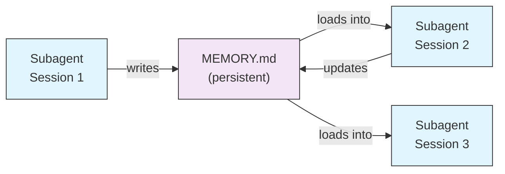
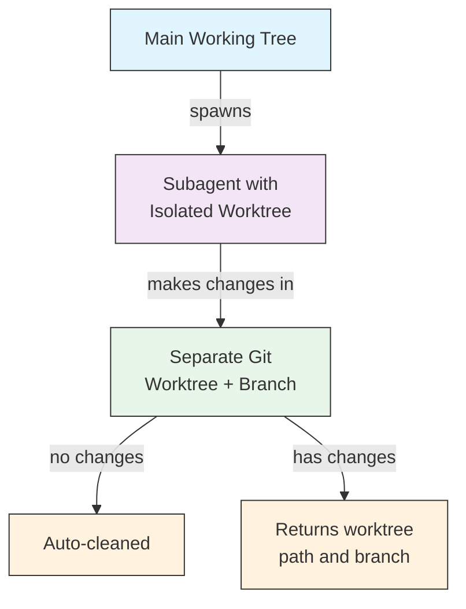
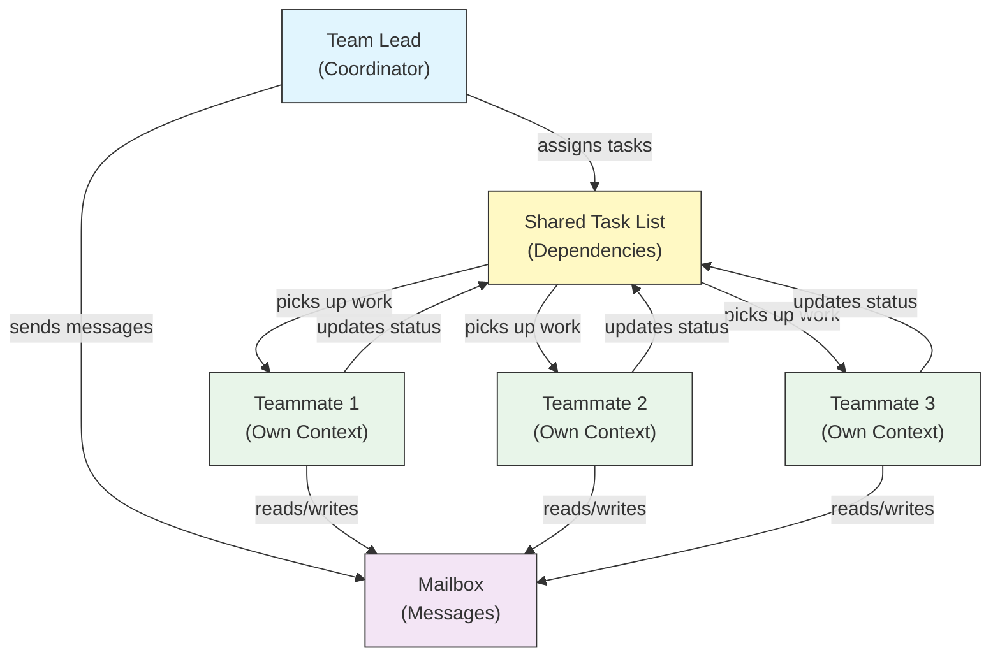
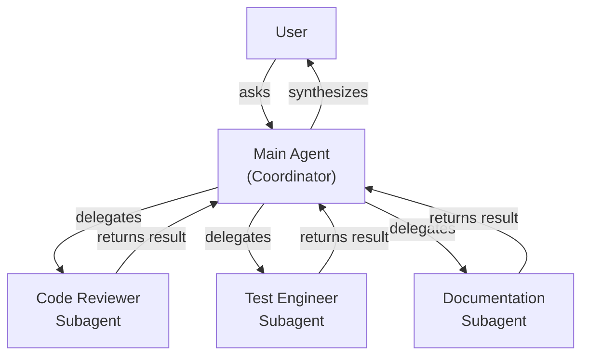
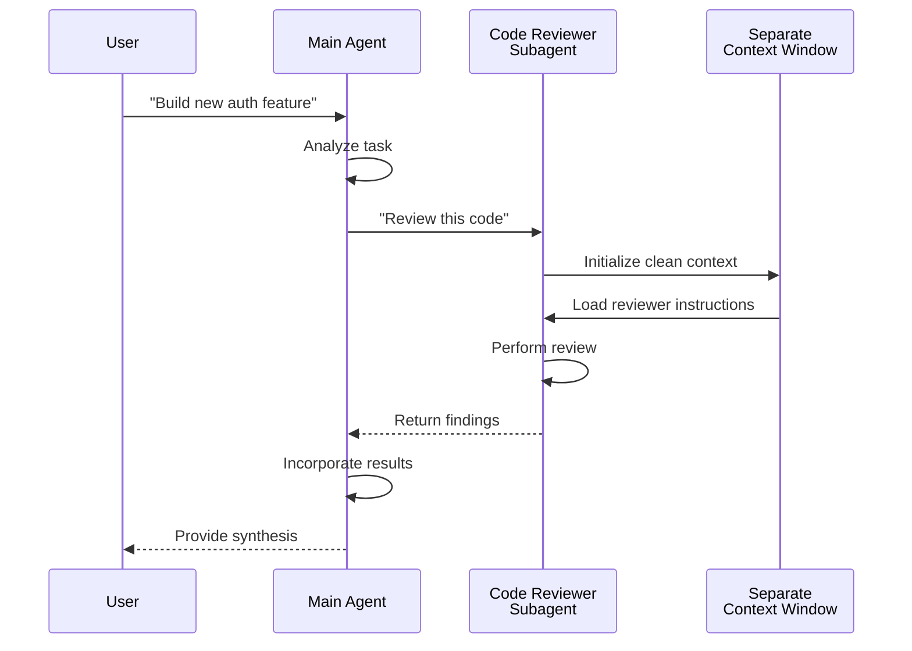
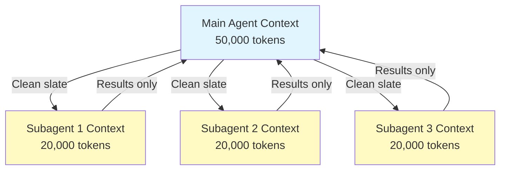
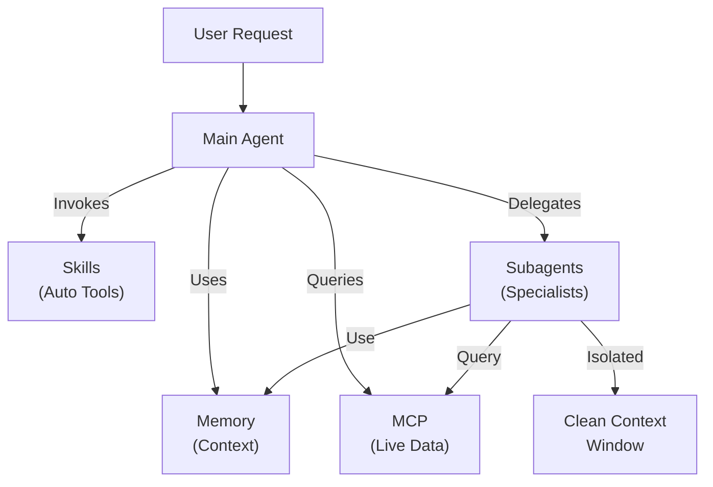

<picture>
  <source media="(prefers-color-scheme: dark)" srcset="../resources/logos/claude-howto-logo-dark.svg">
  
</picture>

# Subagents - 完整參考指南

Subagents 是 Claude Code 可以委派任務的專業 AI 助理。每個 subagent 都有特定的用途，使用與主對話分離的上下文視窗，並可配置特定的工具和自訂系統提示詞。

## 目錄

1. [概覽](#概覽)
2. [主要優勢](#主要優勢)
3. [檔案位置](#檔案位置)
4. [設定](#設定)
5. [內建 Subagents](#內建-subagents)
6. [管理 Subagents](#管理-subagents)
7. [使用 Subagents](#使用-subagents)
8. [可恢復代理](#可恢復代理)
9. [串連 Subagents](#串連-subagents)
10. [Subagents 的持久記憶](#subagents-的持久記憶)
11. [背景 Subagents](#背景-subagents)
12. [Worktree 隔離](#worktree-隔離)
13. [限制可產生的 Subagents](#限制可產生的-subagents)
14. [`claude agents` CLI 命令](#claude-agents-cli-命令)
15. [Agent Teams（實驗性）](#agent-teams實驗性)
16. [外掛 Subagent 安全性](#外掛-subagent-安全性)
17. [架構](#架構)
18. [上下文管理](#上下文管理)
19. [何時使用 Subagents](#何時使用-subagents)
20. [最佳實踐](#最佳實踐)
21. [此資料夾中的範例 Subagents](#此資料夾中的範例-subagents)
22. [安裝說明](#安裝說明)
23. [相關概念](#相關概念)

---

## 概覽

Subagents 透過以下方式在 Claude Code 中實現委派任務執行：

- 建立具有獨立上下文視窗的**隔離 AI 助理**
- 提供**自訂系統提示詞**以獲得專業化知識
- 強制執行**工具存取控制**以限制功能
- 防止複雜任務造成的**上下文污染**
- 啟用多個專業化任務的**平行執行**

每個 subagent 以乾淨的狀態獨立運作，僅接收其任務所需的特定上下文，然後將結果返回給主代理進行綜合。

**快速開始**：使用 `/agents` 命令來互動式地建立、檢視、編輯和管理你的 subagents。

---

## 主要優勢

| 優勢 | 說明 |
|---------|-------------|
| **上下文保持** | 在獨立上下文中運作，防止主對話污染 |
| **專業化知識** | 為特定領域微調，成功率更高 |
| **可重用性** | 在不同專案間使用並與團隊分享 |
| **靈活的權限** | 不同 subagent 類型有不同的工具存取級別 |
| **可擴展性** | 多個代理同時處理不同面向 |

---

## 檔案位置

Subagent 檔案可以儲存在多個位置，具有不同的範圍：

| 優先順序 | 類型 | 位置 | 範圍 |
|----------|------|----------|-------|
| 1（最高） | **CLI 定義** | 透過 `--agents` 旗標（JSON） | 僅限當次 session |
| 2 | **專案 subagents** | `.claude/agents/` | 目前專案 |
| 3 | **使用者 subagents** | `~/.claude/agents/` | 所有專案 |
| 4（最低） | **外掛代理** | 外掛 `agents/` 目錄 | 透過外掛 |

當存在重複名稱時，較高優先順序的來源優先。

---

## 設定

### 檔案格式

Subagents 在 YAML frontmatter 中定義，後接 markdown 格式的系統提示詞：

```yaml
---
name: your-sub-agent-name
description: Description of when this subagent should be invoked
tools: tool1, tool2, tool3  # Optional - inherits all tools if omitted
disallowedTools: tool4  # Optional - explicitly disallowed tools
model: sonnet  # Optional - sonnet, opus, haiku, or inherit
permissionMode: default  # Optional - permission mode
maxTurns: 20  # Optional - limit agentic turns
skills: skill1, skill2  # Optional - skills to preload into context
mcpServers: server1  # Optional - MCP servers to make available
memory: user  # Optional - persistent memory scope (user, project, local)
background: false  # Optional - run as background task
effort: high  # Optional - reasoning effort (low, medium, high, max)
isolation: worktree  # Optional - git worktree isolation
initialPrompt: "Start by analyzing the codebase"  # Optional - auto-submitted first turn
hooks:  # Optional - component-scoped hooks
  PreToolUse:
    - matcher: "Bash"
      hooks:
        - type: command
          command: "./scripts/security-check.sh"
---

Your subagent's system prompt goes here. This can be multiple paragraphs
and should clearly define the subagent's role, capabilities, and approach
to solving problems.
```

### 設定欄位

| 欄位 | 必要 | 說明 |
|-------|----------|-------------|
| `name` | 是 | 唯一識別碼（小寫字母和連字符） |
| `description` | 是 | 用途的自然語言描述。包含 "use PROACTIVELY" 以鼓勵自動呼叫 |
| `tools` | 否 | 以逗號分隔的特定工具列表。省略則繼承所有工具。支援 `Agent(agent_name)` 語法以限制可產生的 subagents |
| `disallowedTools` | 否 | 以逗號分隔的 subagent 不得使用的工具列表 |
| `model` | 否 | 使用的模型：`sonnet`、`opus`、`haiku`、完整模型 ID 或 `inherit`。預設為設定的 subagent 模型 |
| `permissionMode` | 否 | `default`、`acceptEdits`、`dontAsk`、`bypassPermissions`、`plan` |
| `maxTurns` | 否 | subagent 可執行的最大代理輪次數 |
| `skills` | 否 | 以逗號分隔的要預載的 skills 列表。將完整 skill 內容注入 subagent 的啟動上下文中 |
| `mcpServers` | 否 | 提供給 subagent 使用的 MCP 伺服器 |
| `hooks` | 否 | 元件範圍的 hooks（PreToolUse、PostToolUse、Stop） |
| `memory` | 否 | 持久記憶目錄範圍：`user`、`project` 或 `local` |
| `background` | 否 | 設為 `true` 以始終將此 subagent 作為背景任務執行 |
| `effort` | 否 | 推理努力級別：`low`、`medium`、`high` 或 `max` |
| `isolation` | 否 | 設為 `worktree` 以給 subagent 自己的 git worktree |
| `initialPrompt` | 否 | 當 subagent 作為主代理執行時自動提交的第一輪 |

### 工具設定選項

**選項 1：繼承所有工具（省略欄位）**
```yaml
---
name: full-access-agent
description: Agent with all available tools
---
```

**選項 2：指定個別工具**
```yaml
---
name: limited-agent
description: Agent with specific tools only
tools: Read, Grep, Glob, Bash
---
```

**選項 3：條件式工具存取**
```yaml
---
name: conditional-agent
description: Agent with filtered tool access
tools: Read, Bash(npm:*), Bash(test:*)
---
```

### 基於 CLI 的設定

使用 `--agents` 旗標以 JSON 格式定義單次 session 的 subagents：

```bash
claude --agents '{
  "code-reviewer": {
    "description": "Expert code reviewer. Use proactively after code changes.",
    "prompt": "You are a senior code reviewer. Focus on code quality, security, and best practices.",
    "tools": ["Read", "Grep", "Glob", "Bash"],
    "model": "sonnet"
  }
}'
```

**`--agents` 旗標的 JSON 格式：**

```json
{
  "agent-name": {
    "description": "Required: when to invoke this agent",
    "prompt": "Required: system prompt for the agent",
    "tools": ["Optional", "array", "of", "tools"],
    "model": "optional: sonnet|opus|haiku"
  }
}
```

**代理定義的優先順序：**

代理定義按此優先順序載入（第一個匹配的勝出）：
1. **CLI 定義** - `--agents` 旗標（僅限 session，JSON）
2. **專案級** - `.claude/agents/`（目前專案）
3. **使用者級** - `~/.claude/agents/`（所有專案）
4. **外掛級** - 外掛 `agents/` 目錄

這允許 CLI 定義在單次 session 中覆蓋所有其他來源。

---

## 內建 Subagents

Claude Code 包含幾個始終可用的內建 subagents：

| 代理 | 模型 | 用途 |
|-------|-------|---------|
| **general-purpose** | 繼承 | 複雜、多步驟的任務 |
| **Plan** | 繼承 | 計畫模式的研究 |
| **Explore** | Haiku | 唯讀的程式碼庫探索（快速/中等/非常徹底） |
| **Bash** | 繼承 | 在獨立上下文中執行終端命令 |
| **statusline-setup** | Sonnet | 設定狀態列 |
| **Claude Code Guide** | Haiku | 回答 Claude Code 功能問題 |

### General-Purpose Subagent

| 屬性 | 值 |
|----------|-------|
| **模型** | 從父代理繼承 |
| **工具** | 所有工具 |
| **用途** | 複雜的研究任務、多步驟操作、程式碼修改 |

**使用時機**：需要結合探索和修改以及複雜推理的任務。

### Plan Subagent

| 屬性 | 值 |
|----------|-------|
| **模型** | 從父代理繼承 |
| **工具** | Read、Glob、Grep、Bash |
| **用途** | 在計畫模式中自動用於研究程式碼庫 |

**使用時機**：當 Claude 需要在呈現計畫前理解程式碼庫。

### Explore Subagent

| 屬性 | 值 |
|----------|-------|
| **模型** | Haiku（快速、低延遲） |
| **模式** | 嚴格唯讀 |
| **工具** | Glob、Grep、Read、Bash（僅限唯讀命令） |
| **用途** | 快速的程式碼庫搜尋和分析 |

**使用時機**：搜尋/理解程式碼而不進行變更時。

**徹底程度** - 指定探索深度：
- **"quick"** - 快速搜尋，最少探索，適合尋找特定模式
- **"medium"** - 適度探索，平衡速度和徹底性，預設方法
- **"very thorough"** - 跨多個位置和命名慣例的全面分析，可能需要更長時間

### Bash Subagent

| 屬性 | 值 |
|----------|-------|
| **模型** | 從父代理繼承 |
| **工具** | Bash |
| **用途** | 在獨立上下文視窗中執行終端命令 |

**使用時機**：執行受益於隔離上下文的 shell 命令。

### Statusline Setup Subagent

| 屬性 | 值 |
|----------|-------|
| **模型** | Sonnet |
| **工具** | Read、Write、Bash |
| **用途** | 設定 Claude Code 狀態列顯示 |

**使用時機**：設定或自訂狀態列時。

### Claude Code Guide Subagent

| 屬性 | 值 |
|----------|-------|
| **模型** | Haiku（快速、低延遲） |
| **工具** | 唯讀 |
| **用途** | 回答有關 Claude Code 功能和使用方式的問題 |

**使用時機**：使用者詢問 Claude Code 如何運作或如何使用特定功能時。

---

## 管理 Subagents

### 使用 `/agents` 命令（建議）

```bash
/agents
```

這提供互動式選單來：
- 檢視所有可用 subagents（內建、使用者和專案）
- 透過引導設定建立新 subagents
- 編輯現有自訂 subagents 和工具存取
- 刪除自訂 subagents
- 查看存在重複時哪些 subagents 處於活動狀態

### 直接檔案管理

```bash
# Create a project subagent
mkdir -p .claude/agents
cat > .claude/agents/test-runner.md << 'EOF'
---
name: test-runner
description: Use proactively to run tests and fix failures
---

You are a test automation expert. When you see code changes, proactively
run the appropriate tests. If tests fail, analyze the failures and fix
them while preserving the original test intent.
EOF

# Create a user subagent (available in all projects)
mkdir -p ~/.claude/agents
```

---

## 使用 Subagents

### 自動委派

Claude 根據以下內容主動委派任務：
- 你的請求中的任務描述
- subagent 設定中的 `description` 欄位
- 目前上下文和可用工具

要鼓勵主動使用，在你的 `description` 欄位中包含 "use PROACTIVELY" 或 "MUST BE USED"：

```yaml
---
name: code-reviewer
description: Expert code review specialist. Use PROACTIVELY after writing or modifying code.
---
```

### 明確呼叫

你可以明確請求特定的 subagent：

```
> Use the test-runner subagent to fix failing tests
> Have the code-reviewer subagent look at my recent changes
> Ask the debugger subagent to investigate this error
```

### @-提及呼叫

使用 `@` 前綴保證特定 subagent 被呼叫（繞過自動委派啟發式）：

```
> @"code-reviewer (agent)" review the auth module
```

### 全 Session 代理

使用特定代理作為主代理執行整個 session：

```bash
# Via CLI flag
claude --agent code-reviewer

# Via settings.json
{
  "agent": "code-reviewer"
}
```

### 列出可用代理

使用 `claude agents` 命令列出來自所有來源的所有已設定代理：

```bash
claude agents
```

---

## 可恢復代理

Subagents 可以繼續之前的對話，完整保留上下文：

```bash
# Initial invocation
> Use the code-analyzer agent to start reviewing the authentication module
# Returns agentId: "abc123"

# Resume the agent later
> Resume agent abc123 and now analyze the authorization logic as well
```

**使用案例**：
- 跨多個 session 的長期研究
- 不失去上下文的迭代改進
- 維持上下文的多步驟工作流程

---

## 串連 Subagents

按順序執行多個 subagents：

```bash
> First use the code-analyzer subagent to find performance issues,
  then use the optimizer subagent to fix them
```

這實現了複雜的工作流程，其中一個 subagent 的輸出作為另一個的輸入。

---

## Subagents 的持久記憶

`memory` 欄位為 subagents 提供跨對話存留的持久目錄。這允許 subagents 隨著時間累積知識，儲存在 session 間持久保存的筆記、發現和上下文。

### 記憶範圍

| 範圍 | 目錄 | 使用案例 |
|-------|-----------|----------|
| `user` | `~/.claude/agent-memory/<name>/` | 跨所有專案的個人筆記和偏好 |
| `project` | `.claude/agent-memory/<name>/` | 與團隊共享的專案特定知識 |
| `local` | `.claude/agent-memory-local/<name>/` | 不提交到版本控制的本地專案知識 |

### 運作方式

- 記憶目錄中 `MEMORY.md` 的前 200 行會自動載入到 subagent 的系統提示詞中
- `Read`、`Write` 和 `Edit` 工具會自動啟用，讓 subagent 管理其記憶檔案
- subagent 可以根據需要在其記憶目錄中建立額外檔案

### 設定範例

```yaml
---
name: researcher
memory: user
---

You are a research assistant. Use your memory directory to store findings,
track progress across sessions, and build up knowledge over time.

Check your MEMORY.md file at the start of each session to recall previous context.
```



---

## 背景 Subagents

Subagents 可以在背景執行，釋放主對話進行其他任務。

### 設定

在 frontmatter 中設定 `background: true` 以始終將 subagent 作為背景任務執行：

```yaml
---
name: long-runner
background: true
description: Performs long-running analysis tasks in the background
---
```

### 鍵盤快捷鍵

| 快捷鍵 | 動作 |
|----------|--------|
| `Ctrl+B` | 將目前執行的 subagent 任務放到背景 |
| `Ctrl+F` | 終止所有背景代理（按兩次確認） |

### 停用背景任務

設定環境變數以完全停用背景任務支援：

```bash
export CLAUDE_CODE_DISABLE_BACKGROUND_TASKS=1
```

---

## Worktree 隔離

`isolation: worktree` 設定為 subagent 提供自己的 git worktree，允許它獨立進行變更而不影響主工作樹。

### 設定

```yaml
---
name: feature-builder
isolation: worktree
description: Implements features in an isolated git worktree
tools: Read, Write, Edit, Bash, Grep, Glob
---
```

### 運作方式



- subagent 在自己的 git worktree 上以獨立分支運作
- 如果 subagent 未進行任何變更，worktree 會自動清理
- 如果存在變更，worktree 路徑和分支名稱會返回給主代理以供審查或合併

---

## 限制可產生的 Subagents

你可以透過在 `tools` 欄位中使用 `Agent(agent_type)` 語法來控制給定 subagent 允許產生的 subagents。這提供了一種方式來允許列出特定的 subagents 進行委派。

> **注意**：在 v2.1.63 中，`Task` 工具已重新命名為 `Agent`。現有的 `Task(...)` 引用仍作為別名運作。

### 範例

```yaml
---
name: coordinator
description: Coordinates work between specialized agents
tools: Agent(worker, researcher), Read, Bash
---

You are a coordinator agent. You can delegate work to the "worker" and
"researcher" subagents only. Use Read and Bash for your own exploration.
```

在此範例中，`coordinator` subagent 只能產生 `worker` 和 `researcher` subagents。即使其他 subagents 在其他地方定義，它也不能產生它們。

---

## `claude agents` CLI 命令

`claude agents` 命令列出按來源分組的所有已設定代理（內建、使用者級、專案級）：

```bash
claude agents
```

此命令：
- 顯示來自所有來源的所有可用代理
- 按其來源位置分組代理
- 當較高優先順序級別的代理遮蔽較低級別的同名代理時，標示**覆蓋**（例如，與使用者級代理同名的專案級代理）

---

## Agent Teams（實驗性）

Agent Teams 協調多個 Claude Code 實例共同處理複雜任務。與 subagents（委派子任務並返回結果）不同，teammates 以各自的上下文獨立工作，並透過共享信箱系統直接通訊。

> **注意**：Agent Teams 是實驗性的，需要 Claude Code v2.1.32+。使用前需先啟用。

### Subagents vs Agent Teams

| 面向 | Subagents | Agent Teams |
|--------|-----------|-------------|
| **委派模型** | 父代理委派子任務，等待結果 | 團隊領導分配工作，teammates 獨立執行 |
| **上下文** | 每個子任務新鮮的上下文，結果精煉返回 | 每個 teammate 維持自己的持久上下文 |
| **協調** | 順序或平行，由父代理管理 | 共享任務列表，自動相依性管理 |
| **通訊** | 僅返回值 | 透過信箱的代理間訊息傳遞 |
| **Session 恢復** | 支援 | 行程內 teammates 不支援 |
| **最適用於** | 專注、定義明確的子任務 | 需要平行工作的大型多檔案專案 |

### 啟用 Agent Teams

設定環境變數或新增到你的 `settings.json`：

```bash
export CLAUDE_CODE_EXPERIMENTAL_AGENT_TEAMS=1
```

或在 `settings.json` 中：

```json
{
  "env": {
    "CLAUDE_CODE_EXPERIMENTAL_AGENT_TEAMS": "1"
  }
}
```

### 啟動團隊

啟用後，在你的提示詞中要求 Claude 與 teammates 合作：

```
User: Build the authentication module. Use a team — one teammate for the API endpoints,
      one for the database schema, and one for the test suite.
```

Claude 將自動建立團隊、分配任務和協調工作。

### 顯示模式

控制 teammate 活動的顯示方式：

| 模式 | 旗標 | 說明 |
|------|------|-------------|
| **自動** | `--teammate-mode auto` | 自動為你的終端機選擇最佳顯示模式 |
| **行程內** | `--teammate-mode in-process` | 在目前終端機中內聯顯示 teammate 輸出（預設） |
| **分割面板** | `--teammate-mode tmux` | 在獨立的 tmux 或 iTerm2 面板中開啟每個 teammate |

```bash
claude --teammate-mode tmux
```

你也可以在 `settings.json` 中設定顯示模式：

```json
{
  "teammateMode": "tmux"
}
```

> **注意**：分割面板模式需要 tmux 或 iTerm2。在 VS Code 終端機、Windows Terminal 或 Ghostty 中不可用。

### 導航

在分割面板模式中使用 `Shift+Down` 在 teammates 之間導航。

### 團隊設定

團隊設定儲存在 `~/.claude/teams/{team-name}/config.json`。

### 架構



**關鍵元件**：

- **Team Lead**：建立團隊、分配任務和協調的主要 Claude Code session
- **共享任務列表**：具有自動相依性追蹤的同步化任務列表
- **信箱**：供 teammates 通訊狀態和協調的代理間訊息系統
- **Teammates**：獨立的 Claude Code 實例，各有自己的上下文視窗

### 任務分配和訊息傳遞

Team lead 將工作分解為任務並分配給 teammates。共享任務列表處理：

- **自動相依性管理**——任務等待其相依項目完成
- **狀態追蹤**——teammates 在工作時更新任務狀態
- **代理間訊息傳遞**——teammates 透過信箱發送訊息進行協調（例如「資料庫 schema 已準備好，你可以開始寫查詢了」）

### 計畫審批工作流程

對於複雜任務，team lead 在 teammates 開始工作前建立執行計畫。使用者審查並核准計畫，確保團隊的方法在進行任何程式碼變更前符合預期。

### 團隊的 Hook 事件

Agent Teams 引入了兩個額外的 [hook 事件](../06-hooks/)：

| 事件 | 觸發時機 | 使用案例 |
|-------|-----------|----------|
| `TeammateIdle` | teammate 完成目前任務且無待處理工作 | 觸發通知、分配後續任務 |
| `TaskCompleted` | 共享任務列表中的任務標記為完成 | 執行驗證、更新儀表板、串連相依工作 |

### 最佳實踐

- **團隊規模**：保持 3-5 個 teammates 以獲得最佳協調
- **任務大小**：將工作分解為每個 5-15 分鐘的任務——小到足以平行化，大到足以有意義
- **避免檔案衝突**：將不同的檔案或目錄分配給不同的 teammates 以防止合併衝突
- **從簡單開始**：第一次團隊使用行程內模式；熟悉後再切換到分割面板
- **清晰的任務描述**：提供具體、可操作的任務描述，讓 teammates 可以獨立工作

### 限制

- **實驗性**：功能行為可能在未來版本中變更
- **無 session 恢復**：行程內 teammates 在 session 結束後無法恢復
- **每 session 一個團隊**：不能在單一 session 中建立巢狀團隊或多個團隊
- **固定領導**：team lead 角色不能轉移給 teammate
- **分割面板限制**：需要 tmux/iTerm2；在 VS Code 終端機、Windows Terminal 或 Ghostty 中不可用
- **無跨 session 團隊**：teammates 僅存在於目前 session 中

> **警告**：Agent Teams 是實驗性的。先用非關鍵工作測試，並監控 teammate 協調是否有意外行為。

---

## 外掛 Subagent 安全性

外掛提供的 subagents 出於安全考量，其 frontmatter 功能受到限制。以下欄位在外掛 subagent 定義中**不允許**：

- `hooks` - 不能定義生命週期 hooks
- `mcpServers` - 不能設定 MCP 伺服器
- `permissionMode` - 不能覆蓋權限設定

這防止外掛透過 subagent hooks 提升權限或執行任意命令。

---

## 架構

### 高階架構



### Subagent 生命週期



---

## 上下文管理



### 關鍵要點

- 每個 subagent 獲得一個**新鮮的上下文視窗**，沒有主對話歷史
- 只有**相關的上下文**被傳遞給 subagent 用於其特定任務
- 結果被**精煉**回主代理
- 這防止了長期專案中的**上下文 token 耗盡**

### 效能考量

- **上下文效率** - 代理保留主上下文，實現更長的 session
- **延遲** - Subagents 以乾淨的狀態開始，可能增加收集初始上下文的延遲

### 關鍵行為

- **無巢狀產生** - Subagents 不能產生其他 subagents
- **背景權限** - 背景 subagents 自動拒絕任何未預先核准的權限
- **背景化** - 按 `Ctrl+B` 將目前執行的任務放到背景
- **轉錄記錄** - Subagent 轉錄記錄儲存在 `~/.claude/projects/{project}/{sessionId}/subagents/agent-{agentId}.jsonl`
- **自動壓縮** - Subagent 上下文在約 95% 容量時自動壓縮（使用 `CLAUDE_AUTOCOMPACT_PCT_OVERRIDE` 環境變數覆蓋）

---

## 何時使用 Subagents

| 場景 | 使用 Subagent | 原因 |
|----------|--------------|-----|
| 有很多步驟的複雜功能 | 是 | 分離關注點，防止上下文污染 |
| 快速程式碼審查 | 否 | 不必要的開銷 |
| 平行任務執行 | 是 | 每個 subagent 有自己的上下文 |
| 需要專業化知識 | 是 | 自訂系統提示詞 |
| 長期執行的分析 | 是 | 防止主上下文耗盡 |
| 單一任務 | 否 | 不必要地增加延遲 |

---

## 最佳實踐

### 設計原則

**應該做的：**
- 從 Claude 生成的代理開始 - 用 Claude 生成初始 subagent，然後迭代自訂
- 設計專注的 subagents - 單一、清晰的職責而非一個做所有事
- 撰寫詳細的提示詞 - 包含具體的指令、範例和限制
- 限制工具存取 - 僅授予 subagent 用途所需的工具
- 版本控制 - 將專案 subagents 提交到版本控制以供團隊協作

**不應該做的：**
- 建立職責重疊的 subagents
- 給予 subagents 不必要的工具存取
- 對簡單的單步任務使用 subagents
- 在一個 subagent 的提示詞中混合關注點
- 忘記傳遞必要的上下文

### 系統提示詞最佳實踐

1. **明確指定角色**
   ```
   You are an expert code reviewer specializing in [specific areas]
   ```

2. **清楚定義優先順序**
   ```
   Review priorities (in order):
   1. Security Issues
   2. Performance Problems
   3. Code Quality
   ```

3. **指定輸出格式**
   ```
   For each issue provide: Severity, Category, Location, Description, Fix, Impact
   ```

4. **包含操作步驟**
   ```
   When invoked:
   1. Run git diff to see recent changes
   2. Focus on modified files
   3. Begin review immediately
   ```

### 工具存取策略

1. **從限制開始**：僅以必要工具開始
2. **按需擴展**：在需求要求時才新增工具
3. **盡可能唯讀**：分析代理使用 Read/Grep
4. **沙箱化執行**：限制 Bash 命令到特定模式

---

## 此資料夾中的範例 Subagents

此資料夾包含即用型範例 subagents：

### 1. Code Reviewer（`code-reviewer.md`）

**用途**：全面的程式碼品質和可維護性分析

**工具**：Read、Grep、Glob、Bash

**專長**：
- 安全漏洞偵測
- 效能最佳化識別
- 程式碼可維護性評估
- 測試覆蓋率分析

**使用時機**：你需要專注於品質和安全的自動化程式碼審查

---

### 2. Test Engineer（`test-engineer.md`）

**用途**：測試策略、覆蓋率分析和自動化測試

**工具**：Read、Write、Bash、Grep

**專長**：
- 單元測試建立
- 整合測試設計
- 邊界案例識別
- 覆蓋率分析（>80% 目標）

**使用時機**：你需要全面的測試套件建立或覆蓋率分析

---

### 3. Documentation Writer（`documentation-writer.md`）

**用途**：技術文件、API 文件和使用者指南

**工具**：Read、Write、Grep

**專長**：
- API 端點文件
- 使用者指南建立
- 架構文件
- 程式碼註解改善

**使用時機**：你需要建立或更新專案文件

---

### 4. Secure Reviewer（`secure-reviewer.md`）

**用途**：具有最小權限的安全導向程式碼審查

**工具**：Read、Grep

**專長**：
- 安全漏洞偵測
- 認證/授權問題
- 資料暴露風險
- 注入攻擊識別

**使用時機**：你需要無修改功能的安全稽核

---

### 5. Implementation Agent（`implementation-agent.md`）

**用途**：功能開發的完整實作能力

**工具**：Read、Write、Edit、Bash、Grep、Glob

**專長**：
- 功能實作
- 程式碼生成
- 建構和測試執行
- 程式碼庫修改

**使用時機**：你需要 subagent 端對端實作功能

---

### 6. Debugger（`debugger.md`）

**用途**：針對錯誤、測試失敗和意外行為的除錯專家

**工具**：Read、Edit、Bash、Grep、Glob

**專長**：
- 根本原因分析
- 錯誤調查
- 測試失敗解決
- 最小修復實作

**使用時機**：你遇到 bug、錯誤或意外行為

---

### 7. Data Scientist（`data-scientist.md`）

**用途**：SQL 查詢和資料洞察的資料分析專家

**工具**：Bash、Read、Write

**專長**：
- SQL 查詢最佳化
- BigQuery 操作
- 資料分析和視覺化
- 統計洞察

**使用時機**：你需要資料分析、SQL 查詢或 BigQuery 操作

---

## 安裝說明

### 方法 1：使用 /agents 命令（建議）

```bash
/agents
```

然後：
1. 選擇「Create New Agent」
2. 選擇專案級或使用者級
3. 詳細描述你的 subagent
4. 選擇要授予存取的工具（或留空以繼承所有工具）
5. 儲存並使用

### 方法 2：複製到專案

將代理檔案複製到你的專案的 `.claude/agents/` 目錄：

```bash
# Navigate to your project
cd /path/to/your/project

# Create agents directory if it doesn't exist
mkdir -p .claude/agents

# Copy all agent files from this folder
cp /path/to/04-subagents/*.md .claude/agents/

# Remove the README (not needed in .claude/agents)
rm .claude/agents/README.md
```

### 方法 3：複製到使用者目錄

讓代理在你所有專案中可用：

```bash
# Create user agents directory
mkdir -p ~/.claude/agents

# Copy agents
cp /path/to/04-subagents/code-reviewer.md ~/.claude/agents/
cp /path/to/04-subagents/debugger.md ~/.claude/agents/
# ... copy others as needed
```

### 驗證

安裝後，驗證代理被識別：

```bash
/agents
```

你應該看到你安裝的代理與內建代理一起列出。

---

## 檔案結構

```
project/
├── .claude/
│   └── agents/
│       ├── code-reviewer.md
│       ├── test-engineer.md
│       ├── documentation-writer.md
│       ├── secure-reviewer.md
│       ├── implementation-agent.md
│       ├── debugger.md
│       └── data-scientist.md
└── ...
```

---

## 相關概念

### 相關功能

- **[Slash Commands](../01-slash-commands/)** - 快速的使用者呼叫捷徑
- **[Memory](../02-memory/)** - 持久的跨 session 上下文
- **[Skills](../03-skills/)** - 可重用的自主功能
- **[MCP Protocol](../05-mcp/)** - 即時外部資料存取
- **[Hooks](../06-hooks/)** - 事件驅動的 shell 命令自動化
- **[Plugins](../07-plugins/)** - 綁定的擴展套件

### 與其他功能的比較

| 功能 | 使用者呼叫 | 自動呼叫 | 持久 | 外部存取 | 隔離上下文 |
|---------|--------------|--------------|-----------|------------------|------------------|
| **Slash Commands** | 是 | 否 | 否 | 否 | 否 |
| **Subagents** | 是 | 是 | 否 | 否 | 是 |
| **Memory** | 自動 | 自動 | 是 | 否 | 否 |
| **MCP** | 自動 | 是 | 否 | 是 | 否 |
| **Skills** | 是 | 是 | 否 | 否 | 否 |

### 整合模式



---

## 額外資源

- [官方 Subagents 文件](https://code.claude.com/docs/en/sub-agents)
- [CLI 參考](https://code.claude.com/docs/en/cli-reference) - `--agents` 旗標和其他 CLI 選項
- [Plugins 指南](../07-plugins/) - 將代理與其他功能綁定
- [Skills 指南](../03-skills/) - 自動呼叫的功能
- [Memory 指南](../02-memory/) - 持久的上下文
- [Hooks 指南](../06-hooks/) - 事件驅動自動化

---

*最後更新：2026 年 3 月*

*本指南涵蓋 Claude Code 的完整 subagent 設定、委派模式和最佳實踐。*
