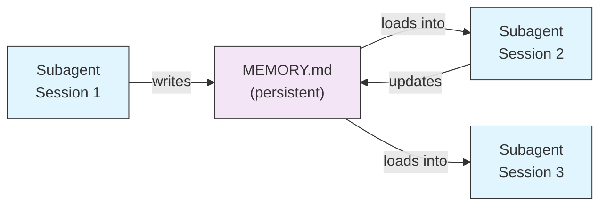
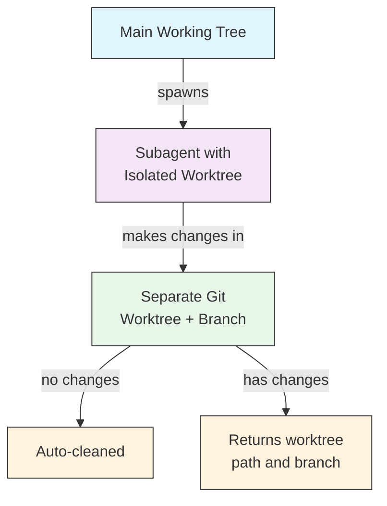
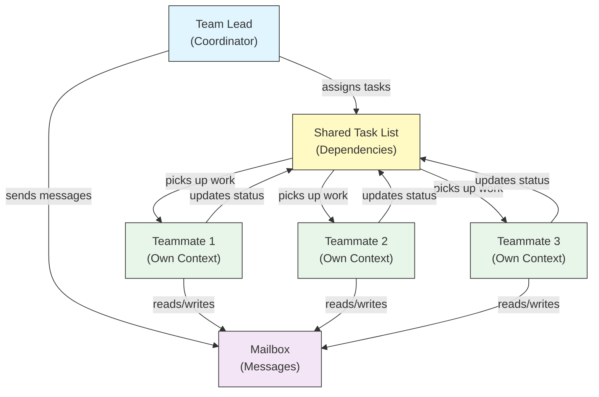
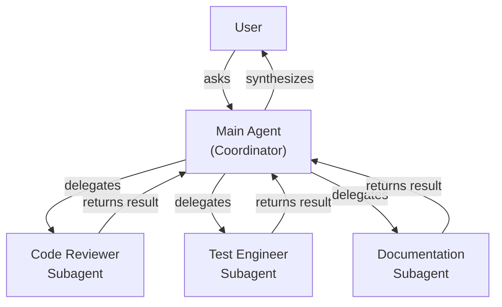
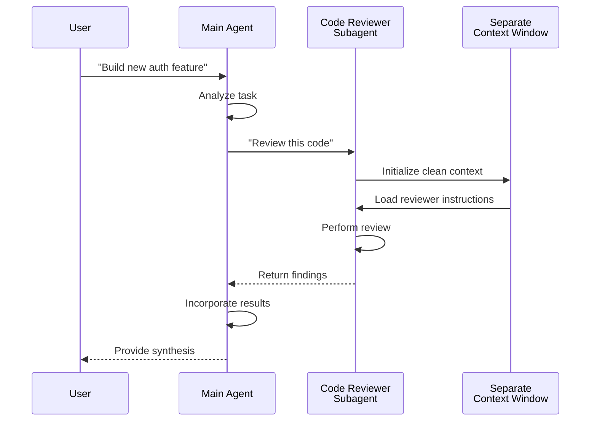
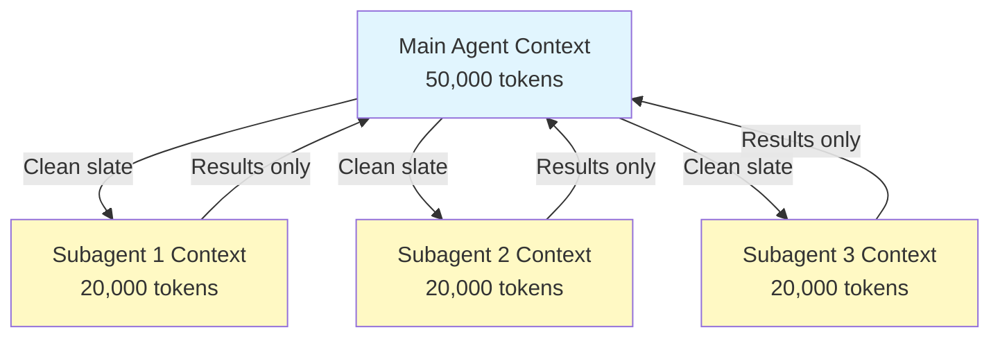
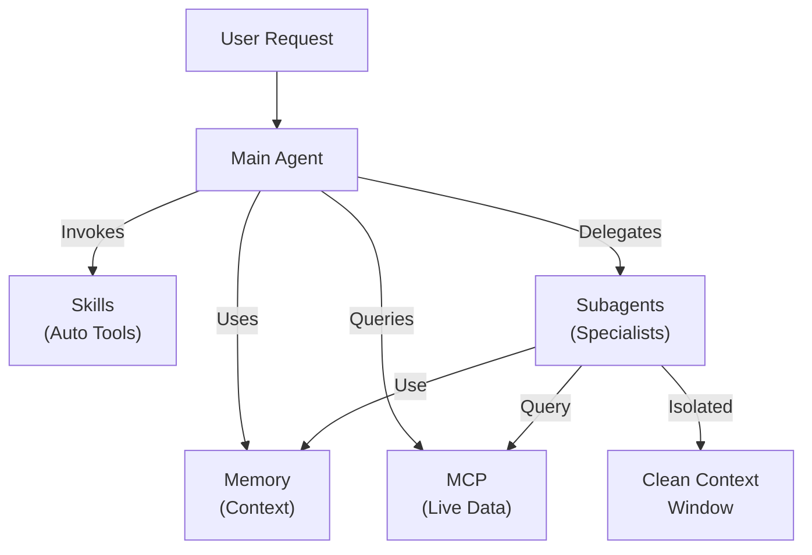

<picture>
  <source media="(prefers-color-scheme: dark)" srcset="../resources/logos/claude-howto-logo-dark.svg">
  
</picture>

# 子代理 - 完整參考指南

Subagents 是 Claude Code 可以委派任務的專業化 AI 助手。每個 subagent 都有特定的用途，使用與主對話分離的獨立上下文視窗，並且可以設定特定的工具與自訂的系統提示詞。

## 目錄

1. [概觀](#概觀)
2. [核心優勢](#核心優勢)
3. [檔案位置](#檔案位置)
4. [設定](#設定)
5. [內建子代理](#內建子代理)
6. [管理 Subagents](#管理-subagents)
7. [使用 Subagents](#使用-subagents)
8. [可續接代理](#可續接代理)
9. [串聯子代理](#串聯子代理)
10. [子代理的持久化記憶](#子代理的持久化記憶)
11. [背景子代理](#背景子代理)
12. [Worktree 隔離](#worktree-隔離)
13. [分叉子代理](#分叉子代理)
14. [限制可生成的子代理](#限制可生成的子代理)
15. [`claude agents` CLI 命令](#claude-agents-cli-命令)
16. [Agent Teams（實驗性功能）](#agent-teams實驗性功能)
17. [Plugin Subagent 安全性](#plugin-subagent-安全性)
18. [架構](#架構)
19. [上下文管理](#上下文管理)
20. [何時使用 Subagents](#何時使用-subagents)
21. [最佳實踐](#最佳實踐)
22. [此資料夾中的範例子代理](#此資料夾中的範例子代理)
23. [安裝說明](#安裝說明)
24. [檔案結構](#檔案結構)
25. [相關概念](#相關概念)
26. [可觀測性](#可觀測性)
27. [其他資源](#其他資源)

---

## 概觀

Subagents 透過以下方式在 Claude Code 中實現委派任務執行：

- 建立具有獨立上下文視窗的**隔離式 AI 助手**
- 提供**客製化的系統提示詞**以獲得專業知識
- 強制執行**工具存取控制**以限制能力範圍
- 防止複雜任務導致的**上下文污染**
- 實現多個專業任務的**並行執行**

每個 subagent 都以乾淨的狀態獨立運作，僅接收執行任務所需的特定上下文，然後將結果回傳給主代理進行整合。

**快速入門**：請 Claude 幫您建立 subagent（「create a subagent that reviews security」），或直接新增 `.claude/agents/<name>.md` 檔案 — 請參閱下方的[管理 Subagents](#管理-subagents)。

> **注意**：自 v2.1.198 起，`/agents` 命令不再開啟互動式建立精靈。請透過詢問 Claude 或直接編輯 `.claude/agents/` 檔案來建立與管理 subagents。

---

## 核心優勢

| 優勢 | 描述 |
|---------|-------------|
| **上下文保留** | 在獨立的上下文中運作，防止污染主對話 |
| **專業知識** | 針對特定領域進行微調，具有更高的成功率 |
| **可重用性** | 可跨不同專案使用並與團隊共享 |
| **靈活的權限** | 為不同類型的 subagent 提供不同的工具存取層級 |
| **可擴展性** | 多個代理可同時處理不同面向的任務 |

---

## 檔案位置

Subagent 檔案可以儲存在具有不同範圍的多個位置：

| 優先順序 | 類型 | 位置 | 範圍 |
|----------|------|----------|-------|
| 1 (最高) | **CLI 定義** | 透過 `--agents` 旗標 (JSON) | 僅限目前工作階段 |
| 2 | **專案 subagents** | `.claude/agents/` | 目前專案 |
| 3 | **使用者 subagents** | `~/.claude/agents/` | 所有專案 |
| 4 (最低) | **外掛代理** | 外掛的 `agents/` 目錄 | 透過外掛使用 |

當存在重複名稱時，優先順序較高的來源將會生效。

> **巢狀 `.claude/` 的優先順序 (v2.1.178)**：當同一個代理名稱定義在多個巢狀的 `.claude/agents/` 目錄中（例如在 monorepo 中各套件擁有自己的 `.claude/` 資料夾），**最接近目前工作目錄的定義會勝出**。相同的「最近者勝」規則也適用於巢狀的 workflow 與 output-style 定義。

---

## 設定

### 檔案格式

Subagents 定義於 YAML frontmatter 中，後接 markdown 格式的系統提示詞：

```yaml
---
name: your-sub-agent-name
description: Description of when this subagent should be invoked
tools: tool1, tool2, tool3  # Optional - inherits all tools if omitted
disallowedTools: tool4  # Optional - explicitly disallowed tools
model: sonnet  # Optional - sonnet, opus, haiku, or inherit
permissionMode: default  # Optional - permission mode
maxTurns: 20  # Optional - limit agentic turns
skills: skill1, skill2  # Optional - skills to preload into context
mcpServers: server1  # Optional - MCP servers to make available
memory: user  # Optional - persistent memory scope (user, project, local)
background: false  # Optional - run as background task
effort: high  # Optional - reasoning effort (low, medium, high, xhigh, max)
isolation: worktree  # Optional - git worktree isolation
initialPrompt: "Start by analyzing the codebase"  # Optional - auto-submitted first turn
experimental:  # Optional - experimental settings block
  cacheTtl: "1h"  # Cache TTL for this subagent: "5m" or "1h" (v2.1.248+)
hooks:  # Optional - component-scoped hooks
  PreToolUse:
    - matcher: "Bash"
      hooks:
        - type: command
          command: "./scripts/security-check.sh"
---

Your subagent's system prompt goes here. This can be multiple paragraphs
and should clearly define the subagent's role, capabilities, and approach
to solving problems.
```

您的 subagent 系統提示詞位於此處。這可以包含多個段落，且應清楚定義 subagent 的角色、能力以及解決問題的方法。

### 設定欄位

| 欄位 | 必要 | 說明 |
|-------|----------|-------------|
| `name` | 是 | 唯一識別碼（小寫字母與連字號）。查找時會正規化（不區分大小寫與分隔符號 — 見下文），但自 v2.1.218 起，含有 `:` 的名稱會**被拒絕**：`:` 保留給外掛命名空間使用 |
| `description` | 是 | 用自然語言描述用途。包含 "use PROACTIVELY" 以鼓勵自動呼叫 |
| `tools` | 否 | 以逗號分隔的特定工具列表。省略則繼承所有工具。支援 `Agent(agent_name)` 語法以限制可產生的 subagents |
| `disallowedTools` | 否 | 以逗號分隔的 subagent 禁止使用的工具列表 |
| `model` | 否 | 使用的模型：`sonnet`、`opus`、`haiku`、完整模型 ID 或 `inherit`。預設為已設定的 subagent 模型 |
| `permissionMode` | 否 | `manual`（於 v2.1.200 由 `default` 重新命名 — 仍接受舊名稱 `default`）、`acceptEdits`、`dontAsk`、`bypassPermissions`、`plan`、`auto`。自 v2.1.212 起，Task 工具的 `mode` 呼叫參數已棄用並會被忽略 — 除非在此處覆寫，否則 subagents 預設繼承父工作階段的權限模式 |
| `maxTurns` | 否 | subagent 可進行的最大代理回合數 |
| `skills` | 否 | 以逗號分隔的預載技能列表。啟動時會將完整的技能內容注入 subagent 的上下文。**v2.1.133+：** subagents 也可透過 Skill 工具探索專案、使用者與外掛技能，與主工作階段使用相同的目錄，不再侷限於自身內嵌的技能集。 |
| `mcpServers` | 否 | 提供給 subagent 使用的 MCP servers |
| `hooks` | 否 | 元件範圍的鉤子 (PreToolUse, PostToolUse, Stop) |
| `memory` | 否 | 持久化記憶目錄範圍：`user`、`project` 或 `local` |
| `background` | 否 | Subagents 預設已在背景執行 (v2.1.198)。設定為 `true` 可*強制*一律在背景執行，並防止以行內方式執行 |
| `effort` | 否 | 推理努力程度：`low`、`medium`、`high`、`xhigh` 或 `max`。會覆寫工作階段的 effort 層級；可用層級取決於模型 |
| `isolation` | 否 | 設定為 `worktree` 以為 subagent 提供獨立的 git worktree |
| `initialPrompt` | 否 | 當 subagent 作為主要代理執行時，自動提交的第一個回合 |
| `color` | 否 | subagent 在任務列表與逐字稿中的顯示顏色。接受 `red`、`blue`、`green`、`yellow`、`purple`、`orange`、`pink` 或 `cyan` |
| `experimental` | 否 | 實驗性設定區塊 (v2.1.248+)。`experimental.cacheTtl` 設定此 subagent 的快取 TTL — `"5m"` 或 `"1h"` |
| `omitClaudeMd` | 否 | 設定為 `true` 可在不載入使用者、專案與本機 CLAUDE.md 檔案的情況下啟動 subagent (v2.1.271+)。受管政策檔案仍會載入（受管 subagents 除外）。當代理透過 `--agent` 或 `agent` 設定作為主工作階段代理執行時會被忽略。`--agents` JSON 中也接受此欄位 |

#### Subagent 模型環境變數

有兩個環境變數會影響 subagent 使用的模型：

| 變數 | 版本 | 說明 |
|----------|---------|-------------|
| `CLAUDE_CODE_SUBAGENT_MODEL` | — | 設定 subagents 使用的模型 |
| `CLAUDE_CODE_SUBAGENT_MODEL_FORCE` | v2.1.257+ | 設定為 `1` 可強制使用 subagent 模型，覆寫 subagent frontmatter 中的 `model:` |

> **v2.1.251 變更了優先順序**：在該版本之前，`CLAUDE_CODE_SUBAGENT_MODEL` 優先，會覆寫代理的 frontmatter — 包括 `model: inherit`。自 v2.1.251 起，subagent 自身的 `model:` frontmatter 勝出。若希望環境變數再次覆寫 frontmatter（例如將整個評估執行固定在單一模型），請設定 `CLAUDE_CODE_SUBAGENT_MODEL_FORCE=1` (v2.1.257+)。

### 主執行緒代理的 Frontmatter 支援 (v2.1.117+/v2.1.119+)

當代理透過 `claude --agent <name>` 或 `--print` 模式作為主執行緒代理呼叫時，以下 frontmatter 欄位會生效：

| 欄位 | 版本 | 備注 |
|-------|---------|-------|
| `mcpServers` | v2.1.117+ | 透過 `claude --agent <name>` 作為主執行緒代理呼叫時載入 |
| `permissionMode` | v2.1.119+ | 透過 `--agent <name>` 對內建代理生效 |
| `tools` / `disallowedTools` | v2.1.119+ | 在 `--print` 模式（非互動式/指令碼化使用）下生效 |

**範例 — 具備 `mcpServers` 與 `permissionMode` 的代理：**

```yaml
---
name: secure-researcher
description: Research agent with scoped MCP access and restricted permissions
permissionMode: acceptEdits
mcpServers:
  notion:
    type: http
    url: https://mcp.notion.com/mcp
  github:
    type: http
    url: https://api.github.com/mcp
tools: Read, Grep, Glob
---

You are a research agent. You may query Notion and GitHub through the
configured MCP servers, and read local files, but you cannot write or
execute commands outside of accepted edits.
```

執行方式：

```bash
claude --agent secure-researcher
```

### 工具設定選項

**選項 1：繼承所有工具（省略該欄位）**
```yaml
---
name: full-access-agent
description: Agent with all available tools
---
```

**選項 2：指定個別工具**
```yaml
---
name: limited-agent
description: 僅具備特定工具的代理
tools: Read, Grep, Glob, Bash
---
```

> **關於 Glob/Grep 的注意事項 (v2.1.113+)：** 在原生 macOS/Linux 建置版本中，Glob 和 Grep 是透過 Bash 工具以 `bfs`/`ugrep` 形式提供，而非獨立工具。Windows 與 npm-JS 建置版本仍將它們公開為獨立工具。作者仍可在 `allowedTools` 中引用 Glob/Grep；後端的替換是透明的。

**選項 3：條件式工具存取**
```yaml
---
name: conditional-agent
description: 具有過濾工具存取權限的代理
tools: Read, Bash(npm:*), Bash(test:*)
---
```

### 基於 CLI 的設定

使用 `--agents` 旗標搭配 JSON 格式，為單一工作階段定義子代理：

```bash
claude --agents '{
  "code-reviewer": {
    "description": "Expert code reviewer. Use proactively after code changes.",
    "prompt": "You are a senior code reviewer. Focus on code quality, security, and best practices.",
    "tools": ["Read", "Grep", "Glob", "Bash"],
    "model": "sonnet"
  }
}'
```

**`--agents` 旗標的 JSON 格式：**

```json
{
  "agent-name": {
    "description": "必填：何時呼叫此代理",
    "prompt": "必填：代理的系統提示詞",
    "tools": ["選填", "工具", "陣列"],
    "model": "選填：sonnet|opus|haiku"
  }
}
```

> **注意**：自 v2.1.243 起，`--agents` 不再默默忽略無效的 JSON 或無效的代理定義 — Claude Code 會以明確的錯誤訊息結束，與 `--mcp-config` 的行為一致。

**代理定義的優先順序：**

代理定義按以下優先順序載入（先匹配者勝）：
1. **CLI 定義** - `--agents` 旗標（僅限目前工作階段，JSON 格式）
2. **專案層級** - `.claude/agents/`（當前專案）
3. **使用者層級** - `~/.claude/agents/`（所有專案）
4. **外掛層級** - 外掛的 `agents/` 目錄

這使得 CLI 定義可以在單一工作階段中覆蓋所有其他來源。

---

## 內建子代理

Claude Code 包含數個隨時可用的內建子代理：

| 代理 | 模型 | 用途 |
|-------|-------|---------|
| **general-purpose** | 繼承 | 複雜的多步驟任務 |
| **Plan** | 繼承 | 規劃模式下的研究 |
| **Explore** | 繼承（上限為 Opus） | 唯讀程式碼庫探索（快速/中等/極其徹底） |
| **claude** | 繼承 | 適用於不符合更專門代理之任務的通用代理；擁有 subagents 可用的所有工具。也是派發背景工作階段的預設代理 |
| **statusline-setup** | Sonnet | 當您使用 `/statusline` 設定狀態列時執行 |
| **claude-code-guide** | Haiku | 回答關於 Claude Code 功能的問題 |

### General-Purpose 子代理

| 屬性 | 值 |
|----------|-------|
| **模型** | 繼承自父層 |
| **工具** | 所有工具 |
| **用途** | 複雜的研究任務、多步驟操作、程式碼修改 |

**使用時機**：需要同時進行探索與修改，且涉及複雜推理的任務。

### Plan 子代理

| 屬性 | 值 |
|----------|-------|
| **模型** | 繼承自父層 |
| **工具** | Read, Glob, Grep, Bash |
| **用途** | 在規劃模式中自動用於研究程式碼庫 |

**使用時機**：當 Claude 在提出計畫前需要理解程式碼庫時。

### Explore 子代理

| 屬性 | 值 |
|----------|-------|
| **模型** | 繼承工作階段模型，上限為 Opus (v2.1.198)。設定 `model: haiku` 可維持快速且低成本 |
| **模式** | 嚴格唯讀 |
| **工具** | Glob, Grep, Read, Bash (僅限唯讀指令) |
| **用途** | 快速的程式碼庫搜尋與分析 |

**使用時機**：在不進行任何變更的情況下搜尋或理解程式碼。

**徹底程度層級** - 指定探索的深度：

- **"quick"** - 快速搜尋且僅進行極少量的探索，適合尋找特定模式
- **"medium"** - 中度探索，在速度與徹底性之間取得平衡，為預設方式
- **"very thorough"** - 跨多個位置與命名慣例進行全面的分析，可能需要較長時間

### Claude 子代理

| 屬性 | 值 |
|----------|-------|
| **模型** | 繼承自父代理 |
| **工具** | subagents 可用的所有工具 |
| **用途** | 適用於不符合更專門代理之任務的通用代理 |

**使用時機**：當任務不符合任何更專門的內建代理時。它也是派發背景工作階段的預設代理；其起始的權限模式取決於該工作階段的啟動方式。

### Statusline Setup 子代理

| 屬性 | 值 |
|----------|-------|
| **模型** | Sonnet |
| **工具** | Read, Write, Bash |
| **用途** | 設定 Claude Code 狀態列顯示 |

**使用時機**：當設定或自訂狀態列時。

### Claude Code Guide 子代理 (`claude-code-guide`)

| 屬性 | 值 |
|----------|-------|
| **模型** | Haiku (快速、低延遲) |
| **工具** | 唯讀 |
| **用途** | 回答關於 Claude Code 功能與用法的問題 |

**使用時機**：當使用者詢問關於 Claude Code 如何運作或如何使用特定功能時。

---

## 管理 Subagents

### 詢問 Claude (建議方式)

建立或管理 subagent 最簡單的方式是直接詢問 Claude：

```text
Create a subagent that reviews code for security vulnerabilities.
```

Claude 會為您撰寫 `.claude/agents/<name>.md` 檔案，並選擇合適的 frontmatter（tools、model、description）。之後您可以手動調整該檔案，或請 Claude 修改。

> **注意**：`/agents` 命令不再開啟互動式建立精靈（已於 v2.1.198 移除）。它現在會引導您詢問 Claude 或直接編輯 `.claude/agents/` 檔案。

### 直接進行檔案管理

```bash
# 建立一個專案 subagent
mkdir -p .claude/agents
cat > .claude/agents/test-runner.md << 'EOF'
---
name: test-runner
description: Use proactively to run tests and fix failures
---

You are a test automation expert. When you see code changes, proactively
run the appropriate tests. If tests fail, analyze the failures and fix
them while preserving the original test intent.
EOF

# 建立一個使用者 subagent (適用於所有專案)
mkdir -p ~/.claude/agents
```

---

## 使用 Subagents

### 自動委派

Claude 會根據以下資訊主動委派任務：
- 您請求中的任務描述
- Subagent 設定中的 `description` 欄位
- 目前的上下文與可用工具

為了鼓勵主動使用，請在您的 `description` 欄位中加入「use PROACTIVELY」或「MUST BE USED」：

```yaml
---
name: code-reviewer
description: Expert code review specialist. Use PROACTIVELY after writing or modifying code.
---
```

### 明確呼叫

您可以明確要求使用特定的 subagent：

```
> Use the test-runner subagent to fix failing tests
> Have the code-reviewer subagent look at my recent changes
> Ask the debugger subagent to investigate this error
```

> **`subagent_type` 不區分大小寫與分隔符號的比對 (v2.1.140)**：`subagent_type`（在 `Agent` 工具呼叫或 `--agent` 旗標中）的比對不區分大小寫，且會忽略分隔符號差異 — `code-reviewer`、`Code Reviewer` 與 `code_reviewer` 都會解析到同一個代理。這消除了長期以來因大小寫差異而悄悄降回預設代理的問題。

### @-Mention 呼叫

使用 `@` 前綴來確保特定的 subagent 被呼叫（這會繞過自動委派的啟發式演算法）：

```
> @"code-reviewer (agent)" review the auth module
```

### 全工作階段代理

使用特定的 agent 作為主要代理來執行整個工作階段：

```bash
# 透過 CLI 參數
claude --agent code-reviewer

# 透過 settings.json
{
  "agent": "code-reviewer"
}
```

### 列出可用代理

使用 `claude agents` 指令來列出所有來源中已設定的代理：

```bash
claude agents
```

---

## 可續接代理

Subagents 可以繼續之前的對話，並完整保留上下文：

```bash
# 初始呼叫
> Use the code-analyzer agent to start reviewing the authentication module
# 回傳 agentId: "abc123"

# 稍後續接該代理
> Resume agent abc123 and now analyze the authorization logic as well
```

**使用案例**：
- 跨多個工作階段的長期研究
- 不失上下文的迭代精煉
- 維持上下文的多步驟工作流程

---

## 串聯子代理

依序執行多個子代理：

```bash
> First use the code-analyzer subagent to find performance issues,
  then use the optimizer subagent to fix them
```

這可以實現複雜的工作流程，讓一個子代理的輸出作為另一個子代理的輸入。

---

## 子代理的持久化記憶

`memory` 欄位為子代理提供了一個在不同工作階段之間持續存在的持久化目錄。這讓子代理能夠隨著時間累積知識，儲存筆記、發現以及在不同工作階段之間持續存在的上下文。

### 記憶範圍 (Memory Scopes)

| 範圍 | 目錄 | 使用情境 |
|-------|-----------|----------|
| `user` | `~/.claude/agent-memory/<name>/` | 跨所有專案的個人筆記與偏好 |
| `project` | `.claude/agent-memory/<name>/` | 與團隊共享的專案特定知識 |
| `local` | `.claude/agent-memory-local/<name>/` | 未提交至版本控制系統的本地專案知識 |

### 運作原理

- 記憶目錄中 `MEMORY.md` 的前 200 行會自動載入到子代理的系統提示詞中
- `Read`、`Write` 與 `Edit` 工具會自動為子代理啟用，以便其管理記憶檔案
- 子代理可以根據需要在其記憶目錄中建立額外的檔案

### 設定範例

```yaml
---
name: researcher
memory: user
---

You are a research assistant. Use your memory directory to store findings,
track progress across sessions, and build up knowledge over time.

Check your MEMORY.md file at the start of each session to recall previous context.
```


```mermaid
graph LR
    A["Subagent<br/>Session 1"] -->|writes| M["MEMORY.md<br/>(persistent)"]
    M -->|loads into| B["Subagent<br/>Session 2"]
    B -->|updates| M
    M -->|loads into| C["Subagent<br/>Session 3"]

    style A fill:#e1f5fe,stroke:#333,color:#333
    style B fill:#e1f5fe,stroke:#333,color:#333
    style C fill:#e1f5fe,stroke:#333,color:#333
    style M fill:#f3e5f5,stroke:#333,color:#333
```

---

## 背景子代理

子代理預設在背景執行 (v2.1.198)。子代理執行期間，Claude 會繼續處理主對話，並在子代理完成時收到通知，因此您不再需要等待子代理回傳才能繼續。

### 設定

由於背景執行已是預設行為，在 frontmatter 中設定 `background: true` 會*強制*子代理一律在背景執行，並防止其以行內方式執行：

```yaml
---
name: long-runner
background: true
description: Performs long-running analysis tasks in the background
---
```

### 鍵盤快捷鍵

| 快捷鍵 | 動作 |
|----------|--------|
| `Ctrl+B` | 將目前正在執行的子代理任務轉為背景執行 |
| `Ctrl+F` | 刪除所有背景代理（按兩次以確認） |

### 停用背景任務

設定環境變數以完全停用背景任務支援：

```bash
export CLAUDE_CODE_DISABLE_BACKGROUND_TASKS=1
```

---

## Worktree 隔離

`isolation: worktree` 設定會為子代理提供專屬的 git worktree，使其能夠獨立進行變更，而不會影響主工作樹。

### 設定

```yaml
---
name: feature-builder
isolation: worktree
description: Implements features in an isolated git worktree
tools: Read, Write, Edit, Bash, Grep, Glob
---
```

### 運作原理


```mermaid
graph TB
    Main["Main Working Tree"] -->|spawns| Sub["Subagent with<br/>Isolated Worktree"]
    Sub -->|makes changes in| WT["Separate Git<br/>Worktree + Branch"]
    WT -->|no changes| Clean["Auto-cleaned"]
    WT -->|has changes| Return["Returns worktree<br/>path and branch"]

    style Main fill:#e1f5fe,stroke:#333,color:#333
    style Sub fill:#f3e5f5,stroke:#333,color:#333
    style WT fill:#e8f5e9,stroke:#333,color:#333
    style Clean fill:#fff3e0,stroke:#333,color:#333
    style Return fill:#fff3e0,stroke:#333,color:#333
```

- 子代理在獨立分支的專屬 git worktree 中進行操作
- 如果子代理沒有進行任何變更，worktree 會自動清理
- 如果存在變更，則會將 worktree 路徑與分支名稱回傳給主代理進行審查或合併

---

## 分叉子代理

分叉子代理（`context: fork`）在分叉當下繼承父代理的完整對話上下文，而非從乾淨的狀態開始。這對於在不丟失既有工作的情況下探索替代路徑非常有用。

> **可用性**：在 v2.1.117 中正式發布 (GA)。**自 v2.1.232 起，互動式工作階段預設啟用 fork 模式** — 適用於所有建置版本，無論是否為第一方。在非互動模式（`claude -p`）與 Agent SDK 中則預設維持關閉。若使用早於 v2.1.232 的 Claude Code，或要在預設關閉的環境中啟用，請設定 `CLAUDE_CODE_FORK_SUBAGENT=1`。

> **Fork 模式下的子代理在背景執行。** 在啟用 fork 模式的環境中（互動式工作階段預設即是如此），Claude Code 會在背景執行子代理，無論是否為分叉子代理皆然。

### 設定

```yaml
---
name: alternative-explorer
description: Explore an alternative implementation path while preserving parent context
context: fork
tools: Read, Edit, Bash, Grep, Glob
---

You are a forked subagent. You inherit the parent's full conversation and
may explore an alternative approach. Return your findings and the parent
will decide whether to adopt them.
```

### 明確啟用 Fork 模式

v2.1.232+ 的互動式工作階段不需要任何旗標。在較舊版本、headless 執行
或 Agent SDK 中請使用以下方式：

```bash
export CLAUDE_CODE_FORK_SUBAGENT=1
claude
```

### 何時使用分叉與乾淨上下文

| 情境 | `context: fork` | 乾淨上下文（預設） |
|----------|-----------------|-------------------------|
| 探索替代實作 | 是 | 否（會失去上下文） |
| 需要既有上下文的長期研究 | 是 | 否 |
| 獨立的專業任務 | 否 | 是 |
| 避免上下文污染 | 否 | 是 |

---

## 限制可生成的子代理

您可以透過在 `tools` 欄位中使用 `Agent(agent_type)` 語法，來控制特定子代理被允許生成的子代理。這提供了一種為委派任務建立特定子代理白名單的方法。

> **注意**：在 v2.1.63 中，`Task` 工具已重新命名為 `Agent`。現有的 `Task(...)` 引用仍可作為別名使用。

### 範例

```yaml
---
name: coordinator
description: Coordinates work between specialized agents
tools: Agent(worker, researcher), Read, Bash
---

You are a coordinator agent. You can delegate work to the "worker" and
"researcher" subagents only. Use Read and Bash for your own exploration.
```

在此範例中，`coordinator` 子代理只能生成 `worker` 和 `researcher` 子代理。它無法生成任何其他子代理，即使它們是在其他地方定義的。

---

## `claude agents` CLI 命令

`claude agents` 命令會列出所有已設定的代理，並按來源（內建、使用者層級、專案層級）進行分組：

```bash
claude agents
```

此命令：
- 顯示來自所有來源的所有可用代理
- 按來源位置對代理進行分組
- 當高優先級層級的代理覆蓋了低層級的代理時（例如：與使用者層級代理同名的專案層級代理），會顯示 **overrides**

---

## Agent Teams（實驗性功能）

Agent Teams 協調多個 Claude Code 實例共同處理複雜任務。與子代理（委派子任務並回傳結果）不同，團隊成員（teammates）會獨立工作，擁有各自的上下文視窗，並可以透過共享的信箱系統直接互相傳送訊息。

> **官方文件**：[code.claude.com/docs/en/agent-teams](https://code.claude.com/docs/en/agent-teams)

> **注意**：Agent Teams 是實驗性功能，預設為停用狀態。需要 Claude Code v2.1.32+。請在使用前啟用它。

### 子代理 vs Agent Teams

| 項目 | 子代理 | Agent Teams |
|--------|-----------|-------------|
| **委派模型** | 父代理委派子任務，並等待結果 | 團隊領導協調工作，團隊成員獨立執行 |
| **上下文** | 每個子任務擁有全新的上下文，結果會被提煉回傳 | 每位團隊成員維持其各自的持久性上下文視窗 |
| **協調方式** | 循序或並行，由父代理管理 | 共享任務列表，具備自動依賴管理功能 |
| **通訊** | 僅將結果回傳給父代理（無代理間訊息傳遞） | 團隊成員可以透過信箱直接互相傳送訊息 |
| **工作階段恢復** | 支援 | 處理中的團隊成員不支援 |
| **最佳適用場景** | 專注且定義明確的子任務 | 需要代理間通訊與並行執行的複雜工作 |

### 啟用 Agent Teams

設定環境變數或將其加入您的 `settings.json`：

```bash
export CLAUDE_CODE_EXPERIMENTAL_AGENT_TEAMS=1
```

或者在 `settings.json` 中：

```json
{
  "env": {
    "CLAUDE_CODE_EXPERIMENTAL_AGENT_TEAMS": "1"
  }
}
```

### 啟動團隊

啟用後，在您的提示詞中要求 Claude 與團隊成員一起工作：

```
User: Build the authentication module. Use a team — one teammate for the API endpoints,
      one for the database schema, and one for the test suite.
```

Claude 將會自動建立團隊、分配任務並協調工作。

### 顯示模式

控制隊友活動的顯示方式：

| 模式 | 旗標 | 說明 |
|------|------|-------------|
| **Auto** | `--teammate-mode auto` | 自動為您的終端機選擇最佳顯示模式 |
| **In-process** (預設) | `--teammate-mode in-process` | 在目前的終端機中以行內方式顯示隊友輸出 |
| **Split-panes** | `--teammate-mode tmux` | 在獨立的 tmux 或 iTerm2 窗格中開啟每個隊友 |
| **iTerm2** | `--teammate-mode iterm2` | (v2.1.186+) 在專屬的 iTerm2 窗格中產生隊友。需要 `it2` CLI；若找不到，auto 模式會發出警告 |

```bash
claude --teammate-mode tmux
```

您也可以在 `settings.json` 中設定顯示模式：

```json
{
  "teammateMode": "tmux"
}
```

> **注意**：Split-pane 模式需要 tmux 或 iTerm2。它不支援 VS Code terminal、Windows Terminal 或 Ghostty。

### 導覽

在 split-pane 模式下，使用 `Shift+Down` 可以在隊友之間進行切換。

### 團隊設定

團隊設定儲存在 `~/.claude/teams/{team-name}/config.json`。

### 隊友模型選擇

自 v2.1.234 起，`/config` 中的「Default teammate model」設定已移除。隊友現在預設繼承團隊領導者的模型，除非產生呼叫中明確指定了不同的模型。

### 架構


```mermaid
graph TB
    Lead["Team Lead<br/>(Coordinator)"]
    TaskList["Shared Task List<br/>(Dependencies)"]
    Mailbox["Mailbox<br/>(Messages)"]
    T1["Teammate 1<br/>(Own Context)"]
    T2["Teammate 2<br/>(Own Context)"]
    T3["Teammate 3<br/>(Own Context)"]

    Lead -->|assigns tasks| TaskList
    Lead -->|sends messages| Mailbox
    TaskList -->|picks up work| T1
    TaskList -->|picks up work| T2
    TaskList -->|picks up work| T3
    T1 -->|reads/writes| Mailbox
    T2 -->|reads/writes| Mailbox
    T3 -->|reads/writes| Mailbox
    T1 -->|updates status| TaskList
    T2 -->|updates status| TaskList
    T3 -->|updates status| TaskList

    style Lead fill:#e1f5fe,stroke:#333,color:#333
    style TaskList fill:#fff9c4,stroke:#333,color:#333
    style Mailbox fill:#f3e5f5,stroke:#333,color:#333
    style T1 fill:#e8f5e9,stroke:#333,color:#333
    style T2 fill:#e8f5e9,stroke:#333,color:#333
    style T3 fill:#e8f5e9,stroke:#333,color:#333
```

**關鍵元件**：

- **Team Lead**：主要的 Claude Code 工作階段，負責建立團隊、分配任務與協調
- **Shared Task List**：同步的任務列表，具有自動依賴追蹤功能
- **Mailbox**：代理間的訊息系統，供隊友溝通狀態與進行協調
- **Teammates**：獨立的 Claude Code 實例，每個實例都有各自的上下文視窗

### 任務分配與訊息傳遞

團隊領導者將工作拆解為任務並分配給隊友。共享任務列表負責處理：

- **自動依賴管理** — 任務會等待其依賴項完成
- **狀態追蹤** — 隊友在工作時會更新任務狀態
- **代理間訊息傳遞** — 隊友透過 mailbox 發送訊息進行協調（例如：「資料庫 schema 已就緒，你可以開始撰寫查詢語句了」）

### 計劃審核工作流程

對於複雜任務，團隊領導者會在隊友開始工作前建立執行計劃。使用者會審查並核准該計劃，確保團隊的處理方式符合預期，然後才進行任何程式碼變更。

### 團隊的 Hook 事件

Agent Teams 引入了兩個額外的 [hook 事件](../06-hooks/)：

| 事件 | 觸發條件 | 使用案例 |
|-------|-----------|----------|
| `TeammateIdle` | 當一名隊友完成目前任務且沒有待處理工作時 | 觸發通知、指派後續任務 |
| `TaskCompleted` | 當共享任務列表中的任務被標記為完成時 | 執行驗證、更新儀表板、串接相依工作 |

### 最佳實踐

- **團隊規模**：將團隊人數維持在 3-5 名隊友，以獲得最佳協調性
- **任務規模**：將工作拆解為每個任務耗時 5-15 分鐘的任務 — 足夠小以便並行處理，也足夠大以具備意義
- **避免檔案衝突**：將不同的檔案或目錄指派給不同的隊友，以防止合併衝突
- **從簡單開始**：在建立第一個團隊時使用 in-process 模式；熟悉後再切換到 split-panes 模式
- **清晰的任務描述**：提供具體且可執行的任務描述，以便隊友可以獨立工作

### 限制

- **實驗性功能**：功能行為可能會在未來的版本中發生變化
- **無法恢復工作階段**：in-process 模式下的隊友在工作階段結束後無法恢復
- **單一工作階段僅限一個團隊**：無法在單一工作階段中建立巢狀團隊或多個團隊
- **固定領導地位**：團隊領導角色無法轉移給其他隊友
- **Split-pane 限制**：需要 tmux/iTerm2；無法在 VS Code terminal、Windows Terminal 或 Ghostty 中使用
- **無跨工作階段團隊**：隊友僅存在於目前工作階段中

> **警告**：Agent Teams 是實驗性功能。請先使用非關鍵性工作進行測試，並監控隊友協調情況以觀察是否有非預期的行為。

---

## Plugin Subagent 安全性

為了安全性考量，由外掛提供的 subagents 具有受限的 frontmatter 功能。在 plugin subagent 定義中，**不允許**使用以下欄位：

- `hooks` - 不得定義生命週期鉤子
- `mcpServers` - 不得設定 MCP servers
- `permissionMode` - 不得覆寫權限設定

這可以防止外掛透過 subagent hooks 進行權限提升或執行任意指令。

### Subagent 輸出掃描 (v2.1.210+)

自 v2.1.210 起，Claude Code 會掃描每個 subagent 的最終報告，找出模仿 harness 自身輸出格式的文字 — 偽造的 `<system-reminder>` 風格標籤、捏造的 `Human:`/`Assistant:` 回合，或提及權限繞過旗標與設定檔路徑的內容。這可以防禦經由 subagent 輸出夾帶的提示詞注入，例如 subagent 擷取到一個惡意網頁，其中含有意圖操控父工作階段的偽造控制 token。

當掃描標記出可疑內容時，Claude Code 會將其無害化 — 插入反斜線或行內標記，例如 `[harness: subagent output matched instruction-shaped pattern(s): ...]`，並註明觸發掃描的內容 — 父工作階段應將被標記的文字視為要轉達的發現，而非要遵循的指令。此掃描預設啟用，且沒有文件記載的停用方式。它傾向於寧可多標記：即使沒有任何惡意行為，一份逐字引用真實旗標名稱（例如 `--dangerously-skip-permissions`）的正當 subagent 報告也可能觸發標記 — 誤報總比漏掉注入來得好。

### Subagent 並行數與深度限制

> **每個工作階段的產生上限已移除。** Claude Code 自 v2.1.212 起將每個工作階段的 subagent 產生數量上限設為 200，但 **v2.1.224 移除了該上限** — 長時間執行的工作階段不再拒絕新的代理，官方 subagents 參考文件現在也明確表示，Claude 在一個工作階段中可產生的 subagents 總數沒有限制。用來覆寫該上限的 `CLAUDE_CODE_MAX_SUBAGENTS_PER_SESSION` 變數也隨之移除。

仍有兩項 subagent 擴散限制適用，皆透過環境變數設定：

- `CLAUDE_CODE_MAX_CONCURRENT_SUBAGENTS` (v2.1.217) - 同時**並行**執行的 subagents 最大數量。預設值：20。
- `CLAUDE_CODE_MAX_SUBAGENT_SPAWN_DEPTH` (v2.1.217) - subagents 產生自己的 subagents 時的最大**巢狀深度**。**自 v2.1.219 起預設值為 3**（v2.1.217–v2.1.218 為 1）。設定為 `1` 可停用巢狀（請參閱[關鍵行為](#關鍵行為)）。

```bash
export CLAUDE_CODE_MAX_CONCURRENT_SUBAGENTS=20
export CLAUDE_CODE_MAX_SUBAGENT_SPAWN_DEPTH=5
```

---

## 架構

### 高階架構


```mermaid
graph TB
    User["User"]
    Main["Main Agent<br/>(Coordinator)"]
    Reviewer["Code Reviewer<br/>Subagent"]
    Tester["Test Engineer<br/>Subagent"]
    Docs["Documentation<br/>Subagent"]

    User -->|asks| Main
    Main -->|delegates| Reviewer
    Main -->|delegates| Tester
    Main -->|delegates| Docs
    Reviewer -->|returns result| Main
    Tester -->|returns result| Main
    Docs -->|returns result| Main
    Main -->|synthesizes| User
```

### Subagent 生命週期


```mermaid
sequenceDiagram
    participant User
    participant MainAgent as Main Agent
    participant CodeReviewer as Code Reviewer<br/>Subagent
    participant Context as Separate<br/>Context Window

    User->>MainAgent: "Build new auth feature"
    MainAgent->>MainAgent: Analyze task
    MainAgent->>CodeReviewer: "Review this code"
    CodeReviewer->>Context: Initialize clean context
    Context->>CodeReviewer: Load reviewer instructions
    CodeReviewer->>CodeReviewer: Perform review
    CodeReviewer-->>MainAgent: Return findings
    MainAgent->>MainAgent: Incorporate results
    MainAgent-->>User: Provide synthesis
```

---

## 上下文管理


```mermaid
graph TB
    A["Main Agent Context<br/>50,000 tokens"]
    B["Subagent 1 Context<br/>20,000 tokens"]
    C["Subagent 2 Context<br/>20,000 tokens"]
    D["Subagent 3 Context<br/>20,000 tokens"]

    A -->|Clean slate| B
    A -->|Clean slate| C
    A -->|Clean slate| D

    B -->|Results only| A
    C -->|Results only| A
    D -->|Results only| A

    style A fill:#e1f5fe
    style B fill:#fff9c4
    style C fill:#fff9c4
    style D fill:#fff9c4
```

### 重點

- 每個子代理都會獲得一個**全新的上下文視窗**，且不包含主對話歷史
- 僅將**相關的上下文**傳遞給子代理以執行其特定任務
- 結果會被**精煉**後回傳給主代理
- 這能防止在長期專案中發生**上下文 token 耗盡**的問題

### 效能考量

- **上下文效率** - 代理會保留主上下文，從而實現更長的工作階段
- **延遲** - 子代理從乾淨的狀態開始，在收集初始上下文時可能會增加延遲

### 關鍵行為

- **預設啟用巢狀生成，深度為 3 (v2.1.219)** - 子代理可以在主對話之下最多三層的範圍內生成自己的子代理。設定 `CLAUDE_CODE_MAX_SUBAGENT_SPAWN_DEPTH` 可變更此限制，設為 `1` 則關閉巢狀。達到深度限制時，Claude Code 會對分叉以外的所有子代理隱藏 `Agent` 工具。（歷史：v2.1.172–v2.1.216 預設巢狀最多 5 層且無法變更；v2.1.217 將巢狀改為選擇性啟用、深度 1；v2.1.219 將預設值設為 3。）使用 `Agent(agent_type)` 限制語法（請參閱[限制可生成的子代理](#限制可生成的子代理)）來控制特定子代理可以生成哪些子代理
- **背景權限** - 背景子代理會自動拒絕任何未經預先核准的權限
- **背景化** - 按下 `Ctrl+B` 可將目前正在執行的任務轉為背景執行
- **逐字稿** - 子代理的逐字稿儲存在 `~/.claude/projects/{project}/{sessionId}/subagents/agent-{agentId}.jsonl`
- **自動壓縮** - 子代理上下文會在容量達到約 95% 時自動進行壓縮（可透過 `CLAUDE_AUTOCOMPACT_PCT_OVERRIDE` 環境變數進行覆蓋）
- **繼承延伸思考 (v2.1.198)** - 子代理與上下文壓縮現在會繼承工作階段的延伸思考（extended thinking）設定（先前一律停用）。沒有針對個別子代理的 thinking 欄位

### 其他控制項

- **停用內建的 Explore/Plan 代理** - 設定 `CLAUDE_CODE_DISABLE_EXPLORE_PLAN_AGENTS=1` 可移除內建的 Explore 與 Plan 代理 (v2.1.198)
- **附加至每個子代理的提示詞** - 在非互動 / `--print` 模式下，`--append-subagent-system-prompt "<text>"` 會將文字附加到每個子代理的系統提示詞 (v2.1.205)
- **從檔案附加** - `--append-subagent-system-prompt-file ./subagent-rules.txt` 會從檔案讀取相同的附加文字，適用於太長而無法在命令列上傳遞的提示詞。同樣僅限 `-p`，且不能與 `--append-subagent-system-prompt` 併用 (v2.1.261)

---

## 何時使用 Subagents

| 場景 | 使用 Subagent | 原因 |
|----------|--------------|-----|
| 包含多個步驟的複雜功能 | 是 | 分離關注點，防止上下文污染 |
| 快速程式碼審查 | 否 | 不必要的額外開銷 |
| 並行任務執行 | 是 | 每個 subagent 擁有各自的上下文 |
| 需要專業知識時 | 是 | 使用自訂系統提示詞 |
| 長時間執行的分析 | 是 | 防止主上下文耗盡 |
| 單一任務 | 否 | 不必要地增加延遲 |

---

## 最佳實踐

### 設計原則

**要：**
- 從 Claude 生成的代理開始 - 先使用 Claude 生成初始 subagent，然後進行迭代以進行自訂
- 設計專注的 subagents - 確保單一且明確的職責，而不是讓一個代理處理所有事情
- 編寫詳細的提示詞 - 包含具體的指令、範例與限制條件
- 限制工具存取權限 - 僅授予 subagent 目的所需的必要工具
- 版本控制 - 將專案的 subagents 提交至版本控制系統以進行團隊協作

**不要：**
- 建立角色重疊的 subagents
- 給予 subagents 不必要的工具存取權限
- 將 subagents 用於簡單、單步驟的任務
- 在單個 subagent 的提示詞中混合不同的關注點
- 忘記傳遞必要的上下文

### 系統提示詞最佳實踐

1. **明確定義角色**
   ```
   You are an expert code reviewer specializing in [specific areas]
   ```

2. **清晰定義優先順序**
   ```
   Review priorities (in order):
   1. Security Issues
   2. Performance Problems
   3. Code Quality
   ```

3. **指定輸出格式**
   ```
   For each issue provide: Severity, Category, Location, Description, Fix, Impact
   ```

4. **包含行動步驟**
   ```
   When invoked:
   1. Run git diff to see recent changes
   2. Focus on modified files
   3. Begin review immediately
   ```

### 工具存取策略

1. **從限制開始**：從僅包含必要的工具開始
2. **僅在需要時擴展**：根據需求增加工具
3. **盡可能使用唯讀權限**：對於分析型代理，使用 Read/Grep
4. **沙盒化執行**：將 Bash 指令限制在特定的模式內

---

## 此資料夾中的範例子代理

此資料夾包含可直接使用的範例子代理：

### 1. Code Reviewer (`code-reviewer.md`)

**目的**：全面的程式碼品質與可維護性分析

**工具**：Read, Grep, Glob, Bash

**專業領域**：
- 安全漏洞檢測
- 效能最佳化識別
- 程式碼可維護性評估
- 測試覆蓋率分析

**使用時機**：當你需要專注於品質與安全性的自動化程式碼審查時

---

### 2. Test Engineer (`test-engineer.md`)

**目的**：測試策略、覆蓋率分析與自動化測試

**工具**：Read, Write, Bash, Grep

**專業領域**：
- 單元測試建立
- 整合測試設計
- 邊界情況識別
- 覆蓋率分析 (>80% 目標)

**使用時機**：當你需要建立全面的測試套件或進行覆蓋率分析時

---

### 3. Documentation Writer (`documentation-writer.md`)

**目的**：技術文件、API 文件與使用者指南

**工具**：Read, Write, Grep

**專業領域**：
- API 端點文件
- 使用者指南建立
- 架構文件
- 程式碼註解改進

**使用時機**：當你需要建立或更新專案文件時

---

### 4. Secure Reviewer (`secure-reviewer.md`)

**目的**：具備最小權限的安全導向程式碼審查

**工具**：Read, Grep

**專業領域**：
- 安全漏洞檢測
- 身分驗證/授權問題
- 資料外洩風險
- 注入攻擊識別

**使用時機**：當你需要在不具備修改能力的情況下進行安全審核時

---

### 5. Implementation Agent (`implementation-agent.md`)

**目的**：用於功能開發的完整實作能力

**工具**：Read, Write, Edit, Bash, Grep, Glob

**專業領域**：
- 功能實作
- 程式碼生成
- 建置與測試執行
- 程式碼庫修改

**使用時機**：當你需要一個子代理來進行端到端的功能實作時

---

### 6. Debugger (`debugger.md`)

**目的**：針對錯誤、測試失敗與異常行為的除錯專家

**工具**：Read, Edit, Bash, Grep, Glob

**專業領域**：
- 根本原因分析
- 錯誤調查
- 測試失敗解決
- 最小化修復實作

**使用時機**：當你遇到 Bug、錯誤或異常行為時

---

### 7. Data Scientist (`data-scientist.md`)

**目的**：用於 SQL 查詢與資料洞察的資料分析專家

**工具**：Bash, Read, Write

**專業領域**：
- SQL 查詢最佳化
- BigQuery 操作
- 資料分析與視覺化
- 統計洞察

**使用時機**：當你需要資料分析、SQL 查詢或 BigQuery 操作時

---

### 8. Clean Code Reviewer (`clean-code-reviewer.md`)

**目的**：依據 clean code 原則進行可讀性與可維護性審查

**工具**：Read, Grep, Glob, Bash

**專業領域**：
- 命名、函式長度與參數數量
- 重複與無用程式碼
- 註解品質與意圖
- 結構清晰優先於炫技

**使用時機**：當你需要一次有別於正確性審查的風格與可維護性檢查時

---

### 9. Performance Optimizer (`performance-optimizer.md`)

**目的**：找出並修正效能瓶頸

**工具**：Read, Edit, Bash, Grep, Glob

**專業領域**：
- 演算法複雜度與熱路徑
- 記憶體配置與洩漏
- 快取與查詢最佳化
- 並行與 I/O 瓶頸

**使用時機**：當程式碼明顯變慢，且需要針對性最佳化時

---

## 安裝說明

### 方法 1：詢問 Claude（推薦）

描述您想要的子代理，讓 Claude 建立檔案：

```text
Create a project-level subagent that runs tests and fixes failures.
Give it access to Bash, Read, Edit, and Grep.
```

Claude 會以合適的 frontmatter 撰寫 `.claude/agents/<name>.md`。檢查產生的檔案後即可使用。（`/agents` 互動式建立精靈已於 v2.1.198 移除 — 請改為詢問 Claude 或直接編輯檔案。）

### 方法 2：複製到專案

將代理檔案複製到您專案的 `.claude/agents/` 目錄中：

```bash
# 進入您的專案路徑
cd /path/to/your/project

# 如果目錄不存在，則建立 agents 目錄
mkdir -p .claude/agents

# 從此資料夾複製所有代理檔案
cp /path/to/04-subagents/*.md .claude/agents/

# 移除 README（在 .claude/agents 中不需要）
rm .claude/agents/README.md
```

### 方法 3：複製到使用者目錄

若要讓代理在您所有的專案中皆可用：

```bash
# 建立使用者 agents 目錄
mkdir -p ~/.claude/agents

# 複製代理
cp /path/to/04-subagents/code-reviewer.md ~/.claude/agents/
cp /path/to/04-subagents/debugger.md ~/.claude/agents/
# ... 根據需要複製其他檔案
```

### 驗證

安裝完成後，列出目錄內容以驗證代理是否已被識別：

```bash
ls .claude/agents/
```

您也可以詢問 Claude 目前工作階段中有哪些可用的子代理，它會回報可委派的內建與自訂代理。

---

## 檔案結構

```
project/
├── .claude/
│   └── agents/
│       ├── code-reviewer.md
│       ├── test-engineer.md
│       ├── documentation-writer.md
│       ├── secure-reviewer.md
│       ├── implementation-agent.md
│       ├── debugger.md
│       ├── data-scientist.md
│       ├── clean-code-reviewer.md
│       └── performance-optimizer.md
└── ...
```

---

## 相關概念

### 相關功能

- **[Slash Commands](../01-slash-commands/)** - 使用者快速呼叫的捷徑
- **[Memory](../02-memory/)** - 跨工作階段的持久化上下文
- **[Skills](../03-skills/)** - 可重複使用的自主能力
- **[MCP Protocol](../05-mcp/)** - 即時外部資料存取
- **[Hooks](../06-hooks/)** - 事件驅動的 shell 命令自動化
- **[Plugins](../07-plugins/)** - 綑綁的擴充套件包

### 與其他功能的比較

| 功能 | 使用者呼叫 | 自動呼叫 | 持久化 | 外部存取 | 隔離上下文 |
|---------|--------------|--------------|-----------|------------------|------------------|
| **Slash Commands** | 是 | 否 | 否 | 否 | 否 |
| **Subagents** | 是 | 是 | 否 | 否 | 是 |
| **Memory** | 自動 | 自動 | 是 | 否 | 否 |
| **MCP** | 自動 | 是 | 否 | 是 | 否 |
| **Skills** | 是 | 是 | 否 | 否 | 否 |

### 整合模式


```mermaid
graph TD
    User["User Request"] --> Main["Main Agent"]
    Main -->|Uses| Memory["Memory<br/>(Context)"]
    Main -->|Queries| MCP["MCP<br/>(Live Data)"]
    Main -->|Invokes| Skills["Skills<br/>(Auto Tools)"]
    Main -->|Delegates| Subagents["Subagents<br/>(Specialists)"]

    Subagents -->|Use| Memory
    Subagents -->|Query| MCP
    Subagents -->|Isolated| Context["Clean Context<br/>Window"]
```

---

## 可觀測性

> **新增於 v2.1.139。**

源自子代理的 API 請求會攜帶兩個額外的 HTTP 標頭，以便將追蹤與日誌關聯回發起的工作階段：

| 標頭 | 說明 |
|--------|-------------|
| `x-claude-code-agent-id` | 發出請求的子代理 UUID。 |
| `x-claude-code-parent-agent-id` | 派發此子代理的代理 UUID（主代理，或鏈結中的上層子代理）。 |

相同的識別碼也會作為屬性 `claude.code.agent.id` 與 `claude.code.agent.parent_id` 公開在 `claude_code.llm_request` OpenTelemetry span 上。可用於：

- 將 API 費用歸因於特定子代理類型，而非整個父工作階段
- 事後重建代理呼叫鏈（parent_id 構成樹狀結構）
- 對失控的子代理發出警報（例如：某個 `agent.id` 佔工作階段總花費超過 50%）

關於端對端 exporter 設定，請參閱[進階功能 → 遙測](../09-advanced-features/README.md)中的 OpenTelemetry 章節。

## 其他資源

- [Official Subagents Documentation](https://code.claude.com/docs/en/sub-agents)
- [CLI Reference](https://code.claude.com/docs/en/cli-reference) - `--agents` 旗標與其他 CLI 選項
- [Plugins Guide](../07-plugins/) - 用於將 agents 與其他功能進行打包
- [Skills Guide](../03-skills/) - 用於自動觸發的能力
- [Memory Guide](../02-memory/) - 用於持久化上下文
- [Hooks Guide](../06-hooks/) - 用於事件驅動的自動化

---

**最後更新日期**：2026 年 9 月 19 日
**Claude Code 版本**：2.1.278
**來源**：
- https://code.claude.com/docs/en/sub-agents
- https://github.com/anthropics/claude-code/blob/main/CHANGELOG.md
- https://code.claude.com/docs/en/cli-reference
- https://code.claude.com/docs/en/agent-teams
- https://code.claude.com/docs/en/changelog#2-1-172
- https://code.claude.com/docs/en/changelog
- https://github.com/anthropics/claude-code/releases/tag/v2.1.117
- https://github.com/anthropics/claude-code/releases/tag/v2.1.131
- https://github.com/anthropics/claude-code/releases/tag/v2.1.138
- https://github.com/anthropics/claude-code/releases/tag/v2.1.139
- https://github.com/anthropics/claude-code/releases/tag/v2.1.140
- https://code.claude.com/docs/en/model-config
**相容模型**：Claude Fable 5, Claude Opus 5, Claude Sonnet 5, Claude Sonnet 4.6, Claude Opus 4.8, Claude Haiku 4.5
