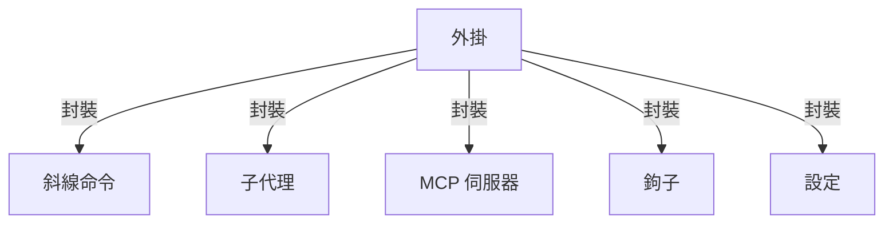
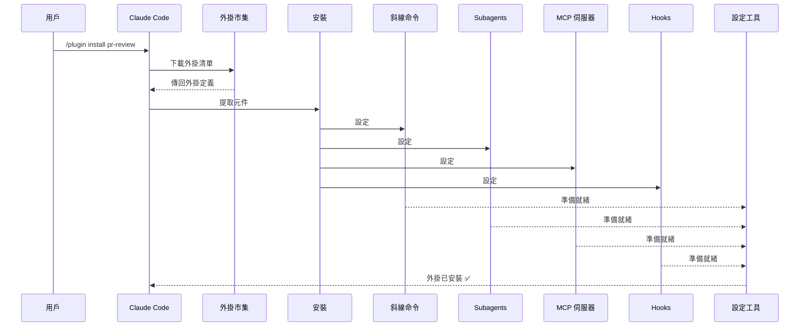
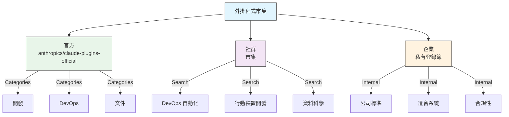
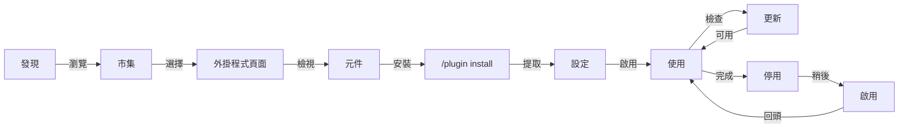
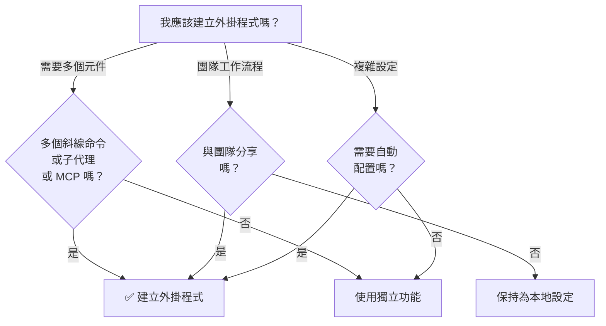

# Claude Code 外掛

這個資料夾包含完整的外掛範例，這些範例將多個 Claude Code 功能封裝到可安裝的套件中。

## 總覽

Claude Code 外掛是封裝的自訂設定集合（斜線命令、子代理、MCP 伺服器和鉤子），它們可以使用單一命令進行安裝。它們代表最高層級的擴充機制，將多個功能合併到可分享的套件中。

## 外掛架構



## 外掛載入流程



## 外掛程式類型與發布

| 類型 | 範圍 | 共享 | 權威 | 範例 |
|------|-------|--------|-----------|----------|
| 官方 | 全域 | 所有使用者 | Anthropic | PR 審查, 安全性指導 |
| 社群 | 公開 | 所有使用者 | 社群 | DevOps, 資料科學 |
| 組織 | 內部 | 團隊成員 | 公司 | 內部標準, 工具 |
| 個人 | 個人 | 單一使用者 | 開發者 | 自訂工作流程 |

## 外掛程式定義結構

外掛程式資訊清單使用 JSON 格式，位於 `.claude-plugin/plugin.json`：

```json
{
  "name": "my-first-plugin",
  "description": "一個問候外掛程式",
  "version": "1.0.0",
  "author": {
    "name": "您的姓名"
  },
  "homepage": "https://example.com",
  "repository": "https://github.com/user/repo",
  "license": "MIT"
}
```

## 外掛程式結構範例

```
my-plugin/
├── .claude-plugin/
│   └── plugin.json       # 資訊清單 (名稱, 描述, 版本, 作者)
├── commands/             # 技能，以 Markdown 檔案形式
│   ├── task-1.md
│   ├── task-2.md
│   └── workflows/
├── agents/               # 自訂代理定義
│   ├── specialist-1.md
│   ├── specialist-2.md
│   └── configs/
├── skills/               # 代理技能，以 SKILL.md 檔案形式
│   ├── skill-1.md
│   └── skill-2.md
├── hooks/                # 事件處理器，位於 hooks.json
│   └── hooks.json
├── .mcp.json             # MCP 伺服器設定
├── .lsp.json             # LSP 伺服器設定，用於程式碼智慧
├── bin/                  # 在外掛程式啟用時，新增到 Bash 工具的 PATH 中的可執行檔
├── settings.json         # 外掛程式啟用時，預設設定 (目前僅支援 `agent` 鍵)
├── templates/
│   └── issue-template.md
├── scripts/
│   ├── helper-1.sh
│   └── helper-2.py
├── docs/
│   ├── README.md
│   └── USAGE.md
└── tests/
    └── plugin.test.js
```

### LSP 伺服器設定

外掛程式可以包含語言伺服器協定 (LSP) 支援，以提供即時程式碼智慧。 LSP 伺服器提供診斷、程式碼導航和符號資訊，當您工作時。

**設定位置**:
- 外掛程式根目錄中的 `.lsp.json` 檔案
- `plugin.json` 中的內嵌 `lsp` 鍵

#### 欄位參考

| 欄位 | 必填 | 描述 |
|-------|----------|-------------|
| `command` | 是 | LSP 伺服器二進位檔 (必須在 PATH 中) |
| `extensionToLanguage` | 是 | 將檔案擴充功能對應到語言 ID |
| `args` | 否 | 伺服器的命令列參數 |
| `transport` | 否 | 溝通方法：`stdio` (預設) 或 `socket` |
| `env` | 否 | 伺服器處理程序的環境變數 |
| `initializationOptions` | 否 | 在 LSP 初始化期間傳送的選項 |
| `settings` | 否 | 傳遞給伺服器的工作區設定 |
| `workspaceFolder` | 否 | 覆寫工作區資料夾路徑 |
| `startupTimeout` | 否 | 等待伺服器啟動的最大時間 (毫秒) |
| `shutdownTimeout` | 否 | 伺服器優雅關閉的最大時間 (毫秒) |
| `restartOnCrash` | 否 | 伺服器崩潰時自動重新啟動 |
| `maxRestarts` | 否 | 放棄之前嘗試重新啟動的最大次數 |

#### 範例配置

**Go (gopls)**:

```json
{
  "go": {
    "command": "gopls",
    "args": ["serve"],
    "extensionToLanguage": {
      ".go": "go"
    }
  }
}
```

**Python (pyright)**:

```json
{
  "python": {
    "command": "pyright-langserver",
    "args": ["--stdio"],
    "extensionToLanguage": {
      ".py": "python",
      ".pyi": "python"
    }
  }
}
```

**TypeScript**:

```json
{
  "typescript": {
    "command": "typescript-language-server",
    "args": ["--stdio"],
    "extensionToLanguage": {
      ".ts": "typescript",
      ".tsx": "typescriptreact",
      ".js": "javascript",
      ".jsx": "javascriptreact"
    }
  }
}
```

#### 可用的 LSP 外掛

官方市集包含預先配置好的 LSP 外掛：

| 外掛 | 語言 | Server Binary | 安裝命令 |
|--------|----------|---------------|----------------|
| `pyright-lsp` | Python | `pyright-langserver` | `pip install pyright` |
| `typescript-lsp` | TypeScript/JavaScript | `typescript-language-server` | `npm install -g typescript-language-server typescript` |
| `rust-lsp` | Rust | `rust-analyzer` | 透過 `rustup component add rust-analyzer` 安裝 |

#### LSP 功能

配置完成後，LSP 伺服器提供：

- **即時除錯資訊** — 錯誤和警告會在編輯後立即出現
- **程式碼導覽** — 轉到定義、尋找參考、實作
- **懸停資訊** — 懸停時顯示類型簽名和文件
- **符號清單** — 瀏覽目前檔案或工作區中的符號

## 外掛選項 (v2.1.83+)

外掛可以在清單檔中透過 `userConfig` 宣告使用者可設定的選項。 標記為 `sensitive: true` 的值會儲存在系統金鑰串筒中，而不是純文字設定檔中：

```json
{
  "name": "my-plugin",
  "version": "1.0.0",
  "userConfig": {
    "apiKey": {
      "description": "API 金鑰，用於服務",
      "sensitive": true
    },
    "region": {
      "description": "部署區域",
      "default": "us-east-1"
    }
  }
}
```

## 持續性外掛資料 (`${CLAUDE_PLUGIN_DATA}`) (v2.1.78+)

外掛可以透過 `${CLAUDE_PLUGIN_DATA}` 環境變數存取持續性狀態目錄。 此目錄每個外掛都唯一，並且跨會話都有效，因此適合用於快取、資料庫和其他持續性狀態：

```json
{
  "hooks": {
    "PostToolUse": [
      {
        "command": "node ${CLAUDE_PLUGIN_DATA}/track-usage.js"
      }
    ]
  }
}
```

當外掛安裝時，此目錄會自動建立。 儲存在此目錄中的檔案會持續存在，直到外掛解除安裝為止。

## 內嵌外掛 via 設定 (`source: 'settings'`) (v2.1.80+)

外掛可以使用 `source: 'settings'` 欄位，在設定檔中以市集條目定義內嵌外掛。 這允許直接內嵌外掛定義，而無需額外的存放庫或市集：

```json
{
  "pluginMarketplaces": [
    {
      "name": "inline-tools",
      "source": "settings",
      "plugins": [
        {
          "name": "quick-lint",
          "source": "./local-plugins/quick-lint"
        }
      ]
    }
  ]
}
```

## 外掛程式設定

外掛程式可以發送 `settings.json` 檔案以提供預設設定。目前僅支援 `agent` 索引鍵，用於設定外掛程式的主要執行緒代理：

```json
{
  "agent": "agents/specialist-1.md"
}
```

當外掛程式包含 `settings.json` 時，其預設設定會在安裝時生效。使用者可以在自己的專案或使用者設定中覆寫這些設定。

## 獨立式與外掛程式方法

| 方法 | 指令名稱 | 設定 | 適用於 |
|----------|---------------|---|---|
| **獨立式** | `/hello` | 在 CLAUDE.md 中手動設定 | 個人、專案特定 |
| **外掛程式** | `/plugin-name:hello` | 透過 plugin.json 自動設定 | 共享、發布、團隊使用 |

使用 **獨立式斜線命令** 進行快速個人工作流程。 當您想要將多個功能封裝、與團隊共享或發布時，請使用 **外掛程式**。

## 實用範例

### 範例 1：PR 審查外掛程式

**檔案:** `.claude-plugin/plugin.json`

```json
{
  "name": "pr-review",
  "version": "1.0.0",
  "description": "使用安全性、測試和文件完成 PR 審查工作流程",
  "author": {
    "name": "Anthropic"
  },
  "repository": "https://github.com/your-org/pr-review",
  "license": "MIT"
}
```

**檔案:** `commands/review-pr.md`

```markdown
---
name: Review PR
description: 使用安全性及測試檢查開始全面的 PR 審查
---

# PR 審查

此指令啟動完整的拉取請求審查，包括：

1. 安全性分析
2. 測試覆蓋率驗證
3. 文件更新
4. 程式碼品質檢查
5. 效能影響評估
```

**檔案:** `agents/security-reviewer.md`

```yaml
---
name: security-reviewer
description: 專注於安全性的程式碼審查
tools: read, grep, diff
---

# 安全性審查員

專門用於尋找安全性漏洞：
- 驗證/授權問題
- 資料暴露
- 注入攻擊
- 安全配置
```

**安裝:**

```bash
/plugin install pr-review

# 結果：
# ✅ 3 斜線命令安裝
# ✅ 3 子代理配置
# ✅ 2 MCP 伺服器連接
# ✅ 4 鉤子註冊
# ✅ 準備就緒！
```

### 範例 2：DevOps 外掛程式

**元件：**

```
devops-automation/
├── commands/
│   ├── deploy.md
│   ├── rollback.md
│   ├── status.md
│   └── incident.md
├── agents/
│   ├── deployment-specialist.md
│   ├── incident-commander.md
│   └── alert-analyzer.md
├── mcp/
│   ├── github-config.json
│   ├── kubernetes-config.json
│   └── prometheus-config.json
├── hooks/
│   ├── pre-deploy.js
│   ├── post-deploy.js
│   └── on-error.js
└── scripts/
    ├── deploy.sh
    ├── rollback.sh
    └── health-check.sh
```

### 範例 3：文件外掛程式

**封裝元件：**

```
documentation/
├── commands/
│   ├── generate-api-docs.md
│   ├── generate-readme.md
│   ├── sync-docs.md
│   └── validate-docs.md
├── agents/
│   ├── api-documenter.md
│   ├── code-commentator.md
│   └── example-generator.md
├── mcp/
│   ├── github-docs-config.json
│   └── slack-announce-config.json
```

└── templates/
    ├── api-endpoint.md
    ├── function-docs.md
    └── adr-template.md

## 外掛程式市集

Anthropic 官方管理的插件目錄是 `anthropics/claude-plugins-official`。企業管理員也可以為內部發布創建私有外掛程式市集。



### 市集配置

企業和進階使用者可以透過設定控制市集行為：

| 設定 | 說明 |
|---|---|
| `extraKnownMarketplaces` | 除了預設值之外，新增額外的市集來源 |
| `strictKnownMarketplaces` | 控制使用者可以新增哪些市集 |
| `deniedPlugins` | 管理員管理的封鎖清單，以防止安裝特定的外掛程式 |

### 額外的市集功能

- **預設 git 超時時間**: 從 30 秒增加到 120 秒，適用於大型外掛程式存放庫
- **自訂 npm 登錄簿**: 外掛程式可以指定自訂 npm 登錄簿 URL 以進行相依性解析
- **版本固定**: 將外掛程式鎖定到特定版本，以產生可重複的環境

### 市集定義模式

外掛程式市集定義在 `.claude-plugin/marketplace.json` 中：

```json
{
  "name": "my-team-plugins",
  "owner": "my-org",
  "plugins": [
    {
      "name": "code-standards",
      "source": "./plugins/code-standards",
      "description": "Enforce team coding standards",
      "version": "1.2.0",
      "author": "platform-team"
    },
    {
      "name": "deploy-helper",
      "source": {
        "source": "github",
        "repo": "my-org/deploy-helper",
        "ref": "v2.0.0"
      },
      "description": "Deployment automation workflows"
    }
  ]
}
```

| Field | Required | 說明 |
|---|---|---|
| `name` | Yes | 以 kebab-case 的市集名稱 |
| `owner` | Yes | 維護市集的組織或使用者 |
| `plugins` | Yes | 插件條目陣列 |
| `plugins[].name` | Yes | 以 kebab-case 的插件名稱 |
| `plugins[].source` | Yes | 插件來源 (路徑字串或來源物件) |
| `plugins[].description` | No | 簡短的插件描述 |
| `plugins[].version` | No | Semantic 版本字串 |
| `plugins[].author` | No | 插件作者名稱 |

### 插件來源類型

插件可以從多個位置取得：

| Source | Syntax | Example |
|--------|--------|---------|
| **Relative path** | 字串路徑 | `"./plugins/my-plugin"` |
| **GitHub** | `{ "source": "github", "repo": "owner/repo" }` | `{ "source": "github", "repo": "acme/lint-plugin", "ref": "v1.0" }` |
| **Git URL** | `{ "source": "url", "url": "..." }` | `{ "source": "url", "url": "https://git.internal/plugin.git" }` |
| **Git subdirectory** | `{ "source": "git-subdir", "url": "...", "path": "..." }` | `{ "source": "git-subdir", "url": "https://github.com/org/monorepo.git", "path": "packages/plugin" }` |
| **npm** | `{ "source": "npm", "package": "..." }` | `{ "source": "npm", "package": "@acme/claude-plugin", "version": "^2.0" }` |
| **pip** | `{ "source": "pip", "package": "..." }` | `{ "source": "pip", "package": "claude-data-plugin", "version": ">=1.0" }` |

GitHub and git sources support optional `ref` (branch/tag) and `sha` (commit hash) fields for version pinning.

### Distribution methods

**GitHub (推薦)**:
```bash
# Users add your marketplace
/plugin marketplace add owner/repo-name
```

**Other git services** (full URL required):
```bash
/plugin marketplace add https://gitlab.com/org/marketplace-repo.git
```

**Private repositories**: Supported via git credential helpers or environment tokens. Users must have read access to the repository.

**Official marketplace submission**: Submit plugins to the Anthropic-curated marketplace for broader distribution via [claude.ai/settings/plugins/submit](https://claude.ai/settings/plugins/submit) or [platform.claude.com/plugins/submit](https://platform.claude.com/plugins/submit).

### Strict mode

Control how marketplace definitions interact with local `plugin.json` files:

| Setting | Behavior |
|---------|----------|
| `strict: true` (default) | Local `plugin.json` is authoritative; marketplace entry supplements it |
| `strict: false` | Marketplace entry is the entire plugin definition |

**Organization restrictions** with `strictKnownMarketplaces`:

| Value | Effect |
|-------|--------|
| Not set | No restrictions — users can add any marketplace |
| Empty array `[]` | Lockdown — no marketplaces allowed |
| Array of patterns | Allowlist — only matching marketplaces can be added |

```json
{
  "strictKnownMarketplaces": [
    "my-org/*",
    "github.com/trusted-vendor/*"
  ]
}
```

> **Warning**: In strict mode with `strictKnownMarketplaces`, users can only install plugins from allowlisted marketplaces. This is useful for enterprise environments requiring controlled plugin distribution.

## 外掛程式安裝與生命週期



## 外掛程式功能比較

| 功能 | 斜線命令 | 技能 | 子代理 | 外掛程式 |
|---------|---------------|-------|----------|--------|
| **安裝** | 手動複製 | 手動複製 | 手動設定 | 一個命令 |
| **設定時間** | 5 分鐘 | 10 分鐘 | 15 分鐘 | 2 分鐘 |
| **打包** | 單一檔案 | 單一檔案 | 單一檔案 | 多個 |
| **版本控制** | 手動 | 手動 | 手動 | 自動 |
| **團隊分享** | 複製檔案 | 複製檔案 | 複製檔案 | 安裝 ID |
| **更新** | 手動 | 手動 | 手動 | 自動可用 |
| **相依性** | 無 | 無 | 無 | 可能包含 |
| **市集** | 否 | 否 | 否 | 是 |
| **發布** | 儲存庫 | 儲存庫 | 儲存庫 | 市集 |

## 外掛程式 CLI 命令

所有外掛程式操作都可透過 CLI 命令使用：

```bash
claude plugin install <name>@<marketplace>   # 從市集安裝
claude plugin uninstall <name>               # 移除外掛程式
claude plugin list                           # 列出已安裝的外掛程式
claude plugin enable <name>                  # 啟用已停用的外掛程式
claude plugin disable <name>                 # 停用外掛程式
claude plugin validate                       # 驗證外掛程式結構
```

## 安裝方法

### 從 Marketplace

```bash
/plugin install plugin-name
# 或從 CLI:
claude plugin install plugin-name@marketplace-name
```

### 啟用 / 停用 (自動偵測範圍)

```bash
/plugin enable plugin-name
/plugin disable plugin-name
```

### 本地外掛程式 (用於開發)

```bash
# CLI 參數用於本地測試 (可重複用於多個外掛程式)
claude --plugin-dir ./path/to/plugin
claude --plugin-dir ./plugin-a --plugin-dir ./plugin-b
```

### 從 Git 儲存庫

```bash
/plugin install github:username/repo
```

## 何時建立外掛程式



### 外掛程式使用案例

| 使用案例 | 建議 | 原因 |
|----------|-----------------|-----|
| **團隊導入** | ✅ 使用外掛程式 | 即時設定，所有配置 |
| **框架設定** | ✅ 使用外掛程式 | 封裝框架特定的命令 |
| **企業標準** | ✅ 使用外掛程式 | 集中發布，版本控制 |
| **快速任務自動化** | ❌ 使用命令 | 過於複雜 |
| **單一領域專業知識** | ❌ 使用技能 | 太過沉重，使用技能代替 |
| **專門分析** | ❌ 使用子代理 | 手動建立或使用技能 |
| **存取即時資料** | ❌ 使用 MCP | 獨立，不要封裝 |

## 測試外掛

在發布之前，使用 `--plugin-dir` CLI 標誌（可重複用於多個外掛）在本機測試您的外掛：

```bash
claude --plugin-dir ./my-plugin
claude --plugin-dir ./my-plugin --plugin-dir ./another-plugin
```

這會啟動 Claude Code 並載入您的外掛，讓您可以：

- 驗證所有斜線命令都可用
- 測試子代理和代理是否能正確運作
- 確認 MCP 伺服器連接是否正常
- 驗證鉤子執行
- 檢查 LSP 伺服器設定
- 檢查是否有任何設定錯誤

## 熱重載

外掛支援開發期間的熱重載。當您修改外掛檔案時，Claude Code 可以自動偵測變更。您也可以使用以下指令強制重新載入：

```bash
/reload-plugins
```

這會重新讀取所有外掛清單、命令、代理、技能、鉤子和 MCP/LSP 設定，而無需重新啟動會話。

## 外掛的受管理設定

管理員可以使用受管理設定來控制組織內的外掛行為：

| 設定 | 說明 |
|---------|-------------|
| `enabledPlugins` | 預設啟用的外掛清單 |
| `deniedPlugins` | 無法安裝的外掛黑名單 |
| `extraKnownMarketplaces` | 除了預設來源之外，新增額外的 Marketplace 來源 |
| `strictKnownMarketplaces` | 限制使用者可以新增的 Marketplace |
| `allowedChannelPlugins` | 根據發布管道控制允許使用的外掛 |

這些設定可以透過受管理設定檔案在組織層級應用，並優先於使用者層級設定。

## 外掛程式安全性

外掛程式子代理在受限沙箱中執行。以下 frontmatter 索引鍵**不允許**在外掛程式子代理定義中：

- `hooks` -- 子代理不能註冊事件處理器
- `mcpServers` -- 子代理不能配置 MCP 伺服器
- `permissionMode` -- 子代理不能覆寫權限模型

這確保了外掛程式不能提升權限或修改其聲稱的範圍之外的主機環境。

## 發布外掛程式

**發布步驟：**

1. 建立包含所有元件的外掛程式結構
2. 撰寫 `.claude-plugin/plugin.json` 清單檔
3. 建立 `README.md` 包含文件
4. 透過 `claude --plugin-dir ./my-plugin` 本地測試
5. 提交至外掛程式市集
6. 進行審查並批准
7. 在市集上發布
8. 用戶可以使用單一命令安裝

**範例提交：**

```markdown
# PR 審查外掛程式

## 描述
完成 PR 審查工作流程，包含安全性、測試和文件檢查。

## 包含內容
- 3 個斜線命令，用於不同審查類型
- 3 個專業子代理
- GitHub 和 CodeQL MCP 整合
- 自動化安全性掃描鉤子

## 安裝
```bash
/plugin install pr-review
```

## 功能
✅ 安全性分析
✅ 測試覆蓋率檢查
✅ 文件驗證
✅ 程式碼品質評估
✅ 效能影響分析

## 使用方法
```bash
/review-pr
/check-security
/check-tests
```

## 需求
- Claude Code 1.0+
- GitHub 存取權
- CodeQL (可選)
```

## 外掛程式與手動配置

**手動設定 (2+ 小時)：**
- 逐一安裝斜線命令
- 獨立建立子代理
- 獨立配置 MCP
- 手動設定鉤子
- 記錄所有內容
- 與團隊分享 (希望他們正確配置)

**使用外掛程式 (2 分鐘)：**
```bash
/plugin install pr-review
# ✅ 所有內容已安裝和配置
# ✅ 立即可以使用
# ✅ 團隊可以重現確切設定
```

## 最佳實踐

### 應該做 ✅
- 使用清晰、具描述性的外掛程式名稱
- 包含全面的 README
- 妥善地版本管理你的外掛程式 (semver)
- 測試所有元件的協同運作
- 清晰地記錄需求
- 提供使用範例
- 包含錯誤處理
- 適切地標記以利搜尋
- 維護後向相容性
- 保持外掛程式的專注和連貫性
- 包含全面的測試
- 記錄所有相依性

### 不應該做 ❌
- 不要將不相關的功能打包在一起
- 不要硬編碼憑證
- 不要跳過測試
- 不要忘記記錄文件
- 不要創建冗餘的外掛程式
- 不要忽略版本管理
- 不要過度複雜元件相依性
- 不要忘記優雅地處理錯誤

## 安裝說明

### 從 Marketplace 安裝

1. **瀏覽可用的外掛程式：**
   ```bash
   /plugin list
   ```

2. **查看外掛程式詳細資訊：**
   ```bash
   /plugin info plugin-name
   ```

3. **安裝外掛程式：**
   ```bash
   /plugin install plugin-name
   ```

### 從本機路徑安裝

```bash
/plugin install ./path/to/plugin-directory
```

### 從 GitHub 安裝

```bash
/plugin install github:username/repo
```

### 列出已安裝的外掛程式

```bash
/plugin list --installed
```

### 更新外掛程式

```bash
/plugin update plugin-name
```

### 停用/啟用外掛程式

```bash
# 暫時停用
/plugin disable plugin-name

# 重新啟用
/plugin enable plugin-name
```

### 卸載外掛程式

```bash
/plugin uninstall plugin-name
```

## 相關概念

以下 Claude Code 功能與外掛程式協同運作：

- **[斜線命令](../01-slash-commands/)** - 封裝在外掛程式中的個別命令
- **[記憶](../02-memory/)** - 外掛程式的持續上下文
- **[技能](../03-skills/)** - 可以封裝到外掛程式中的領域專業知識
- **[子代理](../04-subagents/)** - 作為外掛程式元件包含的專業代理
- **[MCP 伺服器](../05-mcp/)** - 封裝在外掛程式中的模型上下文協定整合
- **[鉤子](../06-hooks/)** - 觸發外掛程式工作流程的事件處理常式

## 完整範例工作流程

### PR 審查外掛完整工作流程

```
1. 用戶：/review-pr

2. 外掛執行：
   ├── pre-review.js 鉤子驗證 git 倉庫
   ├── GitHub MCP 抓取 PR 資料
   ├── security-reviewer 子代理分析安全性
   ├── test-checker 子代理驗證涵蓋率
   └── performance-analyzer 子代理檢查效能

3. 結果合成並呈現：
   ✅ 安全性：無重大問題
   ⚠️  測試：涵蓋率 65% (建議 80%+)
   ✅ 效能：無顯著影響
   📝 提供 12 項建議
```

## 疑難排解

### 外掛無法安裝
- 檢查 Claude Code 版本相容性：`/version`
- 使用 JSON 驗證器驗證 `plugin.json` 語法
- 檢查網路連線 (對於遠端外掛)
- 檢查權限：`ls -la plugin/`

### 組件無法載入
- 驗證 `plugin.json` 中的路徑是否與實際目錄結構相符
- 檢查檔案權限：`chmod +x scripts/`
- 檢查組件檔案語法
- 檢查記錄：`/plugin debug plugin-name`

### MCP 連線失敗
- 驗證環境變數是否設定正確
- 檢查 MCP 伺服器安裝和健康狀況
- 使用 `/mcp test` 獨立測試 MCP 連線
- 檢查 `mcp/` 目錄中的 MCP 設定

### 安裝後指令無法使用
- 確保外掛已成功安裝：`/plugin list --installed`
- 檢查外掛是否已啟用：`/plugin status plugin-name`
- 重新啟動 Claude Code：`exit` 並重新開啟
- 檢查是否有與現有指令名稱衝突

### 鉤子執行問題
- 驗證鉤子檔案具有正確的權限
- 檢查鉤子語法和事件名稱
- 檢查鉤子記錄以取得錯誤詳細資訊
- 如果可能，手動測試鉤子

## 額外資源

- [官方外掛說明文件](https://code.claude.com/docs/en/plugins)
- [探索外掛](https://code.claude.com/docs/en/discover-plugins)
- [外掛市集](https://code.claude.com/docs/en/plugin-marketplaces)
- [外掛參考](https://code.claude.com/docs/en/plugins-reference)
- [MCP 伺服器參考](https://modelcontextprotocol.io/)
- [子代理設定指南](../04-subagents/README.md)
- [鉤子系統參考](../06-hooks/README.md)

---
**上次更新**: 2026 年 4 月 11 日
**Claude Code 版本**: 2.1.101
**來源**:
- https://code.claude.com/docs/en/plugins
**相容模型**: Claude Sonnet 4.6, Claude Opus 4.6, Claude Haiku 4.5
