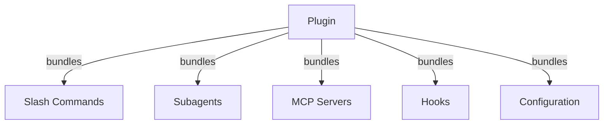
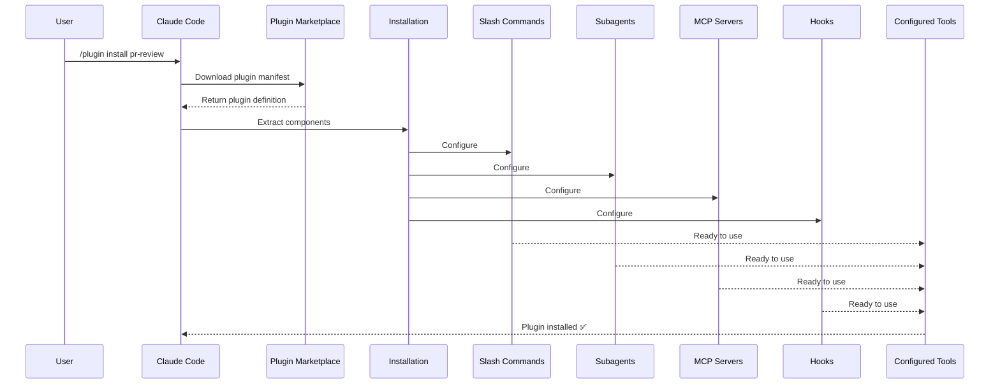
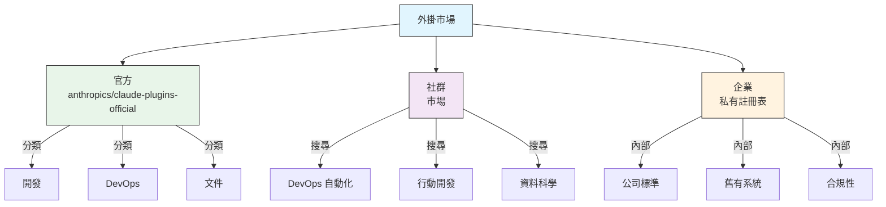
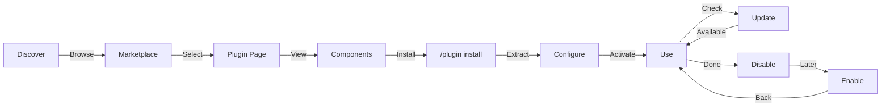
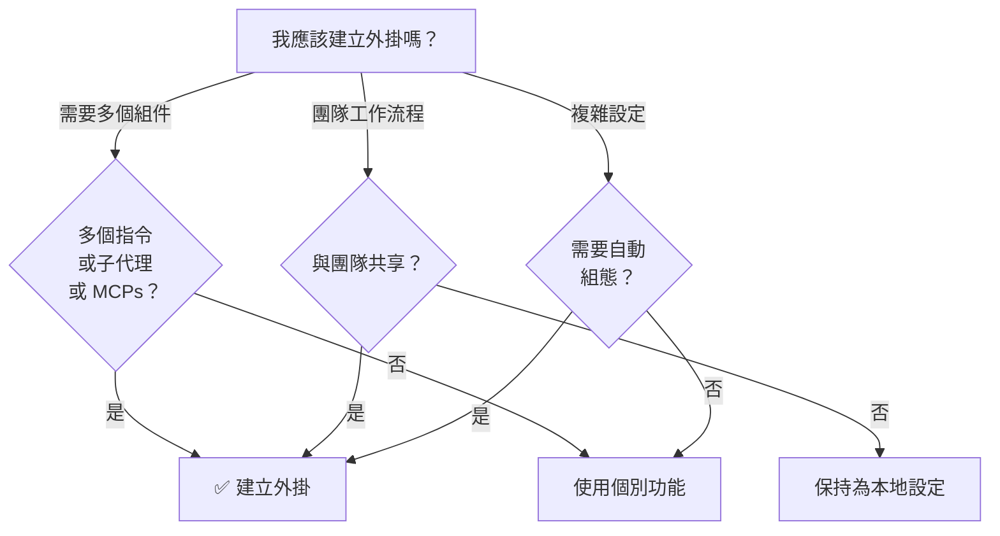

<picture>
  <source media="(prefers-color-scheme: dark)" srcset="../resources/logos/claude-howto-logo-dark.svg">
  
</picture>

# Claude Code Plugins

此資料夾包含完整的外掛範例，將多個 Claude Code 功能整合為具備凝聚力且可安裝的套件。

## 概觀

Claude Code Plugins 是整合後的自定義集合（包含斜線命令、子代理、MCP servers 與鉤子），只需透過單一指令即可完成安裝。它們代表了最高層級的擴充機制——將多個功能組合為凝聚力強且可共用的套件。

## 外掛架構



## 外掛載入流程



## 外掛類型與分發

| 類型 | 範圍 | 共享對象 | 權限 | 範例 |
|------|-------|--------|-----------|----------|
| Official | 全域 | 所有使用者 | Anthropic | PR Review, Security Guidance |
| Community | 公開 | 所有使用者 | 社群 | DevOps, Data Science |
| Organization | 內部 | 團隊成員 | 公司 | 內部標準、工具 |
| Personal | 個人 | 單一使用者 | 開發者 | 自定義工作流程 |

## 外掛定義結構

外掛清單使用 `.claude-plugin/plugin.json` 中的 JSON 格式：

```json
{
  "name": "my-first-plugin",
  "description": "A greeting plugin",
  "version": "1.0.0",
  "author": {
    "name": "Your Name"
  },
  "homepage": "https://example.com",
  "repository": "https://github.com/user/repo",
  "license": "MIT"
}
```

## 外掛結構範例

```
my-plugin/
├── .claude-plugin/
│   └── plugin.json       # Manifest (name, description, version, author)
├── commands/             # 以 Markdown 檔案形式呈現的技能
│   ├── task-1.md
│   ├── task-2.md
│   └── workflows/
├── agents/               # 自定義代理定義
│   ├── specialist-1.md
│   ├── specialist-2.md
│   └── configs/
├── skills/               # 包含 SKILL.md 檔案的代理技能
│   ├── skill-1.md
│   └── skill-2.md
├── hooks/                # hooks.json 中的事件處理器
│   └── hooks.json
├── .mcp.json             # MCP server 配置
├── .lsp.json             # 用於程式碼智慧的 LSP server 配置
├── bin/                  # 當外掛啟用時，會被加入 Bash 工具 PATH 的執行檔
├── settings.json         # 外掛啟用時套用的預設設定 (目前僅支援 `agent` 鍵)
├── templates/
│   └── issue-template.md
├── scripts/
│   ├── helper-1.sh
│   └── helper-2.py
├── docs/
│   ├── README.md
│   └── USAGE.md
└── tests/
    └── plugin.test.js
```

### LSP server 配置

外掛可以包含語言伺服器協定 (LSP) 支援，以提供即時的程式碼智慧。LSP server 在您工作時提供診斷、程式碼導覽與符號資訊。

**配置位置**：
- 外掛根目錄下的 `.lsp.json` 檔案
- `plugin.json` 中的內聯 `lsp` 鍵

#### 欄位參考

| 欄位 | 必要 | 說明 |
|-------|----------|-------------|
| `command` | 是 | LSP server 執行檔 (必須在 PATH 中) |
| `extensionToLanguage` | 是 | 將檔案副檔名映射至語言 ID |
| `args` | 否 | 伺服器的命令列參數 |
| `transport` | 否 | 通訊方式：`stdio` (預設) 或 `socket` |
| `env` | 否 | 伺服器進程的環境變數 |
| `initializationOptions` | 否 | LSP 初始化期間傳送的選項 |
| `settings` | 否 | 傳遞給伺服器的工作區配置 |
| `workspaceFolder` | 否 | 覆蓋工作區資料夾路徑 |
| `startupTimeout` | 否 | 等待伺服器啟動的最大時間 (ms) |
| `shutdownTimeout` | 否 | 優雅關閉的最大時間 (ms) |
| `restartOnCrash` | 否 | 若伺服器崩潰則自動重啟 |
| `maxRestarts` | 否 | 放棄前的最大重啟嘗試次數 |

#### 設定範例

**Go (gopls)**:

```json
{
  "go": {
    "command": "gopls",
    "args": ["serve"],
    "extensionToLanguage": {
      ".go": "go"
    }
  }
}
```

**Python (pyright)**:

```json
{
  "python": {
    "command": "pyright-langserver",
    "args": ["--stdio"],
    "extensionToLanguage": {
      ".py": "python",
      ".pyi": "python"
    }
  }
}
```

**TypeScript**:

```json
{
  "typescript": {
    "command": "typescript-language-server",
    "args": ["--stdio"],
    "extensionToLanguage": {
      ".ts": "typescript",
      ".tsx": "typescriptreact",
      ".js": "javascript",
      ".jsx": "javascriptreact"
    }
  }
}
```

#### 可用的 LSP 外掛

官方市場包含預先配置好的 LSP 外掛：

| 外掛 | 語言 | Server Binary | 安裝指令 |
|--------|----------|---------------|----------------|
| `pyright-lsp` | Python | `pyright-langserver` | `pip install pyright` |
| `typescript-lsp` | TypeScript/JavaScript | `typescript-language-server` | `npm install -g typescript-language-server typescript` |
| `rust-lsp` | Rust | `rust-analyzer` | 透過 `rustup component add rust-analyzer` 安裝 |

#### LSP 功能

配置完成後，LSP servers 提供：

- **即時診斷** — 編輯後立即顯示錯誤與警告
- **程式碼導覽** — 跳轉至定義、尋找參照、實作
- **懸停資訊** — 懸停時顯示型別簽章與文件
- **符號列表** — 瀏覽目前檔案或工作區中的符號

## 外掛選項 (v2.1.83+)

外掛可以透過 `userConfig` 在 manifest 中宣告使用者可配置的選項。標記為 `sensitive: true` 的數值會儲存在系統鑰匙圈（keychain）中，而非以純文字形式儲存在設定檔中：

```json
{
  "name": "my-plugin",
  "version": "1.0.0",
  "userConfig": {
    "apiKey": {
      "description": "API key for the service",
      "sensitive": true
    },
    "region": {
      "description": "Deployment region",
      "default": "us-east-1"
    }
  }
}
```

## 持久化外掛資料 (`${CLAUDE_PLUGIN_DATA}`) (v2.1.78+)

外掛可以透過 `${CLAUDE_PLUGIN_DATA}` 環境變數存取持久化狀態目錄。此目錄對每個外掛都是唯一的，且在不同會話之間會持續存在，因此非常適合用於快取、資料庫及其他持久化狀態：

```json
{
  "hooks": {
    "PostToolUse": [
      {
        "command": "node ${CLAUDE_PLUGIN_DATA}/track-usage.js"
      }
    ]
  }
}
```

該目錄會在安裝外掛時自動建立。儲存在此處的檔案會一直保留，直到外掛被解除安裝。

### 背景監控器 (v2.1.105)

外掛可以註冊背景監控器，這些監控器會在會話開始或外掛的技能被呼叫時自動啟動。請在您的外掛 manifest 中加入頂層的 `monitors` 鍵：

```json
{
  "name": "my-plugin",
  "version": "1.0.0",
  "monitors": [
    {
      "command": "tail -f /var/log/app.log",
      "trigger": "session_start"
    }
  ]
}
```

`trigger` 欄位接受以下值：
- `"session_start"` — 當會話開始時自動啟動監控器
- `"skill_invoke"` — 當外掛的技能被呼叫時啟動監控器

監控器底層使用相同的 Monitor 工具，將 stdout 行串流化為 Claude 可以回應的事件。

## 透過設定進行內嵌式外掛 (`source: 'settings'`) (v2.1.80+)

外掛可以透過 `source: 'settings'` 欄位，以市場條目的形式直接定義在設定檔中。這允許直接嵌入外掛定義，而不需要獨立的儲存庫或市場：

```json
{
  "pluginMarketplaces": [
    {
      "name": "inline-tools",
      "source": "settings",
      "plugins": [
        {
          "name": "quick-lint",
          "source": "./local-plugins/quick-lint"
        }
      ]
    }
  ]
}
```

## 外掛設定

外掛可以附帶一個 `settings.json` 檔案來提供預設配置。目前這支援 `agent` 鍵，用於設定該外掛的主執行緒代理：

```json
{
  "agent": "agents/specialist-1.md"
}
```

當外掛包含 `settings.json` 時，其預設值會在安裝時套用。使用者可以在自己的專案或使用者配置中覆寫這些設定。

## 獨立模式 vs 外掛模式

| 模式 | 命令名稱 | 配置方式 | 最佳適用場景 |
|----------|---------------|---|---|
| **獨立模式** | `/hello` | 在 CLAUDE.md 中手動設定 | 個人、特定專案使用 |
| **外掛模式** | `/plugin-name:hello` | 透過 plugin.json 自動化 | 分享、發布、團隊使用 |

對於快速的個人工作流程，請使用**獨立斜線命令**。當您想要打包多個功能、與團隊共享或發布供他人使用時，請使用**外掛**。

## 實際範例

### 範例 1：PR Review 外掛

**檔案：** `.claude-plugin/plugin.json`

```json
{
  "name": "pr-review",
  "version": "1.0.0",
  "description": "Complete PR review workflow with security, testing, and docs",
  "author": {
    "name": "Anthropic"
  },
  "repository": "https://github.com/your-org/pr-review",
  "license": "MIT"
}
```

**檔案：** `commands/review-pr.md`

```markdown
---
name: Review PR
description: Start comprehensive PR review with security and testing checks
---

# PR Review

This command initiates a complete pull request review including:

1. Security analysis
2. Test coverage verification
3. Documentation updates
4. Code quality checks
5. Performance impact assessment
```

**檔案：** `agents/security-reviewer.md`

```yaml
---
name: security-reviewer
description: Security-focused code review
tools: read, grep, diff
---

# Security Reviewer

Specializes in finding security vulnerabilities:
- Authentication/authorization issues
- Data exposure
- Injection attacks
- Secure configuration
```

**安裝：**

```bash
/plugin install pr-review

# 結果：
# ✅ 3 slash commands installed
# ✅ 3 subagents configured
# ✅ 2 MCP servers connected
# ✅ 4 hooks registered
# ✅ Ready to use!
```

### 範例 2：DevOps 外掛

**組件：**

```
devops-automation/
├── commands/
│   ├── deploy.md
│   ├── rollback.md
│   ├── status.md
│   └── incident.md
├── agents/
│   ├── deployment-specialist.md
│   ├── incident-commander.md
│   └── alert-analyzer.md
├── mcp/
│   ├── github-config.json
│   ├── kubernetes-config.json
│   └── prometheus-config.json
```

```
├── hooks/
│   ├── pre-deploy.js
│   ├── post-deploy.js
│   └── on-error.js
└── scripts/
    ├── deploy.sh
    ├── rollback.sh
    └── health-check.sh
```

### 範例 3：Documentation 外掛

**內含組件：**

```
documentation/
├── commands/
│   ├── generate-api-docs.md
│   ├── generate-readme.md
│   ├── sync-docs.md
│   └── validate-docs.md
├── agents/
│   ├── api-documenter.md
│   ├── code-commentator.md
│   └── example-generator.md
├── mcp/
│   ├── github-docs-config.json
│   └── slack-announce-config.json
└── templates/
    ├── api-endpoint.md
    ├── function-docs.md
    └── adr-template.md
```

## 外掛市場 (Plugin Marketplace)

由 Anthropic 官方管理的插件目錄為 `anthropics/claude-plugins-official`。企業管理員也可以建立私有的外掛市場進行內部發布。



### 市場配置

企業與進階使用者可以透過設定來控制市場行為：

| 設定 | 說明 |
|---------|-------------|
| `extraKnownMarketplaces` | 除了預設值之外，新增額外的市場來源 |
| `strictKnownMarketplaces` | 控制使用者被允許新增哪些市場 |
| `deniedPlugins` | 由管理員管理的黑名單，以防止特定外掛被安裝 |

### 其他市場功能

- **預設 git timeout**：針對大型外掛儲存庫，從 30s 增加至 120s
- **自定義 npm registries**：外掛可以指定自定義的 npm registry URL 以進行依賴解析
- **版本鎖定 (Version pinning)**：將外掛鎖定在特定版本，以確保環境的可重現性

### 市場定義 Schema

外掛市場定義在 `.claude-plugin/marketplace.json` 中：

```json
{
  "name": "my-team-plugins",
  "owner": "my-org",
  "plugins": [
    {
      "name": "code-standards",
      "source": "./plugins/code-standards",
      "description": "Enforce team coding standards",
      "version": "1.2.0",
      "author": "platform-team"
    },
    {
      "name": "deploy-helper",
      "source": {
        "source": "github",
        "repo": "my-org/deploy-helper",
        "ref": "v2.0.0"
      },
      "description": "Deployment automation workflows"
    }
  ]
}
```

| 欄位 | 是否必填 | 說明 |
|-------|----------|-------------|
```

| `name` | 是 | 以 kebab-case 表示的 Marketplace 名稱 |
| `owner` | 是 | 維護該 marketplace 的組織或使用者 |
| `plugins` | 是 | 外掛項目陣列 |
| `plugins[].name` | 是 | 外掛名稱 (kebab-case) |
| `plugins[].source` | 是 | 外掛來源 (路徑字串或來源物件) |
| `plugins[].description` | 否 | 外掛簡短描述 |
| `plugins[].version` | 否 | Semantic 版本字串 |
| `plugins[].author` | 否 | 外掛作者名稱 |

### Plugin source types

外掛可以從多個位置取得：

| 來源 | 語法 | 範例 |
|--------|--------|---------|
| **相對路徑** | 字串路徑 | `"./plugins/my-plugin"` |
| **GitHub** | `{ "source": "github", "repo": "owner/repo" }` | `{ "source": "github", "repo": "acme/lint-plugin", "ref": "v1.0" }` |
| **Git URL** | `{ "source": "url", "url": "..." }` | `{ "source": "url", "url": "https://git.internal/plugin.git" }` |
| **Git 子目錄** | `{ "source": "git-subdir", "url": "...", "path": "..." }` | `{ "source": "git-subdir", "url": "https://github.com/org/monorepo.git", "path": "packages/plugin" }` |
| **npm** | `{ "source": "npm", "package": "..." }` | `{ "source": "npm", "package": "@acme/claude-plugin", "version": "^2.0" }` |
| **pip** | `{ "source": "pip", "package": "..." }` | `{ "source": "pip", "package": "claude-data-plugin", "version": ">=1.0" }` |

GitHub 和 git 來源支援選用的 `ref` (分支/標籤) 與 `sha` (commit hash) 欄位，用於固定版本。

### Distribution methods

**GitHub (建議)**:
```bash
# 使用者新增您的 marketplace
/plugin marketplace add owner/repo-name
```

**其他 git 服務** (需要完整 URL):
```bash
/plugin marketplace add https://gitlab.com/org/marketplace-repo.git
```

**私有儲存庫**: 可透過 git credential helpers 或環境變數 token 支援。使用者必須擁有該儲存庫的讀取權限。

**官方 marketplace 提交**: 透過 [claude.ai/settings/plugins/submit](https://claude.ai/settings/plugins/submit) 或 [platform.claude.com/plugins/submit](https://platform.claude.com/plugins/submit) 將外掛提交至 Anthropic 策展的 marketplace，以進行更廣泛的發布。

### Strict mode

控制 marketplace 定義如何與本地 `plugin.json` 檔案互動：

| 設定 | 行為 |
|---------|----------|
| `strict: true` (預設) | 本地 `plugin.json` 為權威來源；marketplace 項目作為其補充 |
| `strict: false` | Marketplace 項目即為完整的外掛定義 |

使用 `strictKnownMarketplaces` 的**組織限制**：

| 值 | 效果 |
|-------|--------|
| 未設定 | 無限制 — 使用者可以新增任何 marketplace |
| 空陣列 `[]` | 鎖定 — 不允許任何 marketplace |
| 模式陣列 | 白名單 — 僅能新增符合模式的 marketplace |

```json
{
  "strictKnownMarketplaces": [
    "my-org/*",
    "github.com/trusted-vendor/*"
  ]
}
```

> **警告**：在啟用 `strictKnownMarketplaces` 的嚴格模式下，使用者只能從白名單中的 marketplace 安裝外掛。這對於需要控制外掛發布的企業環境非常有用。

## 外掛安裝與生命週期



## 外掛功能比較

| 功能 | 斜線命令 | 技能 | 子代理 | 外掛 |
|---------|---------------|-------|----------|--------|
| **安裝** | 手動複製 | 手動複製 | 手動設定 | 單一指令 |
| **設定時間** | 5 分鐘 | 10 分鐘 | 15 分鐘 | 2 分鐘 |
| **打包方式** | 單一檔案 | 單一檔案 | 單一檔案 | 多個檔案 |
| **版本管理** | 手動 | 手動 | 手動 | 自動 |
| **團隊共享** | 複製檔案 | 複製檔案 | 複製檔案 | 安裝 ID |
| **更新** | 手動 | 手動 | 手動 | 自動可用 |
| **依賴關係** | 無 | 無 | 無 | 可能包含 |
| **Marketplace** | 否 | 否 | 否 | 是 |
| **分發方式** | 儲存庫 | 儲存庫 | 儲存庫 | Marketplace |

## 外掛 CLI 指令

所有外掛操作皆可透過 CLI 指令執行：

```bash
claude plugin install <name>@<marketplace>   # 從 marketplace 安裝
claude plugin uninstall <name>               # 移除外掛
claude plugin list                           # 列出已安裝的外掛
claude plugin enable <name>                  # 啟用已停用的外掛
claude plugin disable <name>                 # 停用外掛
claude plugin validate                       # 驗證外掛結構
```

## 安裝方法

### 從 Marketplace 安裝
```bash
/plugin install plugin-name
# 或透過 CLI 安裝：
claude plugin install plugin-name@marketplace-name
```

### 啟用 / 停用（具備自動偵測範圍功能）
```bash
/plugin enable plugin-name
/plugin disable plugin-name
```

### 本地外掛（用於開發）
```bash
# 用於本地測試的 CLI 參數（可重複使用以載入多個外掛）
claude --plugin-dir ./path/to/plugin
claude --plugin-dir ./plugin-a --plugin-dir ./plugin-b
```

### 從 Git 儲存庫安裝
```bash
/plugin install github:username/repo
```

## 何時該建立外掛



### 外掛使用案例

| 使用案例 | 建議 | 原因 |
|----------|-----------------|-----|
| **團隊入職培訓** | ✅ 使用外掛 | 即時設定，包含所有組態 |
| **框架設定** | ✅ 使用外掛 | 整合框架特定的指令 |
| **企業標準** | ✅ 使用外掛 | 中央分發，版本控制 |
| **快速任務自動化** | ❌ 使用指令 | 過度複雜 |
| **單一領域專業知識** | ❌ 使用技能 | 太過笨重，改用技能即可 |
| **專業化分析** | ❌ 使用子代理 | 手動建立或使用技能 |
| **即時數據存取** | ❌ 使用 MCP | 應作為獨立功能，不要打包進外掛 |

## 測試外掛

在發佈之前，請使用 `--plugin-dir` CLI 旗標在本地測試您的外掛（可重複使用以測試多個外掛）：

```bash
claude --plugin-dir ./my-plugin
claude --plugin-dir ./my-plugin --plugin-dir ./another-plugin
```

這將啟動載入了您外掛的 Claude Code，讓您可以：
- 驗證所有斜線命令是否可用
- 測試子代理與代理功能是否運作正常
- 確認 MCP 伺服器是否正確連接
- 驗證鉤子執行情況
- 檢查 LSP 伺服器配置
- 檢查是否存在任何配置錯誤

## 熱重載 (Hot-Reload)

外掛在開發期間支援熱重載。當您修改外掛檔案時，Claude Code 可以自動偵測變更。您也可以使用以下指令強制重新載入：

```bash
/reload-plugins
```

這會在不重啟會話的情況下，重新讀取所有外掛清單 (manifests)、命令、代理、技能、鉤子以及 MCP/LSP 配置。

## 外掛的管理設定

管理員可以使用管理設定來控制整個組織的外掛行為：

| 設定 | 說明 |
|---------|-------------|
| `enabledPlugins` | 預設啟用的外掛白名單 |
| `deniedPlugins` | 不允許安裝的外掛黑名單 |
| `extraKnownMarketplaces` | 除了預設值之外，新增額外的市場來源 |
| `strictKnownMarketplaces` | 限制使用者允許新增的市場範圍 |
| `allowedChannelPlugins` | 針對每個發行管道 (release channel) 控制允許的外掛 |

這些設定可以透過管理配置檔案在組織層級套用，且優先權高於使用者層級的設定。

## 外掛安全性

外掛子代理（subagents）在受限的沙盒中執行。在定義外掛子代理時，**不允許**使用以下 frontmatter 鍵值：

- `hooks` -- 子代理無法註冊事件處理常式
- `mcpServers` -- 子代理無法配置 MCP 伺服器
- `permissionMode` -- 子代理無法覆蓋權限模型

這確保了外掛無法提升權限，或在宣告範圍之外修改主機環境。

## 發佈外掛

**發佈步驟：**

1. 建立包含所有組件的外掛結構
2. 撰寫 `.claude-plugin/plugin.json` 清單
3. 建立包含文件的 `README.md`
4. 使用 `claude --plugin-dir ./my-plugin` 進行本地測試
5. 提交至外掛市場
6. 經過審查與核准
7. 在市場上發佈
8. 使用者可以透過單一指令進行安裝

**提交範例：**

```markdown
# PR Review Plugin

## Description
完整的 PR 審查工作流程，包含安全性、測試與文件檢查。

## What's Included
- 3 個用於不同審查類型的斜線命令
- 3 個專業的子代理
- GitHub 與 CodeQL MCP 整合
- 自動化安全性掃描鉤子

## Installation
```bash
/plugin install pr-review
```

## Features
✅ 安全性分析
✅ 測試覆蓋率檢查
✅ 文件驗證
✅ 程式碼品質評估
✅ 效能影響分析

## Usage
```bash
/review-pr
/check-security
/check-tests
```

## Requirements
- Claude Code 1.0+
- GitHub 存取權限
- CodeQL (選填)
```

## 外掛 vs 手動配置

**手動設定 (2 小時以上)：**
- 一個一個安裝斜線命令
- 個別建立子代理
- 分別配置 MCP
- 手動設定鉤子
- 記錄所有內容
- 與團隊分享（希望他們能正確配置）

**使用外掛 (2 分鐘)：**
```bash
/plugin install pr-review
# ✅ 所有內容皆已安裝與配置完成
# ✅ 可立即使用
# ✅ 團隊可以重現完全相同的設定
```

## 最佳實務

### 應該做的事 ✅
- 使用清晰且具描述性的外掛名稱
- 包含完整的 README
- 正確進行外掛版本管理 (semver)
- 將所有組件整合測試
- 清晰地記錄需求
- 提供使用範例
- 包含錯誤處理機制
- 進行適當的標記以便搜尋
- 維持向下相容性
- 保持外掛功能集中且具凝聚力
- 包含全面的測試
- 記錄所有依賴項目

### 不應該做的事 ❌
- 不要將無關的功能打包在一起
- 不要將憑證寫死在程式碼中
- 不要跳過測試
- 不要忘記撰寫文件
- 不要建立冗餘的外掛
- 不要忽略版本管理
- 不要使組件間的依賴關係過於複雜
- 不要忘記優雅地處理錯誤

## 安裝說明

### 從 Marketplace 安裝

1. **瀏覽可用外掛：**
   ```bash
   /plugin list
   ```

2. **查看外掛詳細資訊：**
   ```bash
   /plugin info plugin-name
   ```

3. **安裝外掛：**
   ```bash
   /plugin install plugin-name
   ```

### 從本地路徑安裝

```bash
/plugin install ./path/to/plugin-directory
```

### 從 GitHub 安裝

```bash
/plugin install github:username/repo
```

### 列出已安裝的外掛

```bash
/plugin list --installed
```

### 更新外掛

```bash
/plugin update plugin-name
```

### 停用/啟用外掛

```bash
# 暫時停用
/plugin disable plugin-name

# 重新啟用
/plugin enable plugin-name
```

### 解除安裝外掛

```bash
/plugin uninstall plugin-name
```

## 相關概念

以下 Claude Code 功能與外掛協同工作：

- **[Slash Commands](../01-slash-commands/)** - 打包在外掛中的個別命令
- **[Memory](../02-memory/)** - 為外掛提供的持久化上下文
- **[Skills](../03-skills/)** - 可封裝進外掛的領域專業知識
- **[Subagents](../04-subagents/)** - 作為外掛組件包含在內的專業化代理
- **[MCP Servers](../05-mcp/)** - 打包在外掛中的 Model Context Protocol 整合
- **[Hooks](../06-hooks/)** - 觸發外掛工作流程的事件處理器

## 完整範例工作流程

### PR Review 外掛完整工作流程

```
1. User: /review-pr

2. Plugin executes:
   ├── pre-review.js hook validates git repo
   ├── GitHub MCP fetches PR data
   ├── security-reviewer subagent analyzes security
   ├── test-checker subagent verifies coverage
   └── performance-analyzer subagent checks performance

3. Results synthesized and presented:
   ✅ Security: No critical issues
   ⚠️  Testing: Coverage 65% (recommend 80%+)
   ✅ Performance: No significant impact
   📝 12 recommendations provided
```

## Troubleshooting

### 外掛無法安裝
- 檢查 Claude Code 版本相容性：`/version`
- 使用 JSON validator 驗證 `plugin.json` 語法
- 檢查網路連線（針對遠端外掛）
- 檢查權限：`ls -la plugin/`

### 組件無法載入
- 驗證 `plugin.json` 中的路徑與實際目錄結構是否一致
- 檢查檔案權限：`chmod +x scripts/`
- 檢查組件檔案語法
- 檢查日誌：`/plugin debug plugin-name`

### MCP 連線失敗
- 驗證環境變數是否設定正確
- 檢查 MCP 伺服器安裝狀態與健康狀況
- 使用 `/mcp test` 獨立測試 MCP 連線
- 檢查 `mcp/` 目錄中的 MCP 設定

### 安裝後指令無法使用
- 確保外掛已成功安裝：`/plugin list --installed`
- 檢查外掛是否已啟用：`/plugin status plugin-name`
- 重啟 Claude Code：輸入 `exit` 並重新開啟
- 檢查是否與現有指令存在命名衝突

### 鉤子（Hook）執行問題
- 驗證鉤子檔案是否具有正確的權限
- 檢查鉤子語法與事件名稱
- 查看鉤子日誌以獲取錯誤詳情
- 若可行，請手動測試鉤子

## 其他資源

- [Official Plugins Documentation](https://code.claude.com/docs/en/plugins)
- [Discover Plugins](https://code.claude.com/docs/en/discover-plugins)
- [Plugin Marketplaces](https://code.claude.com/docs/en/plugin-marketplaces)
- [Plugins Reference](https://code.claude.com/docs/en/plugins-reference)
- [MCP Server Reference](https://modelcontextprotocol.io/)
- [Subagent Configuration Guide](../04-subagents/README.md)
- [Hook System Reference](../06-hooks/README.md)

---
**最後更新日期**：April 16, 2026
**Claude Code 版本**：2.1.110
**來源**：
- https://code.claude.com/docs/en/plugins
**相容模型**：Claude Sonnet 4.6, Claude Opus 4.6, Claude Haiku 4.5
