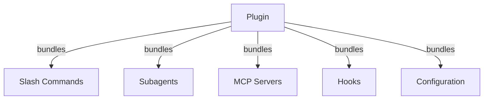
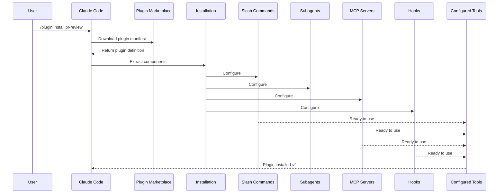
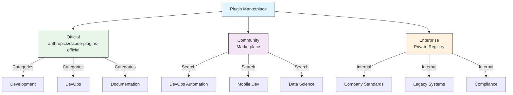
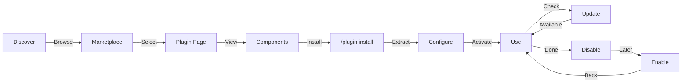
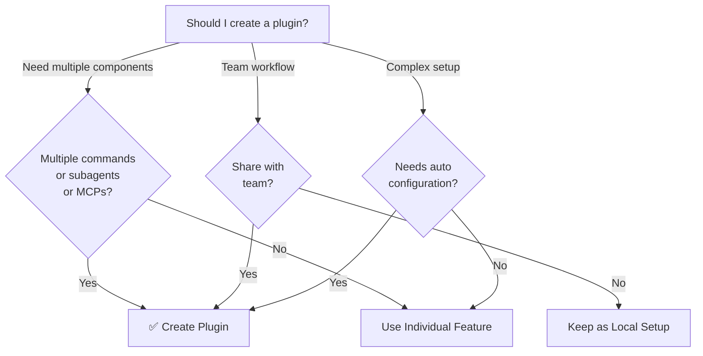

<picture>
  <source media="(prefers-color-scheme: dark)" srcset="../resources/logos/claude-howto-logo-dark.svg">
  
</picture>

# Claude Code 外掛

此資料夾包含完整的外掛範例，將多個 Claude Code 功能整合為一致的可安裝套件。

## 概覽

Claude Code 外掛是自訂功能的捆綁集合（斜線指令、子代理、MCP 伺服器和 hooks），只需一條指令即可安裝。它們是最高層級的擴展機制，將多個功能組合為一致且可共享的套件。

## 外掛架構



## 外掛載入流程



## 外掛類型與發布方式

| 類型 | 範圍 | 共享對象 | 管理權限 | 範例 |
|------|-------|--------|-----------|----------|
| 官方 | 全域 | 所有使用者 | Anthropic | PR Review, Security Guidance |
| 社群 | 公開 | 所有使用者 | 社群 | DevOps, Data Science |
| 組織 | 內部 | 團隊成員 | 公司 | 內部標準、工具 |
| 個人 | 個人 | 單一使用者 | 開發者 | 自訂工作流程 |

## 外掛定義結構

外掛清單使用 `.claude-plugin/plugin.json` 中的 JSON 格式：

```json
{
  "name": "my-first-plugin",
  "description": "A greeting plugin",
  "version": "1.0.0",
  "author": {
    "name": "Your Name"
  },
  "homepage": "https://example.com",
  "repository": "https://github.com/user/repo",
  "license": "MIT"
}
```

## 外掛結構範例

```
my-plugin/
├── .claude-plugin/
│   └── plugin.json       # Manifest (name, description, version, author)
├── commands/             # Skills as Markdown files
│   ├── task-1.md
│   ├── task-2.md
│   └── workflows/
├── agents/               # Custom agent definitions
│   ├── specialist-1.md
│   ├── specialist-2.md
│   └── configs/
├── skills/               # Agent Skills with SKILL.md files
│   ├── skill-1.md
│   └── skill-2.md
├── hooks/                # Event handlers in hooks.json
│   └── hooks.json
├── .mcp.json             # MCP server configurations
├── .lsp.json             # LSP server configurations
├── settings.json         # Default settings
├── templates/
│   └── issue-template.md
├── scripts/
│   ├── helper-1.sh
│   └── helper-2.py
├── docs/
│   ├── README.md
│   └── USAGE.md
└── tests/
    └── plugin.test.js
```

### LSP 伺服器設定

外掛可包含 Language Server Protocol (LSP) 支援，提供即時程式碼智慧功能。LSP 伺服器在您工作時提供診斷、程式碼導航和符號資訊。

**設定位置**：
- 外掛根目錄中的 `.lsp.json` 檔案
- `plugin.json` 中的內嵌 `lsp` 鍵

#### 欄位參考

| 欄位 | 必填 | 說明 |
|-------|----------|-------------|
| `command` | 是 | LSP 伺服器執行檔（必須在 PATH 中） |
| `extensionToLanguage` | 是 | 將副檔名對應至語言 ID |
| `args` | 否 | 伺服器的命令列參數 |
| `transport` | 否 | 通訊方式：`stdio`（預設）或 `socket` |
| `env` | 否 | 伺服器處理程序的環境變數 |
| `initializationOptions` | 否 | LSP 初始化時傳送的選項 |
| `settings` | 否 | 傳遞給伺服器的工作區設定 |
| `workspaceFolder` | 否 | 覆寫工作區資料夾路徑 |
| `startupTimeout` | 否 | 等待伺服器啟動的最長時間（毫秒） |
| `shutdownTimeout` | 否 | 優雅關閉的最長時間（毫秒） |
| `restartOnCrash` | 否 | 伺服器崩潰時自動重啟 |
| `maxRestarts` | 否 | 放棄前的最大重啟次數 |

#### 設定範例

**Go (gopls)**：

```json
{
  "go": {
    "command": "gopls",
    "args": ["serve"],
    "extensionToLanguage": {
      ".go": "go"
    }
  }
}
```

**Python (pyright)**：

```json
{
  "python": {
    "command": "pyright-langserver",
    "args": ["--stdio"],
    "extensionToLanguage": {
      ".py": "python",
      ".pyi": "python"
    }
  }
}
```

**TypeScript**：

```json
{
  "typescript": {
    "command": "typescript-language-server",
    "args": ["--stdio"],
    "extensionToLanguage": {
      ".ts": "typescript",
      ".tsx": "typescriptreact",
      ".js": "javascript",
      ".jsx": "javascriptreact"
    }
  }
}
```

#### 可用的 LSP 外掛

官方市集包含預設定的 LSP 外掛：

| 外掛 | 語言 | 伺服器執行檔 | 安裝指令 |
|--------|----------|---------------|----------------|
| `pyright-lsp` | Python | `pyright-langserver` | `pip install pyright` |
| `typescript-lsp` | TypeScript/JavaScript | `typescript-language-server` | `npm install -g typescript-language-server typescript` |
| `rust-lsp` | Rust | `rust-analyzer` | 透過 `rustup component add rust-analyzer` 安裝 |

#### LSP 功能

設定完成後，LSP 伺服器提供：

- **即時診斷** — 編輯後立即顯示錯誤和警告
- **程式碼導航** — 跳至定義、尋找參考、實作
- **懸停資訊** — 懸停時顯示型別簽名和文件
- **符號列表** — 瀏覽目前檔案或工作區中的符號

## 外掛選項（v2.1.83+）

外掛可在清單中透過 `userConfig` 宣告使用者可設定的選項。標記為 `sensitive: true` 的值會儲存在系統金鑰鏈而非純文字設定檔中：

```json
{
  "name": "my-plugin",
  "version": "1.0.0",
  "userConfig": {
    "apiKey": {
      "description": "API key for the service",
      "sensitive": true
    },
    "region": {
      "description": "Deployment region",
      "default": "us-east-1"
    }
  }
}
```

## 外掛持久化資料（`${CLAUDE_PLUGIN_DATA}`）（v2.1.78+）

外掛可透過 `${CLAUDE_PLUGIN_DATA}` 環境變數存取持久化狀態目錄。此目錄對每個外掛是唯一的，且在工作階段之間持續存在，適合用於快取、資料庫和其他持久化狀態：

```json
{
  "hooks": {
    "PostToolUse": [
      {
        "command": "node ${CLAUDE_PLUGIN_DATA}/track-usage.js"
      }
    ]
  }
}
```

此目錄在外掛安裝時自動建立。儲存於此的檔案在外掛解除安裝前持續存在。

## 透過設定內嵌外掛（`source: 'settings'`）（v2.1.80+）

外掛可在設定檔中以市集條目的形式使用 `source: 'settings'` 欄位進行內嵌定義。這樣無需獨立的儲存庫或市集即可直接嵌入外掛定義：

```json
{
  "pluginMarketplaces": [
    {
      "name": "inline-tools",
      "source": "settings",
      "plugins": [
        {
          "name": "quick-lint",
          "source": "./local-plugins/quick-lint"
        }
      ]
    }
  ]
}
```

## 外掛設定

外掛可隨附 `settings.json` 檔案來提供預設設定。目前支援 `agent` 鍵，用於設定外掛的主執行緒代理：

```json
{
  "agent": "agents/specialist-1.md"
}
```

當外掛包含 `settings.json` 時，其預設值會在安裝時套用。使用者可在自己的專案或使用者設定中覆寫這些設定。

## 獨立方式 vs. 外掛方式

| 方式 | 指令名稱 | 設定 | 適用情境 |
|----------|---------------|---|---|
| **獨立** | `/hello` | 在 CLAUDE.md 中手動設定 | 個人、專案特定 |
| **外掛** | `/plugin-name:hello` | 透過 plugin.json 自動化 | 共享、發布、團隊使用 |

**個人快速工作流程**使用獨立斜線指令。當您想捆綁多個功能、與團隊共享或發布供他人使用時，使用**外掛**。

## 實際範例

### 範例 1：PR Review 外掛

**檔案：** `.claude-plugin/plugin.json`

```json
{
  "name": "pr-review",
  "version": "1.0.0",
  "description": "Complete PR review workflow with security, testing, and docs",
  "author": {
    "name": "Anthropic"
  },
  "repository": "https://github.com/anthropic/pr-review",
  "license": "MIT"
}
```

**檔案：** `commands/review-pr.md`

```markdown
---
name: Review PR
description: Start comprehensive PR review with security and testing checks
---

# PR Review

This command initiates a complete pull request review including:

1. Security analysis
2. Test coverage verification
3. Documentation updates
4. Code quality checks
5. Performance impact assessment
```

**檔案：** `agents/security-reviewer.md`

```yaml
---
name: security-reviewer
description: Security-focused code review
tools: read, grep, diff
---

# Security Reviewer

Specializes in finding security vulnerabilities:
- Authentication/authorization issues
- Data exposure
- Injection attacks
- Secure configuration
```

**安裝：**

```bash
/plugin install pr-review

# Result:
# ✅ 3 slash commands installed
# ✅ 3 subagents configured
# ✅ 2 MCP servers connected
# ✅ 4 hooks registered
# ✅ Ready to use!
```

### 範例 2：DevOps 外掛

**元件：**

```
devops-automation/
├── commands/
│   ├── deploy.md
│   ├── rollback.md
│   ├── status.md
│   └── incident.md
├── agents/
│   ├── deployment-specialist.md
│   ├── incident-commander.md
│   └── alert-analyzer.md
├── mcp/
│   ├── github-config.json
│   ├── kubernetes-config.json
│   └── prometheus-config.json
├── hooks/
│   ├── pre-deploy.js
│   ├── post-deploy.js
│   └── on-error.js
└── scripts/
    ├── deploy.sh
    ├── rollback.sh
    └── health-check.sh
```

### 範例 3：文件外掛

**捆綁元件：**

```
documentation/
├── commands/
│   ├── generate-api-docs.md
│   ├── generate-readme.md
│   ├── sync-docs.md
│   └── validate-docs.md
├── agents/
│   ├── api-documenter.md
│   ├── code-commentator.md
│   └── example-generator.md
├── mcp/
│   ├── github-docs-config.json
│   └── slack-announce-config.json
└── templates/
    ├── api-endpoint.md
    ├── function-docs.md
    └── adr-template.md
```

## 外掛市集

官方由 Anthropic 管理的外掛目錄為 `anthropics/claude-plugins-official`。企業管理員也可建立私有外掛市集供內部發布。



### 市集設定

企業和進階使用者可透過設定控制市集行為：

| 設定 | 說明 |
|---------|-------------|
| `extraKnownMarketplaces` | 在預設來源以外新增額外的市集來源 |
| `strictKnownMarketplaces` | 控制使用者可以新增哪些市集 |
| `deniedPlugins` | 管理員管理的封鎖清單，防止特定外掛被安裝 |

### 額外市集功能

- **預設 git 逾時**：針對大型外掛儲存庫，從 30 秒增加至 120 秒
- **自訂 npm registry**：外掛可指定自訂 npm registry URL 以進行相依套件解析
- **版本鎖定**：將外掛鎖定至特定版本以確保環境可重現

### 市集定義結構

外掛市集在 `.claude-plugin/marketplace.json` 中定義：

```json
{
  "name": "my-team-plugins",
  "owner": "my-org",
  "plugins": [
    {
      "name": "code-standards",
      "source": "./plugins/code-standards",
      "description": "Enforce team coding standards",
      "version": "1.2.0",
      "author": "platform-team"
    },
    {
      "name": "deploy-helper",
      "source": {
        "source": "github",
        "repo": "my-org/deploy-helper",
        "ref": "v2.0.0"
      },
      "description": "Deployment automation workflows"
    }
  ]
}
```

| 欄位 | 必填 | 說明 |
|-------|----------|-------------|
| `name` | 是 | 市集名稱（kebab-case） |
| `owner` | 是 | 維護市集的組織或使用者 |
| `plugins` | 是 | 外掛條目陣列 |
| `plugins[].name` | 是 | 外掛名稱（kebab-case） |
| `plugins[].source` | 是 | 外掛來源（路徑字串或來源物件） |
| `plugins[].description` | 否 | 外掛簡短說明 |
| `plugins[].version` | 否 | 語意版本字串 |
| `plugins[].author` | 否 | 外掛作者名稱 |

### 外掛來源類型

外掛可從多個位置取得：

| 來源 | 語法 | 範例 |
|--------|--------|---------|
| **相對路徑** | 字串路徑 | `"./plugins/my-plugin"` |
| **GitHub** | `{ "source": "github", "repo": "owner/repo" }` | `{ "source": "github", "repo": "acme/lint-plugin", "ref": "v1.0" }` |
| **Git URL** | `{ "source": "url", "url": "..." }` | `{ "source": "url", "url": "https://git.internal/plugin.git" }` |
| **Git 子目錄** | `{ "source": "git-subdir", "url": "...", "path": "..." }` | `{ "source": "git-subdir", "url": "https://github.com/org/monorepo.git", "path": "packages/plugin" }` |
| **npm** | `{ "source": "npm", "package": "..." }` | `{ "source": "npm", "package": "@acme/claude-plugin", "version": "^2.0" }` |
| **pip** | `{ "source": "pip", "package": "..." }` | `{ "source": "pip", "package": "claude-data-plugin", "version": ">=1.0" }` |

GitHub 和 git 來源支援選填的 `ref`（分支/標籤）和 `sha`（提交雜湊）欄位以進行版本鎖定。

### 發布方法

**GitHub（建議）**：
```bash
# Users add your marketplace
/plugin marketplace add owner/repo-name
```

**其他 git 服務**（需要完整 URL）：
```bash
/plugin marketplace add https://gitlab.com/org/marketplace-repo.git
```

**私有儲存庫**：透過 git 認證助手或環境 token 支援。使用者必須擁有儲存庫的讀取權限。

**官方市集提交**：將外掛提交至 Anthropic 策劃的市集以獲得更廣泛的發布。

### 嚴格模式

控制市集定義如何與本地 `plugin.json` 檔案互動：

| 設定 | 行為 |
|---------|----------|
| `strict: true`（預設） | 本地 `plugin.json` 具有權威性；市集條目作為補充 |
| `strict: false` | 市集條目即完整的外掛定義 |

**使用 `strictKnownMarketplaces` 的組織限制**：

| 值 | 效果 |
|-------|--------|
| 未設定 | 無限制 — 使用者可新增任何市集 |
| 空陣列 `[]` | 鎖定 — 不允許任何市集 |
| 模式陣列 | 允許清單 — 只能新增符合的市集 |

```json
{
  "strictKnownMarketplaces": [
    "my-org/*",
    "github.com/trusted-vendor/*"
  ]
}
```

> **警告**：在嚴格模式加上 `strictKnownMarketplaces` 的情況下，使用者只能從允許清單中的市集安裝外掛。這對於需要受控外掛發布的企業環境非常有用。

## 外掛安裝與生命週期



## 外掛功能比較

| 功能 | Slash Command | Skill | Subagent | Plugin |
|---------|---------------|-------|----------|--------|
| **安裝** | 手動複製 | 手動複製 | 手動設定 | 一條指令 |
| **設定時間** | 5 分鐘 | 10 分鐘 | 15 分鐘 | 2 分鐘 |
| **捆綁** | 單一檔案 | 單一檔案 | 單一檔案 | 多個 |
| **版本管理** | 手動 | 手動 | 手動 | 自動 |
| **團隊共享** | 複製檔案 | 複製檔案 | 複製檔案 | 安裝 ID |
| **更新** | 手動 | 手動 | 手動 | 自動可用 |
| **相依套件** | 無 | 無 | 無 | 可能包含 |
| **市集** | 否 | 否 | 否 | 是 |
| **發布** | 儲存庫 | 儲存庫 | 儲存庫 | 市集 |

## 外掛 CLI 指令

所有外掛操作均可作為 CLI 指令使用：

```bash
claude plugin install <name>@<marketplace>   # Install from a marketplace
claude plugin uninstall <name>               # Remove a plugin
claude plugin list                           # List installed plugins
claude plugin enable <name>                  # Enable a disabled plugin
claude plugin disable <name>                 # Disable a plugin
claude plugin validate                       # Validate plugin structure
```

## 安裝方法

### 從市集安裝
```bash
/plugin install plugin-name
# or from CLI:
claude plugin install plugin-name@marketplace-name
```

### 啟用／停用（自動偵測範圍）
```bash
/plugin enable plugin-name
/plugin disable plugin-name
```

### 本地外掛（用於開發）
```bash
# CLI flag for local testing (repeatable for multiple plugins)
claude --plugin-dir ./path/to/plugin
claude --plugin-dir ./plugin-a --plugin-dir ./plugin-b
```

### 從 Git 儲存庫安裝
```bash
/plugin install github:username/repo
```

## 何時應建立外掛



### 外掛使用情境

| 使用情境 | 建議 | 原因 |
|----------|-----------------|-----|
| **團隊入職** | 使用外掛 | 即時設定，包含所有設定 |
| **框架設置** | 使用外掛 | 捆綁框架特定指令 |
| **企業標準** | 使用外掛 | 集中發布、版本控制 |
| **快速任務自動化** | 使用 Command | 過度複雜 |
| **單一領域專業** | 使用 Skill | 太重，改用 skill |
| **專業分析** | 使用 Subagent | 手動建立或使用 skill |
| **即時資料存取** | 使用 MCP | 獨立使用，不捆綁 |

## 測試外掛

發布前，使用 `--plugin-dir` CLI 旗標在本地測試您的外掛（可重複用於多個外掛）：

```bash
claude --plugin-dir ./my-plugin
claude --plugin-dir ./my-plugin --plugin-dir ./another-plugin
```

這會以已載入外掛的方式啟動 Claude Code，讓您能夠：
- 確認所有斜線指令均可用
- 測試子代理和代理是否正常運作
- 確認 MCP 伺服器正確連接
- 驗證 hook 執行
- 確認 LSP 伺服器設定
- 檢查是否有設定錯誤

## 熱重載

外掛在開發期間支援熱重載。當您修改外掛檔案時，Claude Code 可自動偵測變更。您也可以強制重載：

```bash
/reload-plugins
```

這會重新讀取所有外掛清單、指令、代理、skills、hooks 和 MCP/LSP 設定，無需重啟工作階段。

## 外掛的受管設定

管理員可使用受管設定在整個組織中控制外掛行為：

| 設定 | 說明 |
|---------|-------------|
| `enabledPlugins` | 預設啟用的外掛允許清單 |
| `deniedPlugins` | 無法安裝的外掛封鎖清單 |
| `extraKnownMarketplaces` | 在預設來源以外新增額外的市集來源 |
| `strictKnownMarketplaces` | 限制使用者可新增的市集 |
| `allowedChannelPlugins` | 控制每個發布管道允許的外掛 |

這些設定可透過受管設定檔在組織層級套用，並優先於使用者層級設定。

## 外掛安全性

外掛子代理在受限沙箱中執行。以下 frontmatter 鍵**不允許**出現在外掛子代理定義中：

- `hooks` -- 子代理無法登錄事件處理器
- `mcpServers` -- 子代理無法設定 MCP 伺服器
- `permissionMode` -- 子代理無法覆寫權限模型

這確保外掛無法提升權限或在其宣告範圍以外修改主機環境。

## 發布外掛

**發布步驟：**

1. 建立包含所有元件的外掛結構
2. 編寫 `.claude-plugin/plugin.json` 清單
3. 建立 `README.md` 文件
4. 使用 `claude --plugin-dir ./my-plugin` 在本地測試
5. 提交至外掛市集
6. 接受審查和核准
7. 在市集發布
8. 使用者可用一條指令安裝

**提交範例：**

```markdown
# PR Review Plugin

## Description
Complete PR review workflow with security, testing, and documentation checks.

## What's Included
- 3 slash commands for different review types
- 3 specialized subagents
- GitHub and CodeQL MCP integration
- Automated security scanning hooks

## Installation
```bash
/plugin install pr-review
```

## Features
✅ Security analysis
✅ Test coverage checking
✅ Documentation verification
✅ Code quality assessment
✅ Performance impact analysis

## Usage
```bash
/review-pr
/check-security
/check-tests
```

## Requirements
- Claude Code 1.0+
- GitHub access
- CodeQL (optional)
```

## 外掛 vs. 手動設定

**手動設定（2+ 小時）：**
- 逐一安裝斜線指令
- 個別建立子代理
- 分別設定 MCP
- 手動設置 hooks
- 記錄所有內容
- 與團隊共享（希望他們設定正確）

**使用外掛（2 分鐘）：**
```bash
/plugin install pr-review
# ✅ Everything installed and configured
# ✅ Ready to use immediately
# ✅ Team can reproduce exact setup
```

## 最佳實踐

### 應做的事
- 使用清晰、具描述性的外掛名稱
- 包含完整的 README
- 正確地為外掛版本編號（semver）
- 一起測試所有元件
- 清楚記錄需求
- 提供使用範例
- 包含錯誤處理
- 適當標籤以便搜尋發現
- 維持向下相容性
- 保持外掛專注且一致
- 包含完整的測試
- 記錄所有相依套件

### 不應做的事
- 不要捆綁不相關的功能
- 不要硬式編碼認證資訊
- 不要跳過測試
- 不要忘記文件
- 不要建立重複的外掛
- 不要忽略版本管理
- 不要過度複雜化元件相依關係
- 不要忘記優雅地處理錯誤

## 安裝說明

### 從市集安裝

1. **瀏覽可用外掛：**
   ```bash
   /plugin list
   ```

2. **查看外掛詳細資料：**
   ```bash
   /plugin info plugin-name
   ```

3. **安裝外掛：**
   ```bash
   /plugin install plugin-name
   ```

### 從本地路徑安裝

```bash
/plugin install ./path/to/plugin-directory
```

### 從 GitHub 安裝

```bash
/plugin install github:username/repo
```

### 列出已安裝的外掛

```bash
/plugin list --installed
```

### 更新外掛

```bash
/plugin update plugin-name
```

### 停用／啟用外掛

```bash
# Temporarily disable
/plugin disable plugin-name

# Re-enable
/plugin enable plugin-name
```

### 解除安裝外掛

```bash
/plugin uninstall plugin-name
```

## 相關概念

以下 Claude Code 功能可與外掛搭配使用：

- **[Slash Commands](../01-slash-commands/)** - 外掛中捆綁的個別指令
- **[Memory](../02-memory/)** - 外掛的持久化上下文
- **[Skills](../03-skills/)** - 可包裝進外掛的領域專業能力
- **[Subagents](../04-subagents/)** - 作為外掛元件包含的專業代理
- **[MCP Servers](../05-mcp/)** - 外掛中捆綁的 Model Context Protocol 整合
- **[Hooks](../06-hooks/)** - 觸發外掛工作流程的事件處理器

## 完整範例工作流程

### PR Review 外掛完整工作流程

```
1. User: /review-pr

2. Plugin executes:
   ├── pre-review.js hook validates git repo
   ├── GitHub MCP fetches PR data
   ├── security-reviewer subagent analyzes security
   ├── test-checker subagent verifies coverage
   └── performance-analyzer subagent checks performance

3. Results synthesized and presented:
   ✅ Security: No critical issues
   ⚠️  Testing: Coverage 65% (recommend 80%+)
   ✅ Performance: No significant impact
   📝 12 recommendations provided
```

## 疑難排解

### 外掛無法安裝
- 確認 Claude Code 版本相容性：`/version`
- 使用 JSON 驗證器確認 `plugin.json` 語法
- 確認網路連線（針對遠端外掛）
- 確認權限：`ls -la plugin/`

### 元件未載入
- 確認 `plugin.json` 中的路徑與實際目錄結構相符
- 確認檔案權限：`chmod +x scripts/`
- 確認元件檔案語法
- 查看記錄：`/plugin debug plugin-name`

### MCP 連接失敗
- 確認環境變數設定正確
- 確認 MCP 伺服器安裝和健康狀態
- 使用 `/mcp test` 獨立測試 MCP 連接
- 確認 `mcp/` 目錄中的 MCP 設定

### 安裝後指令不可用
- 確認外掛安裝成功：`/plugin list --installed`
- 確認外掛已啟用：`/plugin status plugin-name`
- 重啟 Claude Code：`exit` 後重新開啟
- 確認與現有指令沒有命名衝突

### Hook 執行問題
- 確認 hook 檔案有正確的權限
- 確認 hook 語法和事件名稱
- 查看 hook 記錄以取得錯誤詳情
- 如果可能，手動測試 hooks

## 額外資源

- [官方外掛文件](https://code.claude.com/docs/en/plugins)
- [探索外掛](https://code.claude.com/docs/en/discover-plugins)
- [外掛市集](https://code.claude.com/docs/en/plugin-marketplaces)
- [外掛參考](https://code.claude.com/docs/en/plugins-reference)
- [MCP 伺服器參考](https://modelcontextprotocol.io/)
- [子代理設定指南](../04-subagents/README.md)
- [Hook 系統參考](../06-hooks/README.md)

