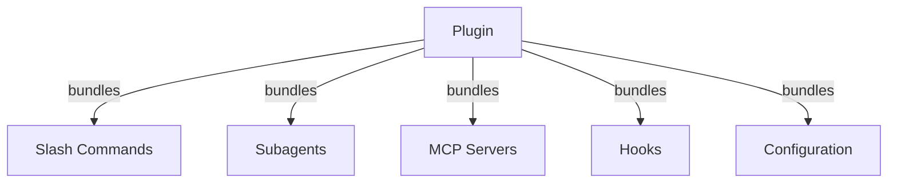
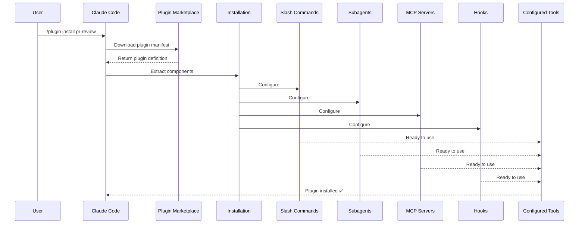
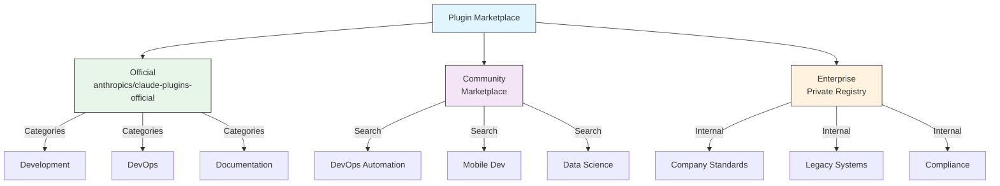
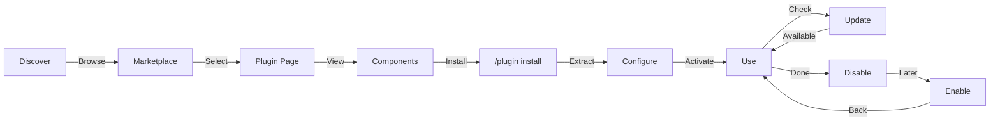
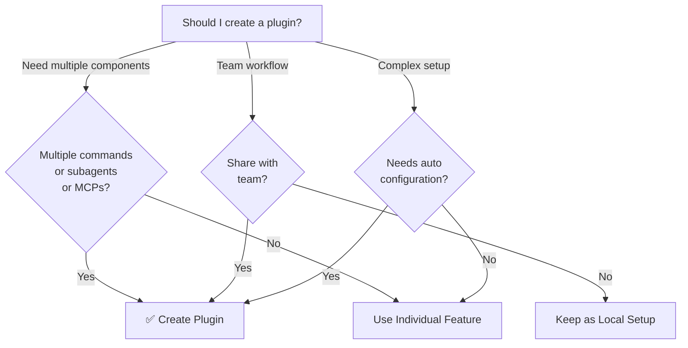

<picture>
  <source media="(prefers-color-scheme: dark)" srcset="../resources/logos/claude-howto-logo-dark.svg">
  
</picture>

# Claude Code Plugins

本資料夾包含完整的 plugin 範例，將多個 Claude Code 功能捆綁成一致的、可安裝的套件。

## 概述

Claude Code Plugins 是自訂項目（slash commands、subagents、MCP 伺服器和 hooks）的捆綁集合，只需一個命令即可安裝。它們代表最高層級的擴充機制——將多種功能結合成一致的、可分享的套件。

## Plugin 架構



## Plugin 載入流程



## Plugin 類型與發布

| 類型 | 範圍 | 共享 | 授權 | 範例 |
|------|------|------|------|------|
| Official | 全域 | 所有使用者 | Anthropic | PR Review、Security Guidance |
| Community | 公開 | 所有使用者 | 社群 | DevOps、Data Science |
| Organization | 內部 | 團隊成員 | 公司 | 內部標準、工具 |
| Personal | 個人 | 單一使用者 | 開發者 | 自訂工作流程 |

## Plugin 定義結構

Plugin manifest 使用 JSON 格式，位於 `.claude-plugin/plugin.json`：

```json
{
  "name": "my-first-plugin",
  "description": "A greeting plugin",
  "version": "1.0.0",
  "author": {
    "name": "Your Name"
  },
  "homepage": "https://example.com",
  "repository": "https://github.com/user/repo",
  "license": "MIT"
}
```

## Plugin 結構範例

```
my-plugin/
├── .claude-plugin/
│   └── plugin.json       # Manifest（名稱、描述、版本、作者）
├── commands/             # 以 Markdown 檔案定義的 Skills
│   ├── task-1.md
│   ├── task-2.md
│   └── workflows/
├── agents/               # 自訂 agent 定義
│   ├── specialist-1.md
│   ├── specialist-2.md
│   └── configs/
├── skills/               # 含 SKILL.md 檔案的 Agent Skills
│   ├── skill-1.md
│   └── skill-2.md
├── hooks/                # hooks.json 中的事件處理器
│   └── hooks.json
├── .mcp.json             # MCP 伺服器配置
├── .lsp.json             # LSP 伺服器配置
├── settings.json         # 預設設定
├── templates/
│   └── issue-template.md
├── scripts/
│   ├── helper-1.sh
│   └── helper-2.py
├── docs/
│   ├── README.md
│   └── USAGE.md
└── tests/
    └── plugin.test.js
```

### LSP 伺服器配置

Plugins 可以包含 Language Server Protocol (LSP) 支援，用於即時程式碼智慧分析。LSP 伺服器在您工作時提供診斷、程式碼導覽和符號資訊。

**配置位置**：
- Plugin 根目錄中的 `.lsp.json` 檔案
- `plugin.json` 中的內嵌 `lsp` 鍵

#### 欄位參考

| 欄位 | 必填 | 說明 |
|------|------|------|
| `command` | 是 | LSP 伺服器二進位檔（必須在 PATH 中） |
| `extensionToLanguage` | 是 | 將副檔名對應到語言 ID |
| `args` | 否 | 伺服器的命令列引數 |
| `transport` | 否 | 通訊方式：`stdio`（預設）或 `socket` |
| `env` | 否 | 伺服器程序的環境變數 |
| `initializationOptions` | 否 | LSP 初始化時傳送的選項 |
| `settings` | 否 | 傳遞給伺服器的工作區配置 |
| `workspaceFolder` | 否 | 覆寫工作區資料夾路徑 |
| `startupTimeout` | 否 | 等待伺服器啟動的最長時間（毫秒） |
| `shutdownTimeout` | 否 | 優雅關閉的最長時間（毫秒） |
| `restartOnCrash` | 否 | 伺服器崩潰時自動重啟 |
| `maxRestarts` | 否 | 放棄前的最大重啟次數 |

#### 配置範例

**Go (gopls)**：

```json
{
  "go": {
    "command": "gopls",
    "args": ["serve"],
    "extensionToLanguage": {
      ".go": "go"
    }
  }
}
```

**Python (pyright)**：

```json
{
  "python": {
    "command": "pyright-langserver",
    "args": ["--stdio"],
    "extensionToLanguage": {
      ".py": "python",
      ".pyi": "python"
    }
  }
}
```

**TypeScript**：

```json
{
  "typescript": {
    "command": "typescript-language-server",
    "args": ["--stdio"],
    "extensionToLanguage": {
      ".ts": "typescript",
      ".tsx": "typescriptreact",
      ".js": "javascript",
      ".jsx": "javascriptreact"
    }
  }
}
```

#### 可用的 LSP plugins

官方市集包含預先配置的 LSP plugins：

| Plugin | 語言 | 伺服器二進位檔 | 安裝命令 |
|--------|------|----------------|----------|
| `pyright-lsp` | Python | `pyright-langserver` | `pip install pyright` |
| `typescript-lsp` | TypeScript/JavaScript | `typescript-language-server` | `npm install -g typescript-language-server typescript` |
| `rust-lsp` | Rust | `rust-analyzer` | 透過 `rustup component add rust-analyzer` 安裝 |

#### LSP 功能

配置完成後，LSP 伺服器提供：

- **即時診斷** — 編輯後立即顯示錯誤和警告
- **程式碼導覽** — 前往定義、尋找參照、實作
- **懸停資訊** — 懸停時顯示型別簽名和文件
- **符號列表** — 瀏覽目前檔案或工作區中的符號

## Plugin 選項（v2.1.83+）

Plugins 可以在 manifest 中透過 `userConfig` 宣告使用者可配置的選項。標記為 `sensitive: true` 的值會儲存在系統金鑰鏈中，而非純文字設定檔：

```json
{
  "name": "my-plugin",
  "version": "1.0.0",
  "userConfig": {
    "apiKey": {
      "description": "API key for the service",
      "sensitive": true
    },
    "region": {
      "description": "Deployment region",
      "default": "us-east-1"
    }
  }
}
```

## 持久化 Plugin 資料（`${CLAUDE_PLUGIN_DATA}`）（v2.1.78+）

Plugins 可以透過 `${CLAUDE_PLUGIN_DATA}` 環境變數存取持久化狀態目錄。此目錄對每個 plugin 是唯一的，且跨工作階段持續存在，適用於快取、資料庫和其他持久化狀態：

```json
{
  "hooks": {
    "PostToolUse": [
      {
        "command": "node ${CLAUDE_PLUGIN_DATA}/track-usage.js"
      }
    ]
  }
}
```

此目錄在 plugin 安裝時自動建立。儲存在此處的檔案會持續保留，直到 plugin 被解除安裝。

## 透過設定的內嵌 Plugin（`source: 'settings'`）（v2.1.80+）

Plugins 可以在設定檔中作為市集項目以內嵌方式定義，使用 `source: 'settings'` 欄位。這允許直接嵌入 plugin 定義，無需獨立的儲存庫或市集：

```json
{
  "pluginMarketplaces": [
    {
      "name": "inline-tools",
      "source": "settings",
      "plugins": [
        {
          "name": "quick-lint",
          "source": "./local-plugins/quick-lint"
        }
      ]
    }
  ]
}
```

## Plugin 設定

Plugins 可以附帶 `settings.json` 檔案以提供預設配置。目前支援 `agent` 鍵，用於設定 plugin 的主執行緒 agent：

```json
{
  "agent": "agents/specialist-1.md"
}
```

當 plugin 包含 `settings.json` 時，其預設值會在安裝時套用。使用者可以在自己的專案或使用者配置中覆寫這些設定。

## 獨立式與 Plugin 方式比較

| 方式 | 命令名稱 | 配置 | 最適合 |
|------|----------|------|--------|
| **獨立式** | `/hello` | 在 CLAUDE.md 中手動設定 | 個人、專案特定 |
| **Plugins** | `/plugin-name:hello` | 透過 plugin.json 自動化 | 分享、發布、團隊使用 |

對於快速的個人工作流程，使用**獨立式 slash commands**。當您想捆綁多個功能、與團隊分享或發布以供分發時，使用 **plugins**。

## 實用範例

### 範例 1：PR Review Plugin

**檔案：** `.claude-plugin/plugin.json`

```json
{
  "name": "pr-review",
  "version": "1.0.0",
  "description": "Complete PR review workflow with security, testing, and docs",
  "author": {
    "name": "Anthropic"
  },
  "repository": "https://github.com/anthropic/pr-review",
  "license": "MIT"
}
```

**檔案：** `commands/review-pr.md`

```markdown
---
name: Review PR
description: Start comprehensive PR review with security and testing checks
---

# PR Review

This command initiates a complete pull request review including:

1. Security analysis
2. Test coverage verification
3. Documentation updates
4. Code quality checks
5. Performance impact assessment
```

**檔案：** `agents/security-reviewer.md`

```yaml
---
name: security-reviewer
description: Security-focused code review
tools: read, grep, diff
---

# Security Reviewer

Specializes in finding security vulnerabilities:
- Authentication/authorization issues
- Data exposure
- Injection attacks
- Secure configuration
```

**安裝：**

```bash
/plugin install pr-review

# Result:
# ✅ 3 slash commands installed
# ✅ 3 subagents configured
# ✅ 2 MCP servers connected
# ✅ 4 hooks registered
# ✅ Ready to use!
```

### 範例 2：DevOps Plugin

**組件：**

```
devops-automation/
├── commands/
│   ├── deploy.md
│   ├── rollback.md
│   ├── status.md
│   └── incident.md
├── agents/
│   ├── deployment-specialist.md
│   ├── incident-commander.md
│   └── alert-analyzer.md
├── mcp/
│   ├── github-config.json
│   ├── kubernetes-config.json
│   └── prometheus-config.json
├── hooks/
│   ├── pre-deploy.js
│   ├── post-deploy.js
│   └── on-error.js
└── scripts/
    ├── deploy.sh
    ├── rollback.sh
    └── health-check.sh
```

### 範例 3：Documentation Plugin

**捆綁的組件：**

```
documentation/
├── commands/
│   ├── generate-api-docs.md
│   ├── generate-readme.md
│   ├── sync-docs.md
│   └── validate-docs.md
├── agents/
│   ├── api-documenter.md
│   ├── code-commentator.md
│   └── example-generator.md
├── mcp/
│   ├── github-docs-config.json
│   └── slack-announce-config.json
└── templates/
    ├── api-endpoint.md
    ├── function-docs.md
    └── adr-template.md
```

## Plugin 市集

官方 Anthropic 管理的 plugin 目錄是 `anthropics/claude-plugins-official`。企業管理員也可以建立私有 plugin 市集以供內部分發。



### 市集配置

企業和進階使用者可以透過設定控制市集行為：

| 設定 | 說明 |
|------|------|
| `extraKnownMarketplaces` | 在預設值之外新增額外的市集來源 |
| `strictKnownMarketplaces` | 控制使用者可以新增的市集 |
| `deniedPlugins` | 管理員管理的封鎖清單，防止特定 plugins 被安裝 |

### 額外市集功能

- **預設 git 逾時時間**：從 30 秒增加到 120 秒，適用於大型 plugin 儲存庫
- **自訂 npm 登錄檔**：Plugins 可以指定自訂 npm 登錄檔 URL 以進行依賴解析
- **版本鎖定**：將 plugins 鎖定到特定版本以確保可重現的環境

### 市集定義結構

Plugin 市集定義在 `.claude-plugin/marketplace.json` 中：

```json
{
  "name": "my-team-plugins",
  "owner": "my-org",
  "plugins": [
    {
      "name": "code-standards",
      "source": "./plugins/code-standards",
      "description": "Enforce team coding standards",
      "version": "1.2.0",
      "author": "platform-team"
    },
    {
      "name": "deploy-helper",
      "source": {
        "source": "github",
        "repo": "my-org/deploy-helper",
        "ref": "v2.0.0"
      },
      "description": "Deployment automation workflows"
    }
  ]
}
```

| 欄位 | 必填 | 說明 |
|------|------|------|
| `name` | 是 | 市集名稱，使用 kebab-case |
| `owner` | 是 | 維護市集的組織或使用者 |
| `plugins` | 是 | Plugin 項目陣列 |
| `plugins[].name` | 是 | Plugin 名稱（kebab-case） |
| `plugins[].source` | 是 | Plugin 來源（路徑字串或來源物件） |
| `plugins[].description` | 否 | 簡短的 plugin 描述 |
| `plugins[].version` | 否 | 語意化版本字串 |
| `plugins[].author` | 否 | Plugin 作者名稱 |

### Plugin 來源類型

Plugins 可以從多個位置取得：

| 來源 | 語法 | 範例 |
|------|------|------|
| **相對路徑** | 字串路徑 | `"./plugins/my-plugin"` |
| **GitHub** | `{ "source": "github", "repo": "owner/repo" }` | `{ "source": "github", "repo": "acme/lint-plugin", "ref": "v1.0" }` |
| **Git URL** | `{ "source": "url", "url": "..." }` | `{ "source": "url", "url": "https://git.internal/plugin.git" }` |
| **Git 子目錄** | `{ "source": "git-subdir", "url": "...", "path": "..." }` | `{ "source": "git-subdir", "url": "https://github.com/org/monorepo.git", "path": "packages/plugin" }` |
| **npm** | `{ "source": "npm", "package": "..." }` | `{ "source": "npm", "package": "@acme/claude-plugin", "version": "^2.0" }` |
| **pip** | `{ "source": "pip", "package": "..." }` | `{ "source": "pip", "package": "claude-data-plugin", "version": ">=1.0" }` |

GitHub 和 git 來源支援可選的 `ref`（分支/標籤）和 `sha`（提交雜湊值）欄位以進行版本鎖定。

### 發布方式

**GitHub（建議）**：
```bash
# 使用者新增您的市集
/plugin marketplace add owner/repo-name
```

**其他 git 服務**（需要完整 URL）：
```bash
/plugin marketplace add https://gitlab.com/org/marketplace-repo.git
```

**私有儲存庫**：透過 git 認證助手或環境權杖支援。使用者必須擁有儲存庫的讀取權限。

**官方市集提交**：將 plugins 提交到 Anthropic 策展的市集以獲得更廣泛的分發。

### 嚴格模式

控制市集定義如何與本機 `plugin.json` 檔案互動：

| 設定 | 行為 |
|------|------|
| `strict: true`（預設） | 本機 `plugin.json` 具有權威性；市集項目作為補充 |
| `strict: false` | 市集項目即為完整的 plugin 定義 |

**使用 `strictKnownMarketplaces` 的組織限制**：

| 值 | 效果 |
|----|------|
| 未設定 | 無限制 — 使用者可以新增任何市集 |
| 空陣列 `[]` | 鎖定 — 不允許任何市集 |
| 模式陣列 | 允許清單 — 僅符合的市集可以被新增 |

```json
{
  "strictKnownMarketplaces": [
    "my-org/*",
    "github.com/trusted-vendor/*"
  ]
}
```

> **警告**：在嚴格模式下使用 `strictKnownMarketplaces`，使用者只能從允許清單中的市集安裝 plugins。這對需要控制 plugin 分發的企業環境非常有用。

## Plugin 安裝與生命週期



## Plugin 功能比較

| 功能 | Slash Command | Skill | Subagent | Plugin |
|------|---------------|-------|----------|--------|
| **安裝** | 手動複製 | 手動複製 | 手動配置 | 一個命令 |
| **設定時間** | 5 分鐘 | 10 分鐘 | 15 分鐘 | 2 分鐘 |
| **捆綁** | 單一檔案 | 單一檔案 | 單一檔案 | 多個 |
| **版本控制** | 手動 | 手動 | 手動 | 自動 |
| **團隊分享** | 複製檔案 | 複製檔案 | 複製檔案 | 安裝 ID |
| **更新** | 手動 | 手動 | 手動 | 自動可用 |
| **依賴** | 無 | 無 | 無 | 可能包含 |
| **市集** | 否 | 否 | 否 | 是 |
| **分發** | 儲存庫 | 儲存庫 | 儲存庫 | 市集 |

## Plugin CLI 命令

所有 plugin 操作都可作為 CLI 命令使用：

```bash
claude plugin install <name>@<marketplace>   # 從市集安裝
claude plugin uninstall <name>               # 移除 plugin
claude plugin list                           # 列出已安裝的 plugins
claude plugin enable <name>                  # 啟用已停用的 plugin
claude plugin disable <name>                 # 停用 plugin
claude plugin validate                       # 驗證 plugin 結構
```

## 安裝方式

### 從市集安裝
```bash
/plugin install plugin-name
# 或從 CLI：
claude plugin install plugin-name@marketplace-name
```

### 啟用 / 停用（自動偵測範圍）
```bash
/plugin enable plugin-name
/plugin disable plugin-name
```

### 本機 Plugin（用於開發）
```bash
# 用於本機測試的 CLI 旗標（可重複使用以載入多個 plugins）
claude --plugin-dir ./path/to/plugin
claude --plugin-dir ./plugin-a --plugin-dir ./plugin-b
```

### 從 Git 儲存庫安裝
```bash
/plugin install github:username/repo
```

## 何時建立 Plugin



### Plugin 使用案例

| 使用案例 | 建議 | 原因 |
|----------|------|------|
| **團隊上手** | ✅ 使用 Plugin | 即時設定，所有配置一次到位 |
| **框架設定** | ✅ 使用 Plugin | 捆綁框架特定的命令 |
| **企業標準** | ✅ 使用 Plugin | 集中分發、版本控制 |
| **快速任務自動化** | ❌ 使用 Command | 過度複雜 |
| **單一領域專業知識** | ❌ 使用 Skill | 太重，改用 skill |
| **專業分析** | ❌ 使用 Subagent | 手動建立或使用 skill |
| **即時資料存取** | ❌ 使用 MCP | 獨立使用，不需捆綁 |

## 測試 Plugin

發布前，使用 `--plugin-dir` CLI 旗標在本機測試您的 plugin（可重複使用以載入多個 plugins）：

```bash
claude --plugin-dir ./my-plugin
claude --plugin-dir ./my-plugin --plugin-dir ./another-plugin
```

這會啟動載入您的 plugin 的 Claude Code，讓您可以：
- 驗證所有 slash commands 是否可用
- 測試 subagents 和 agents 是否正常運作
- 確認 MCP 伺服器是否正確連線
- 驗證 hook 執行
- 檢查 LSP 伺服器配置
- 檢查是否有任何配置錯誤

## 熱重載

Plugins 在開發期間支援熱重載。當您修改 plugin 檔案時，Claude Code 可以自動偵測變更。您也可以使用以下命令強制重新載入：

```bash
/reload-plugins
```

這會重新讀取所有 plugin manifest、commands、agents、skills、hooks 和 MCP/LSP 配置，無需重新啟動工作階段。

## Plugins 的管理設定

管理員可以使用管理設定跨組織控制 plugin 行為：

| 設定 | 說明 |
|------|------|
| `enabledPlugins` | 預設啟用的 plugins 允許清單 |
| `deniedPlugins` | 無法安裝的 plugins 封鎖清單 |
| `extraKnownMarketplaces` | 在預設值之外新增額外的市集來源 |
| `strictKnownMarketplaces` | 限制使用者可以新增的市集 |
| `allowedChannelPlugins` | 控制每個發布通道允許的 plugins |

這些設定可以透過管理配置檔在組織層級套用，並優先於使用者層級的設定。

## Plugin 安全性

Plugin subagents 在受限的沙箱中執行。以下 frontmatter 鍵在 plugin subagent 定義中**不允許**使用：

- `hooks` -- Subagents 不能註冊事件處理器
- `mcpServers` -- Subagents 不能配置 MCP 伺服器
- `permissionMode` -- Subagents 不能覆寫權限模型

這確保 plugins 不能提升權限或在其宣告的範圍之外修改主機環境。

## 發布 Plugin

**發布步驟：**

1. 建立包含所有組件的 plugin 結構
2. 撰寫 `.claude-plugin/plugin.json` manifest
3. 建立包含文件的 `README.md`
4. 使用 `claude --plugin-dir ./my-plugin` 在本機測試
5. 提交到 plugin 市集
6. 接受審查和核准
7. 在市集上發布
8. 使用者可以用一個命令安裝

**提交範例：**

```markdown
# PR Review Plugin

## Description
Complete PR review workflow with security, testing, and documentation checks.

## What's Included
- 3 slash commands for different review types
- 3 specialized subagents
- GitHub and CodeQL MCP integration
- Automated security scanning hooks

## Installation
```bash
/plugin install pr-review
```

## Features
✅ Security analysis
✅ Test coverage checking
✅ Documentation verification
✅ Code quality assessment
✅ Performance impact analysis

## Usage
```bash
/review-pr
/check-security
/check-tests
```

## Requirements
- Claude Code 1.0+
- GitHub access
- CodeQL (optional)
```

## Plugin 與手動配置比較

**手動設定（2+ 小時）：**
- 逐一安裝 slash commands
- 個別建立 subagents
- 分別配置 MCPs
- 手動設定 hooks
- 撰寫所有文件
- 與團隊分享（希望他們配置正確）

**使用 Plugin（2 分鐘）：**
```bash
/plugin install pr-review
# ✅ Everything installed and configured
# ✅ Ready to use immediately
# ✅ Team can reproduce exact setup
```

## 最佳實踐

### 應該做的 ✅
- 使用清晰、描述性的 plugin 名稱
- 包含完整的 README
- 正確地版本化您的 plugin（semver）
- 一起測試所有組件
- 清楚記錄需求
- 提供使用範例
- 包含錯誤處理
- 適當地標記以利發現
- 維持向後相容性
- 保持 plugins 專注且一致
- 包含完整的測試
- 記錄所有依賴

### 不應該做的 ❌
- 不要捆綁不相關的功能
- 不要硬編碼認證資訊
- 不要跳過測試
- 不要忘記文件
- 不要建立冗餘的 plugins
- 不要忽略版本控制
- 不要過度複雜化組件依賴
- 不要忘記優雅地處理錯誤

## 安裝說明

### 從市集安裝

1. **瀏覽可用的 plugins：**
   ```bash
   /plugin list
   ```

2. **檢視 plugin 詳情：**
   ```bash
   /plugin info plugin-name
   ```

3. **安裝 plugin：**
   ```bash
   /plugin install plugin-name
   ```

### 從本機路徑安裝

```bash
/plugin install ./path/to/plugin-directory
```

### 從 GitHub 安裝

```bash
/plugin install github:username/repo
```

### 列出已安裝的 Plugins

```bash
/plugin list --installed
```

### 更新 Plugin

```bash
/plugin update plugin-name
```

### 停用 / 啟用 Plugin

```bash
# 暫時停用
/plugin disable plugin-name

# 重新啟用
/plugin enable plugin-name
```

### 解除安裝 Plugin

```bash
/plugin uninstall plugin-name
```

## 相關概念

以下 Claude Code 功能與 plugins 搭配使用：

- **[Slash Commands](../01-slash-commands/)** - 在 plugins 中捆綁的個別命令
- **[Memory](../02-memory/)** - Plugins 的持久化上下文
- **[Skills](../03-skills/)** - 可包裝成 plugins 的領域專業知識
- **[Subagents](../04-subagents/)** - 作為 plugin 組件的專業 agents
- **[MCP Servers](../05-mcp/)** - 在 plugins 中捆綁的 Model Context Protocol 整合
- **[Hooks](../06-hooks/)** - 觸發 plugin 工作流程的事件處理器

## 完整範例工作流程

### PR Review Plugin 完整工作流程

```
1. User: /review-pr

2. Plugin executes:
   ├── pre-review.js hook validates git repo
   ├── GitHub MCP fetches PR data
   ├── security-reviewer subagent analyzes security
   ├── test-checker subagent verifies coverage
   └── performance-analyzer subagent checks performance

3. Results synthesized and presented:
   ✅ Security: No critical issues
   ⚠️  Testing: Coverage 65% (recommend 80%+)
   ✅ Performance: No significant impact
   📝 12 recommendations provided
```

## 疑難排解

### Plugin 無法安裝
- 檢查 Claude Code 版本相容性：`/version`
- 使用 JSON 驗證器驗證 `plugin.json` 語法
- 檢查網路連線（對於遠端 plugins）
- 檢視權限：`ls -la plugin/`

### 組件未載入
- 驗證 `plugin.json` 中的路徑與實際目錄結構相符
- 檢查檔案權限：`chmod +x scripts/`
- 檢視組件檔案語法
- 檢查日誌：`/plugin debug plugin-name`

### MCP 連線失敗
- 驗證環境變數設定正確
- 檢查 MCP 伺服器安裝和健康狀態
- 使用 `/mcp test` 獨立測試 MCP 連線
- 檢視 `mcp/` 目錄中的 MCP 配置

### 安裝後命令不可用
- 確保 plugin 已成功安裝：`/plugin list --installed`
- 檢查 plugin 是否已啟用：`/plugin status plugin-name`
- 重新啟動 Claude Code：`exit` 然後重新開啟
- 檢查是否與現有命令有命名衝突

### Hook 執行問題
- 驗證 hook 檔案是否有正確的權限
- 檢查 hook 語法和事件名稱
- 檢視 hook 日誌以取得錯誤詳情
- 如果可能，手動測試 hooks

## 額外資源

- [官方 Plugins 文件](https://code.claude.com/docs/en/plugins)
- [探索 Plugins](https://code.claude.com/docs/en/discover-plugins)
- [Plugin 市集](https://code.claude.com/docs/en/plugin-marketplaces)
- [Plugins 參考](https://code.claude.com/docs/en/plugins-reference)
- [MCP Server 參考](https://modelcontextprotocol.io/)
- [Subagent 配置指南](../04-subagents/README.md)
- [Hook 系統參考](../06-hooks/README.md)
