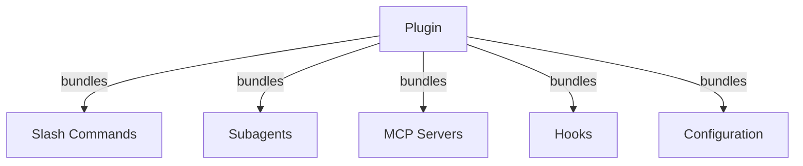
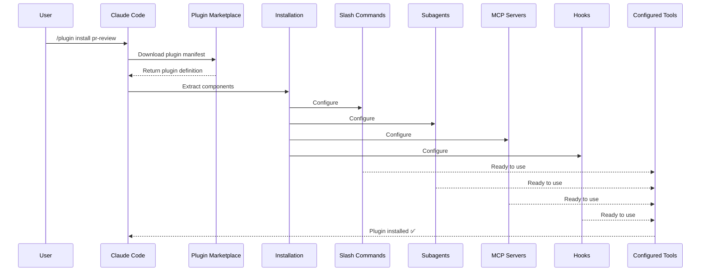
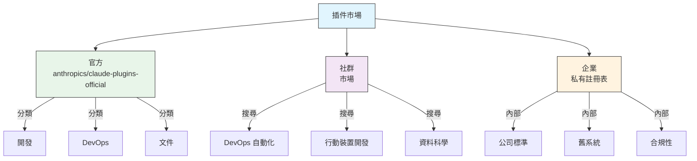
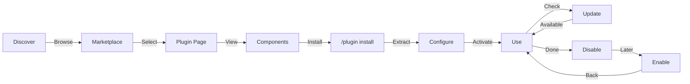
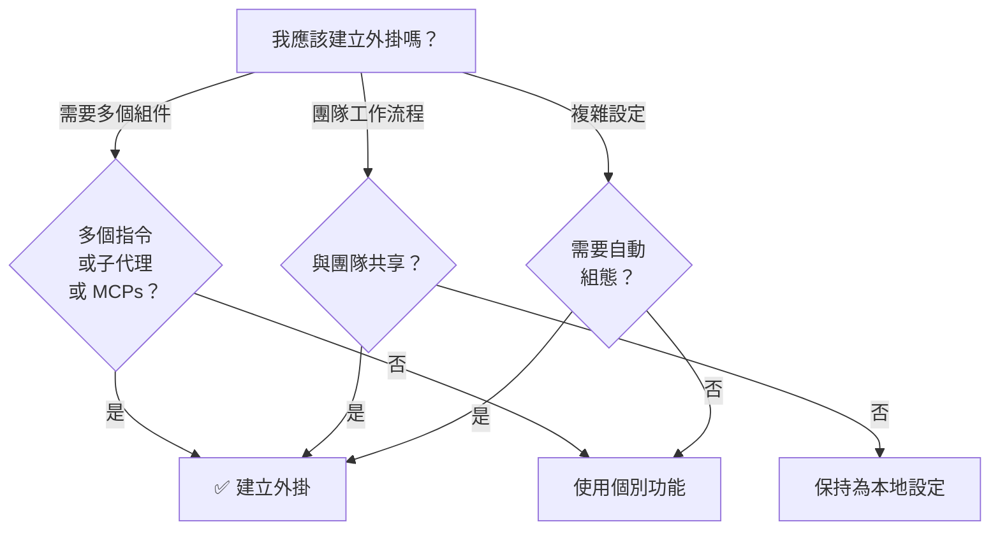

<picture>
  <source media="(prefers-color-scheme: dark)" srcset="../resources/logos/claude-howto-logo-dark.svg">
  
</picture>

# Claude Code Plugins

此資料夾包含完整的外掛範例，將多個 Claude Code 功能打包成具備凝聚力且可安裝的套件。

## 概觀

Claude Code Plugins 是將多種自定義功能（斜線命令、子代理、MCP servers 與鉤子）打包在一起的集合，只需透過單一指令即可完成安裝。它們代表了最高層級的擴充機制——將多個功能整合為凝聚力強且可共用的套件。

## 外掛架構


```mermaid
graph TB
    A["Plugin"]
    B["Slash Commands"]
    C["Subagents"]
    D["MCP Servers"]
    E["Hooks"]
    F["Configuration"]

    A -->|bundles| B
    A -->|bundles| C
    A -->|bundles| D
    A -->|bundles| E
    A -->|bundles| F
```

## 外掛載入流程


```mermaid
sequenceDiagram
    participant User
    participant Claude as Claude Code
    participant Plugin as Plugin Marketplace
    participant Install as Installation
    participant SlashCmds as Slash Commands
    participant Subagents
    participant MCPServers as MCP Servers
    participant Hooks
    participant Tools as Configured Tools

    User->>Claude: /plugin install pr-review
    Claude->>Plugin: Download plugin manifest
    Plugin-->>Claude: Return plugin definition
    Claude->>Install: Extract components
    Install->>SlashCmds: Configure
    Install->>Subagents: Configure
    Install->>MCPServers: Configure
    Install->>Hooks: Configure
    SlashCmds-->>Tools: Ready to use
    Subagents-->>Tools: Ready to use
    MCPServers-->>Tools: Ready to use
    Hooks-->>Tools: Ready to use
    Tools-->>Claude: Plugin installed ✅
```

## 外掛類型與分發方式

| 類型 | 範圍 | 共享 | 權限 | 範例 |
|------|-------|--------|-----------|----------|
| Official | 全域 | 所有人 | 權限 | PR Review, Security Guidance |
| Community | 公開 | 團隊成員 | 
| Organization | 內部 | 
| Personal | 個人 | 
| 範本 | 
| 
| 
| 
| 
| 
| 
| 
| 
| 
| 
| 
| 
| 
| 
| 
| 
| 
| 
| 
| 
| 
| 
| 
| 
| 
| 
| 
| 
| 
| 
| 
| 
| 
| 
| 
| 
| 
| 
| 
| 
| 
| 
| 
| 
| 
| 
| 
| 
| 
| 
| 
| 
| 
| 
| 
| 
| 
| 
| 
| 
| 
| 
| 
| 
| 
| 
| 
| 
| 
| 
| 
| 
| 
| 
| 
| 
| 
| 
| 
| 
| 
| 
| 
| 
| 
| 
| 
| 
| 
| 
| 
| 
| 
| 
| 
| 
| 
| 
| 
| 
| 
| 
| 
| 
| 
| 
| 
| 
| 
| 
| 
| 
| 
| 
| 
| 
| 
| 
| 
| 
| 
| 
| 
| 
| 
| 
| 
| 
| 
| 
| 
| 
| 
| 
| 
| 
| 
| 
| 
| 
| 
| 
| 
| 
| 
| 
| 
| 
| 
| 
| 
| 
| 
| 
| 
| 
| 
| 
| 
| 
| 
| 
| 
| 
| 
| 
| 
| 
| 
| 
| 
| 
| 
| 
| 
| 
| 
| 
| 
| 
| 
| 
| 
| 
| 
| 
| 
| 
| 
| 
| 
| 
| 
| 
| 
| 
| 
| 
| 
| 
| 
| 
| 
| 
| 
| 
| 
| 
| 
| 
| 
| 
| 
| 
| 
| 
| 
| 
| 
| 
| 
| 
| 
| 
| 
| 
| 
| 
| 
| 
| 
| 
| 
| 
| 
| 
| 
| 
| 
| 
| 
| 
| 
| 
| 
| 
| 
| 
| 
| 
| 
| 
| 
| 
| 
| 
| 
| 
| 
| 
| 
| 
| 
| 
| 
| 
| 
| 
| 
| 
| 
| 
| 
| 
| 
| 
| 
| 
| 
| 
| 
| 
| 
| 
| 
| 
| 
| 
| 
| 
| 
| 
| 
| 
| 
| 
| 
| 
| 
| 
| 
| 
| 
| 
| 
| 
| 
| 
| 
| 
| 
| 
| 
| 
| 
| 
| 
| 
| 
| 
| 
| 
| 
| 
| 
| 
| 
| 
| 
| 
| 
| 
| 
| 
| 
| 
| 
| 
| 
| 
| 
| 
| 
| 
| 
| 
| 
| 
| 
| 
| 
| 
| 
| 
| 
| 
| 
| 
| 
| 
| 
| 
| 
| 
| 
| 
| 
| 
| 
| 
| 
| 
| 
| 
| 
| 
| 
| 
| 
| 
| 
| 
| 
| 
| 
| 
| 
| 
| 
| 
| 
| 
| 
| 
| 
| 
| 
| 
| 
| 
| 
| 
| 
| 
| 
| 
| 
| 
| 
| 
| 
| 
| 
| 
| 
| 
| 
| 
| 
| 
| 
| 
| 
| 
| 
| 
| 
| 
| 
| 
| 
| 
| 
| 
| 
| 
| 
| 
| 
| 
| 
| 
| 
| 
| 
| 
| 
| 
| 
| 
| 
| 
| 
| 
| 
| 
| 
| 
| 
| 
| 
| 
| 
| 
| 
| 
| 
| 
| 
| 
| 
| 
| 
| 
| 
| 
| 
| 
| 
| 
| 
| 
| 
| 
| 
| 
| 
| 
| 
| 
| 
| 
| 
| 
| 
| 
| 
| 
| 
| 
| 
| 
| 
| 
| 
| 
| 
| 
| 
| 
| 
| 
| 
| 
| 
| 
| 
| 
| 
| 
| 
| 
| 
| 
| 
| 
| 
| 
| 
| 
| 
| 
| 
| 
| 
| 
| 
| 
| 
| 
| 
| 
| 
| 
| 
| 
| 
| 
| 
| 
| 
| 
| 
| 
| 
| 
| 
| 
| 
| 
| 
| 
| 
| 
| 
| 
| 
| 
| 
| 
| 
| 
| 
| 
| 
| 
| 
| 
| 
| 
| 
| 
| 
| 
| 
| 
| 
| 
| 
| 
| 
| 
| 
| 
| 
| 
| 
| 
| 
| 
| 
| 
| 
| 
| 
| 
| 
| 
| 
| 
| 
| 
| 
| 
| 
| 
| 
| 
| 
| 
| 
| 
| 
| 
| 
| 
| 
| 
| 
| 
| 
| 
| 
| 
| 
| 
| 
| 
| 
| 
| 
| 
| 
| 
| 
| 
| 
| 
| 
| 
| 
| 
| 
| 
| 
| 
| 
| 
| 
| 
| 
| 
| 
| 
| 
| 
| 
| 
| 
| 
| 
| 
| 
| 
| 
| 
| 
| 
| 
| 
| 
| 
| 
| 
| 
| 
| 
| 
| 
| 
| 
| 
| 
| 
| 
| 
| 
| 
| 
| 
| 
| 
| 
| 
| 
| 
| 
| 
| 
| 
| 
| 
| 
| 
| 
| 
| 
| 
| 
| 
| 
| 
| 
| 
| 
| 
| 
| 
| 
| 
| 
| 
| 
| 
| 
| 
| 
| 
| 
| 
| 
| 
| 
| 
| 
| 
| 
| 
| 
| 
| 
| 
| 
| 
| 
| 
| 
| 
| 
| 
| 
| 
| 
| 
| 
| 
| 
| 
| 
| 
| 
| 
| 
| 
| 
| 
| 
| 
| 
| 
| 
| 
| 
| 
| 
| 
| 
| 
| 
| 
| 
| 
| 
| 
| 
| 
| 
| 
| 
| 
| 
| 
| 
| 
| 
| 
| 
| 
| 
| 
| 
| 
| 
| 
| 
| 
| 
| 
| 
| 
| 
| 
| 
| 
| 
| 
| 
| 
| 
| 
| 
| 
| 
| 
| 
| 
| 
| 
| 
| 
| 
| 
| 
| 
| 
| 
| 
| 
| 
| 
| 
| 
| 
| 
| 
| 
| 
| 
| 
| 
| 
| 
| 
| 
| 
| 
| 
| 
| 
| 
| 
| 
| 
| 
| 
| 
| 
| 
| 
| 
| 
| 
| 
| 
| 
| 
| 
| 
| 
| 
| 
| 
| 
| 
| 
| 
| 
| 
| 
| 
| 
| 
| 
| 
| 
| 
| 
| 
| 
| 
| 
| 
| 
| 
| 
| 
| 
| 
| 
| 
| 
| 
| 
| 
| 
| 
| 
| 
| 
| 
| 
| 
| 
| 
| 
| 
| 
| 
| 
| 
| 
| 
| 
| 
| 
| 
| 
| 
| 
| 
| 
| 
| 
| 
| 
| 
| 
| 
| 
| 
| 
| 
| 
| 
| 
| 
| 
| 
| 
| 
| 
| 
| 
| 
| 
| 
| 
| 
| 
| 
| 
| 
| 
| 
| 
| 
| 
| 
| 
| 
| 
| 
| 
| 
| 
| 
| 
| 
| 
| 
| 
| 
| 
| 
| 
| 
| 
| 
| 
| 
| 
| 
| 
| 
| 
| 
| 
| 
| 
| 
| 
| 
| 
| 
| 
| 
| 
| 
| 
| 
| 
| 
| 
| 
| 
| 
| 
| 
| 
| 
| 
| 
| 
| 
| 
| 
| 
| 
| 
| 
| 
| 
| 
| 
| 
| 
| 
| 
| 
| 
| 
| 
| 
| 
| 
| 
| 
| 
| 
| 
| 
| 
| 
| 
| 
| 
| 
| 
| 
| 
| 
| 
| 
| 
| 
| 
| 
| 
| 
| 
| 
| 
| 
| 
| 
| 
| 
| 
| 
| 
| 
| 
| 
| 
| 
| 
| 
| 
| 
| 
| 
| 
| 
| 
| 
| 
| 
| 
| 
| 
| 
| 
| 
| 
| 
| 
| 
| 
| 
| 
| 
| 
| 
| 
| 
| 
| 
| 
| 
| 
| 
| 
| 
| 
| 
| 
| 
| 
| 
| 
| 
| 
| 
| 
| 
| 
| 
| 
| 
| 
| 
| 
| 
| 
| 
| 
| 
| 
| 
| 
| 
| 
| 
| 
| 
| 
| 
| 
| 
| 
| 
| 
| 
| 
| 
| 
| 
| 
| 
| 
| 
| 
| 
| 
| 
| 
| 
| 
| 
| 
| 
| 
| 
| 
| 
| 
| 
| 
| 
| 
| 
| 
| 
| 
| 
| 
| 
| 
| 
| 
| 
| 
| 
| 
| 
| 
| 
| 
| 
| 
| 
| 
| 
| 
| 
| 
| 
| 
| 
| 
| 
| 
| 
| 
| 
| 
| 
| 
| 
| 
| 
| 
| 
| 
| 
| 
| 
| 
| 
| 
| 
| 
| 
| 
| 
| 
| 
| 
| 
| 
| 
| 
| 
| 
| 
| 
| 
| 
| 
| 
| 
| 
| 
| 
| 
| 
| 
| 
| 
| 
| 
| 
| 
| 
| 
| 
| 
| 
| 
| 
| 
| 
| 
| 
| 
| 
| 
| 
| 
| 
| 
| 
| 
| 
| 
| 
| 
| 
| 
| 
| 
| 
| 
| 
| 
| 
| 
| 
| 
| 
| 
| 
| 
|

#### 設定範例

**Go (gopls)**:

```json
{
  "go": {
    "command": "gopls",
    "args": ["serve"],
    "extensionToLanguage": {
      ".go": "go"
    }
  }
}
```

**Python (pyright)**:

```json
{
  "python": {
    "command": "pyright-langserver",
    "args": ["--stdio"],
    "extensionToLanguage": {
      ".py": "python",
      ".pyi": "python"
    }
  }
}
```

**TypeScript**:

```json
{
  "typescript": {
    "command": "typescript-language-server",
    "args": ["--stdio"],
    "extensionToLanguage": {
      ".ts": "typescript",
      ".tsx": "typescriptreact",
      ".js": "javascript",
      ".jsx": "javascriptreact"
    }
  }
}
```

#### 可用的 LSP 外掛

官方市場包含預先配置好的 LSP 外掛：

| 外掛 | 語言 | Server Binary | 安裝指令 |
|--------|----------|---------------|----------------|
| `pyright-lsp` | Python | `pyright-langserver` | `pip install pyright` |
| `typescript-lsp` | TypeScript/JavaScript | `typescript-language-server` | `npm install -g typescript-language-server typescript` |
| `rust-lsp` | Rust | `rust-analyzer` | 透過 `rustup component add rust-analyzer` 安裝 |

#### LSP 功能

配置完成後，LSP servers 提供以下功能：

- **即時診斷** — 編輯後立即顯示錯誤與警告
- **程式碼導覽** — 跳轉至定義、尋找引用、實作
- **懸停資訊** — 懸停時顯示型別簽章與文件
- **符號列表** — 瀏覽目前檔案或工作區中的符號

## 外掛選項 (v2.1.83+)

外掛可以透過 `userConfig` 在 manifest 中宣告使用者可配置的選項。標記為 `sensitive: true` 的數值會儲存在系統鑰匙圈（keychain）中，而非以純文字形式儲存在設定檔中：

```json
{
  "name": "my-plugin",
  "version": "1.0.0",
  "userConfig": {
    "apiKey": {
      "description": "API key for the service",
      "sensitive": true
    },
    "region": {
      "description": "Deployment region",
      "default": "us-east-1"
    }
  }
}
```

## 持久化外掛資料 (`${CLAUDE_PLUGIN_DATA}`) (v2.1.78+)

外掛可以透過 `${CLAUDE_PLUGIN_DATA}` 環境變數存取持久化狀態目錄。此目錄對每個外掛都是唯一的，且在不同會話之間會持續存在，因此非常適合用於快取、資料庫及其他持久化狀態：

```json
{
  "hooks": {
    "PostToolUse": [
      {
        "command": "node ${CLAUDE_PLUGIN_DATA}/track-usage.js"
      }
    ]
  }
}
```

該目錄會在安裝外掛時自動建立。儲存在此處的檔案會一直保留，直到外掛被解除安裝。

### 背景監控器 (v2.1.105)

外掛可以註冊背景監控器，當會話開始或外掛的技能被呼叫時，監控器會自動啟動。請在您的外掛 manifest 中加入頂層的 `monitors` 鍵：

```json
{
  "name": "my-plugin",
  "version": "1.0.0",
  "monitors": [
    {
      "command": "tail -f /var/log/app.log",
      "trigger": "session_start"
    }
  ]
}
```

`trigger` 欄位接受以下值：
- `"session_start"` — 當會話開始時自動啟動監控器
- `"skill_invoke"` — 當外掛的技能被呼叫時啟動監控器

監控器底層使用相同的 Monitor 工具，將 stdout 行串流化為 Claude 可以回應的事件。

## 透過設定進行內嵌式外掛 (`source: 'settings'`) (v2.1.80+)

外掛可以透過 `source: 'settings'` 欄位，在設定檔中以市場條目的形式進行內嵌式定義。這允許直接嵌入外掛定義，而不需要獨立的儲存庫或市場：

```json
{
  "pluginMarketplaces": [
    {
      "name": "inline-tools",
      "source": "settings",
      "plugins": [
        {
          "name": "quick-lint",
          "source": "./local-plugins/quick-lint"
        }
      ]
    }
  ]
}
```

## 外掛設定

外掛可以附帶一個 `settings.json` 檔案來提供預設配置。目前這支援 `agent` 鍵，用於設定該外掛的主執行緒代理：

```json
{
  "agent": "agents/specialist-1.md"
}
```

當外掛包含 `settings.json` 時，其預設值會在安裝時套用。使用者可以在自己的專案或使用者配置中覆寫這些設定。

## 獨立模式 vs 外掛模式

| 模式 | 命令名稱 | 配置方式 | 最適合 |
|----------|---------------|---|---|
| **獨立模式** | `/hello` | 在 CLAUDE.md 中手動設定 | 個人、特定專案 |
| **外掛模式** | `/plugin-name:hello` | 透過 plugin.json 自動化 | 分享、分發、團隊使用 |

對於快速的個人工作流程，請使用**獨立斜線命令**。當您想要打包多個功能、與團隊共享或發布進行分發時，請使用**外掛**。

## 實際範例

### 範例 1：PR Review 外掛

**檔案：** `.claude-plugin/plugin.json`

```json
{
  "name": "pr-review",
  "version": "1.0.0",
  "description": "Complete PR review workflow with security, testing, and docs",
  "author": {
    "name": "Anthropic"
  },
  "repository": "https://github.com/your-org/pr-review",
  "license": "MIT"
}
```

**檔案：** `commands/review-pr.md`

```markdown
---
name: Review PR
description: Start comprehensive PR review with security and testing checks
---

# PR Review

This command initiates a complete pull request review including:

1. Security analysis
2. Test coverage verification
3. Documentation updates
4. Code quality checks
5. Performance impact assessment
```

**檔案：** `agents/security-reviewer.md`

```yaml
---
name: security-reviewer
description: Security-focused code review
tools: read, grep, diff
---

# Security Reviewer

Specializes in finding security vulnerabilities:
- Authentication/authorization issues
- Data exposure
- Injection attacks
- Secure configuration
```

**安裝：**

```bash
/plugin install pr-review

# 結果：
# ✅ 3 slash commands installed
# ✅ 3 subagents configured
# ✅ 2 MCP servers connected
# ✅ 4 hooks registered
# ✅ Ready to use!
```

### 範例 2：DevOps 外掛

**組件：**

```
devops-automation/
├── commands/
│   ├── deploy.md
│   ├── rollback.md
│   ├── status.md
│   └── incident.md
├── agents/
│   ├── deployment-specialist.md
│   ├── incident-commander.md
│   └── alert-analyzer.md
├── mcp/
│   ├── github-config.json
│   ├── kubernetes-config.json
│   └── prometheus-config.json
```

├── hooks/
│   ├── pre-deploy.js
│   ├── post-deploy.js
│   └── on-error.js
└── scripts/
    ├── deploy.sh
    ├── rollback.sh
    └── health-check.sh
```

### 範例 3: 文件插件

**包含的組件:**

```
documentation/
├── commands/
│   ├── generate-api-docs.md
│   ├── generate-readme.md
│   ├── sync-docs.md
│s/
    ├── generate-api-docs.md
    ├── generate-readme.md
    └── on-error.js
└── scripts/
    ├── deploy.sh
    ├── rollback.sh
    └── health-check.sh
```

## 插件市場

官方由 Anthropic 管理的插件目錄為 `anthropics/claude-plugins-official`。企業管理員也可以建立私有插件市場，用於內部分發

```mermaid
graph TB
    A["插件市場"]
    B["官方<br/>anthropics/claude-plugins-official"]
    C["社群<br/>市場"]
    D["企業<br/>私有註冊表

    A --> B
    A --> C
    A --> D

    B -->|分類| B1["開發"]
    B -->|分類| B2["DevOps"]
    B -->|分類| B3["文件"]

    C -->|搜尋| C1["DevOps 自動化"]
    C -->|搜尋| C2["行動裝置開發"]
    C -->|搜尋| C3["資料科學"]

    D -->|內部| D1["公司標準

    D -->|內部| D2["舊系統"]
    D -->|內部| D3["合規性"]

    style A fill:#e1f5fe,stroke:#333,color:#333
    style B fill:#e8f5e9,stroke:#33
    style C fill:#f3e5f5,stroke:#33
    style D fill:#fff3e0,stroke:#33
```

### 市場配置

企業與進階使用者可以透過設定控制市場行為

| 設定 | 說明 |
|---------|-------------|
| `extraKnownMarketplaces` | 除了預設值之外，新增額外的市場來源 |
| `strictKnownMarket│

| 設定 | 說明 |
|---------|-------------|
| `extraKnownMarketplaces` | 除了預設值之外，新增額外的市場來源 |
| `strictKnownMarketplaces` | 控制使用者被允許新增哪些市場 |
| `deniedPlugins` | 管理員管理的黑名單，以防止特定插件被安裝 |

### 額外市場功能

- **預設 git timeout**：針對大型插件儲存庫從 30s 增加到 120s
- **自定義 npm 註冊表**：插件可以指定自定義 npm 註冊表 URL 以進行依賴解析
- **版本鎖定**：將插件鎖定在特定版本以實現可重複的環境

### 市場定義架構

插件市場定義在 `.claude-plugin/marketplace.json`：

```json
{
  "name": "my-team",
  "description": "Enforce team coding standards",
  "version": "1.2.0",
  "author": "platform-team"
}
```

| 欄位 | 是否必填 | 說明 |
|---------|-------------|-------------|
| `name` | 是 | 插件名稱 |
| `version` | 是 | 版本號碼 |
| `description` | 否 | 插件描述 |
```

### 範例 3：文件插件

**包含的組件：**

```
documentation/
├── commands/
│   ├── generate-api-docs.md
│   ├── generate-readme.md
│   ├── sync-docs.md
│   └── validate-docs.md
├── agents/
│   ├── api-documenter.md
│   ├── code-commentator.md
│   └── example-generator.md
├── mcp/
│   ├── github-docs-config.json
│   └── slack-announce-config.json
└── templates/
    ├── api-endpoint.md
    ├── function-docs.md
    └── adr-template.md
```

## 插件市場

由 Anthropic 官方管理的插件目錄為 `anthropics/claude-plugins-official`。企業管理員也可以建立私有插件市場進行內部分發。


```mermaid
graph TB
    A["插件市場"]
    B["官方<br/>anthropics/claude-plugins-official"]
    C["社群<br/>市場"]
    D["企業<br/>私有註冊表"]

    A --> B
    A --> C
    A --> D

    B -->|分類| B1["開發"]
    B -->|分類| B2["DevOps"]
    B -->|分類| B3["文件"]

    C -->|搜尋| C1["DevOps 自動化"]
    C -->|搜尋| C2["行動裝置開發"]
    C -->|搜尋| C3["資料科學"]

    D -->|內部| D1["公司標準"]
    D -->|內部| D2["舊系統"]
    D -->|內部| D3["合規性"]

    style A fill:#e1f5fe,stroke:#333,color:#333
    style B fill:#e8f5e9,stroke:#333,color:#333
    style C fill:#f3e5f5,stroke:#333,color:#333
    style D fill:#fff3e0,stroke:#333,color:#333
```

### 市場配置

企業與進階使用者可以透過設定來控制市場行為：

| 設定 | 說明 |
|---------|-------------|
| `extraKnownMarketplaces` | 除了預設值之外，新增額外的市場來源 |
| `strictKnownMarketplaces` | 控制使用者被允許新增哪些市場 |
| `deniedPlugins` | 管理員管理的黑名單，以防止特定插件被安裝 |

### 額外市場功能

- **預設 git timeout**：針對大型插件儲存庫，從 30s 增加到 120s
- **自定義 npm 註冊表**：插件可以指定自定義 npm 註冊表 URL 以進行依賴解析
- **版本鎖定**：將插件鎖定在特定版本，以實現可重複的環境

### 市場定義架構

插件市場定義在 `.claude-plugin/marketplace.json`：

```json
{
  "name": "my-team",
  "description": "Enforce team coding standards",
  "version": "1.2.0",
  "author": "platform-team"
}
```

| 欄位 | 是否必填 | 說明 |
|---------|-------------|-------------|
| `name` | 是 | 插件名稱 |
| `version` | 是 | 版本號碼 |
| `description` | 否 | 插件描述 |
```

| `name` | Yes | Marketplace name in kebab-case |
| `owner` | Yes | Organization or user who maintains the marketplace |
| `plugins` | Yes | Array of plugin entries |
| `plugins[].name | plugins/ name in kebab-case |
| `plugins[].source | Array of plugin entries |
| `plugins[].description | Brief plugin description |
| `plugins[].version | Semantic version string |
| `plugins[].author | Plugin author name |
| `plugins[].description | Plugin source (path string |
| `plugins[].version | Array of plugin entries |
| `plugins[].description | Plugin source |
| `plugins[].description | Plugin source |
| `plugins[].description | Plugin source |
| `plugins[].description | Plugin source |
| `plugins[].description | Plugin source |
| `plugins[].description | Plugin source |
| `plugins[].description | Plugin source |
| `plugins[].description | Plugin source |
| `plugins[].description | Plugin source |
| `plugins[].description | Plugin source |
| `plugins[].description | Plugin source |
| `plugins[].description | Plugin source |
| `plugins[].description | Plugin source |
| `plugins[].description | Plugin source |
| `plugins[].description | Plugin source |
| `plugins[].description | Plugin source |
| `plugins[].description | Plugin source |
| `plugins[].description | Plugin source |
| `plugins[].description | Plugin source |
| `plugins[].description | Plugin source |
| `plugins[].description | Plugin source |
| `plugins[].description | Plugin source |
| `plugins[].description | Plugin source |
| `plugins[].description | Plugin source |
| `plugins[].description | Plugin source |
| `plugins[].description | Plugin source |
| `plugins[].description | Plugin source |
| `plugins[].description | Plugin source |
| `plugins[].description | Plugin source |
| `plugins[].description | Plugin source |
| `plugins[].description | Plugin source |
| `plugins[].description | Plugin source |
| `plugins[].description | Plugin source |
| `plugins[].description | Plugin source |
| `plugins[].description | Plugin source |
| `plugins[].description | Plugin source |
| `plugins[].description | Plugin source |
| `plugins[].description | Plugin]$

| `name` | Yes | Marketplace name in kebab-case |
| `owner` | Yes | Organization or user who maintains the marketplace |
| `plugins` | Yes | Array of plugin entries |
| `plugins[].name | Plugin name (kebab-case) |
| `plugins[].source | Plugin source (path string or source object) |
| `plugins[].description | Brief plugin description |
| `plugins[].version | Semantic version string |
| `plugins[].author | Plugin author name |

### Plugin source types

Plugins can be sourced from multiple locations:

| Source | Syntax | Example |
|--------|--------|---------|
| **Relative path** | String path | `"./plugins/my-plugin"` |
| **GitHub** | `{ "source": "github", "repo": "owner/repo" }` | `{ "source": "github", "repo": "acme/lint-plugin" }` |
| **Git URL** | `{ "source": "url", "url": "..." }` | `{ "source": "url", "url": "..." }` |
| **Git subdirectory** | `{ "source": "git-subdir", "url": "...", "path": "..." }` | `{ "source": "git-subdir", "url": "https://git.internal/plugin.git", "path": "packages/plugin" }` |
| **npm** | `{ "source": "npm", "package": "..." }` | `{ "source": "npm", "package": "@acme/claude-plugin", "version": "^2.0" }` |
| **pip** | `{ "source": "pip", "package": "..." }` | `{ "source": "pip", "package": "claude-data-plugin", "version": ">=1.0" }` |

GitHub and git sources support optional `ref` (branch/tag) and `sha` (commit hash) fields for version pinning.

### Distribution methods

**GitHub (recommended)**:
```bash
# Users add your marketplace
/plugin marketplace add owner/repo-name
```

**Other git services** (full URL required):
```bash
/plugin marketplace add https://gitlab.com/org/marketplace-repo.git
```

**Private repositories**: Supported via git credential helpers or environment tokens. Users must have read access to the repository.

**Official marketplace submission**: Submit plugins to the Anthropic-curated marketplace for broader distribution via [claude.ai/settings/plugins/submit](https://claude.ai/settings/plugins/submit) or [platform.claude.com/plugins/submit](https://platform.claude.com/plugins/submit).

### Strict mode

Control how marketplace definitions interact with local `plugin.json` files:

| Setting | Behavior |
|---------|----------|
| `strict: true` (default) | Local `plugin.json` is authoritative; marketplace entry supplements it |
| `strict: false` | No restrictions — users can add any marketplaces |

```json
{
  "strict": false,
  "KnownMarketplaces": [
    "*.example.com",
    "github.com/my-org/*"
  ]
}
```

> **Warning**: In strict mode with `KnownMarketplaces`, users can only install plugins from allowlisted marketplaces. This is useful for enterprise environments requiring controlled plugin distribution.

## 外掛安裝與生命週期


```mermaid
graph LR
    A["Discover"] -->|Browse| B["Marketplace"]
    B -->|Select| C["Plugin Page"]
    C -->|View| D["Components"]
    D -->|Install| E["/plugin install"]
    E -->|Extract| F["Configure"]
    F -->|Activate| G["Use"]
    G -->|Check| H["Update"]
    H -->|Available| G
    G -->|Done| I["Disable"]
    I -->|Later| J["Enable"]
    J -->|Back| G
```

## 外掛功能比較

| 功能 | 斜線命令 | 技能 | 子代理 | 外掛 |
|---------|---------------|-------|----------|--------|
| **安裝** | 手動複製 | 手動複製 | 手動設定 | 單一指令 |
| **設定時間** | 5 分鐘 | 10 分鐘 | 15 分鐘 | 2 分鐘 |
| **打包方式** | 單一檔案 | 單一檔案 | 單一檔案 | 多個檔案 |
| **版本控制** | 手動 | 手動 | 手動 | 自動 |
| **團隊共享** | 複製檔案 | 複製檔案 | 複製檔案 | 安裝 ID |
| **更新** | 手動 | 手動 | 手動 | 自動可用 |
| **依賴關係** | 無 | 無 | 無 | 可能包含 |
| **Marketplace** | 否 | 否 | 否 | 是 |
| **分發方式** | 儲存庫 | 儲存庫 | 儲存庫 | Marketplace |

## 外掛 CLI 指令

所有外掛操作皆可透過 CLI 指令進行：

```bash
claude plugin install <name>@<marketplace>   # 從 marketplace 安裝
claude plugin uninstall <name>               # 移除外掛
claude plugin list                           # 列出已安裝的外掛
claude plugin enable <name>                  # 啟用已停用的外掛
claude plugin disable <name>                 # 停用外掛
claude plugin validate                       # 驗證外掛結構
```

## 安裝方法

### 從 Marketplace 安裝
```bash
/plugin install plugin-name
# 或透過 CLI 安裝：
claude plugin install plugin-name@marketplace-name
```

### 啟用 / 停用（具備自動偵測範圍功能）
```bash
/plugin enable plugin-name
/plugin disable plugin-name
```

### 本地外掛（用於開發）
```bash
# 用於本地測試的 CLI 參數（可重複使用以載入多個外掛）
claude --plugin-dir ./path/to/plugin
claude --plugin-dir ./plugin-a --plugin-dir ./plugin-b
```

### 從 Git 儲存庫安裝
```bash
/plugin install github:username/repo
```

## 何時該建立外掛


```mermaid
graph TD
    A["我應該建立外掛嗎？"]
    A -->|需要多個組件| B{"多個指令<br/>或子代理<br/>或 MCPs？"}
    B -->|是| C["✅ 建立外掛"]
    B -->|否| D["使用個別功能"]
    A -->|團隊工作流程| E{"與團隊共享？"}
    E -->|是| C
    E -->|否| F["保持為本地設定"]
    A -->|複雜設定| G{"需要自動<br/>組態？"}
    G -->|是| C
    G -->|否| D
```

### 外掛使用案例

| 使用案例 | 建議 | 原因 |
|----------|-----------------|-----|
| **團隊新手入職** | ✅ 使用外掛 | 即時設定，包含所有組態 |
| **框架設定** | ✅ 使用外掛 | 整合框架特定的指令 |
| **企業標準** | ✅ 使用外掛 | 中央分發，版本控制 |
| **快速任務自動化** | ❌ 使用指令 | 過於複雜 |
| **單一領域專業知識** | ❌ 使用技能 | 太過笨重，改用技能即可 |
| **專業化分析** | ❌ 使用子代理 | 手動建立或使用技能 |
| **即時數據存取** | ❌ 使用 MCP | 應作為獨立功能，不要打包進外掛 |

## 測試外掛

在發佈之前，請使用 `--plugin-dir` CLI 旗標在本地測試您的外掛（可重複使用以測試多個外掛）：

```bash
claude --plugin-dir ./my-plugin
claude --plugin-dir ./my-plugin --plugin-dir ./another-plugin
```

這將啟動載入了您外掛的 Claude Code，讓您可以：
- 驗證所有斜線命令是否可用
- 測試子代理與代理功能是否運作正常
- 確認 MCP 伺服器是否正確連接
- 驗證鉤子執行情況
- 檢查 LSP 伺服器配置
- 檢查是否存在任何配置錯誤

## 熱重載 (Hot-Reload)

外掛在開發期間支援熱重載。當您修改外掛檔案時，Claude Code 可以自動偵測變更。您也可以使用以下指令強制重新載入：

```bash
/reload-plugins
```

這會在不重啟會話的情況下，重新讀取所有外掛清單 (manifests)、命令、代理、技能、鉤子以及 MCP/LSP 配置。

## 外掛的管理設定

管理員可以使用管理設定來控制整個組織的外掛行為：

| 設定 | 說明 |
|---------|-------------|
| `enabledPlugins` | 預設啟用的外掛白名單 |
| `deniedPlugins` | 不允許安裝的外掛黑名單 |
| `extraKnownMarketplaces` | 除了預設值之外，新增額外的市場來源 |
| `strictKnownMarketplaces` | 限制使用者允許新增的市場範圍 |
| `allowedChannelPlugins` | 針對每個發行管道 (release channel) 控制允許的外掛 |

這些設定可以透過管理配置檔案在組織層級套用，且優先權高於使用者層級的設定。

## 外掛安全性

外掛子代理在受限的沙盒中執行。在外掛子代理定義中，**不允許**使用以下 frontmatter 鍵：

- `hooks` -- 子代理無法註冊事件處理常式
- `mcpServers` -- 子代理無法配置 MCP 伺服器
- `permissionMode` -- 子代理無法覆蓋權限模型

這確保了外掛無法提升權限，或在宣告範圍之外修改主機環境。

## 發佈外掛

**發佈步驟：**

1. 建立包含所有組件的外掛結構
2. 撰寫 `.claude-plugin/plugin.json` 清單
3. 建立包含文件的 `README.md`
4. 使用 `claude --plugin-dir ./my-plugin` 進行本地測試
5. 提交至外掛市場
6. 經過審查與核准
7. 在市場上發佈
8. 使用者可以透過單一指令進行安裝

**提交範例：**

```markdown
# PR Review Plugin

## Description
完整的 PR 審查工作流程，包含安全性、測試與文件檢查。

## What's Included
- 3 個用於不同審查類型的斜線命令
- 3 個專業的子代理
- GitHub 與 CodeQL MCP 整合
- 自動化安全性掃描鉤子

## Installation
```bash
/plugin install pr-review
```

## Features
✅ 安全性分析
✅ 測試覆蓋率檢查
✅ 文件驗證
✅ 程式碼品質評估
✅ 效能影響分析

## Usage
```bash
/review-pr
/check-security
/check-tests
```

## Requirements
- Claude Code 1.0+
- GitHub 存取權限
- CodeQL (選填)
```

## 外掛 vs 手動配置

**手動設定 (2 小時以上)：**
- 一個一個安裝斜線命令
- 個別建立子代理
- 分別配置 MCP
- 手動設定鉤子
- 記錄所有內容
- 與團隊分享（希望他們能正確配置）

**使用外掛 (2 分鐘)：**
```bash
/plugin install pr-review
# ✅ 所有內容皆已安裝與配置完成
# ✅ 可立即使用
# ✅ 團隊可以重現完全相同的設定
```

## 最佳實務

### 應該做的 ✅
- 使用清晰且具描述性的外掛名稱
- 包含完整的 README
- 正確進行外掛版本管理 (semver)
- 將所有組件整合測試
- 清晰地記錄需求
- 提供使用範例
- 包含錯誤處理機制
- 進行適當的標記以便搜尋
- 維持向下相容性
- 保持外掛功能集中且具凝聚力
- 包含全面的測試
- 記錄所有依賴項目

### 不應該做的 ❌
- 不要綑綁無關的功能
- 不要將憑證寫死在程式碼中
- 不要跳過測試
- 不要忘記撰寫文件
- 不要建立冗餘的外掛
- 不要忽略版本管理
- 不要使組件間的依賴關係過於複雜
- 不要忘記優雅地處理錯誤

## 安裝說明

### 從 Marketplace 安裝

1. **瀏覽可用外掛：**
   ```bash
   /plugin list
   ```

2. **查看外掛詳細資訊：**
   ```bash
   /plugin info plugin-name
   ```

3. **安裝外掛：**
   ```bash
   /plugin install plugin-name
   ```

### 從本地路徑安裝

```bash
/plugin install ./path/to/plugin-directory
```

### 從 GitHub 安裝

```bash
/plugin install github:username/repo
```

### 列出已安裝的外掛

```bash
/plugin list --installed
```

### 更新外掛

```bash
/plugin update plugin-name
```

### 停用/啟用外掛

```bash
# 暫時停用
/plugin disable plugin-name

# 重新啟用
/plugin enable plugin-name
```

### 解除安裝外掛

```bash
/plugin uninstall plugin-name
```

## 相關概念

以下 Claude Code 功能與外掛協同工作：

- **[Slash Commands](../01-slash-commands/)** - 綑綁在外掛中的個別命令
- **[Memory](../02-memory/)** - 為外掛提供的持久化上下文
- **[Skills](../03-skills/)** - 可封裝進外掛的領域專業知識
- **[Subagents](../04-subagents/)** - 作為外掛組件包含在內的專業化代理
- **[MCP Servers](../05-mcp/)** - 綑綁在外掛中的 Model Context Protocol 整合
- **[Hooks](../06-hooks/)** - 觸發外掛工作流程的事件處理器

## 完整範例工作流程

### PR Review 外掛完整工作流程

```
1. User: /review-pr

2. Plugin executes:
   ├── pre-review.js hook validates git repo
   ├── GitHub MCP fetches PR data
   ├── security-reviewer subagent analyzes security
   ├── test-checker subagent verifies coverage
   └── performance-analyzer subagent checks performance

3. Results synthesized and presented:
   ✅ Security: No critical issues
   ⚠️  Testing: Coverage 65% (recommend 80%+)
   ✅ Performance: No significant impact
   📝 12 recommendations provided
```

## 除錯

### 外掛無法安裝
- 檢查 Claude Code 版本相容性：`/version`
- 使用 JSON 驗證器檢查 `plugin.json` 語法
- 檢查網路連線（針對遠端外掛）
- 檢查權限：`ls -la plugin/`

### 組件無法載入
- 確認 `plugin.json` 中的路徑與實際目錄結構相符
- 檢查檔案權限：`chmod +x scripts/`
- 檢查組件檔案語法
- 檢查日誌：`/plugin debug plugin-name`

### MCP 連線失敗
- 確認環境變數已正確設定
- 檢查 MCP 伺服器安裝狀態與健康狀況
- 使用 `/mcp test` 獨立測試 MCP 連線
- 檢查 `mcp/` 目錄中的 MCP 配置

### 安裝後指令無法使用
- 確保外掛已成功安裝：`/plugin list --installed`
- 檢查外掛是否已啟用：`/plugin status plugin-name`
- 重啟 Claude Code：輸入 `exit` 並重新開啟
- 檢查是否與現有指令存在命名衝突

### 鉤子執行問題
- 確認鉤子檔案具有正確的權限
- 檢查鉤子語法與事件名稱
- 查看鉤子日誌以獲取錯誤詳情
- 若可行，請手動測試鉤子

## 其他資源

- [Official Plugins Documentation](https://code.claude.com/docs/en/plugins)
- [Discover Plugins](https://code.claude.com/docs/en/discover-plugins)
- [Plugin Marketplaces](https://code.claude.com/docs/en/plugin-marketplaces)
- [Plugins Reference](https://code.claude.com/docs/en/plugins-reference)
- [MCP Server Reference](https://modelcontextprotocol.io/)
- [Subagent Configuration Guide](../04-subagents/README.md)
- [Hook System Reference](../06-hooks/README.md)

---

**最後更新日期**：2026 年 4 月 16 日
**Claude Code 版本**：2.1.112
**來源**：
- https://docs.anthropic.com/en/docs/claude-code/plugins
- https://www.anthropic.com/news/claude-opus-4-7
- https://support.claude.com/en/articles/12138966-release-notes
**相容模型**：Claude Sonnet 4.6, Claude Opus 4.7, Claude Haiku 4.5
