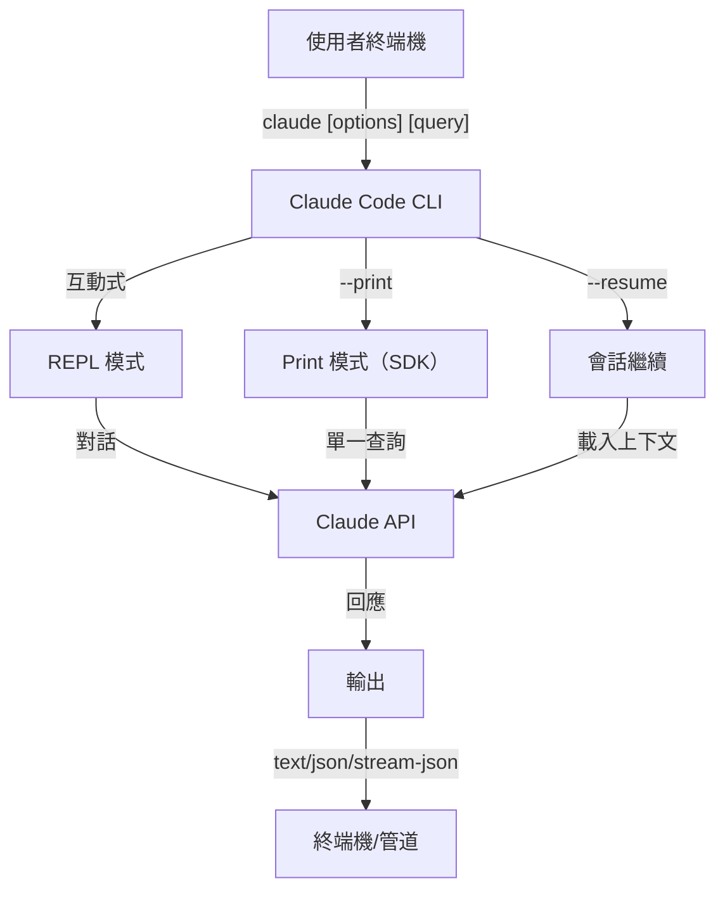
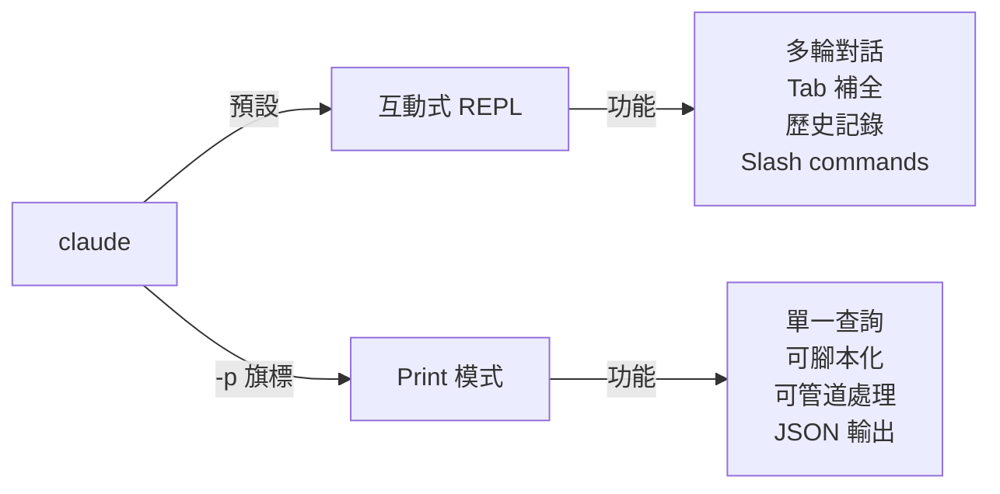

<picture>
  <source media="(prefers-color-scheme: dark)" srcset="../resources/logos/claude-howto-logo-dark.svg">
  
</picture>

# CLI 參考

## 概覽

Claude Code CLI（命令列介面）是與 Claude Code 互動的主要方式。它提供強大的選項，用於執行查詢、管理會話、配置模型，以及將 Claude 整合到你的開發工作流程中。

## 架構



## CLI 指令

| 指令 | 描述 | 範例 |
|---------|-------------|---------|
| `claude` | 啟動互動式 REPL | `claude` |
| `claude "query"` | 以初始提示啟動 REPL | `claude "explain this project"` |
| `claude -p "query"` | Print 模式——查詢後退出 | `claude -p "explain this function"` |
| `cat file \| claude -p "query"` | 處理管道內容 | `cat logs.txt \| claude -p "explain"` |
| `claude -c` | 繼續最近的對話 | `claude -c` |
| `claude -c -p "query"` | 在 print 模式中繼續 | `claude -c -p "check for type errors"` |
| `claude -r "<session>" "query"` | 以 ID 或名稱繼續會話 | `claude -r "auth-refactor" "finish this PR"` |
| `claude update` | 更新至最新版本 | `claude update` |
| `claude mcp` | 配置 MCP servers | 請參閱 [MCP 文件](../05-mcp/) |
| `claude mcp serve` | 以 MCP server 形式執行 Claude Code | `claude mcp serve` |
| `claude agents` | 列出所有已配置的 subagents | `claude agents` |
| `claude auto-mode defaults` | 以 JSON 格式列印 auto mode 預設規則 | `claude auto-mode defaults` |
| `claude remote-control` | 啟動 Remote Control server | `claude remote-control` |
| `claude plugin` | 管理 plugins（安裝、啟用、停用） | `claude plugin install my-plugin` |
| `claude auth login` | 登入（支援 `--email`、`--sso`） | `claude auth login --email user@example.com` |
| `claude auth logout` | 登出目前帳號 | `claude auth logout` |
| `claude auth status` | 檢查驗證狀態（已登入退出 0，未登入退出 1） | `claude auth status` |

## 核心旗標

| 旗標 | 描述 | 範例 |
|------|-------------|---------|
| `-p, --print` | 不使用互動模式列印回應 | `claude -p "query"` |
| `-c, --continue` | 載入最近的對話 | `claude --continue` |
| `-r, --resume` | 以 ID 或名稱繼續特定會話 | `claude --resume auth-refactor` |
| `-v, --version` | 輸出版本號 | `claude -v` |
| `-w, --worktree` | 在獨立的 git worktree 中啟動 | `claude -w` |
| `-n, --name` | 會話顯示名稱 | `claude -n "auth-refactor"` |
| `--from-pr <number>` | 繼續連結到 GitHub PR 的會話 | `claude --from-pr 42` |
| `--remote "task"` | 在 claude.ai 建立 web 會話 | `claude --remote "implement API"` |
| `--remote-control, --rc` | 附 Remote Control 的互動式會話 | `claude --rc` |
| `--teleport` | 在本地繼續 web 會話 | `claude --teleport` |
| `--teammate-mode` | Agent 團隊顯示模式 | `claude --teammate-mode tmux` |
| `--bare` | 最小模式（跳過 hooks、skills、plugins、MCP、自動 memory、CLAUDE.md）| `claude --bare` |
| `--enable-auto-mode` | 解鎖 auto 權限模式 | `claude --enable-auto-mode` |
| `--channels` | 訂閱 MCP channel plugins | `claude --channels discord,telegram` |
| `--chrome` / `--no-chrome` | 啟用/停用 Chrome 瀏覽器整合 | `claude --chrome` |
| `--effort` | 設定思考投入程度 | `claude --effort high` |
| `--init` / `--init-only` | 執行初始化 hooks | `claude --init` |
| `--maintenance` | 執行維護 hooks 後退出 | `claude --maintenance` |
| `--disable-slash-commands` | 停用所有 skills 和 slash commands | `claude --disable-slash-commands` |
| `--no-session-persistence` | 停用會話儲存（print 模式）| `claude -p --no-session-persistence "query"` |

### 互動模式與 Print 模式



**互動模式**（預設）：
```bash
# 啟動互動式會話
claude

# 以初始提示啟動
claude "explain the authentication flow"
```

**Print 模式**（非互動式）：
```bash
# 單一查詢後退出
claude -p "what does this function do?"

# 處理檔案內容
cat error.log | claude -p "explain this error"

# 與其他工具串接
claude -p "list todos" | grep "URGENT"
```

## 模型與配置

| 旗標 | 描述 | 範例 |
|------|-------------|---------|
| `--model` | 設定模型（sonnet、opus、haiku 或完整名稱）| `claude --model opus` |
| `--fallback-model` | 過載時自動切換備用模型 | `claude -p --fallback-model sonnet "query"` |
| `--agent` | 指定會話的 agent | `claude --agent my-custom-agent` |
| `--agents` | 透過 JSON 定義自訂 subagents | 請參閱 [Agents 配置](#agents-配置) |
| `--effort` | 設定投入程度（low、medium、high、max）| `claude --effort high` |

### 模型選擇範例

```bash
# 使用 Opus 4.6 處理複雜任務
claude --model opus "design a caching strategy"

# 使用 Haiku 4.5 處理快速任務
claude --model haiku -p "format this JSON"

# 完整模型名稱
claude --model claude-sonnet-4-6-20250929 "review this code"

# 附備用模型以提高可靠性
claude -p --model opus --fallback-model sonnet "analyze architecture"

# 使用 opusplan（Opus 規劃，Sonnet 執行）
claude --model opusplan "design and implement the caching layer"
```

## 系統提示自訂

| 旗標 | 描述 | 範例 |
|------|-------------|---------|
| `--system-prompt` | 替換整個預設提示 | `claude --system-prompt "You are a Python expert"` |
| `--system-prompt-file` | 從檔案載入提示（print 模式）| `claude -p --system-prompt-file ./prompt.txt "query"` |
| `--append-system-prompt` | 附加到預設提示 | `claude --append-system-prompt "Always use TypeScript"` |

### 系統提示範例

```bash
# 完全自訂角色
claude --system-prompt "You are a senior security engineer. Focus on vulnerabilities."

# 附加特定指令
claude --append-system-prompt "Always include unit tests with code examples"

# 從檔案載入複雜提示
claude -p --system-prompt-file ./prompts/code-reviewer.txt "review main.py"
```

### 系統提示旗標比較

| 旗標 | 行為 | 互動模式 | Print 模式 |
|------|----------|-------------|-------|
| `--system-prompt` | 替換整個預設系統提示 | ✅ | ✅ |
| `--system-prompt-file` | 以檔案中的提示替換 | ❌ | ✅ |
| `--append-system-prompt` | 附加到預設系統提示 | ✅ | ✅ |

**`--system-prompt-file` 僅在 print 模式中使用。互動模式請使用 `--system-prompt` 或 `--append-system-prompt`。**

## 工具與權限管理

| 旗標 | 描述 | 範例 |
|------|-------------|---------|
| `--tools` | 限制可用的內建工具 | `claude -p --tools "Bash,Edit,Read" "query"` |
| `--allowedTools` | 無需提示即可執行的工具 | `"Bash(git log:*)" "Read"` |
| `--disallowedTools` | 從上下文中移除的工具 | `"Bash(rm:*)" "Edit"` |
| `--dangerously-skip-permissions` | 跳過所有權限提示 | `claude --dangerously-skip-permissions` |
| `--permission-mode` | 以指定的權限模式開始 | `claude --permission-mode auto` |
| `--permission-prompt-tool` | 用於處理權限的 MCP 工具 | `claude -p --permission-prompt-tool mcp_auth "query"` |
| `--enable-auto-mode` | 解鎖 auto 權限模式 | `claude --enable-auto-mode` |

### 權限範例

```bash
# 唯讀模式用於程式碼審查
claude --permission-mode plan "review this codebase"

# 限制只使用安全工具
claude --tools "Read,Grep,Glob" -p "find all TODO comments"

# 允許特定 git 指令無需提示
claude --allowedTools "Bash(git status:*)" "Bash(git log:*)"

# 封鎖危險操作
claude --disallowedTools "Bash(rm -rf:*)" "Bash(git push --force:*)"
```

## 輸出與格式

| 旗標 | 描述 | 選項 | 範例 |
|------|-------------|---------|---------|
| `--output-format` | 指定輸出格式（print 模式）| `text`、`json`、`stream-json` | `claude -p --output-format json "query"` |
| `--input-format` | 指定輸入格式（print 模式）| `text`、`stream-json` | `claude -p --input-format stream-json` |
| `--verbose` | 啟用詳細日誌 | | `claude --verbose` |
| `--include-partial-messages` | 包含串流事件 | 需要 `stream-json` | `claude -p --output-format stream-json --include-partial-messages "query"` |
| `--json-schema` | 取得符合 schema 的驗證 JSON | | `claude -p --json-schema '{"type":"object"}' "query"` |
| `--max-budget-usd` | Print 模式的最高消費上限 | | `claude -p --max-budget-usd 5.00 "query"` |

### 輸出格式範例

```bash
# 純文字（預設）
claude -p "explain this code"

# JSON 用於程式化使用
claude -p --output-format json "list all functions in main.py"

# 串流 JSON 用於即時處理
claude -p --output-format stream-json "generate a long report"

# 附 schema 驗證的結構化輸出
claude -p --json-schema '{"type":"object","properties":{"bugs":{"type":"array"}}}' \
  "find bugs in this code and return as JSON"
```

## 工作區與目錄

| 旗標 | 描述 | 範例 |
|------|-------------|---------|
| `--add-dir` | 新增額外工作目錄 | `claude --add-dir ../apps ../lib` |
| `--setting-sources` | 逗號分隔的設定來源 | `claude --setting-sources user,project` |
| `--settings` | 從檔案或 JSON 載入設定 | `claude --settings ./settings.json` |
| `--plugin-dir` | 從目錄載入 plugins（可重複）| `claude --plugin-dir ./my-plugin` |

### 多目錄範例

```bash
# 跨多個專案目錄工作
claude --add-dir ../frontend ../backend ../shared "find all API endpoints"

# 載入自訂設定
claude --settings '{"model":"opus","verbose":true}' "complex task"
```

## MCP 配置

| 旗標 | 描述 | 範例 |
|------|-------------|---------|
| `--mcp-config` | 從 JSON 載入 MCP servers | `claude --mcp-config ./mcp.json` |
| `--strict-mcp-config` | 只使用指定的 MCP 配置 | `claude --strict-mcp-config --mcp-config ./mcp.json` |
| `--channels` | 訂閱 MCP channel plugins | `claude --channels discord,telegram` |

### MCP 範例

```bash
# 載入 GitHub MCP server
claude --mcp-config ./github-mcp.json "list open PRs"

# 嚴格模式——只使用指定的 servers
claude --strict-mcp-config --mcp-config ./production-mcp.json "deploy to staging"
```

## 會話管理

| 旗標 | 描述 | 範例 |
|------|-------------|---------|
| `--session-id` | 使用特定會話 ID（UUID）| `claude --session-id "550e8400-..."` |
| `--fork-session` | 繼續時建立新會話 | `claude --resume abc123 --fork-session` |

### 會話範例

```bash
# 繼續上次對話
claude -c

# 繼續命名會話
claude -r "feature-auth" "continue implementing login"

# Fork 會話進行實驗
claude --resume feature-auth --fork-session "try alternative approach"

# 使用特定會話 ID
claude --session-id "550e8400-e29b-41d4-a716-446655440000" "continue"
```

### 會話 Fork

從現有會話建立分支進行實驗：

```bash
# Fork 會話嘗試不同方法
claude --resume abc123 --fork-session "try alternative implementation"

# 附自訂訊息 Fork
claude -r "feature-auth" --fork-session "test with different architecture"
```

**使用場景：**
- 嘗試替代實作而不失去原始會話
- 平行探索不同方法
- 從成功的工作建立變體分支
- 測試破壞性變更而不影響主要會話

原始會話保持不變，fork 成為新的獨立會話。

## 進階功能

| 旗標 | 描述 | 範例 |
|------|-------------|---------|
| `--chrome` | 啟用 Chrome 瀏覽器整合 | `claude --chrome` |
| `--no-chrome` | 停用 Chrome 瀏覽器整合 | `claude --no-chrome` |
| `--ide` | 若可用自動連線至 IDE | `claude --ide` |
| `--max-turns` | 限制代理輪次（非互動式）| `claude -p --max-turns 3 "query"` |
| `--debug` | 啟用附過濾的除錯模式 | `claude --debug "api,mcp"` |
| `--enable-lsp-logging` | 啟用詳細 LSP 日誌 | `claude --enable-lsp-logging` |
| `--betas` | API 請求的 Beta 標頭 | `claude --betas interleaved-thinking` |
| `--plugin-dir` | 從目錄載入 plugins（可重複）| `claude --plugin-dir ./my-plugin` |
| `--enable-auto-mode` | 解鎖 auto 權限模式 | `claude --enable-auto-mode` |
| `--effort` | 設定思考投入程度 | `claude --effort high` |
| `--bare` | 最小模式（跳過 hooks、skills、plugins、MCP、自動 memory、CLAUDE.md）| `claude --bare` |
| `--channels` | 訂閱 MCP channel plugins | `claude --channels discord` |
| `--fork-session` | 繼續時建立新會話 ID | `claude --resume abc --fork-session` |
| `--max-budget-usd` | 最高消費上限（print 模式）| `claude -p --max-budget-usd 5.00 "query"` |
| `--json-schema` | 驗證 JSON 輸出 | `claude -p --json-schema '{"type":"object"}' "q"` |

### 進階範例

```bash
# 限制自主動作
claude -p --max-turns 5 "refactor this module"

# 除錯 API 呼叫
claude --debug "api" "test query"

# 啟用 IDE 整合
claude --ide "help me with this file"
```

## Agents 配置

`--agents` 旗標接受定義會話自訂 subagents 的 JSON 物件。

### Agents JSON 格式

```json
{
  "agent-name": {
    "description": "必填：何時呼叫此 agent",
    "prompt": "必填：agent 的系統提示",
    "tools": ["選填", "工具", "陣列"],
    "model": "選填：sonnet|opus|haiku"
  }
}
```

**必填欄位：**
- `description` - 何時使用此 agent 的自然語言描述
- `prompt` - 定義 agent 角色和行為的系統提示

**選填欄位：**
- `tools` - 可用工具陣列（省略則繼承所有工具）
  - 格式：`["Read", "Grep", "Glob", "Bash"]`
- `model` - 使用的模型：`sonnet`、`opus` 或 `haiku`

### 完整 Agents 範例

```json
{
  "code-reviewer": {
    "description": "Expert code reviewer. Use proactively after code changes.",
    "prompt": "You are a senior code reviewer. Focus on code quality, security, and best practices.",
    "tools": ["Read", "Grep", "Glob", "Bash"],
    "model": "sonnet"
  },
  "debugger": {
    "description": "Debugging specialist for errors and test failures.",
    "prompt": "You are an expert debugger. Analyze errors, identify root causes, and provide fixes.",
    "tools": ["Read", "Edit", "Bash", "Grep"],
    "model": "opus"
  },
  "documenter": {
    "description": "Documentation specialist for generating guides.",
    "prompt": "You are a technical writer. Create clear, comprehensive documentation.",
    "tools": ["Read", "Write"],
    "model": "haiku"
  }
}
```

### Agents 指令範例

```bash
# 內嵌定義自訂 agents
claude --agents '{
  "security-auditor": {
    "description": "Security specialist for vulnerability analysis",
    "prompt": "You are a security expert. Find vulnerabilities and suggest fixes.",
    "tools": ["Read", "Grep", "Glob"],
    "model": "opus"
  }
}' "audit this codebase for security issues"

# 從檔案載入 agents
claude --agents "$(cat ~/.claude/agents.json)" "review the auth module"

# 與其他旗標組合
claude -p --agents "$(cat agents.json)" --model sonnet "analyze performance"
```

### Agent 優先順序

當存在多個 agent 定義時，按以下優先順序載入：
1. **CLI 定義**（`--agents` 旗標）——特定於會話
2. **使用者層級**（`~/.claude/agents/`）——所有專案
3. **專案層級**（`.claude/agents/`）——目前專案

CLI 定義的 agents 會在會話中覆蓋使用者和專案 agents。

---

## 高價值使用場景

### 1. CI/CD 整合

在 CI/CD 流水線中使用 Claude Code 進行自動化程式碼審查、測試和文件。

**GitHub Actions 範例：**

```yaml
name: AI Code Review

on: [pull_request]

jobs:
  review:
    runs-on: ubuntu-latest
    steps:
      - uses: actions/checkout@v4

      - name: Install Claude Code
        run: npm install -g @anthropic-ai/claude-code

      - name: Run Code Review
        env:
          ANTHROPIC_API_KEY: ${{ secrets.ANTHROPIC_API_KEY }}
        run: |
          claude -p --output-format json \
            --max-turns 1 \
            "Review the changes in this PR for:
            - Security vulnerabilities
            - Performance issues
            - Code quality
            Output as JSON with 'issues' array" > review.json

      - name: Post Review Comment
        uses: actions/github-script@v7
        with:
          script: |
            const fs = require('fs');
            const review = JSON.parse(fs.readFileSync('review.json', 'utf8'));
            // Process and post review comments
```

**Jenkins Pipeline：**

```groovy
pipeline {
    agent any
    stages {
        stage('AI Review') {
            steps {
                sh '''
                    claude -p --output-format json \
                      --max-turns 3 \
                      "Analyze test coverage and suggest missing tests" \
                      > coverage-analysis.json
                '''
            }
        }
    }
}
```

### 2. 腳本管道處理

透過 Claude 處理檔案、日誌和資料進行分析。

**日誌分析：**

```bash
# 分析錯誤日誌
tail -1000 /var/log/app/error.log | claude -p "summarize these errors and suggest fixes"

# 在存取日誌中尋找模式
cat access.log | claude -p "identify suspicious access patterns"

# 分析 git 歷史
git log --oneline -50 | claude -p "summarize recent development activity"
```

**程式碼處理：**

```bash
# 審查特定檔案
cat src/auth.ts | claude -p "review this authentication code for security issues"

# 生成文件
cat src/api/*.ts | claude -p "generate API documentation in markdown"

# 找出 TODO 並排定優先順序
grep -r "TODO" src/ | claude -p "prioritize these TODOs by importance"
```

### 3. 多會話工作流程

使用多個對話執行緒管理複雜專案。

```bash
# 啟動功能分支會話
claude -r "feature-auth" "let's implement user authentication"

# 稍後繼續會話
claude -r "feature-auth" "add password reset functionality"

# Fork 嘗試替代方法
claude --resume feature-auth --fork-session "try OAuth instead"

# 在不同功能會話之間切換
claude -r "feature-payments" "continue with Stripe integration"
```

### 4. 自訂 Agent 配置

為你的團隊工作流程定義專門 agents。

```bash
# 將 agents 配置儲存到檔案
cat > ~/.claude/agents.json << 'EOF'
{
  "reviewer": {
    "description": "Code reviewer for PR reviews",
    "prompt": "Review code for quality, security, and maintainability.",
    "model": "opus"
  },
  "documenter": {
    "description": "Documentation specialist",
    "prompt": "Generate clear, comprehensive documentation.",
    "model": "sonnet"
  },
  "refactorer": {
    "description": "Code refactoring expert",
    "prompt": "Suggest and implement clean code refactoring.",
    "tools": ["Read", "Edit", "Glob"]
  }
}
EOF

# 在會話中使用 agents
claude --agents "$(cat ~/.claude/agents.json)" "review the auth module"
```

### 5. 批次處理

使用一致的設定處理多個查詢。

```bash
# 處理多個檔案
for file in src/*.ts; do
  echo "Processing $file..."
  claude -p --model haiku "summarize this file: $(cat $file)" >> summaries.md
done

# 批次程式碼審查
find src -name "*.py" -exec sh -c '
  echo "## $1" >> review.md
  cat "$1" | claude -p "brief code review" >> review.md
' _ {} \;

# 為所有模組生成測試
for module in $(ls src/modules/); do
  claude -p "generate unit tests for src/modules/$module" > "tests/$module.test.ts"
done
```

### 6. 安全意識開發

使用權限控制安全操作。

```bash
# 唯讀安全審計
claude --permission-mode plan \
  --tools "Read,Grep,Glob" \
  "audit this codebase for security vulnerabilities"

# 封鎖危險指令
claude --disallowedTools "Bash(rm:*)" "Bash(curl:*)" "Bash(wget:*)" \
  "help me clean up this project"

# 受限自動化
claude -p --max-turns 2 \
  --allowedTools "Read" "Glob" \
  "find all hardcoded credentials"
```

### 7. JSON API 整合

使用 `jq` 解析將 Claude 作為你工具的可程式化 API。

```bash
# 取得結構化分析
claude -p --output-format json \
  --json-schema '{"type":"object","properties":{"functions":{"type":"array"},"complexity":{"type":"string"}}}' \
  "analyze main.py and return function list with complexity rating"

# 與 jq 整合進行處理
claude -p --output-format json "list all API endpoints" | jq '.endpoints[]'

# 在腳本中使用
RESULT=$(claude -p --output-format json "is this code secure? answer with {secure: boolean, issues: []}" < code.py)
if echo "$RESULT" | jq -e '.secure == false' > /dev/null; then
  echo "Security issues found!"
  echo "$RESULT" | jq '.issues[]'
fi
```

### jq 解析範例

使用 `jq` 解析和處理 Claude 的 JSON 輸出：

```bash
# 提取特定欄位
claude -p --output-format json "analyze this code" | jq '.result'

# 過濾陣列元素
claude -p --output-format json "list issues" | jq -r '.issues[] | select(.severity=="high")'

# 提取多個欄位
claude -p --output-format json "describe the project" | jq -r '.{name, version, description}'

# 轉換為 CSV
claude -p --output-format json "list functions" | jq -r '.functions[] | [.name, .lineCount] | @csv'

# 條件處理
claude -p --output-format json "check security" | jq 'if .vulnerabilities | length > 0 then "UNSAFE" else "SAFE" end'

# 提取巢狀值
claude -p --output-format json "analyze performance" | jq '.metrics.cpu.usage'

# 處理整個陣列
claude -p --output-format json "find todos" | jq '.todos | length'

# 轉換輸出
claude -p --output-format json "list improvements" | jq 'map({title: .title, priority: .priority})'
```

---

## 模型

Claude Code 支援多種具有不同能力的模型：

| 模型 | ID | 上下文視窗 | 備註 |
|-------|-----|----------------|-------|
| Opus 4.6 | `claude-opus-4-6` | 1M tokens | 能力最強，支援自適應投入程度 |
| Sonnet 4.6 | `claude-sonnet-4-6` | 1M tokens | 速度與能力均衡 |
| Haiku 4.5 | `claude-haiku-4-5` | 1M tokens | 最快，適合快速任務 |

### 模型選擇

```bash
# 使用簡短名稱
claude --model opus "complex architectural review"
claude --model sonnet "implement this feature"
claude --model haiku -p "format this JSON"

# 使用 opusplan 別名（Opus 規劃，Sonnet 執行）
claude --model opusplan "design and implement the API"

# 在會話期間切換快速模式
/fast
```

### 投入程度（Opus 4.6）

Opus 4.6 支援具有投入程度的自適應推理：

```bash
# 透過 CLI 旗標設定投入程度
claude --effort high "complex review"

# 透過 slash command 設定投入程度
/effort high

# 透過環境變數設定投入程度
export CLAUDE_CODE_EFFORT_LEVEL=high   # low、medium、high 或 max（僅限 Opus 4.6）
```

在提示中使用「ultrathink」關鍵字可啟動深度推理模式。`max` 投入程度僅限 Opus 4.6 使用。

---

## 關鍵環境變數

| 變數 | 描述 |
|----------|-------------|
| `ANTHROPIC_API_KEY` | 驗證用 API 金鑰 |
| `ANTHROPIC_MODEL` | 覆蓋預設模型 |
| `ANTHROPIC_CUSTOM_MODEL_OPTION` | API 的自訂模型選項 |
| `ANTHROPIC_DEFAULT_OPUS_MODEL` | 覆蓋預設 Opus 模型 ID |
| `ANTHROPIC_DEFAULT_SONNET_MODEL` | 覆蓋預設 Sonnet 模型 ID |
| `ANTHROPIC_DEFAULT_HAIKU_MODEL` | 覆蓋預設 Haiku 模型 ID |
| `MAX_THINKING_TOKENS` | 設定延伸思考 token 預算 |
| `CLAUDE_CODE_EFFORT_LEVEL` | 設定投入程度（`low`/`medium`/`high`/`max`）|
| `CLAUDE_CODE_SIMPLE` | 最小模式，由 `--bare` 旗標設定 |
| `CLAUDE_CODE_DISABLE_AUTO_MEMORY` | 停用自動 CLAUDE.md 更新 |
| `CLAUDE_CODE_DISABLE_BACKGROUND_TASKS` | 停用背景任務執行 |
| `CLAUDE_CODE_DISABLE_CRON` | 停用排程/cron 任務 |
| `CLAUDE_CODE_DISABLE_GIT_INSTRUCTIONS` | 停用 git 相關指令 |
| `CLAUDE_CODE_DISABLE_TERMINAL_TITLE` | 停用終端機標題更新 |
| `CLAUDE_CODE_DISABLE_1M_CONTEXT` | 停用 1M token 上下文視窗 |
| `CLAUDE_CODE_DISABLE_NONSTREAMING_FALLBACK` | 停用非串流備用 |
| `CLAUDE_CODE_ENABLE_TASKS` | 啟用任務列表功能 |
| `CLAUDE_CODE_TASK_LIST_ID` | 跨會話共享的命名任務目錄 |
| `CLAUDE_CODE_ENABLE_PROMPT_SUGGESTION` | 切換提示建議（`true`/`false`）|
| `CLAUDE_CODE_EXPERIMENTAL_AGENT_TEAMS` | 啟用實驗性 agent 團隊 |
| `CLAUDE_CODE_NEW_INIT` | 使用新的初始化流程 |
| `CLAUDE_CODE_SUBAGENT_MODEL` | subagent 執行使用的模型 |
| `CLAUDE_CODE_PLUGIN_SEED_DIR` | plugin 種子檔案的目錄 |
| `CLAUDE_CODE_SUBPROCESS_ENV_SCRUB` | 從子程序中清除的環境變數 |
| `CLAUDE_AUTOCOMPACT_PCT_OVERRIDE` | 覆蓋自動壓縮百分比 |
| `CLAUDE_STREAM_IDLE_TIMEOUT_MS` | 串流閒置逾時（毫秒）|
| `SLASH_COMMAND_TOOL_CHAR_BUDGET` | slash command 工具的字元預算 |
| `ENABLE_TOOL_SEARCH` | 啟用工具搜尋功能 |
| `MAX_MCP_OUTPUT_TOKENS` | MCP 工具輸出的最大 tokens |

---

## 快速參考

### 最常用的指令

```bash
# 互動式會話
claude

# 快速問題
claude -p "how do I..."

# 繼續對話
claude -c

# 處理檔案
cat file.py | claude -p "review this"

# 腳本用 JSON 輸出
claude -p --output-format json "query"
```

### 旗標組合

| 使用場景 | 指令 |
|----------|---------|
| 快速程式碼審查 | `cat file | claude -p "review"` |
| 結構化輸出 | `claude -p --output-format json "query"` |
| 安全探索 | `claude --permission-mode plan` |
| 附安全性的自主模式 | `claude --enable-auto-mode --permission-mode auto` |
| CI/CD 整合 | `claude -p --max-turns 3 --output-format json` |
| 繼續工作 | `claude -r "session-name"` |
| 自訂模型 | `claude --model opus "complex task"` |
| 最小模式 | `claude --bare "quick query"` |
| 限制預算執行 | `claude -p --max-budget-usd 2.00 "analyze code"` |

---

## 疑難排解

### 找不到指令

**問題：** `claude: command not found`

**解決方案：**
- 安裝 Claude Code：`npm install -g @anthropic-ai/claude-code`
- 檢查 PATH 是否包含 npm global bin 目錄
- 嘗試使用完整路徑執行：`npx claude`

### API 金鑰問題

**問題：** 驗證失敗

**解決方案：**
- 設定 API 金鑰：`export ANTHROPIC_API_KEY=your-key`
- 確認金鑰有效且有足夠的點數
- 驗證金鑰對所請求模型的權限

### 找不到會話

**問題：** 無法繼續會話

**解決方案：**
- 列出可用會話以找到正確的名稱/ID
- 會話可能在閒置一段時間後過期
- 使用 `-c` 繼續最近的會話

### 輸出格式問題

**問題：** JSON 輸出格式錯誤

**解決方案：**
- 使用 `--json-schema` 強制結構
- 在提示中加入明確的 JSON 指令
- 使用 `--output-format json`（而不只是在提示中要求 JSON）

### 權限被拒

**問題：** 工具執行被封鎖

**解決方案：**
- 檢查 `--permission-mode` 設定
- 確認 `--allowedTools` 和 `--disallowedTools` 旗標
- 謹慎使用 `--dangerously-skip-permissions` 進行自動化

---

## 其他資源

- **[官方 CLI 參考](https://code.claude.com/docs/en/cli-reference)** - 完整指令參考
- **[Headless 模式文件](https://code.claude.com/docs/en/headless)** - 自動化執行
- **[Slash Commands](../01-slash-commands/)** - Claude 內的自訂快捷方式
- **[Memory 指南](../02-memory/)** - 透過 CLAUDE.md 的持久化上下文
- **[MCP Protocol](../05-mcp/)** - 外部工具整合
- **[進階功能](../09-advanced-features/)** - 規劃模式、延伸思考
- **[Subagents 指南](../04-subagents/)** - 委派任務執行

---
