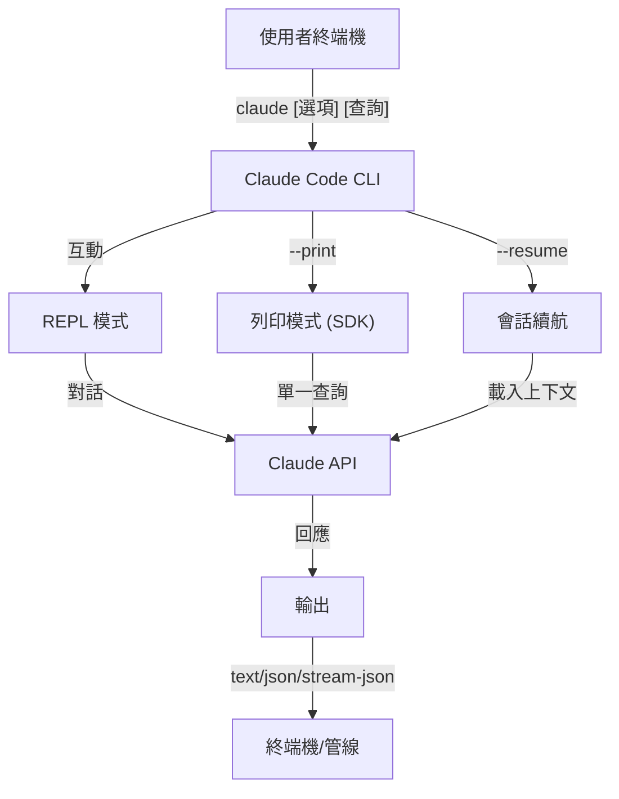
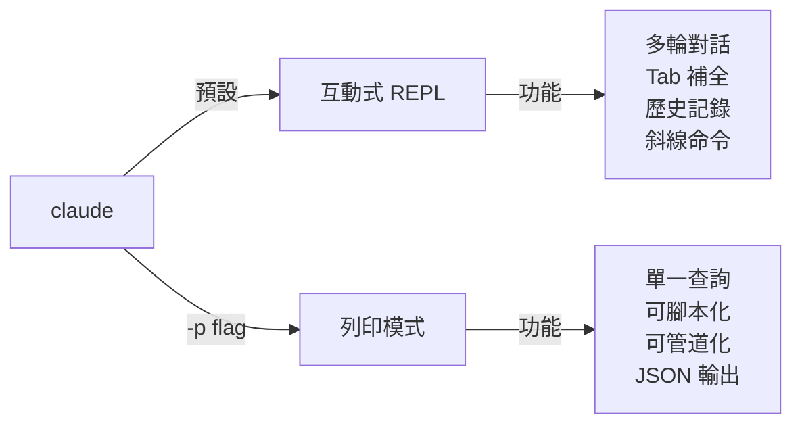

<picture>
  <source media="(prefers-color-scheme: dark)" srcset="../resources/logos/claude-howto-logo-dark.svg">
  
</picture>

# CLI Reference

## 總覽

Claude Code CLI (命令列介面) 是與 Claude Code 互動的主要方式。 它提供強大的選項，用於執行查詢、管理會話、配置模型，以及將 Claude 整合到您的開發工作流程中。

## 架構



## CLI 命令

| 命令 | 描述 | 範例 |
|---------|-------------|---------|
| `claude` | 啟動互動式 REPL | `claude` |
| `claude "query"` | 使用初始提示詞啟動 REPL | `claude "explain this project"` |
| `claude -p "query"` | 列印模式 - 查詢後退出 | `claude -p "explain this function"` |
| `cat file \| claude -p "query"` | 處理管線內容 | `cat logs.txt \| claude -p "explain"` |
| `claude -c` | 繼續最近的對話 | `claude -c` |
| `claude -c -p "query"` | 在列印模式下繼續 | `claude -c -p "check for type errors"` |
| `claude -r "<session>" "query"` | 根據 ID 或名稱續航會話 | `claude -r "auth-refactor" "finish this PR"` |
| `claude update` | 更新到最新版本 | `claude update` |
| `claude mcp` | 配置 MCP 伺服器 | 參閱 [MCP 文件](../05-mcp/) |
| `claude mcp serve` | 將 Claude Code 執行為 MCP 伺服器 | `claude mcp serve` |
| `claude agents` | 列出所有配置的子代理 | `claude agents` |
| `claude auto-mode defaults` | 以 JSON 格式列印自動模式預設規則 | `claude auto-mode defaults` |
| `claude remote-control` | 啟動遠端控制伺服器 | `claude remote-control` |
| `claude plugin` | 管理外掛程式 (安裝、啟用、停用) | `claude plugin install my-plugin` |
| `claude auth login` | 登入 (支援 `--email`、`--sso`) | `claude auth login --email user@example.com` |
| `claude auth logout` | 登出目前帳戶 | `claude auth logout` |
| `claude auth status` | 檢查驗證狀態 (如果已登入則退出 0，否則退出 1) | `claude auth status` |

## 核心參數

| 參數 | 描述 | 範例 |
|------|-------------|---------|
| `-p, --print` | 輸出回應，不使用互動模式 | `claude -p "query"` |
| `-c, --continue` | 載入最近一次的會話 | `claude --continue` |
| `-r, --resume` | 根據 ID 或名稱重新啟動特定會話 | `claude --resume auth-refactor` |
| `-v, --version` | 輸出版本號碼 | `claude -v` |
| `-w, --worktree` | 在隔離的 git 工作樹中啟動 | `claude -w` |
| `-n, --name` | 會話顯示名稱 | `claude -n "auth-refactor"` |
| `--from-pr <number>` | 重新啟動與 GitHub PR 連結的會話 | `claude --from-pr 42` |
| `--remote "task"` | 在 claude.ai 上建立網頁會話 | `claude --remote "implement API"` |
| `--remote-control, --rc` | 具有遠端控制的互動式會話 | `claude --rc` |
| `--teleport` | 本地重新啟動網頁會話 | `claude --teleport` |
| `--teammate-mode` | 代理團隊顯示模式 | `claude --teammate-mode tmux` |
| `--bare` | 最小模式 (跳過鉤子、技能、外掛、MCP、自動記憶體、CLAUDE.md) | `claude --bare` |
| `--enable-auto-mode` | 解鎖自動權限模式 | `claude --enable-auto-mode` |
| `--channels` | 訂閱 MCP 頻道外掛 | `claude --channels discord,telegram` |
| `--chrome` / `--no-chrome` | 啟用/停用 Chrome 瀏覽器整合 | `claude --chrome` |
| `--effort` | 設定思考努力程度 | `claude --effort high` |
| `--init` / `--init-only` | 執行初始化鉤子 | `claude --init` |
| `--maintenance` | 執行維護鉤子並退出 | `claude --maintenance` |
| `--disable-slash-commands` | 停用所有技能和斜線命令 | `claude --disable-slash-commands` |
| `--no-session-persistence` | 停用會話儲存 (列印模式) | `claude -p --no-session-persistence "query"` |

### 互動式模式 vs 列印模式



**互動式模式** (預設):
```bash
# 啟動互動式會話
claude

# 啟動具有初始提示詞的會話
claude "explain the authentication flow"
```

**列印模式** (非互動式):
```bash
# 單一查詢，然後退出
claude -p "what does this function do?"

# 處理檔案內容
cat error.log | claude -p "explain this error"

# 與其他工具鏈接
claude -p "list todos" | grep "URGENT"
```

## 模型與設定

| Flag | 描述 | 範例 |
|------|-------------|---------|
| `--model` | 設定模型 (sonnet, opus, haiku, 或完整名稱) | `claude --model opus` |
| `--fallback-model` | 超載時自動設定模型 | `claude -p --fallback-model sonnet "query"` |
| `--agent` | 指定會話的代理 | `claude --agent my-custom-agent` |
| `--agents` | 透過 JSON 定義自訂子代理 | 參閱 [代理程式設定](#agents-configuration) |
| `--effort` | 設定努力程度 (low, medium, high, max) | `claude --effort high` |

### 模型選擇範例

```bash
# 使用 Opus 4.6 處理複雜任務
claude --model opus "設計一個快取策略"

# 使用 Haiku 4.5 處理快速任務
claude --model haiku -p "格式化這個 JSON"

# 完整模型名稱
claude --model claude-sonnet-4-6-20250929 "審查這個程式碼"

# 搭配回退機制以確保可靠性
claude -p --model opus --fallback-model sonnet "分析架構"

# 使用 opusplan (Opus 規劃，Sonnet 執行)
claude --model opusplan "設計並實作快取層"
```

## 系統提示詞自訂

| Flag | 描述 | 範例 |
|------|-------------|---------|
| `--system-prompt` | 替換整個預設提示詞 | `claude --system-prompt "您是一位 Python 專家"` |
| `--system-prompt-file` | 從檔案載入提示詞 (列印模式) | `claude -p --system-prompt-file ./prompt.txt "query"` |
| `--append-system-prompt` | 附加到預設提示詞 | `claude --append-system-prompt "請務必使用 TypeScript"` |

### 系統提示詞範例

```bash
# 完整的自訂角色
claude --system-prompt "您是一位資深安全工程師。專注於漏洞。"

# 附加特定指示
claude --append-system-prompt "請務必在程式碼範例中包含單元測試"

# 從檔案載入複雜提示詞
claude -p --system-prompt-file ./prompts/code-reviewer.txt "審查 main.py"
```

### 系統提示詞旗標比較

| Flag | 行為 | 互動式 | 列印 |
|------|----------|-------------|-------|
| `--system-prompt` | 替換整個預設系統提示詞 | ✅ | ✅ |
| `--system-prompt-file` | 使用來自檔案的提示詞替換 | ❌ | ✅ |
| `--append-system-prompt` | 附加到預設系統提示詞 | ✅ | ✅ |

**僅在列印模式中使用 `--system-prompt-file`。對於互動模式，請使用 `--system-prompt` 或 `--append-system-prompt`。**

## 工具與權限管理

| Flag | Description | Example |
|------|-------------|---------|
| `--tools` | 限制可用的內建工具 | `claude -p --tools "Bash,Edit,Read" "query"` |
| `--allowedTools` | 執行無需提示的工具 | `"Bash(git log:*)" "Read"` |
| `--disallowedTools` | 從上下文中移除的工具 | `"Bash(rm:*)" "Edit"` |
| `--dangerously-skip-permissions` | 略過所有權限提示 | `claude --dangerously-skip-permissions` |
| `--permission-mode` | 以指定的權限模式開始 | `claude --permission-mode auto` |
| `--permission-prompt-tool` | 用於權限處理的 MCP 工具 | `claude -p --permission-prompt-tool mcp_auth "query"` |
| `--enable-auto-mode` | 解鎖自動權限模式 | `claude --enable-auto-mode` |

### 權限範例

```bash
# 僅讀模式用於程式碼審查
claude --permission-mode plan "review this codebase"

# 限制到安全工具
claude --tools "Read,Grep,Glob" -p "find all TODO comments"

# 允許特定的 git 命令無需提示
claude --allowedTools "Bash(git status:*)" "Bash(git log:*)"

# 阻止危險操作
claude --disallowedTools "Bash(rm -rf:*)" "Bash(git push --force:*)"
```

## 輸出與格式

| Flag | Description | Options | Example |
|------|-------------|---------|---------|
| `--output-format` | 指定輸出格式 (列印模式) | `text`, `json`, `stream-json` | `claude -p --output-format json "query"` |
| `--input-format` | 指定輸入格式 (列印模式) | `text`, `stream-json` | `claude -p --input-format stream-json` |
| `--verbose` | 啟用詳細記錄 | | `claude --verbose` |
| `--include-partial-messages` | 包含串流事件 | 需要 `stream-json` | `claude -p --output-format stream-json --include-partial-messages "query"` |
| `--json-schema` | 取得符合 schema 的驗證 JSON | | `claude -p --json-schema '{"type":"object"}' "query"` |
| `--max-budget-usd` | 列印模式的最高花費 | | `claude -p --max-budget-usd 5.00 "query"` |

### 輸出格式範例

```bash
# 純文字 (預設)
claude -p "explain this code"

# JSON 供程式碼使用
claude -p --output-format json "list all functions in main.py"

# 串流 JSON 供即時處理
claude -p --output-format stream-json "generate a long report"

# 結構化輸出，搭配 schema 驗證
claude -p --json-schema '{"type":"object","properties":{"bugs":{"type":"array"}}}' \
  "find bugs in this code and return as JSON"
```

## 工作區 & 目錄

| Flag | Description | Example |
|------|-------------|---------|
| `--add-dir` | 增加額外的作業目錄 | `claude --add-dir ../apps ../lib` |
| `--setting-sources` | 逗號分隔的設定來源 | `claude --setting-sources user,project` |
| `--settings` | 從檔案或 JSON 加載設定 | `claude --settings ./settings.json` |
| `--plugin-dir` | 從目錄載入外掛 (可重複) | `claude --plugin-dir ./my-plugin` |

### 多目錄範例

```bash
# 在多個專案目錄中操作
claude --add-dir ../frontend ../backend ../shared "find all API endpoints"

# 載入自訂設定
claude --settings '{"model":"opus","verbose":true}' "complex task"
```

## MCP 設定

| Flag | Description | Example |
|------|-------------|---------|
| `--mcp-config` | 從 JSON 載入 MCP 伺服器 | `claude --mcp-config ./mcp.json` |
| `--strict-mcp-config` | 僅使用指定的 MCP 設定 | `claude --strict-mcp-config --mcp-config ./mcp.json` |
| `--channels` | 訂閱 MCP 頻道外掛 | `claude --channels discord,telegram` |

### MCP 範例

```bash
# 載入 GitHub MCP 伺服器
claude --mcp-config ./github-mcp.json "list open PRs"

# 嚴格模式 - 僅使用指定的伺服器
claude --strict-mcp-config --mcp-config ./production-mcp.json "deploy to staging"
```

## 會話管理

| Flag | Description | Example |
|------|-------------|---------|
| `--session-id` | 使用特定的會話 ID (UUID) | `claude --session-id "550e8400-..."` |
| `--fork-session` | 重新啟動時建立新的會話 | `claude --resume abc123 --fork-session` |

### 會話範例

```bash
# 繼續上一次對話
claude -c

# 重新啟動命名會話
claude -r "feature-auth" "continue implementing login"

# 為實驗分叉會話
claude --resume feature-auth --fork-session "try alternative approach"

# 使用特定的會話 ID
claude --session-id "550e8400-e29b-41d4-a716-446655440000" "continue"
```

### 會話分叉

從現有會話建立分支以進行實驗：

```bash
# 分叉會話以嘗試不同的方法
claude --resume abc123 --fork-session "try alternative implementation"

# 帶有自訂訊息的分叉
claude -r "feature-auth" --fork-session "test with different architecture"
```

**使用案例：**
- 嘗試替代實作，而不會遺失原始會話
- 平行地實驗不同的方法
- 從成功的作業中建立分支以進行變更
- 測試破壞性變更，而不會影響主要會話

原始會話保持不變，分叉成為新的獨立會話。

## 進階功能

| Flag | 描述 | 範例 |
|------|-------------|---------|
| `--chrome` | 啟用 Chrome 瀏覽器整合 | `claude --chrome` |
| `--no-chrome` | 停用 Chrome 瀏覽器整合 | `claude --no-chrome` |
| `--ide` | 若有可用，自動連接 IDE | `claude --ide` |
| `--max-turns` | 限制代理的輪數（非互動式） | `claude -p --max-turns 3 "query"` |
| `--debug` | 啟用除錯模式，並篩選 | `claude --debug "api,mcp"` |
| `--enable-lsp-logging` | 啟用詳細的 LSP 記錄 | `claude --enable-lsp-logging` |
| `--betas` | API 請求的 Beta 標頭 | `claude --betas interleaved-thinking` |
| `--plugin-dir` | 從目錄載入外掛 (可重複) | `claude --plugin-dir ./my-plugin` |
| `--enable-auto-mode` | 解鎖自動權限模式 | `claude --enable-auto-mode` |
| `--effort` | 設定思考努力程度 | `claude --effort high` |
| `--bare` | 極簡模式 (跳過鉤子、技能、外掛、MCP、自動記憶體、CLAUDE.md) | `claude --bare` |
| `--channels` | 訂閱 MCP 頻道外掛 | `claude --channels discord` |
| `--tmux` | 為工作樹建立 tmux 工作階段 | `claude --tmux` |
| `--fork-session` | 恢復時建立新的工作階段 ID | `claude --resume abc --fork-session` |
| `--max-budget-usd` | 最大花費 (列印模式) | `claude -p --max-budget-usd 5.00 "query"` |
| `--json-schema` | 驗證的 JSON 輸出 | `claude -p --json-schema '{"type":"object"}' "q"` |

### 進階範例

```bash
# 限制自主動作
claude -p --max-turns 5 "refactor this module"

# 除錯 API 呼叫
claude --debug "api" "test query"

# 啟用 IDE 整合
claude --ide "help me with this file"
```

## 代理設定

`--agents` 參數接受一個 JSON 物件，定義會話的自訂子代理。

### 代理 JSON 格式

```json
{
  "agent-name": {
    "description": "必要：何時呼叫此代理",
    "prompt": "必要：定義代理角色的系統提示詞",
    "tools": ["Optional", "array", "of", "tools"],
    "model": "optional: sonnet|opus|haiku"
  }
}
```

**必要欄位：**
- `description` - 自然語言描述，說明何時使用此代理
- `prompt` - 定義代理角色和行為的系統提示詞

**可選欄位：**
- `tools` - 可用工具的陣列（如果省略，則繼承所有工具）
  - 格式：`["Read", "Grep", "Glob", "Bash"]`
- `model` - 要使用的模型：`sonnet`、`opus` 或 `haiku`

### 完整的代理範例

```json
{
  "code-reviewer": {
    "description": "經驗豐富的程式碼審查員。在程式碼變更後主動使用。",
    "prompt": "您是一位資深程式碼審查員。專注於程式碼品質、安全性及最佳實務。",
    "tools": ["Read", "Grep", "Glob", "Bash"],
    "model": "sonnet"
  },
  "debugger": {
    "description": "除錯專家，用於處理錯誤和測試失敗。",
    "prompt": "您是一位除錯專家。分析錯誤、找出根本原因並提供修正方法。",
    "tools": ["Read", "Edit", "Bash", "Grep"],
    "model": "opus"
  },
  "documenter": {
    "description": "文件製作專家，用於產生指南。",
    "prompt": "您是一位技術作家。創建清晰、全面的文件。",
    "tools": ["Read", "Write"],
    "model": "haiku"
  }
}
```

### 代理命令範例

```bash
# 內嵌定義自訂代理
claude --agents '{
  "security-auditor": {
    "description": "安全性專家，用於漏洞分析",
    "prompt": "您是一位安全性專家。找出漏洞並提出修正建議。",
    "tools": ["Read", "Grep", "Glob"],
    "model": "opus"
  }
}' "audit this codebase for security issues"

# 從檔案載入代理
claude --agents "$(cat ~/.claude/agents.json)" "review the auth module"

# 與其他參數結合
claude -p --agents "$(cat agents.json)" --model sonnet "analyze performance"
```

### 代理優先順序

當有多個代理定義存在時，它們會按照以下優先順序載入：
1. **CLI 定義** (`--agents` 參數) - 會話特定的
2. **使用者層級** (`~/.claude/agents/`) - 所有專案
3. **專案層級** (`.claude/agents/`) - 目前專案

CLI 定義的代理會覆寫會話中的使用者和專案代理。

---

## 高價值使用案例

### 1. CI/CD 整合

將 Claude Code 納入您的 CI/CD 流水線中，以進行自動化程式碼審查、測試和文件撰寫。

**GitHub Actions 範例：**

```yaml
name: AI 程式碼審查

on: [pull_request]

jobs:
  review:
    runs-on: ubuntu-latest
    steps:
      - uses: actions/checkout@v4

      - name: 安裝 Claude Code
        run: npm install -g @anthropic-ai/claude-code

      - name: 執行程式碼審查
        env:
          ANTHROPIC_API_KEY: ${{ secrets.ANTHROPIC_API_KEY }}
        run: |
          claude -p --output-format json \
            --max-turns 1 \
            "Review the changes in this PR for:
            - Security vulnerabilities
            - Performance issues
            - Code quality
            Output as JSON with 'issues' array" > review.json

      - name: 貼文審查評論
        uses: actions/github-script@v7
        with:
          script: |
            const fs = require('fs');
            const review = JSON.parse(fs.readFileSync('review.json', 'utf8'));
            // Process and post review comments
```

**Jenkins 流水線：**

```groovy
pipeline {
    agent any
    stages {
        stage('AI 審查') {
            steps {
                sh '''
                    claude -p --output-format json \
                      --max-turns 3 \
                      "Analyze test coverage and suggest missing tests" \
                      > coverage-analysis.json
                '''
            }
        }
    }
}
```

### 2. 腳本傳輸

使用 Claude 分析檔案、記錄和資料。

**記錄分析：**

```bash
# 分析錯誤記錄
tail -1000 /var/log/app/error.log | claude -p "summarize these errors and suggest fixes"

# 找出存取記錄中的模式
cat access.log | claude -p "identify suspicious access patterns"

# 分析 git 歷史記錄
git log --oneline -50 | claude -p "summarize recent development activity"
```

**程式碼處理：**

```bash
# 審查特定檔案
cat src/auth.ts | claude -p "review this authentication code for security issues"

# 產生文件
cat src/api/*.ts | claude -p "generate API documentation in markdown"

# 找出 TODOs 並設定優先順序
grep -r "TODO" src/ | claude -p "prioritize these TODOs by importance"
```

### 3. 多會話工作流程

使用多個對話線程管理複雜專案。

```bash
# 啟動功能分支會話
claude -r "feature-auth" "let's implement user authentication"

# 稍後，繼續會話
claude -r "feature-auth" "add password reset functionality"

# 分支以嘗試替代方法
claude --resume feature-auth --fork-session "try OAuth instead"

# 轉換不同的功能會話
claude -r "feature-payments" "continue with Stripe integration"
```

### 4. 自訂代理設定

定義專門的代理，以用於團隊的工作流程。

```bash
# 將代理設定儲存到檔案
cat > ~/.claude/agents.json << 'EOF'
{
  "reviewer": {
    "description": "Code reviewer for PR reviews",
    "prompt": "Review code for quality, security, and maintainability."
```

```json
{
  "summarizer": {
    "description": "Summarization expert",
    "prompt": "Summarize the given text.",
    "model": "opus"
  },
  "documenter": {
    "description": "Documentation specialist",
    "prompt": "Generate clear, comprehensive documentation.",
    "model": "sonnet"
  },
  "refactorer": {
    "description": "Code refactoring expert",
    "prompt": "Suggest and implement clean code refactoring.",
    "tools": ["Read", "Edit", "Glob"]
  }
}
EOF

# Use agents in session
claude --agents "$(cat ~/.claude/agents.json)" "review the auth module"
```

### 5. Batch Processing

處理多個查詢，並使用一致的設定。

```bash
# 處理多個檔案
for file in src/*.ts; do
  echo "Processing $file..."
  claude -p --model haiku "summarize this file: $(cat $file)" >> summaries.md
done

# Batch code review
find src -name "*.py" -exec sh -c '
  echo "## $1" >> review.md
  cat "$1" | claude -p "brief code review" >> review.md
' _ {} \;

# Generate tests for all modules
for module in $(ls src/modules/); do
  claude -p "generate unit tests for src/modules/$module" > "tests/$module.test.ts"
done
```

### 6. Security-Conscious Development

使用權限控制以確保安全操作。

```bash
# 唯讀安全審核
claude --permission-mode plan \
  --tools "Read,Grep,Glob" \
  "audit this codebase for security vulnerabilities"

# 阻止危險命令
claude --disallowedTools "Bash(rm:*)""Bash(curl:*)""Bash(wget:*) \
  "help me clean up this project"

# 限制自動化
claude -p --max-turns 2 \
  --allowedTools "Read" "Glob" \
  "find all hardcoded credentials"
```

### 7. JSON API Integration

使用 Claude 作為您工具的可編程 API，並使用 `jq` 解析。

```bash
# 獲取結構化分析
claude -p --output-format json \
  --json-schema '{"type":"object","properties":{"functions":{"type":"array"},"complexity":{"type":"string"}}}' \
  "analyze main.py and return function list with complexity rating"

# 與 jq 整合以進行處理
claude -p --output-format json "list all API endpoints" | jq '.endpoints[]'

# 在腳本中使用
RESULT=$(claude -p --output-format json "is this code secure? answer with {secure: boolean, issues: []}" < code.py)
if echo "$RESULT" | jq -e '.secure == false' > /dev/null; then
  echo "Security issues found!"
  echo "$RESULT" | jq '.issues[]'
fi
```

### jq Parsing Examples

使用 `jq` 解析並處理 Claude 的 JSON 輸出：

```bash
# 提取特定欄位
claude -p --output-format json "analyze this code" | jq '.result'

# 篩選陣列元素
claude -p --output-format json "list issues" | jq -r '.issues[] | select(.severity=="high")'

# 提取多個欄位
claude -p --output-format json "describe the project" | jq -r '.{name, version, description}'

# 轉換為 CSV
claude -p --output-format json "list functions" | jq -r '.functions[] | [.name, .lineCount] | @csv'

# 有條件處理
claude -p --output-format json "check security" | jq 'if .vulnerabilities | length > 0 then "UNSAFE" else "SAFE" end'

# 提取巢狀值
claude -p --output-format json "analyze performance" | jq '.metrics.cpu.usage'
```

# 處理整個陣列
claude -p --output-format json "find todos" | jq '.todos | length'

# 轉換輸出
claude -p --output-format json "list improvements" | jq 'map({title: .title, priority: .priority})'

---

## 模型

Claude Code 支援多種具有不同功能的模型：

| 模型 | ID | 上下文視窗 | 備註 |
|-------|-----|----------------|-------|
| Opus 4.6 | `claude-opus-4-6` | 1M token | 最強大，自適應努力程度 |
| Sonnet 4.6 | `claude-sonnet-4-6` | 1M token | 平衡速度和能力 |
| Haiku 4.5 | `claude-haiku-4-5` | 1M token | 最快，適合快速任務 |

### 模型選擇

```bash
# 使用短名稱
claude --model opus "complex architectural review"
claude --model sonnet "implement this feature"
claude --model haiku -p "format this JSON"

# 使用 opusplan 别名 (Opus 計劃，Sonnet 執行)
claude --model opusplan "design and implement the API"

# 在會話期間切換快速模式
/fast
```

### 努力程度 (Opus 4.6)

Opus 4.6 支援具有努力程度的自適應推理：

```bash
# 使用 CLI 標誌設定努力程度
claude --effort high "complex review"

# 使用斜線命令設定努力程度
/effort high

# 使用環境變數設定努力程度
export CLAUDE_CODE_EFFORT_LEVEL=high   # low, medium, high, 或 max (僅限 Opus 4.6)
```

提示詞中的 "ultrathink" 關鍵字會啟動深度推理。 `max` 努力程度僅限 Opus 4.6。

---

## 關鍵環境變數

| 變數 | 描述 |
|----------|-------------|
| `ANTHROPIC_API_KEY` | 用於驗證的 API 金鑰 |
| `ANTHROPIC_MODEL` | 覆寫預設模型 |
| `ANTHROPIC_CUSTOM_MODEL_OPTION` | API 的自訂模型選項 |
| `ANTHROPIC_DEFAULT_OPUS_MODEL` | 覆寫預設 Opus 模型 ID |
| `ANTHROPIC_DEFAULT_SONNET_MODEL` | 覆寫預設 Sonnet 模型 ID |
| `ANTHROPIC_DEFAULT_HAIKU_MODEL` | 覆寫預設 Haiku 模型 ID |
| `MAX_THINKING_TOKENS` | 設定擴展的思考 token 預算 |
| `CLAUDE_CODE_EFFORT_LEVEL` | 設定努力程度 (`low`/`medium`/`high`/`max`) |
| `CLAUDE_CODE_SIMPLE` | 極簡模式，由 `--bare` 標誌設定 |
| `CLAUDE_CODE_DISABLE_AUTO_MEMORY` | 停用自動 CLAUDE.md 更新 |
| `CLAUDE_CODE_DISABLE_BACKGROUND_TASKS` | 停用背景任務執行 |
| `CLAUDE_CODE_DISABLE_CRON` | 停用排程/cron 任務 |
| `CLAUDE_CODE_DISABLE_GIT_INSTRUCTIONS` | 停用 git 相關指令 |
| `CLAUDE_CODE_DISABLE_TERMINAL_TITLE` | 停用終端機標題更新 |
| `CLAUDE_CODE_DISABLE_1M_CONTEXT` | 停用 1M token 上下文視窗 |
| `CLAUDE_CODE_DISABLE_NONSTREAMING_FALLBACK` | 停用非串流回退 |
| `CLAUDE_CODE_ENABLE_TASKS` | 啟用任務列表功能 |
| `CLAUDE_CODE_TASK_LIST_ID` | 跨會話共享的命名任務目錄 |
| `CLAUDE_CODE_ENABLE_PROMPT_SUGGESTION` | 啟用提示詞建議 ( `true`/`false`) |
| `CLAUDE_CODE_EXPERIMENTAL_AGENT_TEAMS` | 啟用實驗性代理團隊 |
| `CLAUDE_CODE_NEW_INIT` | 使用新的初始化流程 |
| `CLAUDE_CODE_SUBAGENT_MODEL` | 子代理執行的模型 |

## 快速參考

### 常用命令

```bash
# 互動式會話
claude

# 快速提問
claude -p "how do I..."

# 繼續對話
claude -c

# 處理檔案
cat file.py | claude -p "review this"

# JSON 輸出用於腳本
claude -p --output-format json "query"
```

### 標誌組合

| 使用案例 | 命令 |
|----------|---------|
| 快速程式碼審查 | `cat file | claude -p "review"` |
| 結構化輸出 | `claude -p --output-format json "query"` |
| 安全探索 | `claude --permission-mode plan` |
| 具有安全性的自主模式 | `claude --enable-auto-mode --permission-mode auto` |
| CI/CD 整合 | `claude -p --max-turns 3 --output-format json` |
| 恢復工作 | `claude -r "session-name"` |
| 自訂模型 | `claude --model opus "complex task"` |
| 極簡模式 | `claude --bare "quick query"` |
| 預算上限執行 | `claude -p --max-budget-usd 2.00 "analyze code"` |

---

## 疑難排解

### 命令找不到

**問題:** `claude: command not found`

**解決方案:**
- 安裝 Claude Code: `npm install -g @anthropic-ai/claude-code`
- 檢查 PATH 是否包含 npm 全域 bin 目錄
- 嘗試使用完整路徑執行：`npx claude`

### API 金鑰問題

**問題:** 驗證失敗

**解決方案:**
- 設定 API 金鑰：`export ANTHROPIC_API_KEY=your-key`
- 檢查金鑰是否有效且具有足夠的額度
- 驗證金鑰的權限是否允許請求的模型

### 會話找不到

**問題:** 無法恢復會話

**解決方案:**
- 列出可用的會話以找到正確的名稱/ID
- 會話可能在一段不活動時間後過期
- 使用 `-c` 繼續最近的會話

### 輸出格式問題

**問題:** JSON 輸出格式錯誤

**解決方案:**
- 使用 `--json-schema` 強制結構
- 在提示詞中添加明確的 JSON 指示
- 使用 `--output-format json` (而不是僅在提示詞中請求 JSON)

### 權限拒絕

**問題:** 工具執行被阻止

**解決方案:**
- 檢查 `--permission-mode` 設定
- 審查 `--allowedTools` 和 `--disallowedTools` 標誌
- 對於自動化，使用 `--dangerously-skip-permissions` (謹慎使用)

---

| `CLAUDE_CODE_PLUGIN_SEED_DIR` | Directory for plugin seed files |
| `CLAUDE_CODE_SUBPROCESS_ENV_SCRUB` | Env vars to scrub from subprocesses |
| `CLAUDE_AUTOCOMPACT_PCT_OVERRIDE` | Override auto-compaction percentage |
| `CLAUDE_STREAM_IDLE_TIMEOUT_MS` | Stream idle timeout in milliseconds |
| `SLASH_COMMAND_TOOL_CHAR_BUDGET` | Character budget for slash command tools |
| `ENABLE_TOOL_SEARCH` | Enable tool search capability |
| `MAX_MCP_OUTPUT_TOKENS` | Maximum tokens for MCP tool output |

## 額外資源

- **[官方 CLI 參考](https://code.claude.com/docs/en/cli-reference)** - 完整命令參考
- **[無頭模式文件](https://code.claude.com/docs/en/headless)** - 自動執行
- **[斜線命令](../01-slash-commands/)** - Claude 內自訂捷徑
- **[記憶指南](../02-memory/)** - 透過 CLAUDE.md 持續的上下文
- **[MCP 協定](../05-mcp/)** - 外部工具整合
- **[進階功能](../09-advanced-features/)** - 規劃模式、擴展思考
- **[子代理指南](../04-subagents/)** - 委派任務執行

---

*這是 [Claude 如何使用](../) 指南系列的一部分*

---
**上次更新**: 2026 年 4 月 11 日
**Claude Code 版本**: 2.1.101
**來源**:
- https://code.claude.com/docs/en/cli-reference
- https://code.claude.com/docs/en/commands
- https://code.claude.com/docs/en/headless
**相容模型**: Claude Sonnet 4.6, Claude Opus 4.6, Claude Haiku 4.5
