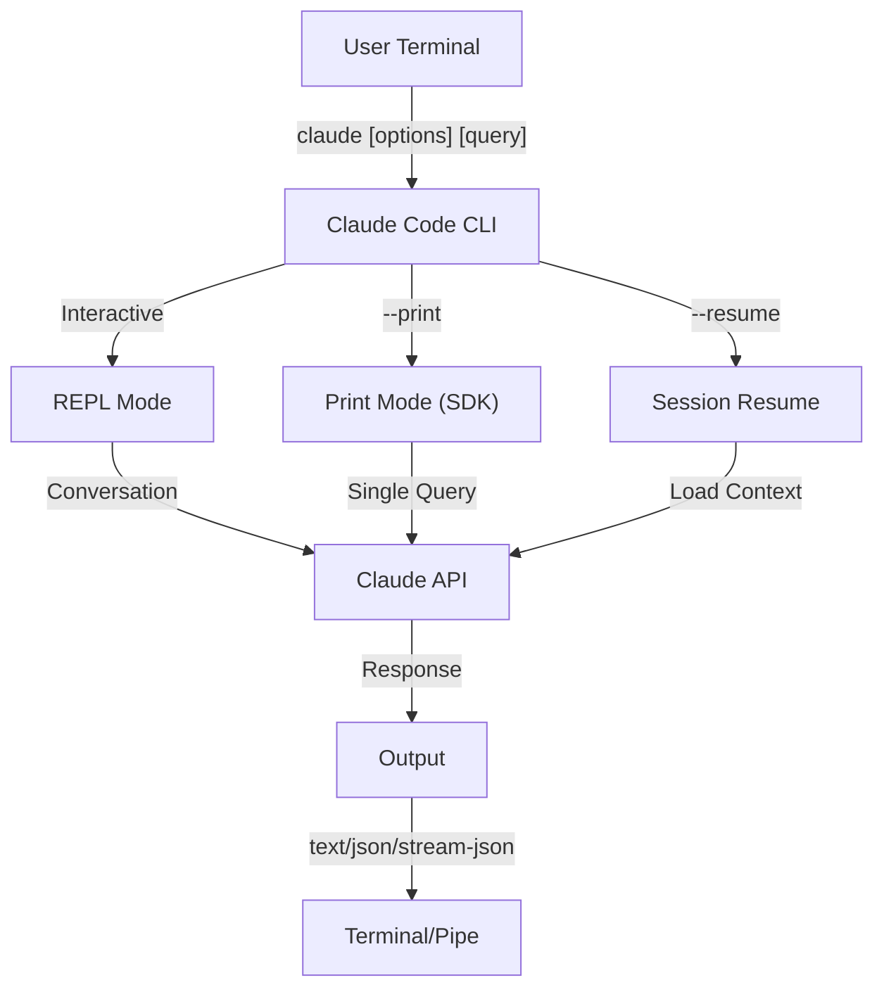
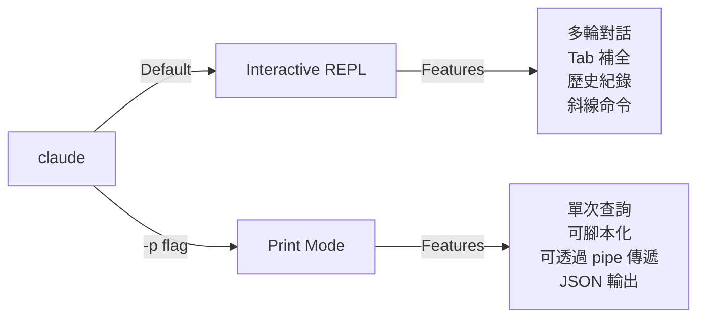

<picture>
  <source media="(prefers-color-scheme: dark)" srcset="../resources/logos/claude-howto-logo-dark.svg">
  
</picture>

# CLI Reference

## 概觀

Claude Code CLI（命令列介面）是與 Claude Code 互動的主要方式。它提供了強大的選項，用於執行查詢、管理會話、配置模型，以及將 Claude 整合到您的開發工作流程中。

## 架構


```mermaid
graph TD
    A["User Terminal"] -->|"claude [options] [query]"| B["Claude Code CLI"]
    B -->|Interactive| C["REPL Mode"]
    B -->|"--print"| D["Print Mode (SDK)"]
    B -->|"--resume"| E["Session Resume"]
    C -->|Conversation| F["Claude API"]
    D -->|Single Query| F
    E -->|Load Context| F
    F -->|Response| G["Output"]
    G -->|text/json/stream-json| H["Terminal/Pipe"]
```

## CLI 命令

| 命令 | 描述 | 範例 |
|---------|-------------|---------|
| `claude` | 啟動互動式 REPL | `claude` |
| `claude "query"` | 啟動帶有初始提示詞的 REPL | `claude "explain this project"` |
| `claude -p "query"` | 列印模式 - 執行查詢後退出 | `claude -p "explain this function"` |
| `cat file \| claude -p "query"` | 處理透過管線傳送的內容 | `cat logs.txt \| claude -p "explain"` |
| `claude -c` | 繼續最近一次的對話 | `claude -c` |
| `claude -c -p "query"` | 在列印模式下繼續對話 | `claude -c -p "check for type errors"` |
| `claude -r "<session>" "query"` | 透過 ID 或名稱恢復會話 | `claude -r "auth-refactor" "finish this PR"` |
| `claude update` | 更新至最新版本 | `claude update` |
| `claude mcp` | 配置 MCP 伺服器 | 請參閱 [MCP documentation](../05-mcp/) |
| `claude mcp serve` | 將 Claude Code 作為 MCP 伺服器執行 | `claude mcp serve` |
| `claude agents` | 列出所有已配置的子代理 | `claude agents` |
| `claude auto-mode defaults` | 以 JSON 格式列印自動模式預設規則 | `claude auto-mode defaults` |
| `claude remote-control` | 啟動遠端控制伺服器 | `claude remote-control` |
| `claude plugin` | 管理外掛（安裝、啟用、停用） | `claude plugin install my-plugin` |
| `claude auth login` | 登入（支援 `--email`、`--sso`） | `claude auth login --email user@example.com` |
| `claude auth logout` | 登出目前帳號 | `claude auth logout` |
| `claude auth status` | 檢查驗證狀態（若已登入則回傳 0，否則回傳 1） | `claude auth status` |

## 核心 Flags

| Flag | 說明 | 範例 |
|------|-------------|---------|
| `-p, --print` | 印出回應而不進入互動模式 | `claude -p "query"` |
| `-c, --continue` | 載入最近一次的對話 | `claude --continue` |
| `-r, --resume` | 透過 ID 或名稱恢復特定會話 | `claude --resume auth-refactor` |
| `-v, --version` | 輸出版本號碼 | `claude -v` |
| `-w, --worktree` | 在隔離的 git worktree 中啟動 | `claude -w` |
| `-n, --name` | 會話顯示名稱 | `claude -n "auth-refactor"` |
| `--from-pr <number>` | 恢復與 GitHub PR 關聯的會話 | `claude --from-pr 42` |
| `--remote "task"` | 在 claude.ai 上建立網頁會話 | `claude --remote "implement API"` |
| `--remote-control, --rc` | 使用 Remote Control 的互動式會話 | `claude --rc` |
| `--teleport` | 在本地恢復網頁會話 | `claude --teleport` |
| `--teammate-mode` | 代理團隊顯示模式 | `claude --teammate-mode tmux` |
| `--bare` | 最小化模式（跳過 hooks、skills、plugins、MCP、自動記憶、CLAUDE.md） | `claude --bare` |
| `--enable-auto-mode` | 解鎖自動權限模式（對於 Opus 4.7 的 Max 訂閱者不再需要） | `claude --enable-auto-mode` |
| `--channels` | 訂閱 MCP channel plugins | `claude --channels discord,telegram` |
| `--chrome` / `--no-chrome` | 啟用/停用 Chrome 瀏覽器整合 | `claude --chrome` |
| `--effort` | 設定思考努力程度 | `claude --effort high` |
| `--init` / `--init-only` | 執行初始化 hooks | `claude --init` |
| `--maintenance` | 執行維護 hooks 並退出 | `claude --maintenance` |
| `--disable-slash-commands` | 停用所有 skills 與斜線命令 | `claude --disable-slash-commands` |
| `--no-session-persistence` | 停用會話儲存（印出模式） | `claude -p --no-session-persistence "query"` |
| `--exclude-dynamic-system-prompt-sections` | 從 system prompt 中排除動態區段，以獲得更好的 prompt 快取命中率 | `claude -p --exclude-dynamic-system-prompt-sections "query"` |

### 互動模式 vs 印出模式


```mermaid
graph LR
    A["claude"] -->|Default| B["Interactive REPL"]
    A -->|"-p flag"| C["Print Mode"]
    B -->|Features| D["多輪對話<br>Tab 補全<br>歷史紀錄<br>斜線命令"]
    C -->|Features| E["單次查詢<br>可腳本化<br>可透過 pipe 傳遞<br>JSON 輸出"]
```

**互動模式** (預設):
```bash
# 啟動互動式會話
claude

# 帶有初始提示詞啟動
claude "explain the authentication flow"
```

**印出模式** (非互動式):
```bash
# 單次查詢，然後退出
claude -p "what does this function do?"

# 處理檔案內容
cat error.log | claude -p "explain this error"

# 與其他工具串接
claude -p "list todos" | grep "URGENT"
```

## 模型與組態

| 參數 | 說明 | 範例 |
|------|-------------|---------|
| `--model` | 設定模型 (sonnet, opus, haiku 或完整名稱) | `claude --model opus` |
| `--fallback-model` | 當負載過重時自動切換備用模型 | `claude -p --fallback-model sonnet "query"` |
| `--agent` | 指定該會話使用的代理 | `claude --agent my-custom-agent` |
| `--agents` | 透過 JSON 定義自定義子代理 | 請參閱 [Agents Configuration](#agents-configuration) |
| `--effort` | 設定投入程度 (low, medium, high, xhigh, max) | `claude --effort xhigh` |

### 模型選擇範例

```bash
# 使用 Opus 4.7 處理複雜任務
claude --model opus "design a caching strategy"

# 使用 Haiku 4.5 處理快速任務
claude --model haiku -p "format this JSON"

# 使用完整模型名稱
claude --model claude-sonnet-4-6-20250929 "review this code"

# 使用備用模型以確保可靠性
claude -p --model opus --fallback-model sonnet "analyze architecture"

# 使用 opusplan (Opus 規劃，Sonnet 執行)
claude --model opusplan "design and implement the caching layer"
```

## System Prompt 自定義

| 參數 | 說明 | 範例 |
|------|-------------|---------|
| `--system-prompt` | 取代整個預設提示詞 | `claude --system-prompt "You are a Python expert"` |
| `--system-prompt-file` | 從檔案載入提示詞 (列印模式) | `claude -p --system-prompt-file ./prompt.txt "query"` |
| `--append-system-prompt` | 附加至預設提示詞 | `claude --append-system-prompt "Always use TypeScript"` |

### System Prompt 範例

```bash
# 完全自定義人格
claude --system-prompt "You are a senior security engineer. Focus on vulnerabilities."

# 附加特定指令
claude --append-system-prompt "Always include unit tests with code examples"

# 從檔案載入複雜的提示詞
claude -p --system-prompt-file ./prompts/code-reviewer.txt "review main.py"
```

### System Prompt 參數比較

| 參數 | 行為 | 互動模式 | 列印模式 |
|------|----------|-------------|-------|
| `--system-prompt` | 取代整個預設 system prompt | ✅ | ✅ |
| `--system-prompt-file` | 以檔案中的提示詞取代 | ❌ | ✅ |
| `--append-system-prompt` | 附加至預設 system prompt | ✅ | ✅ |

**請僅在列印模式下使用 `--system-prompt-file`。在互動模式下，請使用 `--system-prompt` 或 `--append-system-prompt`。**

## 工具與權限管理

| Flag | 說明 | 範例 |
|------|-------------|---------|
| `--tools` | 限制可用的內建工具 | `claude -p --tools "Bash,Edit,Read" "query"` |
| `--allowedTools` | 無須提示即可執行的工具 | `"Bash(git log:*)" "Read"` |
| `--disallowedTools` | 從上下文（context）中移除的工具 | `"Bash(rm:*)" "Edit"` |
| `--dangerously-skip-permissions` | 跳過所有權限提示 | `claude --dangerously-skip-permissions` |
| `--permission-mode` | 以指定的權限模式啟動 | `claude --permission-mode auto` |
| `--permission-prompt-tool` | 用於處理權限的 MCP 工具 | `claude -p --permission-prompt-tool mcp_auth "query"` |
| `--enable-auto-mode` | 解鎖自動權限模式 | `claude --enable-auto-mode` |

### 權限範例

```bash
# 用於程式碼審查的唯讀模式
claude --permission-mode plan "review this codebase"

# 僅限制於安全工具
claude --tools "Read,Grep,Glob" -p "find all TODO comments"

# 允許特定的 git 指令而無需提示
claude --allowedTools "Bash(git status:*)" "Bash(git log:*)"

# 封鎖危險操作
claude --disallowedTools "Bash(rm -rf:*)" "Bash(git push --force:*)"
```

## 輸出與格式

| Flag | 說明 | 選項 | 範例 |
|------|-------------|---------|---------|
| `--output-format` | 指定輸出格式（列印模式） | `text`, `json`, `stream-json` | `claude -p --output-format json "query"` |
| `--input-format` | 指定輸入格式（列印模式） | `text`, `stream-json` | `claude -p --input-format stream-json` |
| `--verbose` | 啟用詳細日誌 | | `claude --verbose` |
| `--include-partial-messages` | 包含串流事件 | 需要 `stream-json` | `claude -p --output-format stream-json --include-partial-messages "query"` |
| `--json-schema` | 取得符合 schema 的驗證 JSON | | `claude -p --json-schema '{"type":"object"}' "query"` |
| `--max-budget-usd` | 列印模式的最大支出金額 | | `claude -p --max-budget-usd 5.00 "query"` |

### 輸出格式範例

```bash
# 純文字（預設）
claude -p "explain this code"

# 用於程式化使用的 JSON
claude -p --output-format json "list all functions in main.py"

# 用於即時處理的串流 JSON
claude -p --output-format stream-json "generate a long report"

# 帶有 schema 驗證的結構化輸出
claude -p --json-schema '{"type":"object","properties":{"bugs":{"type":"array"}}}' \
  "find bugs in this code and return as JSON"
```

## Workspace & Directory

| 參數 | 說明 | 範例 |
|------|-------------|---------|
| `--add-dir` | 新增額外的作業目錄 | `claude --add-dir ../apps ../lib` |
| `--setting-sources` | 以逗號分隔的設定來源 | `claud --setting-sources user,project` |
| `--settings` | 從檔案或 JSON 載入設定 | `claude --settings ./settings.json` |
| `--plugin-dir` | 從目錄載入外掛（可重複使用） | `claude --plugin-dir ./my-plugin` |

### 多目錄範例

```bash
# 在多個專案目錄中進行工作
claude --add-dir ../frontend ../backend ../shared "find all API endpoints"

# 載入自定義設定
claude --settings '{"model":"opus","verbose":true}' "complex task"
```

## MCP Configuration

| 參數 | 說明 | 範例 |
|------|-------------|---------|
| `--mcp-config` | 從 JSON 載入 MCP servers | `claude --mcp-config ./mcp.json` |
| `--strict-mcp-config` | 僅使用指定的 MCP config | `claude --strict-mcp-config --mcp-config ./mcp.json` |
| `--channels` | 訂閱 MCP channel 外掛 | `claude --channels discord,telegram` |

### MCP 範例

```bash
# 載入 GitHub MCP server
claude --mcp-config ./github-mcp.json "list open PRs"

# 嚴格模式 - 僅使用指定的 servers
claude --strict-mcp-config --mcp-config ./production-mcp.json "deploy to staging"
```

## Session Management

| 參數 | 說明 | 範例 |
|------|-------------|---------|
| `--session-id` | 使用特定的 session ID (UUID) | `claude --session-id "550e8400-..."` |
| `--fork-session` | 恢復時建立新的 session | `claude --resume abc123 --fork-session` |

### Session 範例

```bash
# 繼續上一次的對話
claude -c

# 恢復具名的 session
claude -r "feature-auth" "continue implementing login"

# 為了實驗而分叉 (fork) session
claude --resume feature-auth --fork-session "try alternative approach"

# 使用特定的 session ID
claude --session-id "550e8400-e29b-41d4-a716-446655440000" "continue"
```

### Session Fork

從現有的 session 建立一個分支以進行實驗：

```bash
# 分叉一個 session 以嘗試不同的方法
claude --resume abc123 --fork-session "try alternative implementation"

# 帶有自定義訊息的分叉
claude -r "feature-auth" --fork-session "test with different architecture"
```

**使用情境：**
- 在不遺失原始 session 的情況下嘗試不同的實作方式
- 並行地實驗不同的方法
- 從成功的成果中建立分支以進行變體開發
- 在不影響主 session 的情況下測試破壞性變更 (breaking changes)

原始 session 將保持不變，而分叉出的內容會成為一個新的獨立 session。

## 進階功能

| Flag | 說明 | 範例 |
|------|-------------|---------|
| `--chrome` | 啟用 Chrome 瀏覽器整合 | `claude --chrome` |
| `--no-chrome` | 停用 Chrome 瀏覽器整合 | `claude --no-chrome` |
| `--ide` | 若可用則自動連接至 IDE | `claude --ide` |
| `--max-turns` | 限制代理回合數（非互動式） | `claude -p --max-turns 3 "query"` |
| `--debug` | 啟用帶有過濾功能的除錯模式 | `claud --debug "api,mcp"` |
| `--enable-lsp-logging` | 啟用詳細的 LSP 日誌記錄 | `claude --enable-lsp-logging` |
| `--betas` | 用於 API 請求的 Beta 標頭 | `claude --betas interleaved-thinking` |
| `--plugin-dir` | 從目錄載入外掛（可重複使用） | `claude --plugin-dir ./my-plugin` |
| `--enable-auto-mode` | 解鎖自動權限模式 | `claude --enable-auto-mode` |
| `--effort` | 設定思考努力程度 | `claude --effort high` |
| `--bare` | 極簡模式（跳過 hooks、skills、plugins、MCP、自動 memory、CLAUDE.md） | `claude --bare` |
| `--channels` | 訂閱 MCP channel 外掛 | `claude --channels discord` |
| `--tmux` | 為 worktree 建立 tmux session | `claude --tmux` |
| `--fork-session` | 恢復時建立新的 session ID | `claude --resume abc --fork-session` |
| `--max-budget-usd` | 最大支出限制（列印模式） | `claude -p --max-budget-usd 5.00 "query"` |
| `--json-schema` | 驗證 JSON 輸出 | `claude -p --json-schema '{"type":"object"}' "q"` |

### 平台與主題說明 (v2.1.112)

- **Windows 上的 PowerShell 工具**：專用的 PowerShell 工具正於 Windows 上陸續推出，並可透過環境變數進行控制。
- **Auto (match terminal) 主題**：全新的「Auto (match terminal)」主題會將 Claude Code 的淺色/深色外觀與您的終端機同步。
- **更安靜的權限提示**：唯讀的 `Bash` 調用與 `Glob` 模式不再觸發權限提示。

### 進階範例

```bash
# 限制自主行為
claude -p --max-turns 5 "refactor this module"

# 除錯 API 調用
claude --debug "api" "test query"

# 啟用 IDE 整合
claude --ide "help me with this file"
```

## Agents 設定

`--agents` 旗標接受一個 JSON 物件，用於定義該會話的自定義子代理。

### Agents JSON 格式

```json
{
  "agent-name": {
    "description": "必填：何時要呼叫此代理",
    "prompt": "必填：此代理的系統提示詞",
    "tools": ["選填", "工具", "陣列"],
    "model": "選填：sonnet|opus|haiku"
  }
}
```

**必填欄位：**
- `description` - 以自然語言描述何時使用此代理
- `prompt` - 定義代理角色與行為的系統提示詞

**選填欄位：**
- `tools` - 可用工具的陣列（若省略則繼承所有工具）
  - 格式：`["Read", "Grep", "Glob", "Bash"]`
- `model` - 使用的模型：`sonnet`、`opus` 或 `haiku`

### 完整的 Agents 範例

```json
{
  "code-reviewer": {
    "description": "專家級程式碼審查員。在程式碼變更後主動使用。",
    "prompt": "你是一位資深程式碼審查員。專注於程式碼品質、安全性與最佳實務。",
    "tools": ["Read", "Grep", "Glob", "Bash"],
    "model": "sonnet"
  },
  "debugger": {
    "description": "針對錯誤與測試失敗的除錯專家。",
    "prompt": "你是一位專家級除錯員。分析錯誤、識別根本原因並提供修復方案。",
    "tools": ["Read", "Edit", "Bash", "Grep"],
    "model": "opus"
  },
  "documenter": {
    "description": "用於生成指南的技術文件專家。",
    "prompt": "你是一位技術作家。建立清晰且全面的文件。",
    "tools": ["Read", "Write"],
    "model": "haiku"
  }
}
```

### Agents 命令範例

```bash
# 行內定義自定義代理
claude --agents '{
  "security-auditor": {
    "description": "用於漏洞分析的安全專家",
    "prompt": "你是一位安全專家。尋找漏洞並建議修復方案。",
    "tools": ["Read", "Grep", "Glob"],
    "model": "opus"
  }
}' "audit this codebase for security issues"

# 從檔案載入代理
claude --agents "$(cat ~/.claude/agents.json)" "review the auth module"

# 與其他旗標結合使用
claude -p --agents "$(cat agents.json)" --model sonnet "analyze performance"
```

### Agent 優先順序

當存在多個代理定義時，它們將依據以下優先順序載入：
1. **CLI 定義** (`--agents` 旗標) - 僅限該會話
2. **使用者層級** (`~/.claude/agents/`) - 所有專案
3. **專案層級** (`.claude/agents/`) - 目前專案

CLI 定義的代理會覆蓋該會話中的使用者與專案代理。

---

## 高價值使用案例

### 1. CI/CD 整合

在您的 CI/CD 流水線中使用 Claude Code 進行自動化程式碼審查、測試與文件撰寫。

**GitHub Actions 範例：**

```yaml
name: AI Code Review

on: [pull_request]

jobs:
  review:
    runs-on: ubuntu-latest
    steps:
      - uses: actions/checkout@v4

      - name: Install Claude Code
        run: npm install -g @anthropic-ai/claude-code

      - name: Run Code Review
        env:
          ANTHROPIC_API_KEY: ${{ secrets.ANTHROPIC_API_KEY }}
        run: |
          claude -p --output-format json \
            --max-turns 1 \
            "Review the changes in this PR for:
            - Security vulnerabilities
            - Performance issues
            - Code quality
            Output as JSON with 'issues' array" > review.json

      - name: Post Review Comment
        uses: actions/github-script@v7
        with:
          script: |
            const fs = require('fs');
            const review = JSON.parse(fs.readFileSync('review.json', 'utf8'));
            // Process and post review comments
```

**Jenkins Pipeline：**

```groovy
pipeline {
    agent any
    stages {
        stage('AI Review') {
            steps {
                sh '''
                    claude -p --output-format json \
                      --max-turns 3 \
                      "Analyze test coverage and suggest missing tests" \
                      > coverage-analysis.json
                '''
            }
        }
    }
}
```

### 2. 腳本管線 (Script Piping)

透過 Claude 處理檔案、日誌與數據以進行分析。

**日誌分析：**

```bash
# 分析錯誤日誌
tail -1000 /var/log/app/error.log | claude -p "summarize these errors and suggest fixes"

# 在存取日誌中尋找模式
cat access.log | claude -p "identify suspicious access patterns"

# 分析 git 歷史紀錄
git log --oneline -50 | claude -p "summarize recent development activity"
```

**程式碼處理：**

```bash
# 審查特定檔案
cat src/auth.ts | claude -p "review this authentication code for security issues"

# 生成文件
cat src/api/*.ts | claude -p "generate API documentation in markdown"

# 尋找 TODO 並排序優先權
grep -r "TODO" src/ | claude -p "prioritize these TODOs by importance"
```

### 3. 多會話工作流程 (Multi-Session Workflows)

透過多個對話執行緒管理複雜專案。

```bash
# 開始一個功能分支會話
claude -r "feature-auth" "let's implement user authentication"

# 稍後，繼續該會話
claude -r "feature-auth" "add password reset functionality"

# 分叉 (Fork) 以嘗試另一種方法
claude --resume feature-auth --fork-session "try OAuth instead"

# 在不同的功能會話之間切換
claude -r "feature-payments" "continue with Stripe integration"
```

### 4. 自定義代理配置

為您團隊的工作流程定義專門的代理。

```bash
# 將代理配置儲存至檔案
cat > ~/.claude/agents.json << 'EOF'
{
  "reviewer": {
    "description": "Code reviewer for PR reviews",
    "prompt": "Review code for quality, security, and maintainability.",
```

"model": "opus"
  },
  "documenter": {
    "description": "Documentation specialist
    "prompt": "Generate clear, comprehensive documentation.",
    "model": "sonnet"
  },
  "refactorer": {
    "description": "Code refactoring expert
    "prompt": "Suggest and implement clean code refactor
    "tools": ["Read", "Edit", "Glob"]
  }
}
EOF

# Use agents in session
claude --agents "$(cat ~/.claude/agents.json"
claude --agents "$(cat ~/.clascript-agents.json"
  },
  "refactorer": {
    "description": "Code refactoring expert",
    "prompt": "Suggest and implement clean code refactoring."
  }
}
EOF

# Use agents in session
claude --agents "$(cat agents.json"
claude --agents "$(cat agents.json"
  },
  "refactorer": {
    "description": "Code refactoring expert",
    "prompt": "Suggest and implement clean code refactoring."
  }
}
EOF

# Use agents in session
claude --agents "$(cat agents.json
  },
  "refactorer": {
    "description": "Code refactoring expert",
    "prompt": "Suggest and implement clean code refactoring."
  }
}
EOF

# Use agents in session
claude --agents "$(cat agents.json
  },
  "refactorer": {
    "description": "Code refactoring expert",
    "prompt": "Suggest and implement clean code refactoring."
  }
}
EOF

# Use agents in session
claude --agents "$(cat agents.json
  },
  "refactorer": {
    "description": "Code refactoring expert",
    "prompt": "Suggest and implement clean code refactoring."
  }
}
EOF

# Use agents in session
claude --agents "$(cat agents.json
  },
  "description": "Code refactoring expert",
  "prompt": "Suggest and implement clean code refactoring."
}
EOF

# Use agents in session
claude --agents "$(cat agents.json
  },
  "description": "Code refactoring expert",
  "prompt": "Suggest and implement clean code refactoring."
}
EOF

# Use agents in session
claude --agents "$(cat agents.json
  },
  "description": "Code refactoring expert",
  "prompt": "Suggest and implement clean code refactoring."
}
EOF

# Use agents in session
claude --agents "$(cat agents.json
  },
  "description": "Code refactoring expert",
  "prompt": "Suggest and implement clean code refactoring."
}
EOF

# Use agents in session
claude --agents "$(cat agents.json
  },
  "description": "Code refactoring expert",
  "prompt": "Suggest and implement clean code refactoring."
}
EOF

# Use agents in session
claude --agents "$(cat agents.json
  },
  "description": "Code refactoring expert",
  "prompt": "Suggest and implement clean code refactoring."
}
EOF

# Use agents in session
claude --agents "$(cat agents.json
  },
  "description": "Code refactoring expert",
  "prompt": "Suggest and implement clean code refactoring."
}
EOF

# Use agents in session
claude --agents "$(cat agents.json
  },
  "description": "Code refactoring expert",
  "prompt": "Suggest and implement clean code refactoring."
}
EOF

# Use agents in session
claude --agents "$(cat agents.json
  },
  "description": "Code refactoring expert",
  "prompt": "Suggest and implement clean code refactoring."
}
EOF

# Use agents in session
claude --agents "$(cat agents.json
  },
  "description": "Code refactoring expert",
  "prompt": "Suggest and implement clean code refactoring."
}
EOF

# Use agents in session
claude --agents "$(cat agents.json
  },
  "description": "Code refactoring expert",
  "prompt": "Suggest and implement clean code refactoring."
}
EOF

# Use agents in session
claude --agents "$(cat agents.json
  },
  "description": "Code refactoring expert",
  "prompt": "Suggest and implement clean code refactoring."
}
EOF

# Use agents in session
claude --agents "$(cat agents.json
  },
  "description": "Code refactoring expert",
  "prompt": "Suggest and implement clean code refactoring."
}
EOF

# Use agents in session
claude --agents "$(cat agents.json
  },
  "description": "Code refactoring expert",
  "prompt": "Suggest and implement clean code refactoring."
}
EOF

# Use agents in session
claude --agents "$(cat agents.json
  },
  "description": "Code refactoring expert",
  "prompt": "Suggest and implement clean code refactoring."
}
EOF

# Use agents in session
claude --agents "$(cat agents.json
  },
  "description": "Code refactoring expert",
  "prompt": "Suggest and implement clean code refactoring."
}
EOF

# Use agents in session
claude --agents "$(cat agents.json
  },
  "description": "Code refactoring expert",
  "prompt": "Suggest and implement clean code refactoring."
}
EOF

# Use agents in session
claude --agents "$(cat agents.json
  },
  "description": "Code refactoring expert",
  "prompt": "Suggest and implement clean code refactoring."
}
EOF

# Use agents in session
claude --agents "$(cat agents.json
  },
  "description": "Code refactoring expert",
  "prompt": "Suggest and implement clean code refactoring."
}
EOF

# Use agents in session
claude --agents "$(cat agents.json
  },
  "description": "Code refactoring expert",
  "prompt": "Suggest and implement clean code refactoring."
}
EOF

# Use agents in session
claude --agents "$(cat agents.json
  },
  "description": "Code refactoring expert",
  "prompt": "Suggest and implement clean code refactoring."
}
EOF

# Use agents in session
claude --agents "$(cat agents.json
  },
  "description": "Code refactoring expert",
  "prompt": "Suggest and implement clean code refactoring."
}
EOF

# Use agents in session
claude --agents "$(cat agents.json
  },
  "description": "Code refactoring expert",
  "prompt": "Suggest and implement clean code refactoring."
}
EOF

# Use agents in session
claude --agents "$(cat agents.json
  },
  "description": "Code refactoring expert",
  "prompt": "Suggest and implement clean code refactoring."
}
EOF

# Use agents in session
claude --agents "$(cat agents.json
  },
  "description": "Code refactoring expert",
  "prompt": "Suggest and implement clean code refactoring."
}
EOF

# Use agents in session
claude --agents "$(cat agents.json
  },
  "description": "Code refactoring expert",
  "prompt": "Suggest and implement clean code refactoring."
}
EOF

# Use agents in session
claude --agents "$(cat agents.json
  },
  "description": "Code refactoring expert",
  "prompt": "Suggest and implement clean code refactoring."
}
EOF

# Use agents in session
claude --agents "$(cat agents.json
  },
  "description": "Code refactoring expert",
  "prompt": "Suggest and implement clean code refactoring."
}
EOF

# Use agents in session
claude --agents "$(cat agents.json
  },
  "description": "Code refactoring expert",
  "prompt": "Suggest and implement clean code refactoring."
}
EOF

# Use agents in session
claude --agents "$(cat agents.json
  },
  "description": "Code refactoring expert",
  "prompt": "Suggest and implement clean code refactoring."
}
EOF

# Use agents in session
claude --agents "$(cat agents.json
  },
  "description": "Code refactoring expert",
  "prompt": "Suggest and implement clean code refactoring."
}
EOF

# Use agents in session
claude --agents "$(cat agents.json
  },
  "description": "Code refactoring expert",
  "prompt": "Suggest and implement clean code refactoring."
}
EOF

# Use agents in session
claude --agents "$(cat agents.json
  },
  "description": "Code refactoring expert",
  "prompt": "Suggest and implement clean code refactoring."
}
EOF

# Use agents in session
claude --agents "$(cat agents.json
  },
  "description": "Code refactoring expert",
  "prompt": "Suggest and implement clean code refactoring."
}
EOF

# Use agents in session
claude --agents "$(cat agents.json
  },
  "description": "Code refactoring expert",
  "prompt": "Suggest and implement clean code refactoring."
}
EOF

# Use agents in session
claude --agents "$(cat agents.json
  },
  "description": "Code refactoring expert",
  "prompt": "Suggest and implement clean code refactoring."
}
EOF

# Use agents in session
claude --agents "$(cat agents.json
  },
  "description": "Code refactoring expert",
  "prompt": "Suggest and implement clean code refactoring."
}
EOF

# Use agents in session
claude --agents "$(cat agents.json
  },
  "description": "Code refactoring expert",
  "prompt": "Suggest and implement clean code refactoring."
}
EOF

# Use agents in session
claude --agents "$(cat agents.json
  },
  "description": "Code refactoring expert",
  "prompt": "Suggest and implement clean code refactoring."
}
EOF

# Use agents in session
claude --agents "$(cat agents.json
  },
  "description": "Code refactoring expert",
  "prompt": "Suggest and implement clean code refactoring."
}
EOF

# Use agents in session
claude --agents "$(cat agents.json
  },
  "description": "Code refactoring expert",
  "prompt": "Suggest and implement clean code refactoring."
}
EOF

# Use agents in session
claude --agents "$(cat agents.json
  },
  "description": "Code refactoring expert",
  "prompt": "Suggest and implement clean code refactoring."
}
EOF

# Use agents in session
claude --agents "$(cat agents.json
  },
  "description": "Code refactoring expert",
  "prompt": "Suggest and implement clean code refactoring."
}
EOF

# Use agents in session
claude --agents "$(cat agents.json
  },
  "description": "Code refactoring expert",
  "prompt": "Suggest and implement clean code refactoring."
}
EOF

# Use agents in session
claude --agents "$(cat agents.json
  },
  "description": "Code refactoring expert",
  "prompt": "Suggest and implement clean code refactoring."
}
EOF

# Use agents in session
claude --agents "$(cat agents.json
  },
  "description": "Code refactoring expert",
  "prompt": "Suggest and implement clean code refactoring."
}
EOF

# Use agents in session
claude --agents "$(cat agents.json
  },
  "description": "Code refactoring expert",
  "prompt": "Suggest and implement clean code refactoring."
}
EOF

# Use agents in session
claude --agents "$(cat agents.json
  },
  "description": "Code refactoring expert",
  "prompt": "Suggest and implement clean code refactoring."
}
EOF

# Use agents in session
claude --agents "$(cat agents.json
  },
  "description": "Code refactoring expert",
  "prompt": "Suggest and implement clean code refactoring."
}
EOF

# Use agents in session
claude --agents "$(cat agents.json
  },
  "description": "Code refactoring expert",
  "prompt": "Suggest and implement clean code refactoring."
}
EOF

# Use agents in session
claude --agents "$(cat agents.json
  },
  "description": "Code refactoring expert",
  "prompt": "Suggest and implement clean code refactoring."
}
EOF

# Use agents in session
claude --agents "$(cat agents.json
  },
  "description": "Code refactoring expert",
  "prompt": "Suggest and implement clean code refactoring."
}
EOF

# Use agents in session
claude --agents "$(cat agents.json
  },
  "description": "Code refactoring expert",
  "prompt": "Suggest and implement clean code refactoring."
}
EOF

# Use agents in session
claude --agents "$(cat agents.json
  },
  "description": "Code refactoring expert",
  "prompt": "Suggest and implement clean code refactoring."
}
EOF

# Use agents in session
claude --agents "$(cat agents.json
  },
  "description": "Code refactoring expert",
  "prompt": "Suggest and implement clean code refactoring."
}
EOF

# Use agents in session
claude --agents "$(cat agents.json
  },
  "description": "Code refactoring expert",
  "prompt": "Suggest and implement clean code refactoring."
}
EOF

# Use agents in session
claude --agents "$(cat agents.json
  },
  "description": "Code refactoring expert",
  "prompt": "Suggest and implement clean code refactoring."
}
EOF

# Use agents in session
claude --agents "$(cat agents.json
  },
  "description": "Code refactoring expert",
  "prompt": "Suggest and implement clean code refactoring."
}
EOF

# Use agents in session
claude --agents "$(cat agents.json
  },
  "description": "Code refactoring expert",
  "prompt": "Suggest and implement clean code refactoring."
}
EOF

# Use agents in session
claude --agents "$(cat agents.json
  },
  "description": "Code refactoring expert",
  "prompt": "Suggest and implement clean code refactoring."
}
EOF

# Use agents in session
claude --agents "$(cat agents.json
  },
  "description": "Code refactoring expert",
  "prompt": "Suggest and implement clean code refactoring."
}
EOF

# Use agents in session
claude --agents "$(cat agents.json
  },
  "description": "Code refactoring expert",
  "prompt": "Suggest and implement clean code refactoring."
}
EOF

# Use agents in session
claude --agents "$(cat agents.json
  },
  "description": "Code refactoring expert",
  "prompt": "Suggest and implement clean code refactoring."
}
EOF

# Use agents in session
claude --agents "$(cat agents.json
  },
  "description": "Code refactoring expert",
  "prompt": "Suggest and implement clean code refactoring."
}
EOF

# Use agents in session
claude --agents "$(cat agents.json
  },
  "description": "Code refactoring expert",
  "prompt": "Suggest and implement clean code refactoring."
}
EOF

# Use agents in session
claude --agents "$(cat agents.json
  },
  "description": "Code refactoring expert",
  "prompt": "Suggest and implement clean code refactoring."
}
EOF

# Use agents in session
claude --agents "$(cat agents.json
  },
  "description": "Code refactoring expert",
  "prompt": "Suggest and implement clean code refactoring."
}
EOF

# Use agents in session
claude --agents "$(cat agents.json
  },
  "description": "Code refactoring expert",
  "prompt": "Suggest and implement clean code refactoring."
}
EOF

# Use agents in session
claude --agents "$(cat agents.json
  },
  "description": "Code refactoring expert",
  "prompt": "Suggest and implement clean code refactoring."
}
EOF

# Use agents in session
claude --agents "$(cat agents.json
  },
  "description": "Code refactoring expert",
  "prompt": "Suggest and implement clean code refactoring."
}
EOF

# Use agents in session
claude --agents "$(cat agents.json
  },
  "description": "Code refactoring expert",
  "prompt": "Suggest and implement clean code refactoring."
}
EOF

# Use agents in session
claude --agents "$(cat agents.json
  },
  "description": "Code refactoring expert",
  "prompt": "Suggest and implement clean code refactoring."
}
EOF

# Use agents in session
claude --agents "$(cat agents.json
  },
  "description": "Code refactoring expert",
  "prompt": "Suggest and implement clean code refactoring."
}
EOF

# Use agents in session
claude --agents "$(cat agents.json
  },
  "description": "Code refactoring expert",
  "prompt": "Suggest and implement clean code refactoring."
}
EOF

# Use agents in session
claude --agents "$(cat agents.json
  },
  "description": "Code refactoring expert",
  "prompt": "Suggest and implement clean code refactoring."
}
EOF

# Use agents in session
claude --agents "$(cat agents.json
  },
  "description": "Code refactoring expert",
  "prompt": "Suggest and implement clean code refactoring."
}
EOF

# Use agents in session
claude --agents "$(cat agents.json
  },

# 處理整個陣列
claude -p --output-format json "find todos" | jq '.todos | length'

# 轉換輸出
claude -p --output-format json "list improvements" | jq 'map({title: .title, priority: .priority})'
```

---

## 模型

Claude Code 支援具有不同能力的複數模型：

| 模型 | ID | 上下文視窗 | 備註 |
|-------|-----|----------------|-------|
| Opus 4.7 | `claude-opus-4-7` | 1M tokens | 能力最強，具備適應性努力層級 |
| Sonnet 4.6 | `claude-sonnet-4-6` | 1M tokens | 速度與能力的平衡 |
| Haiku 4.5 | `claude-haiku-4-5` | 1M tokens | 最快，適合快速任務 |

### 模型選擇

```bash
# 使用簡短名稱
claude --model opus "complex architectural review"
claude --model sonnet "implement this feature"
claude --model haiku -p "format this JSON"

# 使用 opusplan 別名 (Opus 規劃，Sonnet 執行)
claude --model opusplan "design and implement the API"

# 在會話期間切換快速模式
/fast
```

### 努力層級 (Opus 4.7)

Opus 4.7 支援透過努力層級進行適應性推理，由輕到重排序為：`low` (○)、`medium` (◐)、`high` (●)、`xhigh` (v2.1.111 新增)，以及 `max` (僅限 Opus 4.7)。Opus 4.7 的預設值為 `xhigh`。

```bash
# 透過 CLI 旗標設定努力層級
claude --effort xhigh "complex review"

# 透過斜線命令設定努力層級
/effort xhigh

# 透過環境變數設定努力層級
export CLAUDE_CODE_EFFORT_LEVEL=xhigh   # low, medium, high, xhigh (Opus 4.7 預設值), 或 max (僅限 Opus 4.7)
```

提示詞中的 "ultrathink" 關鍵字會啟動深度推理。`max` 努力層級為 Opus 4.7 專屬。

---

## 關鍵環境變數

| 變數 | 說明 |
|----------|-------------|
| `ANTHROPIC_API_KEY` | 用於身分驗證的 API key |
| `ANTHROPIC_MODEL` | 覆蓋預設模型 |
| `ANTHROPIC_CUSTOM_MODEL_OPTION` | 用於 API 的自定義模型選項 |
| `ANTHROPIC_DEFAULT_OPUS_MODEL` | 覆蓋預設 Opus 模型 ID |
| `ANTHROPIC_DEFAULT_SONNET_MODEL` | 覆蓋預設 Sonnet 模型 ID |
| `ANTHROPIC_DEFAULT_HAIKU_MODEL` | 覆蓋預設 Haiku 模型 ID |
| `MAX_THINKING_TOKENS` | 設定延伸思考的 token 預算 |
| `CLAUDE_CODE_EFFORT_LEVEL` | 設定努力程度 (`low`/`medium`/`high`/`xhigh`/`max`) — `xhigh` 是 Opus 4.7 的預設值；`max` 僅適用於 Opus 4.7 |
| `CLAUDE_CODE_SIMPLE` | 最小模式，由 `--bare` 旗標設定 |
| `CLAUDE_CODE_DISABLE_AUTO_MEMORY` | 停用自動更新 CLAUDE.md |
| `CLAUDE_CODE_DISABLE_BACKGROUND_TASKS` | 停用背景任務執行 |
| `CLAUDE_CODE_DISABLE_CRON` | 停用排程/cron 任務 |
| `CLAUDE_CODE_DISABLE_GIT_INSTRUCTIONS` | 停用 git 相關指令 |
| `CLAUDE_CODE_DISABLE_TERMINAL_TITLE` | 停用終端機標題更新 |
| `CLAUDE_CODE_DISABLE_1M_CONTEXT` | 停用 1M token 上下文視窗 |
| `CLAUDE_CODE_DISABLE_NONSTREAMING_FALLBACK` | 停用非串流回退機制 |
| `CLAUDE_CODE_ENABLE_TASKS` | 啟用任務列表功能 |
| `CLAUDE_CODE_TASK_LIST_ID` | 跨會話共用的具名任務目錄 |
| `CLAUDE_CODE_ENABLE_PROMPT_SUGGESTION` | 切換提示詞建議功能 (`true`/`false`) |
| `CLAUDE_CODE_EXPERIMENTAL_AGENT_TEAMS` | 啟用實驗性代理團隊 |
| `CLAUDE_CODE_NEW_INIT` | 使用新的初始化流程 |
| `CLAUDE_CODE_SUBAGENT_MODEL` | 用於子代理執行的模型 |
| `CLAUDE_CODE_PLUGIN_SEED_DIR` | 外掛種子檔案目錄 |
| `CLAUDE_CODE_SUBPROCESS_ENV_SCRUB` | 從子程序中清除的環境變數 |
| `CLAUDE_AUTOCOMPACT_PCT_OVERRIDE` | 覆蓋自動壓縮百分比 |
| `CLAUDE_STREAM_IDLE_TIMEOUT_MS` | 串流閒置逾時（毫秒） |
| `SLASH_COMMAND_TOOL_CHAR_BUDGET` | 斜線命令工具的字元預算 |
| `ENABLE_TOOL_SEARCH` | 啟用工具搜尋功能 |
| `MAX_MCP_OUTPUT_TOKENS` | MCP 工具輸出的最大 token 數 |
| `CLAUDE_CODE_PERFORCE_MODE` | 設定為 `1` 以啟用 Perforce 模式 — 預設將檔案視為唯讀（適用於 Perforce/P4 版本控制工作流程）（新增於 v2.1.98） |

---

## 快速參考

### 最常用命令

```bash
# 互動式會話
claude

# 快速提問
claude -p "how do I..."

# 繼續對話
claude -c

# 處理檔案
cat file.py | claude -p "review this"

# 用於腳本的 JSON 輸出
claude -p --output-format json "query"
```

### 參數組合

| 使用情境 | 命令 |
|----------|---------|
| 快速程式碼審查 | `cat file | claude -p "review"` |
| 結構化輸出 | `claude -p --output-format json "query"` |
| 安全探索 | `claude --permission-mode plan` |
| 帶有安全性的自主模式 | `claude --enable-auto-mode --permission-mode auto` |
| CI/CD 整合 | `claude -p --max-turns 3 --output-format json` |
| 恢復工作 | `claude -r "session-name"` |
| 自定義模型 | `claude --model opus "complex task"` |
| 極簡模式 | `claude --bare "quick query"` |
| 預算限制執行 | `claude -p --max-budget-usd 2.00 "analyze code"` |

---

## 除錯

### Command Not Found

**問題：** `claude: command not found`

**解決方案：**
- 安裝 Claude Code：`npm install -g @anthropic-ai/claude-code`
- 檢查 PATH 是否包含 npm 全域 bin 目錄
- 嘗試使用完整路徑執行：`npx claude`

### API Key Issues

**問題：** 身分驗證失敗

**解決方案：**
- 設定 API key：`export ANTHROPIC_API_KEY=your-key`
- 檢查 key 是否有效且有足夠的額度
- 確認該 key 對於所請求模型的權限

### Session Not Found

**問題：** 無法恢復會話

**解決方案：**
- 列出可用會話以尋找正確的名稱/ID
- 會話可能會在一段時間不活動後過期
- 使用 `-c` 來繼續最近一次的會話

### Output Format Issues

**問題：** JSON 輸出格式錯誤

**解決方案：**
- 使用 `--json-schema` 來強制執行結構
- 在提示詞中加入明確的 JSON 指令
- 使用 `--output-format json`（而不僅僅是在提示詞中要求 JSON）

### Permission Denied

**問題：** 工具執行被阻擋

**解決方案：**
- 檢查 `--permission-mode` 設定
- 檢查 `--allowedTools` 與 `--disallowedTools` 參數
- 使用 `--dangerously-skip-permissions` 進行自動化（請謹慎使用）

---

## 其他資源

- **[Official CLI Reference](https://code.claude.com/docs/en/cli-reference)** - 完整的指令參考
- **[Headless Mode Documentation](https://code.claude.com/docs/en/headless)** - 自動化執行
- **[Slash Commands](../01-slash-commands/)** - Claude 內部的自定義快捷鍵
- **[Memory Guide](../02-memory/)** - 透過 CLAUDE.md 實現的持久化上下文
- **[MCP Protocol](../05-mcp/)** - 外部工具整合
- **[Advanced Features](../09-advanced-features/)** - 規劃模式、延伸思考
- **[Subagents Guide](../04-subagents/)** - 委派任務執行

---

*本文件為 [Claude How To](../) 指南系列的一部分*

---

**最後更新日期**：2026 年 4 月 16 日
**Claude Code 版本**：2.1.112
**來源**：
- https://docs.anthropic.com/en/docs/claude-code
- https://www.anthropic.com/news/claude-opus-4-7
- https://support.claude.com/en/articles/12138966-release-notes
**相容模型**：Claude Sonnet 4.6, Claude Opus 4.7, Claude Haiku 4.5
