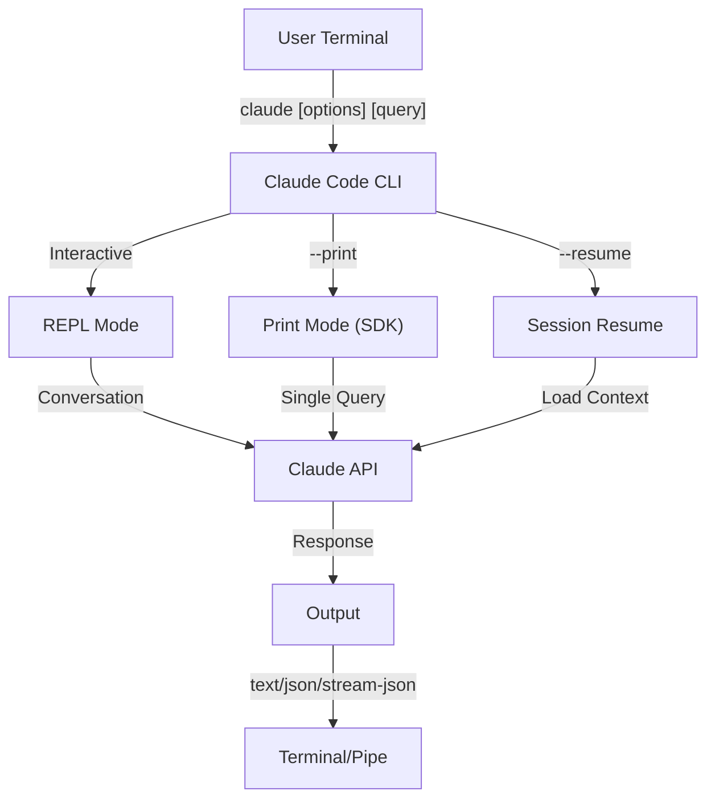
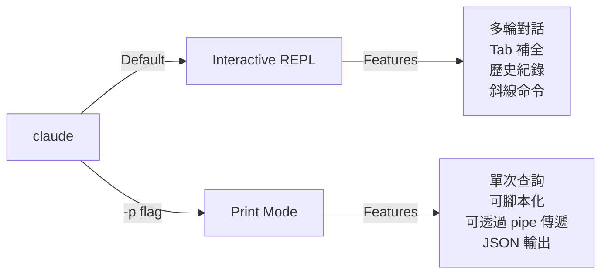

<picture>
  <source media="(prefers-color-scheme: dark)" srcset="../resources/logos/claude-howto-logo-dark.svg">
  
</picture>

# CLI 命令列介面

## 概觀

Claude Code CLI（命令列介面）是與 Claude Code 互動的主要方式。它提供了強大的選項，用於執行查詢、管理工作階段、設定模型，以及將 Claude 整合到您的開發工作流程中。

## 架構


```mermaid
graph TD
    A["User Terminal"] -->|"claude [options] [query]"| B["Claude Code CLI"]
    B -->|Interactive| C["REPL Mode"]
    B -->|"--print"| D["Print Mode (SDK)"]
    B -->|"--resume"| E["Session Resume"]
    C -->|Conversation| F["Claude API"]
    D -->|Single Query| F
    E -->|Load Context| F
    F -->|Response| G["Output"]
    G -->|text/json/stream-json| H["Terminal/Pipe"]
```

## 執行環境與封裝

自 **v2.1.113** 起，Claude Code CLI 透過可選的 npm 相依套件啟動**各平台的原生二進位執行檔**（macOS、Linux、Windows）。二進位執行檔在安裝時會依據您的作業系統與架構自動配對——舊版的 JavaScript 打包執行環境在 macOS 或 Linux 上已不再是預設選項。

**使用者端的安裝方式不變**：`npm install -g @anthropic-ai/claude-code` 依然有效，且仍是推薦的安裝路徑。在背後，npm 會為您的平台取得正確的原生二進位執行檔。

**下載來源**（v2.1.116+）：原生二進位執行檔的產出物由 `https://downloads.claude.ai/claude-code-releases` 提供。

> **企業/Proxy 使用者**：若您的網路需要明確的允許清單，請將 `downloads.claude.ai`（以及 `https://downloads.claude.ai/claude-code-releases`）加入您的 proxy 出口規則。先前僅允許 `storage.googleapis.com` 或 npm registry 的環境需要更新規則，否則 `claude update` 及初始安裝將會失敗。

舊版 JavaScript 套件仍會為 Windows 及固定使用該版本的環境產出；這些安裝版本繼續將 Glob 和 Grep 作為一級工具提供（請參閱[工具](#工具與權限管理)下方的 Glob/Grep 附註）。

## CLI 命令

| 命令 | 描述 | 範例 |
|---------|-------------|---------|
| `claude` | 啟動互動式 REPL | `claude` |
| `claude "query"` | 啟動帶有初始提示詞的 REPL | `claude "explain this project"` |
| `claude -p "query"` | 列印模式 - 執行查詢後退出 | `claude -p "explain this function"` |
| `cat file \| claude -p "query"` | 處理透過管線傳遞的內容 | `cat logs.txt \| claude -p "explain"` |
| `claude -c` | 繼續最近一次的工作階段 | `claude -c` |
| `claude -c -p "query"` | 在列印模式下繼續工作階段 | `claude -c -p "check for type errors"` |
| `claude -r "<session>" "query"` | 透過 ID 或名稱恢復工作階段 | `claude -r "auth-refactor" "finish this PR"` |
| `claude update` | 更新至最新版本 | `claude update` |
| `/doctor`（斜線命令） | 診斷安裝、設定與外掛健康狀態。自 v2.1.116 起可在 **Claude 回應過程中**開啟，以內嵌方式顯示狀態圖示，並接受 `f` 鍵自動修復偵測到的問題。v2.1.178 將版面更新為扁平樹狀結構，狀態圖示更清楚，並會醒目標示命令 | 在 REPL 中執行 `/doctor` |
| `claude mcp` | 設定 MCP 伺服器（包含用於驗證的 `login`/`logout`，v2.1.186+） | 請參閱 [MCP documentation](../05-mcp/) |
| `claude mcp serve` | 將 Claude Code 作為 MCP 伺服器執行 | `claude mcp serve` |
| `claude agents` | 開啟 **Agent View**（研究預覽版，v2.1.139+）— 多工作階段管理器，列出每個 Claude Code 工作階段及其狀態。詳見下方 [Agent View](#agent-viewclaude-agentsv21139)。 | `claude agents` |
| `claude auto-mode defaults` | 以 JSON 格式列印自動模式預設規則 | `claude auto-mode defaults` |
| `claude auto-mode reset` | 還原預設的自動模式設定，並顯示確認提示（使用 `--yes` 跳過）（v2.1.212） | `claude auto-mode reset --yes` |
| `claude --remote-control [name]` | 啟動 Remote Control（這是旗標而非子命令；別名 `--rc`） | `claude --rc` |
| `claude plugin` | 管理外掛（安裝、啟用、停用） | `claude plugin install my-plugin` |
| `claude plugin init <name>` | 在 `~/.claude/skills/<name>/`（使用者全域）建立新外掛的骨架——下一個工作階段會自動以 `<name>@skills-dir` 載入，不需要 marketplace（v2.1.157+） | `claude plugin init my-plugin` |
| `claude plugin tag [path]` | 為 `[path]` 的外掛建立 `{name}--v{version}` 發行 git 標籤，並驗證 `plugin.json` 與任何所屬 marketplace 項目是否一致（v2.1.118+） | `claude plugin tag ./my-plugin` |
| `claude install [version]` | 安裝指定的原生二進位版本。接受 `stable`、`latest` 或明確的版本字串 | `claude install 2.1.131` |
| `claude project purge [path]` | 刪除專案的所有本地 Claude Code 狀態（逐字記錄、任務、除錯日誌、檔案編輯歷史、提示詞歷史紀錄，以及 `~/.claude.json` 項目）。省略 `[path]` 則顯示互動式選擇器。旗標：`--dry-run` 預覽、`-y/--yes` 跳過確認、`-i/--interactive` 逐項確認、`--all` 清除所有專案（v2.1.126+） | `claude project purge ~/work/repo --dry-run` |
| `claude plugin prune` | 移除孤立的自動安裝外掛相依套件（父外掛已移除）。`plugin uninstall --prune` 在卸載目標後執行相同的串聯清除（v2.1.121+） | `claude plugin prune` |
| `claude ultrareview [target]` | 以非互動方式執行 `/ultrareview`。將結果輸出至 stdout，成功時退出代碼為 0，失敗時為 1。使用 `--json` 取得原始資料，`--timeout <minutes>` 覆蓋預設的 30 分鐘限制，並以 `--post` / `--no-post` 控制是否將結果回貼至 PR。**需要 Claude Code v2.1.227 或更新版本** | `claude ultrareview 1234 --json --no-post` |
| `claude self-hosted-runner <setup\|doctor\|orchestrator>` | 將您自己的機器或容器變成可執行 Claude Code 網頁版、行動版與桌面版工作階段的地方。`setup` 佈建 runner，`doctor` 進行診斷，`orchestrator` 執行協調程序。**適用於 Team 與 Enterprise 方案；需要 Claude Code v2.1.224 或更新版本。** 在 Windows 上啟動時需明確指定 `--base-dir`（v2.1.229） | `claude self-hosted-runner setup` |
| `claude auth login` | 登入（支援 `--email`、`--sso`）。自 v2.1.126 起，當瀏覽器回呼無法連到 localhost 時（WSL2、SSH、容器），支援將 OAuth 驗證碼貼到終端機作為備援方式 | `claude auth login --email user@example.com` |
| `claude auth logout` | 登出目前帳戶 | `claude auth logout` |
| `claude auth status` | 檢查驗證狀態（已登入則退出碼為 0，未登入則為 1） | `claude auth status` |

## 核心 Flags

| Flag | 說明 | 範例 |
|------|-------------|---------|
| `-p, --print` | 印出回應而不進入互動模式 | `claude -p "query"` |
| `-c, --continue` | 載入最近一次的對話 | `claude --continue` |
| `-r, --resume` | 透過 ID 或名稱恢復特定工作階段 | `claude --resume auth-refactor` |
| `-v, --version` | 輸出版本號碼 | `claude -v` |
| `--system-prompt-snapshot off` | 每次請求都重新產生 system prompt，而不是重複使用與對話一起記錄的提示詞。在反覆調整提示詞文字時很有用（v2.1.267） | `claude --system-prompt-snapshot off` |
| `-w, --worktree` | 在隔離的 git worktree 中啟動。自 v2.1.233 起，除了 GitHub PR URL 外也接受 GitLab merge request URL | `claude -w` |
| `-n, --name` | 工作階段顯示名稱 | `claude -n "auth-refactor"` |
| `--from-pr <url-or-number>` | 恢復與 Pull/Merge Request 關聯的工作階段。自 v2.1.119 起接受 GitHub（雲端 + Enterprise）、GitLab MR 和 Bitbucket PR URL；先前僅支援 GitHub.com | `claude --from-pr 42` 或 `claude --from-pr https://gitlab.example.com/org/repo/-/merge_requests/17` |
| `--cloud [description\|session_id\|url]` | 以指定的描述在 claude.ai 上建立雲端工作階段，或透過工作階段 ID 或 claude.ai/code URL 附加至既有的工作階段 | `claude --cloud "implement API"` |
| `--remote "task"` | **`--cloud` 的已棄用別名**，包含附加既有工作階段的形式。請改用 `--cloud` | `claude --remote "implement API"` |
| `--remote-control, --rc` | 使用 Remote Control 的互動式工作階段 | `claude --rc` |
| `--teleport [session]` | 在本地恢復網頁工作階段。不帶參數時會開啟您網頁工作階段的選擇器；傳入工作階段 ID 則直接恢復該工作階段。需要 claude.ai 訂閱 | `claude --teleport` |
| `--teammate-mode` | 代理團隊顯示模式 | `claude --teammate-mode tmux` |
| `--bare` | 最小模式（跳過 hooks、skills、plugins、MCP、自動記憶、CLAUDE.md） | `claude --bare` |
| `--safe-mode` | 以停用所有自訂內容（CLAUDE.md、plugins、skills、hooks、MCP）的狀態啟動，以隔離設定問題；亦可使用 `CLAUDE_CODE_SAFE_MODE=1`（v2.1.169） | `claude --safe-mode` |
| `--restricted` | 為不受信任或共用的使用情境鎖定工作階段：移除內建的命令與程式碼執行工具及 WebFetch、忽略 user/project/local 設定、將檔案工具限制在工作目錄內，並拒絕 `bypassPermissions` 與雲端工作階段。亦可使用 `CLAUDE_CODE_RESTRICTED=1`（v2.1.248+） | `claude --restricted -p "summarize this repo"` |
| `--permission-mode auto` | 以自動權限模式啟動（取代已移除的 `--enable-auto-mode` 旗標，自 v2.1.111 起移除） | `claude --permission-mode auto` |
| `--channels` | 訂閱 MCP channel plugins。項目必須標記為 `plugin:<name>@<marketplace>`；僅有名稱的項目會被拒絕 | `claude --channels plugin:discord@my-marketplace` |
| `--chrome` / `--no-chrome` | 啟用/停用 Chrome 瀏覽器整合 | `claude --chrome` |
| `--effort` | 設定思考努力程度 | `claude --effort high` |
| `--init` / `--init-only` | 執行初始化 hooks | `claude --init` |
| `--maintenance` | 執行維護 hooks 並退出 | `claude --maintenance` |
| `--disable-slash-commands` | 停用所有 skills 與斜線命令 | `claude --disable-slash-commands` |
| `--no-session-persistence` | 停用工作階段儲存（印出模式） | `claude -p --no-session-persistence "query"` |
| `--exclude-dynamic-system-prompt-sections` | 從 system prompt 中排除動態區段，以獲得更好的 prompt 快取命中率 | `claude -p --exclude-dynamic-system-prompt-sections "query"` |

### 受限模式（`--restricted`，v2.1.248+）

`--restricted`（或 `CLAUDE_CODE_RESTRICTED=1`）用於代替您無法控制其輸入的人執行 `claude`——例如共用機器上的評估框架、由外部貢獻者觸發的 CI 工作、展示用機器。它會套用以下所有限制：

- **移除執行命令或程式碼的工具**——Bash、PowerShell 與 REPL——以及 WebFetch，除非 `--tools` 明確指定它們。
- **忽略 user、project 與 local 設定檔。** 受管設定與明確指定的 `--settings` 檔案仍會套用，因此管理員保有控制權，而簽入版本庫的 `.claude/settings.json` 無法放寬沙箱。
- **將檔案工具限制在工作目錄內**，讓讀寫無法跳脫您啟動時所在的路徑。
- **拒絕 `bypassPermissions`**，無論以何種方式要求。
- **拒絕建立雲端工作階段**，讓受限執行無法將工作推送到機器之外。

```bash
# Evaluation harness: no shell, no network fetches, no settings inheritance
claude --restricted -p "summarize the architecture of this repo"

# Same lockdown, but deliberately re-enable one tool
claude --restricted --tools WebFetch -p "check the linked RFC"
```

> **注意**：`--restricted` 是比 `--permission-mode` 更粗粒度的鎖定。它會直接移除工具，而不是針對工具提示確認，因此受限工作階段無法從工作階段內部放寬。

### 互動模式 vs 印出模式


```mermaid
graph LR
    A["claude"] -->|Default| B["Interactive REPL"]
    A -->|"-p flag"| C["Print Mode"]
    B -->|Features| D["多輪對話<br>Tab 補全<br>歷史紀錄<br>斜線命令"]
    C -->|Features| E["單次查詢<br>可腳本化<br>可透過 pipe 傳遞<br>JSON 輸出"]
```

**互動模式** (預設):
```bash
# 啟動互動式工作階段
claude

# 帶有初始提示詞啟動
claude "explain the authentication flow"
```

**印出模式** (非互動式):
```bash
# 單次查詢後退出
claude -p "what does this function do?"

# 處理檔案內容
cat error.log | claude -p "explain this error"

# 與其他工具串接
claude -p "list todos" | grep "URGENT"
```

## 模型與組態

| 參數 | 說明 | 範例 |
|------|-------------|---------|
| `--model` | 設定模型 (sonnet, opus, haiku 或完整名稱) | `claude --model opus` |
| `--fallback-model` | 當主要模型負載過重或無法使用時自動切換備用模型；可透過 `fallbackModel` 設定最多設定三個。自 v2.1.166 起也適用於互動式工作階段（先前僅限列印模式） | `claude -p --fallback-model sonnet "query"` |
| `--agent` | 指定該工作階段使用的代理 | `claude --agent my-custom-agent` |
| `--agents` | 透過 JSON 定義自訂子代理 | 請參閱 [Agents Configuration](#agents-設定) |
| `--effort` | 設定投入程度 (low, medium, high, xhigh, max) | `claude --effort xhigh` |

### 模型選擇範例

```bash
# 使用 Opus 5 處理複雜任務
claude --model opus "design a caching strategy"

# 使用 Haiku 4.5 處理快速任務
claude --model haiku -p "format this JSON"

# 使用完整模型名稱
claude --model claude-sonnet-4-6-20250929 "review this code"

# 使用備用模型以確保可靠性
claude -p --model opus --fallback-model sonnet "analyze architecture"

# 使用 opusplan (Opus 規劃，Sonnet 執行)
claude --model opusplan "design and implement the caching layer"
```

> **閘道模型探索（v2.1.129+，需手動開啟）**：當 `ANTHROPIC_BASE_URL` 指向相容 Anthropic 的閘道時，設定 `CLAUDE_CODE_ENABLE_GATEWAY_MODEL_DISCOVERY=1` 可從閘道的 `/v1/models` 端點填充 `/model` 清單。若未設定此環境變數，`/model` 將退回使用內建靜態清單。此旗標為選擇性開啟（v2.1.129 的變更），因為探索呼叫可能會顯示使用者無權使用的模型；v2.1.126 曾將其設為隱式啟用，後來已還原。

> **組織預設模型（v2.1.196）**：當組織管理員設定預設模型時，`/model` 會將其標示為「Org default」（或「Role default」）。

## System Prompt 自訂

| 參數 | 說明 | 範例 |
|------|-------------|---------|
| `--system-prompt` | 取代整個預設提示詞 | `claude --system-prompt "You are a Python expert"` |
| `--system-prompt-file` | 從檔案載入提示詞 (僅限 print 模式) | `claude -p --system-prompt-file ./prompt.txt "query"` |
| `--append-system-prompt` | 附加至預設提示詞 | `claude --append-system-prompt "Always use TypeScript"` |
| `--append-subagent-system-prompt` | 將文字附加至每個子代理的 system prompt（非互動式） | `claude -p --append-subagent-system-prompt "Cite sources" "query"` |
| `--append-subagent-system-prompt-file` | （v2.1.261）改從檔案載入要附加的文字，適用於太長而無法在命令列傳遞的提示詞。僅限非互動式，且**不可與** `--append-subagent-system-prompt` **併用** | `claude -p --append-subagent-system-prompt-file ./subagent-rules.txt "query"` |

### System Prompt 範例

```bash
# 完全自訂人格
claude --system-prompt "You are a senior security engineer. Focus on vulnerabilities."

# 附加特定指令
claude --append-system-prompt "Always include unit tests with code examples"

# 從檔案載入複雜的提示詞
claude -p --system-prompt-file ./prompts/code-reviewer.txt "review main.py"
```

### System Prompt 參數比較

| 參數 | 行為 | 互動模式 | Print 模式 |
|------|----------|-------------|-------|
| `--system-prompt` | 取代整個預設 system prompt | ✅ | ✅ |
| `--system-prompt-file` | 以檔案中的提示詞取代 | ❌ | ✅ |
| `--append-system-prompt` | 附加至預設 system prompt | ✅ | ✅ |

**請僅在 print 模式下使用 `--system-prompt-file`。在互動模式下，請使用 `--system-prompt` 或 `--append-system-prompt`。**

## 工具與權限管理

| Flag | 說明 | 範例 |
|------|-------------|---------|
| `--tools` | 限制可用的內建工具 | `claude -p --tools "Bash,Edit,Read" "query"` |
| `--allowedTools` | 無須提示即可執行的工具 | `"Bash(git log:*)" "Read"` |
| `--disallowedTools` | 從上下文（context）中移除的工具 | `"Bash(rm:*)" "Edit"` |
| `--dangerously-skip-permissions` | 跳過所有權限提示 | `claude --dangerously-skip-permissions` |
| `--permission-mode` | 以指定的權限模式啟動 | `claude --permission-mode auto` |
| `--permission-prompt-tool` | 用於處理權限的 MCP 工具 | `claude -p --permission-prompt-tool mcp_auth "query"` |
| `--permission-prompts` | （v2.1.259）在列印模式下由誰回應權限提示。預設值 `host` 會將提示送至 Agent SDK 主機或 `--permission-prompt-tool` 工具；在沒有人能回應時傳入 `none`，Claude Code 會改為拒絕這些提示 | `claude -p --permission-prompts none "query"` |

> **v2.1.111 更新**：`--enable-auto-mode` 已移除；自動模式現在預設包含在 `Shift+Tab` 循環中——使用 `--permission-mode auto` 可直接以該模式啟動。

> **Glob / Grep 附註（v2.1.113+）**：在原生 macOS/Linux 版本上，`Glob` 和 `Grep` 是透過 Bash 工具呼叫內嵌的 `bfs` 和 `ugrep` 二進位執行檔提供，而非作為獨立的一級工具。Windows 及 npm 打包（JS）安裝版仍以獨立工具的形式提供。對於子代理的 `allowedTools` / `disallowedTools` 清單，後端的替換是透明的——在各平台的設定中均可繼續使用 `Glob` / `Grep`。

> **PowerShell 自動核准（v2.1.119）**：PowerShell 工具指令可在權限模式下以與 Bash 指令完全相同的方式自動核准。使用與 `Bash(...)` 規則相同的比對語法來限定 PowerShell 權限範圍，例如 `PowerShell(Get-ChildItem:*)`。

> **`--permission-mode` 在恢復時生效（v2.1.132+）**：`claude -p --continue --permission-mode plan`（以及 `--resume`）現在會正確套用此旗標。先前的版本在恢復工作階段時會靜默忽略 `--permission-mode`，導致 plan 模式的工作階段在不重新傳入旗標的情況下恢復時，會靜默降級——此問題已修正。

> **權限強化（v2.1.214）**：使用 daemon 重新導向旗標（例如 `--url`、`--connection`、`--identity`）的 Docker/Podman 命令現在需要權限提示，而不會自動執行。使用 `-m`/`--magic-file` 或 `-f`/`--files-from` 的 `file` 命令現在也需要權限。超過 10,000 個字元的 Bash 命令無論允許規則為何，一律會提示權限。

### 權限範例

```bash
# 用於程式碼審查的唯讀模式
claude --permission-mode plan "review this codebase"

# 僅限制於安全工具
claude --tools "Read,Grep,Glob" -p "find all TODO comments"

# 允許特定的 git 指令而無需提示
claude --allowedTools "Bash(git status:*)" "Bash(git log:*)"

# 封鎖危險操作
claude --disallowedTools "Bash(rm -rf:*)" "Bash(git push --force:*)"
```

> **參數比對 `Tool(param:value)`（v2.1.178）**：權限規則的格式為 `Tool`（每次使用）或 `Tool(specifier)`。自 v2.1.178 起，specifier 除了比對命令或路徑樣式外，也能比對工具的輸入**參數**——使用支援萬用字元的 `Tool(param:value)` 形式。這將您已用於 `Bash(...)` 命令前綴（例如 `Bash(npm run test *)`）與 `Read(...)` 路徑 glob（例如 `Read(./.env.*)`）的比對方式一般化，讓其他工具也能依其引數限定範圍。撰寫規則前，請先查閱[權限參考](https://code.claude.com/docs/en/settings)中各工具目前的範例字串，因為確切的參數名稱因工具而異。

## 輸出與格式

| Flag | 說明 | 選項 | 範例 |
|------|-------------|---------|---------|
| `--output-format` | 指定輸出格式（列印模式） | `text`, `json`, `stream-json` | `claude -p --output-format json "query"` |
| `--input-format` | 指定輸入格式（列印模式） | `text`, `stream-json` | `claude -p --input-format stream-json` |
| `--verbose` | 啟用詳細日誌 | | `claude --verbose` |
| `--include-partial-messages` | 包含串流事件 | 需要 `stream-json` | `claude -p --output-format stream-json --include-partial-messages "query"` |
| `--forward-subagent-text` | 將子代理的文字輸出轉送至串流中。自 v2.1.219 起，深度 2 以上所產生的子代理也會被轉送，並以產生它的 `Agent` `tool_use` id 作為鍵（這就是觀察透過 `CLAUDE_CODE_MAX_SUBAGENT_SPAWN_DEPTH` 預設啟用之巢狀結構的方式） | 需要 `stream-json` | `claude -p --output-format stream-json --forward-subagent-text "query"` |
| `--json-schema` | 取得符合 schema 的驗證 JSON | | `claude -p --json-schema '{"type":"object"}' "query"` |
| `--max-budget-usd` | 列印模式的最大支出金額。自 v2.1.217 起，達到上限時也會停止執行中的背景子代理並拒絕產生新的子代理（先前背景代理在超過上限後仍會繼續執行） | | `claude -p --max-budget-usd 5.00 "query"` |

### 輸出格式範例

```bash
# 純文字（預設）
claude -p "explain this code"

# 用於程式化使用的 JSON
claude -p --output-format json "list all functions in main.py"

# 用於即時處理的串流 JSON
claude -p --output-format stream-json "generate a long report"

# 帶有 schema 驗證的結構化輸出
claude -p --json-schema '{"type":"object","properties":{"bugs":{"type":"array"}}}' \
  "find bugs in this code and return as JSON"
```

## Workspace 與目錄

| Flag | 說明 | 範例 |
|------|-------------|---------|
| `--add-dir` | 新增額外的作業目錄 | `claude --add-dir ../apps ../lib` |
| `--setting-sources` | 以逗號分隔的設定來源 | `claude --setting-sources user,project` |

> **`/config` 持久化（v2.1.119）**：透過 `/config` 指令互動式進行的變更，現在會寫入 `~/.claude/settings.json` 並參與正常的優先順序鏈（policy → local → project → user）。v2.1.119 之前，部分 `/config` 變更僅對目前工作階段有效。完整優先順序請參閱 [Memory & Settings](../02-memory/README.md)。
| `--settings` | 從檔案或 JSON 載入設定。檔案大小不得超過 2 MiB（v2.1.214） | `claude --settings ./settings.json` |
| `--plugin-dir` | 從目錄載入外掛（可重複使用）。自 v2.1.265 起也接受**外掛資料夾**——每個含有 manifest 的子資料夾都會載入，工作階段執行期間新增或移除的子資料夾也會被偵測到 | `claude --plugin-dir ./my-plugin` |

### 多目錄範例

```bash
# 在多個專案目錄中進行工作
claude --add-dir ../frontend ../backend ../shared "find all API endpoints"

# 載入自訂設定
claude --settings '{"model":"opus","verbose":true}' "complex task"
```

## MCP 設定

| Flag | 說明 | 範例 |
|------|-------------|---------|
| `--mcp-config` | 從 JSON 載入 MCP servers | `claude --mcp-config ./mcp.json` |
| `--strict-mcp-config` | 僅使用指定的 MCP config | `claude --strict-mcp-config --mcp-config ./mcp.json` |
| `--channels` | 訂閱 MCP channel 外掛。項目必須標記為 `plugin:<name>@<marketplace>`；僅有名稱的項目會被拒絕 | `claude --channels plugin:discord@my-marketplace` |

### MCP 範例

```bash
# 載入 GitHub MCP server
claude --mcp-config ./github-mcp.json "list open PRs"

# 嚴格模式 - 僅使用指定的 servers
claude --strict-mcp-config --mcp-config ./production-mcp.json "deploy to staging"
```

## Session 管理

| Flag | 說明 | 範例 |
|------|-------------|---------|
| `--session-id` | 使用特定的 session ID (UUID) | `claude --session-id "550e8400-..."` |
| `--fork-session` | 恢復時建立新的 session | `claude --resume abc123 --fork-session` |

### Session 範例

```bash
# 繼續最後一次對話
claude -c

# 恢復具名的 session
claude -r "feature-auth" "continue implementing login"

# 分叉 session 以進行實驗
claude --resume feature-auth --fork-session "try alternative approach"

# 使用特定的 session ID
claude --session-id "550e8400-e29b-41d4-a716-446655440000" "continue"
```

### Session Fork

從現有的 session 建立一個分支以進行實驗：

```bash
# 分叉一個 session 以嘗試不同的方法
claude --resume abc123 --fork-session "try alternative implementation"

# 帶有自訂訊息的分叉
claude -r "feature-auth" --fork-session "test with different architecture"
```

**使用案例：**
- 在不遺失原始 session 的情況下嘗試替代實作方式
- 並行實驗不同的方法
- 從成功的成果建立分支以進行變體開發
- 在不影響主 session 的情況下測試破壞性變更

原始 session 將保持不變，而分叉出的內容會成為一個新的獨立 session。

### 專案狀態清除（v2.1.126+）

`claude project purge` 會刪除專案的所有本地 Claude Code 狀態——逐字記錄、任務列表、除錯日誌、檔案編輯歷史、提示詞歷史紀錄，以及 `~/.claude.json` 項目。先使用 `--dry-run` 預覽刪除內容；`--all` 則會遍歷機器上的每個專案。

```bash
# 預覽將被刪除的內容（安全）
claude project purge ~/work/repo --dry-run

# 刪除特定專案的狀態，不提示確認
claude project purge ~/work/repo --yes

# 以互動方式遍歷每個專案
claude project purge --all --interactive
```

## 進階功能

| Flag | 說明 | 範例 |
|------|-------------|---------|
| `--chrome` | 啟用 Chrome 瀏覽器整合 | `claude --chrome` |
| `--no-chrome` | 停用 Chrome 瀏覽器整合 | `claude --no-chrome` |
| `--ide` | 若可用則自動連接至 IDE | `claude --ide` |
| `--max-turns` | 限制代理回合數（非互動式） | `claude -p --max-turns 3 "query"` |
| `--debug` | 啟用帶有篩選功能的除錯模式 | `claude --debug "api,mcp"` |
| `--enable-lsp-logging` | 啟用詳細的 LSP 紀錄 | `claude --enable-lsp-logging` |
| `--betas` | 用於 API 請求的 Beta 標頭 | `claude --betas interleaved-thinking` |
| `--plugin-dir` | 從目錄載入外掛（可重複使用）。自 v2.1.265 起也接受**外掛資料夾**——每個含有 manifest 的子資料夾都會載入，工作階段執行期間新增或移除的子資料夾也會被偵測到 | `claude --plugin-dir ./my-plugin` |
| `--effort` | 設定思考努力程度 | `claude --effort high` |
| `--bare` | 極簡模式（跳過 hooks、skills、plugins、MCP、自動 memory、CLAUDE.md） | `claude --bare` |
| `--channels` | 訂閱 MCP channel 外掛（標記為 `plugin:<name>@<marketplace>`） | `claude --channels plugin:discord@my-marketplace` |
| `--tmux` | 為 worktree 建立 tmux session | `claude --tmux` |
| `--fork-session` | 恢復時建立新的 session ID | `claude --resume abc --fork-session` |
| `--max-budget-usd` | 最大支出限制（列印模式）；達到上限時也會停止背景子代理（v2.1.217） | `claude -p --max-budget-usd 5.00 "query"` |
| `--json-schema` | 驗證 JSON 輸出 | `claude -p --json-schema '{"type":"object"}' "q"` |
| `--ax-screen-reader` | 供螢幕閱讀器使用的純文字渲染模式（v2.1.208） | `claude --ax-screen-reader` |

### 平台與佈景主題備註（v2.1.112）

- **Windows 上的 PowerShell 工具**：Windows 上正在推出專屬的 PowerShell 工具，可透過環境變數控制。
- **自動（配合終端機）佈景主題**：新的「自動（配合終端機）」佈景主題會同步 Claude Code 的明暗外觀與您的終端機設定。
- **更安靜的權限提示**：唯讀的 `Bash` 呼叫與 `Glob` 樣式不再觸發權限提示。

### 進階範例

```bash
# 限制自主行為
claude -p --max-turns 5 "refactor this module"

# 除錯 API 呼叫
claude --debug "api" "test query"

# 啟用 IDE 整合
claude --ide "help me with this file"
```

## Agents 設定

`--agents` 旗標接受一個 JSON 物件，用於定義該工作階段的自訂子代理。

自 **v2.1.243** 起，`--agents` 不再靜默忽略無效的 JSON 或無效的代理定義——它會以明確的錯誤訊息結束，與 `--mcp-config` 既有的行為一致。

### Agents JSON 格式

```json
{
  "agent-name": {
    "description": "必填：何時要呼叫此代理",
    "prompt": "必填：此代理的系統提示詞",
    "tools": ["選填", "工具", "陣列"],
    "model": "選填：sonnet|opus|haiku"
  }
}
```

**必填欄位：**
- `description` - 以自然語言描述何時使用此代理
- `prompt` - 定義代理角色與行為的系統提示詞

**選填欄位：**
- `tools` - 可用工具的陣列（若省略則繼承所有工具）
  - 格式：`["Read", "Grep", "Glob", "Bash"]`
- `model` - 使用的模型：`sonnet`、`opus` 或 `haiku`

### 完整 Agents 範例

```json
{
  "code-reviewer": {
    "description": "專家級程式碼審查員。在程式碼變更後主動使用。",
    "prompt": "你是一位資深程式碼審查員。專注於程式碼品質、安全性與最佳實務。",
    "tools": ["Read", "Grep", "Glob", "Bash"],
    "model": "sonnet"
  },
  "debugger": {
    "description": "針對錯誤與測試失敗的除錯專家。",
    "prompt": "你是一位專家級除錯員。分析錯誤、識別根本原因並提供修復方案。",
    "tools": ["Read", "Edit", "Bash", "Grep"],
    "model": "opus"
  },
  "documenter": {
    "description": "用於生成指南的文件的專家。",
    "prompt": "你是一位技術作家。建立清晰且全面的文件。",
    "tools": ["Read", "Write"],
    "model": "haiku"
  }
}
```

### Agents 命令範例

```bash
# 行內定義自訂代理
claude --agents '{
  "security-auditor": {
    "description": "用於漏洞分析的安全專家",
    "prompt": "你是一位安全專家。找出漏洞並建議修復方法。",
    "tools": ["Read", "Grep", "Glob"],
    "model": "opus"
  }
}' "audit this codebase for security issues"

# 從檔案載入代理
claude --agents "$(cat ~/.claude/agents.json)" "review the auth module"

# 與其他旗標結合使用
claude -p --agents "$(cat agents.json)" --model sonnet "analyze performance"
```

### Agent 優先順序

當存在多個代理定義時，它們將依據以下優先順序載入：
1. **CLI 定義** (`--agents` 旗標) - 僅限該工作階段
2. **專案層級** (`.claude/agents/`) - 目前專案
3. **使用者層級** (`~/.claude/agents/`) - 所有專案

CLI 定義的代理會覆蓋該工作階段中的專案與使用者代理。專案層級的代理在名稱衝突時會覆蓋使用者層級的代理。完整的優先順序表（含外掛層級代理）請參閱 [Lesson 04 — Subagents](../04-subagents/README.md#檔案位置)。

### Agent View（`claude agents`，v2.1.139+）

> **研究預覽版** — 此功能已穩定到足以日常使用，但可能仍有所變動。

`claude agents` 會開啟 **Agent View**——一個列出機器上所有 Claude Code 工作階段及其目前狀態（`running`、`blocked on you`、`done`）的單一清單。當您執行背景代理、排程任務或透過 `--bg` 啟動的工作階段時，它是取代多個終端機分頁的替代方案。

```bash
# 開啟 Agent View
claude agents
```

從 Agent View 派發工作階段（或透過 `claude --bg <prompt>`）時，可以傳入與 `claude` 本身相同的設定旗標。為 Agent View 派發路徑引入的旗標：

| Flag | 版本 | 說明 |
|------|-------|-------------|
| `--cwd <path>` | v2.1.141 | 將工作階段清單（或新工作階段）限定於特定工作目錄 |
| `--add-dir <path>` | v2.1.142 | 為派發的工作階段新增工作區目錄 |
| `--settings <path>` | v2.1.142 | 為派發的工作階段使用特定的 `settings.json` |
| `--mcp-config <path>` | v2.1.142 | 為派發的工作階段使用特定的 MCP 設定 |
| `--plugin-dir <path>` | v2.1.142 | 為派發的工作階段使用特定的外掛目錄 |
| `--permission-mode <mode>` | v2.1.142 | 為派發的工作階段設定權限模式（`plan`、`acceptEdits`、`auto` 等） |
| `--model <model>` | v2.1.142 | 為派發的工作階段固定模型 |
| `--effort <level>` | v2.1.142 | 為派發的工作階段固定努力層級（`low`/`medium`/`high`/`xhigh`/`max`） |
| `--dangerously-skip-permissions` | v2.1.142 | 以不提示權限的方式執行派發的工作階段（僅在沙箱中使用） |
| `--json` | v2.1.145 | 以機器可讀的 JSON 格式輸出代理清單，供腳本使用（狀態列、工作階段選擇器、tmux-resurrect 整合） |

完成工作但仍有背景 shell 開啟的工作階段，會從「Working」移至「Completed」（v2.1.141 修正）。在已附加的代理工作階段中，`Shift+Tab` 可循環切換權限模式，包括自動模式（v2.1.143）。

**GitLab merge request（v2.1.233）** — Agent View 除了 GitHub PR URL 外，也能辨識 GitLab MR URL，並將 merge request 顯示為 `!N`（GitHub pull request 仍為 `#N`）。同一版本也讓 `--worktree` 接受 GitLab MR URL。

**固定工作階段** — 在 `claude agents` 中對工作階段按下 `Ctrl+T` 可固定它（v2.1.147）。被固定的背景工作階段在閒置時保持存活，並在 Claude Code 更新時就地重啟，且只有在記憶體壓力下，才會在非固定工作階段之後被釋放。（此 `Ctrl+T` 僅在 Agent View 中有效；在主工作階段中則是切換任務列表檢視。）

---

## 高價值使用案例

### 1. CI/CD 整合

在您的 CI/CD 流水線中使用 Claude Code 進行自動化程式碼審查、測試與文件撰寫。

**GitHub Actions 範例：**

```yaml
name: AI Code Review

on: [pull_request]

jobs:
  review:
    runs-on: ubuntu-latest
    steps:
      - uses: actions/checkout@v4

      - name: Install Claude Code
        run: npm install -g @anthropic-ai/claude-code

      - name: Run Code Review
        env:
          ANTHROPIC_API_KEY: ${{ secrets.ANTHROPIC_API_KEY }}
        run: |
          claude -p --output-format json \
            --max-turns 1 \
            "Review the changes in this PR for:
            - Security vulnerabilities
            - Performance issues
            - Code quality
            Output as JSON with 'issues' array" > review.json

      - name: Post Review Comment
        uses: actions/github-script@v7
        with:
          script: |
            const fs = require('fs');
            const review = JSON.parse(fs.readFileSync('review.json', 'utf8'));
            // Process and post review comments
```

**Jenkins Pipeline：**

```groovy
pipeline {
    agent any
    stages {
        stage('AI Review') {
            steps {
                sh '''
                    claude -p --output-format json \
                      --max-turns 3 \
                      "Analyze test coverage and suggest missing tests" \
                      > coverage-analysis.json
                '''
            }
        }
    }
}
```

**無介面 `ultrareview`（需要 v2.1.227+）：**

```yaml
# .github/workflows/ultrareview.yml
- name: Claude ultrareview
  run: claude ultrareview ${{ github.event.pull_request.number }} --json --no-post > review.json
```

`claude ultrareview` 在審查結果乾淨時退出碼為 0，有發現問題時為 1，因此可作為 PR 的直接把關工具。使用 `--timeout <minutes>` 可覆蓋預設的 30 分鐘限制。`--post` 會將完成的審查結果張貼至 pull request；`--no-post` 則只將結果保留在 stdout，當後續的 CI 步驟要自行格式化報告時，應使用此選項。

### 2. 腳本管線 (Script Piping)

透過 Claude 處理檔案、日誌與資料進行分析。

**日誌分析：**

```bash
# 分析錯誤日誌
tail -1000 /var/log/app/error.log | claude -p "summarize these errors and suggest fixes"

# 在存取日誌中尋找模式
cat access.log | claude -p "identify suspicious access patterns"

# 分析 git 歷史紀錄
git log --oneline -50 | claude -p "summarize recent development activity"
```

**程式碼處理：**

```bash
# 審查特定檔案
cat src/auth.ts | claude -p "review this authentication code for security issues"

# 生成文件
cat src/api/*.ts | claude -p "generate API documentation in markdown"

# 尋找 TODO 並排列優先順序
grep -r "TODO" src/ | claude -p "prioritize these TODOs by importance"
```

### 3. 多工作階段工作流程

透過多個對話執行緒管理複雜專案。

```bash
# 開始一個功能分支工作階段
claude -r "feature-auth" "let's implement user authentication"

# 稍後，繼續該工作階段
claude -r "feature-auth" "add password reset functionality"

# 分叉 (Fork) 以嘗試另一種方法
claude --resume feature-auth --fork-session "try OAuth instead"

# 在不同的功能工作階段之間切換
claude -r "feature-payments" "continue with Stripe integration"
```

### 4. 自訂代理設定

為您團隊的工作流程定義專門的代理。

```bash
# 將代理設定儲存至檔案
cat > ~/.claude/agents.json << 'EOF'
{
  "reviewer": {
    "description": "Code reviewer for PR reviews",
    "prompt": "Review code for quality, security, and maintainability.",
    "model": "opus"
  },
  "documenter": {
    "description": "文件專家",
    "prompt": "生成清晰且全面的文件。",
    "model": "sonnet"
  },
  "refactorer": {
    "description": "程式碼重構專家",
    "prompt": "建議並實作乾淨的程式碼重構。",
    "tools": ["Read", "Edit", "Glob"]
  }
}
EOF

# 在工作階段中使用代理
claude --agents "$(cat ~/.claude/agents.json)" "review the auth module"
```

### 5. 批次處理

使用一致的設定處理多個查詢。

```bash
# 處理多個檔案
for file in src/*.ts; do
  echo "Processing $file..."
  claude -p --model haiku "summarize this file: $(cat $file)" >> summaries.md
done

# 批次程式碼審查
find src -name "*.py" -exec sh -c '
  echo "## $1" >> review.md
  cat "$1" | claude -p "brief code review" >> review.md
' _ {} \;

# 為所有模組生成測試
for module in $(ls src/modules/); do
  claude -p "generate unit tests for src/modules/$module" > "tests/$module.test.ts"
done
```

### 6. 安全意識開發

使用權限控制以確保安全操作。

```bash
# 唯讀安全審查
claude --permission-mode plan \
  --tools "Read,Grep,Glob" \
  "audit this codebase for security vulnerabilities"

# 封鎖危險指令
claude --disallowedTools "Bash(rm:*)" "Bash(curl:*)" "Bash(wget:*)" \
  "help me clean up this project"

# 受限自動化
claude -p --max-turns 2 \
  --allowedTools "Read" "Glob" \
  "find all hardcoded credentials"
```

### 7. JSON API 整合

將 Claude 作為可程式化的 API，並搭配 `jq` 進行解析。

```bash
# 獲取結構化分析
claude -p --output-format json \
  --json-schema '{"type":"object","properties":{"functions":{"type":"array"},"complexity":{"type":"string"}}}' \
  "analyze main.py and return function list with complexity rating"

# 整合 jq 進行處理
claude -p --output-format json "list all API endpoints" | jq '.endpoints[]'

# 在腳本中使用
RESULT=$(claude -p --output-format json "is this code secure? answer with {secure: boolean, issues: []}" < code.py)
if echo "$RESULT" | jq -e '.secure == false' > /dev/null; then
  echo "Security issues found!"
  echo "$RESULT" | jq '.issues[]'
fi
```

### jq 解析範例

使用 `jq` 解析並處理 Claude 的 JSON 輸出：

```bash
# 提取特定欄位
claude -p --output-format json "analyze this code" | jq '.result'

# 過濾陣列元素
claude -p --output-format json "list issues" | jq -r '.issues[] | select(.severity=="high")'

# 提取多個欄位
claude -p --output-format json "describe the project" | jq -r '.{name, version, description}'

# 轉換為 CSV
claude -p --output-format json "list functions" | jq -r '.functions[] | [.name, .lineCount] | @csv'

# 條件式處理
claude -p --output-format json "check security" | jq 'if .vulnerabilities | length > 0 then "UNSAFE" else "SAFE" end'

# 提取巢狀值
claude -p --output-format json "analyze performance" | jq '.metrics.cpu.usage'

# 處理整個陣列
claude -p --output-format json "find todos" | jq '.todos | length'

# 轉換輸出
claude -p --output-format json "list improvements" | jq 'map({title: .title, priority: .priority})'
```

---

## 模型

Claude Code 支援具有不同能力的複數模型：

| 模型 | ID | 上下文視窗 | 備註 |
|-------|-----|----------------|-------|
| Sonnet 5 | `claude-sonnet-5` | 1M tokens | Pro / Team Standard / Enterprise 席位的預設模型（v2.1.197）；原生 1M token 上下文視窗。自 v2.1.219 起，**Opus 5** 是 Max、Team Premium、Enterprise 隨用隨付方案及 Anthropic API 的預設 Opus 模型；Microsoft Foundry 仍將 `opus` 別名解析為 Opus 4.6 |
| Opus 5 | `claude-opus-5` | 1M tokens | Max、Team Premium、Enterprise 隨用隨付方案、Anthropic API、Claude Platform on AWS、Amazon Bedrock 及 Google Cloud Agent Platform 的預設 Opus 模型（v2.1.219）；適應性努力層級 `low → max`，預設努力層級為 `high` |
| Opus 4.8 | `claude-opus-4-8` | 1M tokens | 前一代旗艦 Opus，仍可選用；適應性努力層級 `low → max`；預設努力層級為 `high`（v2.1.154） |
| Sonnet 4.6 | `claude-sonnet-4-6` | 1M tokens | 速度與能力的平衡；Pro/Max 訂閱者的預設努力層級在 v2.1.117 從 `medium` 提升至 `high` |
| Haiku 4.5 | `claude-haiku-4-5` | 200K tokens | 最快，適合快速任務；不支援努力層級 |
| Fable 5.1 | `claude-fable-5-1` | — | 目前的 Fable 模型；`fable` 別名會解析為此模型（v2.1.257） |
| Fable 5 | `claude-fable-5` | — | Mythos 等級的模型，經安全處理後可供一般使用（v2.1.170） |

### 模型選擇

```bash
# 使用簡短名稱
claude --model opus "complex architectural review"
claude --model sonnet "implement this feature"
claude --model haiku -p "format this JSON"

# 使用 opusplan 別名 (Opus 規劃，Sonnet 執行)
claude --model opusplan "design and implement the API"

# 在工作階段期間切換快速模式
/fast
```

> **Fable 5.1 與 `fable` 別名（v2.1.257）**：Fable 5.1（`claude-fable-5-1`）隨 **v2.1.257** 推出，`fable` 別名現在會解析為它，而不是 Fable 5。官方 model-config 頁面寫著 Fable 5.1「需要 Claude Code v2.1.255 或更新版本」，但 2.1.255 從未發布——v2.1.257 才是使用者實際能安裝使用的第一個版本。在 Claude apps 閘道上，`fable` 與 `best` 仍解析為 **Fable 5**；請在該處的 `/model` 中明確選擇 5.1。

> **Fast Mode 在 Opus 5 與 Opus 4.8 上執行（v2.1.219）**：自 v2.1.219 起，`/fast` 適用於 **Opus 5 與 Opus 4.8**——Opus 4.7 已從快速模式中移除。Opus 5 的快速模式以每百萬 token $10/$50 計費。快速模式最早於 v2.1.154 移至 Opus 4.8（約為標準費率的 2 倍，輸出速度約 2.5 倍），在此之前曾於 v2.1.142 從 Opus 4.6 切換至 Opus 4.7。`CLAUDE_CODE_OPUS_4_6_FAST_MODE_OVERRIDE` 環境變數**已於 v2.1.154 棄用，並於 2026-06-01 移除**；Opus 4.6 已不再提供快速模式——請改選 Opus 5 或 Opus 4.8。

### 努力層級（Opus 5 / Sonnet 5 / Opus 4.8 / Opus 4.7）

Opus 5、Sonnet 5、Opus 4.8 與 Opus 4.7 支援具備努力層級的適應性推理，從輕到重依序為：`low`（○）、`medium`（◐）、`high`（●）、`xhigh` 以及 `max`。Opus 5、Sonnet 5、Opus 4.8（自 v2.1.154 起）、Opus 4.6 與 Sonnet 4.6 的**預設值**為 `high`，Opus 4.7 則為 `xhigh`。`xhigh` 可用於 Opus 5、Sonnet 5、Opus 4.8 與 Opus 4.7；`max` 可用於 Opus 5、Sonnet 5、Opus 4.8/4.7/4.6 與 Sonnet 4.6（僅限該工作階段）。Haiku 4.5 不支援努力層級。在 Opus 4.6 / Sonnet 4.6 上，Pro/Max 訂閱者的預設努力層級在 v2.1.117 從 `medium` 提升至 `high`。

```bash
# 透過 CLI 旗標設定努力層級
claude --effort high "complex review"

# 透過斜線命令設定努力層級
/effort high

# 透過環境變數設定努力層級
export CLAUDE_CODE_EFFORT_LEVEL=high   # low, medium, high, xhigh（Opus 5、Sonnet 5、Opus 4.8/4.7），或 max — Opus 5 的預設值為 high
```

提示詞中的 "ultrathink" 關鍵字會啟動深度推理。`/effort` 選單也提供 `ultracode`，它**不是**模型的努力層級——它會送出 `xhigh`，並讓 Claude 編排動態工作流程（僅限該工作階段）。

---

## 關鍵環境變數

| 變數 | 描述 |
|----------|-------------|
| `ANTHROPIC_API_KEY` | 用於身分驗證的 API key |
| `ANTHROPIC_MODEL` | 覆蓋預設模型 |
| `ANTHROPIC_DEFAULT_MODEL` | （v2.1.236）設定新工作階段啟動時使用的模型。與固定模型的 `ANTHROPIC_MODEL` 不同，透過 `/model` 選擇的模型仍會覆蓋此值，**且會在重新啟動後保留**——這種對比正是此變數的用意。 |
| `ANTHROPIC_CUSTOM_MODEL_OPTION` | 用於 API 的自訂模型選項 |
| `ANTHROPIC_DEFAULT_OPUS_MODEL` | 覆蓋預設 Opus 模型 ID |
| `ANTHROPIC_DEFAULT_SONNET_MODEL` | 覆蓋預設 Sonnet 模型 ID |
| `ANTHROPIC_DEFAULT_HAIKU_MODEL` | 覆蓋預設 Haiku 模型 ID |
| `MAX_THINKING_TOKENS` | 設定擴展思考的 token 預算 |
| `CLAUDE_CODE_EFFORT_LEVEL` | 設定努力層級 (`low`/`medium`/`high`/`xhigh`/`max`) — Opus 5、Sonnet 5 與 Opus 4.8 的預設值為 `high`（Opus 4.7 為 `xhigh`）；`xhigh` 需要 Opus 5、Sonnet 5 或 Opus 4.8/4.7；`max` 可用於 Opus 5、Sonnet 5、Opus 4.8/4.7/4.6 與 Sonnet 4.6 |
| `CLAUDE_CODE_SIMPLE` | 極簡模式，由 `--bare` 旗標設定 |
| `CLAUDE_CODE_SAFE_MODE` | 設定為 `1` 以停用所有自訂內容（CLAUDE.md、plugins、skills、hooks、MCP）的狀態啟動——`--safe-mode` 的環境變數形式，用於隔離設定問題（v2.1.169） |
| `CLAUDE_CODE_DISABLE_BUNDLED_SKILLS` | 設定為 `1` 以對模型隱藏內建的 skills、workflows 與命令（v2.1.169） |
| `CLAUDE_CODE_DISABLE_AUTO_MEMORY` | 停用自動 CLAUDE.md 更新 |
| `CLAUDE_CODE_DISABLE_BACKGROUND_TASKS` | 停用背景任務執行 |
| `CLAUDE_CODE_DISABLE_CRON` | 停用排程/cron 任務 |
| `CLAUDE_CODE_DISABLE_GIT_INSTRUCTIONS` | 停用 git 相關指令 |
| `CLAUDE_CODE_DISABLE_TERMINAL_TITLE` | 停用終端機標題更新 |
| `CLAUDE_CODE_DISABLE_1M_CONTEXT` | 停用 1M token 上下文視窗 |
| `CLAUDE_CODE_DISABLE_MOUSE_CLICKS` | 在全螢幕模式下停用滑鼠點擊/拖曳/懸停；滾輪捲動仍可使用（v2.1.195+） |
| `CLAUDE_CODE_DISABLE_NONSTREAMING_FALLBACK` | 停用非串流回退機制 |
| `CLAUDE_CODE_ENABLE_TASKS` | 啟用任務列表功能 |
| `CLAUDE_CODE_TASK_LIST_ID` | 跨工作階段共用的具名任務目錄 |
| `CLAUDE_CODE_ENABLE_PROMPT_SUGGESTION` | 切換提示詞建議 (`true`/`false`) |
| `CLAUDE_CODE_EXPERIMENTAL_AGENT_TEAMS` | 啟用實驗性代理團隊 |
| `CLAUDE_CODE_NEW_INIT` | 使用新的初始化流程 |
| `CLAUDE_CODE_SUBAGENT_MODEL` | 子代理執行的模型 |
| `CLAUDE_CODE_PLUGIN_SEED_DIR` | 外掛種子檔案目錄 |
| `CLAUDE_CODE_SUBPROCESS_ENV_SCRUB` | 從子行程中清除的環境變數 |
| `CLAUDE_AUTOCOMPACT_PCT_OVERRIDE` | 覆蓋自動壓縮百分比 |
| `CLAUDE_STREAM_IDLE_TIMEOUT_MS` | 串流閒置逾時（毫秒） |
| `SLASH_COMMAND_TOOL_CHAR_BUDGET` | 斜線命令工具的字元預算 |
| `ENABLE_TOOL_SEARCH` | 啟用工具搜尋功能 |
| `MAX_MCP_OUTPUT_TOKENS` | MCP 工具輸出的最大 token 數 |
| `CLAUDE_CODE_PERFORCE_MODE` | 設定為 `1` 以啟用 Perforce 模式 — 預設將檔案視為唯讀（適用於 Perforce/P4 版本控制工作流程）（新增於 v2.1.98） |
| `DISABLE_UPDATES` | 封鎖所有更新路徑，包含手動 `claude update`。比 `DISABLE_AUTOUPDATER` 更嚴格，後者僅封鎖背景自動更新器（v2.1.118+） |
| `CLAUDE_CODE_HIDE_CWD` | 設定為 `1` 時，在啟動 logo 中隱藏目前工作目錄（隱私/螢幕分享使用）（v2.1.119+） |
| `CLAUDE_CODE_FORK_SUBAGENT` | 設定為 `1` 以在預設關閉 fork 模式的情況下啟用它：非互動模式（`claude -p`）、Agent SDK，或早於 v2.1.232 的 Claude Code。自 v2.1.232 起，fork 模式在所有建置版本（無論是否為第一方）的互動式工作階段中都預設啟用（v2.1.117 正式發布） |
| `CLAUDE_CODE_DISABLE_ALTERNATE_SCREEN` | 設定為 `1` 以停用全螢幕替代畫面渲染器；工作階段將保留在正常的終端機捲動區域中。在將逐字記錄透過管線輸出至日誌或與 `script(1)` 配合使用時很有用（v2.1.132+） |
| `CLAUDE_CODE_SESSION_ID` | 在 Claude Code 啟動的每個 Bash 工具子行程中設定；等於 hook 輸入 JSON 中的 `session_id`。可用於將 bash 日誌與 hook 遙測資料關聯（v2.1.132+） |
| `CLAUDE_CODE_ENABLE_FEEDBACK_SURVEY_FOR_OTEL` | 設定為 `1` 以為擷取 OpenTelemetry 資料的組織重新啟用 Anthropic 的工作階段品質調查。在 OTEL 部署中預設關閉（v2.1.136+） |
| `OTEL_LOG_TOOL_DETAILS` | 設定為 `1` 以在 OpenTelemetry 事件中取消遮蔽自訂和 MCP 指令名稱（v2.1.117+）。預設仍會遮蔽。 |
| `CLAUDE_CODE_OTEL_CONTENT_MAX_LENGTH` | 設定套用於 OpenTelemetry 內容屬性的截斷上限（預設 60 KB）（v2.1.214） |
| `FORCE_HYPERLINK` | 設定為 `0` 以停用頁尾中可點擊的 PR 徽章超連結；即使無法自動偵測終端機支援，現在也會渲染這些連結（v2.1.217） |
| `ANTHROPIC_BEDROCK_SERVICE_TIER` | 選擇 Bedrock 服務層級：`default`、`flex` 或 `priority`（v2.1.122+） |
| `AI_AGENT` | 在子行程中自動設定，讓外部 CLI（例如 `gh`）能將流量歸因於 Claude Code（v2.1.120+） |
| `CLAUDE_CODE_FORCE_SYNC_OUTPUT` | 設定為 `1` 以在自動偵測失誤的終端機（例如 Emacs `eat`）上強制同步輸出（v2.1.129+） |
| `CLAUDE_CODE_PACKAGE_MANAGER_AUTO_UPDATE` | 設定為 `1` 以為 Homebrew/WinGet 安裝版本啟用背景升級（這些安裝版本通常不會自動更新）（v2.1.129+） |
| `CLAUDE_CODE_ENABLE_GATEWAY_MODEL_DISCOVERY` | 設定為 `1` 以在 `ANTHROPIC_BASE_URL` 已設定時選擇性開啟閘道 `/v1/models` 探索。若未設定，`/model` 顯示內建靜態清單（v2.1.129+） |
| `CLAUDE_CODE_ENABLE_AUTO_MODE` | 在 Bedrock、Vertex 與 Foundry 上選擇開啟自動模式的舊版方式（v2.1.158–v2.1.206）。自 v2.1.207 起，這些供應商上的 Sonnet 5、Opus 4.7/4.8 與 Fable 5 預設即可使用自動模式（Opus 5 於 v2.1.219 加入）——此變數為相容性而保留接受，但已無作用 |
| `CLAUDE_CODE_MAX_WEB_SEARCHES_PER_SESSION` | 每個工作階段 WebSearch 工具呼叫次數的上限，用於阻止失控的搜尋迴圈。預設 200（v2.1.212） |
| `CLAUDE_CODE_MAX_CONCURRENT_SUBAGENTS` | 同時執行的子代理數量上限。預設 20（v2.1.217） |
| `CLAUDE_CODE_MAX_SUBAGENT_SPAWN_DEPTH` | 控制巢狀子代理產生的最大深度。自 v2.1.219 起預設為 **3 層**（原為 1）；設定為 `1` 可完全停用巢狀 |
| `CLAUDE_CODE_MCP_AUTO_BACKGROUND_MS` | 長時間執行的 MCP 工具呼叫自動轉入背景前的門檻（毫秒）。預設 120000（2 分鐘）（v2.1.212） |
| `CLAUDE_AX_SCREEN_READER` | 設定為 `1` 以啟用純文字螢幕閱讀器渲染模式。效果與 `--ax-screen-reader` 或設定中的 `"axScreenReader": true` 相同（v2.1.208） |
| `CLAUDE_CLIENT_PRESENCE_FILE` | 指向一個標記檔案，以在您位於機器前時抑制行動裝置推播通知（v2.1.181+）。注意：名稱是 `CLAUDE_CLIENT_PRESENCE_FILE`，而非 `CLAUDE_CODE_CLIENT_PRESENCE_FILE`。 |
| `CLAUDE_CODE_MAX_RETRIES` | API 重試的最大次數。自 v2.1.186 起上限為 15。 |
| `CLAUDE_CODE_RETRY_WATCHDOG` | 建議用於無人值守工作階段的重試控制，可取代調高 `CLAUDE_CODE_MAX_RETRIES`（v2.1.186+）。 |
| `CLAUDE_ENABLE_STREAM_WATCHDOG` | 串流閒置看門狗（在 5 分鐘沒有串流事件後中止/重試）對所有供應商預設啟用；設定為 `0` 可停用（v2.1.196）。 |
| `CLAUDE_CODE_MCP_TOOL_IDLE_TIMEOUT` | 覆蓋遠端 MCP 工具呼叫無回應卡住時的 5 分鐘閒置中止時間（v2.1.187+）。 |
| `CLAUDE_CODE_OPUS_4_6_FAST_MODE_OVERRIDE` | **已移除（自 v2.1.160 起無作用）。** 先前用於將 Fast Mode（`/fast`）固定為 Opus 4.6。自 v2.1.219 起，`/fast` 僅適用於 **Opus 5 與 Opus 4.8**——Opus 4.6 與 Opus 4.7 已不再是快速模式的目標。 |
| `CLAUDE_CODE_MCP_STARTUP_WAIT_MS` | 限制第一個非互動回合等待仍在連線中之 MCP 伺服器的時間。設定為 `0` 則完全不等待（v2.1.274） |
| `CLAUDE_CODE_WEBFETCH_DEADLINE_MS` | 覆蓋 v2.1.268 引入的 WebFetch 300 秒期限。設定為 `0` 可停用期限（v2.1.268） |
| `CLAUDE_CODE_WORKFLOW_MAX_CONCURRENT_AGENTS` | 提高 Workflow 工具每次執行的同時代理數量上限。接受 1–256（v2.1.269） |
| `CLAUDE_CODE_AUTO_MODE_SERVER` | 設定為 `0` 以在 Bedrock、Vertex、Foundry 與閘道上停用伺服器端的自動模式檢查（v2.1.278） |
| `CLAUDE_CODE_ENABLE_TODO_TOOLS` | 設定為 `1` 以恢復待辦/任務追蹤工具（`TaskCreate`/`Get`/`Update`/`List`、`TodoWrite`），這些工具預設僅在 Claude 3.x 模型、Opus 4 至 4.7、Sonnet 4 至 4.6 以及 Haiku 4.5 上提供（v2.1.268） |
| `CLAUDE_CODE_WEBFETCH_CACHE_TTL_MS` | WebFetch 快取已擷取 URL 的時間長度。預設 15 分鐘（v2.1.233） |
| `CLAUDE_CODE_TOOL_MEMORY_LIMIT` | 僅限 Linux：選擇為 Bash 命令套用記憶體 cgroup（v2.1.233） |
| `ANTHROPIC_BEDROCK_REGION_PREFIX` | 優先使用特定的 Bedrock 跨區域推論設定檔（v2.1.224） |
| `CLAUDE_CODE_DISABLE_UNKNOWN_MODEL_WINDOW_ENFORCEMENT` | 設定為 `1` 以在無法辨識的模型 ID 上恢復 v2.1.223 之前的自動壓縮行為（v2.1.223） |
| `CLAUDE_CODE_WORKFLOW_PREFIX_STAGGER_MS` | 設定為 `0` 以停用動態工作流程分派時的前綴錯開（v2.1.229） |
| `CLAUDE_CODE_USER_DIALOG_TIMEOUT_MS` | 覆蓋 `dialogExpiry` 設定（v2.1.224） |
| `CLAUDE_CODE_PROJECT_DIR_NAME` | 覆蓋 Claude Code 依專案路徑推導出的每個專案逐字記錄目錄名稱（v2.1.234） |

> **這八列的來源是 changelog。** CLI 參考頁面沒有專門的
> 環境變數章節，因此它們是依據 v2.1.221–v2.1.234 的
> changelog 項目撰寫，而非參考頁面。

> **`CLAUDE_CODE_DISABLE_1M_CONTEXT` 於 v2.1.223 擴大適用範圍**：它現在會透過自動壓縮，將**所有**具備原生 1M token 視窗的 Claude 模型限制在 200K，而不僅是固定清單中的模型 ID。

> **`ENABLE_TOOL_SEARCH` 在 Vertex AI 上（v2.1.119+）**：工具搜尋在 **Google Cloud Vertex AI** 部署上**預設停用**。想在 Vertex 上使用工具搜尋功能的使用者，必須使用 `export ENABLE_TOOL_SEARCH=true` 明確選擇開啟。在直接使用 Anthropic API 時，工具搜尋仍預設啟用。

---

## Settings.json 鍵值

這些鍵值存放在 `settings.json` 檔案中（使用者範圍為 `~/.claude/settings.json`，專案範圍為 `.claude/settings.json`），而不是以旗標或環境變數傳遞。下表涵蓋幾個最近新增的 UI/UX 鍵值；關於受管的 `enforceAvailableModels` 鍵值，請參閱[進階功能 → 管理設定](../09-advanced-features/README.md#可用的管理設定)。

| 鍵值 | 說明 |
|-----|-------------|
| `respondToBashCommands` | （v2.1.186）自動回應 `!` bash 命令的輸出。預設為 `true`。設定為 `false` 則恢復僅作為上下文的行為（v2.1.186 之前）。請參閱[進階功能 → Bash 模式](../09-advanced-features/README.md#bash-模式)。 |
| `wheelScrollAccelerationEnabled` | （v2.1.174）設定為 `false` 以停用全螢幕渲染器中的滑鼠滾輪捲動加速。在快速撥動滾輪會捲過頭時很有用。 |
| `footerLinksRegexes` | （v2.1.176）正規表示式陣列，符合的連結會在頁尾列中以徽章呈現。可在使用者設定或受管設定中設定。 |
| `language` | 設定 Claude 偏好的回應語言與語音聽寫語言（例如 `"french"`、`"japanese"`）。自 **v2.1.176** 起，它也會固定自動產生之工作階段標題所使用的語言。 |
| `sandbox.filesystem.disabled` | （v2.1.216）略過檔案系統沙箱，同時維持網路出口控制。適用於檔案沙箱會破壞工具鏈、但網路政策仍須強制執行的工作流程。 |
| `emojiCompletionEnabled` | （v2.1.217）在提示詞輸入中啟用 emoji 短代碼自動完成（例如輸入 `:heart:` 會插入 ❤️）。設定為 `false` 可停用。 |
| `workflowSizeGuideline` | （v2.1.219）從任何設定檔設定建議性的動態工作流程規模準則。此準則是 Claude 努力遵循的指引，而非硬性上限——預設為 medium（目標少於 10 個代理），若以 Pro 方案登入則為 small（v2.1.271+），也可選擇其他規模或不受限制。設定此鍵值時，`/config` 中的「Dynamic workflow size」列會被隱藏。與強制執行並行上限的 `CLAUDE_CODE_MAX_CONCURRENT_SUBAGENTS` 不同。 |
| `spellcheck` | （v2.1.235）使用 `PATH` 上的 `aspell`、`hunspell` 或 `ispell`（依此順序嘗試），在提示詞輸入中為拼錯的字加上底線。值為物件——`{"enabled": true, "language": "en_GB"}`——且預設關閉。**僅從使用者設定、`--settings` 旗標與受管設定讀取**：專案 `.claude/settings.json` 或 `.claude/settings.local.json` 中的 `spellcheck` 區塊會被忽略。另請參閱[進階功能 → 其他個人設定](../09-advanced-features/README.md#其他個人設定)。 |
| `modelPicker` | （v2.1.243）選擇 `/model` 選擇器要列出哪些模型，並使用您自己的順序與標籤。這是少數在各設定層之間**取代而非合併**的設定之一。 |
| `promptCacheTtl` | （v2.1.243）選擇主要對話的 prompt 快取存活時間。 |
| `subagentPromptCacheTtl` | （v2.1.243）為子代理及主要對話以外的其他請求做相同的選擇。 |
| `modelPricing` | （v2.1.243）**受管設定。** 提供您組織的合約費率，讓 `/cost`、狀態列與遙測資料以這些費率而非定價回報。 |
| `keybindingFlavor` | **自 v2.1.261 起已棄用且無作用。** 提示詞的單字編輯按鍵一律遵循 readline 慣例，與 Bash 相同：`Ctrl+W` 刪除至空白處，`Alt+F` 與 `Alt+D` 停在字尾，標點符號會分隔單字。Claude Code 仍接受此鍵值，因此設定它的設定檔仍然有效。（在 v2.1.238–v2.1.260 中，它用於在 `"classic"` 與 `"readline"` 之間選擇。） |
| `bashOutputMaxChars` | （v2.1.261）**成功**的 Bash 或 PowerShell 命令輸出中，Claude 以內嵌方式接收的字元數，上限 128K。超過上限時，Claude Code 會將輸出存成檔案，Claude 則會取得簡短預覽與路徑。設定此值後，Claude Code 會忽略 `BASH_MAX_OUTPUT_LENGTH`。 |
| `taskOutputMaxChars` | （v2.1.261）**已於 v2.1.278 被取代且無作用。** 它原本用於限制 Claude 以 `TaskOutput` 工具讀取**背景任務**輸出時內嵌接收的字元數。v2.1.278 移除了 `TaskOutput` 工具——Claude 現在以 `Read` 讀取背景任務的輸出檔——因此此鍵值與 `TASK_MAX_OUTPUT_LENGTH` 都已失效。Claude Code 仍接受此鍵值，因此設定它的設定檔仍然有效。 |
| `maxEffortLevel` | （v2.1.267）限制 Claude Code 可使用的努力層級上限，適用於所有供應商，包括 Bedrock、Vertex 與 Foundry。可設定於頂層，或在 `modelSettings` 下依模型設定。使用者仍可選擇較低的層級。 |
| `bashEditDiffEnabled` | （v2.1.269）Bash 工具結果會包含該命令所變更檔案的 diff。 |
| `syncClaudeAiSkills` / `syncClaudeAiPlugins` | （v2.1.275）將任一項設定為 `false`，即可停止將您在 claude.ai 帳戶上啟用的 skills 或 plugins 同步至終端機工作階段。 |

```json
{
  "wheelScrollAccelerationEnabled": false,
  "language": "french",
  "footerLinksRegexes": ["https://jira\\.example\\.com/.*"]
}
```

---

## 快速參考

### 最常用的命令

```bash
# 互動式工作階段
claude

# 快速提問
claude -p "how do I..."

# 繼續對話
claude -c

# 處理檔案
cat file.py | claude -p "review this"

# 用於腳本的 JSON 輸出
claude -p --output-format json "query"
```

### 參數組合

| 使用情境 | 命令 |
|----------|---------|
| 快速程式碼審查 | `cat file \| claude -p "review"` |
| 結構化輸出 | `claude -p --output-format json "query"` |
| 安全探索 | `claude --permission-mode plan` |
| 具備安全性的自主模式 | `claude --permission-mode auto` |
| CI/CD 整合 | `claude -p --max-turns 3 --output-format json` |
| 恢復工作 | `claude -r "session-name"` |
| 自訂模型 | `claude --model opus "complex task"` |
| 精簡模式 | `claude --bare "quick query"` |
| 預算限制執行 | `claude -p --max-budget-usd 2.00 "analyze code"` |

---

## 疑難排解

### Command Not Found

**問題：** `claude: command not found`

**解決方案：**
- 安裝 Claude Code：`npm install -g @anthropic-ai/claude-code`
- 檢查 PATH 是否包含 npm 全域 bin 目錄
- 嘗試使用完整路徑執行：`npx claude`

### API Key 問題

**問題：** 身分驗證失敗

**解決方案：**
- 設定 API key：`export ANTHROPIC_API_KEY=your-key`
- 檢查 key 是否有效且有足夠的額度
- 確認該 key 對於所請求模型的權限

### Session Not Found

**問題：** 無法恢復工作階段

**解決方案：**
- 列出可用工作階段以尋找正確的名稱/ID
- 工作階段可能會在一段時間不活動後過期
- 使用 `-c` 來繼續最近的工作階段

### 輸出格式問題

**問題：** JSON 輸出格式錯誤

**解決方案：**
- 使用 `--json-schema` 來強制執行結構
- 在提示詞中加入明確的 JSON 指令
- 使用 `--output-format json`（而不僅僅是在提示詞中要求 JSON）

### Permission Denied

**問題：** 工具執行被阻擋

**解決方案：**
- 檢查 `--permission-mode` 設定
- 檢查 `--allowedTools` 與 `--disallowedTools` 旗標
- 使用 `--dangerously-skip-permissions` 進行自動化（請謹慎使用）

---

## 延伸資源

- **[Official CLI Reference](https://code.claude.com/docs/en/cli-reference)** - 完整的指令參考
- **[Headless Mode Documentation](https://code.claude.com/docs/en/headless)** - 自動化執行
- **[Slash Commands](../01-slash-commands/)** - Claude 內部的自訂快捷鍵
- **[Memory Guide](../02-memory/)** - 透過 CLAUDE.md 實現持久化上下文
- **[MCP Protocol](../05-mcp/)** - 外部工具整合
- **[Advanced Features](../09-advanced-features/)** - 規劃模式、延伸思考
- **[Subagents Guide](../04-subagents/)** - 委派任務執行

---

*屬於 [Claude How To](../) 指南系列的一部分*

---
**最後更新日期**：2026 年 9 月 19 日
**Claude Code 版本**：2.1.278
**來源**：
- https://raw.githubusercontent.com/anthropics/claude-code/main/CHANGELOG.md
- https://code.claude.com/docs/en/workflows#set-a-size-guideline
- https://code.claude.com/docs/en/tools-reference#task-tool-availability
- https://code.claude.com/docs/en/cli-reference
- https://code.claude.com/docs/en/env-vars
- https://code.claude.com/docs/en/changelog#2-1-174
- https://code.claude.com/docs/en/changelog#2-1-176
- https://code.claude.com/docs/en/changelog
- https://code.claude.com/docs/en/settings
- https://github.com/anthropics/claude-code/blob/main/CHANGELOG.md
- https://code.claude.com/docs/en/troubleshooting
- https://code.claude.com/docs/en/commands
- https://code.claude.com/docs/en/model-config
- https://platform.claude.com/docs/en/about-claude/models/overview
- https://www.anthropic.com/news/claude-opus-4-8
- https://github.com/anthropics/claude-code/releases/tag/v2.1.117
- https://github.com/anthropics/claude-code/releases/tag/v2.1.139
- https://github.com/anthropics/claude-code/releases/tag/v2.1.142
- https://github.com/anthropics/claude-code/releases/tag/v2.1.154
- https://code.claude.com/docs/en/plugins
- https://code.claude.com/docs/en/overview
- https://code.claude.com/docs/en/sub-agents
- https://code.claude.com/docs/en/headless
- https://code.claude.com/docs/en/cli-reference.md
- https://code.claude.com/docs/en/settings.md
- https://code.claude.com/docs/en/settings-reference
**相容模型**：Claude Fable 5, Claude Opus 5, Claude Sonnet 5, Claude Sonnet 4.6, Claude Opus 4.8, Claude Haiku 4.5
