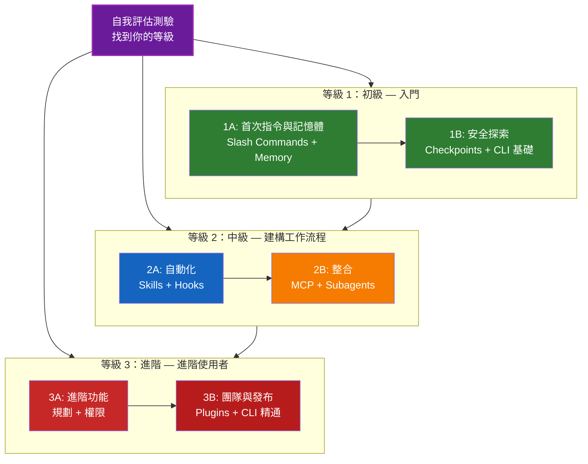

<picture>
  <source media="(prefers-color-scheme: dark)" srcset="resources/logos/claude-howto-logo-dark.svg">
  
</picture>

# Claude Code 學習路線圖

**剛接觸 Claude Code？** 本指南幫助你以自己的步調精通 Claude Code 功能。無論你是完全的初學者還是有經驗的開發者，都可以從下方的自我評估測驗開始，找到適合你的路徑。

---

## 找到你的等級

不是每個人都從同一個起點開始。進行這個快速自我評估，找到合適的切入點。

**誠實回答以下問題：**

- [ ] 我能啟動 Claude Code 並進行對話（`claude`）
- [ ] 我已建立或編輯過 CLAUDE.md 檔案
- [ ] 我已使用過至少 3 個內建 slash commands（例如 /help、/compact、/model）
- [ ] 我已建立過自訂 slash command 或 skill（SKILL.md）
- [ ] 我已設定過 MCP 伺服器（例如 GitHub、資料庫）
- [ ] 我已在 ~/.claude/settings.json 中設定過 hooks
- [ ] 我已建立或使用過自訂 subagents（.claude/agents/）
- [ ] 我已使用過列印模式（`claude -p`）進行腳本或 CI/CD

**你的等級：**

| 勾選數 | 等級 | 從哪裡開始 | 完成時間 |
|--------|-------|----------|------------------|
| 0-2 | **等級 1：初級** — 入門 | [里程碑 1A](#milestone-1a-first-commands--memory) | 約 3 小時 |
| 3-5 | **等級 2：中級** — 建構工作流程 | [里程碑 2A](#milestone-2a-automation-skills--hooks) | 約 5 小時 |
| 6-8 | **等級 3：進階** — 進階使用者與團隊領導 | [里程碑 3A](#milestone-3a-advanced-features) | 約 5 小時 |

> **提示**: 如果你不確定，從低一級開始。快速複習熟悉的內容比錯過基礎概念要好。

> **互動版本**: 在 Claude Code 中執行 `/self-assessment` 可以進行引導式互動測驗，評估你在所有 10 個功能領域的熟練度，並生成個人化的學習路徑。

---

## 學習理念

本倉庫中的資料夾按照**建議學習順序**編號，基於三個關鍵原則：

1. **依賴性** - 基礎概念優先
2. **複雜度** - 簡單功能在進階功能之前
3. **使用頻率** - 最常用的功能最先教授

這種方法確保你建立堅實的基礎，同時獲得即時的生產力提升。

---

## 你的學習路徑



**色彩說明：**
- 紫色：自我評估測驗
- 綠色：等級 1 — 初級路徑
- 藍色 / 金色：等級 2 — 中級路徑
- 紅色：等級 3 — 進階路徑

---

## 完整路線圖表

| 步驟 | 功能 | 複雜度 | 時間 | 等級 | 依賴項 | 為何學習 | 關鍵收益 |
|------|---------|-----------|------|-------|--------------|----------------|--------------|
| **1** | [Slash Commands](01-slash-commands/) | 初級 | 30 分鐘 | 等級 1 | 無 | 快速生產力提升（55+ 內建 + 5 個內建 skills） | 即時自動化、團隊標準 |
| **2** | [Memory](02-memory/) | 初級+ | 45 分鐘 | 等級 1 | 無 | 所有功能的基礎 | 持久性上下文、偏好 |
| **3** | [Checkpoints](08-checkpoints/) | 中級 | 45 分鐘 | 等級 1 | 工作階段管理 | 安全探索 | 實驗、復原 |
| **4** | [CLI 基礎](10-cli/) | 初級+ | 30 分鐘 | 等級 1 | 無 | 核心 CLI 使用 | 互動式和列印模式 |
| **5** | [Skills](03-skills/) | 中級 | 1 小時 | 等級 2 | Slash Commands | 自動化專業知識 | 可重複使用的能力、一致性 |
| **6** | [Hooks](06-hooks/) | 中級 | 1 小時 | 等級 2 | 工具、指令 | 工作流程自動化（25 個事件、4 種類型） | 驗證、品質關卡 |
| **7** | [MCP](05-mcp/) | 中級+ | 1 小時 | 等級 2 | 設定 | 即時資料存取 | 即時整合、API |
| **8** | [Subagents](04-subagents/) | 中級+ | 1.5 小時 | 等級 2 | Memory、指令 | 複雜任務處理（6 個內建包含 Bash） | 委派、專門化專業知識 |
| **9** | [Advanced Features](09-advanced-features/) | 進階 | 2-3 小時 | 等級 3 | 所有先前項目 | 進階使用者工具 | 規劃、Auto Mode、Channels、Voice Dictation、權限 |
| **10** | [Plugins](07-plugins/) | 進階 | 2 小時 | 等級 3 | 所有先前項目 | 完整解決方案 | 團隊入職、發布 |
| **11** | [CLI 精通](10-cli/) | 進階 | 1 小時 | 等級 3 | 建議：全部 | 精通命令列使用 | 腳本、CI/CD、自動化 |

**總學習時間**: 約 11-13 小時（或跳到你的等級節省時間）

---

## 等級 1：初級 — 入門

**適用於**: 測驗勾選 0-2 項的使用者
**時間**: 約 3 小時
**重點**: 即時生產力、理解基礎知識
**成果**: 舒適的日常使用者，準備進入等級 2

### Milestone 1A: First Commands & Memory

**主題**: Slash Commands + Memory
**時間**: 1-2 小時
**複雜度**: 初級
**目標**: 透過自訂指令和持久性上下文獲得即時生產力提升

#### 你將達成的目標
- 為重複性任務建立自訂 slash commands
- 為團隊標準設定專案記憶體
- 設定個人偏好
- 了解 Claude 如何自動載入上下文

#### 實作練習

```bash
# 練習 1：安裝你的第一個 slash command
mkdir -p .claude/commands
cp 01-slash-commands/optimize.md .claude/commands/

# 練習 2：建立專案記憶體
cp 02-memory/project-CLAUDE.md ./CLAUDE.md

# 練習 3：試試看
# 在 Claude Code 中輸入：/optimize
```

#### 成功標準
- [ ] 成功呼叫 `/optimize` 指令
- [ ] Claude 從 CLAUDE.md 記住你的專案標準
- [ ] 你了解何時使用 slash commands vs. memory

#### 後續步驟
熟悉後，閱讀：
- [01-slash-commands/README.md](01-slash-commands/README.md)
- [02-memory/README.md](02-memory/README.md)

> **檢驗你的理解**: 在 Claude Code 中執行 `/lesson-quiz slash-commands` 或 `/lesson-quiz memory` 來測試你學到的內容。

---

### Milestone 1B: Safe Exploration

**主題**: Checkpoints + CLI 基礎
**時間**: 1 小時
**複雜度**: 初級+
**目標**: 學會安全地實驗並使用核心 CLI 指令

#### 你將達成的目標
- 建立和還原檢查點以進行安全實驗
- 了解互動模式 vs. 列印模式
- 使用基本的 CLI 旗標和選項
- 透過管道處理檔案

#### 實作練習

```bash
# 練習 1：嘗試檢查點工作流程
# 在 Claude Code 中：
# 進行一些實驗性變更，然後按 Esc+Esc 或使用 /rewind
# 選擇實驗前的檢查點
# 選擇「還原程式碼和對話」返回

# 練習 2：互動模式 vs 列印模式
claude "explain this project"           # 互動模式
claude -p "explain this function"       # 列印模式（非互動式）

# 練習 3：透過管道處理檔案內容
cat error.log | claude -p "explain this error"
```

#### 成功標準
- [ ] 建立並回退到檢查點
- [ ] 使用了互動模式和列印模式
- [ ] 透過管道將檔案傳送給 Claude 分析
- [ ] 了解何時使用檢查點進行安全實驗

#### 後續步驟
- 閱讀: [08-checkpoints/README.md](08-checkpoints/README.md)
- 閱讀: [10-cli/README.md](10-cli/README.md)
- **準備進入等級 2！** 前往 [里程碑 2A](#milestone-2a-automation-skills--hooks)

> **檢驗你的理解**: 執行 `/lesson-quiz checkpoints` 或 `/lesson-quiz cli` 驗證你是否準備好進入等級 2。

---

## 等級 2：中級 — 建構工作流程

**適用於**: 測驗勾選 3-5 項的使用者
**時間**: 約 5 小時
**重點**: 自動化、整合、任務委派
**成果**: 自動化工作流程、外部整合，準備進入等級 3

### 先決條件檢查

開始等級 2 之前，確保你已熟悉以下等級 1 的概念：

- [ ] 能建立和使用 slash commands（[01-slash-commands/](01-slash-commands/)）
- [ ] 已透過 CLAUDE.md 設定專案記憶體（[02-memory/](02-memory/)）
- [ ] 知道如何建立和還原檢查點（[08-checkpoints/](08-checkpoints/)）
- [ ] 能從命令列使用 `claude` 和 `claude -p`（[10-cli/](10-cli/)）

> **有缺口？** 在繼續之前複習上方連結的教學。

---

### Milestone 2A: Automation (Skills + Hooks)

**主題**: Skills + Hooks
**時間**: 2-3 小時
**複雜度**: 中級
**目標**: 自動化常見工作流程和品質檢查

#### 你將達成的目標
- 使用 YAML frontmatter 自動呼叫專門化能力（包含 `effort` 和 `shell` 欄位）
- 設定跨 25 個 hook 事件的事件驅動自動化
- 使用所有 4 種 hook 類型（command、http、prompt、agent）
- 強制執行程式碼品質標準
- 為你的工作流程建立自訂 hooks

#### 實作練習

```bash
# 練習 1：安裝一個 skill
cp -r 03-skills/code-review ~/.claude/skills/

# 練習 2：設定 hooks
mkdir -p ~/.claude/hooks
cp 06-hooks/pre-tool-check.sh ~/.claude/hooks/
chmod +x ~/.claude/hooks/pre-tool-check.sh

# 練習 3：在設定中配置 hooks
# 加入 ~/.claude/settings.json：
{
  "hooks": {
    "PreToolUse": [
      {
        "matcher": "Bash",
        "hooks": [
          {
            "type": "command",
            "command": "~/.claude/hooks/pre-tool-check.sh"
          }
        ]
      }
    ]
  }
}
```

#### 成功標準
- [ ] Code review skill 在相關時自動呼叫
- [ ] PreToolUse hook 在工具執行前運行
- [ ] 你了解 skill 自動呼叫 vs. hook 事件觸發的區別

#### 後續步驟
- 建立你自己的自訂 skill
- 為你的工作流程設定更多 hooks
- 閱讀: [03-skills/README.md](03-skills/README.md)
- 閱讀: [06-hooks/README.md](06-hooks/README.md)

> **檢驗你的理解**: 執行 `/lesson-quiz skills` 或 `/lesson-quiz hooks` 在繼續之前測試你的知識。

---

### Milestone 2B: Integration (MCP + Subagents)

**主題**: MCP + Subagents
**時間**: 2-3 小時
**複雜度**: 中級+
**目標**: 整合外部服務並委派複雜任務

#### 你將達成的目標
- 從 GitHub、資料庫等存取即時資料
- 將工作委派給專門化的 AI 代理
- 了解何時使用 MCP vs. subagents
- 建構整合工作流程

#### 實作練習

```bash
# 練習 1：設定 GitHub MCP
export GITHUB_TOKEN="your_github_token"
claude mcp add github -- npx -y @modelcontextprotocol/server-github

# 練習 2：測試 MCP 整合
# 在 Claude Code 中：/mcp__github__list_prs

# 練習 3：安裝 subagents
mkdir -p .claude/agents
cp 04-subagents/*.md .claude/agents/
```

#### 整合練習
嘗試這個完整的工作流程：
1. 使用 MCP 取得 GitHub PR
2. 讓 Claude 委派審查給 code-reviewer subagent
3. 使用 hooks 自動執行測試

#### 成功標準
- [ ] 成功透過 MCP 查詢 GitHub 資料
- [ ] Claude 將複雜任務委派給 subagents
- [ ] 你了解 MCP 和 subagents 的區別
- [ ] 在工作流程中結合了 MCP + subagents + hooks

#### 後續步驟
- 設定更多 MCP 伺服器（資料庫、Slack 等）
- 為你的領域建立自訂 subagents
- 閱讀: [05-mcp/README.md](05-mcp/README.md)
- 閱讀: [04-subagents/README.md](04-subagents/README.md)
- **準備進入等級 3！** 前往 [里程碑 3A](#milestone-3a-advanced-features)

> **檢驗你的理解**: 執行 `/lesson-quiz mcp` 或 `/lesson-quiz subagents` 驗證你是否準備好進入等級 3。

---

## 等級 3：進階 — 進階使用者與團隊領導

**適用於**: 測驗勾選 6-8 項的使用者
**時間**: 約 5 小時
**重點**: 團隊工具、CI/CD、企業功能、plugin 開發
**成果**: 進階使用者，能設定團隊工作流程和 CI/CD

### 先決條件檢查

開始等級 3 之前，確保你已熟悉以下等級 2 的概念：

- [ ] 能建立和使用具有自動呼叫的 skills（[03-skills/](03-skills/)）
- [ ] 已為事件驅動自動化設定 hooks（[06-hooks/](06-hooks/)）
- [ ] 能為外部資料設定 MCP 伺服器（[05-mcp/](05-mcp/)）
- [ ] 知道如何使用 subagents 進行任務委派（[04-subagents/](04-subagents/)）

> **有缺口？** 在繼續之前複習上方連結的教學。

---

### Milestone 3A: Advanced Features

**主題**: 進階功能（規劃、權限、延伸思考、Auto Mode、Channels、Voice Dictation、Remote/Desktop/Web）
**時間**: 2-3 小時
**複雜度**: 進階
**目標**: 精通進階工作流程和進階使用者工具

#### 你將達成的目標
- 用於複雜功能的規劃模式
- 6 種模式的細粒度權限控制（default、acceptEdits、plan、auto、dontAsk、bypassPermissions）
- 透過 Alt+T / Option+T 切換的延伸思考
- 背景任務管理
- 學習偏好的 Auto Memory
- 具有背景安全分類器的 Auto Mode
- 結構化多工作階段工作流程的 Channels
- 免手操作互動的 Voice Dictation
- Remote control、desktop app 和 web sessions
- 多代理協作的 Agent Teams

#### 實作練習

```bash
# 練習 1：使用規劃模式
/plan Implement user authentication system

# 練習 2：嘗試權限模式（可用 6 種：default、acceptEdits、plan、auto、dontAsk、bypassPermissions）
claude --permission-mode plan "analyze this codebase"
claude --permission-mode acceptEdits "refactor the auth module"
claude --permission-mode auto "implement the feature"

# 練習 3：啟用延伸思考
# 在工作階段中按 Alt+T（macOS 上為 Option+T）切換

# 練習 4：進階檢查點工作流程
# 1. 建立檢查點「乾淨狀態」
# 2. 使用規劃模式設計功能
# 3. 使用 subagent 委派實作
# 4. 在背景執行測試
# 5. 如果測試失敗，回退到檢查點
# 6. 嘗試替代方法

# 練習 5：嘗試 auto mode（背景安全分類器）
claude --permission-mode auto "implement user settings page"

# 練習 6：啟用 agent teams
export CLAUDE_AGENT_TEAMS=1
# 詢問 Claude：「使用團隊方式實作功能 X」

# 練習 7：排程任務
/loop 5m /check-status
# 或使用 CronCreate 建立持久性排程任務

# 練習 8：多工作階段工作流程的 Channels
# 使用 channels 跨工作階段組織工作

# 練習 9：Voice Dictation
# 使用語音輸入與 Claude Code 進行免手操作互動
```

#### 成功標準
- [ ] 使用規劃模式處理複雜功能
- [ ] 設定了權限模式（plan、acceptEdits、auto、dontAsk）
- [ ] 使用 Alt+T / Option+T 切換延伸思考
- [ ] 使用了具有背景安全分類器的 auto mode
- [ ] 為長時間操作使用了背景任務
- [ ] 探索了多工作階段工作流程的 Channels
- [ ] 嘗試了免手操作的 Voice Dictation 輸入
- [ ] 了解 Remote Control、Desktop App 和 Web sessions
- [ ] 啟用並使用 Agent Teams 進行協作任務
- [ ] 使用 `/loop` 進行週期性任務或排程監控

#### 後續步驟
- 閱讀: [09-advanced-features/README.md](09-advanced-features/README.md)

> **檢驗你的理解**: 執行 `/lesson-quiz advanced` 測試你對進階使用者功能的掌握程度。

---

### Milestone 3B: Team & Distribution (Plugins + CLI Mastery)

**主題**: Plugins + CLI 精通 + CI/CD
**時間**: 2-3 小時
**複雜度**: 進階
**目標**: 建構團隊工具、建立 plugins、精通 CI/CD 整合

#### 你將達成的目標
- 安裝和建立完整的整合 plugins
- 精通用於腳本和自動化的 CLI
- 使用 `claude -p` 設定 CI/CD 整合
- 自動化管道的 JSON 輸出
- 工作階段管理和批次處理

#### 實作練習

```bash
# 練習 1：安裝完整 plugin
# 在 Claude Code 中：/plugin install pr-review

# 練習 2：CI/CD 的列印模式
claude -p "Run all tests and generate report"

# 練習 3：腳本的 JSON 輸出
claude -p --output-format json "list all functions"

# 練習 4：工作階段管理和繼續
claude -r "feature-auth" "continue implementation"

# 練習 5：帶約束的 CI/CD 整合
claude -p --max-turns 3 --output-format json "review code"

# 練習 6：批次處理
for file in *.md; do
  claude -p --output-format json "summarize this: $(cat $file)" > ${file%.md}.summary.json
done
```

#### CI/CD 整合練習
建立一個簡單的 CI/CD 腳本：
1. 使用 `claude -p` 審查變更的檔案
2. 以 JSON 輸出結果
3. 使用 `jq` 處理特定問題
4. 整合到 GitHub Actions 工作流程

#### 成功標準
- [ ] 安裝並使用了 plugin
- [ ] 為你的團隊建構或修改了 plugin
- [ ] 在 CI/CD 中使用了列印模式（`claude -p`）
- [ ] 為腳本生成了 JSON 輸出
- [ ] 成功繼續了先前的工作階段
- [ ] 建立了批次處理腳本
- [ ] 將 Claude 整合到 CI/CD 工作流程中

#### CLI 的實際使用場景
- **程式碼審查自動化**: 在 CI/CD 管道中執行程式碼審查
- **日誌分析**: 分析錯誤日誌和系統輸出
- **文件生成**: 批次生成文件
- **測試洞察**: 分析測試失敗
- **效能分析**: 審查效能指標
- **資料處理**: 轉換和分析資料檔案

#### 後續步驟
- 閱讀: [07-plugins/README.md](07-plugins/README.md)
- 閱讀: [10-cli/README.md](10-cli/README.md)
- 建立團隊範圍的 CLI 快捷方式和 plugins
- 設定批次處理腳本

> **檢驗你的理解**: 執行 `/lesson-quiz plugins` 或 `/lesson-quiz cli` 確認你的精通程度。

---

## 測試你的知識

本倉庫包含兩個互動式 skills，你可以隨時在 Claude Code 中使用來評估你的理解程度：

| Skill | 指令 | 用途 |
|-------|---------|---------|
| **Self-Assessment** | `/self-assessment` | 評估你在所有 10 個功能上的整體熟練度。選擇快速（2 分鐘）或深入（5 分鐘）模式，獲得個人化的技能概況和學習路徑。 |
| **Lesson Quiz** | `/lesson-quiz [lesson]` | 透過 10 個問題測試你對特定課程的理解。可在課程前（預測試）、課程中（進度檢查）或課程後（精通驗證）使用。 |

**範例：**
```
/self-assessment                  # 找到你的整體等級
/lesson-quiz hooks                # 第 06 課 Hooks 測驗
/lesson-quiz 03                   # 第 03 課 Skills 測驗
/lesson-quiz advanced-features    # 第 09 課測驗
```

---

## 快速開始路徑

### 如果你只有 15 分鐘
**目標**: 獲得你的第一個成功

1. 複製一個 slash command：`cp 01-slash-commands/optimize.md .claude/commands/`
2. 在 Claude Code 中試試：`/optimize`
3. 閱讀: [01-slash-commands/README.md](01-slash-commands/README.md)

**成果**: 你將擁有一個可用的 slash command 並了解基礎知識

---

### 如果你有 1 小時
**目標**: 設定基本的生產力工具

1. **Slash commands**（15 分鐘）：複製並測試 `/optimize` 和 `/pr`
2. **專案記憶體**（15 分鐘）：建立包含你專案標準的 CLAUDE.md
3. **安裝一個 skill**（15 分鐘）：設定 code-review skill
4. **一起試試**（15 分鐘）：看看它們如何協同運作

**成果**: 透過指令、記憶體和自動 skills 獲得基本生產力提升

---

### 如果你有一個週末
**目標**: 熟練掌握大多數功能

**週六上午**（3 小時）：
- 完成里程碑 1A：Slash Commands + Memory
- 完成里程碑 1B：Checkpoints + CLI 基礎

**週六下午**（3 小時）：
- 完成里程碑 2A：Skills + Hooks
- 完成里程碑 2B：MCP + Subagents

**週日**（4 小時）：
- 完成里程碑 3A：進階功能
- 完成里程碑 3B：Plugins + CLI 精通 + CI/CD
- 為你的團隊建構自訂 plugin

**成果**: 你將成為 Claude Code 進階使用者，準備好培訓他人和自動化複雜工作流程

---

## 學習技巧

### 應該做的

- **先參加測驗**以找到你的起點
- **完成每個里程碑的實作練習**
- **從簡單開始**，逐漸增加複雜度
- **測試每個功能**後再進入下一個
- **記錄**適合你工作流程的內容
- **回顧**學習進階主題時的基礎概念
- **使用檢查點安全實驗**
- **與團隊分享知識**

### 不應該做的

- **跳到高等級時跳過先決條件檢查**
- **嘗試一次學會所有東西** - 這會令人不知所措
- **不理解就複製設定** - 你將不知道如何除錯
- **忘記測試** - 始終驗證功能是否正常
- **匆忙通過里程碑** - 花時間理解
- **忽略文件** - 每個 README 都有寶貴的細節
- **獨自工作** - 與隊友討論

---

## 學習風格

### 視覺學習者
- 研究每個 README 中的 mermaid 圖表
- 觀察指令執行流程
- 繪製你自己的工作流程圖
- 使用上方的視覺學習路徑

### 實作學習者
- 完成每個實作練習
- 嘗試變化
- 故意弄壞東西然後修復（使用檢查點！）
- 建立你自己的範例

### 閱讀學習者
- 徹底閱讀每個 README
- 研究程式碼範例
- 複習比較表
- 閱讀資源中連結的部落格文章

### 社交學習者
- 設定結對程式設計的工作階段
- 教隊友概念
- 加入 Claude Code 社群討論
- 分享你的自訂設定

---

## 進度追蹤

使用這些檢查清單按等級追蹤你的進度。隨時執行 `/self-assessment` 獲取更新的技能概況，或在每個教學後執行 `/lesson-quiz [lesson]` 驗證你的理解。

### 等級 1：初級
- [ ] 完成 [01-slash-commands](01-slash-commands/)
- [ ] 完成 [02-memory](02-memory/)
- [ ] 建立了第一個自訂 slash command
- [ ] 設定了專案記憶體
- [ ] **里程碑 1A 達成**
- [ ] 完成 [08-checkpoints](08-checkpoints/)
- [ ] 完成 [10-cli](10-cli/) 基礎
- [ ] 建立並回退到檢查點
- [ ] 使用了互動模式和列印模式
- [ ] **里程碑 1B 達成**

### 等級 2：中級
- [ ] 完成 [03-skills](03-skills/)
- [ ] 完成 [06-hooks](06-hooks/)
- [ ] 安裝了第一個 skill
- [ ] 設定了 PreToolUse hook
- [ ] **里程碑 2A 達成**
- [ ] 完成 [05-mcp](05-mcp/)
- [ ] 完成 [04-subagents](04-subagents/)
- [ ] 連接了 GitHub MCP
- [ ] 建立了自訂 subagent
- [ ] 在工作流程中結合了多個整合
- [ ] **里程碑 2B 達成**

### 等級 3：進階
- [ ] 完成 [09-advanced-features](09-advanced-features/)
- [ ] 成功使用規劃模式
- [ ] 設定了權限模式（6 種模式包含 auto）
- [ ] 使用了具有安全分類器的 auto mode
- [ ] 使用了延伸思考切換
- [ ] 探索了 Channels 和 Voice Dictation
- [ ] **里程碑 3A 達成**
- [ ] 完成 [07-plugins](07-plugins/)
- [ ] 完成 [10-cli](10-cli/) 進階使用
- [ ] 設定了列印模式（`claude -p`）CI/CD
- [ ] 為自動化建立了 JSON 輸出
- [ ] 將 Claude 整合到 CI/CD 管道
- [ ] 建立了團隊 plugin
- [ ] **里程碑 3B 達成**

---

## 常見學習挑戰

### 挑戰 1：「一次太多概念」
**解決方案**: 一次專注一個里程碑。在繼續之前完成所有練習。

### 挑戰 2：「不知道何時使用哪個功能」
**解決方案**: 參考主 README 中的[使用場景矩陣](README.md#use-case-matrix)。

### 挑戰 3：「設定不起作用」
**解決方案**: 查看[疑難排解](README.md#troubleshooting)區段並驗證檔案位置。

### 挑戰 4：「概念似乎重疊」
**解決方案**: 複習[功能比較](README.md#feature-comparison)表以了解差異。

### 挑戰 5：「很難記住所有東西」
**解決方案**: 建立你自己的速查表。使用檢查點安全地實驗。

### 挑戰 6：「我有經驗但不確定從哪裡開始」
**解決方案**: 參加上方的[自我評估測驗](#找到你的等級)。跳到你的等級，使用先決條件檢查來識別任何缺口。

---

## 完成後的下一步？

完成所有里程碑後：

1. **建立團隊文件** - 記錄你團隊的 Claude Code 設定
2. **建構自訂 plugins** - 打包你團隊的工作流程
3. **探索 Remote Control** - 從外部工具以程式方式控制 Claude Code 工作階段
4. **嘗試 Web Sessions** - 透過瀏覽器介面使用 Claude Code 進行遠端開發
5. **使用 Desktop App** - 透過原生桌面應用程式存取 Claude Code 功能
6. **使用 Auto Mode** - 讓 Claude 透過背景安全分類器自主工作
7. **利用 Auto Memory** - 讓 Claude 隨時間自動學習你的偏好
8. **設定 Agent Teams** - 在複雜的多面向任務上協調多個代理
9. **使用 Channels** - 跨結構化多工作階段工作流程組織工作
10. **嘗試 Voice Dictation** - 使用免手操作的語音輸入與 Claude Code 互動
11. **使用排程任務** - 使用 `/loop` 和 cron 工具自動化週期性檢查
12. **貢獻範例** - 與社群分享
13. **指導他人** - 幫助隊友學習
14. **最佳化工作流程** - 根據使用情況持續改善
15. **保持更新** - 關注 Claude Code 發行和新功能

---

## 額外資源

### 官方文件
- [Claude Code 文件](https://code.claude.com/docs/en/overview)
- [Anthropic 文件](https://docs.anthropic.com)
- [MCP Protocol 規範](https://modelcontextprotocol.io)

### 部落格文章
- [Discovering Claude Code Slash Commands](https://medium.com/@luongnv89/discovering-claude-code-slash-commands-cdc17f0dfb29)

### 社群
- [Anthropic Cookbook](https://github.com/anthropics/anthropic-cookbook)
- [MCP Servers 倉庫](https://github.com/modelcontextprotocol/servers)

---

## 回饋與支援

- **發現問題？** 在倉庫中建立 issue
- **有建議？** 提交 pull request
- **需要幫助？** 查閱文件或詢問社群

---

**最後更新**: 2026 年 3 月
**維護者**: Claude How-To 貢獻者
**授權**: 教育用途，免費使用和改編

---

[← 返回主 README](README.md)
