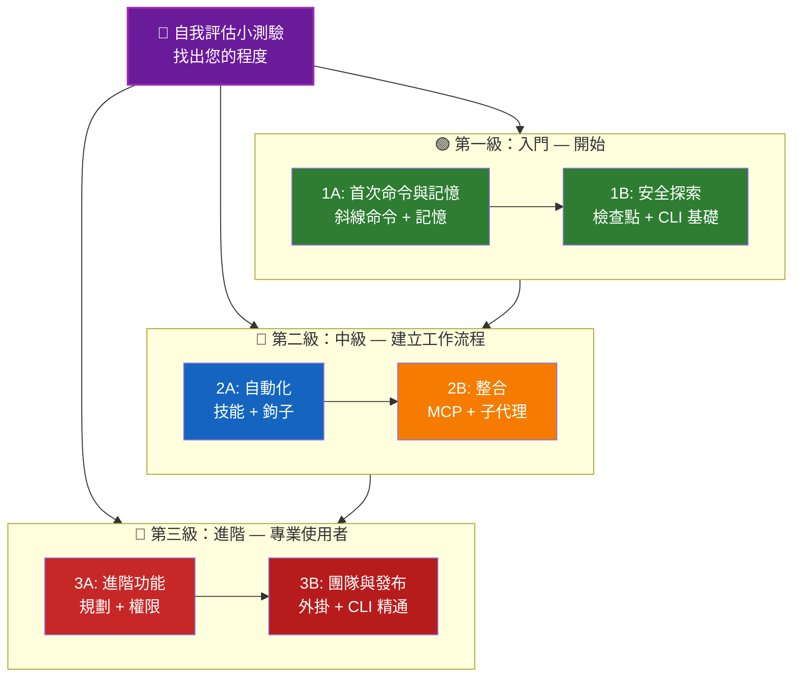

<picture>
  <source media="(prefers-color-scheme: dark)" srcset="resources/logos/claude-howto-logo-dark.svg">
  
</picture>

# 📚 Claude Code 學習路線圖

**剛接觸 Claude Code 嗎？** 這份指南能幫助您以自己的步調掌握 Claude Code 的功能。無論您是完全的新手還是經驗豐富的開發者，請從下方自我評估小測驗開始，找出最適合您的學習路徑。

---

## 🧭 找出您的程度

並非每個人都從同一個起點開始。請進行這個快速的自我評估，以找出最適合您的入門點。

**誠實地回答以下問題：**

- [ ] 我可以啟動 Claude Code 並進行對話 (`claude`)
- [ ] 我已建立或編輯過一個 CLAUDE.md 檔案
- [ ] 我已使用至少 3 個內建的斜線命令（例如，`/help`、`/compact`、`/model`）
- [ ] 我已建立自訂的斜線命令或技能 (SKILL.md)
- [ ] 我已設定一個 MCP 伺服器（例如，GitHub、資料庫）
- [ ] 我已在 `~/.claude/settings.json` 中設定鉤子
- [ ] 我已建立或使用自訂的子代理 (.claude/agents/)
- [ ] 我已使用列印模式 (`claude -p`) 用於腳本或 CI/CD

**您的程度：**

| 檢查項目 | 程度 | 開始位置 | 完成時間 |
|--------|-------|----------|------------------|
| 0-2 | **Level 1: 初學者** — 開始 | [Milestone 1A](#milestone-1a-first-commands--memory) | ~3 小時 |
| 3-5 | **Level 2: 中級** — 建立工作流程 | [Milestone 2A](#milestone-2a-automation-skills--hooks) | ~5 小時 |
| 6-8 | **Level 3: 高級** — 權使用者和團隊領導者 | [Milestone 3A](#milestone-3a-advanced-features) | ~5 小時 |

> **提示**: 如果您不確定，請從較低的一級開始。快速回顧熟悉的内容，比錯過基礎概念更好。

> **互動版本**: 在 Claude Code 中執行 `/self-assessment`，即可進行引導式互動式小測驗，該小測驗會評估您在所有 10 個功能領域中的熟練程度，並產生個人化的學習路徑。

---

## 🎯 學習理念

這個存放庫中的資料夾以 **建議的學習順序** 編號，基於三個關鍵原則：

1. **相依性** - 基礎觀念優先
2. **複雜度** - 先學習較簡單的功能，再學習進階功能
3. **使用頻率** - 常用功能提早學習

這種方法確保您建立穩固的基礎，同時獲得立即的生產力效益。

---

## 🗺️ 您的學習路徑



**顏色說明：**
- 💜 紫色：自我評估小測驗
- 🟢 綠色：第一級 — 入門路徑
- 🔵 藍色 / 🟡 金色：第二級 — 中級路徑
- 🔴 紅色：第三級 — 進階路徑

---

## 📊 完整學習路徑表格

| 步驟 | 功能 | 複雜度 | 時間 | 程度 | 依賴 | 為什麼學習 | 關鍵優勢 |
|------|---------|-----------|------|-------|--------------|----------------|--------------|
| **1** | [斜線命令](01-slash-commands/) | ⭐ 初學者 | 30 分鐘 | 程度 1 | 無 | 快速提升生產力 (55+ 內建 + 5 個內建技能) | 即時自動化，團隊標準 |
| **2** | [記憶](02-memory/) | ⭐⭐ 初學者+ | 45 分鐘 | 程度 1 | 無 | 所有功能的基礎 | 持續的上下文，偏好設定 |
| **3** | [檢查點](08-checkpoints/) | ⭐⭐ 中級者 | 45 分鐘 | 程度 1 | 工作階段管理 | 安全探索 | 實驗，恢復 |
| **4** | [CLI 基礎](10-cli/) | ⭐⭐ 初學者+ | 30 分鐘 | 程度 1 | 無 | 核心 CLI 使用 | 互動模式和列印模式 |
| **5** | [技能](03-skills/) | ⭐⭐ 中級者 | 1 小時 | 程度 2 | 斜線命令 | 自動專業知識 | 可重複使用的能力，一致性 |
| **6** | [鉤子](06-hooks/) | ⭐⭐ 中級者 | 1 小時 | 程度 2 | 工具，命令 | 工作流程自動化 (25 個事件，4 種類型) | 驗證，品質閘門 |
| **7** | [MCP](05-mcp/) | ⭐⭐⭐ 中級者+ | 1 小時 | 程度 2 | 設定 | 即時存取資料 | 即時整合，API |
| **8** | [子代理](04-subagents/) | ⭐⭐⭐ 中級者+ | 1.5 小時 | 程度 2 | 記憶，命令 | 處理複雜任務 (內建 6 個，包括 Bash) | 委派，專業領域 |
| **9** | [進階功能](09-advanced-features/) | ⭐⭐⭐⭐ 高階使用者 | 2-3 小時 | 程度 3 | 所有先前步驟 | 強大使用者工具 | 規劃，自動模式，頻道，語音錄音，權限 |
| **10** | [外掛](07-plugins/) | ⭐⭐⭐⭐ 高階使用者 | 2 小時 | 程度 3 | 所有先前步驟 | 完整的解決方案 | 團隊導入，發布 |
| **11** | [CLI 技巧](10-cli/) | ⭐⭐⭐ 高階使用者 | 1 小時 | 程度 3 | 建議：所有步驟 | 掌握命令列使用 | 腳本，CI/CD，自動化 |

**總學習時間**: ~11-13 小時 (或跳到你的程度並節省時間)

---

## 🟢 Level 1: 初學者 — 開始使用

**適用對象**: 0-2 次小測驗
**時間**: ~3 小時
**重點**: 立即提升生產力，理解基礎知識
**成果**: 熟悉日常使用，準備進入 Level 2

### 里程碑 1A: 首次命令與記憶

**主題**: 斜線命令 + 記憶
**時間**: 1-2 小時
**複雜度**: ⭐ 初學者
**目標**: 使用自訂命令和持續的上下文，立即提升生產力

#### 你將會完成什麼
✅ 建立自訂斜線命令以處理重複性任務
✅ 設置專案記憶體以符合團隊標準
✅ 設定個人喜好
✅ 理解 Claude 如何自動載入上下文

#### 實作練習

```bash
# Exercise 1: 安裝你的第一個斜線命令
mkdir -p .claude/commands
cp 01-slash-commands/optimize.md .claude/commands/

# Exercise 2: 建立專案記憶體
cp 02-memory/project-CLAUDE.md ./CLAUDE.md

# Exercise 3: 試試看
# 在 Claude Code 中，輸入：/optimize
```

#### 成功標準
- [ ] 成功調用 `/optimize` 命令
- [ ] Claude 記住了從 CLAUDE.md 的專案標準
- [ ] 你知道何時使用斜線命令與記憶

#### 下一步
當你感到舒適後，請閱讀：
- [01-slash-commands/README.md](01-slash-commands/README.md)
- [02-memory/README.md](02-memory/README.md)

> **檢查你的理解**: 在 Claude Code 中執行 `/lesson-quiz slash-commands` 或 `/lesson-quiz memory` 以測試你所學到的內容。

---

### 里程碑 1B: 安全探索

**主題**: 檢查點 + CLI 基礎
**時間**: 1 小時
**複雜度**: ⭐⭐ 初學者+
**目標**: 學習安全地進行實驗並使用核心 CLI 命令

#### 你將會完成什麼
✅ 建立並還原檢查點以進行安全的實驗
✅ 理解互動模式與列印模式
✅ 使用基本的 CLI 標記和選項
✅ 透過管線處理檔案

#### 實作練習

```bash
# Exercise 1: 試試檢查點工作流程
# 在 Claude Code 中：
# 進行一些實驗性變更，然後按下 Esc+Esc 或使用 /rewind
# 選擇你的實驗之前的檢查點
# 選擇「還原程式碼和對話」以回到過去

# Exercise 2: 互動模式與列印模式
claude "explain this project"           # 互動模式
claude -p "explain this function"       # 列印模式 (非互動)

# Exercise 3: 透過管線處理檔案內容
cat error.log | claude -p "explain this error"
```

#### 成功標準
- [ ] 建立並還原到一個檢查點
- [ ] 使用了互動模式和列印模式
- [ ] 將檔案傳遞給 Claude 進行分析
- [ ] 了解何時使用檢查點進行安全實驗

#### 下一步
- 閱讀：[08-checkpoints/README.md](08-checkpoints/README.md)
- 閱讀：[10-cli/README.md](10-cli/README.md)
- **準備好進入 Level 2!** 繼續到 [Milestone 2A](#milestone-2a-automation-skills--hooks)

> **檢查你的理解**: 執行 `/lesson-quiz checkpoints` 或 `/lesson-quiz cli` 以驗證你是否準備好進入 Level 2。

## 🔵 Level 2: 中級 — 建立工作流程

**適用對象**: 進行過 3-5 次小測驗的使用者
**時間**: ~5 小時
**重點**: 自動化、整合、任務委派
**成果**: 自動化工作流程、外部整合，準備進入 Level 3

### 準備工作

在開始 Level 2 之前，請確保您熟悉以下 Level 1 概念：

- [ ] 能夠建立和使用斜線命令 ([01-slash-commands/](01-slash-commands/))
- [ ] 已透過 CLAUDE.md 設定專案記憶體 ([02-memory/](02-memory/))
- [ ] 知道如何建立和還原檢查點 ([08-checkpoints/](08-checkpoints/))
- [ ] 能夠從命令列使用 `claude` 和 `claude -p` ([10-cli/](10-cli/))

> **有缺漏？** 在繼續之前，請先回顧上面連結的教學。

---

### 里程碑 2A：自動化 (技能 + 鉤子)

**主題**: 技能 + 鉤子
**時間**: 2-3 小時
**複雜度**: ⭐⭐ 中級
**目標**: 自動化常見的工作流程和品質檢查

#### 您將會實現什麼
✅ 使用 YAML 前置標題自動喚起專用的功能（包括 `effort` 和 `shell` 欄位）
✅ 設定跨 25 個鉤子事件的事件驅動自動化
✅ 使用所有 4 種鉤子類型（命令、HTTP、提示、代理）
✅ 強制執行程式碼品質標準
✅ 建立自訂鉤子以用於您的工作流程

#### 實作練習

```bash
# Exercise 1: 安裝技能
cp -r 03-skills/code-review ~/.claude/skills/

# Exercise 2: 設定鉤子
mkdir -p ~/.claude/hooks
cp 06-hooks/pre-tool-check.sh ~/.claude/hooks/
chmod +x ~/.claude/hooks/pre-tool-check.sh

# Exercise 3: 在設定中配置鉤子
# 增加到 ~/.claude/settings.json:
{
  "hooks": {
    "PreToolUse": [
      {
        "matcher": "Bash",
        "hooks": [
          {
            "type": "command",
            "command": "~/.claude/hooks/pre-tool-check.sh"
          }
        ]
      }
    ]
  }
}
```

#### 成功標準
- [ ] 程式碼審查技能在相關時自動喚起
- [ ] PreToolUse 鉤子在工具執行前執行
- [ ] 您了解技能自動喚起與鉤子事件觸發器的差異

#### 下一步
- 建立您自己的自訂技能
- 為您的工作流程設定額外的鉤子
- 閱讀: [03-skills/README.md](03-skills/README.md)
- 閱讀: [06-hooks/README.md](06-hooks/README.md)

> **檢查您的理解**: 執行 `/lesson-quiz skills` 或 `/lesson-quiz hooks` 以測試您的知識，然後再繼續。

---

### 里程碑 2B：整合 (MCP + 子代理)

**主題**: MCP + 子代理
**時間**: 2-3 小時
**複雜度**: ⭐⭐⭐ 中級+
**目標**: 整合外部服務並委派複雜任務

#### 您將會實現什麼
✅ 從 GitHub、資料庫等存取即時資料
✅ 委派給專用的 AI 代理
✅ 了解何時使用 MCP 與子代理
✅ 建立整合工作流程

#### 實作練習

```bash
# Exercise 1: 設定 GitHub MCP
export GITHUB_TOKEN="your_github_token"
claude mcp add github -- npx -y @modelcontextprotocol/server-github

# Exercise 2: 測試 MCP 整合
# 在 Claude Code: /mcp__github__list_prs

# Exercise 3: 安裝子代理
mkdir -p .claude/agents
```

cp 04-subagents/*.md .claude/agents/

#### 整合練習
嘗試這個完整的流程：
1. 使用 MCP 抓取 GitHub PR
2. 讓 Claude 委派程式碼審查給 code-reviewer 子代理
3. 使用鉤子自動執行測試

#### 成功標準
- [ ] 成功透過 MCP 查詢 GitHub 數據
- [ ] Claude 委派複雜任務給子代理
- [ ] 您理解 MCP 和子代理之間的差異
- [ ] 結合 MCP + 子代理 + 鉤子於工作流程中

#### 下一步
- 設置額外的 MCP 伺服器（資料庫、Slack 等）
- 創建您領域的自定義子代理
- 閱讀：[05-mcp/README.md](05-mcp/README.md)
- 閱讀：[04-subagents/README.md](04-subagents/README.md)
- **準備好進入 Level 3 了！** 繼續到 [Milestone 3A](#milestone-3a-advanced-features)

> **檢查您的理解**: 執行 `/lesson-quiz mcp` 或 `/lesson-quiz subagents` 以驗證您是否已準備好進入 Level 3。

---

## 🔴 Level 3: 進階 — 權力使用者與團隊領導

**適用對象**: 透過 6-8 次測驗驗證的使用者
**時間**: ~5 小時
**重點**: 團隊工具、CI/CD、企業功能、外掛程式開發
**成果**: 權力使用者，能夠設置團隊工作流程和 CI/CD

### 準備工作檢查

在開始 Level 3 之前，請確保您熟悉以下 Level 2 概念：

- [ ] 能夠創建和使用具有自動觸發的技能 ([03-skills/](03-skills/))
- [ ] 已設置用於事件驅動自動化的鉤子 ([06-hooks/](06-hooks/))
- [ ] 能夠配置 MCP 伺服器以用於外部數據 ([05-mcp/](05-mcp/))
- [ ] 知道如何使用子代理進行任務委派 ([04-subagents/](04-subagents/))

> **有缺漏？** 在繼續之前，請回顧以上鏈接的教學。

---

### Milestone 3A: 進階功能

**主題**: 進階功能（規劃、權限、擴展思維、自動模式、頻道、語音錄音、遠端/桌面/網頁）
**時間**: 2-3 小時
**複雜度**: ⭐⭐⭐⭐⭐ 進階
**目標**: 掌握進階工作流程和權力使用者工具

#### 您將實現什麼
✅ 規劃模式用於複雜功能
✅ 具有 6 種模式的精細權限控制（預設、acceptEdits、plan、auto、dontAsk、bypassPermissions）
✅ 透過 Alt+T / Option+T 撥動器進行擴展思維
✅ 背景任務管理
✅ Auto Memory 用於學習的偏好設定
✅ 具有背景安全分類器的自動模式
✅ 頻道用於結構化的多會話工作流程
✅ 語音錄音用於免提互動
✅ 遠端控制、桌面應用程式和網頁會話
✅ 代理團隊用於多代理協作

#### 實作練習

```bash
# Exercise 1: 使用規劃模式
/plan Implement user authentication system

# Exercise 1: 嘗試權限模式 (有 6 種可用：預設、acceptEdits、plan、auto、dontAsk、bypassPermissions)
claude --permission-mode plan "analyze this codebase"
claude --permission-mode acceptEdits "refactor the auth module"
claude --permission-mode auto "implement the feature"

# Exercise 1: 啟用擴展思維
# 在會話期間按下 Alt+T (macOS 上為 Option+T) 以進行切換

# Exercise 1: 進階檢查點工作流程
# 1. 創建檢查點 "Clean state"
# 2. 使用規劃模式設計一個功能
```

# 3. 實作子代理委派
# 4. 在背景中執行測試
# 5. 如果測試失敗，回退到檢查點
# 6. 嘗試替代方案

# 練習 5：嘗試自動模式 (背景安全分類器)
claude --permission-mode auto "實作使用者設定頁面"

# 練習 6：啟用代理團隊
export CLAUDE_AGENT_TEAMS=1
# 詢問 Claude：「使用團隊方法實作功能 X」

# 練習 7：排定任務
/loop 5m /check-status
# 或使用 CronCreate 進行持續排定的任務

# 練習 8：用於多會話工作流程的通道
# 使用通道來組織跨會話的工作

# 練習 9：語音錄入
# 使用語音輸入與 Claude Code 進行免持手互動

#### 成功標準
- [ ] 對複雜功能使用規劃模式
- [ ] 設定權限模式 (plan, acceptEdits, auto, dontAsk)
- [ ] 使用 Alt+T / Option+T 啟用擴展思維
- [ ] 使用自動模式與背景安全分類器
- [ ] 使用背景任務進行長時間操作
- [ ] 探索通道用於多會話工作流程
- [ ] 嘗試語音錄入進行免持手輸入
- [ ] 理解遠端控制、桌面應用程式和網頁會話
- [ ] 啟用並使用代理團隊進行協同任務
- [ ] 使用 `/loop` 進行重複任務或排定監控

#### 下一步
- 閱讀：[09-advanced-features/README.md](09-advanced-features/README.md)

> **檢查您的理解**: 執行 `/lesson-quiz advanced` 以測試您對強大使用者功能的掌握程度。

---

### 里程碑 3B：團隊與發布 (外掛 + CLI 掌握)

**主題**: 外掛 + CLI 掌握 + CI/CD
**時間**: 2-3 小時
**複雜度**: ⭐⭐⭐⭐ 進階
**目標**: 建立團隊工具，創建外掛，掌握 CI/CD 整合

#### 您將會實現什麼
✅ 安裝並創建完整的封裝外掛
✅ 掌握 CLI 以進行腳本和自動化
✅ 設定與 `claude -p` 的 CI/CD 整合
✅ JSON 輸出用於自動化流水線
✅ 會話管理和批次處理

#### 實作練習

```bash
# 練習 1：安裝完整的外掛
# 在 Claude Code: /plugin install pr-review

# 練習 2：列印模式用於 CI/CD
claude -p "執行所有測試並產生報告"

# 練習 3：JSON 輸出用於腳本
claude -p --output-format json "列出所有函數"

# 練習 4：會話管理和恢復
claude -r "feature-auth" "繼續實作"

# 練習 5：CI/CD 整合與限制
claude -p --max-turns 3 --output-format json "審查程式碼"

# 練習 6：批次處理
for file in *.md; do
  claude -p --output-format json "總結這個: $(cat $file)" > ${file%.md}.summary.json
done
```

#### CI/CD 整合練習
創建一個簡單的 CI/CD 腳本：
1. 使用 `claude -p` 審查變更檔案
2. 以 JSON 輸出結果
3. 使用 `jq` 處理特定問題
4. 整合到 GitHub Actions 工作流程

#### 成功標準
- [ ] 安裝並使用了一個外掛
- [ ] 建立或修改了一個外掛以供您的團隊使用
- [ ] 在 CI/CD 中使用列印模式 (`claude -p`)
- [ ] 產生 JSON 輸出用於腳本
- [ ] 成功恢復了一個先前的會話

- [ ] 建立批次處理腳本
- [ ] 將 Claude 整合到 CI/CD 工作流程

#### CLI 的實際應用案例
- **程式碼審查自動化**: 在 CI/CD 流水線中執行程式碼審查
- **日誌分析**: 分析錯誤日誌和系統輸出
- **文件產生**: 批次產生文件
- **測試洞察**: 分析測試失敗
- **效能分析**: 審查效能指標
- **資料處理**: 轉換和分析資料檔案

#### 下一步
- 閱讀: [07-plugins/README.md](07-plugins/README.md)
- 閱讀: [10-cli/README.md](10-cli/README.md)
- 建立團隊範圍的 CLI 捷徑和外掛
- 設定批次處理腳本

> **檢查你的理解**: 執行 `/lesson-quiz plugins` 或 `/lesson-quiz cli` 以確認你的掌握程度。

---

## 🧪 測試你的知識

這個存放庫包含兩個互動式技能，你可以隨時在 Claude Code 中使用，以評估你的理解程度：

| 技能 | 命令 | 目的 |
|-------|---------|---------|
| **自我評估** | `/self-assessment` | 評估你在所有 10 項功能中的整體能力。 選擇快速 (2 分鐘) 或深入 (5 分鐘) 模式，以獲得個人化的技能分析和學習路徑。 |
| **課程測驗** | `/lesson-quiz [課程]` | 用 10 個問題測試你對特定課程的理解程度。 在課程之前 (預測測試)、期間 (進度檢查) 或之後 (掌握驗證) 使用。 |

**範例：**
```
/self-assessment                  # 找出你的整體程度
/lesson-quiz hooks                # 測驗第 06 課：鉤子
/lesson-quiz 03                   # 測驗第 03 課：技能
/lesson-quiz advanced-features    # 測驗第 09 課
```

---

## ⚡ 快速入門指南

### 如果您只有 15 分鐘
**目標**: 取得您的第一個勝利

1. 複製一個斜線命令：`cp 01-slash-commands/optimize.md .claude/commands/`
2. 在 Claude Code 中試用：`/optimize`
3. 閱讀：[01-slash-commands/README.md](01-slash-commands/README.md)

**結果**: 您將擁有一個可用的斜線命令，並了解基礎知識

---

### 如果您有 1 小時
**目標**: 設置必要的生產力工具

1. **斜線命令** (15 分鐘)：複製並測試 `/optimize` 和 `/pr`
2. **專案記憶** (15 分鐘)：建立 CLAUDE.md，其中包含您的專案標準
3. **安裝一個技能** (15 分鐘)：設置程式碼審查技能
4. **一起試用它們** (15 分鐘)：看看它們如何協同工作

**結果**: 透過命令、記憶體和自動技能獲得基本的生產力提升

---

### 如果您有週末
**目標**: 熟練掌握大多數功能

**星期六上午** (3 小時)：
- 完成里程碑 1A：斜線命令 + 記憶體
- 完成里程碑 1B：檢查點 + CLI 基礎

**星期六下午** (3 小時)：
- 完成里程碑 2A：技能 + 鉤子
- 完成里程碑 2B：MCP + 子代理

**星期日** (4 小時)：
- 完成里程碑 3A：進階功能
- 完成里程碑 3B：外掛 + CLI 掌握 + CI/CD
- 為您的團隊建立自訂外掛

**結果**: 您將成為一位 Claude Code 專家，準備好培訓他人並自動化複雜的工作流程

---

## 💡 學習技巧

### ✅ 應該做

- **首先參加測驗**，以找到您的起點
- **完成每個里程碑的實作練習**
- **從小處著手，逐步增加複雜性**
- **在移至下一個功能之前，先測試每個功能**
- **記錄對您的工作流程有效的內容**
- **在學習進階主題時，參考早期的概念**
- **使用檢查點安全地進行實驗**
- **與您的團隊分享知識**

### ❌ 不應該做

- **跳過先決條件檢查**，直接進入較高層級
- **試圖一次學習所有內容** - 這令人不知所措
- **在不理解的情況下複製配置** - 您將不知道如何除錯
- **忘記測試** - 務必驗證功能是否正常運作
- **匆忙完成里程碑** - 花時間去理解
- **忽略文件** - 每個 README 都有寶貴的細節
- **孤軍奮戰** - 與同事討論

## 🎓 學習方式

### 視覺學習者
- 研究每個 README 中的 mermaid 圖表
- 觀看命令執行流程
- 繪製自己的工作流程圖
- 使用上述視覺學習路徑

### 動手實作學習者
- 完成所有動手實作練習
- 嘗試不同的變體
- 破壞事物並修復它們（使用檢查點！）
- 創建自己的範例

### 閱讀學習者
- 仔細閱讀每個 README
- 研究程式碼範例
- 審閱比較表格
- 閱讀資源中連結的部落格文章

### 社交學習者
- 設置配對編程課程
- 向團隊成員講解概念
- 參與 Claude Code 社群討論
- 共享您的自訂設定

---

## 📈 進度追蹤

使用這些檢查清單來追蹤您的進度，並按等級劃分。隨時執行 `/self-assessment` 以獲取更新的技能檔案，或在每個教學課程後執行 `/lesson-quiz [lesson]` 以驗證您的理解。

### 🟢 第一級：初學者
- [ ] 完成 [01-slash-commands](01-slash-commands/)
- [ ] 完成 [02-memory](02-memory/)
- [ ] 創建第一個自訂斜線命令
- [ ] 設置專案記憶體
- [ ] **里程碑 1A 達成**
- [ ] 完成 [08-checkpoints](08-checkpoints/)
- [ ] 完成 [10-cli](10-cli/) 基礎
- [ ] 創建並還原到一個檢查點
- [ ] 使用互動模式和列印模式
- [ ] **里程碑 1B 達成**

### 🔵 第二級：中級
- [ ] 完成 [03-skills](03-skills/)
- [ ] 完成 [06-hooks](06-hooks/)
- [ ] 安裝第一個技能
- [ ] 設置 PreToolUse 鉤子
- [ ] **里程碑 2A 達成**
- [ ] 完成 [05-mcp](05-mcp/)
- [ ] 完成 [04-subagents](04-subagents/)
- [ ] 連接到 GitHub MCP
- [ ] 創建自訂子代理
- [ ] 在工作流程中組合整合
- [ ] **里程碑 2B 達成**

### 🔴 第三級：高級
- [ ] 完成 [09-advanced-features](09-advanced-features/)
- [ ] 成功使用規劃模式
- [ ] 設定權限模式（包括自動模式的 6 種模式）
- [ ] 使用安全分類器和自動模式
- [ ] 使用擴展思維切換
- [ ] 探索頻道和語音錄音
- [ ] **里程碑 3A 達成**
- [ ] 完成 [07-plugins](07-plugins/)
- [ ] 完成 [10-cli](10-cli/) 進階用法
- [ ] 設定列印模式 (`claude -p`) CI/CD
- [ ] 創建用於自動化的 JSON 輸出
- [ ] 將 Claude 整合到 CI/CD 流水線
- [ ] 創建團隊外掛
- [ ] **里程碑 3B 達成**

## 🆘 常見學習挑戰

### 挑戰 1: "一次太多概念"
**解決方案**: 每次專注於一個里程碑。在繼續之前，完成所有練習。

### 挑戰 2: "不知道該使用哪個功能"
**解決方案**: 參考主要 README 中的 [使用案例矩陣](README.md#use-case-matrix)。

### 挑戰 3: "設定無法運作"
**解決方案**: 檢查 [疑難排解](README.md#troubleshooting) 區段，並驗證檔案位置。

### 挑戰 4: "概念似乎重疊"
**解決方案**: 檢閱 [功能比較](README.md#feature-comparison) 表格，以了解差異。

### 挑戰 5: "很難記住所有內容"
**解決方案**: 建立自己的備忘錄。使用檢查點安全地進行實驗。

### 挑戰 6: "我已經有經驗，但不確定從哪裡開始"
**解決方案**: 參加 [自我評估測驗](#-find-your-level) 以上。跳到你的程度，並使用先決條件檢查來識別任何缺口。

---

## 🎯 完成後接下來該做什麼？

完成所有里程碑後：

1. **建立團隊文件** - 文件化您的團隊的 Claude Code 設定
2. **建立自訂外掛** - 封裝團隊的工作流程
3. **探索遠端控制** - 從外部工具程式化地控制 Claude Code 會話
4. **嘗試網頁會話** - 透過瀏覽器介面使用 Claude Code 以進行遠端開發
5. **使用桌面應用程式** - 透過原生桌面應用程式存取 Claude Code 功能
6. **使用自動模式** - 讓 Claude 搭配背景安全分類器自主運作
7. **利用自動記憶** - 讓 Claude 隨著時間推移自動學習您的偏好
8. **設定代理團隊** - 協調多個代理處理複雜且多方面的任務
9. **使用頻道** - 在結構化的多會話工作流程中組織工作
10. **嘗試語音輸入** - 使用免持式語音輸入與 Claude Code 互動
11. **使用排程任務** - 使用 `/loop` 和 cron 工具自動執行重複檢查
12. **貢獻範例** - 與社群分享
13. **指導他人** - 幫助團隊成員學習
14. **優化工作流程** - 根據使用情況持續改進
15. **保持更新** - 關注 Claude Code 版本和新功能

## 📚 額外資源

### 官方文件
- [Claude Code 文件](https://code.claude.com/docs/en/overview)
- [Anthropic 文件](https://docs.anthropic.com)
- [MCP 協定規格](https://modelcontextprotocol.io)

### 部落格文章
- [探索 Claude Code 斜線命令](https://medium.com/@luongnv89/discovering-claude-code-slash-commands-cdc17f0dfb29)

### 社群
- [Anthropic Cookbook](https://github.com/anthropics/anthropic-cookbook)
- [MCP Servers Repository](https://github.com/modelcontextprotocol/servers)

---

## 💬 回饋與支援

- **發現問題？** 在儲存庫中建立 issue
- **有建議？** 提交 pull request
- **需要協助？** 檢查文件或向社群提問

---

**上次更新**: 2026 年 4 月 11 日
**Claude Code 版本**: 2.1.101
**來源**:
- https://code.claude.com/docs/en/overview
- https://code.claude.com/docs/en/quickstart
**維護者**: Claude How-To Contributors
**授權**: 教育目的，免費使用和修改
