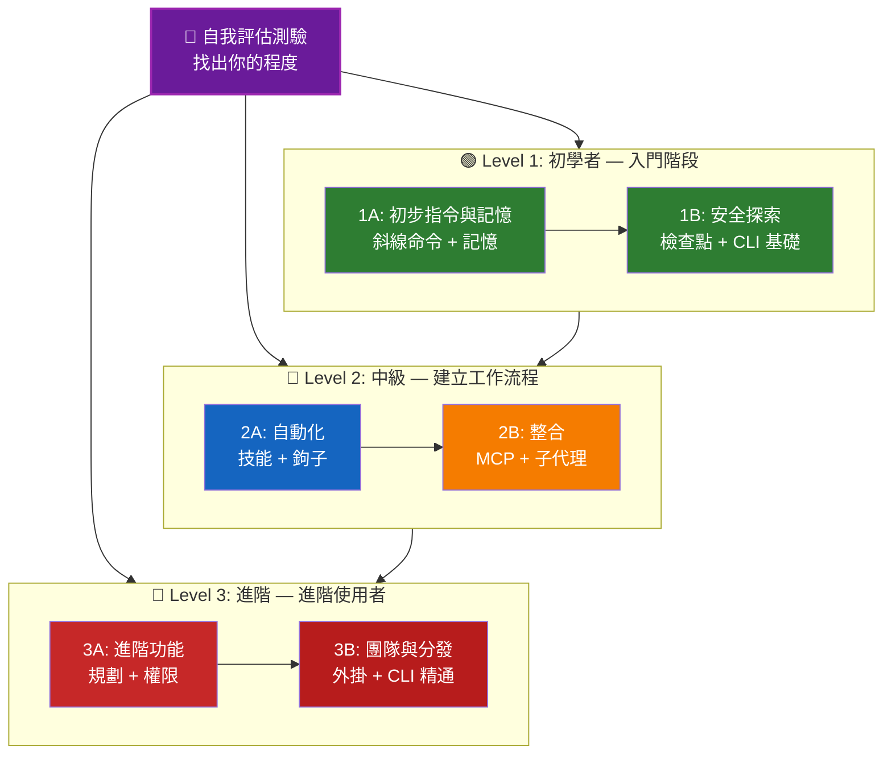

<picture>
  <source media="(prefers-color-scheme: dark)" srcset="resources/logos/claude-howto-logo-dark.svg">
  
</picture>

# 📚 Claude Code 學習路線圖

**剛接觸 Claude Code？** 本指南將幫助您按照自己的步調掌握 Claude Code 的功能。無論您是完全的初學者還是經驗豐富的開發者，請先從下方的自我評估測驗開始，以找到適合您的學習路徑。

---

## 🧭 尋找您的程度

並非每個人都從同一個起點出發。請進行此快速自我評估，以找到正確的切入點。

**請誠實回答以下問題：**

- [ ] 我可以啟動 Claude Code 並進行對話 (`claue`)
- [ ] 我曾經建立或編輯過 CLAUDE.md 檔案
- [ ] 我已使用過至少 3 個內建的斜線命令（例如：`/help`、`/compact`、`/model`）
- [ ] 我曾經建立自定義的斜線命令或技能 (SKILL.md)
- [ ] 我曾經配置過 MCP 伺服器（例如：GitHub、資料庫）
- [ ] 我曾在 `~/.claude/settings.json` 中設定過鉤子 (hooks)
- [ ] 我曾經建立或使用過自定義的子代理 (.claude/agents/)
- [ ] 我曾為了腳本編寫或 CI/CD 使用過列印模式 (`claude -p`)

**您的程度：**

| 檢查項數量 | 程度 | 起點 | 完成所需時間 |
|--------|-------|----------|------------------|
| 0-2 | **Level 1: 初學者** — 入門階段 | [Milestone 1A](#milestone-1a-first-commands--memory) | 約 3 小時 |
| 3-5 | **Level 2: 中級** — 建立工作流程 | [Milestone 2A](#milestone-2a-automation-skills--hooks) | 約 5 小時 |
| 6-8 | **Level 3: 進階** — 進階使用者與團隊領導 | [Milestone 3A](#milestone-3a-advanced-features) | 約 5 小時 |

> **提示**：如果您不確定，請從低一個等級開始。快速複習熟悉的內容，比錯過基礎概念更好。

> **互動版本**：在 Claude Code 中執行 `/self-assessment`，即可進行引導式的互動測驗，該測驗會針對所有 10 個功能領域進行熟練度評分，並生成個人化的學習路徑。

---

## 🎯 學習哲學

本儲存庫中的資料夾是根據三個關鍵原則，按**建議學習順序**進行編號：

1. **依賴關係 (Dependencies)** — 基礎概念優先
2. **複雜度 (Complexity)** — 先學習較簡單的功能，再學習進階功能
3. **使用頻率 (Frequency of Use)** — 最常用的功能會先進行教學

這種方法能確保你在建立穩固基礎的同時，立即獲得生產力上的效益。

---

## 🗺️ 你的學習路徑



**顏色圖例：**
- 💜 紫色：自我評估測驗
- 🟢 綠色：Level 1 — 初學者路徑
- 🔵 藍色 / 🟡 金色：Level 2 — 中級路徑
- 🔴 紅色：Level 3 — 進階路徑

---

## 📊 完整學習路線圖表格

| 步驟 | 功能 | 複雜度 | 時間 | 等級 | 相依性 | 學習原因 | 核心優勢 |
|------|---------|-----------|------|-------|--------------|----------------|--------------|
| **1** | [Slash Commands](01-slash-commands/) | ⭐ 初學者 | 30 min | Level 1 | 無 | 快速提升生產力 (55+ 內建 + 5 個組合技能) | 即時自動化、團隊標準 |
| **2** | [Memory](02-memory/) | ⭐⭐ 初學者+ | 45 min | Level 1 | 無 | 所有功能的基礎 | 持續性的上下文、偏好設定 |
| **3** | [Checkpoints](08-checkpoints/) | ⭐⭐ 中級 | 45 min | Level 1 | 會話管理 | 安全探索 | 實驗、復原 |
| **4** | [CLI Basics](10-cli/) | ⭐⭐ 初學者+ | 30 min | Level 1 | 無 | 核心 CLI 用法 | 互動式與列印模式 |
| **5** | [Skills](03-skills/) | ⭐⭐ 中級 | 1 hour | Level 2 | Slash Commands | 自動化專業知識 | 可重複使用的能力、一致性 |
| **6** | [Hooks](06-hooks/) | ⭐⭐ 中級 | 1 hour | Level 2 | Tools, Commands | 工作流程自動化 (25 個事件, 4 種類型) | 驗證、品質閘門 |
| **7** | [MCP](05-mcp/) | ⭐⭐⭐ 中級+ | 1 hour | Level 2 | Configuration | 即時數據存取 | 即時整合、APIs |
| **8** | [Subagents](04-subagents/) | ⭐⭐⭐ 中級+ | 1.5 hours | Level 2 | Memory, Commands | 處理複雜任務 (包含 Bash 在內的 6 個內建功能) | 委派、專業化技能 |
| **9** | [Advanced Features](09-advanced-features/) | ⭐⭐⭐⭐⭐ 進階 | 2-3 hours | Level 3 | 前述所有內容 | 進階使用者工具 | 規劃、Auto Mode、Channels、語音聽寫、權限管理 |
| **10** | [Plugins](07-plugins/) | ⭐⭐⭐⭐ 進階 | 2 hours | Level 3 | 前述所有內容 | 完整解決方案 | 團隊導入、分發 |
| **11** | [CLI Mastery](10-cli/) | ⭐⭐⭐ 進階 | 1 hour | Level 3 | 建議：全部 | 精通命令列用法 | 腳本編寫、CI/CD、自動化 |

**總學習時間**：約 11-13 小時（或者您可以直接跳到適合您等級的章節以節省時間）

---

## 🟢 Level 1: 初學者 — 入門指南

**對象**：擁有 0-2 次測驗紀錄的使用者
**時間**：約 3 小時
**重點**：立即提升生產力、理解基礎知識
**成果**：成為熟練的日常使用者，準備進入 Level 2

### Milestone 1A: 首批命令與記憶

**主題**：斜線命令 + 記憶
**時間**：1-2 小時
**複雜度**：⭐ 初學者
**目標**：透過自定義命令與持久化上下文，立即提升生產力

#### 你將達成的目標
✅ 為重複性任務建立自定義斜線命令
✅ 為團隊標準設定專案記憶
✅ 配置個人偏好設定
✅ 理解 Claude 如何自動載入上下文

#### 動手練習

```bash
# Exercise 1: 安裝你的第一個斜線命令
mkdir -p .claude/commands
cp 01-slash-commands/optimize.md .claude/commands/

# Exercise 2: 建立專案記憶
cp 02-memory/project-CLAUDE.md ./CLAUDE.md

# Exercise 3: 進行測試
# 在 Claude Code 中，輸入：/optimize
```

#### 成功準則
- [ ] 成功呼叫 `/optimize` 命令
- [ ] Claude 能從 CLAUDE.md 記住你的專案標準
- [ ] 你理解何時該使用斜線命令，何時該使用記憶

#### 後續步驟
熟悉後，請閱讀：
- [01-slash-commands/README.md](01-slash-commands/README.md)
- [02-memory/README.md](02-memory/README.md)

> **檢查你的理解程度**：在 Claude Code 中執行 `/lesson-quiz slash-commands` 或 `/lesson-quiz memory` 來測試你所學到的內容。

---

### Milestone 1B: 安全探索

**主題**：檢查點 + CLI 基礎
**時間**：1 小時
**複雜度**：⭐⭐ 初學者+
**目標**：學習如何安全地進行實驗，並使用核心 CLI 命令

#### 你將達成的目標
✅ 建立與還原檢查點以進行安全實驗
✅ 理解互動模式與列印模式的差異
✅ 使用基本的 CLI 旗標與選項
✅ 透過管線（piping）處理檔案

#### 動手練習

```bash
# Exercise 1: 嘗試檢查點工作流程
# 在 Claude Code 中：
# 進行一些實驗性修改，然後按下 Esc+Esc 或使用 /rewind
# 選擇實驗前的檢查點
# 選擇 "Restore code and conversation" 以進行還原

# Exercise 2: 互動模式 vs 列印模式
claude "explain this project"           # 互動模式
claude -p "explain this function"       # 列印模式 (非互動式)

# Exercise 3: 透過管線處理檔案內容
cat error.log | claude -p "explain this error"
```

#### 成功準則
- [ ] 成功建立並還原至檢查點
- [ ] 同時使用了互動模式與列印模式
- [ ] 將檔案透過管線傳送給 Claude 進行分析
- [ ] 理解何時該使用檢查點進行安全實驗

#### 後續步驟
- 閱讀：[08-checkpoints/README.md](08-checkpoints/README.md)
- 閱讀：[10-cli/README.md](10-cli/README.md)
- **準備好進入 Level 2！** 請前往 [Milestone 2A](#milestone-2a-automation-skills--hooks)

> **檢查你的理解程度**：執行 `/lesson-quiz checkpoints` 或 `/lesson-quiz cli` 以確認你已準備好進入 Level 2。

---

## 🔵 Level 2: 中級 — 建構工作流程

**對象**：已完成 3-5 個測驗檢查的使用者
**時間**：約 5 小時
**重點**：自動化、整合、任務委派
**成果**：自動化工作流程、外部整合、為 Level 3 做準備

### 前置作業檢查

在開始 Level 2 之前，請確保您已熟悉以下 Level 1 的概念：

- [ ] 能夠建立並使用斜線命令 ([01-slash-commands/](01-slash-commands/))
- [ ] 已透過 CLAUDE.md 設定專案記憶 ([02-memory/](02-memory/))
- [ ] 知道如何建立與還原檢查點 ([08-checkpoints/](08-checkpoints/))
- [ ] 能夠從命令列使用 `claude` 與 `claude -p` ([10-cli/](10-cli/))

> **有落差嗎？** 在繼續之前，請複習上方連結的教學。

---

### Milestone 2A: 自動化 (Skills + Hooks)

**主題**：Skills + Hooks
**時間**：2-3 小時
**複雜度**：⭐⭐ 中級
**目標**：自動化常見工作流程與品質檢查

#### 您將達成的成果
✅ 透過 YAML frontmatter（包含 `effort` 與 `shell` 欄位）自動觸發特定技能
✅ 在 25 個 hook 事件中設定事件驅動的自動化
✅ 使用所有 4 種 hook 類型（command, http, prompt, agent）
✅ 強制執行程式碼品質標準
✅ 為您的工作流程建立自定義 hooks

#### 動手練習

```bash
# 練習 1: 安裝一個 skill
cp -r 03-skills/code-review ~/.claude/skills/

# 練習 2: 設定 hooks
mkdir -p ~/.claude/hooks
cp 06-hooks/pre-tool-check.sh ~/.claude/hooks/
chmod +x ~/.claude/hooks/pre-tool-check.sh

# 練習 3: 在設定中配置 hooks
# 新增至 ~/.claude/settings.json:
{
  "hooks": {
    "PreToolUse": [
      {
        "matcher": "Bash",
        "hooks": [
          {
            "type": "command",
            "command": "~/.claude/hooks/pre-tool-check.sh"
          }
        ]
      }
    ]
  }
}
```

#### 成功準則
- [ ] 在相關時自動觸發程式碼審查（code review）技能
- [ ] PreToolUse hook 在工具執行前運行
- [ ] 您理解技能自動觸發與 hook 事件觸發之間的差異

#### 後續步驟
- 建立您自己的自定義技能
- 為您的工作流程設定額外的 hooks
- 閱讀：[03-skills/README.md](03-skills/README.md)
- 閱讀：[06-hooks/README.md](06-hooks/README.md)

> **檢查您的理解程度**：在繼續下一步之前，執行 `/lesson-quiz skills` 或 `/lesson-quiz hooks` 來測試您的知識。

---

### Milestone 2B: 整合 (MCP + Subagents)

**主題**：MCP + Subagents
**時間**：2-3 小時
**複雜度**：⭐⭐⭐ 中級+
**目標**：整合外部服務並委派複雜任務

#### 您將達成的成果
✅ 從 GitHub、資料庫等獲取即時數據
✅ 將工作委派給專業的 AI 代理
✅ 理解何時使用 MCP 與何時使用 subagents
✅ 建構整合式工作流程

#### 動手練習

```bash
# 練習 1: 設定 GitHub MCP
export GITHUB_TOKEN="your_github_token"
claude mcp add github -- npx -y @modelcontextprotocol/server-github

# 練習 2: 測試 MCP 整合
# 在 Claude Code 中：/mcp__github__list_prs

# 練習 3: 安裝 subagents
mkdir -p .claude/agents
```

```
cp 04-subagents/*.md .claude/agents/
```

#### 整合練習
嘗試這個完整的工作流程：
1. 使用 MCP 獲取一個 GitHub PR
2. 讓 Claude 將審查工作委派給 code-reviewer 子代理
3. 使用鉤子自動執行測試

#### 成功標準
- [ ] 成功透過 MCP 查詢 GitHub 資料
- [ ] Claude 能將複雜任務委派給子代理
- [ ] 你理解 MCP 與子代理之間的差異
- [ ] 在一個工作流程中結合了 MCP + 子代理 + 鉤子

#### 下一步
- 設定額外的 MCP servers（資料庫、Slack 等）
- 為你的領域建立自定義子代理
- 閱讀：[05-mcp/README.md](05-mcp/README.md)
- 閱讀：[04-subagents/README.md](04-subagents/README.md)
- **準備好進入 Level 3！** 繼續前往 [Milestone 3A](#milestone-3a-advanced-features)

> **檢查你的理解程度**：執行 `/lesson-quiz mcp` 或 `/lesson-quiz subagents` 以驗證你是否已準備好進入 Level 3。

---

## 🔴 Level 3: 進階 — 進階使用者與團隊領導者

**對象**：已通過 6-8 個測驗檢查的使用者
**時間**：約 5 小時
**重點**：團隊工具、CI/CD、企業級功能、外掛開發
**成果**：成為進階使用者，能夠建立團隊工作流程與 CI/CD

### 前置條件檢查

在開始 Level 3 之前，請確保你已熟悉以下 Level 2 的概念：

- [ ] 能建立並使用具有自動調用功能的技能 ([03-skills/](03-skills/))
- [ ] 已為事件驅動自動化設定好鉤子 ([06-hooks/](06-hooks/))
- [ ] 能為外部資料配置 MCP servers ([05-mcp/](05-mcp/))
- [ ] 知道如何使用子代理進行任務委派 ([04-subagents/](04-subagents/))

> **有落差嗎？** 在繼續之前，請複習上方連結的教學。

---

### Milestone 3A: 進階功能

**主題**：進階功能（規劃、權限、擴展思考、自動模式、頻道、語音聽寫、遠端/桌面/網頁）
**時間**：2-3 小時
**複雜度**：⭐⭐⭐⭐⭐ 進階
**目標**：掌握進階工作流程與進階使用者工具

#### 你將達成的目標
✅ 針對複雜功能的規劃模式
✅ 具備 6 種模式的細粒度權限控制（default, acceptEdits, plan, auto, dontAsk, bypassPermissions）
✅ 透過 Alt+T / Option+T 切換的擴展思考
✅ 背景任務管理
✅ 用於學習偏好的自動記憶
✅ 帶有背景安全分類器的自動模式
✅ 用於結構化多會話工作流程的頻道
✅ 用於免手操作互動的語音聽寫
✅ 遠端控制、桌面應用程式與網頁會話
✅ 用於多代理協作的代理團隊

#### 動手練習

```bash
# 練習 1：使用規劃模式
/plan Implement user authentication system

# 練習 2：嘗試權限模式（共有 6 種可用：default, acceptEdits, plan, auto, dontAsk, bypassPermissions）
claude --permission-mode plan "analyze this codebase"
claude --permission-mode acceptEdits "refactor the auth module"
claude --permission-mode auto "implement the feature"

# 練習 3：啟用擴展思考
# 在會話期間按下 Alt+T (macOS 為 Option+T) 來切換

# 練習 4：進階檢查點工作流程
# 1. 建立檢查點 "Clean state"
# 2. 使用規劃模式來設計功能
```

# 3. 使用子代理委派進行實作
# 4. 在背景執行測試
# 5. 如果測試失敗，回溯至檢查點
# 6. 嘗試替代方案

# 練習 5：嘗試自動模式（背景安全分類器）
claude --permission-mode auto "implement user settings page"

# 練習 6：啟用代理團隊
export CLAUDE_AGENT_TEAMS=1
# 詢問 Claude：「使用團隊方式實作功能 X」

# 練習 7：排程任務
/loop 5m /check-status
# 或使用 CronCreate 進行持久性的排程任務

# 練習 8：用於多會話工作流程的 Channels
# 使用 Channels 來組織跨會話的工作

# 練習 9：語音聽寫
# 使用語音輸入進行免持式的 Claude Code 互動
```

#### 成功標準
- [ ] 使用規劃模式來開發複雜功能
- [ ] 配置權限模式 (plan, acceptEdits, auto, dontAsk)
- [ ] 使用 Alt+T / Option+T 切換延伸思考 (extended thinking)
- [ ] 使用帶有背景安全分類器的自動模式
- [ ] 使用背景任務處理長時間運行的操作
- [ ] 探索用於多會話工作流程的 Channels
- [ ] 嘗試使用語音聽寫進行免持輸入
- [ ] 理解遠端控制、桌面應用程式與 Web 會話
- [ ] 啟用並使用代理團隊 (Agent Teams) 進行協作任務
- [ ] 使用 `/loop` 進行循環任務或排程監控

#### 下一步
- 閱讀：[09-advanced-features/README.md](09-advanced-features/README.md)

> **檢查你的理解程度**：執行 `/lesson-quiz advanced` 來測試你對進階功能掌握的程度。

---

### 里程碑 3B：團隊與分發（外掛 + CLI 精通）

**主題**：外掛 + CLI 精通 + CI/CD
**時間**：2-3 小時
**複雜度**：⭐⭐⭐⭐ 進階
**目標**：建立團隊工具、建立外掛、精通 CI/CD 整合

#### 你將達成的目標
✅ 安裝並建立完整的綑綁式外掛
✅ 精通用於腳本編寫與自動化的 CLI
✅ 設定與 `claude -p` 的 CI/CD 整合
✅ 用於自動化流水線的 JSON 輸出
✅ 會話管理與批次處理

#### 動手練習

```bash
# 練習 1：安裝完整外掛
# 在 Claude Code 中：/plugin install pr-review

# 練習 2：用於 CI/CD 的列印模式
claude -p "Run all tests and generate report"

# 練習 3：用於腳本的 JSON 輸出
claude -p --output-format json "list all functions"

# 練習 4：會話管理與恢復
claude -r "feature-auth" "continue implementation"

# 練習 5：帶有限制條件的 CI/CD 整合
claude -p --max-turns 3 --output-format json "review code"

# 練習 6：批次處理
for file in *.md; do
  claude -p --output-format json "summarize this: $(cat $file)" > ${file%.md}.summary.json
done
```

#### CI/CD 整合練習
建立一個簡單的 CI/CD 腳本：
1. 使用 `claude -p` 審查變更的檔案
2. 將結果輸出為 JSON
3. 使用 `jq` 處理特定問題
4. 整合至 GitHub Actions 工作流程

#### 成功標準
- [ ] 安裝並使用了外掛
- [ ] 為你的團隊建立或修改了外掛
- [ ] 在 CI/CD 中使用了列印模式 (`claude -p`)
- [ ] 產生了用於腳本編寫的 JSON 輸出
- [ ] 成功恢復了先前的會話

- [ ] 建立了一個批次處理腳本
- [ ] 將 Claude 整合至 CI/CD 工作流程

#### CLI 的實際應用場景
- **程式碼審查自動化**：在 CI/CD 流水線中執行程式碼審查
- **日誌分析**：分析錯誤日誌與系統輸出
- **文件生成**：批次生成文件
- **測試洞察**：分析測試失敗原因
- **效能分析**：審查效能指標
- **資料處理**：轉換與分析資料檔案

#### 下一步
- 閱讀：[07-plugins/README.md](07-plugins/README.md)
- 閱讀：[10-cli/README.md](10-cli/README.md)
- 建立團隊共用的 CLI 捷徑與外掛
- 設定批次處理腳本

> **檢查你的理解程度**：執行 `/lesson-quiz plugins` 或 `/lesson-quiz cli` 以確認你的掌握程度。

---

## 🧪 測試你的知識

此儲存庫包含兩個互動式技能，你可以隨時在 Claude Code 中使用，以評估你的理解程度：

| 技能 | 命令 | 用途 |
|-------|---------|---------|
| **自我評估** | `/self-assessment` | 評估你在所有 10 個功能中的整體熟練度。選擇快速（2 分鐘）或深入（5 分鐘）模式，以獲得個人化的技能概況與學習路徑。 |
| **課程測驗** | `/lesson-quiz [lesson]` | 透過 10 個問題測試你對特定課程的理解。可在課程前（前測）、課程中（進度檢查）或課程後（掌握程度驗證）使用。 |

**範例：**
```
/self-assessment                  # 找出你的整體程度
/lesson-quiz hooks                # 關於 Lesson 06: Hooks 的測驗
/lesson-quiz 03                   # 關於 Lesson 03: Skills 的測驗
/lesson-quiz advanced-features    # 關於 Lesson 09 的測驗
```

---

## ⚡ 快速入門路徑

### 如果你只有 15 分鐘
**目標**：獲得你的第一次勝利

1. 複製一個斜線命令：`cp 01-slash-commands/optimize.md .claude/commands/`
2. 在 Claude Code 中嘗試：`/optimize`
3.閱讀：[01-slash-commands/README.md](01-slash-commands/README.md)

**成果**：你將擁有一個可運作的斜線命令並理解基本概念

---

### 如果你有 1 小時
**目標**：設定必要的生產力工具

1. **斜線命令** (15 分鐘)：複製並測試 `/optimize` 與 `/pr`
2. **專案記憶** (15 分鐘)：建立包含專案標準的 CLAUDE.md
3. **安裝技能** (15 分鐘)：設定 code-review 技能
4. **組合嘗試** (15 分鐘)：觀察它們如何協同工作

**成果**：透過命令、記憶與自動化技能獲得基礎的生產力提升

---

### 如果你有整個週末
**目標**：精通大多數功能

**週六上午** (3 小時)：
- 完成里程碑 1A：斜線命令 + 記憶
- 完成里程碑 1B：檢查點 + CLI 基礎

**週六下午** (3 小時)：
- 完成里程碑 2A：技能 + 鉤子
- 完成里程碑 2B：MCP + 子代理

**週日** (4 小時)：
- 完成里程碑 3A：進階功能
- 完成里程碑 3B：外掛 + CLI 精通 + CI/CD
- 為你的團隊建立一個自定義外掛

**成果**：你將成為一名 Claude Code 進階使用者，準備好指導他人並自動化複雜的工作流程

---

## 💡 學習技巧

### ✅ 應該

- **先進行測驗**以找到你的起點
- **完成每個里程碑的動手練習**
- **從簡單開始**並逐漸增加複雜度
- **測試每個功能**後再進入下一個階段
- **做筆記**記錄哪些內容對你的工作流程有效
- 在學習進階主題時，**回頭參考**先前的概念
- 使用檢查點進行**安全的實驗**
- 與你的團隊**分享知識**

### ❌ 不要

- 在跳轉到更高層級時**跳過前置檢查**
- **試圖一次學完所有東西**——這會讓你感到壓力過大
- **在不理解的情況下複製配置**——你將無法進行除錯
- **忘記測試**——務必驗證功能是否正常運作
- **趕著完成里程碑**——請花時間去理解
- **忽略文件**——每個 README 都包含有價值的細節
- **孤立作業**——請與隊友討論

## 🎓 學習風格

### 視覺型學習者
- 研究每個 README 中的 mermaid 圖表
- 觀察指令執行流程
- 繪製自己的工作流程圖
- 使用上述的視覺化學習路徑

### 動手實作型學習者
- 完成每一個動手實作練習
- 嘗試不同的變體進行實驗
- 破壞並修復它們（記得使用檢查點！）
- 建立自己的範例

### 閱讀型學習者
- 徹底閱讀每個 README
- 研究程式碼範例
- 查看比較表格
- 閱讀資源中連結的部落格文章

### 社交型學習者
- 進行配對程式設計會話
- 向隊友講解概念
- 加入 Claude Code 社群討論
- 分享你的自定義配置

---

## 📈 進度追蹤

使用這些檢查清單來追蹤你的等級進度。你可以隨時執行 `/self-assessment` 來獲取更新後的技能概況，或在每個教學結束後執行 `/lesson-quiz [lesson]` 以驗證你的理解程度。

### 🟢 Level 1: 初學者
- [ ] 完成 [01-slash-commands](01-slash-commands/)
- [ ] 完成 [02-memory](02-memory/)
- [ ] 建立了第一個自定義斜線命令
- [ ] 設定了專案記憶
- [ ] **達成里程碑 1A**
- [ ] 完成 [08-checkpoints](08-checkpoints/)
- [ ] 完成 [10-cli](10-cli/) 基礎知識
- [ ] 建立並還原至檢查點
- [ ] 使用互動模式與列印模式
- [ ] **達成里程碑 1B**

### 🔵 Level 2: 中級
- [ ] 完成 [03-skills](03-skills/)
- [ ] 完成 [06-hooks](06-hooks/)
- [ ] 安裝了第一個技能
- [ ] 設定了 PreToolUse 鉤子
- [ ] **達成里程碑 2A**
- [ ] 完成 [05-mcp](05-mcp/)
- [ ] 完成 [04-subagents](04-subagents/)
- [ ] 連接 GitHub MCP
- [ ] 建立了自定義子代理
- [ ] 在工作流程中結合多種整合功能
- [ ] **達成里程碑 2B**

### 🔴 Level 3: 進階
- [ ] 完成 [09-advanced-features](09-advanced-features/)
- [ ] 成功使用規劃模式
- [ ] 配置權限模式（包含自動模式在內的 6 種模式）
- [ ] 使用帶有安全分類器的自動模式
- [ ] 使用擴展思考切換功能
- [ ] 探索 Channels 與語音聽寫
- [ ] **達成里程碑 3A**
- [ ] 完成 [07-plugins](07-plugins/)
- [ ] 完成 [10-cli](10-cli/) 進階用法
- [ ] 設定列印模式 (`claude -p`) CI/CD
- [ ] 建立用於自動化的 JSON 輸出
- [ ] 將 Claude 整合至 CI/CD 流水線
- [ ] 建立了團隊外掛
- [ ] **達成里程碑 3B**

---

## 🆘 常見學習挑戰

### 挑戰 1：「一次太多概念」
**解決方案**：一次專注於一個里程碑。在繼續前進之前，先完成所有練習。

### 挑戰 2：「不知道何時該使用哪個功能」
**解決方案**：參考主 README 中的 [Use Case Matrix](README.md#use-case-matrix)。

### 挑戰 3：「設定無法運作」
**解決方案**：檢查 [Troubleshooting](README.md#troubleshooting) 章節並驗證檔案位置。

### 挑戰 4：「概念似乎有重疊」
**解決方案**：查看 [Feature Comparison](README.md#feature-comparison) 表格以了解差異。

### 挑戰 5：「很難記住所有內容」
**解決方案**：建立你自己的速查表。利用 checkpoints 進行安全實驗。

### 挑戰 6：「我有經驗，但不確定從何開始」
**解決方案**：進行上方的 [Self-Assessment Quiz](#-find-your-level)。跳轉至你的等級，並使用前置條件檢查來識別任何知識缺口。

---

## 🎯 完成後的下一步是什麼？

一旦你完成了所有里程碑：

1. **建立團隊文件** - 記錄你團隊的 Claude Code 設定
2. **建立自定義外掛** - 將你團隊的工作流程打包
3. **探索 Remote Control** - 從外部工具以程式化方式控制 Claude Code 會話
4. **嘗試 Web Sessions** - 透過瀏覽器介面使用 Claude Code 進行遠端開發
5. **使用 Desktop App** - 透過原生桌面應用程式存取 Claude Code 功能
6. **使用 Auto Mode** - 讓 Claude 在背景安全分類器的輔助下自主工作
7. **利用 Auto Memory** - 讓 Claude 隨著時間自動學習你的偏好
8. **建立 Agent Teams** - 在複雜且多面向的任務上協調多個代理
9. **使用 Channels** - 在結構化的多會話工作流程中組織工作
10. **嘗試語音聽寫** - 使用免持語音輸入與 Claude Code 互動
11. **使用排程任務** - 使用 `/loop` 和 cron 工具自動化定期檢查
12. **貢獻範例** - 與社群分享
13. **指導他人** - 幫助隊友學習
14. **優化工作流程** - 根據使用情況持續改進
15. **保持更新** - 關注 Claude Code 的發佈與新功能

---

## 📚 其他資源

### 官方文件
- [Claude Code Documentation](https://code.claude.com/docs/en/overview)
- [Anthropic Documentation](https://docs.anthropic.com)
- [MCP Protocol Specification](https://modelcontextprotocol.io)

### 部落格文章
- [Discovering Claude Code Slash Commands](https://medium.com/@luongnv89/discovering-claude-code-slash-commands-cdc17f0dfb29)

### 社群
- [Anthropic Cookbook](https://github.com/anthropics/anthropic-cookbook)
- [MCP Servers Repository](https://github.com/modelcontextprotocol/servers)

---

## 💬 回饋與支援

- **發現問題？** 在儲存庫中建立一個 issue
- **有建議？** 提交一個 pull request
- **需要幫助？** 查看文件或詢問社群

---

**最後更新日期**：2026 年 4 月 16 日
**Claude Code 版本**：2.1.112
**來源**：
- https://docs.anthropic.com/en/docs/claude-code
- https://www.anthropic.com/news/claude-opus-4-7
- https://support.claude.com/en/articles/12138966-release-notes
**相容模型**：Claude Sonnet 4.6, Claude Opus 4.7, Claude Haiku 4.5
**維護者**：Claude How-To Contributors
**授權**：僅供教育用途，可自由使用與改編

---

[← 返回主 README](README.md)
