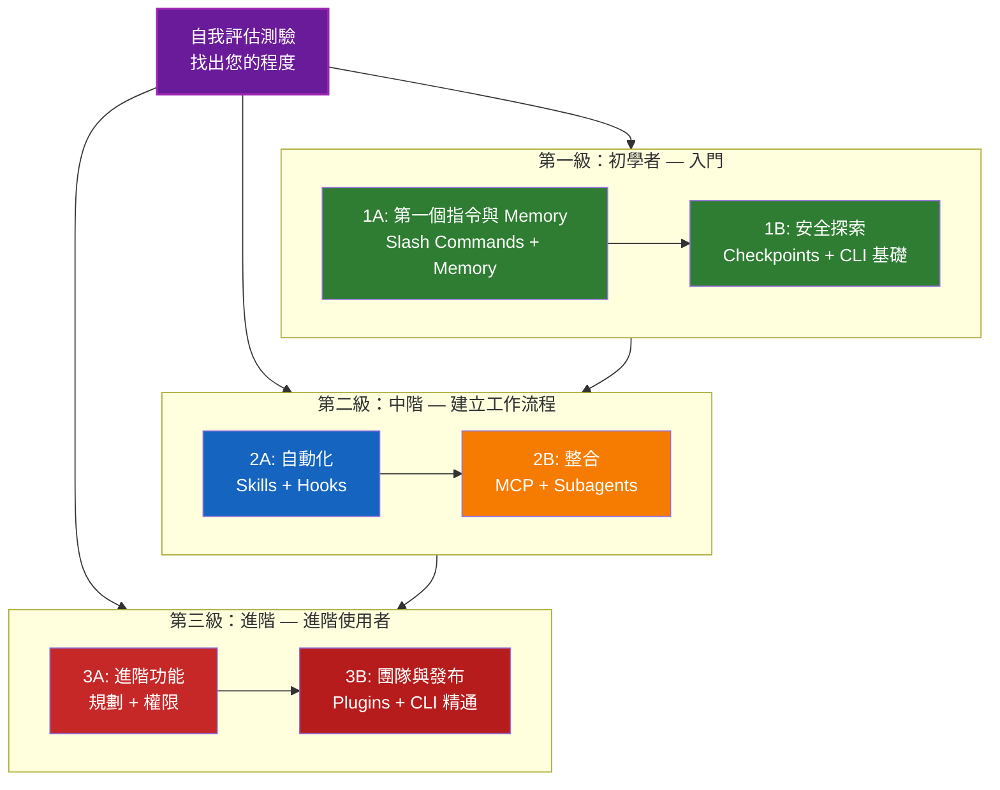

<picture>
  <source media="(prefers-color-scheme: dark)" srcset="resources/logos/claude-howto-logo-dark.svg">
  
</picture>

# Claude Code 學習路線圖

**Claude Code 新手？** 本指南協助您以自己的節奏精通 Claude Code 功能。無論您是完全的初學者還是有經驗的開發者，請先完成下方的自我評估測驗，找到適合您的起點。

---

## 找出您的程度

不是每個人的起點都一樣。請完成這個快速自我評估，找到正確的入門點。

**請誠實回答以下問題：**

- [ ] 我能啟動 Claude Code 並進行對話（`claude`）
- [ ] 我曾建立或編輯過 CLAUDE.md 檔案
- [ ] 我曾使用過至少 3 個內建斜線指令（例如 /help、/compact、/model）
- [ ] 我曾建立過自訂斜線指令或 skill（SKILL.md）
- [ ] 我曾設定過 MCP 伺服器（例如 GitHub、資料庫）
- [ ] 我曾在 ~/.claude/settings.json 中設置過 hooks
- [ ] 我曾建立或使用過自訂子代理（.claude/agents/）
- [ ] 我曾使用過 print 模式（`claude -p`）進行腳本或 CI/CD

**您的程度：**

| 勾選數 | 程度 | 從此開始 | 預計完成時間 |
|--------|-------|----------|------------------|
| 0-2 | **第一級：初學者** — 入門 | [里程碑 1A](#里程碑-1a第一個指令與-memory) | 約 3 小時 |
| 3-5 | **第二級：中階** — 建立工作流程 | [里程碑 2A](#里程碑-2a自動化skillshooks) | 約 5 小時 |
| 6-8 | **第三級：進階** — 進階使用者與團隊負責人 | [里程碑 3A](#里程碑-3a進階功能) | 約 5 小時 |

> **提示**：如果不確定，從低一個程度開始。快速複習熟悉的內容，勝過遺漏基礎概念。

> **互動版本**：在 Claude Code 中執行 `/self-assessment` 進行引導式互動測驗，評估您在所有 10 個功能領域的熟練度，並生成個人化學習路徑。

---

## 學習理念

此儲存庫的資料夾按**建議的學習順序**編號，基於三個核心原則：

1. **相依性** — 基礎概念優先
2. **複雜度** — 簡單功能先於進階功能
3. **使用頻率** — 最常用的功能提早學習

此方法確保您在獲得即時生產力提升的同時，也建立了堅實的基礎。

---

## 您的學習路徑



**顏色說明：**
- 紫色：自我評估測驗
- 綠色：第一級 — 初學者路徑
- 藍色 / 金色：第二級 — 中階路徑
- 紅色：第三級 — 進階路徑

---

## 完整路線圖表

| 步驟 | 功能 | 複雜度 | 時間 | 程度 | 相依性 | 學習原因 | 主要效益 |
|------|---------|-----------|------|-------|--------------|----------------|--------------|
| **1** | [Slash Commands](01-slash-commands/) | 初學者 | 30 分鐘 | 第一級 | 無 | 快速生產力提升（55+ 內建 + 5 捆綁 skills） | 即時自動化、團隊標準 |
| **2** | [Memory](02-memory/) | 初學者+ | 45 分鐘 | 第一級 | 無 | 所有功能的基礎 | 持久化上下文、個人偏好 |
| **3** | [Checkpoints](08-checkpoints/) | 中階 | 45 分鐘 | 第一級 | 工作階段管理 | 安全探索 | 實驗、恢復 |
| **4** | [CLI 基礎](10-cli/) | 初學者+ | 30 分鐘 | 第一級 | 無 | 核心 CLI 使用 | 互動與 print 模式 |
| **5** | [Skills](03-skills/) | 中階 | 1 小時 | 第二級 | Slash Commands | 自動專業能力 | 可重用能力、一致性 |
| **6** | [Hooks](06-hooks/) | 中階 | 1 小時 | 第二級 | 工具、指令 | 工作流程自動化（25 個事件，4 種類型） | 驗證、品質把關 |
| **7** | [MCP](05-mcp/) | 中階+ | 1 小時 | 第二級 | 設定 | 即時資料存取 | 即時整合、APIs |
| **8** | [Subagents](04-subagents/) | 中階+ | 1.5 小時 | 第二級 | Memory、指令 | 複雜任務處理（6 個內建，包括 Bash） | 委派、專業能力 |
| **9** | [Advanced Features](09-advanced-features/) | 進階 | 2-3 小時 | 第三級 | 所有前置 | 進階使用者工具 | 規劃、Auto Mode、Channels、Voice Dictation、權限 |
| **10** | [Plugins](07-plugins/) | 進階 | 2 小時 | 第三級 | 所有前置 | 完整解決方案 | 團隊入職、發布 |
| **11** | [CLI 精通](10-cli/) | 進階 | 1 小時 | 第三級 | 建議：全部 | 精通命令列使用 | 腳本、CI/CD、自動化 |

**總學習時間**：約 11-13 小時（或跳至您的程度以節省時間）

---

## 第一級：初學者 — 入門

**適合**：測驗勾選 0-2 項的使用者
**時間**：約 3 小時
**重點**：立即提升生產力、理解基礎
**成果**：成為輕鬆的日常使用者，準備好進入第二級

### 里程碑 1A：第一個指令與 Memory

**主題**：Slash Commands + Memory
**時間**：1-2 小時
**複雜度**：初學者
**目標**：使用自訂指令和持久化上下文立即提升生產力

#### 您將達成什麼

- 為重複性任務建立自訂斜線指令
- 為團隊標準設置專案 memory
- 配置個人偏好
- 了解 Claude 如何自動載入上下文

#### 實作練習

```bash
# Exercise 1: Install your first slash command
mkdir -p .claude/commands
cp 01-slash-commands/optimize.md .claude/commands/

# Exercise 2: Create project memory
cp 02-memory/project-CLAUDE.md ./CLAUDE.md

# Exercise 3: Try it out
# In Claude Code, type: /optimize
```

#### 成功標準
- [ ] 成功呼叫 `/optimize` 指令
- [ ] Claude 能記住 CLAUDE.md 中的專案標準
- [ ] 您了解何時使用斜線指令 vs. memory

#### 下一步
熟悉後，請閱讀：
- [01-slash-commands/README.md](01-slash-commands/README.md)
- [02-memory/README.md](02-memory/README.md)

> **確認理解**：在 Claude Code 中執行 `/lesson-quiz slash-commands` 或 `/lesson-quiz memory` 測試您所學的內容。

---

### 里程碑 1B：安全探索

**主題**：Checkpoints + CLI 基礎
**時間**：1 小時
**複雜度**：初學者+
**目標**：學習安全實驗並使用核心 CLI 指令

#### 您將達成什麼

- 建立和恢復檢查點以進行安全實驗
- 了解互動模式 vs. print 模式
- 使用基本 CLI 旗標和選項
- 透過管道處理檔案

#### 實作練習

```bash
# Exercise 1: Try checkpoint workflow
# In Claude Code:
# Make some experimental changes, then press Esc+Esc or use /rewind
# Select the checkpoint before your experiment
# Choose "Restore code and conversation" to go back

# Exercise 2: Interactive vs Print mode
claude "explain this project"           # Interactive mode
claude -p "explain this function"       # Print mode (non-interactive)

# Exercise 3: Process file content via piping
cat error.log | claude -p "explain this error"
```

#### 成功標準
- [ ] 建立並回復至檢查點
- [ ] 使用了互動模式和 print 模式
- [ ] 將檔案透過管道傳送給 Claude 進行分析
- [ ] 了解何時使用檢查點進行安全實驗

#### 下一步
- 閱讀：[08-checkpoints/README.md](08-checkpoints/README.md)
- 閱讀：[10-cli/README.md](10-cli/README.md)
- **準備好進入第二級了！** 繼續至[里程碑 2A](#里程碑-2a自動化skillshooks)

> **確認理解**：執行 `/lesson-quiz checkpoints` 或 `/lesson-quiz cli` 確認您已準備好進入第二級。

---

## 第二級：中階 — 建立工作流程

**適合**：測驗勾選 3-5 項的使用者
**時間**：約 5 小時
**重點**：自動化、整合、任務委派
**成果**：自動化工作流程、外部整合，準備好進入第三級

### 先決條件確認

開始第二級前，請確認您熟悉以下第一級概念：

- [ ] 能夠建立並使用斜線指令（[01-slash-commands/](01-slash-commands/)）
- [ ] 已透過 CLAUDE.md 設置專案 memory（[02-memory/](02-memory/)）
- [ ] 了解如何建立和恢復檢查點（[08-checkpoints/](08-checkpoints/)）
- [ ] 能從命令列使用 `claude` 和 `claude -p`（[10-cli/](10-cli/)）

> **有缺口？** 在繼續之前先複習上述連結的教學。

---

### 里程碑 2A：自動化（Skills + Hooks）

**主題**：Skills + Hooks
**時間**：2-3 小時
**複雜度**：中階
**目標**：自動化常見工作流程和品質確認

#### 您將達成什麼

- 使用 YAML frontmatter 自動呼叫專業能力（包括 `effort` 和 `shell` 欄位）
- 在 25 個 hook 事件中設置事件驅動自動化
- 使用所有 4 種 hook 類型（command、http、prompt、agent）
- 強制執行程式碼品質標準
- 為您的工作流程建立自訂 hooks

#### 實作練習

```bash
# Exercise 1: Install a skill
cp -r 03-skills/code-review ~/.claude/skills/

# Exercise 2: Set up hooks
mkdir -p ~/.claude/hooks
cp 06-hooks/pre-tool-check.sh ~/.claude/hooks/
chmod +x ~/.claude/hooks/pre-tool-check.sh

# Exercise 3: Configure hooks in settings
# Add to ~/.claude/settings.json:
{
  "hooks": {
    "PreToolUse": [
      {
        "matcher": "Bash",
        "hooks": [
          {
            "type": "command",
            "command": "~/.claude/hooks/pre-tool-check.sh"
          }
        ]
      }
    ]
  }
}
```

#### 成功標準
- [ ] 程式碼審查 skill 在相關時機自動呼叫
- [ ] PreToolUse hook 在工具執行前運行
- [ ] 您了解 skill 自動呼叫 vs. hook 事件觸發的差異

#### 下一步
- 建立您自己的自訂 skill
- 為您的工作流程設置額外的 hooks
- 閱讀：[03-skills/README.md](03-skills/README.md)
- 閱讀：[06-hooks/README.md](06-hooks/README.md)

> **確認理解**：執行 `/lesson-quiz skills` 或 `/lesson-quiz hooks` 測試您的知識後再繼續。

---

### 里程碑 2B：整合（MCP + Subagents）

**主題**：MCP + Subagents
**時間**：2-3 小時
**複雜度**：中階+
**目標**：整合外部服務並委派複雜任務

#### 您將達成什麼

- 從 GitHub、資料庫等存取即時資料
- 將工作委派給專業 AI 代理
- 了解何時使用 MCP vs. 子代理
- 建立整合工作流程

#### 實作練習

```bash
# Exercise 1: Set up GitHub MCP
export GITHUB_TOKEN="your_github_token"
claude mcp add github -- npx -y @modelcontextprotocol/server-github

# Exercise 2: Test MCP integration
# In Claude Code: /mcp__github__list_prs

# Exercise 3: Install subagents
mkdir -p .claude/agents
cp 04-subagents/*.md .claude/agents/
```

#### 整合練習
嘗試這個完整工作流程：
1. 使用 MCP 取得 GitHub PR
2. 讓 Claude 委派審查給 code-reviewer 子代理
3. 使用 hooks 自動執行測試

#### 成功標準
- [ ] 成功透過 MCP 查詢 GitHub 資料
- [ ] Claude 委派複雜任務給子代理
- [ ] 您了解 MCP 和子代理的差異
- [ ] 在工作流程中結合 MCP + 子代理 + hooks

#### 下一步
- 設置額外的 MCP 伺服器（資料庫、Slack 等）
- 為您的領域建立自訂子代理
- 閱讀：[05-mcp/README.md](05-mcp/README.md)
- 閱讀：[04-subagents/README.md](04-subagents/README.md)
- **準備好進入第三級了！** 繼續至[里程碑 3A](#里程碑-3a進階功能)

> **確認理解**：執行 `/lesson-quiz mcp` 或 `/lesson-quiz subagents` 確認您已準備好進入第三級。

---

## 第三級：進階 — 進階使用者與團隊負責人

**適合**：測驗勾選 6-8 項的使用者
**時間**：約 5 小時
**重點**：團隊工具、CI/CD、企業功能、外掛開發
**成果**：進階使用者，能設置團隊工作流程和 CI/CD

### 先決條件確認

開始第三級前，請確認您熟悉以下第二級概念：

- [ ] 能夠使用自動呼叫建立和使用 skills（[03-skills/](03-skills/)）
- [ ] 已設置 hooks 進行事件驅動自動化（[06-hooks/](06-hooks/)）
- [ ] 能夠配置 MCP 伺服器以存取外部資料（[05-mcp/](05-mcp/)）
- [ ] 了解如何使用子代理進行任務委派（[04-subagents/](04-subagents/)）

> **有缺口？** 在繼續之前先複習上述連結的教學。

---

### 里程碑 3A：進階功能

**主題**：進階功能（規劃、權限、Extended Thinking、Auto Mode、Channels、Voice Dictation、Remote/Desktop/Web）
**時間**：2-3 小時
**複雜度**：進階
**目標**：精通進階工作流程和進階使用者工具

#### 您將達成什麼

- 使用規劃模式處理複雜功能
- 使用 6 種模式進行細粒度權限控制（default、acceptEdits、plan、auto、dontAsk、bypassPermissions）
- 透過 Alt+T / Option+T 切換 Extended thinking
- 背景任務管理
- 自動記憶學習偏好
- 使用背景安全分類器的 Auto Mode
- 使用 Channels 進行結構化多工作階段工作流程
- 使用 Voice Dictation 進行免手操作
- 遠端控制、桌面應用程式和網頁工作階段
- Agent Teams 用於多代理協作

#### 實作練習

```bash
# Exercise 1: Use planning mode
/plan Implement user authentication system

# Exercise 2: Try permission modes (6 available: default, acceptEdits, plan, auto, dontAsk, bypassPermissions)
claude --permission-mode plan "analyze this codebase"
claude --permission-mode acceptEdits "refactor the auth module"
claude --permission-mode auto "implement the feature"

# Exercise 3: Enable extended thinking
# Press Alt+T (Option+T on macOS) during a session to toggle

# Exercise 4: Advanced checkpoint workflow
# 1. Create checkpoint "Clean state"
# 2. Use planning mode to design a feature
# 3. Implement with subagent delegation
# 4. Run tests in background
# 5. If tests fail, rewind to checkpoint
# 6. Try alternative approach

# Exercise 5: Try auto mode (background safety classifier)
claude --permission-mode auto "implement user settings page"

# Exercise 6: Enable agent teams
export CLAUDE_AGENT_TEAMS=1
# Ask Claude: "Implement feature X using a team approach"

# Exercise 7: Scheduled tasks
/loop 5m /check-status
# Or use CronCreate for persistent scheduled tasks

# Exercise 8: Channels for multi-session workflows
# Use channels to organize work across sessions

# Exercise 9: Voice Dictation
# Use voice input for hands-free interaction with Claude Code
```

#### 成功標準
- [ ] 為複雜功能使用了規劃模式
- [ ] 配置了權限模式（plan、acceptEdits、auto、dontAsk）
- [ ] 使用 Alt+T / Option+T 切換了 extended thinking
- [ ] 使用了帶背景安全分類器的 auto mode
- [ ] 使用背景任務處理長時間操作
- [ ] 探索了 Channels 用於多工作階段工作流程
- [ ] 嘗試了 Voice Dictation 進行免手操作輸入
- [ ] 了解遠端控制、桌面應用程式和網頁工作階段
- [ ] 啟用並使用 Agent Teams 進行協作任務
- [ ] 使用 `/loop` 進行重複性任務或排程監控

#### 下一步
- 閱讀：[09-advanced-features/README.md](09-advanced-features/README.md)

> **確認理解**：執行 `/lesson-quiz advanced` 測試您對進階使用者功能的掌握程度。

---

### 里程碑 3B：團隊與發布（Plugins + CLI 精通）

**主題**：Plugins + CLI 精通 + CI/CD
**時間**：2-3 小時
**複雜度**：進階
**目標**：建立團隊工具、建立外掛、精通 CI/CD 整合

#### 您將達成什麼

- 安裝並建立完整的捆綁外掛
- 精通 CLI 以進行腳本和自動化
- 使用 `claude -p` 設置 CI/CD 整合
- 自動化管道的 JSON 輸出
- 工作階段管理和批次處理

#### 實作練習

```bash
# Exercise 1: Install a complete plugin
# In Claude Code: /plugin install pr-review

# Exercise 2: Print mode for CI/CD
claude -p "Run all tests and generate report"

# Exercise 3: JSON output for scripts
claude -p --output-format json "list all functions"

# Exercise 4: Session management and resumption
claude -r "feature-auth" "continue implementation"

# Exercise 5: CI/CD integration with constraints
claude -p --max-turns 3 --output-format json "review code"

# Exercise 6: Batch processing
for file in *.md; do
  claude -p --output-format json "summarize this: $(cat $file)" > ${file%.md}.summary.json
done
```

#### CI/CD 整合練習
建立一個簡單的 CI/CD 腳本：
1. 使用 `claude -p` 審查變更的檔案
2. 將結果輸出為 JSON
3. 使用 `jq` 處理特定問題
4. 整合至 GitHub Actions 工作流程

#### 成功標準
- [ ] 安裝並使用了外掛
- [ ] 為團隊建立或修改了外掛
- [ ] 在 CI/CD 中使用了 print 模式（`claude -p`）
- [ ] 為腳本生成了 JSON 輸出
- [ ] 成功恢復了上一個工作階段
- [ ] 建立了批次處理腳本
- [ ] 將 Claude 整合至 CI/CD 工作流程

#### CLI 的實際使用情境
- **程式碼審查自動化**：在 CI/CD 管道中執行程式碼審查
- **日誌分析**：分析錯誤日誌和系統輸出
- **文件生成**：批次生成文件
- **測試洞見**：分析測試失敗
- **效能分析**：審查效能指標
- **資料處理**：轉換和分析資料檔案

#### 下一步
- 閱讀：[07-plugins/README.md](07-plugins/README.md)
- 閱讀：[10-cli/README.md](10-cli/README.md)
- 建立全團隊的 CLI 快捷鍵和外掛
- 設置批次處理腳本

> **確認理解**：執行 `/lesson-quiz plugins` 或 `/lesson-quiz cli` 確認您的掌握程度。

---

## 測試您的知識

此儲存庫包含兩個互動式 skills，您可隨時在 Claude Code 中使用來評估您的理解：

| Skill | 指令 | 目的 |
|-------|---------|---------|
| **Self-Assessment** | `/self-assessment` | 評估您在所有 10 個功能領域的整體熟練度。選擇快速（2 分鐘）或深度（5 分鐘）模式，獲取個人化的技能檔案和學習路徑。 |
| **Lesson Quiz** | `/lesson-quiz [lesson]` | 以 10 個問題測試您對特定課程的理解。可在課程前（預測試）、中（進度確認）或後（精通驗證）使用。 |

**範例：**
```
/self-assessment                  # Find your overall level
/lesson-quiz hooks                # Quiz on Lesson 06: Hooks
/lesson-quiz 03                   # Quiz on Lesson 03: Skills
/lesson-quiz advanced-features    # Quiz on Lesson 09
```

---

## 快速入門路徑

### 只有 15 分鐘
**目標**：獲得第一個成果

1. 複製一個斜線指令：`cp 01-slash-commands/optimize.md .claude/commands/`
2. 在 Claude Code 中試用：`/optimize`
3. 閱讀：[01-slash-commands/README.md](01-slash-commands/README.md)

**成果**：您將擁有一個可運行的斜線指令並理解基礎知識

---

### 有 1 小時
**目標**：設置基本生產力工具

1. **Slash commands**（15 分鐘）：複製並測試 `/optimize` 和 `/pr`
2. **Project memory**（15 分鐘）：以您的專案標準建立 CLAUDE.md
3. **安裝 skill**（15 分鐘）：設置 code-review skill
4. **一起嘗試**（15 分鐘）：了解它們如何協同運作

**成果**：透過指令、memory 和自動 skills 提升基本生產力

---

### 有一個週末
**目標**：精通大多數功能

**週六上午**（3 小時）：
- 完成里程碑 1A：Slash Commands + Memory
- 完成里程碑 1B：Checkpoints + CLI 基礎

**週六下午**（3 小時）：
- 完成里程碑 2A：Skills + Hooks
- 完成里程碑 2B：MCP + Subagents

**週日**（4 小時）：
- 完成里程碑 3A：進階功能
- 完成里程碑 3B：Plugins + CLI 精通 + CI/CD
- 為您的團隊建立自訂外掛

**成果**：您將成為 Claude Code 進階使用者，準備好訓練他人並自動化複雜工作流程

---

## 學習提示

### 應做的事

- **先完成測驗**以找到您的起點
- **完成每個里程碑的實作練習**
- **從簡單開始**，逐漸增加複雜度
- **測試每個功能**後再進入下一個
- **記筆記**，記錄適合您工作流程的內容
- **參考之前的概念**，在學習進階主題時回顧
- **使用檢查點安全實驗**
- **與團隊分享知識**

### 不應做的事

- **跳到更高程度時不要跳過先決條件確認**
- **不要試圖一次學習所有內容** — 會讓人不知所措
- **不要在不理解的情況下複製設定** — 出問題時就不知道如何除錯
- **不要忘記測試** — 始終確認功能有效
- **不要急於完成里程碑** — 花時間理解
- **不要忽略文件** — 每個 README 都有寶貴的細節
- **不要孤立工作** — 與團隊成員討論

---

## 學習風格

### 視覺學習者
- 學習每個 README 中的 mermaid 圖
- 觀察指令執行流程
- 繪製自己的工作流程圖
- 使用上方的視覺學習路徑

### 動手學習者
- 完成每個實作練習
- 嘗試各種變體
- 弄壞再修復（使用檢查點！）
- 建立自己的範例

### 閱讀學習者
- 仔細閱讀每個 README
- 研究程式碼範例
- 查閱比較表
- 閱讀資源中連結的部落格文章

### 社交學習者
- 安排結對程式設計工作階段
- 向團隊成員教授概念
- 加入 Claude Code 社群討論
- 分享您的自訂設定

---

## 進度追蹤

使用這些清單按程度追蹤您的進度。隨時執行 `/self-assessment` 獲取更新的技能檔案，或在每個教學後執行 `/lesson-quiz [lesson]` 確認您的理解。

### 第一級：初學者
- [ ] 完成 [01-slash-commands](01-slash-commands/)
- [ ] 完成 [02-memory](02-memory/)
- [ ] 建立第一個自訂斜線指令
- [ ] 設置專案 memory
- [ ] **達成里程碑 1A**
- [ ] 完成 [08-checkpoints](08-checkpoints/)
- [ ] 完成 [10-cli](10-cli/) 基礎
- [ ] 建立並回復至檢查點
- [ ] 使用互動模式和 print 模式
- [ ] **達成里程碑 1B**

### 第二級：中階
- [ ] 完成 [03-skills](03-skills/)
- [ ] 完成 [06-hooks](06-hooks/)
- [ ] 安裝第一個 skill
- [ ] 設置 PreToolUse hook
- [ ] **達成里程碑 2A**
- [ ] 完成 [05-mcp](05-mcp/)
- [ ] 完成 [04-subagents](04-subagents/)
- [ ] 連接 GitHub MCP
- [ ] 建立自訂子代理
- [ ] 在工作流程中結合整合
- [ ] **達成里程碑 2B**

### 第三級：進階
- [ ] 完成 [09-advanced-features](09-advanced-features/)
- [ ] 成功使用規劃模式
- [ ] 配置權限模式（6 種模式，包括 auto）
- [ ] 使用帶安全分類器的 auto mode
- [ ] 使用 extended thinking 切換
- [ ] 探索 Channels 和 Voice Dictation
- [ ] **達成里程碑 3A**
- [ ] 完成 [07-plugins](07-plugins/)
- [ ] 完成 [10-cli](10-cli/) 進階使用
- [ ] 設置 print 模式（`claude -p`）CI/CD
- [ ] 為自動化建立 JSON 輸出
- [ ] 將 Claude 整合至 CI/CD 管道
- [ ] 建立團隊外掛
- [ ] **達成里程碑 3B**

---

## 常見學習挑戰

### 挑戰 1：「概念太多，一次學不完」
**解決方案**：一次專注於一個里程碑。在繼續之前完成所有練習。

### 挑戰 2：「不知道該在什麼時候使用哪個功能」
**解決方案**：參考主 README 中的[使用情境矩陣](README.md#use-case-matrix)。

### 挑戰 3：「設定無法運作」
**解決方案**：查看[疑難排解](README.md#troubleshooting)部分並確認檔案位置。

### 挑戰 4：「概念似乎有重疊」
**解決方案**：查閱[功能比較](README.md#feature-comparison)表以了解差異。

### 挑戰 5：「很難記住所有內容」
**解決方案**：建立自己的速查表。使用檢查點安全實驗。

### 挑戰 6：「我有經驗但不知道從哪裡開始」
**解決方案**：完成上方的[自我評估測驗](#找出您的程度)。跳至您的程度並使用先決條件確認來找出缺口。

---

## 完成所有里程碑後的下一步

完成所有里程碑後：

1. **建立團隊文件** — 記錄您的團隊 Claude Code 設置
2. **建立自訂外掛** — 將您團隊的工作流程打包
3. **探索遠端控制** — 從外部工具以程式方式控制 Claude Code 工作階段
4. **嘗試網頁工作階段** — 透過瀏覽器介面使用 Claude Code 進行遠端開發
5. **使用桌面應用程式** — 透過原生桌面應用程式存取 Claude Code 功能
6. **使用 Auto Mode** — 讓 Claude 以背景安全分類器自主工作
7. **利用 Auto Memory** — 讓 Claude 自動隨時間學習您的偏好
8. **設置 Agent Teams** — 協調多個代理處理複雜的多面向任務
9. **使用 Channels** — 在結構化的多工作階段工作流程中整理工作
10. **嘗試 Voice Dictation** — 使用語音輸入與 Claude Code 互動
11. **使用排程任務** — 使用 `/loop` 和 cron 工具自動化重複性確認
12. **貢獻範例** — 與社群分享
13. **指導他人** — 幫助團隊成員學習
14. **最佳化工作流程** — 根據使用狀況持續改善
15. **保持更新** — 追蹤 Claude Code 版本和新功能

---

## 額外資源

### 官方文件
- [Claude Code 文件](https://code.claude.com/docs/en/overview)
- [Anthropic 文件](https://docs.anthropic.com)
- [MCP 協定規範](https://modelcontextprotocol.io)

### 部落格文章
- [Discovering Claude Code Slash Commands](https://medium.com/@luongnv89/discovering-claude-code-slash-commands-cdc17f0dfb29)

### 社群
- [Anthropic Cookbook](https://github.com/anthropics/anthropic-cookbook)
- [MCP Servers Repository](https://github.com/modelcontextprotocol/servers)

---

## 回饋與支援

- **發現問題？** 在儲存庫中建立 issue
- **有建議？** 提交 pull request
- **需要幫助？** 查看文件或詢問社群

---

**最後更新**：2026 年 3 月
**維護者**：Claude How-To 貢獻者
**授權**：教育用途，可自由使用和改編

---

[← 回到主 README](README.md)
