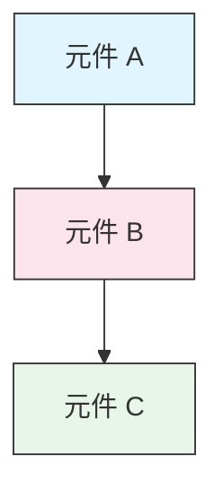

<picture>
  <source media="(prefers-color-scheme: dark)" srcset="resources/logos/claude-howto-logo-dark.svg">
  
</picture>

# 風格指南

> 貢獻 Claude How To 的慣例和格式規則。請遵循本指南以保持內容一致、專業且易於維護。

---

## 目錄

- [檔案和資料夾命名](#檔案和資料夾命名)
- [文件結構](#文件結構)
- [標題](#標題)
- [文字格式](#文字格式)
- [列表](#列表)
- [表格](#表格)
- [程式碼區塊](#程式碼區塊)
- [連結和交叉參考](#連結和交叉參考)
- [圖表](#圖表)
- [Emoji 使用](#emoji-使用)
- [YAML Frontmatter](#yaml-frontmatter)
- [圖片和媒體](#圖片和媒體)
- [語調和風格](#語調和風格)
- [提交訊息](#提交訊息)
- [作者檢查清單](#作者檢查清單)

---

## 檔案和資料夾命名

### 課程資料夾

課程資料夾使用**兩位數字前綴**後接 **kebab-case** 描述詞：

```
01-slash-commands/
02-memory/
03-skills/
04-subagents/
05-mcp/
```

數字反映從入門到進階的學習路徑順序。

### 檔案名稱

| 類型 | 慣例 | 範例 |
|------|------|------|
| **課程 README** | `README.md` | `01-slash-commands/README.md` |
| **功能檔案** | Kebab-case `.md` | `code-reviewer.md`、`generate-api-docs.md` |
| **Shell 腳本** | Kebab-case `.sh` | `format-code.sh`、`validate-input.sh` |
| **配置檔案** | 標準名稱 | `.mcp.json`、`settings.json` |
| **Memory 檔案** | 範圍前綴 | `project-CLAUDE.md`、`personal-CLAUDE.md` |
| **頂層文件** | UPPER_CASE `.md` | `CATALOG.md`、`QUICK_REFERENCE.md`、`CONTRIBUTING.md` |
| **圖片資產** | Kebab-case | `pr-slash-command.png`、`claude-howto-logo.svg` |

### 規則

- 所有檔案和資料夾名稱使用**小寫**（頂層文件如 `README.md`、`CATALOG.md` 除外）
- 使用**連字號**（`-`）作為單字分隔符，永不使用底線或空格
- 保持名稱描述性但簡潔

---

## 文件結構

### 根目錄 README

根目錄 `README.md` 遵循以下順序：

1. Logo（`<picture>` 元素，含深色/淺色模式變體）
2. H1 標題
3. 引言區塊引用（一行價值主張）
4.「為什麼選擇本指南？」區段及比較表
5. 水平分隔線（`---`）
6. 目錄
7. 功能目錄
8. 快速導覽
9. 學習路徑
10. 功能區段
11. 開始使用
12. 最佳實踐 / 疑難排解
13. 參與貢獻 / 授權條款

### 課程 README

每個課程的 `README.md` 遵循以下順序：

1. H1 標題（例如 `# Slash Commands`）
2. 簡要概述段落
3. 快速參考表（可選）
4. 架構圖表（Mermaid）
5. 詳細區段（H2）
6. 實際範例（編號，4-6 個範例）
7. 最佳實踐（建議/避免表格）
8. 疑難排解
9. 相關指南 / 官方文件
10. 文件元資料頁尾

### 功能/範例檔案

個別功能檔案（例如 `optimize.md`、`pr.md`）：

1. YAML frontmatter（如適用）
2. H1 標題
3. 目的 / 描述
4. 使用說明
5. 程式碼範例
6. 自訂提示

### 區段分隔符

使用水平分隔線（`---`）分隔文件的主要區域：

```markdown
---

## 新的主要區段
```

放在引言區塊引用之後，以及文件邏輯上不同部分之間。

---

## 標題

### 層級

| 層級 | 用途 | 範例 |
|------|------|------|
| `#` H1 | 頁面標題（每文件一個） | `# Slash Commands` |
| `##` H2 | 主要區段 | `## 最佳實踐` |
| `###` H3 | 子區段 | `### 新增 Skill` |
| `####` H4 | 子子區段（少見） | `#### 配置選項` |

### 規則

- **每文件一個 H1**——僅頁面標題
- **不跳過層級**——不要從 H2 跳到 H4
- **保持標題簡潔**——目標 2-5 個詞
- **使用句子大小寫**——僅大寫第一個詞和專有名詞（例外：功能名稱保持原樣）
- **只在根 README 的區段標題加 emoji 前綴**（見 [Emoji 使用](#emoji-使用)）

---

## 文字格式

### 強調

| 樣式 | 使用時機 | 範例 |
|------|---------|------|
| **粗體**（`**text**`） | 關鍵術語、表格中的標籤、重要概念 | `**安裝**：` |
| *斜體*（`*text*`） | 技術術語首次使用、書籍/文件標題 | `*frontmatter*` |
| `程式碼`（`` `text` ``） | 檔案名稱、指令、配置值、程式碼參考 | `` `CLAUDE.md` `` |

### 提示區塊引用

使用粗體前綴的區塊引用來標示重要注意事項：

```markdown
> **注意**：自 v2.0 起，自訂 slash commands 已合併至 skills。

> **重要**：永不提交 API 金鑰或認證資訊。

> **提示**：將 memory 與 skills 結合以獲得最大效果。
```

支援的提示類型：**注意**、**重要**、**提示**、**警告**。

### 段落

- 保持段落簡短（2-4 句）
- 段落之間加入空行
- 先說重點，再提供上下文
- 解釋「為什麼」而非僅「是什麼」

---

## 列表

### 無序列表

使用連字號（`-`），嵌套時使用 2 個空格縮排：

```markdown
- 第一項
- 第二項
  - 嵌套項目
  - 另一個嵌套項目
    - 深層嵌套（避免超過 3 層）
- 第三項
```

### 有序列表

使用編號列表來表示循序步驟、說明和排序項目：

```markdown
1. 第一步
2. 第二步
   - 子項細節
   - 另一個子項
3. 第三步
```

### 描述性列表

使用粗體標籤來表示鍵值風格的列表：

```markdown
- **效能瓶頸** - 識別 O(n^2) 操作、低效率的迴圈
- **記憶體洩漏** - 找出未釋放的資源、循環參考
- **演算法改善** - 建議更好的演算法或資料結構
```

### 規則

- 保持一致的縮排（每層 2 個空格）
- 列表前後加入空行
- 保持列表項目結構平行（全部以動詞開頭，或全部是名詞等）
- 避免嵌套超過 3 層

---

## 表格

### 標準格式

```markdown
| 欄位 1 | 欄位 2 | 欄位 3 |
|--------|--------|--------|
| 資料   | 資料   | 資料   |
```

### 常見表格模式

**功能比較（3-4 欄）：**

```markdown
| 功能 | 呼叫方式 | 持久性 | 最適合 |
|------|---------|--------|--------|
| **Slash Commands** | 手動（`/cmd`） | 僅限工作階段 | 快捷操作 |
| **Memory** | 自動載入 | 跨工作階段 | 長期記憶 |
```

**建議/避免：**

```markdown
| 建議 | 避免 |
|------|------|
| 使用描述性名稱 | 使用模糊的名稱 |
| 保持檔案聚焦 | 在單一檔案中放入過多內容 |
```

**快速參考：**

```markdown
| 項目 | 詳情 |
|------|------|
| **目的** | 產生 API 文件 |
| **範圍** | 專案層級 |
| **複雜度** | 中級 |
```

### 規則

- 當表頭是列標籤（第一欄）時**加粗**
- 對齊管道符號以提高原始碼可讀性（可選但建議）
- 保持儲存格內容簡潔；使用連結提供更多細節
- 在儲存格中對指令和檔案路徑使用 `程式碼格式`

---

## 程式碼區塊

### 語言標籤

務必指定語言標籤以啟用語法高亮：

| 語言 | 標籤 | 用途 |
|------|------|------|
| Shell | `bash` | CLI 指令、腳本 |
| Python | `python` | Python 程式碼 |
| JavaScript | `javascript` | JS 程式碼 |
| TypeScript | `typescript` | TS 程式碼 |
| JSON | `json` | 配置檔案 |
| YAML | `yaml` | Frontmatter、配置 |
| Markdown | `markdown` | Markdown 範例 |
| SQL | `sql` | 資料庫查詢 |
| 純文字 | （無標籤） | 預期輸出、目錄樹 |

### 慣例

```bash
# 解釋指令功能的註解
claude mcp add notion --transport http https://mcp.notion.com/mcp
```

- 在非顯而易見的指令前加入**註解行**
- 讓所有範例都**可直接複製貼上**
- 在相關時展示**簡單和進階版本**
- 在有助理解時包含**預期輸出**（使用無標籤的程式碼區塊）

### 安裝區塊

使用此模式進行安裝說明：

```bash
# 複製檔案到你的專案
cp 01-slash-commands/*.md .claude/commands/
```

### 多步驟工作流程

```bash
# 步驟 1：建立目錄
mkdir -p .claude/commands

# 步驟 2：複製範本
cp 01-slash-commands/*.md .claude/commands/

# 步驟 3：驗證安裝
ls .claude/commands/
```

---

## 連結和交叉參考

### 內部連結（相對路徑）

所有內部連結使用相對路徑：

```markdown
[Slash Commands](01-slash-commands/)
[Skills 指南](03-skills/)
[Memory 架構](02-memory/#memory-architecture)
```

從課程資料夾返回根目錄或兄弟資料夾：

```markdown
[返回主指南](../README.md)
[相關：Skills](../03-skills/)
```

### 外部連結（絕對路徑）

使用完整 URL 和描述性錨文字：

```markdown
[Anthropic 官方文件](https://code.claude.com/docs/en/overview)
```

- 永不使用「點此」或「此連結」作為錨文字
- 使用脫離上下文時仍有意義的描述性文字

### 區段錨點

使用 GitHub 風格的錨點連結到同一文件中的區段：

```markdown
[功能目錄](#-feature-catalog)
[最佳實踐](#best-practices)
```

### 相關指南模式

在課程結尾加入相關指南區段：

```markdown
## 相關指南

- [Slash Commands](../01-slash-commands/) - 快捷指令
- [Memory](../02-memory/) - 持久化上下文
- [Skills](../03-skills/) - 可重複使用的能力
```

---

## 圖表

### Mermaid

所有圖表使用 Mermaid。支援的類型：

- `graph TB` / `graph LR` — 架構、層級、流程
- `sequenceDiagram` — 互動流程
- `timeline` — 時間序列

### 風格慣例

使用 style 區塊套用一致的色彩：



**色彩調色盤：**

| 色彩 | 色碼 | 用途 |
|------|------|------|
| 淺藍 | `#e1f5fe` | 主要元件、輸入 |
| 淺粉 | `#fce4ec` | 處理、中介層 |
| 淺綠 | `#e8f5e9` | 輸出、結果 |
| 淺黃 | `#fff9c4` | 配置、可選 |
| 淺紫 | `#f3e5f5` | 使用者介面 |

### 規則

- 使用 `["標籤文字"]` 作為節點標籤（可使用特殊字元）
- 使用 `<br/>` 在標籤內換行
- 保持圖表簡單（最多 10-12 個節點）
- 在圖表下方加入簡短文字描述以提高無障礙性
- 層級結構使用由上至下（`TB`），工作流程使用由左至右（`LR`）

---

## Emoji 使用

### Emoji 使用場景

Emoji 的使用應**節制且有目的**——僅在特定上下文中使用：

| 上下文 | Emoji | 範例 |
|--------|-------|------|
| 根 README 區段標題 | 類別圖示 | `## 學習路徑` |
| 技能程度指示器 | 彩色圓圈 | 入門、中級、進階 |
| 建議/避免 | 打勾/打叉 | 建議這樣做、避免這樣做 |
| 複雜度評級 | 星星 | 三顆星 |

### 規則

- **不要在正文或段落中使用 emoji**
- **只在根 README 的標題中使用 emoji**（課程 README 中不使用）
- **不要加入裝飾性 emoji**——每個 emoji 都應傳達意義
- 保持 emoji 使用與上方表格一致

---

## YAML Frontmatter

### 功能檔案（Skills、Commands、Agents）

```yaml
---
name: unique-identifier
description: What this feature does and when to use it
allowed-tools: Bash, Read, Grep
---
```

### 可選欄位

```yaml
---
name: my-feature
description: Brief description
argument-hint: "[file-path] [options]"
allowed-tools: Bash, Read, Grep, Write, Edit
model: opus                        # opus、sonnet 或 haiku
disable-model-invocation: true     # 僅限使用者呼叫
user-invocable: false              # 從使用者選單中隱藏
context: fork                      # 在隔離的 subagent 中執行
agent: Explore                     # context: fork 時的 agent 類型
---
```

### 規則

- 將 frontmatter 放在檔案最上方
- `name` 欄位使用 **kebab-case**
- `description` 保持一句話
- 只包含需要的欄位

---

## 圖片和媒體

### Logo 模式

所有以 logo 開始的文件使用 `<picture>` 元素來支援深色/淺色模式：

```html
<picture>
  <source media="(prefers-color-scheme: dark)" srcset="resources/logos/claude-howto-logo-dark.svg">
  
</picture>
```

### 截圖

- 儲存在相關的課程資料夾中（例如 `01-slash-commands/pr-slash-command.png`）
- 使用 kebab-case 檔案名稱
- 包含描述性的 alt 文字
- 圖表優先使用 SVG，截圖使用 PNG

### 規則

- 務必為圖片提供 alt 文字
- 保持合理的圖片檔案大小（PNG 小於 500KB）
- 使用相對路徑參考圖片
- 將圖片儲存在參考它的文件同一目錄中，或共用圖片放在 `assets/` 中

---

## 語調和風格

### 撰寫風格

- **專業但平易近人**——技術準確但不過度使用術語
- **主動語態**——「建立一個檔案」而非「應該建立一個檔案」
- **直接指示**——「執行此指令」而非「你可能想要執行此指令」
- **對入門者友善**——假設讀者是 Claude Code 新手，但不是程式設計新手

### 內容原則

| 原則 | 範例 |
|------|------|
| **展示，不只是告訴** | 提供可運作的範例，而非抽象的描述 |
| **漸進複雜度** | 從簡單開始，在後面的區段增加深度 |
| **解釋「為什麼」** | 「使用 memory 來... 因為...」而非僅「使用 memory 來...」 |
| **可直接複製貼上** | 每個程式碼區塊都應該可以直接貼上使用 |
| **真實世界情境** | 使用實際場景，而非做作的範例 |

### 詞彙

- 使用「Claude Code」（不要用「Claude CLI」或「the tool」）
- 使用「skill」（不要用「custom command」——這是舊稱）
- 使用「lesson」或「guide」來稱呼編號區段
- 使用「example」來稱呼個別功能檔案

---

## 提交訊息

遵循 [Conventional Commits](https://www.conventionalcommits.org/)：

```
type(scope): description
```

### 類型

| 類型 | 用途 |
|------|------|
| `feat` | 新功能、範例或指南 |
| `fix` | 錯誤修正、更正、失效連結 |
| `docs` | 文件改善 |
| `refactor` | 重構（不改變行為） |
| `style` | 僅格式變更 |
| `test` | 測試新增或變更 |
| `chore` | 建置、依賴、CI |

### 範圍

使用課程名稱或檔案區域作為範圍：

```
feat(slash-commands): Add API documentation generator
docs(memory): Improve personal preferences example
fix(README): Correct table of contents link
docs(skills): Add comprehensive code review skill
```

---

## 文件元資料頁尾

課程 README 以元資料區塊結尾：

```markdown
---
**最後更新**：2026 年 3 月
**Claude Code 版本**：2.1+
**相容模型**：Claude Sonnet 4.6、Claude Opus 4.6、Claude Haiku 4.5
```

- 使用月份 + 年份格式（例如「2026 年 3 月」）
- 功能變更時更新版本
- 列出所有相容模型

---

## 作者檢查清單

提交內容前，請確認：

- [ ] 檔案/資料夾名稱使用 kebab-case
- [ ] 文件以 H1 標題開始（每檔一個）
- [ ] 標題層級正確（無跳過層級）
- [ ] 所有程式碼區塊都有語言標籤
- [ ] 程式碼範例可直接複製貼上
- [ ] 內部連結使用相對路徑
- [ ] 外部連結有描述性錨文字
- [ ] 表格格式正確
- [ ] Emoji 遵循標準集（如果有使用的話）
- [ ] Mermaid 圖表使用標準色彩調色盤
- [ ] 無敏感資訊（API 金鑰、認證資訊）
- [ ] YAML frontmatter 有效（如適用）
- [ ] 圖片有 alt 文字
- [ ] 段落簡短且聚焦
- [ ] 相關指南區段連結到相關課程
- [ ] 提交訊息遵循 conventional commits 格式
