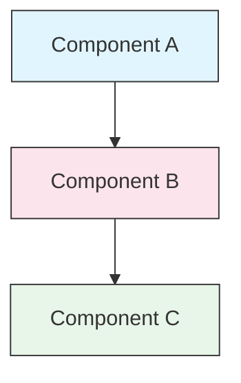

<picture>
  <source media="(prefers-color-scheme: dark)" srcset="resources/logos/claude-howto-logo-dark.svg">
  
</picture>

# Style Guide

> 為參與 Claude How To 的慣例與格式規則。請遵循此指南以保持內容的一致性、專業性且易於維護。

---

## 目錄

- [檔案與資料夾命名](#file-and-folder-naming)
- [文件結構](#document-structure)
- [標題](#headings)
- [文字格式](#text-formatting)
- [列表](#lists)
- [表格](#tables)
- [程式碼區塊](#code-blocks)
- [連結與交叉引用](#links-and-cross-references)
- [圖表](#diagrams)
- [Emoji 使用](#emoji-usage)
- [YAML Frontmatter](#yaml-frontmatter)
- [圖片與媒體](#images-and-media)
- [語氣與風格](#tone-and-voice)
- [Commit Messages](#commit-messages)
- [作者檢查清單](#checklist-for-authors)

---

## File and Folder Naming

### Lesson Folders

Lesson 資料夾使用 **兩位數數字前綴**，後接 **kebab-case** 描述語：

```
01-slash-commands/
02-memory/
03-skills/
04-subagents/
05-mcp/
```

數字反映了從初學者到進階學習的路徑順序。

### File Names

| 類型 | 慣例 | 範例 |
|------|-----------|----------|
| **Lesson README** | `README.md` | `01-slash-commands/README.md` |
| **Feature file** | Kebab-case `.md` | `code-reviewer.md`, `generate-api-docs.md` |
| **Shell script** | Kebab-case `.sh` | `format-code.sh`, `validate-input.sh` |
| **Config file** | 標準名稱 | `.mcp.json`, `settings.json` |
| **Memory file** | 範圍前綴 | `project-CLAUDE.md`, `personal-CLAUDE.md` |
| **Top-level docs** | UPPER_CASE `.md` | `CATALOG.md`, `QUICK_REFERENCE.md`, `CONTRIBUTING.md` |
| **Image assets** | Kebab-case | `pr-slash-command.png`, `claude-howto-logo.svg` |

### Rules

- 所有檔案與資料夾名稱請使用 **小寫**（頂層文件如 `README.md`、`CATALOG.md` 除外）
- 使用 **連字號** (`-`) 作為單字分隔符，絕不要使用底線或空格
- 保持名稱具備描述性但要簡潔

---

## 文件結構

### Root README

根目錄的 `README.md` 遵循以下順序：

1. Logo (`<picture>` 元素，包含深色/淺色變體)
2. H1 標題
3. 引言引用區塊 (單行價值主張)
4. 「為什麼需要這份指南？」章節，包含比較表格
5. 水平分隔線 (`---`)
6. 目錄
7. 功能目錄
8. 快速導覽
9. 學習路徑
10. 功能章節
11. 入門指南
12. 最佳實踐 / 除錯
13. 貢獻 / 授權

### Lesson README

每個課程的 `README.md` 遵循以下順序：

1. H1 標題 (例如：`# Slash Commands`)
2. 簡短概述段落
3. 快速參考表格 (選填)
4. 架構圖 (Mermaid)
5. 詳細章節 (H2)
6. 實際範例 (編號列表，4-6 個範例)
7. 最佳實踐 (Do's and Don'ts 表格)
8. 除錯
9. 相關指南 / 官方文件
10. 文件元數據頁尾

### Feature/Example File

個別功能檔案 (例如：`optimize.md`、`pr.md`)：

1. YAML frontmatter (若適用)
2. H1 標題
3. 目的 / 描述
4. 使用說明
5. 程式碼範例
6. 自定義技巧

### 章節分隔符

使用水平分隔線 (`---`) 來分隔文件中的主要區域：

```markdown
---

## New Major Section
```

將它們放置在引言引用區塊之後，以及文件邏輯不同的部分之間。

---

## 標題

### 層級結構

| 層級 | 用途 | 範例 |
|-------|-----|---------|
| `#` H1 | 頁面標題 (每個文件僅限一個) | `# Slash Commands` |
| `##` H2 | 主要章節 | `## Best Practices` |
| `###` H3 | 子章節 | `### Adding a Skill` |
| `####` H4 | 次子章節 (少見) | `#### Configuration Options` |

### 規則

- **每個文件僅限一個 H1** — 僅作為頁面標題
- **切勿跳級** — 不要從 H2 直接跳到 H4
- **保持標題簡潔** — 目標為 2-5 個單字
- **使用句首大寫 (Sentence case)** — 僅首個單字與專有名詞大寫 (例外：功能名稱保持原樣)
- **僅在 root README 的章節標題中使用 emoji 前綴** (參閱 [Emoji Usage](#emoji-usage))

---

## 文字格式化

### 強調

| 風格 | 使用時機 | 範例 |
|-------|------------|---------|
| **粗體** (`**text**`) | 關鍵術語、表格中的標籤、重要概念 | `**Installation**:` |
| *斜體* (`*text*`) | 技術術語的首次出現、書名/文件標題 | `*frontmatter*` |
| `程式碼` (`` `text` ``) | 檔案名稱、指令、設定值、程式碼引用 | `` `CLAUDE.md` `` |

### 用於提示的引用區塊

對於重要筆記，請使用帶有粗體前綴的引用區塊：

```markdown
> **Note**: Custom slash commands have been merged into skills since v2.0.

> **Important**: Never commit API keys or credentials.

> **Tip**: Combine memory with skills for maximum effectiveness.
```

支援的提示類型：**Note**、**Important**、**Tip**、**Warning**。

### 段落

- 保持段落簡短（2-4 個句子）
- 段落之間請加入一個空白行
- 以關鍵點開頭，接著提供上下文
- 解釋「為什麼」，而不僅僅是「是什麼」

---

## 列表

### 無序列表

使用破折號 (`-`) 並以 2 個空格進行縮排以實現嵌套：

```markdown
- First item
- Second item
  - Nested item
  - Another nested item
    - Deep nested (avoid going deeper than 3 levels)
- Third item
```

### 有序列表

對於循序步驟、指令和排名項目，請使用編號列表：

```markdown
1. First step
2. Second step
   - Sub-point detail
   - Another sub-point
3. Third step
```

### 描述性列表

對於鍵值風格的列表，請使用粗體標籤：

```markdown
- **Performance bottlenecks** - identify O(n^2) operations, inefficient loops
- **Memory leaks** - find unreleased resources, circular references
- **Algorithm improvements** - suggest better algorithms or data structures
```

### 規則

- 維持一致的縮排（每層 2 個空格）
- 在列表前後加入一個空白行
- 保持列表項目的結構平行（例如：全部以動詞開頭，或全部為名詞等）
- 避免嵌套超過 3 層

---

## Tables

### 標準格式

```markdown
| Column 1 | Column 2 | Column 3 |
|----------|----------|----------|
| Data     | Data     | Data     |
```

### 常見表格模式

**功能比較 (3-4 欄)：**

```markdown
| Feature | Invocation | Persistence | Best For |
|---------|-----------|------------|----------|
| **Slash Commands** | Manual (`/cmd`) | Session only | Quick shortcuts |
| **Memory** | Auto-loaded | Cross-session | Long-term learning |
```

**該做與不該做 (Do's and Don'ts)：**

```markdown
| Do | Don't |
|----|-------|
| Use descriptive names | Use vague names |
| Keep files focused | Overload a single file |
```

**快速參考：**

```markdown
| Aspect | Details |
|--------|---------|
| **Purpose** | Generate API documentation |
| **Scope** | Project-level |
| **Complexity** | Intermediate |
```

### 規則

- 當表格標題作為列標籤（第一欄）時，請使用**粗體**
- 對齊管道符號 (`|`) 以提高原始碼的可讀性（非強制但建議執行）
- 保持單元格內容簡潔；使用連結提供詳細資訊
- 在單元格內針對指令與檔案路徑使用 `code formatting`

---

## Code Blocks

### 語言標籤

務必指定語言標籤以進行語法高亮：

| Language | Tag | Use For |
|----------|-----|---------|
| Shell | `bash` | CLI commands, scripts |
| Python | `python` | Python code |
| JavaScript | `javascript` | JS code |
| TypeScript | `typescript` | TS code |
| JSON | `json` | Configuration files |
| YAML | `yaml` | Frontmatter, config |
| Markdown | `markdown` | Markdown examples |
| SQL | `sql` | Database queries |
| Plain text | (no tag) | Expected output, directory trees |

### 慣例

```bash
# Comment explaining what the command does
claude mcp add notion --transport http https://mcp.notion.com/mcp
```

- 在非直觀的指令前加上**註解行**
- 確保所有範例皆為**可直接複製貼上**的狀態
- 在相關情況下，同時展示**簡單與進階**版本
- 當有助於理解時，請包含**預期輸出**（使用未標記語言標籤的程式碼區塊）

### 安裝區塊

使用此模式撰寫安裝說明：

```bash
# Copy files to your project
cp 01-slash-commands/*.md .claude/commands/
```

### 多步驟工作流程

```bash
# Step 1: Create the directory
mkdir -p .claude/commands

# Step 2: Copy the templates
cp 01-slash-commands/*.md .claude/commands/

# Step 3: Verify installation
ls .claude/commands/
```

---

## 連結與交叉引用

### 內部連結（相對路徑）

所有內部連結請使用相對路徑：

```markdown
[Slash Commands](01-slash-commands/)
[Skills Guide](03-skills/)
[Memory Architecture](02-memory/#memory-architecture)
```

從課程資料夾回到根目錄或同層資料夾：

```markdown
[Back to main guide](../README.md)
[Related: Skills](../03-skills/)
```

### 外部連結（絕對路徑）

使用完整的 URL 並搭配具描述性的錨點文字：

```markdown
[Anthropic's official documentation](https://code.claude.com/docs/en/overview)
```

- 切勿使用「點擊這裡」或「此連結」作為錨點文字
- 使用在脫離上下文時仍具備意義的描述性文字

### 章節錨點

使用 GitHub 風格的錨點連結至同一文件內的章節：

```markdown
[Feature Catalog](#-feature-catalog)
[Best Practices](#best-practices)
```

### 相關指南模式

在課程結尾加上相關指南區塊：

```markdown
## Related Guides

- [Slash Commands](../01-slash-commands/) - 快速捷徑
- [Memory](../02-memory/) - 持久化上下文
- [Skills](../03-skills/) - 可重複使用的能力
```

---

## 圖表

### Mermaid

所有圖表請使用 Mermaid。支援的類型：

- `graph TB` / `graph LR` — 架構、層級、流程
- `sequenceDiagram` — 互動流程
- `timeline` — 時間軸序列

### 風格慣例

使用樣式區塊套用一致的顏色：


```mermaid
graph TB
    A["Component A"] --> B["Component B"]
    B --> C["Component C"]

    style A fill:#e1f5fe,stroke:#333,color:#333
    style B fill:#fce4ec,stroke:#333,color:#333
    style C fill:#e8f5e9,stroke:#333,color:#333
```

**配色方案：**

| 顏色 | Hex | 用途 |
|-------|-----|---------|
| Light blue | `#e1f5fe` | 主要組件、輸入 |
| Light pink | `#fce4ec` | 處理、中間層 |
| Light green | `#e8f5e9` | 輸出、結果 |
| Light yellow | `#fff9c4` | 配置、選填 |
| Light purple | `#f3e5f5` | 使用者介面、UI |

### 規則

- 節點標籤請使用 `["Label text"]`（可支援特殊字元）
- 標籤內的換行請使用 `<br/>`
- 保持圖表簡單（最多 10-12 個節點）
- 在圖表下方添加簡短的文字描述以符合無障礙需求
- 層級結構使用由上而下 (`TB`)，工作流程使用由左至右 (`LR`)

---

## Emoji 使用規範

### Emoji 使用場景

Emoji 的使用應保持**克制且具備目的性** — 僅用於特定情境：

| 情境 | Emoji | 範例 |
|---------|--------|---------|
| 根目錄 README 區塊標題 | 類別圖示 | `## 📚 Learning Path` |
| 技能等級指示 | 彩色圓圈 | 🟢 Beginner, 🔵 Intermediate, 🔴 Advanced |
| 建議與禁忌 | 打勾/打叉符號 | ✅ Do this, ❌ Don't do this |
| 複雜度評分 | 星星 | ⭐⭐⭐ |

### 標準 Emoji 集合

| Emoji | 意義 |
|-------|---------|
| 📚 | 學習、指南、文件 |
| ⚡ | 入門、快速參考 |
| 🎯 | 功能、快速參考 |
| 🎓 | 學習路徑 |
| 📊 | 統計、比較 |
| 🚀 | 安裝、快速指令 |
| 🟢 | 初階等級 |
| 🔵 | 中階等級 |
| 🔴 | 進階等級 |
| ✅ | 建議做法 |
| ❌ | 應避免 / 反模式 |
| ⭐ | 複雜度評分單位 |

### 規則

- **絕不在正文或段落中使用 emoji**
- **僅在根目錄 README 的標題中使用 emoji**（不要在課程 README 中使用）
- **不要添加裝飾性 emoji** — 每個 emoji 都應該傳達特定意義
- 保持 emoji 使用方式與上方表格一致

---

## YAML Frontmatter

### 功能檔案 (Skills, Commands, Agents)

```yaml
---
name: unique-identifier
description: What this feature does and when to use it
allowed-tools: Bash, Read, Grep
---
```

### 選填欄位

```yaml
---
name: my-feature
description: Brief description
argument-hint: "[file-path] [options]"
allowed-tools: Bash, Read, Grep, Write, Edit
model: opus                        # opus, sonnet, or haiku
disable-model-invocation: true     # User-only invocation
user-invocable: false              # Hidden from user menu
context: fork                      # Run in isolated subagent
agent: Explore                     # Agent type for context: fork
---
```

### 規則

- 將 frontmatter 置於檔案的最頂端
- `name` 欄位請使用 **kebab-case**
- `description` 請保持在一個句子內
- 僅包含必要的欄位

---

## 圖片與媒體

### Logo 模式

所有以 logo 開頭的文件都使用 `<picture>` 元素來支援深色/淺色模式：

```html
<picture>
  <source media="(prefers-color-scheme: dark)" srcset="resources/logos/claude-howto-logo-dark.svg">
  
</picture>
```

### 螢幕截圖

- 儲存在相關的課程資料夾中（例如：`01-slash-commands/pr-slash-command.png`）
- 使用 kebab-case 命名檔案
- 包含具描述性的 alt text
- 圖表優先使用 SVG，螢幕截圖使用 PNG

### 規則

- 務必為圖片提供 alt text
- 保持圖片檔案大小合理（PNG 檔案應小於 500KB）
- 使用相對路徑進行圖片引用
- 將圖片儲存在與引用該圖片的文件相同的目錄中，或將共用圖片儲存在 `assets/` 中

---

## 語氣與口吻

### 寫作風格

- **專業且平易近人** — 確保技術準確性，但不要過度使用術語
- **主動語態** — 使用「建立一個檔案」，而非「應該建立一個檔案」
- **直接的指令** — 使用「執行此命令」，而非「你可能想要執行此命令」
- **對初學者友善** — 假設讀者是剛接觸 Claude Code 的新手，而非程式設計新手

### 內容原則

| 原則 | 範例 |
|-----------|---------|
| **展示，而非說教** | 提供可運作的範例，而非抽象的描述 |
| **漸進式複雜度** | 從簡單開始，在後續章節中增加深度 |
| **解釋「為什麼」** | 「使用 memory 是為了...因為...」，而不僅僅是「使用 memory 來...」 |
| **可直接複製貼上** | 每個程式碼區塊在直接貼上時都應該可以正常運作 |
| **真實世界的上下文** | 使用實際場景，而非刻意編造的範例 |

### 詞彙

- 使用 "Claude Code"（而非 "Claude CLI" 或 "the tool"）
- 使用 "skill"（而非 "custom command" — 過時術語）
- 對於編號章節使用 "lesson" 或 "guide"
- 對於個別功能檔案使用 "example"

---

## Commit Messages

遵循 [Conventional Commits](https://www.conventionalcommits.org/) 規範：

```
type(scope): description
```

### Types

| Type | 用途 |
|------|---------|
| `feat` | 新功能、範例或指南 |
| `fix` | Bug 修復、更正、失效連結 |
| `docs` | 文件改進 |
| `refactor` | 重構（不改變行為的結構調整） |
| `style` | 僅格式變更 |
| `test` | 新增或修改測試 |
| `chore` | 建置、依賴、CI |

### Scopes

使用課程名稱或檔案區域作為 scope：

```
feat(slash-commands): Add API documentation generator
docs(memory): Improve personal preferences example
fix(README): Correct table of contents link
docs(skills): Add comprehensive code review skill
```

---

## Document Metadata Footer

課程 README 以一個 metadata 區塊作為結尾：

```markdown
---
**Last Updated**: March 2026
**Claude Code Version**: 2.1.97
**Compatible Models**: Claude Sonnet 4.6, Claude Opus 4.7, Claude Haiku 4.5
```

- 使用 月 + 年 的格式（例如：「March 2026」）
- 當功能變更時更新版本號
- 列出所有相容的模型

---

## Checklist for Authors

在提交內容之前，請確認：

- [ ] 檔案/資料夾名稱使用 kebab-case
- [ ] 文件以 H1 標題開頭（每個檔案僅一個）
- [ ] 標題層級正確（沒有跳級）
- [ ] 所有程式碼區塊都有語言標籤
- [ ] 程式碼範例可直接複製貼上使用
- [ ] 內部連結使用相對路徑
- [ ] 外部連結具有描述性的錨點文字
- [ ] 表格格式正確
- [ ] Emoji 符合標準集（若有使用）
- [ ] Mermaid 圖表使用標準配色方案
- [ ] 無敏感資訊（API keys、憑證）
- [ ] YAML frontmatter 有效（若適用）
- [ ] 圖片具有 alt text
- [ ] 段落簡短且重點明確
- [ ] 相關指南章節連結至相關課程
- [ ] Commit message 符合 conventional commits 格式

---

**Last Updated**: April 16, 2026
**Claude Code Version**: 2.1.112
**Sources**:
- https://docs.anthropic.com/en/docs/claude-code
- https://www.anthropic.com/news/claude-opus-4-7
- https://support.claude.com/en/articles/12138966-release-notes
**Compatible Models**: Claude Sonnet 4.6, Claude Opus 4.7, Claude Haiku 4.5
