<picture>
  <source media="(prefers-color-scheme: dark)" srcset="resources/logos/claude-howto-logo-dark.svg">
  
</picture>

# Claude 概念完整指南

以概念角度概述 Claude Code 各項功能如何運作與彼此搭配——包含架構圖、決策表，以及斜線命令、子代理、記憶、MCP、技能、外掛、Hooks 等功能之間的比較。

> **如何使用本指南**：本頁說明的是*概念*——每項功能是什麼、內部如何運作，以及何時該使用它。**可直接複製貼上的範本與完整參考資料都放在編號模組中**（`01-` 至 `10-`），每個章節都會連結到對應模組。先從這裡建立心智模型，再到模組中實際進行設定。

---

## 目錄

1. [斜線命令](#斜線命令) — [模組](01-slash-commands/)
2. [子代理](#子代理) — [模組](04-subagents/)
3. [記憶](#記憶) — [模組](02-memory/)
4. [MCP Protocol](#mcp-protocol) — [模組](05-mcp/)
5. [Agent 技能](#agent-技能) — [模組](03-skills/)
6. [外掛](#claude-code-外掛) — [模組](07-plugins/)
7. [比較與整合](#比較與整合)
8. [摘要表格](#摘要表格)
9. [快速入門指南](#快速入門指南)
10. [Hooks](#hooks) — [模組](06-hooks/)
11. [檢查點與回溯](#檢查點-checkpoints-與回溯-rewind) — [模組](08-checkpoints/)
12. [進階功能](#進階功能) — [模組](09-advanced-features/)
13. [模型與推理努力程度](#模型與推理努力程度) — [模組](10-cli/)
14. [資源](#資源)

---

## 斜線命令

### 概述

斜線命令是使用者觸發的捷徑，以 Markdown 檔案形式儲存，並可由 Claude Code 執行。它們能讓團隊將常用的提示詞與工作流程標準化。

### 架構

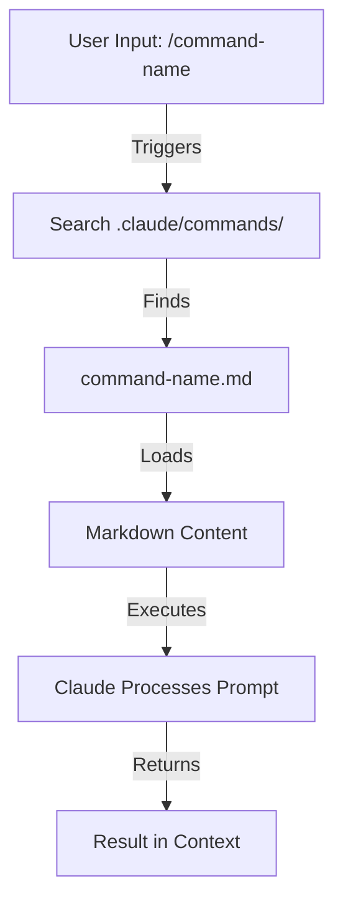
```mermaid
graph TD
    A["User Input: /command-name"] -->|Triggers| B["Search .claude/commands/"]
    B -->|Finds| C["command-name.md"]
    C -->|Loads| D["Markdown Content"]
    D -->|Executes| E["Claude Processes Prompt"]
    E -->|Returns| F["Result in Context"]
```

### 檔案結構

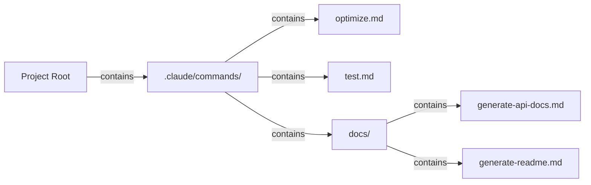
```mermaid
graph LR
    A["Project Root"] -->|contains| B[".claude/commands/"]
    B -->|contains| C["optimize.md"]
    B -->|contains| D["test.md"]
    B -->|contains| E["docs/"]
    E -->|contains| F["generate-api-docs.md"]
    E -->|contains| G["generate-readme.md"]
```

### 命令組織表格

| 位置 | 範圍 | 可用性 | 使用案例 | Git 追蹤 |
|----------|-------|--------------|----------|-------------|
| `.claude/commands/` | 專案特定 | 團隊成員 | 團隊工作流程、共享標準 | ✅ 是 |
| `~/.claude/commands/` | 個人 | 個人使用者 | 跨專案的個人捷徑 | ❌ 否 |
| 子目錄 | 命名空間 | 依據父目錄 | 按類別進行組織 | ✅ 是 |

### 功能與能力

| 功能 | 範例 | 支援 |
|---------|---------|-----------|
| Shell 腳本執行 | `bash scripts/deploy.sh` | ✅ 是 |
| 檔案引用 | `@path/to/file.js` | ✅ 是 |
| Bash 整合 | `$(git log --oneline)` | ✅ 是 |
| 參數 | `/pr --verbose` | ✅ 是 |
| MCP 命令 | `/mcp__github__list_prs` | ✅ 是 |

### 實際範例

八個可直接複製貼上的命令範本放在 **[01-slash-commands/](01-slash-commands/)**——`/optimize`、`/pr`、`/commit`、`/push-all`、`/generate-api-docs`、`/doc-refactor`、`/setup-ci-cd` 與 `/unit-test-expand`。

**[01-slash-commands/README.md](01-slash-commands/README.md)** 也收錄了完整的內建命令參考（60 個以上的命令）以及 frontmatter 欄位表。

### 命令生命週期圖

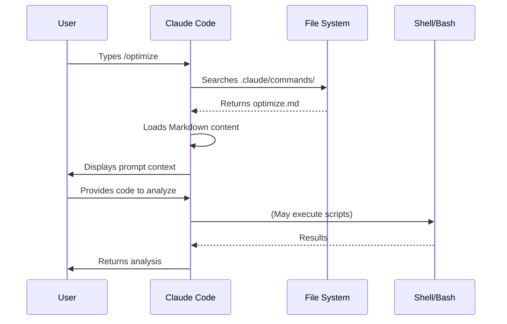
```mermaid
sequenceDiagram
    participant User
    participant Claude as Claude Code
    participant FS as File System
    participant CLI as Shell/Bash

    User->>Claude: Types /optimize
    Claude->>FS: Searches .claude/commands/
    FS-->>Claude: Returns optimize.md
    Claude->>Claude: Loads Markdown content
    Claude->>User: Displays prompt context
    User->>Claude: Provides code to analyze
    Claude->>CLI: (May execute scripts)
    CLI-->>Claude: Results
    Claude->>User: Returns analysis
```

### 最佳實務

| ✅ 應該 | ❌ 不該 |
|------|---------|
| 使用清晰且具行動導向的名稱 | 為一次性任務建立命令 |
| 在 description 中記錄觸發詞 | 在命令中構建複雜邏輯 |
| 保持命令專注於單一任務 | 建立冗餘的命令 |
| 將專案命令納入版本控制 | 將敏感資訊寫死 (Hardcode) |
| 整理在子目錄中 | 建立冗長的命令列表 |
| 使用簡單、易讀的提示詞 | 使用縮寫或晦澀的措辭 |

---

## 子代理

### 概述

子代理是具有隔離上下文視窗與自訂系統提示詞的專業化 AI 助手。它們能夠在維持清晰的關注點分離（separation of concerns）之餘，實現任務委派執行。

子代理可以再產生自己的子代理，**預設開啟巢狀、最多 3 層（v2.1.219）**——因此層級結構並不限於下圖所示的單一「主代理 → 子代理」層。設定 `CLAUDE_CODE_MAX_SUBAGENT_SPAWN_DEPTH` 可變更上限，設為 `1` 則關閉巢狀。（歷程：v2.1.172–v2.1.216 預設開啟巢狀、最多 5 層且無法變更；v2.1.217 改為需選擇啟用、深度 1；v2.1.219 將預設值設為 3。）

### 架構圖

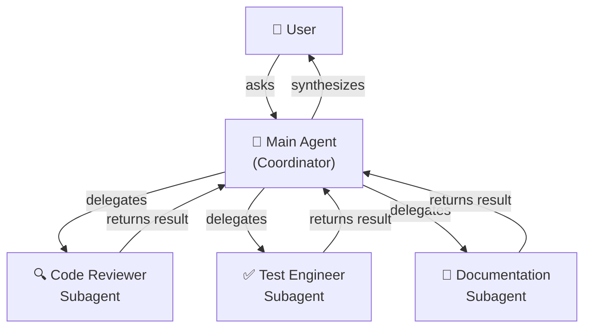
```mermaid
graph TB
    User["👤 User"]
    Main["🎯 Main Agent<br/>(Coordinator)"]
    Reviewer["🔍 Code Reviewer<br/>Subagent"]
    Tester["✅ Test Engineer<br/>Subagent"]
    Docs["📝 Documentation<br/>Subagent"]

    User -->|asks| Main
    Main -->|delegates| Reviewer
    Main -->|delegates| Tester
    Main -->|delegates| Docs
    Reviewer -->|returns result| Main
    Tester -->|returns result| Main
    Docs -->|returns result| Main
    Main -->|synthesizes| User
```

### 子代理生命週期

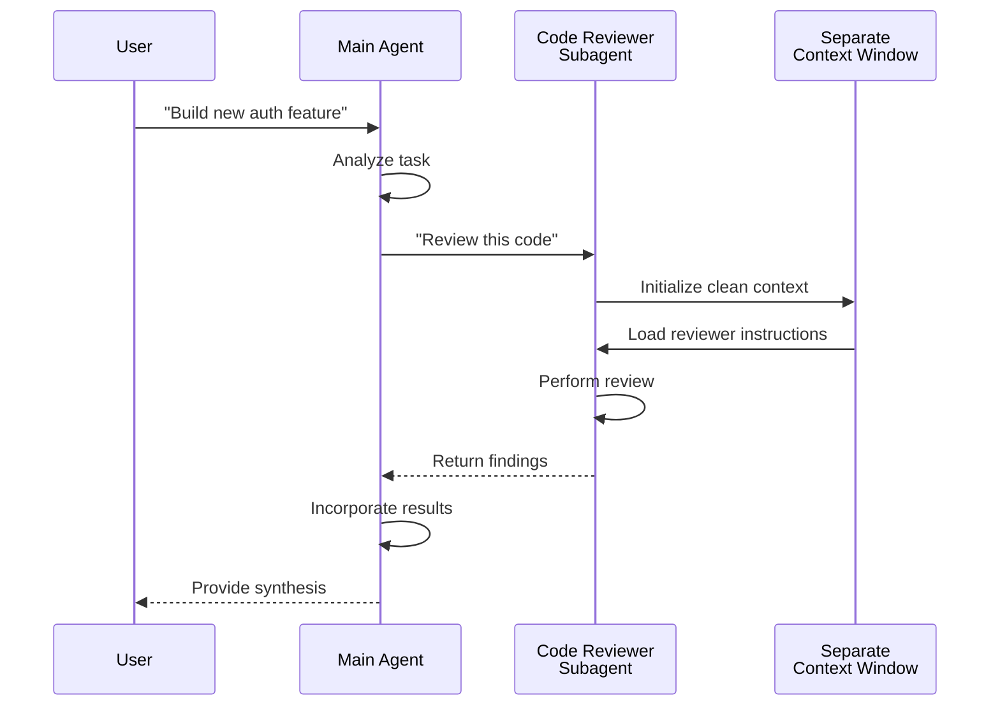
```mermaid
sequenceDiagram
    participant User
    participant MainAgent as Main Agent
    participant CodeReviewer as Code Reviewer<br/>Subagent
    participant Context as Separate<br/>Context Window

    User->>MainAgent: "Build new auth feature"
    MainAgent->>MainAgent: Analyze task
    MainAgent->>CodeReviewer: "Review this code"
    CodeReviewer->>Context: Initialize clean context
    Context->>CodeReviewer: Load reviewer instructions
    CodeReviewer->>CodeReviewer: Perform review
    CodeReviewer-->>MainAgent: Return findings
    MainAgent->>MainAgent: Incorporate results
    MainAgent-->>User: Provide synthesis
```

### 子代理設定表

| 設定 | 類型 | 用途 | 範例 |
|---------------|------|---------|---------|
| `name` | String | 代理識別碼 | `code-reviewer` |
| `description` | String | 用途與觸發詞 | `Comprehensive code quality analysis` |
| `tools` | List/String | 允許的能力 | `read, grep, diff, lint_runner` |
| `system_prompt` | Markdown | 行為指令 | 自訂指南 |

### 工具存取層級

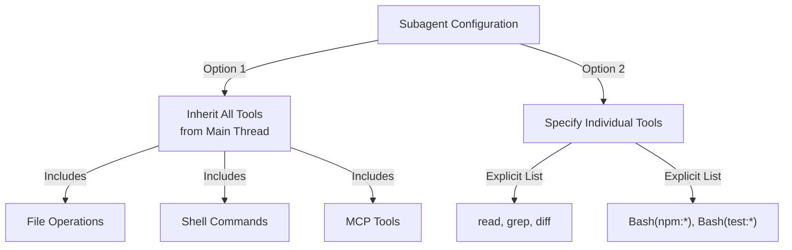
```mermaid
graph TD
    A["Subagent Configuration"] -->|Option 1| B["Inherit All Tools<br/>from Main Thread"]
    A -->|Option 2| C["Specify Individual Tools"]
    B -->|Includes| B1["File Operations"]
    B -->|Includes| B2["Shell Commands"]
    B -->|Includes| B3["MCP Tools"]
    C -->|Explicit List| C1["read, grep, diff"]
    C -->|Explicit List| C2["Bash(npm:*), Bash(test:*)"]
```

### 實際範例

九個可直接使用的子代理定義放在 **[04-subagents/](04-subagents/)**——`code-reviewer`、`clean-code-reviewer`、`secure-reviewer`、`test-engineer`、`documentation-writer`、`implementation-agent`、`performance-optimizer`、`debugger` 與 `data-scientist`。

**[04-subagents/README.md](04-subagents/README.md)** 記載了完整的 frontmatter 參考、工具存取規則、巢狀限制以及 Agent Teams。

### 子代理上下文管理

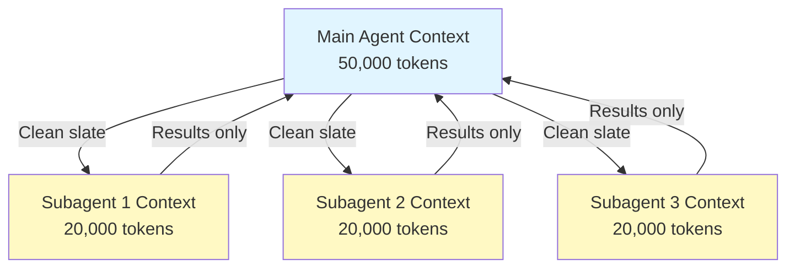
```mermaid
graph TB
    A["Main Agent Context<br/>50,000 tokens"]
    B["Subagent 1 Context<br/>20,000 tokens"]
    C["Subagent 2 Context<br/>20,000 tokens"]
    D["Subagent 3 Context<br/>20,000 tokens"]

    A -->|Clean slate| B
    A -->|Clean slate| C
    A -->|Clean slate| D

    B -->|Results only| A
    C -->|Results only| A
    D -->|Results only| A

    style A fill:#e1f5ff
    style B fill:#fff9c4
    style C fill:#fff9c4
    style D fill:#fff9c4
```

### 何時使用 Subagents

| 場景 | 使用 Subagent | 原因 |
|----------|--------------|-----|
| 包含多個步驟的複雜功能 | ✅ 是 | 分離關注點，防止上下文污染 |
| 快速程式碼審查 | ❌ 否 | 不需要額外的開銷 |
| 並行任務執行 | ✅ 是 | 每個 subagent 擁有各自的上下文 |
| 需要專業知識時 | ✅ 是 | 使用自訂系統提示詞 |
| 長時間執行的分析 | ✅ 是 | 防止主上下文耗盡 |
| 單一任務 | ❌ 否 | 不必要地增加延遲 |

### Agent Teams

Agent Teams 協調多個處理相關任務的代理。與其一次只委派給一個 subagent，Agent Teams 允許主代理編排一群代理，讓它們進行協作、共享中間結果，並朝著共同目標努力。這對於大規模任務非常有用，例如全端功能開發，其中前端代理、後端代理與測試代理可以並行工作。

---

## 記憶

### 概觀

記憶功能讓 Claude 能夠在不同的工作階段與對話之間保留上下文。它以兩種形式存在：claude.ai 中的自動合成，以及 Claude Code 中基於檔案系統的 CLAUDE.md。

### 記憶架構

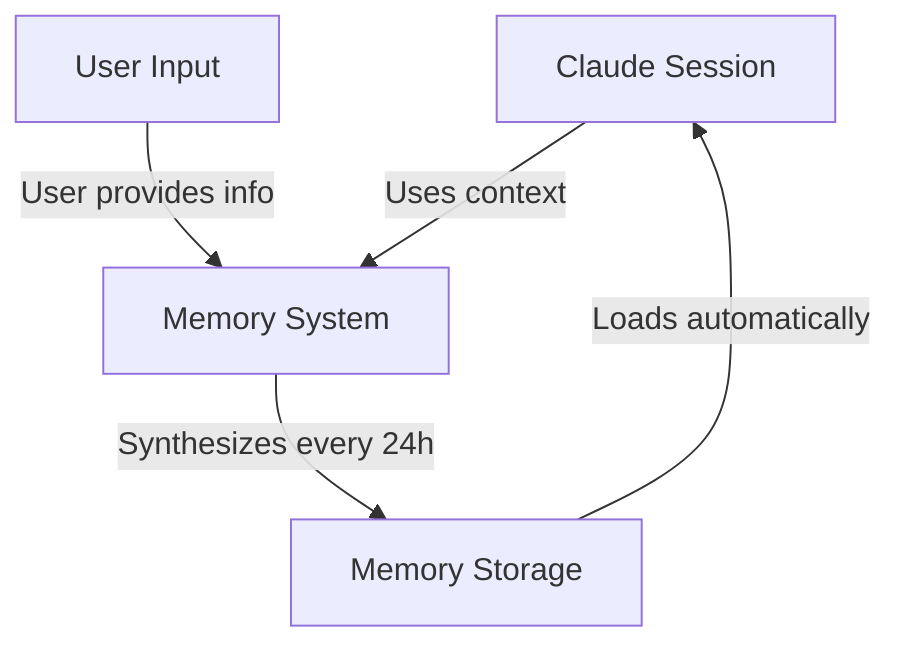
```mermaid
graph TB
    A["Claude Session"]
    B["User Input"]
    C["Memory System"]
    D["Memory Storage"]

    B -->|User provides info| C
    C -->|Synthesizes every 24h| D
    D -->|Loads automatically| A
    A -->|Uses context| C
```

### Claude Code 中的記憶層級 (7 個層級)

Claude Code 從 7 個層級載入記憶，按優先順序從高到低排列：

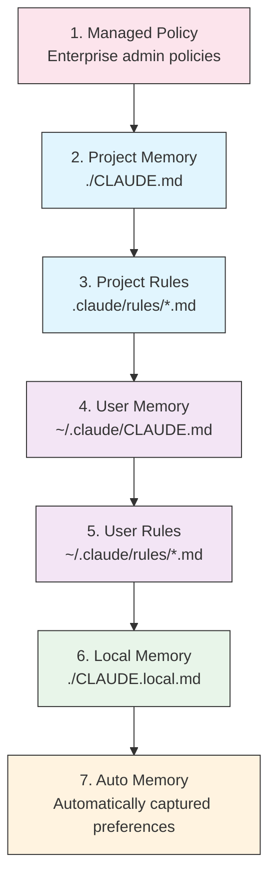
```mermaid
graph TD
    A["1. Managed Policy<br/>Enterprise admin policies"] --> B["2. Project Memory<br/>./CLAUDE.md"]
    B --> C["3. Project Rules<br/>.claude/rules/*.md"]
    C --> D["4. User Memory<br/>~/.claude/CLAUDE.md"]
    D --> E["5. User Rules<br/>~/.claude/rules/*.md"]
    E --> F["6. Local Memory<br/>./CLAUDE.local.md"]
    F --> G["7. Auto Memory<br/>Automatically captured preferences"]

    style A fill:#fce4ec,stroke:#333,color:#333
    style B fill:#e1f5fe,stroke:#333,color:#333
    style C fill:#e1f5fe,stroke:#333,color:#333
    style D fill:#f3e5f5,stroke:#333,color:#333
    style E fill:#f3e5f5,stroke:#333,color:#333
    style F fill:#e8f5e9,stroke:#333,color:#333
    style G fill:#fff3e0,stroke:#333,color:#333
```

### 記憶位置對照表

| 層級 | 位置 | 範圍 | 優先順序 | 共享 | 最適合用於 |
|------|----------|-------|----------|--------|----------|
| 1. Managed Policy | Enterprise admin | Organization | 最高 | 所有組織使用者 | 合規性、安全政策 |
| 2. Project | `./CLAUDE.md` | Project | 高 | 團隊 (Git) | 團隊標準、架構 |
| 3. Project Rules | `.claude/rules/*.md` | Project | 高 | 團隊 (Git) | 模組化專案慣例 |
| 4. User | `~/.claude/CLAUDE.md` | Personal | 中 | 個人 | 個人偏好 |
| 5. User Rules | `~/.claude/rules/*.md` | Personal | 中 | 個人 | 個人規則模組 |
| 6. Local | `./CLAUDE.local.md` | Local | 低 | 不共享 | 特定機器設定 |
| 7. Auto Memory | Automatic | Session | 最低 | 個人 | 學習到的偏好、模式 |

### 自動記憶 (Auto Memory)

自動記憶會自動擷取在工作階段期間觀察到的使用者偏好與模式。Claude 會從您的互動中學習並記住：

- 程式碼風格偏好
- 您常做的修正
- 框架與工具選擇
- 溝通風格偏好

自動記憶在背景運作，不需要手動設定。

### 記憶更新生命週期

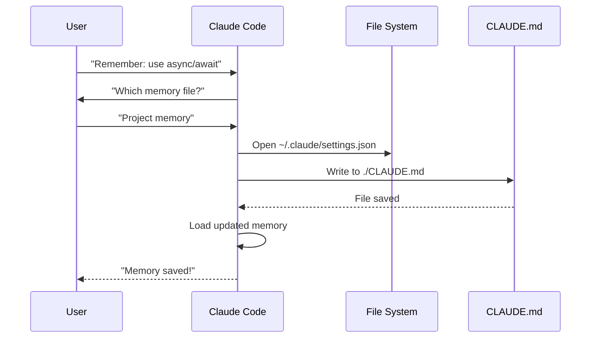
```mermaid
sequenceDiagram
    participant User
    participant Claude as Claude Code
    participant Editor as File System
    participant Memory as CLAUDE.md

    User->>Claude: "Remember: use async/await"
    Claude->>User: "Which memory file?"
    User->>Claude: "Project memory"
    Claude->>Editor: Open ~/.claude/settings.json
    Claude->>Memory: Write to ./CLAUDE.md
    Memory-->>Claude: File saved
    Claude->>Claude: Load updated memory
    Claude-->>User: "Memory saved!"
```

### 實際範例

可直接複製貼上的記憶範本放在 **[02-memory/](02-memory/)**：

- **`project-CLAUDE.md`** — 用於 `./CLAUDE.md` 的全團隊專案標準
- **`personal-CLAUDE.md`** — 用於 `~/.claude/CLAUDE.md` 的個人偏好
- **`directory-api-CLAUDE.md`** — 針對子目錄樹的目錄範圍標準

**[02-memory/README.md](02-memory/README.md)** 涵蓋完整的層級結構、匯入語法、`.claude/rules/`、自動記憶，以及如何讓 CLAUDE.md 維持在 200 行以內。

### Claude Web/Desktop 中的記憶

#### 記憶綜合時間軸


```mermaid
graph LR
    A["第 1 天：使用者<br/>對話"] -->|24 小時| B["第 2 天：記憶<br/>綜合"]
    B -->|自動| C["記憶已更新<br/>已摘要"]
    C -->|載入於| D["第 2 天-N 天：<br/>新對話"]
    D -->|新增至| E["記憶"]
    E -->|24 小時後| F["記憶已更新"]
```

### 自動記憶內容

自動記憶會將 Claude 跨工作階段學到的關於您的資訊儲存在 `~/.claude/projects/<project>/memory/`，並以 `MEMORY.md` 作為索引。檔案結構、載入限制以及如何啟用或停用，請參閱 **[02-memory/README.md](02-memory/README.md)**。

### 記憶功能比較

| 功能 | Claude Web/Desktop | Claude Code (CLAUDE.md) |
|---------|-------------------|------------------------|
| 自動綜合 | ✅ 每 24 小時 | ❌ 手動 |
| 跨專案 | ✅ 共享 | ❌ 專案特定 |
| 團隊存取 | ✅ 共享專案 | ✅ Git 追蹤 |
| 可搜尋性 | ✅ 內建 | ✅ 透過 `/memory` |
| 可編輯性 | ✅ 在對話中 | ✅ 直接編輯檔案 |
| 匯入/匯出 | ✅ 是 | ✅ 複製/貼上 |
| 持久性 | ✅ 24 小時以上 | ✅ 無限期 |

---

## MCP Protocol

### 概述

MCP (Model Context Protocol) 是 Claude 用於存取外部工具、API 與即時資料來源的標準化方式。與「記憶」不同，MCP 提供對變動資料的即時存取。

### MCP 架構

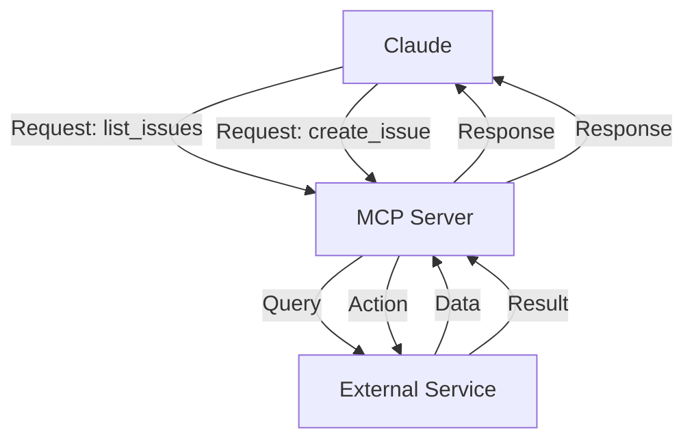
```mermaid
graph TB
    A["Claude"]
    B["MCP Server"]
    C["External Service"]

    A -->|Request: list_issues| B
    B -->|Query| C
    C -->|Data| B
    B -->|Response| A

    A -->|Request: create_issue| B
    B -->|Action| C
    C -->|Result| B
    B -->|Response| A
```

### MCP 生態系統

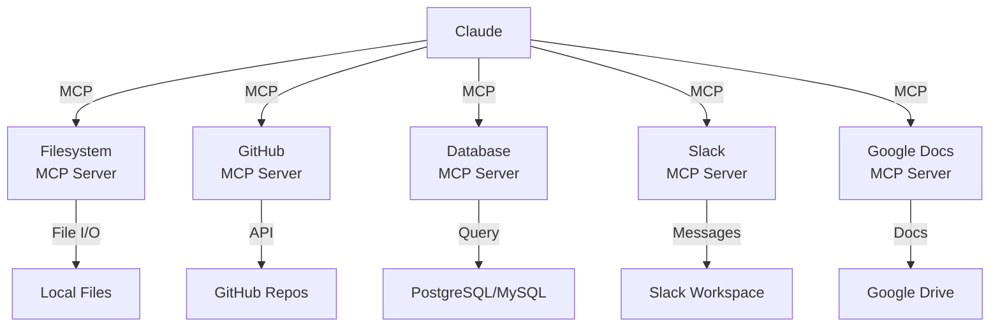
```mermaid
graph TB
    A["Claude"] -->|MCP| B["Filesystem<br/>MCP Server"]
    A -->|MCP| C["GitHub<br/>MCP Server"]
    A -->|MCP| D["Database<br/>MCP Server"]
    A -->|MCP| E["Slack<br/>MCP Server"]
    A -->|MCP| F["Google Docs<br/>MCP Server"]

    B -->|File I/O| G["Local Files"]
    C -->|API| H["GitHub Repos"]
    D -->|Query| I["PostgreSQL/MySQL"]
    E -->|Messages| J["Slack Workspace"]
    F -->|Docs| K["Google Drive"]
```

### MCP 設定流程

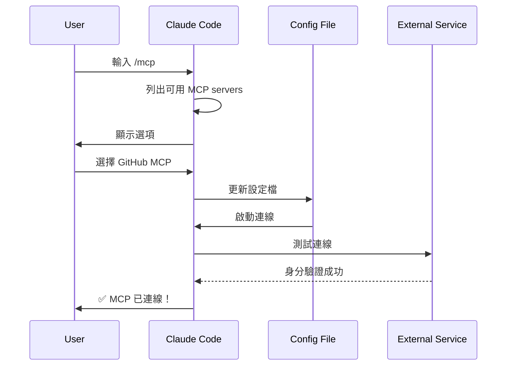
```mermaid
sequenceDiagram
    participant User
    participant Claude as Claude Code
    participant Config as Config File
    participant Service as External Service

    User->>Claude: 輸入 /mcp
    Claude->>Claude: 列出可用 MCP servers
    Claude->>User: 顯示選項
    User->>Claude: 選擇 GitHub MCP
    Claude->>Config: 更新設定檔
    Config->>Claude: 啟動連線
    Claude->>Service: 測試連線
    Service-->>Claude: 身分驗證成功
    Claude->>User: ✅ MCP 已連線！
```

### 可用 MCP Servers 表格

| MCP Server | 用途 | 常用工具 | 驗證方式 | 即時性 |
|------------|---------|--------------|------|-----------|
| **Filesystem** | 檔案操作 | read, write, delete | 作業系統權限 | ✅ 是 |
| **GitHub** | 儲存庫管理 | list_prs, create_issue, push | OAuth | ✅ 是 |
| **Slack** | 團隊溝通 | send_message, list_channels | Token | ✅ 是 |
| **Database** | SQL 查詢 | query, insert, update | Credentials | ✅ 是 |
| **Google Docs** | 文件存取 | read, write, share | OAuth | ✅ 是 |
| **Asana** | 專案管理 | create_task, update_status | API Key | ✅ 是 |
| **Stripe** | 付款資料 | list_charges, create_invoice | API Key | ✅ 是 |
| **Memory** | 持久化記憶 | store, retrieve, delete | Local | ❌ 否 |

### 實際範例

可直接使用的 MCP 伺服器設定放在 **[05-mcp/](05-mcp/)**：`github-mcp.json`、`database-mcp.json`、`filesystem-mcp.json` 與 `multi-mcp.json`（一個檔案中包含四個伺服器）。

**[05-mcp/README.md](05-mcp/README.md)** 涵蓋完整的 `claude mcp add` 語法、傳輸方式、範圍、OAuth 以及企業允許清單。

### MCP 與記憶：決策矩陣

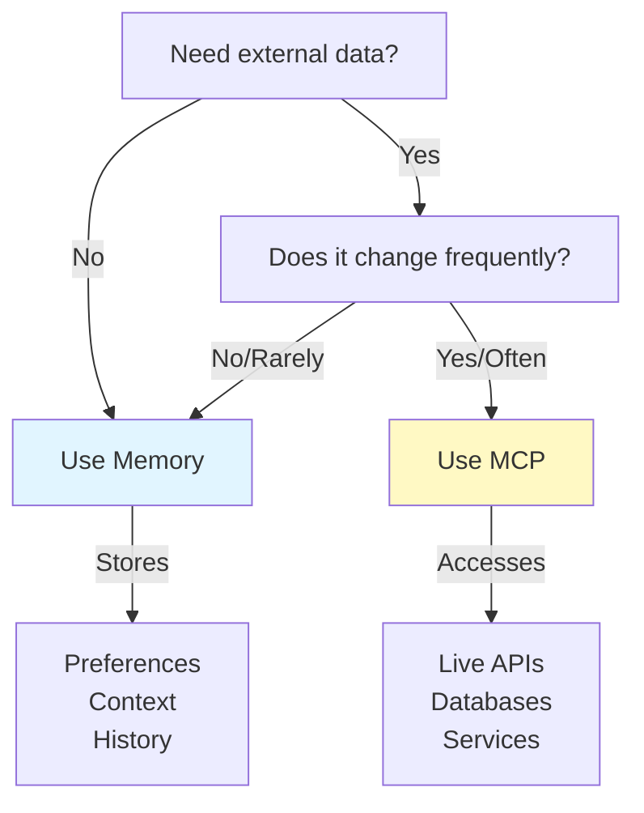
```mermaid
graph TD
    A["Need external data?"]
    A -->|No| B["Use Memory"]
    A -->|Yes| C["Does it change frequently?"]
    C -->|No/Rarely| B
    C -->|Yes/Often| D["Use MCP"]

    B -->|Stores| E["Preferences<br/>Context<br/>History"]
    D -->|Accesses| F["Live APIs<br/>Databases<br/>Services"]

    style B fill:#e1f5ff
    style D fill:#fff9c4
```

### 請求/回應模式

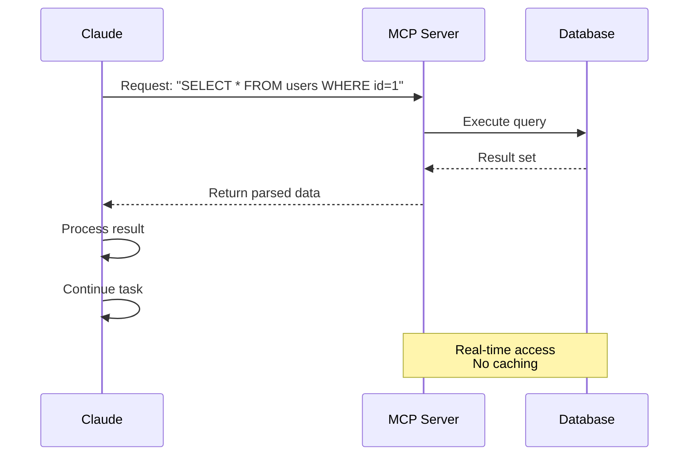
```mermaid
sequenceDiagram
    participant App as Claude
    participant MCP as MCP Server
    participant DB as Database

    App->>MCP: Request: "SELECT * FROM users WHERE id=1"
    MCP->>DB: Execute query
    DB-->>MCP: Result set
    MCP-->>App: Return parsed data
    App->>App: Process result
    App->>App: Continue task

    Note over MCP,DB: Real-time access<br/>No caching
```

---

## Agent 技能

### 概述

Agent 技能是可重複使用的、由模型觸發的能力，封裝為包含指令、腳本與資源的資料夾。Claude 會自動偵測並使用相關的技能。

### 技能架構

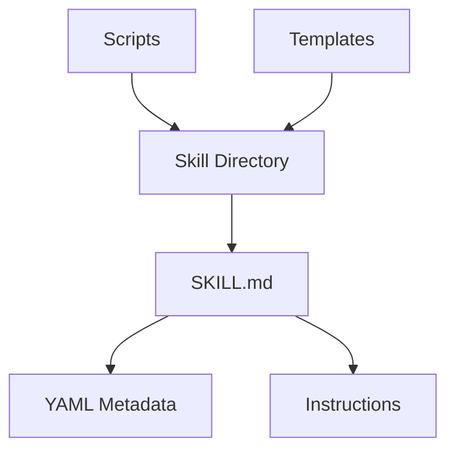
```mermaid
graph TB
    A["Skill Directory"]
    B["SKILL.md"]
    C["YAML Metadata"]
    D["Instructions"]
    E["Scripts"]
    F["Templates"]

    A --> B
    B --> C
    B --> D
    E --> A
    F --> A
```

### 技能載入流程

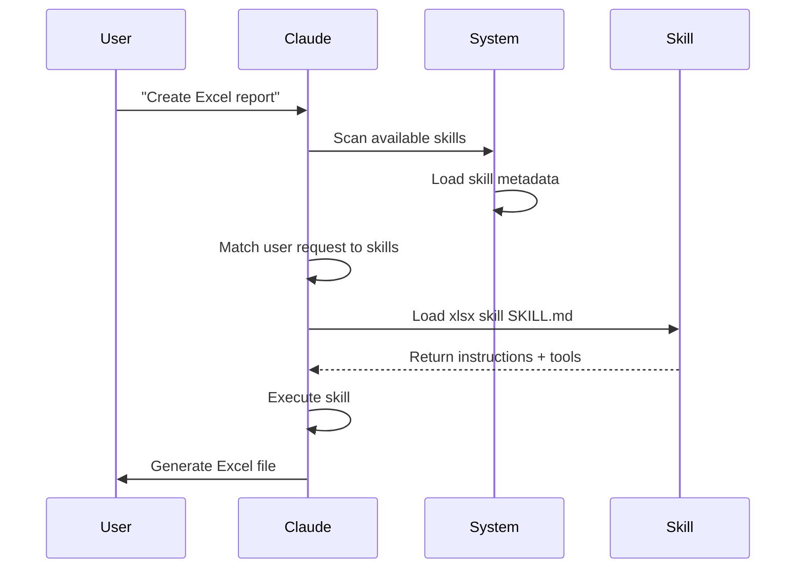
```mermaid
sequenceDiagram
    participant User
    participant Claude as Claude
    participant System as System
    participant Skill as Skill

    User->>Claude: "Create Excel report"
    Claude->>System: Scan available skills
    System->>System: Load skill metadata
    Claude->>Claude: Match user request to skills
    Claude->>Skill: Load xlsx skill SKILL.md
    Skill-->>Claude: Return instructions + tools
    Claude->>Claude: Execute skill
    Claude->>User: Generate Excel file
```

### 技能類型與位置對照表

| 類型 | 位置 | 範圍 | 共享 | 同步 | 最適合用於 |
|------|----------|-------|--------|------|----------|
| 內建 | 內建 | 全域 | 所有使用者 | 自動 | 文件建立 |
| 個人 | `~/.claude/skills/` | 個人 | 否 | 手動 | 個人自動化 |
| 專案 | `.claude/skills/` | 團隊 | 是 | Git | 團隊標準 |
| 外掛 | 透過安裝外掛 | 視情況而定 | 視情況而定 | 自動 | 整合功能 |

### 內建技能 (Pre-built Skills)

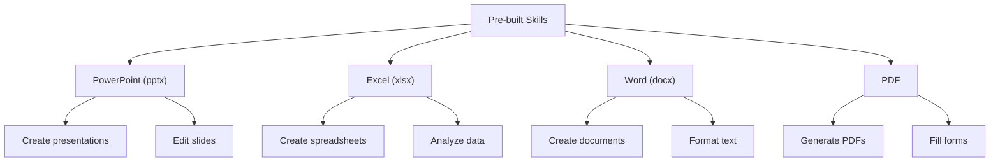
```mermaid
graph TB
    A["Pre-built Skills"]
    B["PowerPoint (pptx)"]
    C["Excel (xlsx)"]
    D["Word (docx)"]
    E["PDF"]

    A --> B
    A --> C
    A --> D
    A --> E

    B --> B1["Create presentations"]
    B --> B2["Edit slides"]
    C --> C1["Create spreadsheets"]
    C --> C2["Analyze data"]
    D --> D1["Create documents"]
    D --> D2["Format text"]
    E --> E1["Generate PDFs"]
    E --> E2["Fill forms"]
```

### 內建組合技能 (Bundled Skills)

Claude Code 現在內建了 10 個開箱即用的組合技能：

| Skill | Command | Purpose |
|-------|---------|---------|
| **Batch** | `/batch` | 在多個檔案或項目中執行操作 |
| **Claude API** | `/claude-api` | 直接與 Anthropic API 進行互動 |
| **Code Review** | `/code-review` | 在選定的努力程度下審查目前 diff 的正確性問題。與 `/simplify`（品質/重用清理）是不同的技能，後者於 v2.1.154 重新拆分出來。自 v2.1.215 起僅能明確呼叫 |
| **Simplify** | `/simplify` | 品質、重用與清理審查——自 v2.1.154 起再次與 `/code-review` 分開 |
| **Debug** | `/debug` | 系統化地進行問題除錯與根本原因分析 |
| **Fewer Permission Prompts** | `/fewer-permission-prompts` | 掃描對話紀錄，並為常用的唯讀工具提出依優先順序排列的允許清單 |
| **Loop** | `/loop` | 設定定時循環任務 |
| **Run** | `/run` | 啟動並操作專案的應用程式以驗證變更（v2.1.145+） |
| **Run Skill Generator** | `/run-skill-generator` | 依描述建立新技能的骨架（v2.1.145+） |
| **Verify** | `/verify` | 驗證變更是否真的有效（v2.1.145+）。自 v2.1.215 起僅能明確呼叫 |

這些組合技能隨時可用，無需安裝或設定。

### 實際範例

六個完整的技能——連同其腳本、範本與參考檔案——放在 **[03-skills/](03-skills/)**：

- **`code-review-specialist/`** — 審查檢查清單、發現事項範本，以及兩個 Python 指標腳本
- **`refactor/`** — 程式碼異味目錄、重構目錄、計畫範本，以及兩個分析腳本
- **`doc-generator/`** — 從原始碼產生 API 文件
- **`blog-draft/`** — 大綱與草稿範本，採用具版本編號的輸出慣例
- **`brand-voice/`** — 語氣規則與訊息範本（示範 `user-invocable: false`）
- **`claude-md/`** — 建立、更新與稽核 CLAUDE.md 檔案

完整的 frontmatter 參考與漸進式揭露（progressive disclosure）模型，請參閱 **[03-skills/README.md](03-skills/README.md)**。

### 技能發現與呼叫

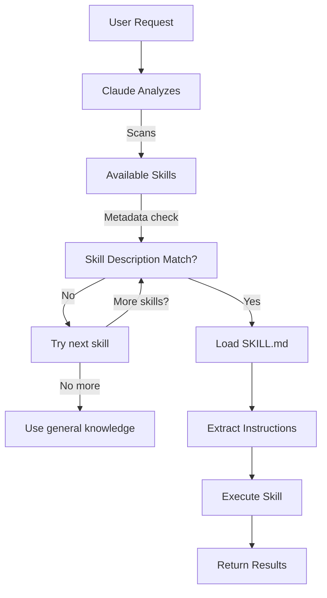
```mermaid
graph TD
    A["User Request"] --> B["Claude Analyzes"]
    B -->|Scans| C["Available Skills"]
    C -->|Metadata check| D["Skill Description Match?"]
    D -->|Yes| E["Load SKILL.md"]
    D -->|No| F["Try next skill"]
    F -->|More skills?| D
    F -->|No more| G["Use general knowledge"]
    E --> H["Extract Instructions"]
    H --> I["Execute Skill"]
    I --> J["Return Results"]
```

### 技能 vs 其他功能

```mermaid
graph TB
    A["擴充 Claude"]
    B["斜線命令"]
    C["子代理"]
    D["記憶"]
    E["MCP"]
    F["技能"]

    A --> B
    A --> C
    A --> D
    A --> E
    A --> F

    B -->|使用者呼叫| G["快速捷徑"]
    C -->|自動委派| H["隔離的上下文"]
    D -->|持久化| I["跨工作階段上下文"]
    E -->|即時| J["外部資料存取"]
    F -->|自動呼叫| K["自主執行"]
```

---

## Claude Code 外掛

### 概述

Claude Code 外掛是綑綁在一起的自訂集合（包含斜線命令、子代理、MCP 伺服器與鉤子），只需透過單一指令即可完成安裝。它們代表了最高層級的擴充機制——將多種功能整合為凝聚且可共用的套件。

### 架構

```mermaid
graph TB
    A["外掛"]
    B["斜線命令"]
    C["子代理"]
    D["MCP 伺服器"]
    E["鉤子"]
    F["設定"]

    A -->|綑綁| B
    A -->|綑綁| C
    A -->|綑綁| D
    A -->|綑綁| E
    A -->|綑綁| F
```

### 外掛載入流程

```mermaid
sequenceDiagram
    participant User
    participant Claude as Claude Code
    participant Plugin as 外掛市場
    participant Install as 安裝流程
    participant SlashCmds as 斜線命令
    participant Subagents
    participant MCPServers as MCP 伺服器
    participant Hooks
    participant Tools as 已設定的工具

    User->>Claude: /plugin install pr-review
    Claude->>Plugin: 下載外掛清單
    Plugin-->>Claude: 回傳外掛定義
    Claude->>Install: 解壓縮組件
    Install->>SlashCmds: 設定
    Install->>Subagents: 設定
    Install->>MCPServers: 設定
    Install->>Hooks: 設定
    SlashCmds-->>Tools: 可供使用
    Subagents-->>Tools: 可供使用
    MCPServers-->>Tools: 可供使用
    Hooks-->>Tools: 可供使用
    Tools-->>Claude: 外掛安裝成功 ✅
```

### 外掛類型與分發

| 類型 | 範圍 | 共用對象 | 權限 | 範例 |
|------|-------|--------|-----------|----------|
| 官方 | 全域 | 所有使用者 | Anthropic | PR Review, 安全指南 |
| 社群 | 公開 | 所有使用者 | 社群 | DevOps, 資料科學 |
| 組織 | 內部 | 團隊成員 | 公司 | 內部標準、工具 |
| 個人 | 個人 | 單一使用者 | 開發者 | 自訂工作流程 |

### 外掛定義結構

```yaml
---
name: plugin-name
version: "1.0.0"
description: "What this plugin does"
author: "Your Name"
license: MIT

# 外掛中繼資料
tags:
  - category
  - use-case

# 需求
requires:
  - claude-code: ">=2.1.0"

# 綑綁的組件
components:
  - type: commands
    path: commands/
  - type: agents
    path: agents/
  - type: mcp
    path: mcp/
  - type: hooks
    path: hooks/

# 設定
config:
  auto_load: true
  enabled_by_default: true
---
```

### 外掛結構

```text
my-plugin/
├── .claude-plugin/
│   └── plugin.json
├── commands/
│   ├── task-1.md
│   ├── task-2.md
│   └── workflows/
├── agents/
│   ├── specialist-1.md
│   ├── specialist-2.md
│   └── configs/
├── skills/
│   ├── skill-1.md
│   └── skill-2.md
├── hooks/
│   └── hooks.json
├── .mcp.json
├── .lsp.json
├── settings.json
├── templates/
│   └── issue-template.md
├── scripts/
│   ├── helper-1.sh
│   └── helper-2.py
├── docs/
│   ├── README.md
│   └── USAGE.md
└── tests/
    └── plugin.test.js
```

### 實際範例

三個完整、可安裝的外掛放在 **[07-plugins/](07-plugins/)**：

- **`pr-review/`** — 審查命令、三個專業代理、GitHub MCP，以及一個審查前鉤子
- **`documentation/`** — 文件產生命令、三個代理，以及可重複使用的範本
- **`devops-automation/`** — 部署/回滾/狀態/事件命令、三個代理、Kubernetes MCP，以及 shell 腳本

每個外掛都包含其 `.claude-plugin/plugin.json` 清單與目錄結構。

### 外掛市場

```mermaid
graph TB
    A["外掛市場"]
    B["官方<br/>Anthropic"]
    C["社群<br/>市場"]
    D["企業<br/>註冊表"]

    A --> B
    A --> C
    A --> D

    B -->|分類| B1["開發"]
    B -->|分類| B2["DevOps"]
    B -->|分類| B3["文件"]

    C -->|搜尋| C1["DevOps 自動化"]
    C -->|搜尋| C2["行動裝置開發"]
    C -->|搜尋| C3["資料科學"]

    D -->|內部| D1["公司標準"]
    D -->|內部| D2["舊有系統"]
    D -->|內部| D3["合規"]
```

### 外掛安裝與生命週期

```mermaid
graph LR
    A["Discover"] -->|Browse| B["Marketplace"]
    B -->|Select| C["Plugin Page"]
    C -->|View| D["Components"]
    D -->|Install| E["/plugin install"]
    E -->|Extract| F["Configure"]
    F -->|Activate| G["Use"]
    G -->|Check| H["Update"]
    H -->|Available| G
    G -->|Done| I["Disable"]
    I -->|Later| J["Enable"]
    J -->|Back| G
```

### 外掛功能比較

| 功能 | 斜線命令 | 技能 | 子代理 | 外掛 |
|---------|---------------|-------|----------|--------|
| **安裝** | 手動複製 | 手動複製 | 手動設定 | 單一指令 |
| **設定時間** | 5 分鐘 | 10 分鐘 | 15 分鐘 | 2 分鐘 |
| **打包** | 單一檔案 | 單一檔案 | 單一檔案 | 多個檔案 |
| **版本控制** | 手動 | 手動 | 手動 | 自動 |
| **團隊共享** | 複製檔案 | 複製檔案 | 複製檔案 | 安裝 ID |
| **更新** | 手動 | 手動 | 手動 | 自動可用 |
| **依賴關係** | 無 | 無 | 無 | 可能包含 |
| **Marketplace** | 否 | 否 | 否 | 是 |
| **分發** | 儲存庫 | 儲存庫 | 儲存庫 | Marketplace |

### 外掛使用情境

| 使用情境 | 建議 | 原因 |
|----------|-----------------|-----|
| **團隊入職培訓** | ✅ 使用外掛 | 即時設定，包含所有設定 |
| **框架設定** | ✅ 使用外掛 | 打包特定框架的指令 |
| **企業標準** | ✅ 使用外掛 | 中央分發，版本控制 |
| **快速任務自動化** | ❌ 使用指令 | 過於複雜 |
| **單一領域專業知識** | ❌ 使用技能 | 太過笨重，改用技能 |
| **專業分析** | ❌ 使用子代理 | 手動建立或使用技能 |
| **即時資料存取** | ❌ 使用 MCP | 獨立執行，不要打包 |

### 何時建立外掛

```mermaid
graph TD
    A["我應該建立外掛嗎？"]
    A -->|需要多個組件| B{"多個指令<br/>或子代理<br/>或 MCPs？"}
    B -->|是| C["✅ 建立外掛"]
    B -->|否| D["使用個別功能"]
    A -->|團隊工作流程| E{"與團隊<br/>共享？"}
    E -->|是| C
    E -->|否| F["保留為本地設定"]
    A -->|複雜設定| G{"需要自動<br/>設定？"}
    G -->|是| C
    G -->|否| D
```

### 發布外掛

**發布步驟：**

1. 建立包含所有組件的外掛結構
2. 撰寫 `.claude-plugin/plugin.json` 清單
3. 建立包含文件的 `README.md`
4. 使用 `/plugin install ./my-plugin` 進行本地測試
5. 提交至外掛 Marketplace
6. 經過審核與批准
7. 在 Marketplace 上發布
8. 使用者可以透過單一指令進行安裝

### 外掛 README 範例

請參閱 **[07-plugins/](07-plugins/)** 中的三個完整外掛——`pr-review/`、`documentation/` 與 `devops-automation/` 各自附有完整的 `README.md`、清單、命令、代理與 MCP 設定，可整份複製使用。

### 外掛 vs 手動設定

**手動設定 (2 小時以上)：**
- 一個一個安裝斜線命令
- 個別建立子代理
- 分開設定 MCP
- 手動設定鉤子
- 記錄所有內容
- 與團隊分享（希望他們能正確設定）

**使用外掛 (2 分鐘)：**
```bash
/plugin install pr-review
# ✅ 所有內容皆已安裝並設定完成
# ✅ 可立即使用
# ✅ 團隊可以重現完全相同的設定
```

---

## 比較與整合

### 功能比較矩陣

| 功能 | 呼叫方式 | 持久性 | 範圍 | 使用情境 |
|---------|-----------|------------|-------|----------|
| **斜線命令** | 手動 (`/cmd`) | 僅限工作階段 | 單一命令 | 快速捷徑 |
| **子代理** | 自動委派 | 隔離的上下文 | 專業任務 | 任務分配 |
| **記憶** | 自動載入 | 跨工作階段 | 使用者/團隊上下文 | 長期學習 |
| **MCP 協定** | 自動查詢 | 即時外部 | 即時資料存取 | 動態資訊 |
| **技能** | 自動呼叫 | 基於檔案系統 | 可重複使用的專業知識 | 自動化工作流程 |

### 互動時間軸

```mermaid
graph LR
    A["Session Start"] -->|Load| B["Memory (CLAUDE.md)"]
    B -->|Discover| C["Available Skills"]
    C -->|Register| D["Slash Commands"]
    D -->|Connect| E["MCP Servers"]
    E -->|Ready| F["User Interaction"]

    F -->|Type /cmd| G["Slash Command"]
    F -->|Request| H["Skill Auto-Invoke"]
    F -->|Query| I["MCP Data"]
    F -->|Complex task| J["Delegate to Subagent"]

    G -->|Uses| B
    H -->|Uses| B
    I -->|Uses| B
    J -->|Uses| B
```

### 實際整合範例：客戶支援自動化

#### 架構

```mermaid
graph TB
    User["Customer Email"] -->|Receives| Router["Support Router"]

    Router -->|Analyze| Memory["Memory<br/>Customer history"]
    Router -->|Lookup| MCP1["MCP: Customer DB<br/>Previous tickets"]
    Router -->|Check| MCP2["MCP: Slack<br/>Team status"]

    Router -->|Route Complex| Sub1["Subagent: Tech Support<br/>Context: Technical issues"]
    Router -->|Route Simple| Sub2["Subagent: Billing<br/>Context: Payment issues"]
    Router -->|Route Urgent| Sub3["Subagent: Escalation<br/>Context: Priority handling"]

    Sub1 -->|Format| Skill1["Skill: Response Generator<br/>Brand voice maintained"]
    Sub2 -->|Format| Skill2["Skill: Response Generator"]
    Sub3 -->|Format| Skill3["Skill: Response Generator"]

    Skill1 -->|Generate| Output["Formatted Response"]
    Skill2 -->|Generate| Output
    Skill3 -->|Generate| Output

    Output -->|Post| MCP3["MCP: Slack<br/>Notify team"]
    Output -->|Send| Reply["Customer Reply"]
```

#### 請求流程

```markdown
## 客戶支援請求工作流程

### 1. 入站郵件
「當我嘗試上傳檔案時，一直出現 500 錯誤。這阻礙了我的工作流程！」

### 2. 記憶查詢
- 載入包含支援標準的 CLAUDE.md
- 檢查客戶歷史紀錄：VIP 客戶，本月第 3 次事件

### 3. MCP 查詢
- GitHub MCP：列出開啟中的問題（找到相關的 bug 報告）
- Database MCP：檢查系統狀態（未回報停機）
- Slack MCP：檢查工程團隊是否已知情

### 4. 技能偵測與載入
- 請求符合「技術支援」技能
- 從 Skill 載入支援回應範本

### 5. 子代理委派
- 路由至技術支援子代理
- 提供上下文：客戶歷史紀錄、錯誤細節、已知問題
- 子代理擁有完整存取權限：read、bash、grep 工具

### 6. 子代理處理
技術支援子代理：
- 在程式碼庫中搜尋檔案上傳中的 500 錯誤
- 在 commit 8f4a2c 中發現最近的變更
- 建立暫時解決方案文件

### 7. 技能執行
回應產生器技能：
- 使用品牌語調指南
- 以同理心格式化回應
- 包含暫時解決方案步驟
- 連結至相關文件

### 8. MCP 輸出
- 在 #support Slack 頻道發布更新
- 標記工程團隊
- 在 Jira MCP 中更新工單

### 9. 回應
客戶收到：
- 同理心的確認
- 原因說明
- 即時的暫時解決方案
- 永久修復的時間表
- 相關問題的連結
```

### 完整功能協作

```mermaid
sequenceDiagram
    participant User
    participant Claude as Claude Code
    participant Memory as Memory<br/>CLAUDE.md
    participant MCP as MCP Servers
    participant Skills as Skills
    participant SubAgent as Subagents

    User->>Claude: Request: "Build auth system"
    Claude->>Memory: Load project standards
    Memory-->>Claude: Auth standards, team practices
    Claude->>MCP: Query GitHub for similar implementations
    MCP-->>Claude: Code examples, best practices
    Claude->>Skills: Detect matching Skills
    Skills-->>Claude: Security Review Skill + Testing Skill
    Claude->>SubAgent: Delegate implementation
    SubAgent->>SubAgent: Build feature
    Claude->>Skills: Apply Security Review Skill
    Skills-->>Claude: Security checklist results
    Claude->>SubAgent: Delegate testing
    SubAgent-->>Claude: Test results
    Claude->>User: Complete system delivered
```

### 何時使用各項功能

```mermaid
graph TD
    A["New Task"] --> B{Type of Task?}

    B -->|Repeated workflow| C["Slash Command"]
    B -->|Need real-time data| D["MCP Protocol"]
    B -->|Remember for next time| E["Memory"]
    B -->|Specialized subtask| F["Subagent"]
    B -->|Domain-specific work| G["Skill"]

    C --> C1["✅ Team shortcut"]
    D --> D1["✅ Live API access"]
    E --> E1["✅ Persistent context"]
    F --> F1["✅ Parallel execution"]
    G --> G1["✅ Auto-invoked expertise"]
```

### 選擇決策樹

```mermaid
graph TD
    Start["需要擴充 Claude？"]

    Start -->|快速重複性任務| A{"手動或自動？"}
    A -->|手動| B["Slash Command"]
    A -->|自動| C["Skill"]

    Start -->|需要外部資料| D{"即時性？"}
    D -->|是| E["MCP Protocol"]
    D -->|否/跨工作階段| F["Memory"]

    Start -->|複雜專案| G{"多重角色？"}
    G -->|是| H["Subagents"]
    G -->|否| I["Skills + Memory"]

    Start -->|長期上下文| J["Memory"]
    Start -->|團隊工作流程| K["Slash Command +<br/>Memory"]
    Start -->|完全自動化| L["Skills +<br/>Subagents +<br/>MCP"]
```

---

## 摘要表格

| 維度 | Slash Commands | Subagents | Memory | MCP | Skills | Plugins |
|--------|---|---|---|---|---|---|
| **設定難度** | 簡單 | 中等 | 簡單 | 中等 | 中等 | 簡單 |
| **學習曲線** | 低 | 中等 | 低 | 中等 | 中等 | 低 |
| **團隊效益** | 高 | 高 | 中等 | 高 | 高 | 極高 |
| **自動化程度** | 低 | 高 | 中等 | 高 | 高 | 極高 |
| **上下文管理** | 單一工作階段 | 隔離 | 持續性 | 即時 | 持續性 | 所有功能 |
| **維護負擔** | 低 | 中等 | 低 | 中等 | 中等 | 低 |
| **擴充性** | 良好 | 極佳 | 良好 | 極佳 | 極佳 | 極佳 |
| **可分享性** | 普通 | 普通 | 良好 | 良好 | 良好 | 極佳 |
| **版本控制** | 手動 | 手動 | 手動 | 手動 | 手動 | 自動 |
| **安裝方式** | 手動複製 | 手動設定 | N/A | 手動設定 | 手動複製 | 單一指令 |

---

## 快速入門指南

### 第一週：從簡單開始
- 為常見任務建立 2-3 個斜線命令
- 在設定中啟用 Memory
- 在 CLAUDE.md 中記錄團隊標準

### 第二週：加入即時存取
- 設定 1 個 MCP（GitHub 或資料庫）
- 使用 `/mcp` 進行設定
- 在你的工作流程中查詢即時資料

### 第三週：分配工作
- 為特定角色建立第一個 Subagent
- 使用 `/agents` 命令
- 使用簡單任務測試委派功能

### 第四週：全面自動化
- 建立第一個用於重複自動化的 Skill
- 使用 Skill 市集或建立自訂內容
- 結合所有功能以實現完整工作流程

### 持續進行
- 每月審查並更新 Memory
- 隨著模式出現，增加新的 Skills
- 最佳化 MCP 查詢
- 精煉 Subagent 提示詞

---

## Hooks

### 概述

Hooks 是事件驅動的 shell 命令，會根據 Claude Code 事件自動執行。它們可以在無需人工干預的情況下，實現自動化、驗證與自訂工作流程。

### Hook 事件

Claude Code 在五種 hook 類型（command、http、mcp_tool、prompt、agent）中支援 **33 個 hook 事件**：

| Hook 事件 | 觸發條件 | 使用案例 |
|------------|---------|-----------|
| **SessionStart** | 工作階段開始/恢復/清除/壓縮 | 環境設定、初始化 |
| **Setup** | 初始環境設定（每個工作階段僅執行一次） | 佈建工具、安裝依賴套件 |
| **InstructionsLoaded** | CLAUDE.md 或規則檔案載入 | 驗證、轉換、增強 |
| **UserPromptSubmit** | 使用者提交提示詞 | 輸入驗證、提示詞過濾 |
| **UserPromptExpansion** | 使用者提示詞展開後（@-mentions、斜線命令已解析） | 轉換或檢視展開後的提示詞 |
| **PreToolUse** | 在任何工具執行前 | 驗證、審核閘門、記錄 |
| **PermissionRequest** | 顯示權限對話框時 | 自動核准/拒絕流程 |
| **PermissionDenied** | 使用者拒絕權限提示時 | 記錄、分析、政策執行 |
| **PostToolUse** | 工具執行成功後 | 自動格式化、通知、清理 |
| **PostToolUseFailure** | 工具執行失敗時 | 錯誤處理、記錄 |
| **PostToolBatch** | 一批工具使用完成後 | 彙總報告、批次驗證 |
| **Notification** | 發送通知時 | 警示、外部整合 |
| **MessageDisplay** | 顯示助理訊息文字期間 | 轉換或隱藏顯示的訊息文字 |
| **SubagentStart** | Subagent 被啟動時 | 上下文注入、初始化 |
| **SubagentStop** | Subagent 完成時 | 結果驗證、記錄 |
| **Stop** | Claude 完成回應時 | 摘要生成、清理任務 |
| **StopFailure** | API 錯誤導致回合結束時 | 錯誤恢復、記錄 |
| **TeammateIdle** | Agent 團隊成員閒置時 | 工作分配、協調 |
| **TaskCompleted** | 任務被標記為完成時。僅在啟用 todo 工具時觸發——預設僅在 Claude 3.x 模型、Opus 4 至 4.7、Sonnet 4 至 4.6 與 Haiku 4.5 上可用；設定 `CLAUDE_CODE_ENABLE_TODO_TOOLS=1` 可恢復（v2.1.233） | 任務後處理 |
| **TaskCreated** | 透過 TaskCreate 建立任務時。僅在啟用 todo 工具時觸發——預設僅在 Claude 3.x 模型、Opus 4 至 4.7、Sonnet 4 至 4.6 與 Haiku 4.5 上可用；設定 `CLAUDE_CODE_ENABLE_TODO_TOOLS=1` 可恢復（v2.1.233） | 任務追蹤、記錄 |
| **ConfigChange** | 設定檔變更時 | 驗證、傳播 |
| **CwdChanged** | 工作目錄變更時 | 特定目錄的設定 |
| **DirectoryAdded** | 工作階段中途透過 `/add-dir` 或 SDK 的 `register_repo_root` 控制請求註冊新的工作目錄時 | 為新加入的目錄設定工具 |
| **FileChanged** | 被監控的檔案變更時 | 檔案監控、重新構建觸發 |
| **PreCompact** | 在上下文壓縮前 | 狀態保存 |
| **PostCompact** | 壓縮完成後 | 壓縮後動作 |
| **PreModelSwitch** | 套用所請求的模型切換之前 | 把關或否決模型變更 |
| **PostModelSwitch** | 工作階段的模型變更之後 | 記錄模型變更或對其做出反應 |
| **WorktreeCreate** | 正在建立 Worktree 時 | 環境設定、依賴安裝 |
| **WorktreeRemove** | 正在移除 Worktree 時 | 清理、資源釋放 |
| **Elicitation** | MCP 伺服器請求使用者輸入時 | 輸入驗證 |
| **ElicitationResult** | 使用者回應詢問時 | 回應處理 |
| **SessionEnd** | 工作階段終止時 | 清理、最終記錄 |

### 常用鉤子 (Hooks)

鉤子可以在 `~/.claude/settings.json`（使用者層級）或 `.claude/settings.json`（專案層級）中進行設定：

```json
{
  "hooks": {
    "PostToolUse": [
      {
        "matcher": "Write",
        "hooks": [
          {
            "type": "command",
            "command": "prettier --write $CLAUDE_FILE_PATH"
          }
        ]
      }
    ],
    "PreToolUse": [
      {
        "matcher": "Edit",
        "hooks": [
          {
            "type": "command",
            "command": "eslint $CLAUDE_FILE_PATH"
          }
        ]
      }
    ]
  }
}
```

### 鉤子環境變數

- `$CLAUDE_FILE_PATH` - 正在編輯/寫入的檔案路徑
- `$CLAUDE_TOOL_NAME` - 正在使用的工具名稱
- `$CLAUDE_SESSION_ID` - 目前工作階段識別碼
- `$CLAUDE_PROJECT_DIR` - 專案目錄路徑

### 最佳實踐

✅ **應該：**
- 保持鉤子執行快速（< 1 秒）
- 將鉤子用於驗證與自動化
- 優雅地處理錯誤
- 使用絕對路徑

❌ **不應該：**
- 使鉤子具備互動性
- 將鉤子用於長時間執行的任務
- 將憑證寫死在程式碼中

**參閱**：[06-hooks/](06-hooks/) 以獲取詳細範例

---

## 檢查點 (Checkpoints) 與回溯 (Rewind)

### 概述

檢查點允許您儲存對話狀態並回溯到先前的點，從而實現安全的實驗以及對多種方法的探索。

### 核心概念

| 概念 | 描述 |
|---------|-------------|
| **Checkpoint** | 對話狀態的快照，包含訊息、檔案與上下文 |
| **Rewind** | 回到先前的檢查點，捨棄隨後的變更 |
| **Branch Point** | 用於探索多種方法的檢查點 |

### 存取檢查點

每次使用者輸入提示詞時都會自動建立檢查點。若要進行回溯：

```bash
# 按兩次 Esc 開啟檢查點瀏覽器
Esc + Esc

# 或使用 /rewind 斜線命令
/rewind
```

當您選擇一個檢查點時，會有五個選項可供選擇：
1. **Restore code and conversation** -- 將程式碼與對話同時還原到該點
2. **Restore conversation** -- 回溯訊息，保留目前的程式碼
3. **Restore code** -- 還原檔案，保留對話
4. **Summarize from here** -- 將對話壓縮成摘要
5. **Never mind** -- 取消

### 使用情境

| 情境 | 工作流程 |
|----------|----------|
| **探索方法** | 儲存 → 嘗試 A → 儲存 → 回溯 → 嘗試 B → 比較 |
| **安全重構** | 儲存 → 重構 → 測試 → 若失敗：回溯 |
| **A/B 測試** | 儲存 → 設計 A → 儲存 → 回溯 → 設計 B → 比較 |
| **錯誤恢復** | 發現問題 → 回溯到上一個良好的狀態 |

### 設定

```json
{
  "autoCheckpoint": true
}
```

**參閱**：[08-checkpoints/](08-checkpoints/) 以獲取詳細範例

---

## 進階功能

### Planning Mode

在編寫程式碼之前建立詳細的實作計畫。

**啟動方式：**
```bash
/plan Implement user authentication system
```

**優點：**
- 包含時間估計的清晰路線圖
- 風險評估
- 系統化的任務拆解
- 提供審查與修改的機會

### Extended Thinking

針對複雜問題進行深度推理。

**啟動方式：**
- 在工作階段期間使用 `Alt+T`（macOS 為 `Option+T`）進行切換
- 設定 `MAX_THINKING_TOKENS` 環境變數以進行程式化控制

```bash
# 透過環境變數啟用 extended thinking
export MAX_THINKING_TOKENS=50000
claude -p "Should we use microservices or monolith?"
```

**優點：**
- 對權衡取捨進行徹底分析
- 更佳的架構決策
- 考慮邊緣案例
- 系統化的評估

### Background Tasks

執行長時間的操作而不阻塞對話。

**用法：**
```bash
User: Run tests in background

Claude: Started task bg-1234

/task list           # 顯示所有任務
/task status bg-1234 # 檢查進度
/task show bg-1234   # 查看輸出
/task cancel bg-1234 # 取消任務
```

### Permission Modes

控制 Claude 的操作權限。

| 模式 | 描述 | 使用情境 |
|------|-------------|----------|
| **manual** | 標準權限，敏感操作會發出提示（於 v2.1.200 由 `default` 更名；`default` 仍可作為別名使用） | 一般開發 |
| **acceptEdits** | 自動接受檔案編輯，無需確認 | 受信任的編輯工作流程 |
| **plan** | 僅限分析與規劃，不進行檔案修改 | 程式碼審查、架構規劃 |
| **auto** | 自動核准安全操作，僅針對風險操作發出提示 | 在安全性與自主性之間取得平衡 |
| **dontAsk** | 執行所有操作，不發出確認提示 | 資深使用者、自動化 |
| **bypassPermissions** | 完全不受限的存取權限，無安全性檢查 | CI/CD 流水線、受信任的腳本 |

**用法：**
```bash
claude --permission-mode plan          # 唯讀分析
claude --permission-mode acceptEdits   # 自動接受編輯
claude --permission-mode auto          # 自動核准安全操作
claude --permission-mode dontAsk       # 無確認提示
```

### Headless Mode (Print Mode)

使用 `-p` (print) 旗標在沒有互動式輸入的情況下執行 Claude Code，適用於自動化與 CI/CD。

**用法：**
```bash
# 執行特定任務
claude -p "Run all tests"

# 將輸入透過 pipe 傳送進行分析
cat error.log | claude -p "explain this error"

# CI/CD 整合 (GitHub Actions)
- name: AI Code Review
  run: claude -p "Review PR changes and report issues"

# 用於腳本的 JSON 輸出
claude -p --output-format json "list all functions in src/"
```

### Scheduled Tasks

使用 `/loop` 命令按重複排程執行任務。

**用法：**
```bash
/loop every 30m "Run tests and report failures"
/loop every 2h "Check for dependency updates"
/loop every 1d "Generate daily summary of code changes"
```

排程任務會在背景執行，並在完成時回報結果。它們對於持續監控、定期檢查與自動化維護工作流程非常有用。

### Chrome Integration

Claude Code 可以與 Chrome 瀏覽器整合以進行網頁自動化任務。這讓您能夠在開發工作流程中直接執行導覽網頁、填寫表單、擷取螢幕截圖以及從網站提取資料等功能。

### Session Management

管理多個工作階段。

**命令：**
```bash
/resume                # 恢復先前的對話
/rename "Feature"      # 為目前的工作階段命名
/fork                  # 分叉（Fork）成一個新的工作階段
claude -c              # 繼續最近一次的對話
claude -r "Feature"    # 透過名稱/ID 恢復工作階段
```

### Interactive Features

**鍵盤快捷鍵：**
- `Ctrl + R` - 搜尋指令歷史紀錄
- `Tab` - 自動補完
- `↑ / ↓` - 指令歷史紀錄
- `Ctrl + L` - 清除螢幕

**多行輸入：**
```bash
User: \
> Long complex prompt
> spanning multiple lines
> \end
```

### Configuration

完整的設定範例：

```json
{
  "planning": {
    "autoEnter": true,
    "requireApproval": true
  },
  "extendedThinking": {
    "enabled": true,
    "showThinkingProcess": true
  },
  "permissions": {
    "defaultMode": "manual"
  }
}
```

背景任務沒有對應的 `settings.json` 區塊——此功能由 `CLAUDE_CODE_DISABLE_BACKGROUND_TASKS` 環境變數控制，並行數量則由 `CLAUDE_CODE_MAX_CONCURRENT_SUBAGENTS`（預設為 `20`）控制。

**請參閱**：[09-advanced-features/](09-advanced-features/) 以獲取完整指南

---

## 模型與推理努力程度

Claude Code 支援下列模型，並具備自適應的推理努力程度：

| 模型 | 上下文視窗 | 努力程度等級 | Claude Code 預設努力程度 |
|-------|----------------|---------------|------------------------------|
| Claude Opus 5 | 1M tokens（原生） | `low`、`medium`、`high`、`xhigh`、`max` | `high`——自 v2.1.219 起為預設 Opus 模型（需要 Claude Code v2.1.219+） |
| Claude Sonnet 5 | 1M tokens（原生） | `low`、`medium`、`high`、`xhigh`、`max` | `high`——自 v2.1.197 起為 Pro/Team Standard/Enterprise 的預設模型 |
| Claude Opus 4.8 | 1M tokens（原生） | `low`、`medium`、`high`、`xhigh`、`max` | `high`（自 v2.1.154 起） |
| Claude Opus 4.7（舊版） | 1M tokens（原生） | `low`、`medium`、`high`、`xhigh`、`max` | `xhigh`（自 Opus 4.7 發布起，2026-04-16） |
| Claude Sonnet 4.6 | 1M tokens | `low`、`medium`、`high`、`max` | Pro/Max 訂閱者為 `high`（於 v2.1.117 從 `medium` 提升） |
| Claude Haiku 4.5 | 200K tokens | —（不支援努力程度） | — |

> **注意**：`xhigh` 可用於 Opus 5、Sonnet 5、Opus 4.8 與 Opus 4.7；`max` 可用於 Opus 5、Sonnet 5、Opus 4.8/4.7/4.6 與 Sonnet 4.6（僅限該工作階段）。Haiku 4.5 不支援努力程度等級。

> **注意**：v2.1.117 修復了一個錯誤，該錯誤導致 Opus 4.7 工作階段的 `/context` 計算以 200K 而非原生 1M 視窗為基準——請升級至 v2.1.117 或更新版本，以實際獲得 Opus 4.7 的 1M 上下文。Opus 5 與 Opus 4.8 同樣具有原生 1M token 視窗。

> **注意**：`/cost` 與 `/stats` 已在 v2.1.118 合併為 `/usage`。`/usage` 現在是具有費用/統計資料等標籤頁的標準命令；`/cost` 與 `/stats` 仍作為捷徑別名保留，會開啟對應的標籤頁。自 v2.1.149 起，費用視圖也會按類別（技能、子代理、外掛及各 MCP 伺服器費用）分解支出。

## 資源

- [Claude Code Documentation](https://code.claude.com/docs/en/overview)
- [Claude Code Changelog](https://code.claude.com/docs/en/changelog)
- [MCP GitHub Servers](https://github.com/modelcontextprotocol/servers)
- [Anthropic Cookbook](https://github.com/anthropics/anthropic-cookbook)

---
**Last Updated**: September 19, 2026
**Claude Code Version**: 2.1.278
**Sources**:
- https://code.claude.com/docs/en/tools-reference#task-tool-availability
- https://www.anthropic.com/news/claude-sonnet-5
- https://code.claude.com/docs/en/cli-reference
- https://code.claude.com/docs/en/model-config
- https://github.com/anthropics/claude-code/blob/main/CHANGELOG.md
- https://code.claude.com/docs/en/hooks
**Compatible Models**: Claude Fable 5.1, Claude Fable 5, Claude Opus 5, Claude Sonnet 5, Claude Sonnet 4.6, Claude Opus 4.8, Claude Haiku 4.5
