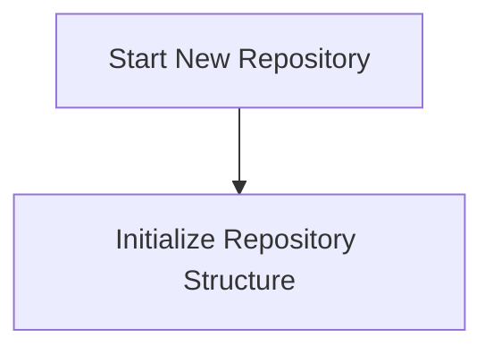
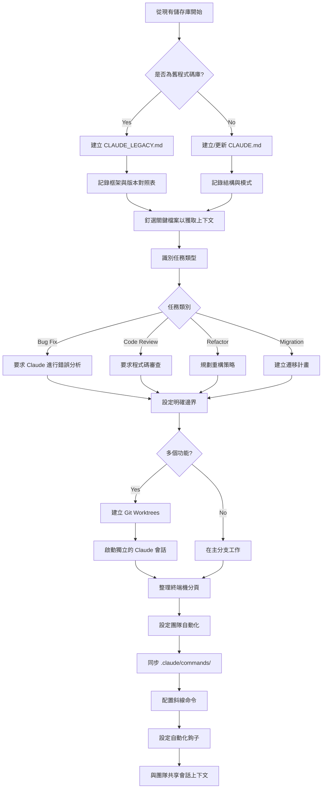

<picture>
  <source media="(prefers-color-scheme: dark)" srcset="resources/logos/claude-howto-logo-dark.svg">
  
</picture>

# 優質資源列表

## 官方文件

| 資源 | 描述 | 連結 |
|----------|-------------|------|
| Claude Code Docs | Claude Code 官方文件 | [code.claude.com/docs/en/overview](https://code.claude.com/docs/en/overview) |
| Anthropic Docs | Anthropic 完整文件 | [docs.anthropic.com](https://docs.anthropic.com) |
| MCP Protocol | Model Context Protocol 規範 | [modelcontextprotocol.io](https://modelcontextprotocol.io) |
| MCP Servers | 官方 MCP server 實作 | [github.com/modelcontextprotocol/servers](https://github.com/modelcontextprotocol/servers) |
| Anthropic Cookbook | 程式碼範例與教學 | [github.com/anthropics/anthropic-cookbook](https://github.com/anthropics/anthropic-cookbook) |
| Claude Code Skills | 社群技能儲存庫 | [github.com/anthropics/skills](https://github.com/anthropics/skills) |
| Agent Teams | 多代理協調與協作 | [code.claude.com/docs/en/agent-teams](https://code.claude.com/docs/en/agent-teams) |
| Scheduled Tasks | 使用 /loop 與 cron 的週期性任務 | [code.claude.com/docs/en/scheduled-tasks](https://code.claude.com/docs/en/scheduled-tasks) |
| Chrome Integration | 瀏覽器自動化 | [code.claude.com/docs/en/chrome](https://code.claude.com/docs/en/chrome) |
| Keybindings | 鍵盤快捷鍵自訂 | [code.claude.com/docs/en/keybindings](https://code.claude.com/docs/en/keybindings) |
| Desktop App | 原生桌面應用程式 | [code.claude.com/docs/en/desktop](https://code.claude.com/docs/en/desktop) |
| Remote Control | 遠端會話控制 | [code.claude.com/docs/en/remote-control](https://code.claude.com/docs/en/remote-control) |
| Auto Mode | 自動權限管理 | [code.claude.com/docs/en/permissions](https://code.claude.com/docs/en/permissions) |
| Channels | 多頻道通訊 | [code.claude.com/docs/en/channels](https://code.claude.com/docs/en/channels) |
| Voice Dictation | Claude Code 語音輸入 | [code.claude.com/docs/en/voice-dictation](https://code.claude.com/docs/en/voice-dictation) |

## Anthropic Engineering Blog

| 文章 | 描述 | 連結 |
|---------|-------------|------|
| Code Execution with MCP | 如何透過程式碼執行解決 MCP 上下文膨脹問題 — 減少 98.7% 的 token | [anthropic.com/engineering/code-execution-with-mcp](https://www.anthropic.com/engineering/code-execution-with-mcp) |

---

## 30 分鐘掌握 Claude Code

_影片範例_: https://www.youtube.com/watch?v=6eBSHbLKuN0

_**所有技巧**_
- **探索進階功能與捷徑**
  - 定期查看 Claude 發行說明中的新程式碼編輯與上下文功能。
  - 學習鍵盤捷徑，以便在對話、檔案與編輯器檢視之間快速切換。

- **高效設定**
  - 建立具有清晰名稱/描述的專案特定會話，以便輕鬆檢索。
  - 將最常使用的檔案或資料夾釘選，讓 Claude 隨時可以存取。
  - 設定 Claude 的整合功能（例如 GitHub、熱門 IDE），以簡化您的開發流程。

- **有效的程式碼庫問答**
  - 向 Claude 詢問關於架構、設計模式與特定模組的詳細問題。
  - 在問題中使用檔案與行號引用（例如：「`app/models/user.py` 中的邏輯是做什麼用的？」）。
  - 對於大型程式碼庫，提供摘要或清單以幫助 Claude 集中注意力。
  - **範例提示詞**：_"Can you explain the authentication flow implemented in src/auth/AuthService.ts:45-120? How does it integrate with the middleware in src/middleware/auth.ts?"_

- **程式碼編輯與重構**
  - 使用行內註解或程式碼區塊中的請求來進行針對性的編輯（例如：「重構此函式以提高清晰度」）。
  - 要求提供修改前後的對照比較。
  - 在重大編輯後，讓 Claude 生成測試或文件以進行品質保證。
  - **範例提示詞**：_"Refactor the getUserData function in api/users.js to use async/await instead of promises. Show me a before/after comparison and generate unit tests for the refactored version."_

- **上下文管理**
  - 將貼上的程式碼/上下文限制在與當前任務相關的範圍內。
  - 使用結構化提示詞（例如：「這是檔案 A，這是函式 B，我的問題是 X」）以獲得最佳效能。
  - 在提示詞視窗中移除或折疊大型檔案，以避免超過上下文限制。
  - **範例提示詞**：_"Here's the User model from models/User.js and the validateUser function from utils/validation.js. My question is: how can I add email validation while maintaining backward compatibility?"_

- **整合團隊工具**
  - 將 Claude 會話連接到您團隊的儲存庫與文件。
  - 使用內建範本或為重複性的工程任務建立自定義範本。
  - 透過與團隊成員分享會話紀錄與提示詞來進行協作。

- **提升效能**
  - 給予 Claude 清晰且目標導向的指令（例如：「用五個重點摘要這個類別」）。
  - 從上下文視窗中修剪不必要的註解與樣板程式碼。
  - 如果 Claude 的輸出偏離主題，請重置上下文或重新表述問題以獲得更好的對齊。

- **範例提示詞**：_"Summarize the DatabaseManager class in src/db/Manager.ts in five bullet points, focusing on its main responsibilities and key methods."_

- **實際應用範例**
  - 除錯：貼上錯誤訊息與堆疊追蹤（stack traces），然後詢問可能的成因與修復方法。
  - 測試生成：針對複雜邏輯要求生成基於屬性的測試（property-based tests）、單元測試或整合測試。
  - 程式碼審查：要求 Claude 識別風險變更、邊際情況或程式碼壞味道（code smells）。
  - **範例提示詞**：
    - _"I'm getting this error: 'TypeError: Cannot read property 'map' of undefined at line 42 in components/UserList.jsx'. Here's the stack trace and the relevant code. What's causing this and how can I fix it?"_
    - _"Generate comprehensive unit tests for the PaymentProcessor class, including edge cases for failed transactions, timeouts, and invalid inputs."_
    - _"Review this pull request diff and identify potential security issues, performance bottlenecks, and code smells."_

- **工作流程自動化**
  - 使用 Claude 提示詞來編寫重複性任務的腳本（例如格式化、清理與重複性的重新命名）。
  - 使用 Claude 根據程式碼差異（diffs）草擬 PR 描述、版本說明（release notes）或文件。
  - **範例提示詞**：_"Based on the git diff, create a detailed PR description with a summary of changes, list of modified files, testing steps, and potential impacts. Also generate release notes for version 2.3.0."_

**提示**：為了獲得最佳結果，請結合使用這些做法——首先釘選關鍵檔案並總結你的目標，然後使用精確的提示詞與 Claude 的重構工具來逐步改進你的程式碼庫與自動化流程。


**使用 Claude Code 的建議工作流程**

### 建議工作流程

#### 針對新儲存庫（Repository）

1. **初始化儲存庫與 Claude 整合**
   - 為你的新儲存庫建立必要的結構：README、LICENSE、.gitignore、根目錄設定。
   - 建立一個 `CLAUDE.md` 檔案，用以描述架構、高層次目標與編碼規範。
   - 安裝 Claude Code 並將其連結至你的儲存庫，以進行程式碼建議、測試腳手架（scaffolding）與工作流程自動化。

2. **使用計畫模式與規格說明**
   - 在實作功能前，使用計畫模式（`shift-tab` 或 `/plan`）來草擬詳細的規格說明。
   - 向 Claude 詢問架構建議與初步的專案佈局。
   - 保持清晰且目標導向的提示詞序列——要求生成組件輪廓、主要模組與職責。

3. **迭代開發與審查**
   - 以小規模區塊實作核心功能，並透過提示 Claude 進行程式碼生成、重構與文件撰寫。
   - 在每次增量開發後，要求生成單元測試與範例。
   - 在 CLAUDE.md 中維護一份持續更新的任務清單。

4. **自動化 CI/CD 與部署**
   - 使用 Claude 來建立 GitHub Actions、npm/yarn 腳本或部署工作流程的腳手架。
   - 透過更新你的 CLAUDE.md 並要求對應的指令/腳本，輕鬆調整流水線。



```mermaid
    B --> C[建立 README, LICENSE, .gitignore]
    C --> D[建立 CLAUDE.md]
    D --> E[記錄架構與指南]
    E --> F[安裝並連結 Claude Code]

    F --> G[進入計畫模式]
    G --> H[撰寫功能規格草案]
    H --> I[獲取架構建議]
    I --> J[定義組件與模組]

    J --> K[實作功能區塊]
    K --> L[使用 Claude 生成程式碼]
    L --> M[要求單元測試]
    M --> N[審查與重構]
    N --> O{更多功能?}
    O -->|Yes| K
    O -->|No| P[更新 CLAUDE.md 中的任務列表]

    P --> Q[設定 CI/CD 流水線]
    Q --> R[搭建 GitHub Actions 腳手架]
    R --> S[建立部署腳本]
    S --> T[測試自動化]
    T --> U[儲存庫就緒]

    style A fill:#e1f5ff
    style G fill:#fff4e1
    style K fill:#f0ffe1
    style Q fill:#ffe1f5
    style U fill:#90EE90
```

#### 針對現有儲存庫

1. **儲存庫與上下文設定**
   - 新增或更新 `CLAUDE.md` 以記錄儲存庫結構、編碼模式與關鍵檔案。對於舊有的儲存庫，請使用 `CLAUDE_LEGACY.md` 來涵蓋框架、版本對照表、指令、錯誤與升級說明。
   - 將 Claude 應該用來獲取上下文的主檔案進行釘選或重點標記。

2. **上下文程式碼問答**
   - 要求 Claude 針對特定檔案/函式進行程式碼審查、錯誤解釋、重構或遷移計畫。
   - 給予 Claude 明確的邊界（例如：「僅修改這些檔案」或「不得新增依賴項目」）。

3. **分支、Worktree 與多會話管理**
   - 使用多個 git worktree 來隔離功能開發或錯誤修復，並為每個 worktree 啟動獨立的 Claude 會話。
   - 根據分支或功能整理終端機分頁/視窗，以進行並行工作流程。

4. **團隊工具與自動化**
   - 透過 `.claude/commands/` 同步自定義命令，以確保跨團隊的一致性。
   - 透過 Claude 的斜線命令或鉤子自動化重複性任務、PR 建立與程式碼格式化。
   - 與團隊成員共享會話與上下文，以便進行協作除錯與審查。



```mermaid
    X --> Y{More Tasks?}
    Y -->|Yes| H
    Y -->|No| Z[Workflow Complete]

    style A fill:#e1f5ff
    style C fill:#ffecec
    style D fill:#fff4e1
    style P fill:#f0ffe1
    style T fill:#ffe1f5
    style Z fill:#90EE90
```

**提示**:
- 每個新功能或修復應從 spec 與 plan 模式的提示詞開始。
- 對於舊有的及複雜的專案庫，請將詳細指南存儲在 CLAUDE.md/CLAUDE_LEGACY.md 中。
- 提供清晰且專注的指令，並將複雜的工作拆解為多階段計畫。
- 定期清理會話、修剪上下文，並移除已完成的 worktrees 以避免混亂。

這些步驟涵蓋了在全新與現有程式碼庫中使用 Claude Code 實現流暢工作流程的核心建議。

---

## 新功能與能力 (2026 年 3 月)

### 關鍵功能資源

| 功能 | 描述 | 了解更多 |
|---------|-------------|------------|
| **Auto Memory** | Claude 會自動學習並在不同會話間記住您的偏好 | [Memory Guide](02-memory/) |
| **Remote Control** | 從外部工具與腳本以程式化方式控制 Claude Code 會話 | [Advanced Features](09-advanced-features/) |
| **Web Sessions** | 透過瀏覽器介面存取 Claude Code 以進行遠端開發 | [CLI Reference](10-cli/) |
| **Desktop App** | 具有增強 UI 的 Claude Code 原生桌面應用程式 | [Claude Code Docs](https://code.claude.com/docs/en/desktop) |
| **Extended Thinking** | 透過 `Alt+T`/`Option+T` 或 `MAX_THINKING_TOKENS` 環境變數切換深度推理 | [Advanced Features](09-advanced-features/) |
| **Permission Modes** | 細粒度控制：default, acceptEdits, plan, auto, dontAsk, bypassPermissions | [Advanced Features](09-advanced-features/) |
| **7-Tier Memory** | 管理層級包含：Managed Policy, Project, Project Rules, User, User Rules, Local, Auto Memory | [Memory Guide](02-memory/) |
| **Hook Events** | 25 個事件：PreToolUse, PostToolUse, PostToolUseFailure, Stop, StopFailure, SubagentStart, SubagentStop, Notification, Elicitation 等 | [Hooks Guide](06-hooks/) |
| **Agent Teams** | 協調多個代理共同處理複雜任務 | [Subagents Guide](04-subagents/) |
| **Scheduled Tasks** | 使用 `/loop` 與 cron 工具設定週期性任務 | [Advanced Features](09-advanced-features/) |
| **Chrome Integration** | 使用 headless Chromium 進行瀏覽器自動化 | [Advanced Features](09-advanced-features/) |
| **Keyboard Customization** | 自定義按鍵綁定，包含組合鍵序列 | [Advanced Features](09-advanced-features/) |
| **Monitor Tool** | 監控背景指令的 stdout 串流並對事件做出反應，而非輪詢 (v2.1.98+) | [Advanced Features](09-advanced-features/) |

---
**最後更新日期**: 2026 年 4 月 16 日
**Claude Code 版本**: 2.1.112
**來源**:
- https://docs.anthropic.com/en/docs/claude-code
- https://www.anthropic.com/news/claude-opus-4-7
- https://support.claude.com/en/articles/12138966-release-notes
**相容模型**: Claude Sonnet 4.6, Claude Opus 4.7, Claude Haiku 4.5
