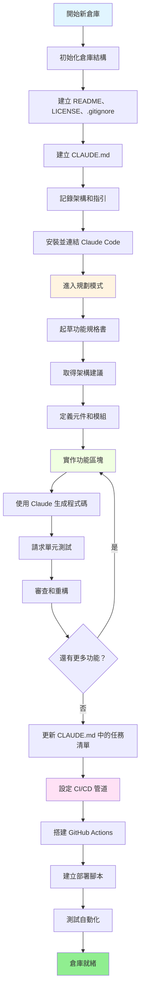
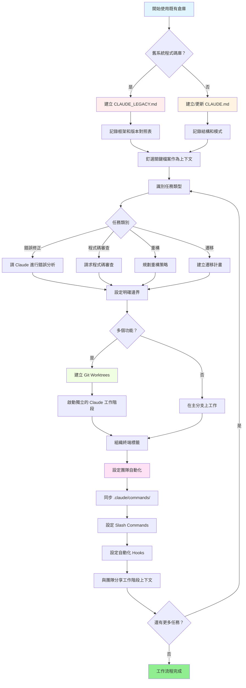

<picture>
  <source media="(prefers-color-scheme: dark)" srcset="resources/logos/claude-howto-logo-dark.svg">
  
</picture>

# 優質資源列表

## 官方文件

| 資源 | 描述 | 連結 |
|----------|-------------|------|
| Claude Code Docs | Claude Code 官方文件 | [code.claude.com/docs/en/overview](https://code.claude.com/docs/en/overview) |
| Anthropic Docs | 完整的 Anthropic 文件 | [docs.anthropic.com](https://docs.anthropic.com) |
| MCP Protocol | Model Context Protocol 規範 | [modelcontextprotocol.io](https://modelcontextprotocol.io) |
| MCP Servers | 官方 MCP 伺服器實作 | [github.com/modelcontextprotocol/servers](https://github.com/modelcontextprotocol/servers) |
| Anthropic Cookbook | 程式碼範例和教學 | [github.com/anthropics/anthropic-cookbook](https://github.com/anthropics/anthropic-cookbook) |
| Claude Code Skills | 社群技能倉庫 | [github.com/anthropics/skills](https://github.com/anthropics/skills) |
| Agent Teams | 多代理協調與協作 | [code.claude.com/docs/en/agent-teams](https://code.claude.com/docs/en/agent-teams) |
| Scheduled Tasks | 使用 /loop 和 cron 的排程任務 | [code.claude.com/docs/en/scheduled-tasks](https://code.claude.com/docs/en/scheduled-tasks) |
| Chrome Integration | 瀏覽器自動化 | [code.claude.com/docs/en/chrome](https://code.claude.com/docs/en/chrome) |
| Keybindings | 鍵盤快捷鍵自訂 | [code.claude.com/docs/en/keybindings](https://code.claude.com/docs/en/keybindings) |
| Desktop App | 原生桌面應用程式 | [code.claude.com/docs/en/desktop](https://code.claude.com/docs/en/desktop) |
| Remote Control | 遠端工作階段控制 | [code.claude.com/docs/en/remote-control](https://code.claude.com/docs/en/remote-control) |
| Auto Mode | 自動權限管理 | [code.claude.com/docs/en/auto-mode](https://code.claude.com/docs/en/auto-mode) |
| Channels | 多頻道通訊 | [code.claude.com/docs/en/channels](https://code.claude.com/docs/en/channels) |
| Voice Dictation | Claude Code 的語音輸入 | [code.claude.com/docs/en/voice-dictation](https://code.claude.com/docs/en/voice-dictation) |

## Anthropic 工程部落格

| 文章 | 描述 | 連結 |
|---------|-------------|------|
| Code Execution with MCP | 如何使用程式碼執行解決 MCP 上下文膨脹問題 — 減少 98.7% 的 token 使用量 | [anthropic.com/engineering/code-execution-with-mcp](https://www.anthropic.com/engineering/code-execution-with-mcp) |

---

## 30 分鐘掌握 Claude Code

_影片_: https://www.youtube.com/watch?v=6eBSHbLKuN0

_**所有技巧**_
- **探索進階功能和快捷鍵**
  - 定期查閱 Claude 在發行說明中的新程式碼編輯和上下文功能。
  - 學習鍵盤快捷鍵以快速切換聊天、檔案和編輯器視圖。

- **高效設定**
  - 建立具有清晰名稱/描述的專案特定工作階段，便於檢索。
  - 釘選最常使用的檔案或資料夾，讓 Claude 隨時可以存取。
  - 設定 Claude 的整合（例如 GitHub、熱門 IDE）以簡化你的編碼流程。

- **有效的程式碼庫問答**
  - 向 Claude 詢問關於架構、設計模式和特定模組的詳細問題。
  - 在問題中使用檔案和行號參考（例如「`app/models/user.py` 中的邏輯完成了什麼功能？」）。
  - 對於大型程式碼庫，提供摘要或清單來幫助 Claude 聚焦。
  - **範例提示**: _「你能解釋一下 src/auth/AuthService.ts:45-120 中實作的認證流程嗎？它如何與 src/middleware/auth.ts 中的中介軟體整合？」_

- **程式碼編輯與重構**
  - 使用內聯註解或在程式碼區塊中的請求來獲得聚焦的編輯（「重構此函式以提高清晰度」）。
  - 要求前後對比。
  - 讓 Claude 在主要編輯後生成測試或文件以確保品質。
  - **範例提示**: _「將 api/users.js 中的 getUserData 函式從 promises 重構為使用 async/await。展示前後對比，並為重構版本生成單元測試。」_

- **上下文管理**
  - 將貼上的程式碼/上下文限制在與當前任務相關的內容。
  - 使用結構化提示（「這是檔案 A，這是函式 B，我的問題是 X」）以獲得最佳效能。
  - 在提示視窗中移除或折疊大型檔案，避免超出上下文限制。
  - **範例提示**: _「這是 models/User.js 中的 User 模型和 utils/validation.js 中的 validateUser 函式。我的問題是：如何在保持向後相容性的同時新增電子郵件驗證？」_

- **整合團隊工具**
  - 將 Claude 工作階段連接到你的團隊倉庫和文件。
  - 使用內建範本或為重複的工程任務建立自訂範本。
  - 透過分享工作階段記錄和提示與隊友協作。

- **提升效能**
  - 給 Claude 清晰、目標導向的指令（例如「用五個要點總結這個類別」）。
  - 從上下文視窗中移除不必要的註解和樣板程式碼。
  - 如果 Claude 的輸出偏離方向，重設上下文或重新措辭問題以更好地對齊。
  - **範例提示**: _「用五個要點總結 src/db/Manager.ts 中的 DatabaseManager 類別，聚焦於其主要職責和關鍵方法。」_

- **實際使用範例**
  - 除錯：貼上錯誤和堆疊追蹤，然後詢問可能的原因和修正方法。
  - 測試生成：請求針對複雜邏輯的屬性式、單元或整合測試。
  - 程式碼審查：請 Claude 識別風險變更、邊界情況或程式碼異味。
  - **範例提示**:
    - _「我收到這個錯誤：'TypeError: Cannot read property 'map' of undefined at line 42 in components/UserList.jsx'。這是堆疊追蹤和相關程式碼。是什麼造成的？如何修正？」_
    - _「為 PaymentProcessor 類別生成全面的單元測試，包含失敗交易、逾時和無效輸入的邊界情況。」_
    - _「審查這個 pull request 差異，識別潛在的安全問題、效能瓶頸和程式碼異味。」_

- **工作流程自動化**
  - 使用 Claude 提示來腳本化重複性任務（如格式化、清理和重複性重新命名）。
  - 使用 Claude 根據程式碼差異撰寫 PR 描述、發行說明或文件。
  - **範例提示**: _「根據 git diff，建立詳細的 PR 描述，包含變更摘要、修改的檔案列表、測試步驟和潛在影響。同時生成 2.3.0 版本的發行說明。」_

**提示**: 為了獲得最佳結果，結合多種實踐方法——從釘選關鍵檔案和總結目標開始，然後使用聚焦的提示和 Claude 的重構工具來逐步改善你的程式碼庫和自動化。

**使用 Claude Code 的建議工作流程**

### 使用 Claude Code 的建議工作流程

#### 新倉庫

1. **初始化倉庫和 Claude 整合**
   - 設定你的新倉庫，包含基本結構：README、LICENSE、.gitignore、根目錄配置。
   - 建立 `CLAUDE.md` 檔案，描述架構、高層級目標和編碼指引。
   - 安裝 Claude Code 並將其連結到你的倉庫，用於程式碼建議、測試框架搭建和工作流程自動化。

2. **使用規劃模式和規格書**
   - 使用規劃模式（`shift-tab` 或 `/plan`）在實作功能前起草詳細的規格書。
   - 向 Claude 詢問架構建議和初始專案佈局。
   - 保持清晰、目標導向的提示序列——詢問元件概要、主要模組和職責。

3. **迭代開發與審查**
   - 以小區塊實作核心功能，提示 Claude 進行程式碼生成、重構和文件撰寫。
   - 在每個增量後請求單元測試和範例。
   - 在 CLAUDE.md 中維護運行中的任務清單。

4. **自動化 CI/CD 和部署**
   - 使用 Claude 搭建 GitHub Actions、npm/yarn 腳本或部署工作流程。
   - 透過更新 CLAUDE.md 並請求相應的指令/腳本來輕鬆調整管道。

#### 既有倉庫

1. **倉庫和上下文設定**
   - 新增或更新 `CLAUDE.md` 以記錄倉庫結構、編碼模式和關鍵檔案。對於舊系統倉庫，使用 `CLAUDE_LEGACY.md` 涵蓋框架、版本對照表、指令、錯誤和升級注意事項。
   - 釘選或標示 Claude 應使用作為上下文的主要檔案。

2. **上下文程式碼問答**
   - 向 Claude 請求程式碼審查、錯誤解釋、重構或遷移計畫，引用特定檔案/函式。
   - 給 Claude 明確的邊界（例如「只修改這些檔案」或「不要新增依賴」）。

3. **分支、Worktree 和多工作階段管理**
   - 使用多個 git worktree 進行隔離的功能開發或錯誤修正，並為每個 worktree 啟動獨立的 Claude 工作階段。
   - 按分支或功能組織終端標籤/視窗，以實現並行工作流程。

4. **團隊工具和自動化**
   - 透過 `.claude/commands/` 同步自訂指令，確保跨團隊一致性。
   - 透過 Claude 的 slash commands 或 hooks 自動化重複性任務、PR 建立和程式碼格式化。
   - 與團隊成員分享工作階段和上下文，進行協作疑難排解和審查。

**提示**:
- 每個新功能或修正都從規格書和規劃模式提示開始。
- 對於舊系統和複雜倉庫，在 CLAUDE.md/CLAUDE_LEGACY.md 中儲存詳細指引。
- 給出清晰、聚焦的指令，將複雜工作分解為多階段計畫。
- 定期清理工作階段、修剪上下文並移除已完成的 worktree，避免混亂。

這些步驟涵蓋了在新舊程式碼庫中順暢使用 Claude Code 工作流程的核心建議。

---

## 新功能和能力（2026 年 3 月）

### 關鍵功能資源

| 功能 | 描述 | 了解更多 |
|---------|-------------|------------|
| **Auto Memory** | Claude 自動學習並記住你跨工作階段的偏好 | [記憶體指南](02-memory/) |
| **Remote Control** | 從外部工具和腳本以程式方式控制 Claude Code 工作階段 | [進階功能](09-advanced-features/) |
| **Web Sessions** | 透過瀏覽器介面存取 Claude Code 進行遠端開發 | [CLI 參考](10-cli/) |
| **Desktop App** | Claude Code 的原生桌面應用程式，提供增強的使用者介面 | [Claude Code Docs](https://code.claude.com/docs/en/desktop) |
| **Extended Thinking** | 深度推理切換，透過 `Alt+T`/`Option+T` 或 `MAX_THINKING_TOKENS` 環境變數 | [進階功能](09-advanced-features/) |
| **Permission Modes** | 細粒度控制：default、acceptEdits、plan、auto、dontAsk、bypassPermissions | [進階功能](09-advanced-features/) |
| **7 層記憶體** | Managed Policy、Project、Project Rules、User、User Rules、Local、Auto Memory | [記憶體指南](02-memory/) |
| **Hook Events** | 25 個事件：PreToolUse、PostToolUse、PostToolUseFailure、Stop、StopFailure、SubagentStart、SubagentStop、Notification、Elicitation 等 | [Hooks 指南](06-hooks/) |
| **Agent Teams** | 協調多個代理在複雜任務上協同工作 | [Subagents 指南](04-subagents/) |
| **Scheduled Tasks** | 使用 `/loop` 和 cron 工具設定排程任務 | [進階功能](09-advanced-features/) |
| **Chrome Integration** | 使用無頭 Chromium 進行瀏覽器自動化 | [進階功能](09-advanced-features/) |
| **Keyboard Customization** | 自訂鍵盤快捷鍵，包含組合鍵序列 | [進階功能](09-advanced-features/) |

