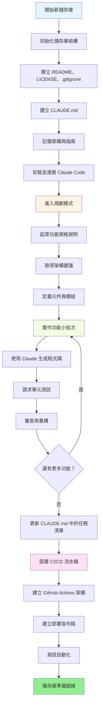
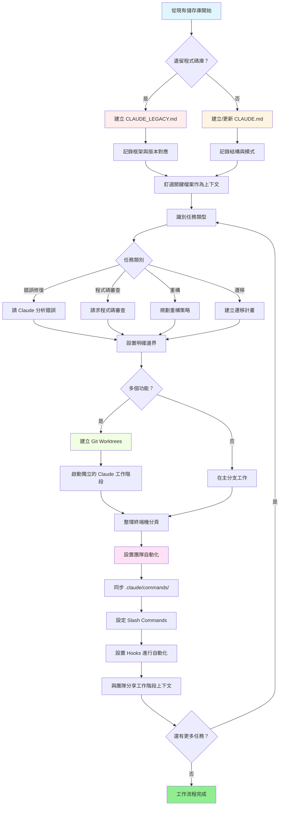

<picture>
  <source media="(prefers-color-scheme: dark)" srcset="resources/logos/claude-howto-logo-dark.svg">
  
</picture>

# 優質資源清單

## 官方文件

| 資源 | 說明 | 連結 |
|----------|-------------|------|
| Claude Code 文件 | Claude Code 官方文件 | [code.claude.com/docs/en/overview](https://code.claude.com/docs/en/overview) |
| Anthropic 文件 | Anthropic 完整文件 | [docs.anthropic.com](https://docs.anthropic.com) |
| MCP 協定 | Model Context Protocol 規範 | [modelcontextprotocol.io](https://modelcontextprotocol.io) |
| MCP 伺服器 | 官方 MCP 伺服器實作 | [github.com/modelcontextprotocol/servers](https://github.com/modelcontextprotocol/servers) |
| Anthropic Cookbook | 程式碼範例與教學 | [github.com/anthropics/anthropic-cookbook](https://github.com/anthropics/anthropic-cookbook) |
| Claude Code Skills | 社群 skills 儲存庫 | [github.com/anthropics/skills](https://github.com/anthropics/skills) |
| Agent Teams | 多代理協調與協作 | [code.claude.com/docs/en/agent-teams](https://code.claude.com/docs/en/agent-teams) |
| Scheduled Tasks | 使用 /loop 和 cron 的週期性任務 | [code.claude.com/docs/en/scheduled-tasks](https://code.claude.com/docs/en/scheduled-tasks) |
| Chrome Integration | 瀏覽器自動化 | [code.claude.com/docs/en/chrome](https://code.claude.com/docs/en/chrome) |
| Keybindings | 鍵盤快速鍵自訂 | [code.claude.com/docs/en/keybindings](https://code.claude.com/docs/en/keybindings) |
| Desktop App | 原生桌面應用程式 | [code.claude.com/docs/en/desktop](https://code.claude.com/docs/en/desktop) |
| Remote Control | 遠端工作階段控制 | [code.claude.com/docs/en/remote-control](https://code.claude.com/docs/en/remote-control) |
| Auto Mode | 自動權限管理 | [code.claude.com/docs/en/auto-mode](https://code.claude.com/docs/en/auto-mode) |
| Channels | 多管道通訊 | [code.claude.com/docs/en/channels](https://code.claude.com/docs/en/channels) |
| Voice Dictation | Claude Code 的語音輸入 | [code.claude.com/docs/en/voice-dictation](https://code.claude.com/docs/en/voice-dictation) |

## Anthropic 工程部落格

| 文章 | 說明 | 連結 |
|---------|-------------|------|
| Code Execution with MCP | 如何使用程式碼執行解決 MCP 上下文膨脹問題 — 減少 98.7% 的 token 用量 | [anthropic.com/engineering/code-execution-with-mcp](https://www.anthropic.com/engineering/code-execution-with-mcp) |

---

## 30 分鐘精通 Claude Code

_影片_：https://www.youtube.com/watch?v=6eBSHbLKuN0

_**全部技巧**_
- **探索進階功能與快捷鍵**
  - 定期查看 Claude 的版本說明，了解新的程式碼編輯與上下文功能。
  - 學習鍵盤快捷鍵，快速切換聊天、檔案和編輯器檢視。

- **高效設置**
  - 建立具有清晰名稱與說明的專案專屬工作階段，方便日後查找。
  - 釘選最常用的檔案或資料夾，讓 Claude 隨時可以存取。
  - 設置 Claude 的整合功能（例如 GitHub、主流 IDE），簡化您的編程流程。

- **有效的程式碼庫問答**
  - 向 Claude 詢問架構、設計模式和特定模組的詳細問題。
  - 在問題中使用檔案和行號參考（例如：「`app/models/user.py` 中的邏輯完成了什麼？」）。
  - 對於大型程式碼庫，提供摘要或清單以幫助 Claude 聚焦。
  - **提示範例**：_「你能解釋 src/auth/AuthService.ts:45-120 中實作的身份驗證流程嗎？它如何與 src/middleware/auth.ts 中的中介軟體整合？」_

- **程式碼編輯與重構**
  - 在程式碼區塊中使用行內注解或請求以獲得精準編輯（「重構此函式使其更清晰」）。
  - 要求前後對比。
  - 在重大修改後讓 Claude 生成測試或文件以確保品質。
  - **提示範例**：_「重構 api/users.js 中的 getUserData 函式，使用 async/await 取代 promises。展示前後對比，並為重構後的版本生成單元測試。」_

- **上下文管理**
  - 只貼上與目前任務相關的程式碼/上下文。
  - 使用結構化提示（「這是檔案 A，這是函式 B，我的問題是 X」）以獲得最佳效果。
  - 移除或折疊提示視窗中的大型檔案，避免超出上下文限制。
  - **提示範例**：_「這是來自 models/User.js 的 User 模型，以及來自 utils/validation.js 的 validateUser 函式。我的問題是：如何在保持向下相容的同時新增電子郵件驗證？」_

- **整合團隊工具**
  - 將 Claude 工作階段連接到您團隊的儲存庫和文件。
  - 使用內建範本或為重複性的工程任務建立自訂範本。
  - 與隊友分享工作階段記錄和提示以進行協作。

- **提升效能**
  - 給 Claude 清晰、目標導向的指令（例如：「用五個重點摘要這個類別」）。
  - 從上下文視窗中刪除不必要的注解和樣板程式碼。
  - 若 Claude 的輸出方向偏差，重置上下文或重新措辭問題以獲得更好的結果。
  - **提示範例**：_「用五個重點摘要 src/db/Manager.ts 中的 DatabaseManager 類別，聚焦於其主要職責和關鍵方法。」_

- **實際應用範例**
  - 除錯：貼上錯誤和堆疊追蹤，然後詢問可能的原因和修復方式。
  - 測試生成：為複雜邏輯請求基於屬性、單元或整合測試。
  - 程式碼審查：請 Claude 識別有風險的變更、邊界案例或程式碼異味。
  - **提示範例**：
    - _「我遇到這個錯誤：'TypeError: Cannot read property 'map' of undefined at line 42 in components/UserList.jsx'。這是堆疊追蹤和相關程式碼。是什麼原因造成的？如何修復？」_
    - _「為 PaymentProcessor 類別生成全面的單元測試，包括交易失敗、逾時和無效輸入的邊界案例。」_
    - _「審查這個 pull request 差異，識別潛在的資安問題、效能瓶頸和程式碼異味。」_

- **工作流程自動化**
  - 使用 Claude 提示將重複性任務（如格式化、清理和重複重命名）自動化。
  - 使用 Claude 根據程式碼差異起草 PR 說明、版本說明或文件。
  - **提示範例**：_「根據 git diff，建立詳細的 PR 說明，包含變更摘要、修改檔案清單、測試步驟和潛在影響。同時為版本 2.3.0 生成版本說明。」_

**提示**：為獲得最佳效果，結合多種實踐方式 — 從釘選關鍵檔案和摘要目標開始，然後使用精準的提示和 Claude 的重構工具逐步改善您的程式碼庫和自動化流程。

**與 Claude Code 的推薦工作流程**

### 與 Claude Code 的推薦工作流程

#### 新增儲存庫

1. **初始化儲存庫與 Claude 整合**
   - 建立具有基本結構的新儲存庫：README、LICENSE、.gitignore、根目錄設定。
   - 建立描述架構、高層目標和編碼指南的 `CLAUDE.md` 檔案。
   - 安裝 Claude Code 並連接至您的儲存庫，以獲得程式碼建議、測試架構和工作流程自動化。

2. **使用規劃模式與規格說明**
   - 使用規劃模式（`shift-tab` 或 `/plan`）在實作功能前起草詳細規格說明。
   - 向 Claude 詢問架構建議和初始專案架構。
   - 保持清晰、目標導向的提示順序 — 詢問元件概覽、主要模組和職責。

3. **迭代開發與審查**
   - 以小批次實作核心功能，提示 Claude 生成程式碼、重構和撰寫文件。
   - 每次增量後請求單元測試和範例。
   - 在 CLAUDE.md 中維護持續更新的任務清單。

4. **自動化 CI/CD 和部署**
   - 使用 Claude 建立 GitHub Actions、npm/yarn 指令稿或部署工作流程的架構。
   - 透過更新 CLAUDE.md 並請求對應的指令/指令稿，輕鬆調整流水線。

#### 現有儲存庫

1. **儲存庫與上下文設置**
   - 新增或更新 `CLAUDE.md`，記錄儲存庫結構、編碼模式和關鍵檔案。對於遺留儲存庫，使用 `CLAUDE_LEGACY.md`，涵蓋框架、版本對應、說明、錯誤和升級注意事項。
   - 釘選或標記 Claude 應用於上下文的主要檔案。

2. **上下文程式碼問答**
   - 請 Claude 進行程式碼審查、錯誤解釋、重構或遷移計畫，並參考特定檔案/函式。
   - 給 Claude 明確的邊界（例如：「只修改這些檔案」或「不引入新的相依套件」）。

3. **分支、Worktree 和多工作階段管理**
   - 使用多個 Git worktrees 處理獨立的功能或錯誤修復，並為每個 worktree 啟動獨立的 Claude 工作階段。
   - 依分支或功能整理終端機分頁/視窗以進行平行工作流程。

4. **團隊工具與自動化**
   - 透過 `.claude/commands/` 同步自訂指令以確保跨團隊一致性。
   - 透過 Claude 的 slash commands 或 hooks 自動化重複性任務、PR 建立和程式碼格式化。
   - 與團隊成員分享工作階段和上下文，以進行協作疑難排解和審查。

**技巧**：
- 每個新功能或修復都從規格說明和規劃模式提示開始。
- 對於遺留和複雜的儲存庫，在 CLAUDE.md/CLAUDE_LEGACY.md 中儲存詳細指南。
- 給出清晰、聚焦的指令，並將複雜工作分解為多階段計畫。
- 定期清理工作階段、修剪上下文，並移除已完成的 worktrees 以避免混亂。

以上步驟涵蓋了在新舊程式碼庫中與 Claude Code 順暢協作的核心建議。

---

## 新功能與能力（2026 年 3 月）

### 關鍵功能資源

| 功能 | 說明 | 深入瞭解 |
|---------|-------------|------------|
| **Auto Memory** | Claude 自動學習並記住您跨工作階段的偏好 | [Memory 指南](02-memory/) |
| **Remote Control** | 以程式化方式從外部工具和指令稿控制 Claude Code 工作階段 | [Advanced Features](09-advanced-features/) |
| **Web Sessions** | 透過基於瀏覽器的介面進行遠端開發存取 Claude Code | [CLI 參考](10-cli/) |
| **Desktop App** | 具有增強 UI 的 Claude Code 原生桌面應用程式 | [Claude Code 文件](https://code.claude.com/docs/en/desktop) |
| **Extended Thinking** | 透過 `Alt+T`/`Option+T` 或 `MAX_THINKING_TOKENS` 環境變數切換深度推理 | [Advanced Features](09-advanced-features/) |
| **Permission Modes** | 細粒度控制：default、acceptEdits、plan、auto、dontAsk、bypassPermissions | [Advanced Features](09-advanced-features/) |
| **7-Tier Memory** | Managed Policy、Project、Project Rules、User、User Rules、Local、Auto Memory | [Memory 指南](02-memory/) |
| **Hook Events** | 25 個事件：PreToolUse、PostToolUse、PostToolUseFailure、Stop、StopFailure、SubagentStart、SubagentStop、Notification、Elicitation 等 | [Hooks 指南](06-hooks/) |
| **Agent Teams** | 協調多個代理共同處理複雜任務 | [Subagents 指南](04-subagents/) |
| **Scheduled Tasks** | 使用 `/loop` 和 cron 工具設定週期性任務 | [Advanced Features](09-advanced-features/) |
| **Chrome Integration** | 使用 headless Chromium 進行瀏覽器自動化 | [Advanced Features](09-advanced-features/) |
| **Keyboard Customization** | 自訂按鍵綁定，包含和弦序列 | [Advanced Features](09-advanced-features/) |
